

  

<h3>Universidad Peruana de Ciencias Aplicadas</h3>
<h3>Ingeniería de Software</h3>

<h4>1ASI0572 - Desarrollo de Soluciones IOT 202610</h4>

<h4>NRC: 8740</h4>

<h4>Docente: Verla Olivera, David Carlos</h4>

<h3>Informe de "AV1"</h3>

<h4>Nombre del Startup: Condomia</h4>
<h4>Nombre del Producto: Edifika</h4>

 

<h4>Integrantes:</h4>

<table style="border-collapse: collapse;">
  <thead>
    <tr>
      <th style="border: 1px solid black;">Alumno</th>
      <th style="border: 1px solid black;">Codigo</th>
    </tr>
  </thead>
  <tbody>
    <tr><td style="border: 1px solid black;">Acuña Corahua, Jonatan Ariel</td><td style="border: 1px solid black;">u20211b995</td></tr>
    <tr><td style="border: 1px solid black;">Collantes Carrillo, Diego Mateo</td><td style="border: 1px solid black;">u2023</td></tr>
    <tr><td style="border: 1px solid black;">Landa Ortiz, Sergio Javier</td><td style="border: 1px solid black;">u202311086</td></tr>
    <tr><td style="border: 1px solid black;">Ortiz Cardenas, Johanna Antuanete</td><td style="border: 1px solid black;">u202310358</td></tr>
    <tr><td style="border: 1px solid black;">Perez Tuesta, Gabriel</td><td style="border: 1px solid black;">u202321281</td></tr>
    <tr><td style="border: 1px solid black;">Lizarbe Alvarez, Ariana Nickole/td><td style="border: 1px solid black;">u2023</td></tr>
    <tr><td style="border: 1px solid black;">Sarmiento Medina, Loreley</td><td style="border: 1px solid black;">u202310005</td></tr>
  </tbody>
</table>
 

<h4>Setiembre, 2026</h4>

## Registro de Versiones del Informe

I
<table>
  <thead>
    <tr>
      <th>Versión</th>
      <th>Fecha</th>
      <th>Autor</th>
      <th>Descripción de modificación</th>
    </tr>
  </thead>
  <tbody>
    <tr>
      <td>1.0.0</td>
      <td>30/08/2026</td>
      <td>Acuña Corahua, Jonatan Ariel</td>
      <td>Estructuración inicial del informe de proyecto y organización de carpetas por capítulos según las pautas del trabajo final.</td>
    </tr>
    <tr>
      <td>1.1.0</td>
      <td>04/09/2026</td>
      <td>Acuña Corahua, Jonatan Ariel</td>
      <td>Migración de contenidos base del proyecto y organización inicial de los recursos gráficos en el directorio de assets.</td>
    </tr>
    <tr>
      <td>1.2.0</td>
      <td>05/09/2026</td>
      <td>Acuña Corahua, Jonatan Ariel</td>
      <td>Configuración del entorno Docker y pipeline automatizado para compilación del informe a formato PDF con Pandoc y plantilla Eisvogel.</td>
    </tr>
    <tr>
      <td>1.3.0</td>
      <td>06/09/2026</td>
      <td>Acuña Corahua, Jonatan Ariel</td>
      <td>Desarrollo del filtro Lua personalizado para el ajuste automático de anchos de columnas y bordes en tablas complejas del PDF.</td>
    </tr>
    <tr>
      <td>1.4.0</td>
      <td>08/09/2026</td>
      <td>Acuña Corahua, Jonatan Ariel</td>
      <td>Modelado inicial de la arquitectura del sistema C4 (Landscape, Context, Container y Deployment Views) mediante Structurizr DSL.</td>
    </tr>
    <tr>
      <td>1.5.0</td>
      <td>10/09/2026</td>
      <td>Acuña Corahua, Jonatan Ariel</td>
      <td>Especificación de los Bounded Contexts estratégicos y redacción preliminar de la arquitectura de microservicios en el Capítulo IV.</td>
    </tr>
    <tr>
      <td>1.6.0</td>
      <td>11/09/2026</td>
      <td>Acuña Corahua, Jonatan Ariel</td>
      <td>Definición del Design-Level EventStorming para la extensión IoT, catalogación estructurada de eventos y exportación de datos en CSV.</td>
    </tr>
    <tr>
      <td>1.7.0</td>
      <td>12/09/2026</td>
      <td>Acuña Corahua, Jonatan Ariel</td>
      <td>Elaboración de diagramas de Domain Storytelling en PlantUML para los flujos de colaboración entre Bounded Contexts.</td>
    </tr>
    <tr>
      <td>1.8.0</td>
      <td>12/09/2026</td>
      <td>Acuña Corahua, Jonatan Ariel</td>
      <td>Actualización del modelo C4 en Structurizr DSL con microservicios IoT, nivel Edge Computing on-premise y nodos físicos ESP32.</td>
    </tr>
    <tr>
      <td>1.9.0</td>
      <td>13/09/2026</td>
      <td>Acuña Corahua, Jonatan Ariel</td>
      <td>Modelado táctico DDD (diagramas de clases para servicios IoT), diseño de persistencia híbrida (PostgreSQL y TimescaleDB) y consolidación integral del Capítulo IV.</td>
    </tr>
    <tr>
      <td>AV1</td>
      <td>18/09/2026</td>
      <td>
        - Acuña Corahua, Jonatan Ariel  
        - Collantes Carrillo, Diego Mateo  
        - Landa Ortiz, Sergio Javier  
        - Ortiz Cardenas, Johanna Antuanete  
        - Perez Tuesta, Gabriel  
        - Lizarbe Alvarez, Ariana Nickole  
        - Sarmiento Medina, Loreley
      </td>
      <td>
        - Capítulo I: Introducción  
        - Capítulo II: Requirements Elicitation & Analysis  
        - Capítulo III: Requirements Specification  
        - Capítulo IV: Solution Software Design
      </td>
    </tr>
  </tbody>
</table>

## **Project Report Collaboration Insights**

AV1 (20/09/2026):

## **Contenido**
- [CAPÍTULO I: Introducción](#capítulo-i-introducción)
  - [1.1. Startup Profile](#11-startup-profile)
    - [1.1.1. Descripción de la Startup](#111-descripción-de-la-startup)
    - [1.1.2. Perfiles de integrantes del equipo](#112-perfiles-de-integrantes-del-equipo)
  - [1.2. Solution Profile](#12-solution-profile)
    - [1.2.1. Antecedentes y problemática](#121-antecedentes-y-problemática)
    - [1.2.2. Lean UX Process](#122-lean-ux-process)
      - [1.2.2.1. Lean UX Problem Statements](#1221-lean-ux-problem-statements)
      - [1.2.2.2. Lean UX Assumptions](#1222-lean-ux-assumptions)
      - [1.2.2.3. Lean UX Hypothesis Statements](#1223-lean-ux-hypothesis-statements)
      - [1.2.2.4. Lean UX Canvas](#1224-lean-ux-canvas)
  - [1.3. Segmentos objetivo](#13-segmentos-objetivo)
- [CAPÍTULO II: Requirements Elicitation & Analysis](#capítulo-ii-requirements-elicitation--analysis)
  - [2.1. Competidores](#21-competidores)
    - [2.1.1. Análisis competitivo](#211-análisis-competitivo)
    - [2.1.2. Estrategias y tácticas frente a competidores](#212-estrategias-y-tácticas-frente-a-competidores)
  - [2.2. Entrevistas](#22-entrevistas)
    - [2.2.1. Diseño de entrevistas](#221-diseño-de-entrevistas)
    - [2.2.2. Registro de entrevistas](#222-registro-de-entrevistas)
    - [2.2.3. Análisis de entrevistas](#223-análisis-de-entrevistas)
  - [2.3. Needfinding](#23-needfinding)
    - [2.3.1. User Personas](#231-user-personas)
    - [2.3.2. User Task Matrix](#232-user-task-matrix)
    - [2.3.3. User Journey Mapping](#233-user-journey-mapping)
    - [2.3.4. Empathy Mapping](#234-empathy-mapping)
  - [2.4. Big Picture EventStorming](#24-big-picture-eventstorming)
  - [2.5. Ubiquitous Language](#25-ubiquitous-language)
- [CAPÍTULO III: Requirements Specification](#capítulo-iii-requirements-specification)
  - [3.1. User Stories](#31-user-stories)
  - [3.2. Impact Mapping](#32-impact-mapping)
  - [3.3. Product Backlog](#33-product-backlog)
- [CAPÍTULO IV: Solution Software Design](#capítulo-iv-solution-software-design)
  - [4.1. Strategic-Level Domain-Driven Design](#41-strategic-level-domain-driven-design)
    - [4.1.1. Design-Level EventStorming](#411-design-level-eventstorming)
      - [4.1.1.1. Candidate Context Discovery](#4111-candidate-context-discovery)
      - [4.1.1.2. Domain Message Flows Modeling](#4112-domain-message-flows-modeling)
      - [4.1.1.3. Bounded Context Canvases](#4113-bounded-context-canvases)
    - [4.1.2. Context Mapping](#412-context-mapping)
    - [4.1.3. Software Architecture](#413-software-architecture)
      - [4.1.3.1. Software Architecture System Landscape Diagram](#4131-software-architecture-system-landscape-diagram)
      - [4.1.3.2. Software Architecture Context Level Diagrams](#4132-software-architecture-context-level-diagrams)
      - [4.1.3.3. Software Architecture Container Level Diagrams](#4133-software-architecture-container-level-diagrams)
      - [4.1.3.4. Software Architecture Deployment Diagrams](#4134-software-architecture-deployment-diagrams)
    - [4.1.4. Atributos de Calidad y Presupuesto de Rendimiento](#414-atributos-de-calidad-y-presupuesto-de-rendimiento)
      - [4.1.4.1. Presupuesto de latencia](#4141-presupuesto-de-latencia)
      - [4.1.4.2. Seguridad](#4142-seguridad)
      - [4.1.4.3. Concurrencia y consistencia](#4143-concurrencia-y-consistencia)
      - [4.1.4.4. Degradación y tolerancia a fallos](#4144-degradación-y-tolerancia-a-fallos)
  - [4.2. Tactical-Level Domain-Driven Design](#42-tactical-level-domain-driven-design)
    - [4.2.1. Bounded Context: IAM / Auth](#421-bounded-context-iam--auth)
      - [4.2.1.1. Domain Layer](#4211-domain-layer)
      - [4.2.1.2. Interface Layer](#4212-interface-layer)
      - [4.2.1.3. Application Layer](#4213-application-layer)
      - [4.2.1.4. Infrastructure Layer](#4214-infrastructure-layer)
      - [4.2.1.5. Bounded Context Software Architecture Component Level Diagrams](#4215-bounded-context-software-architecture-component-level-diagrams)
      - [4.2.1.6. Bounded Context Software Architecture Code Level Diagrams](#4216-bounded-context-software-architecture-code-level-diagrams)
        - [4.2.1.6.1. Bounded Context Domain Layer Class Diagrams](#42161-bounded-context-domain-layer-class-diagrams)
        - [4.2.1.6.2. Bounded Context Database Design Diagram](#42162-bounded-context-database-design-diagram)
    - [4.2.2. Bounded Context: Residential Management](#422-bounded-context-residential-management)
      - [4.2.2.1. Domain Layer](#4221-domain-layer)
      - [4.2.2.2. Interface Layer](#4222-interface-layer)
      - [4.2.2.3. Application Layer](#4223-application-layer)
      - [4.2.2.4. Infrastructure Layer](#4224-infrastructure-layer)
      - [4.2.2.5. Bounded Context Software Architecture Component Level Diagrams](#4225-bounded-context-software-architecture-component-level-diagrams)
      - [4.2.2.6. Bounded Context Software Architecture Code Level Diagrams](#4226-bounded-context-software-architecture-code-level-diagrams)
        - [4.2.2.6.1. Bounded Context Domain Layer Class Diagrams](#42261-bounded-context-domain-layer-class-diagrams)
        - [4.2.2.6.2. Bounded Context Database Design Diagram](#42262-bounded-context-database-design-diagram)
    - [4.2.3. Bounded Context: Reservation](#423-bounded-context-reservation)
      - [4.2.3.1. Domain Layer](#4231-domain-layer)
      - [4.2.3.2. Interface Layer](#4232-interface-layer)
      - [4.2.3.3. Application Layer](#4233-application-layer)
      - [4.2.3.4. Infrastructure Layer](#4234-infrastructure-layer)
      - [4.2.3.5. Bounded Context Software Architecture Component Level Diagrams](#4235-bounded-context-software-architecture-component-level-diagrams)
      - [4.2.3.6. Bounded Context Software Architecture Code Level Diagrams](#4236-bounded-context-software-architecture-code-level-diagrams)
        - [4.2.3.6.1. Bounded Context Domain Layer Class Diagrams](#42361-bounded-context-domain-layer-class-diagrams)
        - [4.2.3.6.2. Bounded Context Database Design Diagram](#42362-bounded-context-database-design-diagram)
    - [4.2.4. Bounded Context: Payment](#424-bounded-context-payment)
      - [4.2.4.1. Domain Layer](#4241-domain-layer)
      - [4.2.4.2. Interface Layer](#4242-interface-layer)
      - [4.2.4.3. Application Layer](#4243-application-layer)
      - [4.2.4.4. Infrastructure Layer](#4244-infrastructure-layer)
      - [4.2.4.5. Bounded Context Software Architecture Component Level Diagrams](#4245-bounded-context-software-architecture-component-level-diagrams)
      - [4.2.4.6. Bounded Context Software Architecture Code Level Diagrams](#4246-bounded-context-software-architecture-code-level-diagrams)
        - [4.2.4.6.1. Bounded Context Domain Layer Class Diagrams](#42461-bounded-context-domain-layer-class-diagrams)
        - [4.2.4.6.2. Bounded Context Database Design Diagram](#42462-bounded-context-database-design-diagram)
    - [4.2.5. Bounded Context: Notification](#425-bounded-context-notification)
      - [4.2.5.1. Domain Layer](#4251-domain-layer)
      - [4.2.5.2. Interface Layer](#4252-interface-layer)
      - [4.2.5.3. Application Layer](#4253-application-layer)
      - [4.2.5.4. Infrastructure Layer](#4254-infrastructure-layer)
      - [4.2.5.5. Bounded Context Software Architecture Component Level Diagrams](#4255-bounded-context-software-architecture-component-level-diagrams)
      - [4.2.5.6. Bounded Context Software Architecture Code Level Diagrams](#4256-bounded-context-software-architecture-code-level-diagrams)
        - [4.2.5.6.1. Bounded Context Domain Layer Class Diagrams](#42561-bounded-context-domain-layer-class-diagrams)
        - [4.2.5.6.2. Bounded Context Database Design Diagram](#42562-bounded-context-database-design-diagram)
    - [4.2.6. Bounded Context: Communication](#426-bounded-context-communication)
      - [4.2.6.1. Domain Layer](#4261-domain-layer)
      - [4.2.6.2. Interface Layer](#4262-interface-layer)
      - [4.2.6.3. Application Layer](#4263-application-layer)
      - [4.2.6.4. Infrastructure Layer](#4264-infrastructure-layer)
      - [4.2.6.5. Bounded Context Software Architecture Component Level Diagrams](#4265-bounded-context-software-architecture-component-level-diagrams)
      - [4.2.6.6. Bounded Context Software Architecture Code Level Diagrams](#4266-bounded-context-software-architecture-code-level-diagrams)
        - [4.2.6.6.1. Bounded Context Domain Layer Class Diagrams](#42661-bounded-context-domain-layer-class-diagrams)
        - [4.2.6.6.2. Bounded Context Database Design Diagram](#42662-bounded-context-database-design-diagram)
    - [4.2.7. Bounded Context: Forum](#427-bounded-context-forum)
      - [4.2.7.1. Domain Layer](#4271-domain-layer)
      - [4.2.7.2. Interface Layer](#4272-interface-layer)
      - [4.2.7.3. Application Layer](#4273-application-layer)
      - [4.2.7.4. Infrastructure Layer](#4274-infrastructure-layer)
      - [4.2.7.5. Bounded Context Software Architecture Component Level Diagrams](#4275-bounded-context-software-architecture-component-level-diagrams)
      - [4.2.7.6. Bounded Context Software Architecture Code Level Diagrams](#4276-bounded-context-software-architecture-code-level-diagrams)
        - [4.2.7.6.1. Bounded Context Domain Layer Class Diagrams](#42761-bounded-context-domain-layer-class-diagrams)
        - [4.2.7.6.2. Bounded Context Database Design Diagram](#42762-bounded-context-database-design-diagram)
    - [4.2.8. Bounded Context: Report](#428-bounded-context-report)
      - [4.2.8.1. Domain Layer](#4281-domain-layer)
      - [4.2.8.2. Interface Layer](#4282-interface-layer)
      - [4.2.8.3. Application Layer](#4283-application-layer)
      - [4.2.8.4. Infrastructure Layer](#4284-infrastructure-layer)
      - [4.2.8.5. Bounded Context Software Architecture Component Level Diagrams](#4285-bounded-context-software-architecture-component-level-diagrams)
      - [4.2.8.6. Bounded Context Software Architecture Code Level Diagrams](#4286-bounded-context-software-architecture-code-level-diagrams)
        - [4.2.8.6.1. Bounded Context Domain Layer Class Diagrams](#42861-bounded-context-domain-layer-class-diagrams)
        - [4.2.8.6.2. Bounded Context Database Design Diagram](#42862-bounded-context-database-design-diagram)
    - [4.2.9. Bounded Context: Incident Management](#429-bounded-context-incident-management)
      - [4.2.9.1. Domain Layer](#4291-domain-layer)
      - [4.2.9.2. Interface Layer](#4292-interface-layer)
      - [4.2.9.3. Application Layer](#4293-application-layer)
      - [4.2.9.4. Infrastructure Layer](#4294-infrastructure-layer)
      - [4.2.9.5. Bounded Context Software Architecture Component Level Diagrams](#4295-bounded-context-software-architecture-component-level-diagrams)
      - [4.2.9.6. Bounded Context Software Architecture Code Level Diagrams](#4296-bounded-context-software-architecture-code-level-diagrams)
        - [4.2.9.6.1. Bounded Context Domain Layer Class Diagrams](#42961-bounded-context-domain-layer-class-diagrams)
        - [4.2.9.6.2. Bounded Context Database Design Diagram](#42962-bounded-context-database-design-diagram)
    - [4.2.10. Bounded Context: IoT Access Management](#4210-bounded-context-iot-access-management)
      - [4.2.10.1. Domain Layer](#42101-domain-layer)
      - [4.2.10.2. Interface Layer](#42102-interface-layer)
      - [4.2.10.3. Application Layer](#42103-application-layer)
      - [4.2.10.4. Infrastructure Layer](#42104-infrastructure-layer)
      - [4.2.10.5. Bounded Context Software Architecture Component Level Diagrams](#42105-bounded-context-software-architecture-component-level-diagrams)
      - [4.2.10.6. Bounded Context Software Architecture Code Level Diagrams](#42106-bounded-context-software-architecture-code-level-diagrams)
        - [4.2.10.6.1. Bounded Context Domain Layer Class Diagrams](#421061-bounded-context-domain-layer-class-diagrams)
        - [4.2.10.6.2. Bounded Context Database Design Diagram](#421062-bounded-context-database-design-diagram)
    - [4.2.11. Bounded Context: Smart Lighting & Automation](#4211-bounded-context-smart-lighting--automation)
      - [4.2.11.1. Domain Layer](#42111-domain-layer)
      - [4.2.11.2. Interface Layer](#42112-interface-layer)
      - [4.2.11.3. Application Layer](#42113-application-layer)
      - [4.2.11.4. Infrastructure Layer](#42114-infrastructure-layer)
      - [4.2.11.5. Bounded Context Software Architecture Component Level Diagrams](#42115-bounded-context-software-architecture-component-level-diagrams)
      - [4.2.11.6. Bounded Context Software Architecture Code Level Diagrams](#42116-bounded-context-software-architecture-code-level-diagrams)
        - [4.2.11.6.1. Bounded Context Domain Layer Class Diagrams](#421161-bounded-context-domain-layer-class-diagrams)
        - [4.2.11.6.2. Bounded Context Database Design Diagram](#421162-bounded-context-database-design-diagram)
    - [4.2.12. Bounded Context: IoT Telemetry & Analytics](#4212-bounded-context-iot-telemetry--analytics)
      - [4.2.12.1. Domain Layer](#42121-domain-layer)
      - [4.2.12.2. Interface Layer](#42122-interface-layer)
      - [4.2.12.3. Application Layer](#42123-application-layer)
      - [4.2.12.4. Infrastructure Layer](#42124-infrastructure-layer)
      - [4.2.12.5. Bounded Context Software Architecture Component Level Diagrams](#42125-bounded-context-software-architecture-component-level-diagrams)
      - [4.2.12.6. Bounded Context Software Architecture Code Level Diagrams](#42126-bounded-context-software-architecture-code-level-diagrams)
        - [4.2.12.6.1. Bounded Context Domain Layer Class Diagrams](#421261-bounded-context-domain-layer-class-diagrams)
        - [4.2.12.6.2. Bounded Context Database Design Diagram](#421262-bounded-context-database-design-diagram)
    - [Conclusiones](#conclusiones)
- [Conclusiones y Recomendaciones](#conclusiones-y-recomendaciones)
- [Referencias Bibliográficas](#referencias-bibliográficas)
- [Anexos](#anexos)

## **Student Outcome**
ABET – EAC - Student Outcome 5: La capacidad de funcionar efectivamente en un equipo cuyos miembros juntos proporcionan liderazgo, crean un entorno de colaboración e inclusivo, establecen objetivos, planifican tareas y cumplen objetivos

<table border="1">
<thead>
<tr>
<th>Criterio específico</th>
<th>Acciones realizadas</th>
<th>Conclusiones</th>
</tr>
</thead>
<tbody>
<tr>
<td>5.c.1 Trabaja en equipo para proporcionar liderazgo en forma conjunta</td>
<td>
Acuña Corahua, Jonatan Ariel  
AV1: Asumí el desarrollo de los principales artefactos de diseño de la solución. Modelé la arquitectura del sistema con C4 Model en Structurizr DSL (Landscape, Context, Container y Deployment, incluidos los microservicios IoT, el nivel de Edge Computing on-premise y los nodos físicos ESP32), definí los Bounded Contexts estratégicos, el Design-Level EventStorming de la extensión IoT y los diagramas de Domain Storytelling, y elaboré el modelado táctico DDD con la persistencia híbrida (PostgreSQL y TimescaleDB), consolidando el Capítulo IV como base común del diseño.  

Collantes Carrillo, Diego Mateo  
AV1:   

Landa Ortiz, Sergio Javier  
AV1:   

Lizarbe Alvarez, Ariana Nickole  
AV1: Participé activamente en las entrevistas realizadas a los usuarios para recopilar información sobre sus necesidades, comportamientos y problemas. Además, elaboré los User Stories, el Product Backlog y el Impact Mapping, contribuyendo a organizar los requerimientos, priorizar funcionalidades y relacionar las necesidades identificadas con los objetivos del producto. Estas actividades permitieron aportar al trabajo colaborativo y facilitar la toma de decisiones del equipo durante la definición de la solución.   

Ortiz Cardenas, Johanna Antuanete  
AV1:   

Perez Tuesta, Gabriel  
AV1: Asumí el desarrollo de los principales artefactos de investigación y análisis centrados en el usuario. Diseñé las entrevistas para la validación del segmento objetivo, elaboré el User Persona, el Customer Journey Map, el Análisis Competitivo y la User Task Matrix, contribuyendo a comprender las necesidades de los usuarios, identificar oportunidades de mejora y establecer una base sólida para la definición de requerimientos y funcionalidades del producto.  

Sarmiento Medina, Loreley  
AV1: 
</td>
<td>
AV1: Durante esta entrega, el equipo desarrolló actividades de investigación y análisis orientadas a comprender el problema, identificar las necesidades de los usuarios y evaluar el contexto competitivo del producto. La elaboración del análisis competitivo, el diseño y ejecución de entrevistas, los User Personas, la User Task Matrix y el User Journey Map permitió obtener información relevante sobre los usuarios objetivo, sus necesidades, comportamientos y desafíos. Como resultado, se estableció una base sólida para la definición de requerimientos y la toma de decisiones en las siguientes etapas del proyecto, asegurando que la propuesta de solución estuviera alineada con las necesidades identificadas. Además, en el Capítulo IV el equipo pasó de la investigación al diseño de la solución: la arquitectura y los Bounded Contexts estratégicos quedaron definidos y sirvieron de base para el diseño táctico de cada contexto.
</td>
</tr>
<tr>
<td>5.c.2 Crea un entorno colaborativo e inclusivo, establece metas, planifica tareas y cumple objetivos</td>
<td>
Acuña Corahua, Jonatan Ariel  
AV1: Estructuré el repositorio del informe con una carpeta por capítulo según las pautas del trabajo final, migré los contenidos base y organicé los recursos gráficos en un directorio común de assets. Configuré un pipeline en Docker (Pandoc y Eisvogel, con filtros propios para tablas y HTML) que compila todo el informe a PDF y mantuve el Registro de Versiones, de modo que el equipo trabaje sobre una misma fuente y cada avance quede trazable.  

Collantes Carrillo, Diego Mateo  
AV1:   

Landa Ortiz, Sergio Javier  
AV1:   

Lizarbe Alvarez, Ariana Nickole  
AV1: Participé en la planificación y desarrollo de las actividades de investigación y definición del producto. Colaboré en las entrevistas con usuarios y elaboré los User Stories, Product Backlog e Impact Mapping, organizando los requerimientos y funcionalidades de acuerdo con los objetivos identificados. Con estas actividades contribuí al cumplimiento de los objetivos de la etapa y a mantener una organización clara del trabajo del equipo.   

Ortiz Cardenas, Johanna Antuanete  
AV1:   

Perez Tuesta, Gabriel  
AV1: Planifiqué y desarrollé las actividades relacionadas con la investigación de usuarios y el análisis del contexto del producto. Diseñé las entrevistas, elaboré el User Persona, el Journey Map, el Análisis Competitivo y la User Task Matrix, cumpliendo con los objetivos establecidos para la fase de descubrimiento y validación inicial del proyecto.  

Sarmiento Medina, Loreley  
AV1: 
</td>
<td>
AV1: Durante esta entrega, el equipo organizó y ejecutó las actividades correspondientes a la fase de investigación y análisis del proyecto. La planificación de entrevistas, el análisis del mercado y la construcción de artefactos centrados en el usuario permitieron recopilar información relevante y estructurar el conocimiento obtenido. Gracias a ello, se cumplieron los objetivos planteados para la etapa de descubrimiento, generando insumos que sirvieron como base para la definición de requerimientos y el diseño de la solución propuesta. Además, trabajar sobre un único repositorio del informe, con un pipeline automatizado para generar el PDF y un registro de versiones, permitió que los integrantes avanzaran en paralelo y que cada aporte quedara trazable en los commits.
</td>
</tr>
</tbody>
</table>

# Capítulo I: Introducción

## 1.1. Startup Profile
### 1.1.1. Descripción de la Startup

Condomia es una startup tecnológica enfocada en transformar la gestión de condominios y edificios residenciales mediante soluciones digitales accesibles, intuitivas y diseñadas para el día a día. Creemos firmemente que administrar una comunidad residencial puede y debe ser una experiencia ordenada, clara y eficiente para todos los actores involucrados. Nuestro equipo combina experiencia en tecnología, diseño y gestión para desarrollar herramientas que respondan a las necesidades reales de quienes conviven y administran estos espacios. Nuestro producto principal, Edifika, es una plataforma que centraliza en un único entorno digital la gestión y seguimiento de deudas y pagos, agiliza el proceso de reserva de áreas comunes y mantiene a toda la comunidad informada a través de comunicados oficiales estructurados, eliminando los procesos manuales y la información dispersa que podrían generar conflictos y desorganización. Apostamos por una tecnología que no solo resuelve problemas operativos, sino que también fortalece la comunicación interna y facilita la toma de decisiones colectivas dentro de cada edificio. Nuestro objetivo es convertirnos en el aliado digital de cada comunidad residencial, brindándole las herramientas necesarias para funcionar con transparencia, autonomía y confianza.

**Misión:**
Transformar la gestión de comunidades residenciales mediante soluciones digitales accesibles e intuitivas que centralicen los procesos administrativos, mejoren la comunicación y promuevan la transparencia entre administradores y residentes.

**Visión:**
Convertirnos en la plataforma de referencia para la gestión de condominios, siendo el aliado digital de cada comunidad residencial que busca operar con orden y confianza.

### 1.1.2. Perfiles de integrantes del equipo

| Estudiante | Descripción |
|------------|-------------|
|  **Acuña Corahua, Jonatan Ariel (u20211b995)** | Soy estudiante del 8vo ciclo de la carrera de Ingeniería de Software en la UPC. Me gustó la carrera tras aprender desarrollo web y desde entonces, sigo aprendiendo para mejorar mis habilidades cada vez más, actualmente me enfoco en aprender tecnologías relacionadas a DevSecOps. En mi tiempo libre juego videojuegos y de vez en cuando salir en bicicleta|
|  **Collantes Carrillo, Diego Mateo (u2023)** | |
|  **Landa Ortiz, Sergio Javier (u202311086)** |Soy Sergio Landa Ortiz, tengo 20 años. Soy estudiante de la UPC de la carrera de Ingeniería de Software y me encuentro cursando el séptimo ciclo. Me considero una persona responsable y activa, siempre con la actitud de ofrecer ayuda al equipo, cuento con experiencia trabajando como desarrollador frontend. Asimismo, en cuanto a habilidades extracurriculares, soy bailarin y profesor de marinera norteña, me apasionan los deportes y estar actualizado con las nuevas tecnologias que se actualizan dia a dia en el mundo. |
|  **Ortiz Cardenas, Johanna Antuanete (u202310358)** | Mi nombre es Johanna Antuanete Ortiz Cardenas, tengo 20 años y actualmente curso el octavo ciclo de la carrera de Ingeniería de Software en la Universidad Peruana de Ciencias Aplicadas. Me considero una persona proactiva, responsable y orientada a la calidad, con especial interés en el desarrollo frontend, área en la que disfruto crear interfaces intuitivas y visualmente atractivas. Me apasiona mantenerme actualizada sobre las últimas tendencias y avances tecnológicos, lo que me permite aportar soluciones modernas y fundamentadas a cada proyecto. En mi tiempo libre, disfruto escuchar música y leer cómics, actividades que nutren mi creatividad y perspectiva. En el marco de este proyecto grupal, me comprometo a colaborar de manera activa y responsable, aportando ideas de valor y cumpliendo con los entregables en los plazos establecidos, con el objetivo de alcanzar resultados de alta calidad. |
|  **Perez Tuesta, Gabriel (u202321281)** | Soy Gabriel Perez Tuesta, tengo 23 años. Soy estudiante de la UPC de la carrera de Ingeniería de Software y me encuentro cursando el séptimo ciclo. Cuento con habilidades de programación en C++ y Python, así como aptitudes para el desarrollo en UX y UI. Asimismo, en cuanto a habilidades extracurriculares, he contribuido en proyectos con edición de video y fomentando una actitud colaborativa en el equipo. |
|  **Landa Ortiz, Sergio Javier (u202311086)** |Soy Sergio Landa Ortiz, tengo 20 años. Soy estudiante de la UPC de la carrera de Ingeniería de Software y me encuentro cursando el séptimo ciclo. Me considero una persona responsable y activa, siempre con la actitud de ofrecer ayuda al equipo, cuento con experiencia trabajando como desarrollador frontend. Asimismo, en cuanto a habilidades extracurriculares, soy bailarin y profesor de marinera norteña, me apasionan los deportes y estar actualizado con las nuevas tecnologias que se actualizan dia a dia en el mundo. ||  **Ortiz Cardenas, Johanna Antuanete (u202310358)** | Mi nombre es Johanna Antuanete Ortiz Cardenas, tengo 20 años y actualmente curso el octavo ciclo de la carrera de Ingeniería de Software en la Universidad Peruana de Ciencias Aplicadas. Me considero una persona proactiva, responsable y orientada a la calidad, con especial interés en el desarrollo frontend, área en la que disfruto crear interfaces intuitivas y visualmente atractivas. Me apasiona mantenerme actualizada sobre las últimas tendencias y avances tecnológicos, lo que me permite aportar soluciones modernas y fundamentadas a cada proyecto. En mi tiempo libre, disfruto escuchar música y leer cómics, actividades que nutren mi creatividad y perspectiva. En el marco de este proyecto grupal, me comprometo a colaborar de manera activa y responsable, aportando ideas de valor y cumpliendo con los entregables en los plazos establecidos, con el objetivo de alcanzar resultados de alta calidad. |
|  **Perez Tuesta, Gabriel (u202321281)** | Soy Gabriel Perez Tuesta, tengo 23 años. Soy estudiante de la UPC de la carrera de Ingeniería de Software y me encuentro cursando el séptimo ciclo. Cuento con habilidades de programación en C++ y Python, así como aptitudes para el desarrollo en UX y UI. Asimismo, en cuanto a habilidades extracurriculares, he contribuido en proyectos con edición de video y fomentando una actitud colaborativa en el equipo. |
|  **Lizarbe Alvarez, Ariana Nickole (u202311704)** | Mi nombre es Ariana Lizarbe, tengo 21 años y me encuentro cursando el octavo ciclo de Ingeniería de Software en la UPC. Me considero una persona responsable y aplicada, siempre estoy dispuesta a aprender nuevos conceptos y tecnologías. Además de ello, trabajo muy bien en equipo, logrando dividir y delegar tareas a mis compañeros de manera eficiente. |
|  **Sarmiento Medina, Loreley (u202310005)** | Mi nombre es Loreley Sarmiento, tengo 20 años y actualmente curso la carrera de Ingeniería de Software. Me considero una persona responsable, organizada y con buena disposición para el trabajo en equipo, ya que valoro la comunicación y la colaboración como elementos clave para lograr buenos resultados. Me interesa seguir aprendiendo constantemente y asumir nuevos retos que me permitan fortalecer mis habilidades.En este proyecto, busco participar de manera activa, apoyar a mis compañeros, aportar ideas que contribuyan al desarrollo del equipo y cumplir con las tareas asignadas dentro de los plazos establecidos, con el objetivo de alcanzar un resultado de calidad. |

## 1.2. Solution Profile

El nombre elegido para nuestro producto es Edifika. Este nombre surge de la fusión de dos conceptos clave: "edificio", que representa el entorno físico y la comunidad residencial a la que va dirigida la solución, y el sufijo "ka", que le otorga una identidad al producto en sí. Edifika es una aplicación digital que centraliza y simplifica la gestión integral de condominios y edificios residenciales en un solo lugar. Permite registrar y hacer un seguimiento de deudas y pagos de manera transparente, coordinar la reserva de áreas comunes sin complicaciones y mantener a toda la comunidad informada mediante comunicados fáciles de acceder. Su diseño está pensado para ser intuitivo y accesible, eliminando los procesos manuales y la información dispersa que suelen generar conflictos y desorganización dentro de las comunidades. Edifika no es solo una herramienta operativa, sino un canal que fortalece la comunicación y facilita la toma de decisiones dentro de cada edificio, con el objetivo de construir comunidades más ordenadas, transparentes y eficientes.

### 1.2.1. Antecedentes y problemática

 **What:**   
El crecimiento sostenido del mercado inmobiliario en Lima ha generado una mayor demanda de servicios de gestión y mantenimiento de propiedades. Durante el tercer trimestre del 2024, se registró la venta de 5,716 unidades en Lima Metropolitana y Callao, lo que evidencia una necesidad creciente de administración eficiente en edificios multifamiliares (Sociedad Peruana de Bienes Raíces, 2024). Sin embargo, las empresas y juntas encargadas de esta gestión enfrentan desafíos significativos relacionados con la transparencia, la eficiencia operativa y la comunicación con los residentes (Verastegui Leon et al., 2025).   
En este contexto, la digitalización emerge como una respuesta necesaria. Según la Sociedad Peruana de Bienes Raíces (2024), la gestión digital de edificios y condominios permite automatizar procesos como el registro de pagos y cobranzas, mejorar la comunicación entre administradores, propietarios e inquilinos, y garantizar mayor transparencia en la toma de decisiones. A pesar de ello, esta transformación digital aún representa una tendencia emergente en el Perú, lo que deja a gran parte de las comunidades residenciales sin herramientas adecuadas para una gestión ordenada y eficiente.   

**When:**   

El problema de la gestión ineficiente en condominios y edificios residenciales no es reciente, sin embargo se ha intensificado en los últimos años como consecuencia del crecimiento acelerado de edificaciones verticales en Latinoamérica. Aguilar (2026) señala que los conflictos en torno al pago de cuotas de mantenimiento, el uso de áreas comunes y la administración interna se presentan de forma recurrente y cotidiana dentro de las comunidades residenciales, agravándose en situaciones donde la normativa vigente data de décadas atrás y no responde a la necesidades actuales. En el caso de Perú, este escenario se hace más urgente considerando que solo en el tercer trimestre del 2024 se registró la venta de 5,716 unidades residenciales en Lima Metropolitana y Callao, lo que evidencia un crecimiento sostenido del mercado inmobiliario que amplía la demanda de soluciones de gestión eficientes (Verastegui Leon et al., 2025).   

**Where:**   

El problema de la gestión ineficiente en condominios y edificios residenciales se presenta principalmente en las zonas urbanas con mayor densidad de vivienda vertical. En el caso de Lima, distritos como Miraflores, Santiago de Surco y Jesús María concentran cerca del 70% de la búsqueda de viviendas nuevas, siendo las zonas clasificadas como Lima Moderna y Lima Top las de mayor demanda residencial (Verastegui Leon et al., 2025). Es precisamente en estas áreas donde la convivencia en espacios reducidos y la alta densidad poblacional intensifica los conflictos de gobernanza, administración y uso de bienes comunes. A nivel regional, Aguilar (2026) señala que esta problemática se vuelve a evidenciar en distintos países de Latinoamérica, manifestándose con mayor intensidad en las modalidades verticales, donde la convivencia de múltiples propietarios en un mismo espacio genera mayor volumen de requisitos que los sistemas de gestión tradicionales no logran atender de forma eficiente.   

**Why:**   

La problemática en la gestión de condominios y edificios residenciales responde a vacíos estructurales tanto normativos como operativos. Desde el ámbito legal, Aguilar (2026) señala que la Ley de Propiedad en Condominio no establece procedimientos claros para la supervisión estatal, ni asigna mecanismos de rendición de cuentas o auditoría sobre las juntas administradoras, lo que genera un vacío normativo que favorece la persistencia de conflictos recurrentes en los condominios verticales. Esta ausencia de regulación efectiva permite la proliferación de prácticas arbitrarias por parte de administradores o juntas directivas, dejando desprotegidos a los copropietarios frente a actos ilegítimos.
Desde el ámbito operativo, el mismo autor indica que el 80% de los encuestados considera prioritaria la fiscalización estatal obligatoria y la capacitación obligatoria para administradores y juntas directivas, mientras que el 60% demanda procedimientos más ágiles para el registro y gestión de condominios (Aguilar, 2026). Esto refleja que los propios actores del sistema reconocen la falta de herramientas y mecanismos claros para gestionar sus comunidades de manera eficiente y transparente.   
Con todo esto, la ausencia de canales formales de comunicación, la falta de transparencia en la administración financiera y la carencia de herramientas digitales accesibles forman un escenario donde los conflictos entre residentes y administradores se vuelven recurrentes y difíciles de resolver, evidenciando la necesidad urgente de soluciones tecnológicas que cubran estos vacíos.   

**Who:**   

Los principales afectados por la problemática de gestión ineficiente en condominios y edificios residenciales son dos grupos claramente diferenciados. Por un lado, los propietarios e inquilinos, quienes enfrentan una limitada transparencia en el manejo de los fondos, conflictos recurrentes por el uso de áreas comunes y dificultades para acceder a información clara sobre el estado financiero de su comunidad, lo que genera desconfianza y baja participación en las asambleas (Aguilar, 2026). Por otro lado, los administradores y juntas directivas, quienes deben gestionar comunidades cada vez más extensas y complejas sin contar con herramientas adecuadas, enfrentando dificultades en la aplicación de sanciones, mecanismos de resolución de conflictos poco efectivos y problemas recurrentes en la gestión financiera (Aguilar, 2026).   
Este escenario se agrava en el contexto peruano, donde el crecimiento sostenido del mercado inmobiliario, especialmente en zonas como Lima Moderna y Lima Top, ha incrementado significativamente el número de comunidades residenciales que requieren una gestión ordenada y eficiente (Verastegui Leon et al., 2025). Ambos grupos comparten la necesidad de contar con soluciones digitales que centralicen la gestión, mejoren la comunicación y garanticen la transparencia dentro de sus comunidades.   

**How:**   

La gestión ineficiente en condominios y edificios residenciales ocurre principalmente porque las comunidades dependen de herramientas informales y no especializadas para una correcta administración. El caso más extendido es el uso de grupos de WhatsApp como canal principal de gestión, donde se comparten comprobantes de pago, vouchers, boletas y comunicados oficiales mezclados con conversaciones cotidianas (ProTool, 2026). Si bien esta parece una opción práctica en un inicio, genera consecuencias graves: los comprobantes se pierden entre conversaciones, no existe un orden claro de documentos, los archivos quedan almacenados en teléfonos personales y la comunidad pierde su historial administrativo completo, especialmente cuando cambian los integrantes del comité o el administrador (ProTool, 2026).   
A esto se suma que los chats de vecinos, al carecer de moderación y reglas claras, se convierten en fuente de conflictos entre residentes, mensajes irrelevantes y malentendidos que dificultan la comunicación efectiva dentro de la comunidad (Condominos, 2024). La ausencia de trazabilidad administrativa impide que la comunidad pueda reconstruir con claridad su historial financiero, identificar qué pagos se realizaron, qué documentos los respaldan y quién autorizó cada gasto (ProTool, 2026). En conjunto, esta dependencia de herramientas no diseñadas para la gestión residencial perpetúa la desorganización, la falta de transparencia y los conflictos recurrentes que afectan la convivencia dentro de los edificios.   

**How much:**   

El impacto de una gestión ineficiente en condominios y edificios residenciales se refleja tanto en pérdidas económicas concretas como en consecuencias legales y financieras para los residentes. Según Birimisa, gerente de Operaciones de Cushman & Wakefield Perú, la falta de control y planificación en la gestión de edificios puede generar sobrecostos de hasta el 30% del presupuesto anual de operación, considerando que los servicios de seguridad, limpieza y administración representan más del 50% de los costos operativos (El Comercio, 2026). Asimismo, los altos niveles de morosidad y desbalances presupuestales afectan directamente el flujo de caja y la operación del edificio, generando riesgos acumulados que se vuelven difíciles de revertir sin intervención especializada.   
A nivel de los residentes, la morosidad en el pago de gastos comunes es una problemática recurrente que no solo afecta la salud financiera de la comunidad, sino que puede derivar en consecuencias legales para los deudores, incluyendo el registro en Infocorp y el deterioro de su historial crediticio (Gestión, 2023). La junta directiva, respaldada por el Decreto Legislativo N° 1568, tiene incluso la facultad de iniciar procesos judiciales que pueden llegar hasta el embargo de bienes, lo que evidencia la gravedad que puede alcanzar la falta de una gestión ordenada y transparente (Gestión, 2023). Estos datos confirman que la ausencia de herramientas digitales adecuadas no es solo un problema de organización, sino que tiene un impacto económico y legal directo sobre todos los actores involucrados en la comunidad residencial.   

### 1.2.2. Lean UX Process
#### 1.2.2.1. Lean UX Problem Statements

En la actualidad, la gestión de condominios y edificios residenciales se realiza, en muchos casos, mediante procesos manuales o herramientas no integradas, como grupos de mensajería, hojas de cálculo o comunicaciones informales. Esta situación genera desorganización, falta de control sobre pagos y deudas, conflictos en la reserva de áreas comunes y una comunicación poco clara entre los miembros de la comunidad, lo que se traduce en ineficiencias operativas, errores en la gestión de la información y dificultades en la coordinación entre los distintos actores involucrados (Deloitte, 2022).

Este problema afecta principalmente a administradores y propietarios e inquilinos, quienes enfrentan dificultades para mantener una gestión eficiente, transparente y ordenada dentro de sus comunidades, lo que impacta negativamente en la convivencia y en la toma de decisiones colectivas.

Hemos identificado que esta problemática limita la capacidad de los condominios para operar de manera organizada y confiable. Esta situación se vuelve aún más crítica en contextos como el peruano, donde el crecimiento de viviendas en edificios multifamiliares ha ido en aumento en zonas urbanas, especialmente en Lima Metropolitana, incrementando la necesidad de mecanismos de gestión más eficientes (Instituto Nacional de Estadística e Informática [INEI], 2023).

A partir de ello surge la siguiente pregunta:  
**¿Cómo podríamos brindar a las comunidades residenciales una solución digital centralizada, accesible y confiable que mejore la gestión administrativa, reduzca conflictos y fortalezca la comunicación interna?**

Para abordar esta problemática, se ha definido el contexto del problema y los elementos clave del modelo de negocio, los cuales se detallan a continuación:
- **Domain:** Gestión de condominios y soluciones digitales para comunidades residenciales.  
- **Customer Segments:** Administradores de edificios y condominios, propietarios e inquilinos de edificios residenciales.  
- **Pain Points:** Falta de centralización de información, poca transparencia en pagos y deudas, conflictos por reservas de áreas comunes, comunicación desorganizada.  
- **Gap:** Ausencia de plataformas digitales integrales, accesibles e intuitivas enfocadas en la gestión completa de comunidades residenciales.  
- **Vision/Strategy:** Desarrollar una aplicación digital que centralice la gestión del condominio, mejore la comunicación interna y facilite procesos administrativos mediante una experiencia simple, transparente y eficiente.  
- **Initial Segment:** Edificios residenciales urbanos con gestión tradicional que buscan digitalizar sus procesos administrativos.

#### 1.2.2.2. Lean UX Assumptions

1. **Creemos que** nuestros usuarios tienen la necesidad de optimizar la gestión del condominio mediante herramientas digitales que centralicen pagos, reservas y comunicación.  

2. **Estas necesidades se pueden satisfacer con** una aplicación digital que integre en un solo entorno la gestión administrativa, la comunicación interna y la organización de actividades del condominio.  

3. **Nuestros clientes iniciales serán** administradores de edificios y condominios, y comunidades residenciales urbanas que buscan digitalizar sus procesos.  

4. **El valor más importante que un cliente quiere de nuestros servicios es** la transparencia, el control de la información y la eficiencia en la gestión del condominio.  

5. **El cliente también va a obtener beneficios adicionales como** la reducción de conflictos, mejor comunicación entre residentes, ahorro de tiempo en tareas administrativas y mayor organización en la comunidad.  

6. **Vamos a obtener la mayoría de los clientes mediante** recomendaciones, marketing digital y alianzas con administradores de condominios.  

7. **Vamos a obtener ingresos mediante** suscripciones mensuales por el uso de la plataforma por parte de cada condominio o administración.  

8. **Nuestra competencia en el mercado serán** herramientas tradicionales como Excel, grupos de mensajería como WhatsApp y algunas plataformas digitales no integradas o poco intuitivas.  

9. **Vamos a tener ventaja frente a nuestra competencia debido a** la centralización de funcionalidades en una sola plataforma, su facilidad de uso y su enfoque específico en comunidades residenciales.  

10. **El mayor riesgo del servicio es** la resistencia al cambio hacia herramientas digitales por parte de administradores o residentes, así como una baja adopción inicial.  

11. **Lo resolveremos realizando** un diseño intuitivo, procesos de onboarding simples y mostrando beneficios claros desde el primer uso de la plataforma.  

12. **Otro riesgo que debemos considerar y que, si resulta falso, haría fracasar el proyecto es** que los usuarios realmente perciban valor en digitalizar la gestión del condominio y estén dispuestos a cambiar sus métodos actuales.  

### User Assumptions

**¿Quién es el usuario?**  
Nuestro usuario principal son administradores de edificios y condominios y los residentes que buscan mejorar la organización y convivencia dentro de su comunidad.

**¿Dónde encaja nuestro producto en su vida?**  
Encaja en la gestión diaria del condominio, facilitando tareas administrativas, comunicación y organización de espacios comunes.

**¿Qué problemas resuelve nuestro producto?**  
Resuelve la desorganización en la gestión, la falta de control en pagos y deudas, los conflictos en reservas de áreas comunes y la comunicación dispersa.

**¿Cuándo y cómo se usa nuestro producto?**  
Se utiliza de manera frecuente cuando los usuarios necesitan revisar pagos, reservar áreas comunes, recibir comunicados o gestionar información del condominio, principalmente a través de dispositivos móviles.

**¿Qué características son importantes?**
- Gestión de pagos y deudas  
- Reserva de áreas comunes  
- Comunicación centralizada  
- Notificaciones automáticas  
- Interfaz simple e intuitiva  

**¿Cómo debería lucir y comportarse el producto?**  
El producto debe lucir moderno, accesible y amigable, con un diseño centrado en el usuario. Debe comportarse de forma intuitiva, rápida y confiable, priorizando la facilidad de uso y la claridad de la información.

### Feature Assumptions

- **Creemos que** los usuarios necesitan visualizar de forma clara y en tiempo real sus pagos y deudas.  
- **Creemos que** un sistema digital de reservas reducirá conflictos por el uso de áreas comunes.  
- **Creemos que** una comunicación centralizada mejorará la organización dentro del condominio.  
- **Creemos que** las notificaciones automáticas aumentarán el compromiso de los usuarios con la plataforma.  
- **Creemos que** una interfaz intuitiva facilitará la adopción del sistema sin necesidad de capacitación.  

#### 1.2.2.3. Lean UX Hypothesis Statements

#### Hypothesis Statement 01
Creemos que los administradores y residentes utilizarán Edifika como su principal herramienta para gestionar pagos, reservas y comunicación dentro del condominio.  

**Sabremos que hemos tenido éxito** cuando al menos un 70% de los usuarios registrados utilicen la plataforma semanalmente durante el primer mes.

#### Hypothesis Statement 02
Creemos que la centralización de la información reducirá los conflictos relacionados con pagos y reservas dentro de la comunidad.  

**Sabremos que hemos tenido éxito** cuando se reduzcan en al menos un 40% los reclamos o incidencias relacionadas con la gestión administrativa en un periodo de tres meses.

#### Hypothesis Statement 03
Creemos que una interfaz intuitiva y accesible permitirá que los usuarios adopten la plataforma sin dificultad.  

**Sabremos que hemos tenido éxito** cuando al menos un 80% de los nuevos usuarios completen su registro y primeras acciones sin asistencia.

#### Hypothesis Statement 04
Creemos que una comunicación estructurada dentro de la plataforma aumentará la participación de los residentes en actividades y decisiones del condominio.  

**Sabremos que hemos tenido éxito** cuando al menos un 60% de los usuarios interactúen con comunicados o notificaciones dentro de la aplicación.

#### 1.2.2.4. Lean UX Canvas

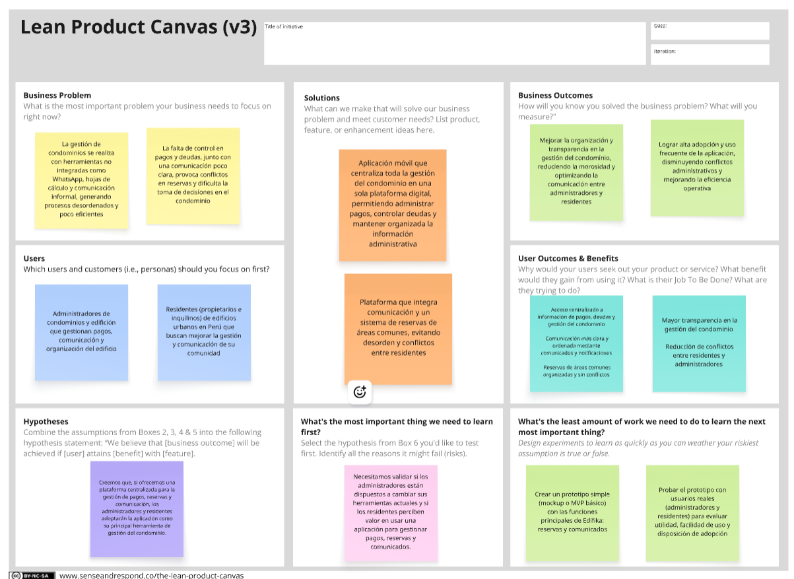

 *Figura. Lean Ux Canvas. Elaborado por el equipo utilizando Miro (Miro, s.f.).*

## 1.3. Segmentos objetivo

**Administradores de edificios y condominios:**

Una gran parte de las administraciones aún utiliza herramientas informales como Excel, WhatsApp o registros manuales, lo que genera desorden en la gestión y dificulta la toma de decisiones.

- Edad estimada: 25 a 60 años
- Ubicación: Zonas urbanas con alta concentración de edificios residenciales como Lima Metropolitana, Arequipa o Callao
- Características demográficas y de comportamiento:
   - Son responsables de la gestión operativa, administrativa y financiera del condominio.
   - Utilizan herramientas básicas y poco integradas para el control de pagos y comunicación.
   - Enfrentan problemas frecuentes de morosidad y desorganización.
   - Buscan optimizar procesos y reducir conflictos entre residentes.
- Necesidades principales:
   - Gestionar de manera clara y automatizada las deudas y pagos.
   - Enviar comunicados organizados y verificables.
   - Contar con reportes que faciliten la toma de decisiones.
   - Reducir la carga operativa manual y mejorar la eficiencia.

**Propietarios e inquilinos de condominios:**

El crecimiento de la vivienda vertical en ciudades ha incrementado la cantidad de personas que viven en condominios, generando la necesidad de herramientas digitales que faciliten la convivencia, el acceso a información y la participación en la gestión del edificio.

- Edad estimada: 18 a 55 años
- Ubicación: Zonas urbanas residenciales en ciudades como Lima y Callao
- Características demográficas y de comportamiento:
   - Incluye tanto propietarios como inquilinos que residen en el condominio.
   - Utilizan smartphones y aplicaciones móviles de manera frecuente.
   - Buscan soluciones rápidas, claras y accesibles.
   - Valoran la transparencia en la gestión y la buena comunicación.
- Necesidades principales:
   - Consultar sus deudas y estado de pagos en cualquier momento.
   - Recibir notificaciones y comunicados importantes.
   - Reservar áreas comunes de forma sencilla.
   - Mantenerse informados y participar en la vida del condominio.

# Capítulo II: Requirements Elicitation & Analysis

## 2.1. Competidores
### 2.1.1. Análisis competitivo

 <table border="2" style="text-align: center; border-collapse: collapse; width: 100%;">
  <tbody>
    <tr>
      <td colspan="6" style="padding: 8px; font-weight: bold;">Competitive Analysis Landscape</td>
    </tr>
    <tr>
      <td colspan="2" style="padding: 8px; font-weight: bold;">¿Por qué llevar a cabo este análisis?</td>
      <td colspan="4" style="padding: 8px;">
        Este análisis permite comprender cómo distintas plataformas gestionan la administración de condominios, qué funcionalidades ofrecen y qué valor brindan a los usuarios. De esta manera, se identifican oportunidades de mejora, diferenciación y posicionamiento para Edifika dentro del mercado, especialmente frente a soluciones tradicionales y plataformas digitales existentes.
      </td>
    </tr>
    <tr>
      <td colspan="2" style="padding: 8px;"></td>
      <td style="padding: 8px; font-weight: bold;">Edifika</td>
      <td style="padding: 8px; font-weight: bold;">Condo Control</td>
      <td style="padding: 8px; font-weight: bold;">Buildium</td>
      <td style="padding: 8px; font-weight: bold;">AppFolio</td>
    </tr>
    <tr>
      <td rowspan="2" style="padding: 8px; font-weight: bold; vertical-align: middle;">Perfil</td>
      <td style="padding: 8px; font-weight: bold;">Overview</td>
      <td style="padding: 8px; vertical-align: top;">Aplicación enfocada en la gestión de condominios en el contexto peruano, que centraliza pagos, reservas y comunicación en una sola plataforma accesible e intuitiva.</td>
      <td style="padding: 8px; vertical-align: top;">Software de gestión de condominios que permite la comunicación entre residentes, gestión de documentos y administración de reservas.</td>
      <td style="padding: 8px; vertical-align: top;">Plataforma de gestión inmobiliaria en la nube orientada a administradores profesionales, con herramientas financieras, operativas y de comunicación.</td>
      <td style="padding: 8px; vertical-align: top;">Software integral de gestión de propiedades que permite administrar pagos, mantenimiento y comunicación desde una sola plataforma.</td>
    </tr>
    <tr>
      <td style="padding: 8px; font-weight: bold;">Ventaja competitiva ¿Qué valor ofrece?</td>
      <td style="padding: 8px; vertical-align: top;">Centraliza funciones clave en una interfaz simple, enfocada en la adopción real de usuarios que actualmente usan WhatsApp y Excel.</td>
      <td style="padding: 8px; vertical-align: top;">Ofrece una plataforma estructurada para la comunicación y organización dentro del condominio.</td>
      <td style="padding: 8px; vertical-align: top;">Proporciona herramientas avanzadas de gestión financiera y automatización para empresas administradoras.</td>
      <td style="padding: 8px; vertical-align: top;">Integra múltiples funcionalidades con automatización y escalabilidad para grandes volúmenes de propiedades.</td>
    </tr>
    <tr>
      <td rowspan="2" style="padding: 8px; font-weight: bold; vertical-align: middle;">Perfil de Marketing</td>
      <td style="padding: 8px; font-weight: bold;">Mercado objetivo</td>
      <td style="padding: 8px; vertical-align: top;">Condominios urbanos en Perú, administradores y residentes que buscan digitalizar su gestión.</td>
      <td style="padding: 8px; vertical-align: top;">Condominios y asociaciones de propietarios, principalmente en mercados internacionales.</td>
      <td style="padding: 8px; vertical-align: top;">Empresas administradoras de propiedades y profesionales inmobiliarios.</td>
      <td style="padding: 8px; vertical-align: top;">Empresas de gestión inmobiliaria y administradores de múltiples propiedades.</td>
    </tr>
    <tr>
      <td style="padding: 8px; font-weight: bold;">Estrategias de marketing</td>
      <td style="padding: 8px; vertical-align: top;">Enfoque en simplicidad, adopción digital y solución de problemas reales en comunidades locales.</td>
      <td style="padding: 8px; vertical-align: top;">Marketing digital enfocado en comunidades y administradores de condominios.</td>
      <td style="padding: 8px; vertical-align: top;">Marketing B2B dirigido a empresas inmobiliarias con enfoque en eficiencia y automatización.</td>
      <td style="padding: 8px; vertical-align: top;">Estrategias digitales enfocadas en empresas grandes y escalabilidad del servicio.</td>
    </tr>
    <tr>
      <td rowspan="3" style="padding: 8px; font-weight: bold; vertical-align: middle;">Perfil de Producto</td>
      <td style="padding: 8px; font-weight: bold;">Productos & Servicios</td>
      <td style="padding: 8px; vertical-align: top; text-align: left;">
        <ul>
          <li>Gestión de pagos y deudas</li>
          <li>Reserva de áreas comunes</li>
          <li>Comunicados centralizados</li>
        </ul>
      </td>
      <td style="padding: 8px; vertical-align: top; text-align: left;">
        <ul>
          <li>Gestión de documentos</li>
          <li>Comunicación con residentes</li>
          <li>Reservas de espacios</li>
        </ul>
      </td>
      <td style="padding: 8px; vertical-align: top; text-align: left;">
        <ul>
          <li>Gestión financiera</li>
          <li>Pagos en línea</li>
          <li>Reportes y contabilidad</li>
        </ul>
      </td>
      <td style="padding: 8px; vertical-align: top; text-align: left;">
        <ul>
          <li>Gestión de pagos</li>
          <li>Mantenimiento</li>
          <li>Automatización de procesos</li>
        </ul>
      </td>
    </tr>
    <tr>
      <td style="padding: 8px; font-weight: bold;">Precios & Costos</td>
      <td style="padding: 8px; vertical-align: top; text-align: left;">
        <ul>
          <li>Modelo de suscripción mensual por condominio</li>
          <li>Posible versión freemium</li>
        </ul>
      </td>
      <td style="padding: 8px; vertical-align: top; text-align: left;">
        <ul>
          <li>Suscripción mensual según tamaño del condominio</li>
        </ul>
      </td>
      <td style="padding: 8px; vertical-align: top; text-align: left;">
        <ul>
          <li>Suscripción mensual para empresas administradoras</li>
        </ul>
      </td>
      <td style="padding: 8px; vertical-align: top; text-align: left;">
        <ul>
          <li>Modelo SaaS con precios escalables</li>
        </ul>
      </td>
    </tr>
    <tr>
      <td style="padding: 8px; font-weight: bold;">Canales de distribución</td>
      <td style="padding: 8px; vertical-align: top; text-align: left;">
        <ul>
          <li>Aplicación móvil (iOS y Android)</li>
          <li>Posible versión web</li>
        </ul>
      </td>
      <td style="padding: 8px; vertical-align: top; text-align: left;">
        <ul>
          <li>Web y aplicación móvil</li>
        </ul>
      </td>
      <td style="padding: 8px; vertical-align: top; text-align: left;">
        <ul>
          <li>Web (plataforma en la nube)</li>
        </ul>
      </td>
      <td style="padding: 8px; vertical-align: top; text-align: left;">
        <ul>
          <li>Web y aplicación móvil</li>
        </ul>
      </td>
    </tr>
    <tr>
      <td rowspan="4" style="padding: 8px; font-weight: bold; vertical-align: middle;">Análisis SWOT</td>
      <td style="padding: 8px; font-weight: bold;">Fortalezas</td>
      <td style="padding: 8px; vertical-align: top;">Enfoque local, simplicidad y alta adaptabilidad al contexto peruano.</td>
      <td style="padding: 8px; vertical-align: top;">Experiencia en gestión de condominios y comunicación estructurada.</td>
      <td style="padding: 8px; vertical-align: top;">Plataforma robusta con herramientas financieras avanzadas.</td>
      <td style="padding: 8px; vertical-align: top;">Alta escalabilidad y automatización.</td>
    </tr>
    <tr>
      <td style="padding: 8px; font-weight: bold;">Debilidades</td>
      <td style="padding: 8px; vertical-align: top;">Aplicación nueva con baja adopción inicial.</td>
      <td style="padding: 8px; vertical-align: top;">Puede ser compleja para usuarios no tecnológicos.</td>
      <td style="padding: 8px; vertical-align: top;">No está enfocada en usuarios pequeños o individuales.</td>
      <td style="padding: 8px; vertical-align: top;">Curva de aprendizaje más alta.</td>
    </tr>
    <tr>
      <td style="padding: 8px; font-weight: bold;">Oportunidades</td>
      <td style="padding: 8px; vertical-align: top;">Alta demanda de digitalización en condominios en Perú.</td>
      <td style="padding: 8px; vertical-align: top;">Expansión en mercados internacionales.</td>
      <td style="padding: 8px; vertical-align: top;">Expansión en mercados emergentes.</td>
      <td style="padding: 8px; vertical-align: top;">Innovación en automatización y servicios.</td>
    </tr>
    <tr>
      <td style="padding: 8px; font-weight: bold;">Amenazas</td>
      <td style="padding: 8px; vertical-align: top;">Resistencia al cambio y uso de herramientas informales.</td>
      <td style="padding: 8px; vertical-align: top;">Competencia de nuevas apps más simples.</td>
      <td style="padding: 8px; vertical-align: top;">Competencia de software especializado más accesible.</td>
      <td style="padding: 8px; vertical-align: top;">Competencia creciente en el sector proptech.</td>
    </tr>
  </tbody>
</table>

Fuente: Elaboración propia del grupo de trabajo.

### 2.1.2. Estrategias y tácticas frente a competidores

**Enfoque en la digitalización total del condominio**

Estrategia: Diferenciarse de soluciones tradicionales (WhatsApp, Excel, papel) ofreciendo una plataforma centralizada y estructurada

Táctica: Integrar en una sola app funcionalidades como pagos, comunicados, reservas y gestión de usuarios, evitando el uso de múltiples herramientas dispersas

**Transparencia en la gestión administrativa**

Estrategia: Generar confianza entre residentes y administradores mediante acceso claro a la información

Táctica: Mostrar historiales de pagos, deudas (morosidad), reportes financieros y registros de decisiones accesibles en tiempo real para todos los usuarios autorizados

**Comunicación centralizada y efectiva**

Estrategia: Reemplazar la comunicación desordenada de múltiples canales por un sistema único y eficiente

Táctica: Crear un sistema de notificaciones dentro de la app con confirmación de lectura, segmentación por tipo de usuario (residente/administrador) y categorización de anuncios

**Experiencia de usuario simple y accesible**

Estrategia: Facilitar la adopción tecnológica incluso para usuarios no familiarizados con apps complejas

Táctica: Diseñar una interfaz intuitiva, con accesos rápidos (ej: “Pagar”, “Reservar”, “Ver avisos”) y procesos simplificados en pocos pasos

**Adaptación al contexto local (Perú / LATAM)**

Estrategia: Diferenciarse de competidores internacionales adaptándose a la realidad local

Táctica: Incluir métodos de pago locales (Yape, Plin), lenguaje adaptado, y funcionalidades específicas como control de morosos o juntas vecinales

**Gestión inteligente de áreas comunes**

Estrategia: Optimizar el uso de recursos compartidos dentro del condominio

Táctica: Implementar un calendario interactivo con disponibilidad en tiempo real, reglas automáticas de uso y confirmaciones instantáneas de reservas

## 2.2. Entrevistas
### 2.2.1. Diseño de entrevistas

Para el diseño de las entrevistas se utilizó el método de entrevistas semiestructuradas, el cual combina un conjunto de preguntas predefinidas con la flexibilidad de profundizar en las respuestas del entrevistado según el contexto de la conversación. Este enfoque fue seleccionado porque permite recopilar información cualitativa sobre las experiencias, frustraciones y expectativas de los usuarios sin limitar sus respuestas a opciones cerradas. Las preguntas fueron formuladas de manera abierta para incentivar respuestas detalladas y se organizaron en dos guiones diferenciados, uno por cada segmento objetivo del proyecto, asegurando que cada entrevista aborde las problemáticas específicas del perfil entrevistado.

1. Segmento: Administradores de edificios y condominios

- ¿Cuántos edificios administran actualmente y cómo llevan hoy la gestión del día a día?

- ¿Qué herramientas o sistemas utilizan para gestionar los pagos y deudas de todos sus edificios?

- ¿Cómo coordinan las reservas de áreas comunes en los distintos edificios que administran?

- ¿De qué manera envían avisos oficiales a los residentes y cómo verifican que la información llegó a todos?

- ¿Cuál es el proceso más tedioso que quisieran eliminar de su operación diaria?

- ¿Qué tan seguido reciben quejas de residentes por falta de información o transparencia?

- ¿Han evaluado antes algún software de administración? Si es así, ¿qué fue lo que no les convenció?

- ¿Qué tan probable sería para su empresa migrar toda la gestión a una sola plataforma digital?

- ¿Qué tendría que tener una plataforma para que su empresa la adopte sin dudarlo?
  
- ¿Cuánto estarían dispuestos a pagar mensualmente por una herramienta que centralice toda su gestión?

2. Segmento: Propietarios e Inquilinos

- ¿Cómo se entera hoy de sus saldos pendientes de mantenimiento y de las noticias de su edificio?

- ¿Qué tan fácil o difícil le resulta realizar el pago y enviar el comprobante de mantenimiento?

- ¿Dónde puede consultar su historial de pagos si necesita verificar un cobro antiguo?

- ¿Ha tenido problemas para reservar áreas comunes por falta de claridad en los horarios?

- ¿Siente que la administración es transparente con el uso del dinero y los gastos del edificio?

- ¿Qué tan rápido recibe respuesta cuando tiene una duda o necesita un comunicado importante?

- ¿Cuál es el canal de comunicación que más le molesta o le satura (ej. grupos de WhatsApp)?

- ¿Qué trámite del edificio le parece el más anticuado o el que más le quita tiempo?

- ¿Estaría dispuesto a gestionar sus pagos y cuotas en una sola aplicación móvil?

- Si pudiera cambiar una sola cosa de la gestión de su condominio, ¿qué sería?

### 2.2.2. Registro de entrevistas

**Segmento objetivo: Administradores de edificios y condominios:**

| **ENTREVISTA 1** | |
|------------------|----------------------------|
| **Nombre entrevistado** |  Cesar Villalobos  |
| **Edad** | 51 |
| **Departamento** | Cercado de Lima  |
| **Link del video** | [Link del video de la entrevista](https://upcedupe-my.sharepoint.com/:v:/g/personal/u202310358_upc_edu_pe/IQDEXx-uGk1tS71xXaDeSeDeAf3fEODmStVZKztx7vcr0i8?nav=eyJyZWZlcnJhbEluZm8iOnsicmVmZXJyYWxBcHAiOiJPbmVEcml2ZUZvckJ1c2luZXNzIiwicmVmZXJyYWxBcHBQbGF0Zm9ybSI6IldlYiIsInJlZmVycmFsTW9kZSI6InZpZXciLCJyZWZlcnJhbFZpZXciOiJNeUZpbGVzTGlua0NvcHkifX0&e=5V6W7o) |
| **Foto entrevista** |   |
| **Resumen** | César es administrador de edificios en GWM EIRL y actualmente gestiona 15 edificios usando Excel con macros como herramienta principal, apoyándose en WhatsApp para coordinar reservas y comunicaciones, y en las páginas de los bancos para pagos. El proceso más tedioso es la emisión de recibos, que aún se hace de forma física en varios edificios y que desea digitalizar al 100%. Ha evaluado entre 3 y 4 sistemas sin éxito, ya que todos presentaban exceso de información que generaba confusión en los propietarios y una percepción de desorden o falta de transparencia. Como empresa tiene el objetivo claro de migrar a una plataforma digital, y considera que una app o sistema web mejoraría significativamente la comunicación y la gestión, siempre que sea ágil, ordenada, fácil de entender y con información siempre actualizada. En cuanto al precio, conoce el mercado y sabe que el rango habitual oscila entre 2 y 5 dólares por unidad al mes. |

| **ENTREVISTA 2** | |
|---|---|
| **Nombre entrevistado** | Alejandro Galindo |
| **Edad** | 26 |
| **Departamento** | San Miguel |
| **Link del video** |[Link del video de la entrevista](https://upcedupe-my.sharepoint.com/:v:/g/personal/u202321281_upc_edu_pe/IQAW5DBOyn8xS6ZiZVZwufEIAU9yh_7P6mIIpJ_RzxJp6is?e=kLEW30&nav=eyJyZWZlcnJhbEluZm8iOnsicmVmZXJyYWxBcHAiOiJTdHJlYW1XZWJBcHAiLCJyZWZlcnJhbFZpZXciOiJTaGFyZURpYWxvZy1MaW5rIiwicmVmZXJyYWxBcHBQbGF0Zm9ybSI6IldlYiIsInJlZmVycmFsTW9kZSI6InZpZXcifX0%3D)|
| **Foto entrevista** | |
| **Resumen** | El administrador Alejandro Galindo gestiona 4 edificios utilizando principalmente Excel, WhatsApp y registros manuales. Su principal problema es el seguimiento de pagos y la falta de confirmación sobre la recepción de comunicados. Considera viable adoptar una plataforma digital siempre que centralice pagos, comunicaciones y reservas, y tenga un costo accesible. |

**Segmento objetivo: Propietarios e Inquilinos:**

| **ENTREVISTA 1** | |
|------------------|----------------------------|
| **Nombre entrevistado** | Melina Lopez  |
| **Edad** | 51 |
| **Departamento** | San Miguel  |
| **Link del video** | [Link del video de la entrevista](https://upcedupe-my.sharepoint.com/:v:/g/personal/u202321281_upc_edu_pe/IQAW5DBOyn8xS6ZiZVZwufEIAU9yh_7P6mIIpJ_RzxJp6is?e=kLEW30&nav=eyJyZWZlcnJhbEluZm8iOnsicmVmZXJyYWxBcHAiOiJTdHJlYW1XZWJBcHAiLCJyZWZlcnJhbFZpZXciOiJTaGFyZURpYWxvZy1MaW5rIiwicmVmZXJyYWxBcHBQbGF0Zm9ybSI6IldlYiIsInJlZmVycmFsTW9kZSI6InZpZXcifX0%3D)  |
| **Foto entrevista** |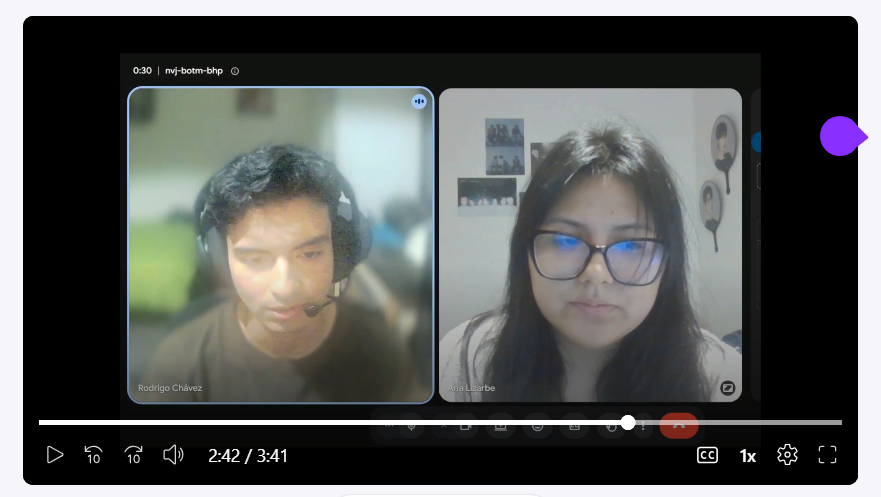  |
| **Resumen** |Se entrevistó a Melina López, propietaria de un departamento, ella indica que no suele estar al tanto de las reuniones del edificio debido a la falta de tiempo. En cuanto a los pagos, envía los comprobantes por correo al administrador y mantiene un archivo físico como respaldo, ya que de lo contrario no tendría un historial accesible, asumiendo que la administración podría brindárselo si lo solicita. Señala que el proceso de reserva de espacios es el más tedioso, pues implica consultar disponibilidad, dejar garantía, realizar pagos y luego hacer seguimiento para su devolución, lo que la obliga a estar constantemente detrás de la administración. Además, le incomoda la gran cantidad de mensajes en el grupo de WhatsApp, donde se pierde información relevante. Finalmente, se muestra abierta al uso de una aplicación que centralice la información, considerando que actualmente los eventos y reuniones ya se comunican mediante un tablero. |

| **ENTREVISTA 2** | |
|---|---|
| **Nombre entrevistado** | Jarol Panduro |
| **Edad** | 30 |
| **Departamento** | San Miguel |
| **Link del video** | [Link del video de la entrevista](https://youtu.be/NHYPQzPL36M) |
| **Foto entrevista** |  |
| **Resumen** | En este video, Jarol Panduro, un abogado de 30 años, detalla las principales deficiencias en la administración de su edificio. Explica que el proceso de pago del mantenimiento es tedioso porque requiere enviar capturas de pantalla por WhatsApp, y señala que no existe un sistema oficial para consultar su historial de pagos. Además, menciona problemas como la desorganización al reservar áreas comunes mediante cuadernos físicos, la falta de transparencia en los gastos administrativos, la lentitud en la comunicación oficial y lo anticuado que resulta el registro manual de visitas en la portería. Como solución, propone la implementación de una plataforma digital centralizada que permita registrar pagos automáticamente, reservar espacios y auditar los gastos de forma rápida y transparente.|

| **ENTREVISTA 3** | |
|---|---|
| **Nombre entrevistado** | Marcelo Candia |
| **Edad** | 25 |
| **Departamento** | San Miguel |
| **Link del video** | [Link del video de la entrevista](https://youtu.be/E5k60PHyvYI) |
| **Foto entrevista** |  |
| **Resumen** | En la entrevista, Marcelo expone su frustración con la administración obsoleta y caótica de su edificio. Señala que los pagos de mantenimiento son tediosos porque exigen depósitos en cuentas específicas y la entrega de comprobantes físicos, sin aceptar billeteras digitales como Yape. Además, menciona problemas recurrentes como la falta de transparencia en los gastos anuales, la mala gestión en la reserva de áreas comunes que genera conflictos por cruces de horarios, y la lentitud de la administración para responder correos formales. También critica el uso de correos masivos que terminan llenándose de quejas irrelevantes de los vecinos y el engorroso proceso manual que se requiere para autorizar el ingreso de muebles grandes o mudanzas. Como solución ideal, sugiere la implementación de una aplicación o portal vecinal 100% automatizado que permita realizar pagos, reservas y reportes de fallas de manera digital las 24 horas del día, eliminando así el uso de papel|

### 2.2.3. Análisis de entrevistas

## **Segmento objetivo de administradores de edificios y condominios**

Las entrevistas realizadas a César, administrador de GWM EIRL, y a Alejandro Galindo evidencian que ambos gestionan sus edificios principalmente mediante Excel, WhatsApp y procesos manuales, lo que genera dificultades en el control de pagos, la comunicación con los propietarios y la administración de reservas. César, quien administra 15 edificios, identifica como principal problema la emisión física de recibos y busca una digitalización completa de sus procesos, mientras que Alejandro, encargado de 4 edificios, destaca la falta de seguimiento eficiente de pagos y la incertidumbre sobre la recepción de comunicados. Ambos consideran que una plataforma digital podría mejorar significativamente la gestión siempre que centralice funciones clave como pagos, comunicaciones y reservas, sea fácil de usar, mantenga la información actualizada y tenga un costo accesible acorde a los precios habituales del mercado.

## **Segmento objetivo de propietarios e inquilinos**

Las entrevistas realizadas a Melina López, Jarol Panduro y Marcelo muestran una insatisfacción común con los procesos tradicionales de administración de edificios. Los principales problemas identificados son la falta de un historial digital de pagos, la necesidad de enviar comprobantes manualmente, la escasa transparencia en los gastos administrativos, la desorganización en la reserva de áreas comunes y la saturación de información en canales de comunicación como WhatsApp y correos masivos. Además, destacan procesos poco eficientes para la gestión de visitas, mudanzas y solicitudes a la administración, así como la lentitud en la atención de consultas. Los tres entrevistados coinciden en que una plataforma digital centralizada mejoraría significativamente la experiencia de los propietarios al permitir gestionar pagos, reservas, comunicaciones y consultas de manera rápida, organizada, transparente y accesible desde cualquier momento, reduciendo la dependencia de procesos manuales y documentos físicos.

## 2.3. Needfinding
### 2.3.1. User Personas

### Administrador de Condominio – Ricardo Mendoza

*Figura. User persona del administrador de condominio. Elaborado por el equipo utilizando UXPressia (UXPressia, s.f.).*

### Residente (Propietario/Inquilino) – Andrea Villacorta

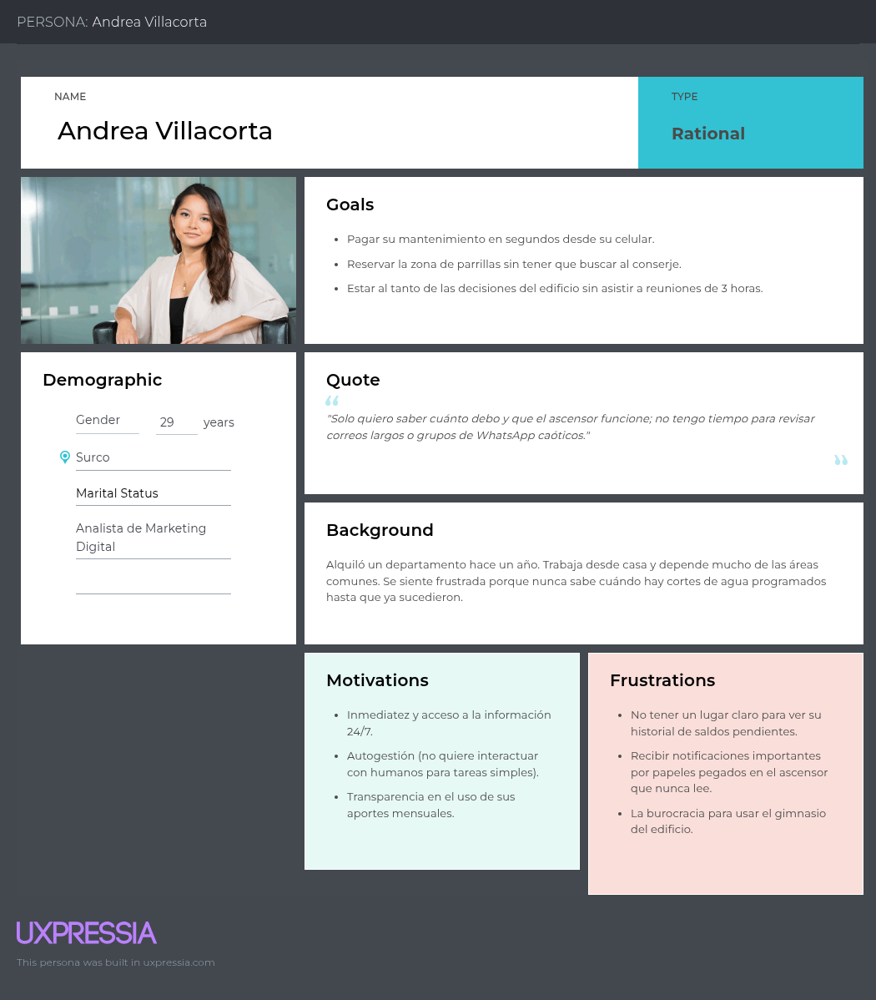

*Figura. User persona del residente. Elaborado por el equipo utilizando UXPressia (UXPressia, s.f.).*

### 2.3.2. User Task Matrix

### Administrador de Condominio – Ricardo Mendoza

| Tarea | Frecuencia | Prioridad | Frustración |
| :--- | :--- | :--- | :--- |
| Conciliar pagos y validar transferencias | Diario | Muy Alta | Alta |
| Actualizar el estado de saldos pendientes | Diario | Alta | Alta |
| Enviar comunicados oficiales masivos | Semanal | Alta | Media |
| Gestionar y aprobar reservas de áreas comunes | Diario | Media | Media |
| Generar reportes financieros mensuales | Mensual | Muy Alta | Alta |
| Registrar gastos y facturas del edificio | Semanal | Alta | Media |
| Identificar deudores críticos para cobranza | Semanal | Alta | Media |

### Residente (Propietario/Inquilino) – Andrea Villacorta

| Tarea | Frecuencia | Prioridad | Frustración |
| :--- | :--- | :--- | :--- |
| Consultar monto exacto de cuota del mes | Mensual | Muy Alta | Media |
| Subir el comprobante de pago realizado | Mensual | Alta | Alta |
| Verificar disponibilidad de áreas comunes | Ocasional | Media | Alta |
| Realizar una reserva (parrilla, SUM, etc.) | Ocasional | Media | Media |
| Leer notificaciones de mantenimiento | Semanal | Alta | Media |
| Revisar el estado de cuenta histórico | Semanal | Media | Alta |
| Reportar una avería o incidencia | Ocasional | Alta | Alta |

### 2.3.3. User Journey Mapping

Primer Segmento:

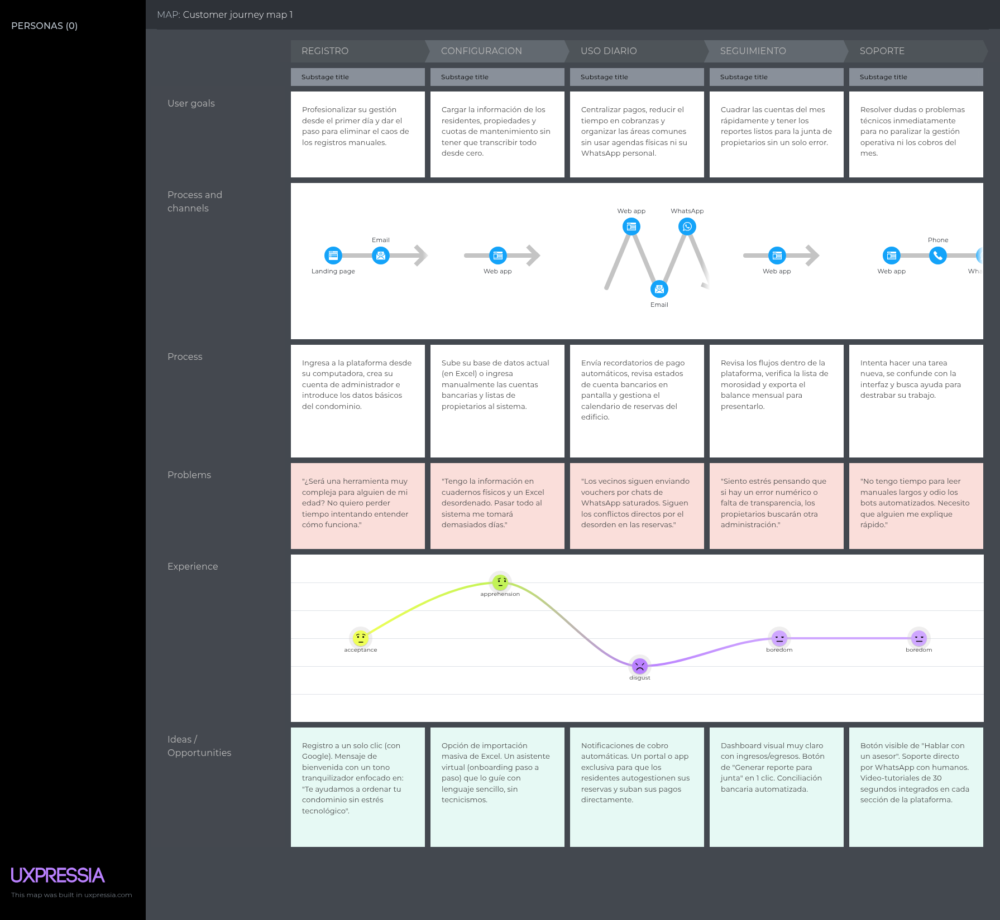 

Segundo Segmento:

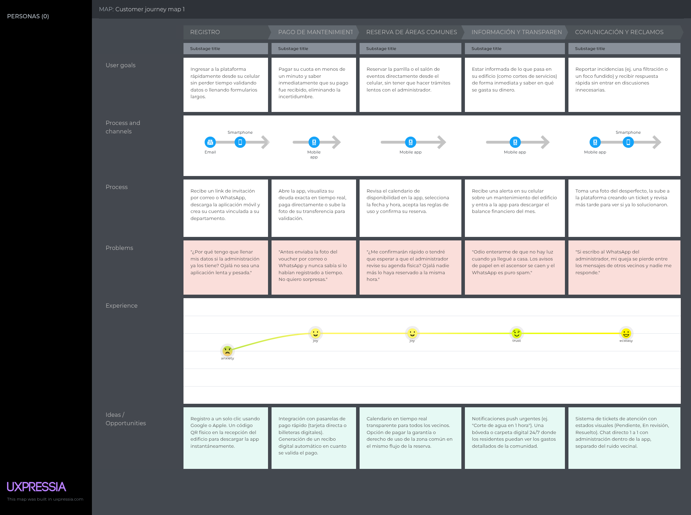 

### 2.3.4. Empathy Mapping

### Administrador de Condominio – Ricardo Mendoza

 *Figura. Empathy mapping del administrador de condominio. Elaborado por el equipo utilizando UXPressia (UXPressia, s.f.).*

### Residente (Propietario/Inquilino) – Andrea Villacorta

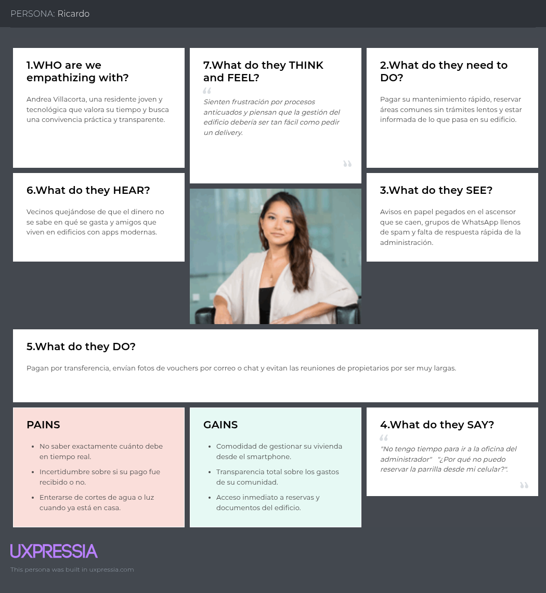

*Figura. Empathy mapping del residente. Elaborado por el equipo utilizando UXPressia (UXPressia, s.f.).*

## 2.4. Big Picture EventStorming

En esta seccción se presenta el trabajo realizado durante la sesion de Big Picture event storming enfocada en comprender el dominio general del negocio. Para ello se utilizaran post-its para mapear los eventos significativos que ocurre en el flujo operativo actual.Esta actividad permite agrupar las interacciones en bloques funcionales lógicos, asegurando que la solución tecnológica satisfaga los requisitos reales del flujo operativo

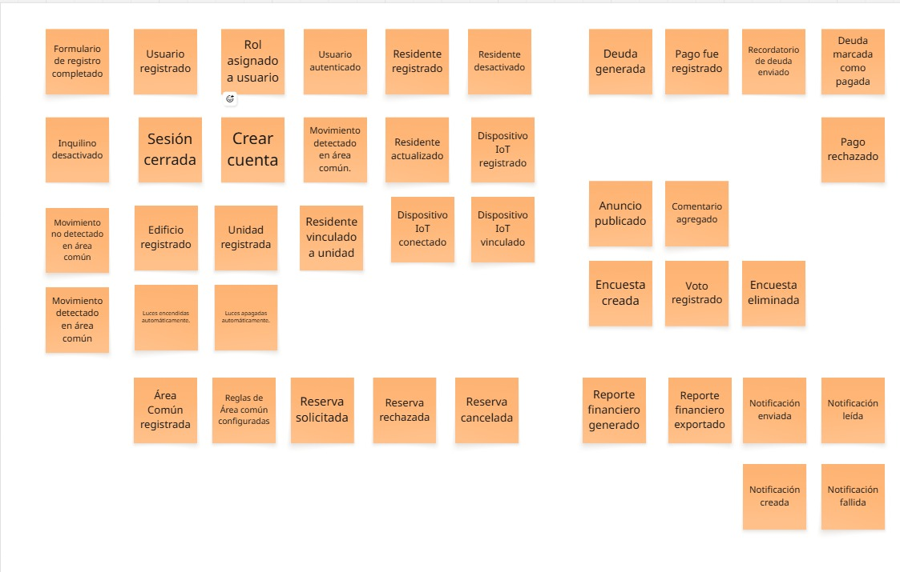 

## 2.5 Ubiquitous Language

El Ubiquitous Language define un lenguaje común entre los actores del sistema, permitiendo una comunicación clara y consistente durante el desarrollo de la solución. En este proyecto, se integran conceptos relacionados con la administración de edificios inteligentes (Smart Buildings), automatización mediante IoT, monitoreo de recursos y seguridad residencial.

---

## Usuarios y Segmentos

### Administrador de Edificios
Persona responsable de supervisar la operación de uno o varios edificios o condominios. Gestiona residentes, pagos, incidencias, reservas de áreas comunes y monitorea los dispositivos IoT instalados.

### Propietario e Inquilino
Residente que utiliza la plataforma para consultar información de su unidad, realizar pagos, reservar áreas comunes, recibir notificaciones y acceder a servicios inteligentes del edificio.

### Personal de Mantenimiento
Usuario encargado de atender incidencias técnicas relacionadas con infraestructura, dispositivos IoT, sistemas de iluminación, agua y seguridad.

---

## Funcionalidades Core para Administradores

### Edificio
Conjunto de unidades residenciales administradas dentro de la plataforma.

### Unidad Residencial
Departamento o espacio asignado a uno o varios residentes dentro de un edificio.

### Residente
Persona vinculada a una unidad residencial con acceso a funcionalidades específicas del sistema.

### Área Común
Espacio compartido por los residentes, como salón de eventos, gimnasio, zona de parrillas o áreas recreativas.

### Reserva
Solicitud realizada por un residente para utilizar un área común en una fecha y horario determinados.

### Incidencia
Problema o evento reportado relacionado con infraestructura, servicios o dispositivos del edificio.

### Notificación
Mensaje enviado automáticamente a administradores o residentes para informar eventos importantes.

### Reporte Financiero
Documento generado por el sistema que resume ingresos, pagos pendientes y movimientos económicos del edificio.

---

## Funcionalidades IoT (NÚCLEO DEL PROYECTO)

### Sensor IoT
Dispositivo conectado capaz de recopilar datos del entorno y transmitirlos al sistema en tiempo real.

### Iluminación Inteligente
Sistema que controla automáticamente las luces de áreas comunes mediante sensores de movimiento o reglas configuradas.

### Control de Acceso Inteligente
Mecanismo que permite autorizar o restringir el ingreso a determinadas áreas mediante credenciales digitales.

### Sensor de Movimiento
Dispositivo encargado de detectar presencia de personas en áreas comunes para activar automatizaciones.

### Monitoreo de Tanque de Agua
Proceso que supervisa continuamente el nivel de agua almacenada para prevenir desabastecimientos.

### Detección de Fugas
Funcionalidad que identifica posibles pérdidas de agua y genera alertas automáticas.

### Riego Automático
Sistema que activa el riego de áreas verdes según horarios programados o condiciones ambientales detectadas.

### Calidad del Aire
Indicador obtenido mediante sensores que monitorean variables como CO₂, temperatura, humedad y ventilación.

### Alerta Inteligente
Notificación generada automáticamente cuando se detecta una condición fuera de los parámetros establecidos.

### Consumo de Recursos
Registro y monitoreo del uso de agua y energía dentro del edificio.

### Dashboard IoT
Panel centralizado que permite visualizar en tiempo real el estado de los sensores, dispositivos y recursos monitoreados.

---

## Funcionalidades Core para Residentes

### Estado de Cuenta
Resumen de pagos realizados, deudas pendientes y movimientos asociados a una unidad residencial.

### Pago de Mantenimiento
Proceso mediante el cual el residente realiza el abono de las cuotas correspondientes al edificio.

### Historial de Pagos
Registro histórico de todos los pagos efectuados por el residente.

### Comunicado
Anuncio emitido por la administración para informar novedades, eventos o disposiciones importantes.

### Encuesta
Mecanismo que permite recopilar opiniones y votaciones de los residentes sobre decisiones comunitarias.

### Votación
Proceso mediante el cual los residentes participan en decisiones relacionadas con la gestión del edificio.

### Seguimiento de Incidencias
Funcionalidad que permite conocer el estado actual de un problema reportado.

---

## Gestión de Dispositivos IoT

### Dispositivo IoT
Equipo físico conectado al sistema capaz de recopilar información o ejecutar acciones automáticas.

### Estado del Dispositivo
Condición actual del dispositivo (activo, inactivo, desconectado o en mantenimiento).

### Regla de Automatización
Condición configurada para ejecutar acciones automáticas basadas en eventos detectados por sensores.

### Evento IoT
Acción o situación detectada por un dispositivo, como movimiento, fuga de agua o variación en la calidad del aire.

### Historial de Eventos
Registro cronológico de todas las actividades generadas por sensores y dispositivos IoT.

### Monitoreo en Tiempo Real
Visualización instantánea de datos generados por sensores y dispositivos conectados.

---

# Capítulo III: Requirements Specification

## 3.1. User Stories

| Epic ID | Título | Descripción | User Stories Asociadas |
|---------|--------|-------------|------------------------|
| EP01 | Autenticación y gestión de usuarios | Esta épica se enfoca en la creación, registro y administración de usuarios dentro de la plataforma, incluyendo residentes y administradores. Permite vincular cuentas a unidades específicas dentro del edificio, así como gestionar perfiles, validar información y controlar accesos. | US01, US02, US03, US04, US05, US06, US07, US34 |
| EP02 | Comunicación centralizada | Esta épica aborda la gestión de notificaciones y comunicados dentro del edificio, permitiendo mantener informados a los residentes sobre incidencias, pagos, reservas y anuncios importantes. Incluye la personalización de notificaciones y el seguimiento de visualización de comunicados. | US08, US10, US12, US13, US14, US15, US29, US31, US32, US36, US37 |
| EP03 | Gestión de áreas comunes | Esta épica se centra en la administración y uso eficiente de las áreas comunes del edificio. Permite a los residentes consultar disponibilidad, realizar y cancelar reservas, mientras que los administradores pueden aprobar solicitudes y evitar conflictos de horario. | US11, US16, US17, US18, US19, US20, US33, US35, US38, US39, US40 |
| EP04 | Gestión financiera y reportes | Esta épica se enfoca en la administración económica del edificio, permitiendo a los residentes consultar su deuda, registrar pagos y revisar su historial financiero. Los administradores pueden identificar morosos, generar y exportar reportes financieros. | US09, US21, US22, US23, US24, US25, US26, US27, US28, US30 |
| EP05 | Infraestructura, seguridad y arquitectura técnica | Esta épica abarca todos los aspectos técnicos necesarios para el correcto funcionamiento del sistema Edifika, incluyendo la configuración de microservicios, autenticación JWT, API Gateway, bases de datos independientes, documentación de APIs, comunicación entre servicios y despliegue en la nube. Su objetivo es garantizar que la plataforma sea segura, escalable y mantenible. | TS01, TS02, TS03, TS04, TS05, TS06, TS07, TS08, TS09, TS10, TS11, TS12, TS13, TS14, TS15 |
| EP06 | Landing Page e Interfaz Web | Esta épica cubre todas las funcionalidades visibles en la landing page pública de Edifika y la interfaz web de la aplicación. Incluye navegación, presentación de contenido y acceso a la plataforma, con el objetivo de atraer y convertir nuevos usuarios. | US41, US42, US43, US44, US45, US46, US47 |
| EP07 | Smart Building e Internet de las Cosas (IoT) | Esta épica abarca la integración de dispositivos IoT dentro del edificio para automatizar y controlar el acceso a áreas comunes y unidades mediante sensores, cerraduras inteligentes y códigos QR. Permite a los residentes gestionar el acceso a sus reservas de forma remota, mientras que los administradores pueden monitorear en tiempo real el estado de los dispositivos, registrar eventos de apertura/cierre y detectar accesos no autorizados, fortaleciendo la seguridad y la eficiencia operativa del edificio. | US48, US49, US50, US51, US52, US53 |

**User Stories:**

<table>
  <thead>
    <tr>
      <th>Epic / US ID</th>
      <th>Título</th>
      <th>Descripción</th>
      <th>Criterios de Aceptación (Escenarios)</th>
      <th>Relacionado</th>
    </tr>
  </thead>
  <tbody>
    <tr>
      <td><strong>US01</strong></td>
      <td>Crear cuenta vinculada a unidad</td>
      <td>Como residente, deseo crear una cuenta vinculada a mi unidad para acceder a la gestión de mi edificio.</td>
      <td>
        <strong>Escenario 1: Registro exitoso.</strong> 
        Dado que el residente completa sus datos y selecciona torre/unidad, 
        cuando envía el formulario de registro, 
        entonces el sistema confirma el vínculo y crea la cuenta exitosamente.  
        <strong>Escenario 2: Unidad ya ocupada.</strong> 
        Dado que el residente selecciona una unidad con titular activo, 
        cuando intenta completar el registro, 
        entonces el sistema bloquea el registro y solicita adjuntar título de propiedad para validación manual.  
        <strong>Escenario 3: Error de red.</strong> 
        Dado que el residente está en proceso de vinculación, 
        cuando se pierde la conexión a internet, 
        entonces el sistema muestra "Error de sincronización" y permite reintentar sin rellenar todo el formulario.
      </td>
      <td>EP01</td>
    </tr>
    <tr>
      <td><strong>US02</strong></td>
      <td>Registro con correo</td>
      <td>Como usuario, quiero registrarme con mi correo para acceder a la plataforma.</td>
      <td>
        <strong>Escenario 1: Validación de formato.</strong> 
        Dado que el usuario está completando el formulario de registro, 
        cuando ingresa un correo sin "@", 
        entonces el sistema muestra instantáneamente "Formato de correo inválido".  
        <strong>Escenario 2: Correo duplicado.</strong> 
        Dado que el usuario intenta registrarse con un correo existente, 
        cuando envía el formulario, 
        entonces el sistema indica que la cuenta ya existe y ofrece la opción de recuperar contraseña.  
        <strong>Escenario 3: Timeout en verificación.</strong> 
        Dado que el usuario espera el código de verificación, 
        cuando el servicio de envío demora más de 30 segundos, 
        entonces el sistema muestra "Servicio temporalmente lento" y habilita el botón "Reenviar código".
      </td>
      <td>EP01</td>
    </tr>
    <tr>
      <td><strong>US03</strong></td>
      <td>Inicio de sesión</td>
      <td>Como usuario, quiero iniciar sesión para acceder a mi información.</td>
      <td>
        <strong>Escenario 1: Login exitoso.</strong> 
        Dado que el usuario tiene credenciales válidas, 
        cuando las ingresa y confirma el inicio de sesión, 
        entonces el sistema lo redirige al dashboard correspondiente según su rol (Admin/Residente).  
        <strong>Escenario 2: Bloqueo por intentos.</strong> 
        Dado que el usuario ha ingresado credenciales incorrectas, 
        cuando acumula 5 intentos fallidos, 
        entonces el sistema bloquea la cuenta por 15 minutos por razones de seguridad.  
        <strong>Escenario 3: Sesión expirada.</strong> 
        Dado que el token JWT del usuario ha caducado, 
        cuando intenta navegar dentro de la plataforma, 
        entonces el sistema lo redirige al login con el mensaje "Su sesión ha expirado".
      </td>
      <td>EP01</td>
    </tr>
    <tr>
      <td><strong>US04</strong></td>
      <td>Verificar información por torre y dpto.</td>
      <td>Como administrador, quiero verificar los datos de usuarios por ubicación para asegurar que el censo sea correcto.</td>
      <td>
        <strong>Escenario 1: Validación exitosa.</strong> 
        Dado que el admin filtra por "Torre B - 402", 
        cuando revisa el DNI adjunto y los datos coinciden, 
        entonces puede marcar el registro como "Verificado".  
        <strong>Escenario 2: Datos inconsistentes.</strong> 
        Dado que el admin revisa un registro con datos incorrectos, 
        cuando el nombre no coincide con el documento adjunto, 
        entonces el sistema permite marcar como "Pendiente de corrección" y notifica al residente el motivo específico.  
        <strong>Escenario 3: Error de carga de media.</strong> 
        Dado que el admin intenta abrir el documento adjunto, 
        cuando el servidor de archivos no responde, 
        entonces el sistema muestra "No se pudo cargar la imagen del DNI, reintente en unos minutos".
      </td>
      <td>EP01</td>
    </tr>
    <tr>
      <td><strong>US05</strong></td>
      <td>Actualizar información de usuarios</td>
      <td>Como administrador, quiero editar datos de usuarios para corregir errores.</td>
      <td>
        <strong>Escenario 1: Edición de contacto.</strong> 
        Dado que el admin accede al perfil de un residente, 
        cuando modifica el número de teléfono y guarda los cambios, 
        entonces el sistema almacena la información y registra en el log quién realizó el cambio.  
        <strong>Escenario 2: Cambio de rol inválido.</strong> 
        Dado que el admin es el único administrador activo del sistema, 
        cuando intenta quitarse sus propios permisos de administrador, 
        entonces el sistema lanza "Error: Debe existir al menos un administrador activo".  
        <strong>Escenario 3: Fallo de persistencia.</strong> 
        Dado que el admin intenta guardar cambios en un perfil, 
        cuando la base de datos se encuentra en mantenimiento, 
        entonces el sistema muestra "Error 500: No se pudieron guardar los cambios".
      </td>
      <td>EP01</td>
    </tr>
    <tr>
      <td><strong>US06</strong></td>
      <td>Editar perfil</td>
      <td>Como residente, quiero editar mi perfil para mantener mi contacto actualizado.</td>
      <td>
        <strong>Escenario 1: Actualización de foto.</strong> 
        Dado que el residente accede a la edición de su perfil, 
        cuando sube una nueva imagen de perfil, 
        entonces el sistema la procesa y actualiza en todos los módulos de la plataforma.  
        <strong>Escenario 2: Cancelación.</strong> 
        Dado que el usuario ha modificado campos de su perfil, 
        cuando pulsa el botón "Cancelar", 
        entonces el sistema descarta los cambios y vuelve al estado anterior sin alterar la base de datos.  
        <strong>Escenario 3: Formato no soportado.</strong> 
        Dado que el usuario intenta subir una imagen de perfil, 
        cuando selecciona un archivo en formato .gif, 
        entonces el sistema indica "Solo se permiten formatos JPG/PNG".
      </td>
      <td>EP01</td>
    </tr>
    <tr>
      <td><strong>US07</strong></td>
      <td>Registrar edificio y unidades</td>
      <td>Como administrador, quiero configurar la estructura del edificio (torres/unidades).</td>
      <td>
        <strong>Escenario 1: Configuración inicial.</strong> 
        Dado que el admin ingresa la configuración del edificio, 
        cuando registra 2 torres con 20 departamentos cada una, 
        entonces el sistema genera IDs únicos para cada unidad automáticamente.  
        <strong>Escenario 2: Unidades duplicadas.</strong> 
        Dado que el admin intenta registrar una unidad, 
        cuando el "Dpto 101" ya existe en la misma torre, 
        entonces el sistema arroja "Error: Identificador de unidad ya existe".  
        <strong>Escenario 3: Interrupción de carga masiva.</strong> 
        Dado que el admin está subiendo un Excel de unidades, 
        cuando el proceso se interrumpe inesperadamente, 
        entonces el sistema indica cuál fue la última fila procesada exitosamente.
      </td>
      <td>EP01</td>
    </tr>
    <tr>
      <td><strong>US08</strong></td>
      <td>Notificaciones de emergencias</td>
      <td>Como residente/admin, quiero gestionar avisos inmediatos de incidencias.</td>
      <td>
        <strong>Escenario 1: Alerta de incendio.</strong> 
        Dado que el admin activa una alerta de emergencia, 
        cuando confirma el envío, 
        entonces todos los residentes reciben push y SMS en menos de 5 segundos.  
        <strong>Escenario 2: Reporte de incidencia.</strong> 
        Dado que un residente detecta una fuga de gas, 
        cuando reporta la incidencia desde la app, 
        entonces el admin recibe una notificación con la ubicación exacta (Torre/Dpto).  
        <strong>Escenario 3: Fallo de Push Service.</strong> 
        Dado que se intenta enviar una notificación de emergencia, 
        cuando el servicio de Firebase no está disponible, 
        entonces el sistema registra el error y reintenta el envío automáticamente hasta 3 veces.
      </td>
      <td>EP02</td>
    </tr>
    <tr>
      <td><strong>US09</strong></td>
      <td>Recordatorios de pago</td>
      <td>Como residente, quiero recibir alertas de mis deudas próximas a vencer.</td>
      <td>
        <strong>Escenario 1: Aviso preventivo.</strong> 
        Dado que un pago de mantenimiento está próximo a vencer, 
        cuando faltan 3 días para la fecha límite, 
        entonces el sistema envía automáticamente un recordatorio al residente.  
        <strong>Escenario 2: Notificación de mora.</strong> 
        Dado que un residente no realizó su pago a tiempo, 
        cuando se cumple el primer día de retraso, 
        entonces el sistema alerta al residente sobre el recargo aplicado.  
        <strong>Escenario 3: Pago parcial.</strong> 
        Dado que el residente tiene una deuda de S/ 100, 
        cuando realiza un abono de S/ 50, 
        entonces el sistema notifica que aún queda un saldo pendiente de S/ 50.
      </td>
      <td>EP04</td>
    </tr>
    <tr>
      <td><strong>US10</strong></td>
      <td>Recepción de comunicados</td>
      <td>Como residente, quiero recibir información oficial del condominio.</td>
      <td>
        <strong>Escenario 1: Lectura de acta.</strong> 
        Dado que el admin publica el acta de una junta, 
        cuando el residente recibe el aviso, 
        entonces puede abrir y leer el PDF directamente desde la app.  
        <strong>Escenario 2: Filtro de relevancia.</strong> 
        Dado que el admin publica un aviso dirigido únicamente a "Torre A", 
        cuando el comunicado es enviado, 
        entonces los residentes de "Torre B" no reciben el mensaje.  
        <strong>Escenario 3: Notificaciones desactivadas.</strong> 
        Dado que el residente tiene las notificaciones push desactivadas, 
        cuando el admin publica un comunicado, 
        entonces el sistema no envía push pero marca el mensaje como "No leído" en el buzón interno.
      </td>
      <td>EP02</td>
    </tr>
    <tr>
      <td><strong>US11</strong></td>
      <td>Notificaciones de reservas</td>
      <td>Como residente, quiero avisos sobre mis turnos en áreas comunes.</td>
      <td>
        <strong>Escenario 1: Confirmación.</strong> 
        Dado que el residente completa una reserva en el gimnasio, 
        cuando el sistema procesa la solicitud, 
        entonces envía una notificación confirmando el día y la hora reservados.  
        <strong>Escenario 2: Recordatorio de uso.</strong> 
        Dado que el residente tiene una reserva activa, 
        cuando falta 1 hora para el inicio del turno, 
        entonces el sistema envía el aviso: "Tu turno en el área común inicia pronto".  
        <strong>Escenario 3: Cancelación forzada.</strong> 
        Dado que el admin cierra un área por mantenimiento, 
        cuando existen reservas activas para esa área, 
        entonces el sistema notifica al residente afectado y libera el cobro si correspondiera.
      </td>
      <td>EP03</td>
    </tr>
    <tr>
      <td><strong>US12</strong></td>
      <td>Configuración de notificaciones</td>
      <td>Como residente, quiero elegir qué avisos recibir.</td>
      <td>
        <strong>Escenario 1: Personalización.</strong> 
        Dado que el usuario accede a la configuración de notificaciones, 
        cuando desactiva "Comunicados" pero mantiene "Pagos" activo, 
        entonces el sistema guarda esa preferencia en su perfil.  
        <strong>Escenario 2: Error al guardar.</strong> 
        Dado que el usuario intenta guardar sus preferencias, 
        cuando el servicio de preferencias falla, 
        entonces el sistema muestra "No se pudo actualizar la configuración, intente más tarde".  
        <strong>Escenario 3: Reseteo de preferencias.</strong> 
        Dado que el usuario desea volver a la configuración original, 
        cuando pulsa el botón "Restablecer", 
        entonces el sistema activa todas las notificaciones con sus valores por defecto.
      </td>
      <td>EP02</td>
    </tr>
   <tr>
      <td><strong>US13</strong></td>
      <td>Publicar comunicados oficiales</td>
      <td>Como administrador, quiero difundir noticias a la comunidad.</td>
      <td>
        <strong>Escenario 1: Publicación con adjunto.</strong> 
        Dado que el admin redacta un comunicado con el presupuesto anual adjunto, 
        cuando lo publica, 
        entonces el sistema lo distribuye a todos los perfiles activos.  
        <strong>Escenario 2: Borrador de comunicado.</strong> 
        Dado que el admin está redactando un comunicado, 
        cuando lo guarda como borrador, 
        entonces el sistema lo mantiene oculto para los residentes hasta su publicación.  
        <strong>Escenario 3: Error de formato.</strong> 
        Dado que el admin intenta adjuntar un archivo al comunicado, 
        cuando el archivo supera los 10MB, 
        entonces el sistema indica "El archivo excede el límite permitido (10MB)".
      </td>
      <td>EP02</td>
    </tr>
    <tr>
      <td><strong>US14</strong></td>
      <td>Visualizar comunicados anteriores</td>
      <td>Como residente, quiero ver el historial de anuncios.</td>
      <td>
        <strong>Escenario 1: Búsqueda histórica.</strong> 
        Dado que el residente accede al historial de comunicados, 
        cuando filtra por "Enero 2024", 
        entonces el sistema lista los comunicados de ese período de forma cronológica.  
        <strong>Escenario 2: Lista vacía.</strong> 
        Dado que el residente aplica un filtro de búsqueda, 
        cuando no existen registros para ese período, 
        entonces el sistema muestra "No hay comunicados para este periodo".  
        <strong>Escenario 3: Error de carga de lista.</strong> 
        Dado que el residente solicita el historial de comunicados, 
        cuando el servicio de base de datos demora en responder, 
        entonces el sistema muestra un "Skeleton loader" mientras recupera los datos.
      </td>
      <td>EP02</td>
    </tr>
	  <tr>
  <td><strong>US15</strong></td>
  <td>Seguimiento de visualización de comunicados</td>
  <td>Como administrador, quiero saber quién ha visto los comunicados para asegurar su alcance.</td>
  <td>
    <strong>Escenario 1: Visualización del registro.</strong> 
    Dado que el admin accede a un comunicado publicado, 
    cuando revisa el panel de seguimiento, 
    entonces el sistema muestra la lista de residentes que lo han leído con fecha y hora de lectura.  
    <strong>Escenario 2: Residentes que no han leído.</strong> 
    Dado que el admin consulta el seguimiento de un comunicado, 
    cuando filtra por "No leído", 
    entonces el sistema lista los residentes que aún no han abierto el comunicado y permite reenviar la notificación.  
    <strong>Escenario 3: Error de carga del registro.</strong> 
    Dado que el admin intenta ver el seguimiento de visualizaciones, 
    cuando el servicio de base de datos tarda en responder, 
    entonces el sistema muestra un "Skeleton loader" mientras recupera los datos.
  </td>
  <td>EP02</td>
</tr>
    <tr>
      <td><strong>US16</strong></td>
      <td>Ver disponibilidad de áreas comunes</td>
      <td>Como residente/admin, quiero ver qué áreas están libres.</td>
      <td>
        <strong>Escenario 1: Consulta de calendario.</strong> 
        Dado que el usuario accede al área "Piscina", 
        cuando visualiza el calendario, 
        entonces puede ver los bloques de 1 hora disponibles y ocupados.  
        <strong>Escenario 2: Área fuera de servicio.</strong> 
        Dado que el admin marca el "Gimnasio" como inactivo, 
        cuando un residente consulta la disponibilidad, 
        entonces ve el área sombreada con el mensaje "Mantenimiento".  
        <strong>Escenario 3: Error de concurrencia.</strong> 
        Dado que dos usuarios consultan el mismo horario simultáneamente, 
        cuando uno de ellos completa una reserva, 
        entonces el sistema actualiza la disponibilidad en tiempo real para el otro usuario.
      </td>
      <td>EP03</td>
    </tr>
    <tr>
      <td><strong>US17</strong></td>
      <td>Reservar área común</td>
      <td>Como residente, quiero separar un espacio para uso personal.</td>
      <td>
        <strong>Escenario 1: Reserva exitosa.</strong> 
        Dado que el residente selecciona un horario disponible, 
        cuando confirma la reserva, 
        entonces el sistema genera un código QR de acceso para ese turno.  
        <strong>Escenario 2: Cruce de horarios.</strong> 
        Dado que el residente intenta reservar un área común, 
        cuando el horario seleccionado ya está tomado, 
        entonces el sistema indica "Horario no disponible, elija otro".  
        <strong>Escenario 3: Límite de reservas.</strong> 
        Dado que el residente ya alcanzó el máximo de reservas diarias, 
        cuando intenta realizar una quinta reserva en el mismo día, 
        entonces el sistema bloquea la acción indicando "Límite diario de reservas alcanzado".
      </td>
      <td>EP03</td>
    </tr>
	  <tr>
  <td><strong>US18</strong></td>
  <td>Aprobar o rechazar reservas</td>
  <td>Como administrador, quiero aprobar o rechazar reservas de áreas comunes para mantener el control sobre su uso.</td>
  <td>
    <strong>Escenario 1: Aprobación exitosa.</strong> 
    Dado que el admin recibe una solicitud de reserva pendiente, 
    cuando la aprueba desde el panel de administración, 
    entonces el sistema confirma la reserva y notifica al residente con el código QR de acceso.  
    <strong>Escenario 2: Rechazo con motivo.</strong> 
    Dado que el admin decide rechazar una solicitud de reserva, 
    cuando ingresa el motivo y confirma el rechazo, 
    entonces el sistema libera el horario y notifica al residente indicando el motivo del rechazo.  
    <strong>Escenario 3: Solicitud expirada.</strong> 
    Dado que el admin accede a una solicitud de reserva pendiente, 
    cuando la fecha y hora solicitada ya pasó sin ser procesada, 
    entonces el sistema la marca automáticamente como "Expirada" y la excluye de la lista de pendientes.
  </td>
  <td>EP03</td>
</tr>
	 <tr>
  <td><strong>US19</strong></td>
  <td>Evitar reservas duplicadas</td>
  <td>Como administrador, quiero que el sistema prevenga reservas duplicadas para evitar conflictos de horario en las áreas comunes.</td>
  <td>
    <strong>Escenario 1: Bloqueo de duplicado.</strong> 
    Dado que un residente intenta reservar un área en un horario ya ocupado, 
    cuando confirma la solicitud, 
    entonces el sistema bloquea la acción e indica "Este horario ya se encuentra reservado, elija otro".  
    <strong>Escenario 2: Detección en reserva simultánea.</strong> 
    Dado que dos residentes intentan reservar el mismo horario al mismo tiempo, 
    cuando ambos confirman la reserva simultáneamente, 
    entonces el sistema otorga la reserva al primero en confirmar y notifica al segundo que el horario ya no está disponible.  
    <strong>Escenario 3: Alerta al administrador.</strong> 
    Dado que el sistema detecta un intento de reserva duplicada, 
    cuando el conflicto es registrado, 
    entonces el admin recibe una notificación indicando el área, horario y los residentes involucrados.
  </td>
  <td>EP03</td>
</tr> 
    <tr>
      <td><strong>US20</strong></td>
      <td>Cancelar reserva</td>
      <td>Como residente, quiero liberar un espacio que ya no usaré.</td>
      <td>
        <strong>Escenario 1: Cancelación a tiempo.</strong> 
        Dado que el residente desea cancelar su reserva, 
        cuando lo hace con al menos 24 horas de anticipación, 
        entonces el sistema libera el cupo y notifica la disponibilidad a otros residentes.  
        <strong>Escenario 2: Cancelación tardía.</strong> 
        Dado que el residente intenta cancelar una reserva, 
        cuando lo hace faltando solo 5 minutos para el turno, 
        entonces el sistema indica "Plazo de cancelación vencido, se aplicará el cobro".  
        <strong>Escenario 3: Error de estado.</strong> 
        Dado que el residente intenta cancelar una reserva, 
        cuando esta ya fue cancelada previamente por el admin, 
        entonces el sistema muestra "Esta reserva ya no está activa".
      </td>
      <td>EP03</td>
    </tr>
    <tr>
      <td><strong>US21</strong></td>
      <td>Ver deuda actual</td>
      <td>Como residente, quiero saber cuánto debo pagar de mantenimiento.</td>
      <td>
        <strong>Escenario 1: Detalle de deuda.</strong> 
        Dado que el residente accede a la sección de pagos, 
        cuando consulta su deuda actual, 
        entonces el sistema muestra el desglose: mantenimiento + multas + servicios adicionales.  
        <strong>Escenario 2: Sin deuda.</strong> 
        Dado que el residente está al día con sus pagos, 
        cuando consulta su saldo, 
        entonces el sistema muestra "Saldo: S/ 0.00" y un botón para descargar la constancia de no adeudo.  
        <strong>Escenario 3: Error de sincronización bancaria.</strong> 
        Dado que el residente consulta su deuda, 
        cuando el sistema de pagos externos está caído, 
        entonces se muestra el aviso "Los montos podrían no estar actualizados".
      </td>
      <td>EP04</td>
    </tr>
    <tr>
      <td><strong>US22</strong></td>
      <td>Registrar pago con comprobante</td>
      <td>Como residente, quiero subir mi foto de voucher para validar mi pago.</td>
      <td>
        <strong>Escenario 1: Subida exitosa.</strong> 
        Dado que el residente realizó un pago, 
        cuando adjunta la foto del voucher en la plataforma, 
        entonces el sistema cambia el estado de la deuda a "En revisión".  
        <strong>Escenario 2: Voucher ilegible.</strong> 
        Dado que el admin revisa un comprobante enviado, 
        cuando la imagen no permite leer la información correctamente, 
        entonces el sistema notifica al residente que debe subir una imagen más clara.  
        <strong>Escenario 3: Archivo corrupto.</strong> 
        Dado que el residente intenta subir su comprobante, 
        cuando el archivo seleccionado está dañado, 
        entonces el sistema muestra "Error: No se pudo procesar el archivo, intente de nuevo".
      </td>
      <td>EP04</td>
    </tr>
	  <tr>
  <td><strong>US23</strong></td>
  <td>Registrar pagos en el sistema</td>
  <td>Como administrador, quiero registrar manualmente los pagos de los residentes para mantener el sistema actualizado.</td>
  <td>
    <strong>Escenario 1: Registro exitoso.</strong> 
    Dado que el admin accede al módulo de pagos de un residente, 
    cuando ingresa el monto, fecha y método de pago y confirma el registro, 
    entonces el sistema actualiza la deuda del residente y genera un comprobante de pago.  
    <strong>Escenario 2: Monto inválido.</strong> 
    Dado que el admin intenta registrar un pago, 
    cuando ingresa un monto de S/ 0 o un valor negativo, 
    entonces el sistema muestra "El monto ingresado no es válido, verifique los datos".  
    <strong>Escenario 3: Fallo de persistencia.</strong> 
    Dado que el admin intenta guardar el registro de un pago, 
    cuando la base de datos se encuentra en mantenimiento, 
    entonces el sistema muestra "Error 500: No se pudo registrar el pago, intente nuevamente".
  </td>
  <td>EP04</td>
</tr>
    <tr>
      <td><strong>US24</strong></td>
      <td>Visualizar residentes morosos</td>
      <td>Como administrador, quiero ver la lista de deudores.</td>
      <td>
        <strong>Escenario 1: Filtro de morosidad.</strong> 
        Dado que el admin accede al módulo de morosidad, 
        cuando aplica el filtro de más de 2 meses de deuda, 
        entonces el sistema lista los residentes en esa condición para aplicar restricciones.  
        <strong>Escenario 2: Exportar reporte.</strong> 
        Dado que el admin necesita el listado de morosos, 
        cuando solicita la descarga en PDF, 
        entonces el sistema genera el archivo con nombres, departamentos y montos totales.  
        <strong>Escenario 3: Error de datos masivos.</strong> 
        Dado que existen 500 residentes morosos registrados, 
        cuando el admin consulta la lista completa, 
        entonces el sistema implementa paginación para evitar que la app se cuelgue.
      </td>
      <td>EP04</td>
    </tr>
    <tr>
      <td><strong>US25</strong></td>
      <td>Generar reportes financieros</td>
      <td>Como administrador, quiero ver el balance de ingresos/egresos.</td>
      <td>
        <strong>Escenario 1: Reporte mensual.</strong> 
        Dado que el admin selecciona el mes "Mayo", 
        cuando solicita el reporte, 
        entonces el sistema suma los pagos validados versus los gastos registrados y muestra el neto.  
        <strong>Escenario 2: Rango inválido.</strong> 
        Dado que el admin configura el rango de fechas del reporte, 
        cuando la fecha de fin es anterior a la fecha de inicio, 
        entonces el sistema muestra "Rango de fechas incoherente".  
        <strong>Escenario 3: Timeout de cálculo.</strong> 
        Dado que el admin solicita un reporte anual, 
        cuando el procesamiento tarda demasiado, 
        entonces el sistema muestra una barra de progreso y permite descargar el resultado al finalizar.
      </td>
      <td>EP04</td>
    </tr>
    <tr>
      <td><strong>US26</strong></td>
      <td>Exportar reportes financieros</td>
      <td>Como administrador, quiero descargar balances en Excel/PDF.</td>
      <td>
        <strong>Escenario 1: Exportación exitosa.</strong> 
        Dado que el admin genera un reporte de ingresos, 
        cuando descarga el archivo Excel, 
        entonces el sistema aplica correctamente los formatos de moneda.  
        <strong>Escenario 2: Error de permisos.</strong> 
        Dado que un usuario sin rol de administrador accede al módulo de reportes, 
        cuando intenta exportar un balance, 
        entonces el sistema deniega el acceso con el mensaje "Permisos insuficientes".  
        <strong>Escenario 3: Fallo de generación.</strong> 
        Dado que el admin solicita exportar un reporte, 
        cuando no existen datos para el período seleccionado, 
        entonces el sistema exporta un documento indicando "Sin registros encontrados".
      </td>
      <td>EP04</td>
    </tr>
    <tr>
      <td><strong>US27</strong></td>
      <td>Ver resumen de gastos</td>
      <td>Como residente, quiero saber en qué se gasta el dinero del edificio.</td>
      <td>
        <strong>Escenario 1: Gráfico de gastos.</strong> 
        Dado que el residente accede al resumen financiero, 
        cuando consulta la distribución de gastos, 
        entonces el sistema muestra un gráfico de torta con categorías como: 40% Seguridad, 30% Limpieza, etc.  
        <strong>Escenario 2: Consulta de facturas.</strong> 
        Dado que el residente visualiza el resumen de gastos, 
        cuando selecciona un ítem específico, 
        entonces el sistema muestra la descripción del gasto (ej: Reparación de bomba de agua).  
        <strong>Escenario 3: Información no publicada.</strong> 
        Dado que el admin aún no ha cerrado el período mensual, 
        cuando el residente consulta el resumen, 
        entonces el sistema muestra "Información en proceso de cierre".
      </td>
      <td>EP04</td>
    </tr>
    <tr>
      <td><strong>US28</strong></td>
      <td>Consultar pagos pasados</td>
      <td>Como residente, quiero ver mi historial de transacciones.</td>
      <td>
        <strong>Escenario 1: Historial histórico.</strong> 
        Dado que el residente accede a su historial de pagos, 
        cuando consulta el período de los últimos 12 meses, 
        entonces el sistema lista todos sus pagos con sus respectivos comprobantes.  
        <strong>Escenario 2: Filtro por año.</strong> 
        Dado que el residente desea revisar pagos anteriores, 
        cuando selecciona el año "2023", 
        entonces el sistema recupera únicamente los pagos de ese ejercicio fiscal.  
        <strong>Escenario 3: Error de base de datos.</strong> 
        Dado que el residente consulta su historial, 
        cuando el servidor de archivos de vouchers antiguos falla, 
        entonces el sistema muestra "Detalles temporalmente no disponibles".
      </td>
      <td>EP04</td>
    </tr>
    <tr>
      <td><strong>US29</strong></td>
      <td>Publicar mensaje en la comunidad</td>
      <td>Como residente, quiero escribir en el muro comunitario.</td>
      <td>
        <strong>Escenario 1: Publicación exitosa.</strong> 
        Dado que el residente redacta un mensaje en el muro comunitario, 
        cuando lo publica, 
        entonces el sistema lo muestra en el feed de la comunidad.  
        <strong>Escenario 2: Límite diario.</strong> 
        Dado que el residente ya publicó un mensaje en el día, 
        cuando intenta publicar un segundo mensaje, 
        entonces el sistema bloquea la acción indicando "Máximo 1 post por día".  
        <strong>Escenario 3: Filtro de palabras.</strong> 
        Dado que el residente redacta un mensaje con contenido inapropiado, 
        cuando intenta publicarlo, 
        entonces el sistema detecta las palabras prohibidas y bloquea la publicación.
      </td>
      <td>EP02</td>
    </tr>
    <tr>
      <td><strong>US30</strong></td>
      <td>Pagar deuda en línea</td>
      <td>Como residente, quiero pagar con tarjeta de crédito/débito.</td>
      <td>
        <strong>Escenario 1: Pago aprobado.</strong> 
        Dado que el residente ingresa los datos de su tarjeta para pagar S/ 200, 
        cuando la pasarela de pago aprueba la transacción, 
        entonces la deuda se marca como "Pagado" de forma inmediata.  
        <strong>Escenario 2: Transacción rechazada.</strong> 
        Dado que el residente intenta pagar con su tarjeta, 
        cuando la tarjeta no tiene fondos suficientes, 
        entonces el sistema muestra el error del banco y permite cambiar de tarjeta.  
        <strong>Escenario 3: Pago parcial permitido.</strong> 
        Dado que el residente tiene una deuda de S/ 300, 
        cuando realiza un pago de S/ 100, 
        entonces el sistema actualiza el saldo restante a S/ 200 de forma inmediata.
      </td>
      <td>EP04</td>
    </tr>
    <tr>
      <td><strong>US31</strong></td>
      <td>Notificación por reserva (Admin)</td>
      <td>Como admin, quiero saber cuándo alguien reserva un área común.</td>
      <td>
        <strong>Escenario 1: Alerta inmediata.</strong> 
        Dado que un residente realiza una reserva en el área de parrillas, 
        cuando la reserva es confirmada, 
        entonces el admin recibe un push: "Reserva nueva en Área Parrillas - Dpto 501".  
        <strong>Escenario 2: Filtro de alertas.</strong> 
        Dado que el admin configura sus preferencias de notificación, 
        cuando desactiva alertas para áreas de bajo impacto, 
        entonces el sistema solo le notifica las reservas de áreas críticas.  
        <strong>Escenario 3: Sobrecarga de avisos.</strong> 
        Dado que se registran 50 reservas en 1 minuto, 
        cuando el sistema procesa todas las notificaciones, 
        entonces las agrupa en un resumen para no saturar al administrador.
      </td>
      <td>EP02</td>
    </tr>
    <tr>
      <td><strong>US32</strong></td>
      <td>Consultar Leyes y Manuales</td>
      <td>Como administrador, quiero ver la normativa legal y del edificio.</td>
      <td>
        <strong>Escenario 1: Lectura de PDF.</strong> 
        Dado que el admin accede a la sección de documentos legales, 
        cuando abre el "Reglamento de Convivencia", 
        entonces el sistema permite hacer zoom y buscar palabras clave dentro del documento.  
        <strong>Escenario 2: Actualización de leyes.</strong> 
        Dado que existe una actualización en la normativa legal, 
        cuando el admin consulta la sección correspondiente, 
        entonces el sistema muestra un enlace a la última ley de propiedad horizontal accesible vía webview.  
        <strong>Escenario 3: Archivo no disponible.</strong> 
        Dado que el admin intenta abrir un manual del edificio, 
        cuando el archivo fue eliminado accidentalmente, 
        entonces el sistema muestra "Documento no encontrado, contacte a soporte".
      </td>
      <td>EP02</td>
    </tr>
    <tr>
      <td><strong>US33</strong></td>
      <td>Ver disponibilidad global (Admin)</td>
      <td>Como admin, quiero ver el mapa de ocupación de todo el edificio.</td>
      <td>
        <strong>Escenario 1: Vista de calendario total.</strong> 
        Dado que el admin accede al panel de disponibilidad global, 
        cuando consulta el día actual, 
        entonces puede ver qué áreas están ocupadas para coordinar el personal de limpieza.  
        <strong>Escenario 2: Bloqueo de fechas.</strong> 
        Dado que el admin necesita reservar la piscina para mantenimiento el domingo, 
        cuando bloquea esa fecha en el calendario, 
        entonces los residentes ya no pueden realizar reservas para ese día.  
        <strong>Escenario 3: Error de refresco.</strong> 
        Dado que el admin visualiza el calendario de ocupación, 
        cuando los datos no se actualizan correctamente, 
        entonces el sistema ofrece un botón de "Forzar actualización".
      </td>
      <td>EP03</td>
    </tr>
    <tr>
      <td><strong>US34</strong></td>
      <td>Activar/Desactivar cuentas</td>
      <td>Como administrador, quiero controlar quién tiene acceso a la app.</td>
      <td>
        <strong>Escenario 1: Desactivación por mudanza.</strong> 
        Dado que un residente se ha mudado del edificio, 
        cuando el admin inactiva su cuenta, 
        entonces las credenciales del residente dejan de funcionar al instante.  
        <strong>Escenario 2: Reactivación.</strong> 
        Dado que el admin habilita una cuenta suspendida, 
        cuando confirma la reactivación, 
        entonces el sistema envía automáticamente un correo: "Tu cuenta ha sido reactivada".  
        <strong>Escenario 3: Error al desactivar Admin.</strong> 
        Dado que el sistema tiene un único super-administrador activo, 
        cuando se intenta desactivar esa cuenta, 
        entonces el sistema impide la acción por razones de seguridad.
      </td>
      <td>EP01</td>
    </tr>
    <tr>
      <td><strong>US35</strong></td>
      <td>Cancelar reserva (Admin)</td>
      <td>Como administrador, quiero anular una reserva de un residente.</td>
      <td>
        <strong>Escenario 1: Anulación por emergencia.</strong> 
        Dado que ocurre una rotura de tubería en el SUM, 
        cuando el admin cancela las reservas activas de esa área, 
        entonces el sistema notifica a cada residente afectado con el motivo de la cancelación.  
        <strong>Escenario 2: Anulación por deuda.</strong> 
        Dado que un residente con reserva activa entra en mora, 
        cuando el admin cancela su reserva, 
        entonces el sistema la anula y bloquea futuras reservas para ese residente.  
        <strong>Escenario 3: Error de red.</strong> 
        Dado que el admin intenta cancelar una reserva, 
        cuando el sistema falla durante el proceso, 
        entonces se muestra "No se pudo cancelar, verifique su conexión e intente de nuevo".
      </td>
      <td>EP03</td>
    </tr>
 <tr>
      <td><strong>US36</strong></td>
      <td>Crear encuestas o votaciones para la comunidad</td>
      <td>Como administrador, quiero crear encuestas o votaciones para conocer la opinión de los residentes sobre temas del condominio.</td>
      <td>
        <strong>Escenario 1: Creación exitosa.</strong> 
        Dado que el admin completa el formulario de encuesta con pregunta y opciones, 
        cuando la publica, 
        entonces todos los residentes activos reciben una notificación y pueden votar desde la app.  
        <strong>Escenario 2: Encuesta con fecha límite.</strong> 
        Dado que el admin configura una fecha de cierre para la encuesta, 
        cuando se cumple el plazo, 
        entonces el sistema cierra automáticamente la votación y muestra los resultados finales.  
        <strong>Escenario 3: Voto duplicado.</strong> 
        Dado que un residente ya emitió su voto, 
        cuando intenta votar nuevamente, 
        entonces el sistema bloquea la acción indicando "Ya has registrado tu voto en esta encuesta".
      </td>
      <td>EP02</td>
    </tr>
    <tr>
      <td><strong>US37</strong></td>
      <td>Moderar mensajes del muro comunitario</td>
      <td>Como administrador, quiero revisar y eliminar mensajes inapropiados del muro para mantener un ambiente respetuoso.</td>
      <td>
        <strong>Escenario 1: Eliminación exitosa.</strong> 
        Dado que el admin detecta un mensaje con contenido inapropiado, 
        cuando lo elimina desde el panel de moderación, 
        entonces el mensaje desaparece del feed y el residente recibe una notificación indicando el motivo.  
        <strong>Escenario 2: Advertencia al residente.</strong> 
        Dado que un residente publica contenido que infringe las normas por primera vez, 
        cuando el admin aplica una advertencia, 
        entonces el sistema registra el aviso en el perfil del residente y lo notifica.  
        <strong>Escenario 3: Bloqueo por reincidencia.</strong> 
        Dado que un residente acumula 3 advertencias, 
        cuando el admin confirma el bloqueo, 
        entonces el residente queda inhabilitado para publicar en el muro comunitario.
      </td>
      <td>EP02</td>
    </tr>
    <tr>
      <td><strong>US38</strong></td>
      <td>Habilitar o deshabilitar área común</td>
      <td>Como administrador, quiero activar o desactivar áreas comunes para reflejar su disponibilidad real según mantenimiento o restricciones.</td>
      <td>
        <strong>Escenario 1: Deshabilitación exitosa.</strong> 
        Dado que el admin deshabilita el "Gimnasio" por mantenimiento, 
        cuando confirma la acción, 
        entonces el área aparece como no disponible y los residentes no pueden realizar nuevas reservas.  
        <strong>Escenario 2: Notificación a reservas activas.</strong> 
        Dado que existen reservas vigentes en el área deshabilitada, 
        cuando el admin la desactiva, 
        entonces el sistema cancela esas reservas automáticamente y notifica a los residentes afectados.  
        <strong>Escenario 3: Rehabilitación del área.</strong> 
        Dado que el admin reactiva un área previamente deshabilitada, 
        cuando confirma la acción, 
        entonces el área vuelve a aparecer disponible para reservas y el sistema notifica a los residentes.
      </td>
      <td>EP03</td>
    </tr>
    <tr>
      <td><strong>US39</strong></td>
      <td>Configurar reglas de área común</td>
      <td>Como administrador, quiero definir las reglas, horarios y límites de cada área común para regular su uso correctamente.</td>
      <td>
        <strong>Escenario 1: Configuración exitosa.</strong> 
        Dado que el admin accede a la configuración de un área, 
        cuando establece el aforo máximo, horario de apertura/cierre y duración máxima de reserva, 
        entonces el sistema aplica esas reglas en todas las nuevas reservas.  
        <strong>Escenario 2: Conflicto con reservas existentes.</strong> 
        Dado que el admin reduce el horario de un área con reservas ya registradas fuera del nuevo rango, 
        cuando guarda los cambios, 
        entonces el sistema alerta "Existen reservas que superan el nuevo horario, serán canceladas" y solicita confirmación.  
        <strong>Escenario 3: Validación de datos inválidos.</strong> 
        Dado que el admin ingresa un aforo de 0 personas o un horario de cierre anterior al de apertura, 
        cuando intenta guardar, 
        entonces el sistema muestra "Configuración inválida, verifique los datos ingresados".
      </td>
      <td>EP03</td>
    </tr>
    <tr>
      <td><strong>US40</strong></td>
      <td>Ver historial de uso de áreas comunes</td>
      <td>Como administrador, quiero consultar el historial completo de uso de las áreas comunes con estadísticas para tomar mejores decisiones de gestión.</td>
      <td>
        <strong>Escenario 1: Consulta de historial.</strong> 
        Dado que el admin accede al historial de un área, 
        cuando selecciona un rango de fechas, 
        entonces el sistema lista todas las reservas realizadas con residente, fecha, hora y estado (completada/cancelada).  
        <strong>Escenario 2: Estadísticas de uso.</strong> 
        Dado que el admin consulta las estadísticas globales, 
        cuando visualiza el resumen, 
        entonces el sistema muestra el área más usada, el horario pico y el porcentaje de cancelaciones del período.  
        <strong>Escenario 3: Exportar historial.</strong> 
        Dado que el admin necesita el historial para un informe, 
        cuando solicita la exportación, 
        entonces el sistema genera un archivo Excel con todos los registros del período seleccionado.
      </td>
      <td>EP03</td>
    </tr>
	<tr>
  <td><strong>US41</strong></td>
  <td>Visualizar sección Hero de la Landing Page</td>
  <td>Como visitante, quiero ver una sección principal con el mensaje de valor de Edifika para entender rápidamente de qué trata el producto.</td>
  <td>
    <strong>Escenario 1: Carga correcta.</strong> 
    Dado que el visitante accede a la landing page, 
    cuando la página termina de cargar, 
    entonces visualiza el título principal, subtítulo descriptivo, botones CTA ("Solicitar demo gratis" y "Ver funciones") y el mockup del producto.  
    <strong>Escenario 2: Responsividad.</strong> 
    Dado que el visitante accede desde un dispositivo móvil, 
    cuando carga la sección Hero, 
    entonces el contenido se adapta correctamente sin desbordamiento ni elementos superpuestos.  
    <strong>Escenario 3: Navegación por CTA.</strong> 
    Dado que el visitante hace clic en "Ver funciones", 
    cuando el sistema procesa la acción, 
    entonces la página realiza scroll suave hacia la sección de funcionalidades.
  </td>
  <td>EP06</td>
</tr>

<tr>
  <td><strong>US42</strong></td>
  <td>Navegar entre secciones de la Landing Page</td>
  <td>Como visitante, quiero usar la barra de navegación para desplazarme entre las secciones de la landing page para hacerlo de forma rápida.</td>
  <td>
    <strong>Escenario 1: Navegación exitosa.</strong> 
    Dado que el visitante hace clic en "Planes" desde el navbar, 
    cuando el sistema procesa la acción, 
    entonces la página realiza scroll automático hasta la sección de planes.  
    <strong>Escenario 2: Sección activa resaltada.</strong> 
    Dado que el visitante hace scroll por la página, 
    cuando pasa por una sección específica, 
    entonces el ítem correspondiente en el navbar se resalta visualmente con el color primario.  
    <strong>Escenario 3: Navbar fijo en scroll.</strong> 
    Dado que el visitante hace scroll hacia abajo, 
    cuando supera los primeros 100px de la página, 
    entonces el navbar permanece visible y fijo en la parte superior de la pantalla.
  </td>
  <td>EP06</td>
</tr>

<tr>
  <td><strong>US43</strong></td>
  <td>Cambiar idioma de la Landing Page</td>
  <td>Como visitante internacional, quiero cambiar el idioma entre español e inglés para entender el contenido en mi idioma preferido.</td>
  <td>
    <strong>Escenario 1: Cambio a inglés.</strong> 
    Dado que el visitante hace clic en "EN" en el selector de idioma, 
    cuando el sistema procesa el cambio, 
    entonces todo el contenido visible de la página se actualiza al inglés sin recargar la página.  
    <strong>Escenario 2: Persistencia de idioma.</strong> 
    Dado que el visitante seleccionó inglés previamente, 
    cuando navega a otra sección o recarga la página, 
    entonces el sistema mantiene el idioma previamente seleccionado.  
    <strong>Escenario 3: Idioma por defecto.</strong> 
    Dado que el visitante accede a la landing por primera vez, 
    cuando no ha configurado preferencia de idioma alguna, 
    entonces el sistema muestra el contenido en español por defecto.
  </td>
  <td>EP06</td>
</tr>

<tr>
  <td><strong>US44</strong></td>
  <td>Cambiar tema visual (claro/oscuro)</td>
  <td>Como visitante, quiero alternar entre el modo claro y oscuro de la landing page para mejorar mi experiencia visual.</td>
  <td>
    <strong>Escenario 1: Activar modo claro.</strong> 
    Dado que la página está en modo oscuro, 
    cuando el visitante hace clic en el ícono de sol, 
    entonces la interfaz cambia al tema claro con todos sus colores adaptados correctamente.  
    <strong>Escenario 2: Persistencia del tema.</strong> 
    Dado que el visitante activó el modo claro, 
    cuando recarga la página, 
    entonces el sistema conserva la preferencia guardada localmente.  
    <strong>Escenario 3: Preferencia del sistema operativo.</strong> 
    Dado que el visitante tiene configurado modo oscuro en su sistema operativo, 
    cuando accede a la landing por primera vez sin preferencia guardada, 
    entonces la página adopta automáticamente el tema oscuro.
  </td>
  <td>EP06</td>
</tr>

<tr>
  <td><strong>US45</strong></td>
  <td>Visualizar sección de funcionalidades</td>
  <td>Como visitante, quiero ver las funcionalidades principales de Edifika para evaluar si la plataforma se adapta a mis necesidades.</td>
  <td>
    <strong>Escenario 1: Visualización de módulos.</strong> 
    Dado que el visitante accede a la sección "Funciones", 
    cuando la sección carga correctamente, 
    entonces se muestran los tres módulos clave: Gestión de Pagos y Deudas, Reserva de Áreas Comunes y Comunicados, cada uno con su descripción e ícono.  
    <strong>Escenario 2: Listado de características.</strong> 
    Dado que el visitante revisa cada tarjeta de módulo, 
    cuando lee su contenido, 
    entonces puede ver el listado de características con íconos de verificación para cada funcionalidad incluida.  
    <strong>Escenario 3: Etiqueta de módulo destacado.</strong> 
    Dado que el visitante visualiza las tarjetas de funcionalidades, 
    cuando observa la tarjeta de Gestión de Pagos y Deudas, 
    entonces aparece visible la etiqueta "Más popular" para orientar la decisión del visitante.
  </td>
  <td>EP06</td>
</tr>

<tr>
  <td><strong>US46</strong></td>
  <td>Visualizar sección del equipo</td>
  <td>Como visitante, quiero conocer al equipo detrás de Edifika para generar confianza antes de contratar el servicio.</td>
  <td>
    <strong>Escenario 1: Tarjetas del equipo visibles.</strong> 
    Dado que el visitante accede a la sección "Equipo", 
    cuando la sección carga correctamente, 
    entonces se muestran las tarjetas con foto y nombre de cada uno de los cinco integrantes del equipo.  
    <strong>Escenario 2: Carga exitosa de imágenes de perfil.</strong> 
    Dado que el visitante navega por la sección del equipo, 
    cuando las imágenes de perfil están disponibles en el servidor, 
    entonces cada tarjeta muestra la fotografía del integrante con su nombre completo visible debajo.  
    <strong>Escenario 3: Fallback por fallo en carga de imagen.</strong> 
    Dado que una imagen de perfil no puede ser cargada por fallo del servidor, 
    cuando el navegador no puede renderizarla, 
    entonces el sistema muestra un avatar con las iniciales del integrante como imagen alternativa.
  </td>
  <td>EP06</td>
</tr>

<tr>
  <td><strong>US47</strong></td>
  <td>Acceder a la app web desde la Landing Page</td>
  <td>Como usuario registrado, quiero acceder a la aplicación web directamente desde la landing page para iniciar sesión sin pasos adicionales.</td>
  <td>
    <strong>Escenario 1: Redirección al login.</strong> 
    Dado que el visitante hace clic en "Empieza gratis" desde el navbar, 
    cuando el sistema procesa la acción, 
    entonces es redirigido a la pantalla de registro o login de la aplicación web.  
    <strong>Escenario 2: Usuario con sesión activa.</strong> 
    Dado que el usuario ya tiene una sesión activa en la plataforma, 
    cuando accede a la landing y hace clic en "Empieza gratis", 
    entonces es redirigido directamente a su dashboard sin pasar por el formulario de login.  
    <strong>Escenario 3: Acceso desde dispositivo móvil.</strong> 
    Dado que el visitante accede desde un smartphone, 
    cuando hace clic en el CTA principal, 
    entonces el sistema lo redirige a la tienda de aplicaciones correspondiente (App Store o Google Play) según su sistema operativo.
	
  </td>
  <td>EP06</td>
</tr>

<tr>
  <td><strong>US48</strong></td>
  <td>Registrar tarjeta de acceso a áreas comunes</td>
  <td>Como administrador, quiero asignar una tarjeta de acceso a cada residente para controlar el ingreso a las áreas comunes del edificio.</td>
  <td>
    <strong>Escenario 1: Asignación exitosa.</strong> 
    Dado que el admin selecciona a un residente y vincula el número de serie de una tarjeta física, 
    cuando confirma la asignación, 
    entonces el sistema activa la tarjeta y la habilita en los lectores de las áreas comunes correspondientes.  
    <strong>Escenario 2: Tarjeta ya asignada.</strong> 
    Dado que el admin intenta vincular una tarjeta, 
    cuando el número de serie ya está asignado a otro residente, 
    entonces el sistema muestra "Esta tarjeta ya se encuentra en uso" y bloquea la acción.  
    <strong>Escenario 3: Reporte de tarjeta perdida.</strong> 
    Dado que un residente reporta la pérdida de su tarjeta, 
    cuando el admin la marca como "Extraviada", 
    entonces el sistema la desactiva de inmediato en todos los lectores de las áreas comunes.
  </td>
  <td>EP07</td>
</tr>

<tr>
  <td><strong>US49</strong></td>
  <td>Desactivar acceso a áreas comunes por morosidad</td>
  <td>Como sistema, quiero desactivar automáticamente el acceso de un residente moroso a las áreas comunes para asegurar el cumplimiento de pagos, permitiendo que el administrador pueda revertirlo en casos de emergencia.</td>
  <td>
    <strong>Escenario 1: Desactivación automática.</strong> 
    Dado que un residente supera el límite de días de mora configurado, 
    cuando el sistema ejecuta la validación diaria de deudas, 
    entonces desactiva automáticamente su tarjeta de acceso a las áreas comunes y le notifica el motivo.  
    <strong>Escenario 2: Reactivación manual por emergencia.</strong> 
    Dado que un residente con acceso desactivado por mora presenta una emergencia, 
    cuando el admin reactiva manualmente su tarjeta, 
    entonces el sistema restablece el acceso a las áreas comunes y registra en el log el motivo de la excepción.  
    <strong>Escenario 3: Reactivación automática al pagar.</strong> 
    Dado que un residente con acceso desactivado regulariza su deuda, 
    cuando el pago es validado, 
    entonces el sistema reactiva automáticamente su tarjeta de acceso sin intervención del administrador.
  </td>
  <td>EP07</td>
</tr>

<tr>
  <td><strong>US50</strong></td>
  <td>Configurar horarios de riego automático</td>
  <td>Como administrador, quiero configurar los horarios y la duración del riego automático de las áreas verdes para optimizar el mantenimiento del edificio.</td>
  <td>
    <strong>Escenario 1: Configuración exitosa.</strong> 
    Dado que el admin define un horario de riego de 6:00 a.m. por 15 minutos, 
    cuando guarda la configuración, 
    entonces el sistema programa la activación automática de las regaderas en ese horario.  
    <strong>Escenario 2: Horario en conflicto.</strong> 
    Dado que el admin intenta programar un riego, 
    cuando el horario se superpone con otro ya configurado para la misma zona, 
    entonces el sistema muestra "Ya existe un riego programado en este horario para esta zona".  
    <strong>Escenario 3: Dispositivo no disponible.</strong> 
    Dado que llega la hora programada de riego, 
    cuando el dispositivo de riego está desconectado o sin respuesta, 
    entonces el sistema registra el fallo y notifica al administrador que el riego no se ejecutó.
  </td>
  <td>EP07</td>
</tr>

<tr>
  <td><strong>US51</strong></td>
  <td>Riego automático según humedad del suelo</td>
  <td>Como sistema, quiero activar el riego automáticamente según el nivel de humedad del suelo para evitar el desperdicio de agua en las áreas verdes.</td>
  <td>
    <strong>Escenario 1: Activación por baja humedad.</strong> 
    Dado que el sensor de humedad detecta un nivel por debajo del umbral configurado, 
    cuando el sistema evalúa la lectura, 
    entonces activa automáticamente el riego hasta alcanzar el nivel óptimo.  
    <strong>Escenario 2: Suelo con humedad suficiente.</strong> 
    Dado que llega el horario de riego programado, 
    cuando el sensor detecta que la humedad ya está en el nivel adecuado, 
    entonces el sistema omite el riego y registra el evento como "Riego innecesario evitado".  
    <strong>Escenario 3: Sensor con lectura fuera de rango.</strong> 
    Dado que el sensor de humedad envía una lectura inválida o fuera de rango, 
    cuando el sistema la recibe, 
    entonces descarta la lectura, notifica al administrador de una posible falla del sensor y usa el horario programado por defecto.
  </td>
  <td>EP07</td>
</tr>

<tr>
  <td><strong>US52</strong></td>
  <td>Detección de fugas en tanque de agua</td>
  <td>Como administrador, quiero monitorear el nivel del tanque de agua para detectar posibles fugas y actuar antes de que generen pérdidas mayores.</td>
  <td>
    <strong>Escenario 1: Detección de fuga.</strong> 
    Dado que el medidor del tanque registra una caída de nivel anormal sin consumo asociado, 
    cuando el sistema analiza el patrón de consumo, 
    entonces genera una alerta de "Posible fuga detectada" y notifica al administrador con la hora estimada del evento.  
    <strong>Escenario 2: Consumo normal.</strong> 
    Dado que el medidor registra una disminución de nivel dentro del rango esperado, 
    cuando el sistema evalúa la lectura, 
    entonces no genera ninguna alerta y almacena el dato en el historial de consumo.  
    <strong>Escenario 3: Sensor desconectado.</strong> 
    Dado que el medidor del tanque deja de enviar lecturas, 
    cuando transcurre el tiempo límite sin recibir datos, 
    entonces el sistema notifica al administrador "Sensor de tanque sin comunicación".
  </td>
  <td>EP07</td>
</tr>

<tr>
  <td><strong>US53</strong></td>
  <td>Encendido automático de luces por movimiento</td>
  <td>Como sistema, quiero encender automáticamente las luces de áreas comunes al detectar movimiento para mejorar la seguridad y el ahorro energético del edificio.</td>
  <td>
    <strong>Escenario 1: Encendido por movimiento.</strong> 
    Dado que el sensor detecta movimiento en un pasillo o área común, 
    cuando se activa la señal, 
    entonces el sistema enciende automáticamente las luces de esa zona.  
    <strong>Escenario 2: Apagado por inactividad.</strong> 
    Dado que las luces de una zona se encendieron por detección de movimiento, 
    cuando no se detecta movimiento adicional durante el tiempo configurado, 
    entonces el sistema apaga automáticamente las luces de esa zona.  
    <strong>Escenario 3: Falla del sensor de movimiento.</strong> 
    Dado que un sensor de movimiento deja de responder, 
    cuando el sistema intenta comunicarse con el dispositivo sin éxito, 
    entonces notifica al administrador "Sensor de movimiento sin respuesta" e indica la ubicación exacta.
  </td>
  <td>EP07</td>
</tr>
  </tbody>
</table>

**Technical Stories**

<table>
  <thead>
    <tr>
      <th>Epic / User Story ID</th>
      <th>Título</th>
      <th>Descripción</th>
      <th>Criterios de Aceptación</th>
      <th>Relacionado con (Epic ID)</th>
    </tr>
  </thead>
  <tbody>
    <tr>
      <td>TS01</td>
      <td>Configuración de autenticación y autorización con JWT</td>
      <td>Como desarrollador, quiero implementar autenticación y autorización basada en JWT en el microservicio IAM, para que solo los administradores autorizados puedan acceder a los endpoints protegidos del sistema.</td>
      <td>
        <strong>Escenario 1: Generación de token JWT exitosa</strong> 
        Dado que un administrador envía credenciales válidas al endpoint de sign-in 
        Cuando el sistema valida el email y contraseña correctamente 
        Entonces genera un token JWT firmado con HMAC-SHA256 que incluye email, userId y rol, con expiración de 7 días y tiempo de respuesta menor a 300ms.  
        <strong>Escenario 2: Acceso con token inválido o expirado</strong> 
        Dado que un cliente intenta acceder a un endpoint protegido con un token inválido o expirado 
        Cuando el filtro BearerAuthorizationRequestFilter evalúa la solicitud 
        Entonces el sistema retorna un error 401 en menos de 100ms con el mensaje correspondiente al tipo de fallo.  
        <strong>Escenario 3: Acceso sin token a endpoint protegido</strong> 
        Dado que un cliente intenta acceder a un endpoint protegido sin enviar token en el header Authorization 
        Cuando el filtro de seguridad procesa la solicitud 
        Entonces el sistema retorna un error 401 con el mensaje "Token Bearer requerido" sin llegar al microservicio destino.
      </td>
      <td>EP05</td>
    </tr>
    <tr>
      <td>TS02</td>
      <td>Implementación de endpoints de registro e inicio de sesión con validaciones</td>
      <td>Como desarrollador, quiero implementar los endpoints de registro e inicio de sesión del microservicio IAM con validaciones estrictas de datos, para garantizar que solo administradores con información válida puedan crear cuentas en el sistema.</td>
      <td>
        <strong>Escenario 1: Registro exitoso de administrador</strong> 
        Dado que se envía un POST a /api/v1/authentication/sign-up con datos válidos incluyendo rol ADMIN, email con formato correcto, contraseña con mayúscula y símbolo, DNI de 8 dígitos y teléfono de 9 dígitos comenzando con 9 
        Cuando el sistema procesa el SignUpCommand 
        Entonces crea el usuario en PostgreSQL con la contraseña encriptada en BCrypt y retorna 201 con los datos del usuario en menos de 500ms.  
        <strong>Escenario 2: Registro rechazado por email duplicado</strong> 
        Dado que ya existe un usuario registrado con el mismo email en la base de datos 
        Cuando se intenta registrar otro usuario con ese email 
        Entonces el sistema retorna 400 con el mensaje "El email ya está registrado" sin crear ningún registro.  
        <strong>Escenario 3: Registro rechazado por rol no permitido</strong> 
        Dado que se intenta registrar un usuario con rol OWNER o TENANT en el microservicio IAM 
        Cuando el sistema valida el rol en el SignUpCommand 
        Entonces retorna 400 con el mensaje "En este sistema solo se pueden registrar administradores".  
        <strong>Escenario 4: Inicio de sesión exitoso con retorno de token</strong> 
        Dado que un administrador registrado envía sus credenciales correctas al endpoint de sign-in 
        Cuando el sistema valida el email y contraseña con BCrypt 
        Entonces retorna 200 con el token JWT, el id y el email del usuario autenticado.
      </td>
      <td>EP05</td>
    </tr>
	  <tr>
	  <td>TS03</td>
	  <td>Implementación de endpoints de gestión de usuarios</td>
	  <td>Como desarrollador, quiero implementar los endpoints CRUD de gestión de usuarios y consulta de roles en el microservicio IAM, para que los administradores puedan consultar, actualizar y eliminar usuarios del 				sistema.</td>
	  <td>
	    <strong>Escenario 1: Consulta exitosa de usuario por id</strong> 
	    Dado que se envía un GET a /api/v1/users/{id} con token válido 
	    Cuando el sistema encuentra al usuario 
	    Entonces retorna 200 con los datos completos del usuario incluyendo fullName, email, phone, status, documentType, documentNumber y roles asignados en menos de 300ms.  
	    <strong>Escenario 2: Actualización exitosa de datos de usuario</strong> 
	    Dado que se envía un PUT a /api/v1/users/{id} con datos válidos y token válido 
	    Cuando el sistema procesa la solicitud 
	    Entonces actualiza los datos del usuario en PostgreSQL y retorna 200 con la información actualizada.  
	    <strong>Escenario 3: Eliminación exitosa de usuario</strong> 
	    Dado que se envía un DELETE a /api/v1/users/{id} con token válido 
	    Cuando el sistema procesa la solicitud 
	    Entonces elimina al usuario de la base de datos y retorna 200 confirmando la operación.  
	    <strong>Escenario 4: Listado completo de usuarios registrados</strong> 
	    Dado que se envía un GET a /api/v1/users con token válido 
	    Cuando el sistema procesa la solicitud 
	    Entonces retorna 200 con la lista de todos los usuarios incluyendo sus roles asignados.  
	    <strong>Escenario 5: Consulta de roles disponibles del sistema</strong> 
	    Dado que se envía un GET a /api/v1/roles con token válido 
	    Cuando el sistema procesa la solicitud 
	    Entonces retorna 200 con la lista de roles configurados en el sistema.
	  </td>
	  <td>EP05</td>
	</tr>
    <tr>
      <td>TS04</td>
      <td>Configuración del API Gateway como punto de entrada centralizado</td>
      <td>Como desarrollador, quiero configurar un API Gateway que centralice todas las solicitudes de la aplicación móvil hacia los microservicios de Edifika, para gestionar el enrutamiento, validación de tokens JWT y políticas de seguridad en un único punto de acceso.</td>
      <td>
        <strong>Escenario 1: Enrutamiento exitoso con token válido</strong> 
        Dado que la aplicación móvil envía una solicitud al API Gateway con un token JWT válido en el header Authorization 
        Cuando el gateway valida el token y determina el microservicio destino según la ruta 
        Entonces redirige la solicitud correctamente y el microservicio responde en menos de 200ms adicionales al tiempo de procesamiento propio.  
        <strong>Escenario 2: Bloqueo de solicitud sin token antes de llegar al microservicio</strong> 
        Dado que la aplicación móvil envía una solicitud a cualquier endpoint protegido sin token 
        Cuando el API Gateway intercepta la solicitud 
        Entonces retorna 401 en menos de 100ms sin reenviar la solicitud a ningún microservicio.  
        <strong>Escenario 3: Respuesta controlada ante microservicio no disponible</strong> 
        Dado que el API Gateway recibe una solicitud válida hacia un microservicio que no está disponible 
        Cuando intenta redirigir la solicitud 
        Entonces retorna un error 503 con un mensaje claro sin afectar el funcionamiento de los demás microservicios.
      </td>
      <td>EP05</td>
    </tr>
    <tr>
      <td>TS05</td>
      <td>Configuración de base de datos PostgreSQL independiente por microservicio</td>
      <td>Como desarrollador, quiero configurar una base de datos PostgreSQL independiente para cada microservicio de Edifika, para garantizar el aislamiento de datos, la autonomía operativa y la consistencia referencial dentro de cada dominio.</td>
      <td>
        <strong>Escenario 1: Creación automática de esquema de tablas al iniciar</strong> 
        Dado que un microservicio arranca por primera vez con la configuración de PostgreSQL correcta 
        Cuando Hibernate inicializa el contexto de persistencia con ddl-auto en update 
        Entonces crea automáticamente las tablas del dominio correspondiente en su propia base de datos en menos de 5 segundos.  
        <strong>Escenario 2: Aislamiento de fallos entre microservicios</strong> 
        Dado que la base de datos de un microservicio específico falla o se desconecta 
        Cuando ocurre el error de conexión 
        Entonces únicamente ese microservicio retorna errores 500 mientras los demás continúan respondiendo con normalidad.  
        <strong>Escenario 3: Persistencia correcta de datos del microservicio IAM</strong> 
        Dado que se registra un nuevo administrador en el microservicio IAM 
        Cuando el sistema guarda el usuario en PostgreSQL 
        Entonces las tablas users, roles y user_roles reflejan los datos correctos con sus relaciones y constraints en menos de 300ms.
      </td>
      <td>EP05</td>
    </tr>
    <tr>
      <td>TS06</td>
      <td>Configuración base del microservicio Residential Management</td>
      <td>Como desarrollador, quiero crear el microservicio de gestión residencial para administrar edificios, unidades y la vinculación de residentes con sus unidades, de forma independiente y desacoplada del microservicio IAM.</td>
      <td>
        <strong>Escenario 1: Registro exitoso de edificio con unidades</strong> 
        Dado que el administrador envía un POST con los datos del edificio y sus unidades al microservicio Residential Management con token válido 
        Cuando el microservicio procesa la solicitud 
        Entonces guarda el edificio y sus unidades en su base de datos PostgreSQL y retorna 201 con los datos registrados.  
        <strong>Escenario 2: Vinculación de residente a unidad mediante userId del IAM</strong> 
        Dado que el administrador vincula un residente a una unidad enviando el userId generado por el microservicio IAM 
        Cuando el Residential Management procesa la solicitud 
        Entonces registra la relación usuario-unidad en su base de datos y retorna 201 sin duplicar la vinculación.  
        <strong>Escenario 3: Consulta de residentes por edificio con datos completos</strong> 
        Dado que el administrador consulta los residentes de un edificio específico con token válido 
        Cuando el microservicio procesa la solicitud 
        Entonces retorna 200 con la lista de residentes vinculados incluyendo userId, número de unidad y fecha de vinculación en menos de 400ms.
      </td>
      <td>EP05</td>
    </tr>
    <tr>
      <td>TS07</td>
      <td>Configuración base del microservicio Payment Service con integración Culqi</td>
      <td>Como desarrollador, quiero crear el microservicio de pagos para gestionar deudas, cuotas y transacciones del condominio integrándose con Culqi, garantizando consistencia en el estado de cada pago ante cualquier escenario de fallo.</td>
      <td>
        <strong>Escenario 1: Registro de deuda para una unidad residencial</strong> 
        Dado que el administrador registra una deuda para una unidad con monto, descripción y fecha de vencimiento 
        Cuando el Payment Service procesa la solicitud con token válido 
        Entonces crea el registro de deuda vinculado a la unidad con estado PENDIENTE y retorna 201 en menos de 300ms.  
        <strong>Escenario 2: Actualización de estado tras confirmación de Culqi</strong> 
        Dado que un residente completa un pago en línea y Culqi envía la confirmación de transacción aprobada 
        Cuando el Payment Service recibe el webhook de confirmación 
        Entonces actualiza el estado de la deuda a PAGADO, registra el comprobante y retorna 200 garantizando consistencia entre Culqi y la base de datos interna.  
        <strong>Escenario 3: Manejo controlado de fallo en Culqi sin afectar la deuda</strong> 
        Dado que Culqi no responde durante un intento de pago 
        Cuando el microservicio detecta el timeout o error de conexión 
        Entonces mantiene el estado de la deuda como PENDIENTE, registra el intento fallido y retorna un error 502 sin modificar ningún dato financiero.
      </td>
      <td>EP05</td>
    </tr>
    <tr>
      <td>TS08</td>
      <td>Configuración base del microservicio Reservation Service</td>
      <td>Como desarrollador, quiero crear el microservicio de reservas para gestionar la disponibilidad y uso de áreas comunes del condominio, garantizando que no existan conflictos ni reservas duplicadas en el sistema.</td>
      <td>
        <strong>Escenario 1: Consulta de disponibilidad de área común con calendario</strong> 
        Dado que un residente consulta la disponibilidad de un área común con fecha y horario 
        Cuando el Reservation Service procesa la solicitud 
        Entonces retorna 200 con los horarios disponibles del área seleccionada en menos de 300ms.  
        <strong>Escenario 2: Bloqueo de reserva duplicada en el mismo horario</strong> 
        Dado que ya existe una reserva aprobada para un área común en un horario específico 
        Cuando otro residente intenta reservar el mismo espacio en el mismo horario 
        Entonces el sistema retorna 409 con el mensaje "El horario seleccionado ya está reservado" sin crear el registro.  
        <strong>Escenario 3: Notificación automática al aprobar reserva</strong> 
        Dado que el administrador aprueba una reserva pendiente 
        Cuando el microservicio actualiza el estado a APROBADO 
        Entonces notifica al Notification Service con el userId y datos de la reserva para que envíe la alerta push al residente en menos de 500ms.
      </td>
      <td>EP05</td>
    </tr>
    <tr>
      <td>TS09</td>
      <td>Configuración base del microservicio Communication Service</td>
      <td>Como desarrollador, quiero crear el microservicio de comunicados para que los administradores puedan publicar avisos oficiales y tener trazabilidad de quiénes los han leído dentro del condominio.</td>
      <td>
        <strong>Escenario 1: Publicación de comunicado con notificación a residentes</strong> 
        Dado que el administrador publica un comunicado oficial con título, descripción y prioridad 
        Cuando el Communication Service procesa la solicitud 
        Entonces guarda el comunicado en la base de datos, notifica al Notification Service y retorna 201 en menos de 400ms.  
        <strong>Escenario 2: Registro trazable de lectura por residente</strong> 
        Dado que un residente abre un comunicado en la aplicación 
        Cuando el microservicio registra la acción 
        Entonces guarda el userId, el id del comunicado y la fecha exacta de visualización en la tabla announcement_read.  
        <strong>Escenario 3: Consulta de métricas de lectura con porcentaje de alcance</strong> 
        Dado que el administrador consulta las métricas de un comunicado específico 
        Cuando el microservicio procesa la solicitud 
        Entonces retorna 200 con la cantidad total de residentes, cuántos lo leyeron y el porcentaje de alcance del comunicado.
      </td>
      <td>EP05</td>
    </tr>
    <tr>
      <td>TS10</td>
      <td>Configuración base del microservicio Notification Service con Firebase</td>
      <td>Como desarrollador, quiero crear el microservicio de notificaciones integrado con Firebase Cloud Messaging para enviar alertas push a los dispositivos móviles de los usuarios ante eventos relevantes del sistema.</td>
      <td>
        <strong>Escenario 1: Envío exitoso de notificación push por evento del sistema</strong> 
        Dado que otro microservicio notifica al Notification Service un evento relevante como pago aprobado o reserva confirmada 
        Cuando el Notification Service procesa el evento y lo envía a Firebase 
        Entonces Firebase entrega la notificación push al dispositivo del usuario en menos de 2 segundos.  
        <strong>Escenario 2: Registro de fallo ante indisponibilidad de Firebase</strong> 
        Dado que el Notification Service intenta enviar una notificación y Firebase no responde 
        Cuando se detecta el timeout o error de conexión 
        Entonces el microservicio registra el evento fallido en la base de datos con estado FALLIDO sin afectar el flujo principal del sistema que originó la notificación.  
        <strong>Escenario 3: Manejo de token de dispositivo inválido o expirado</strong> 
        Dado que Firebase retorna un error indicando que el token del dispositivo de un residente es inválido o expirado 
        Cuando el Notification Service recibe la respuesta de error 
        Entonces elimina o actualiza el token inválido en la base de datos sin reintentar el envío y registra el incidente.
      </td>
      <td>EP05</td>
    </tr>
    <tr>
      <td>TS11</td>
      <td>Configuración base del microservicio Report Service</td>
      <td>Como desarrollador, quiero crear el microservicio de reportes para que los administradores puedan generar y exportar reportes financieros y de actividad del condominio consultando datos de otros microservicios.</td>
      <td>
        <strong>Escenario 1: Generación de reporte financiero por período con datos consolidados</strong> 
        Dado que el administrador solicita un reporte financiero indicando fecha de inicio y fin 
        Cuando el Report Service consulta los datos al Payment Service mediante REST 
        Entonces genera el resumen con total de ingresos, egresos, deudas pendientes y lista de morosos, retornando 200 en menos de 1 segundo.  
        <strong>Escenario 2: Exportación de reporte financiero en formato PDF</strong> 
        Dado que el administrador solicita exportar un reporte generado 
        Cuando el microservicio procesa la solicitud de exportación 
        Entonces genera el archivo PDF con los datos del reporte y lo retorna para descarga con el header Content-Type application/pdf.  
        <strong>Escenario 3: Rechazo de solicitud con rango de fechas inválido</strong> 
        Dado que el administrador envía una fecha de inicio posterior a la fecha de fin en la solicitud 
        Cuando el microservicio valida los parámetros 
        Entonces retorna 400 con el mensaje "El rango de fechas no es válido" sin realizar ninguna consulta a otros microservicios.
      </td>
      <td>EP05</td>
    </tr>
    <tr>
      <td>TS12</td>
      <td>Configuración base del microservicio Messaging Forum Service</td>
      <td>Como desarrollador, quiero crear el microservicio de foro comunitario para que los residentes puedan publicar mensajes en el canal de su edificio con un límite de una publicación diaria por usuario.</td>
      <td>
        <strong>Escenario 1: Publicación exitosa de mensaje en el foro del edificio</strong> 
        Dado que un residente que no ha publicado mensajes en el día envía un POST con su mensaje al foro de su edificio 
        Cuando el Messaging Forum Service valida el límite diario y procesa la solicitud 
        Entonces guarda la publicación vinculada al edificio y al userId, notifica al Notification Service y retorna 201.  
        <strong>Escenario 2: Bloqueo de publicación por límite diario alcanzado</strong> 
        Dado que un residente ya realizó una publicación en el foro durante el día en curso 
        Cuando intenta publicar otro mensaje en el mismo día 
        Entonces el microservicio retorna 429 con el mensaje "Has alcanzado el límite de una publicación diaria" sin crear ningún registro.  
        <strong>Escenario 3: Consulta de publicaciones del foro por edificio</strong> 
        Dado que un residente o administrador consulta las publicaciones del foro de un edificio 
        Cuando el microservicio procesa la solicitud con token válido 
        Entonces retorna 200 con la lista de publicaciones ordenadas por fecha descendente incluyendo autor, contenido e imagen si aplica.
      </td>
      <td>EP05</td>
    </tr>
    <tr>
      <td>TS13</td>
      <td>Implementación de comunicación entre microservicios mediante REST con manejo de fallos</td>
      <td>Como desarrollador, quiero implementar la comunicación entre microservicios de Edifika mediante llamadas REST con manejo controlado de errores, para que los servicios intercambien información de forma desacoplada sin generar fallos en cascada.</td>
      <td>
        <strong>Escenario 1: Consulta exitosa entre microservicios con token válido</strong> 
        Dado que el Report Service necesita datos del Payment Service para generar un reporte 
        Cuando realiza la llamada REST con el token JWT en el header Authorization 
        Entonces obtiene la respuesta con los datos financieros en menos de 500ms y continúa el procesamiento.  
        <strong>Escenario 2: Respuesta controlada ante microservicio destino no disponible</strong> 
        Dado que un microservicio intenta comunicarse con otro que no está disponible 
        Cuando se produce un timeout o error de conexión en la llamada REST 
        Entonces el microservicio solicitante retorna un error descriptivo al cliente sin colapsar su propio servicio y registra el fallo en sus logs.
      </td>
      <td>EP05</td>
    </tr>
    <tr>
      <td>TS14</td>
      <td>Documentación de API con Swagger y autenticación JWT en cada microservicio</td>
      <td>Como desarrollador, quiero integrar Swagger con soporte de autenticación JWT en cada microservicio de Edifika, para que los endpoints estén documentados con sus esquemas de request y response y puedan ser probados desde una interfaz gráfica.</td>
      <td>
        <strong>Escenario 1: Visualización completa de endpoints en Swagger</strong> 
        Dado que un desarrollador accede a la URL de Swagger de cualquier microservicio 
        Cuando la interfaz carga correctamente 
        Entonces muestra todos los endpoints disponibles agrupados por controlador con sus métodos HTTP, parámetros y esquemas de request y response.  
        <strong>Escenario 2: Prueba exitosa de endpoint protegido con token JWT desde Swagger</strong> 
        Dado que un desarrollador ingresa un token JWT válido en el campo Authorize de Swagger 
        Cuando ejecuta una petición a un endpoint protegido usando el botón Try it out 
        Entonces el sistema procesa la solicitud correctamente y muestra la respuesta con el código HTTP correspondiente en pantalla.
      </td>
      <td>EP05</td>
    </tr>
    <tr>
      <td>TS15</td>
      <td>Configuración de CORS en el API Gateway para comunicación con clientes</td>
      <td>Como desarrollador, quiero configurar las políticas de CORS en el API Gateway para permitir que la aplicación móvil y el frontend de Edifika se comuniquen correctamente con el backend en entornos de desarrollo y producción.</td>
      <td>
        <strong>Escenario 1: Comunicación permitida desde origen autorizado</strong> 
        Dado que la aplicación móvil o el frontend realiza una solicitud desde un dominio registrado en la lista de orígenes permitidos del API Gateway 
        Cuando el gateway procesa la solicitud 
        Entonces responde con los headers Access-Control-Allow-Origin y Access-Control-Allow-Methods correctos permitiendo la comunicación.  
        <strong>Escenario 2: Bloqueo de solicitud desde origen no autorizado</strong> 
        Dado que una aplicación externa intenta consumir un endpoint del sistema desde un dominio no registrado en la configuración de CORS 
        Cuando realiza la petición al API Gateway 
        Entonces el gateway retorna un error de política CORS sin procesar la solicitud ni reenviarla a ningún microservicio.
      </td>
      <td>EP05</td>
    </tr>

	  <tr>
  <td>TS16</td>
  <td>Configuración base del microservicio IoT Access Management</td>
  <td>Como desarrollador, quiero crear el microservicio de IoT Access Management para gestionar el registro, estado y eventos de los dispositivos inteligentes (control de acceso a áreas comunes, riego, sensor de tanque y luces) de forma independiente y desacoplada de los demás microservicios de Edifika.</td>
  <td>
    <strong>Escenario 1: Registro exitoso de dispositivo IoT</strong> 
    Dado que el administrador registra un nuevo dispositivo indicando tipo (lector de acceso, riego, sensor de tanque o sensor de movimiento), ubicación y edificio 
    Cuando el microservicio procesa la solicitud con token válido 
    Entonces guarda el dispositivo en su base de datos PostgreSQL con estado INACTIVO hasta su primera conexión y retorna 201 en menos de 300ms.  
    <strong>Escenario 2: Actualización de estado por heartbeat del dispositivo</strong> 
    Dado que un dispositivo ESP32 envía una señal periódica de heartbeat al microservicio 
    Cuando el sistema recibe la señal dentro del intervalo esperado 
    Entonces actualiza el estado del dispositivo a ACTIVO y su timestamp de última conexión.  
    <strong>Escenario 3: Detección de dispositivo desconectado</strong> 
    Dado que un dispositivo registrado deja de enviar heartbeat durante el tiempo límite configurado 
    Cuando el sistema ejecuta la validación periódica de dispositivos 
    Entonces marca el dispositivo como OFFLINE y notifica al administrador mediante el Notification Service.
  </td>
  <td>EP05</td>
</tr>

<tr>
  <td>TS17</td>
  <td>Comunicación con dispositivos ESP32 mediante protocolo MQTT</td>
  <td>Como desarrollador, quiero implementar la comunicación entre el microservicio IoT Access Management y las placas ESP32 mediante el protocolo MQTT, para recibir lecturas de sensores en tiempo real y enviar comandos de actuación (abrir acceso, activar riego, encender luces) de forma confiable.</td>
  <td>
    <strong>Escenario 1: Recepción exitosa de lectura de sensor</strong> 
    Dado que un ESP32 con sensor de humedad publica una lectura en el tópico MQTT correspondiente a su dispositivo 
    Cuando el broker MQTT entrega el mensaje al microservicio suscrito 
    Entonces el sistema almacena la lectura, evalúa el umbral configurado y responde en menos de 500ms si corresponde activar el riego.  
    <strong>Escenario 2: Envío de comando de actuación al dispositivo</strong> 
    Dado que el sistema determina que debe activarse el riego, encenderse una luz o habilitarse el acceso mediante tarjeta 
    Cuando publica el comando en el tópico MQTT del dispositivo destino 
    Entonces el ESP32 recibe el comando y ejecuta la acción física correspondiente, confirmando el resultado mediante un mensaje de ACK.  
    <strong>Escenario 3: Pérdida de conexión con el broker MQTT</strong> 
    Dado que el broker MQTT o la conexión de red del ESP32 se interrumpe 
    Cuando el microservicio detecta la ausencia de mensajes del dispositivo durante el tiempo límite 
    Entonces marca el dispositivo como OFFLINE, descarta comandos pendientes hacia él y notifica al administrador sin afectar la comunicación con los demás dispositivos.
  </td>
  <td>EP05</td>
</tr>
  </tbody>
</table>

## Justificación y Trazabilidad de las Historias de Usuario

| Historias de Usuario | User Persona | Necesidad / Pain Identificado | Justificación |
|---------------------|--------------|-------------------------------|---------------|

## 3.2. Impact Mapping

El Impact Map muestra la relación entre el objetivo de negocio de Edifika y los cambios de comportamiento esperados en los usuarios clave: administradores y residentes. A partir de este análisis, se definen los impactos principales que la solución busca generar en cada tipo de usuario y los entregables necesarios para lograrlo, los cuales están directamente vinculados a las historias de usuario planteadas. Esto permite asegurar que cada funcionalidad desarrollada responda a necesidades reales y contribuya al cumplimiento del objetivo del sistema.

## 3.3. Product Backlog

En esta sección, se presenta el Product Backlog como una recopilación organizada de historias de usuario priorizadas, la estimación de estas se realizó mediante story points basados en la escala Fibonacci, con el fin de tener una planificación más clara y una gestión eficiente para desarrollo de Edifika.

| Orden | User Story ID | Título | Descripción | Epic ID | Story Points | MoSCoW |
|-------|--------------|--------|-------------|---------|--------------|--------|
| 1 | US04 | Verificar información de usuarios | Como administrador, quiero verificar la información de los usuarios para asegurar que sea correcta. | EP01 | 3 | Must Have |
| 2 | US05 | Actualizar información de usuarios | Como administrador, quiero actualizar información de usuarios para mantener datos correctos. | EP01 | 2 | Must Have |
| 3 | US07 | Registrar edificio y unidades | Como administrador, quiero registrar el edificio con sus unidades residenciales para gestionar la comunidad. | EP01 | 8 | Must Have |
| 4 | US13 | Publicar comunicados oficiales | Como administrador, quiero publicar comunicados oficiales para informar a los residentes. | EP02 | 3 | Must Have |
| 5 | US15 | Seguimiento de visualización | Como administrador, quiero saber quién ha visto los comunicados para asegurar su alcance. | EP02 | 5 | Should Have |
| 6 | US18 | Aprobar o rechazar reservas | Como administrador, quiero aprobar o rechazar reservas para mantener el control. | EP03 | 3 | Should Have |
| 7 | US19 | Evitar reservas duplicadas | Como administrador, quiero evitar reservas duplicadas para prevenir conflictos. | EP03 | 5 | Must Have |
| 8 | US23 | Registrar pagos en el sistema | Como administrador, quiero registrar pagos para mantener actualizado el sistema. | EP04 | 3 | Must Have |
| 9 | US24 | Visualizar residentes morosos | Como administrador, quiero visualizar residentes morosos para tomar acciones. | EP04 | 5 | Must Have |
| 10 | US25 | Generar reportes financieros | Como administrador, quiero generar reportes financieros para evaluar el estado del condominio. | EP04 | 8 | Should Have |
| 11 | US26 | Exportar reportes financieros | Como administrador, quiero exportar reportes para compartirlos con la comunidad. | EP04 | 3 | Should Have |
| 12 | US31 | Notificación por reserva (Admin) | Como administrador, quiero saber cuándo alguien reserva un área común. | EP03 | 3 | Should Have |
| 13 | US32 | Consultar Leyes y Manuales | Como administrador, quiero ver la normativa legal y del edificio. | EP05 | 3 | Could Have |
| 14 | US33 | Ver disponibilidad global (Admin) | Como administrador, quiero ver el mapa de ocupación de todo el edificio. | EP03 | 5 | Should Have |
| 15 | US34 | Activar/Desactivar cuentas | Como administrador, quiero controlar quién tiene acceso a la app. | EP01 | 3 | Must Have |
| 16 | US35 | Cancelar reserva (Admin) | Como administrador, quiero anular una reserva de un residente. | EP03 | 3 | Should Have |
| 17 | US36 | Crear encuestas o votaciones para la comunidad | Como administrador, quiero crear encuestas o votaciones para conocer la opinión de los residentes sobre temas del condominio. | EP05 | 5 | Could Have |
| 18 | US37 | Moderar mensajes del muro comunitario | Como administrador, quiero revisar y eliminar mensajes inapropiados del muro para mantener un ambiente respetuoso. | EP05 | 3 | Could Have |
| 19 | US38 | Habilitar o deshabilitar área común | Como administrador, quiero activar o desactivar áreas comunes para reflejar su disponibilidad real según mantenimiento o restricciones. | EP03 | 3 | Must Have |
| 20 | US39 | Configurar reglas de área común | Como administrador, quiero definir las reglas, horarios y límites de cada área común para regular su uso correctamente. | EP03 | 5 | Should Have |
| 21 | US40 | Ver historial de uso de áreas comunes | Como administrador, quiero consultar el historial completo de uso de las áreas comunes con estadísticas para tomar mejores decisiones de gestión. | EP03 | 5 | Could Have |
| 22 | TS01 | Configuración de autenticación y autorización con JWT | Como desarrollador, quiero implementar autenticación y autorización basada en JWT en el microservicio IAM, para que solo los administradores autorizados puedan acceder a los endpoints protegidos del sistema. | EP-TS | 5 | Must Have |
| 23 | TS02 | Implementación de endpoints de registro e inicio de sesión con validaciones | Como desarrollador, quiero implementar los endpoints de registro e inicio de sesión del microservicio IAM con validaciones estrictas de datos. | EP-TS | 5 | Must Have |
| 24 | TS03 | Implementación de endpoints de gestión de usuarios | Como desarrollador, quiero implementar los endpoints CRUD de gestión de usuarios y consulta de roles en el microservicio IAM. | EP-TS | 8 | Must Have |
| 25 | TS04 | Configuración del API Gateway como punto de entrada centralizado | Como desarrollador, quiero configurar un API Gateway que centralice todas las solicitudes de la aplicación móvil hacia los microservicios de Edifika. | EP-TS | 5 | Must Have |
| 26 | TS05 | Configuración de base de datos PostgreSQL independiente por microservicio | Como desarrollador, quiero configurar una base de datos PostgreSQL independiente para cada microservicio de Edifika. | EP-TS | 8 | Must Have |
| 27 | TS06 | Configuración base del microservicio Residential Management | Como desarrollador, quiero crear el microservicio de gestión residencial para administrar edificios, unidades y la vinculación de residentes con sus unidades. | EP-TS | 5 | Must Have |
| 28 | TS07 | Configuración base del microservicio Payment Service con integración Culqi | Como desarrollador, quiero crear el microservicio de pagos para gestionar deudas, cuotas y transacciones del condominio integrándose con Culqi. | EP-TS | 5 | Must Have |
| 29 | TS08 | Configuración base del microservicio Reservation Service | Como desarrollador, quiero crear el microservicio de reservas para gestionar la disponibilidad y uso de áreas comunes del condominio. | EP-TS | 5 | Must Have |
| 30 | TS09 | Configuración base del microservicio Communication Service | Como desarrollador, quiero crear el microservicio de comunicados para que los administradores puedan publicar avisos oficiales. | EP-TS | 5 | Must Have |
| 31 | TS10 | Configuración base del microservicio Notification Service con Firebase | Como desarrollador, quiero crear el microservicio de notificaciones integrado con Firebase Cloud Messaging. | EP-TS | 5 | Must Have |
| 32 | TS11 | Configuración base del microservicio Report Service | Como desarrollador, quiero crear el microservicio de reportes para que los administradores puedan generar y exportar reportes financieros y de actividad del condominio. | EP-TS | 8 | Should Have |
| 33 | TS12 | Configuración base del microservicio Messaging Forum Service | Como desarrollador, quiero crear el microservicio de foro comunitario para que los residentes puedan publicar mensajes en el canal de su edificio. | EP-TS | 5 | Could Have |
| 34 | TS13 | Implementación de comunicación entre microservicios mediante REST | Como desarrollador, quiero implementar la comunicación entre microservicios de Edifika mediante llamadas REST con manejo controlado de errores. | EP-TS | 5 | Must Have |
| 35 | TS14 | Documentación de API con Swagger y autenticación JWT | Como desarrollador, quiero integrar Swagger con soporte de autenticación JWT en cada microservicio de Edifika. | EP-TS | 3 | Should Have |
| 36 | TS15 | Configuración de CORS en el API Gateway | Como desarrollador, quiero configurar las políticas de CORS en el API Gateway para permitir que la aplicación móvil y el frontend se comuniquen correctamente con el backend. | EP-TS | 3 | Must Have |
| 37 | US48 | Registrar tarjeta de acceso a áreas comunes | Como administrador, quiero asignar una tarjeta de acceso a cada residente para controlar el ingreso a las áreas comunes del edificio. | EP07 | 5 | Should Have |
| 38 | US49 | Desactivar acceso a áreas comunes por morosidad | Como sistema, quiero desactivar automáticamente el acceso de un residente moroso a las áreas comunes, permitiendo que el administrador pueda revertirlo en casos de emergencia. | EP07 | 5 | Should Have |
| 39 | US50 | Configurar horarios de riego automático | Como administrador, quiero configurar los horarios y la duración del riego automático de las áreas verdes para optimizar el mantenimiento del edificio. | EP07 | 3 | Could Have |
| 40 | US51 | Riego automático según humedad del suelo | Como sistema, quiero activar el riego automáticamente según el nivel de humedad del suelo para evitar el desperdicio de agua en las áreas verdes. | EP07 | 5 | Could Have |
| 41 | US52 | Detección de fugas en tanque de agua | Como administrador, quiero monitorear el nivel del tanque de agua para detectar posibles fugas y actuar antes de que generen pérdidas mayores. | EP07 | 5 | Could Have |
| 42 | US53 | Encendido automático de luces por movimiento | Como sistema, quiero encender automáticamente las luces de áreas comunes al detectar movimiento para mejorar la seguridad y el ahorro energético del edificio. | EP07 | 3 | Could Have |
| 43 | TS16 | Configuración base del microservicio IoT Access Management | Como desarrollador, quiero crear el microservicio de IoT Access Management para gestionar el registro, estado y eventos de los dispositivos inteligentes del edificio. | EP-TS | 5 | Should Have |
| 44 | TS17 | Comunicación con dispositivos ESP32 mediante protocolo MQTT | Como desarrollador, quiero implementar la comunicación entre el microservicio IoT Access Management y las placas ESP32 mediante MQTT, para recibir lecturas de sensores y enviar comandos de actuación en tiempo real. | EP-TS | 8 | Should Have |

# Capítulo IV: Solution Software Design

## 4.1. Strategic-Level Domain-Driven Design

### 4.1.1. Design-Level EventStorming

El equipo realizó la sesión de Design-Level EventStorming en **Miro**, siguiendo la progresión estándar de la técnica en cuatro pasos, cada uno construido sobre el anterior en el mismo tablero:

1. **Storm your events**: volcado libre de todos los eventos de dominio identificados (notas naranjas), sin orden ni filtro, cubriendo tanto la gestión administrativa del condominio como las ideas de nivel IoT.
2. **Organize your events**: reordenamiento de esos eventos en timelines/swimlanes por proceso de negocio, agrupando lo que ocurre en secuencia.
3. **Add commands**: para cada evento, se agregó el *Command* (nota azul) que lo origina y el *Actor* (nota pequeña adjunta: Residente, Administrador o Sistema) que lo dispara.
4. **Add read models, policies and system commands**: se incorporaron los *Read Models* (vistas que consultan los usuarios), las *Policies* (reglas "cuando ocurre X, entonces Y") que conectan eventos entre procesos distintos, y los *System Commands* que el propio sistema dispara de forma automática al cumplirse una policy.

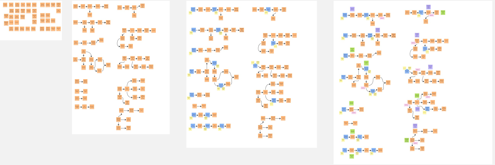

#### 4.1.1.1. Candidate Context Discovery

El equipo aplicó las tres técnicas de Candidate Context Discovery en conjunto, no de forma excluyente, sobre el tablero ya organizado en commands, policies y read models:

- **Look-for-pivotal-events:** se buscaron los eventos que marcan un cambio de estado entre procesos de negocio distintos, es decir, los puntos donde un flujo termina y dispara (vía policy) el inicio de otro. `Reserva aceptada` es pivotal porque dispara la habilitación de acceso físico; `Pago fue registrado` / `Deuda marcada como pagada` es pivotal porque libera al residente de una suspensión de acceso; `Residente moroso fue detectado` es pivotal porque cruza de Payment hacia el control de acceso. Estos pivotes son los que terminaron materializándose como los eventos de integración entre contextos documentados en 4.1.1.2 y 4.1.2.
- **Start-with-value:** se identificaron las partes del dominio con mayor valor diferencial para el negocio, usando como referencia directa las estrategias frente a competidores de 2.1.2, en particular la **Estrategia 6, "Gestión inteligente de áreas comunes"** (optimizar el uso de los recursos compartidos del condominio) y la **Estrategia 5, "Adaptación al contexto local"**,, que son las dos que el nivel IoT lleva más allá de lo que ofrecen Condo Control, Buildium y AppFolio. De las capacidades IoT exploradas en el storm, iluminación inteligente, control de acceso, monitoreo de tanque de agua, detección de fugas, riego automático, el equipo priorizó **acceso físico** y **iluminación/energía** por ser las de mayor valor demostrable dentro del alcance de un proyecto académico con hardware real (ESP32), y difirió riego y monitoreo de agua por requerir sensores/actuadores adicionales (electroválvulas, sensores de humedad de suelo, sensores de nivel) fuera del alcance de hardware de esta entrega.

  Esta decisión tiene un efecto directo sobre el Product Backlog de 3.3 que conviene explicitar: las historias **US50** (configurar horarios de riego), **US51** (riego según humedad del suelo) y **US52** (detección de fugas en tanque de agua) quedan **fuera del alcance de esta entrega** y no se les asigna bounded context en 4.2. Las tres estaban priorizadas como *Could Have* en el backlog, de modo que diferirlas no altera el alcance comprometido como *Must* o *Should*. Las restantes historias de la épica EP07 sí tienen contexto asignado: **US48** y **US49** en IoT Access Management, y **US53** en Smart Lighting & Automation. Del mismo modo, los términos *Monitoreo de Tanque de Agua*, *Detección de Fugas*, *Riego Automático* y *Calidad del Aire* definidos en el Ubiquitous Language de 2.5 permanecen como vocabulario del dominio, pero sin contexto implementador en esta entrega.
- **Start-with-simple:** el timeline ya organizado en el paso 2 de EventStorming se descompuso en sub-timelines secuenciales por proceso (autenticación → gestión residencial → reservas → pagos → comunicación/foro → reportes, y luego los tres sub-timelines IoT), cada uno lo bastante simple como para sostener un propósito de negocio propio, ese es, en esencia, el criterio de corte que produjo los 11 candidatos de la tabla siguiente.

La tabla resume, por cada proceso de negocio que sí se mantuvo en el alcance, el *Command* y *Actor* que lo origina, los *Domain Events* producidos, y las *Policies* / *Read Models* agregados en el paso 4, es decir, el nivel de detalle sobre el que se hizo el corte de bounded contexts:

| Proceso de negocio | Command (Actor) | Domain Events clave | Policy | Read Model |
|---|---|---|---|---|
| Autenticación (IAM/Auth) | Completar formulario de registro (Residente/Administrador) · Iniciar sesión | Usuario registrado, Rol asignado a usuario, Usuario autenticado, Credenciales rechazadas, Sesión cerrada | Un residente desactivado no puede iniciar sesión | — |
| Gestión residencial | Registrar edificio y unidades (Administrador) | Edificio registrado, Unidad registrada, Residente vinculado a unidad | Rol de usuario debe ser administrador | Directorio de unidades y residentes |
| Reservas | Registrar área común (Administrador) · Solicitar/Cancelar reserva (Residente) | Área común registrada, Reglas de área común registradas, Reserva solicitada, Reserva aceptada/rechazada, Reserva cancelada | — | Calendario de reservas |
| Pagos y deudas | Registrar pago (Residente) | Deuda generada, Pago fue registrado, Pago rechazado, Deuda marcada como pagada, Recordatorio de deuda enviado | Si el pago es rechazado, la deuda permanece pendiente | Estado de cuenta del residente |
| Comunicados y foro | Publicar anuncio (Administrador) · Agregar comentario / Crear encuesta / Votar (Residente) | Anuncio publicado, Comentario agregado, Encuesta creada, Voto registrado, Encuesta finalizada | — | Muro de anuncios, Resultados de la encuesta |
| Incidencias y emergencias | Reportar incidencia (Residente) · Declarar emergencia (Administrador) | Incidencia reportada, Incidencia atendida, Incidencia resuelta, Emergencia declarada | Si la severidad es crítica, difundir a todo el edificio | Bandeja de incidencias del administrador |
| Reportes | Generar reporte financiero (Administrador) | Reporte financiero generado, Reporte financiero exportado | — | Dashboard financiero |
| Notificaciones (transversal) | *(Sistema, automático)* | Notificación enviada, Notificación leída, Notificación de deuda fue enviada, Notificación enviada a usuario/administrador | — | — |
| Acceso físico (IoT) | Escanear tarjeta (Residente) | Tarjeta RFID/NFC fue escaneada, Residente fue validado, Acceso fue concedido/rechazado/denegado, Puerta fue abierta, Tarjeta no reconocida, Residente moroso fue detectado | Si el residente es moroso, denegar el acceso | — |
| Iluminación inteligente (IoT) | Activar interruptor manual (Residente/Administrador) | Movimiento detectado/no detectado en área común, Luces encendidas/apagadas automáticamente, Temporizador de inactividad iniciado, Fallo de conexión en sensor detectado, Luces permanecieron en modo seguro | Si no hay movimiento por 3 minutos, apagar luces | — |
| *Riego y monitoreo de agua (descartado — ver start-with-value)* | *Activar riego manual* | *Riego activado/detenido automáticamente, Humedad del suelo medida, Fuga detectada, Nivel de agua medido, Fallo en válvula detectado* | *Si la humedad es suficiente, omitir el riego · Si el nivel es crítico o hay fuga, enviar alerta inmediata* | *Historial de riego, Panel de nivel de tanque de agua* |

A partir de este corte por proceso de negocio, y de la incorporación del nivel IoT priorizado, se identificaron **12 bounded contexts candidatos**, cada uno implementado como un microservicio independiente (más el API Gateway y el Edge API como componentes de infraestructura transversal, no bounded contexts de dominio). Los nueve primeros cubren la gestión administrativa del condominio; los tres últimos son los que sobrevivieron el filtro start-with-value dentro del nivel IoT:

| Sección | Bounded Context candidato | Responsabilidad principal |
|---|---|---|
| 4.2.1 | IAM / Auth | Registro, autenticación (JWT) y gestión de usuarios y roles (administradores/residentes). |
| 4.2.2 | Residential Management | Registro de edificios, unidades y vinculación de residentes a sus unidades. |
| 4.2.3 | Reservation | Disponibilidad, reserva y aprobación de uso de áreas comunes. |
| 4.2.4 | Payment | Registro de deudas, pagos, comprobantes e integración con la pasarela Culqi. |
| 4.2.5 | Notification | Envío de notificaciones push (Firebase Cloud Messaging) originadas por eventos de otros contextos. |
| 4.2.6 | Communication | Publicación de comunicados oficiales y encuestas a la comunidad. |
| 4.2.7 | Forum | Muro comunitario de mensajes entre residentes. |
| 4.2.8 | Report | Generación y exportación de reportes financieros y de morosidad. |
| 4.2.9 | Incident Management | Reporte, seguimiento y escalacion de incidencias del edificio, y difusion de alertas de emergencia a la comunidad. |
| 4.2.10 | IoT Access Management | Permisos de acceso a áreas comunes, credenciales RFID y QR dinámico, y control de cerraduras según reservas activas. |
| 4.2.11 | Smart Lighting & Automation | Reglas de automatización y control de luminarias de áreas comunes según presencia, lux ambiental, horarios de reserva y override manual. |
| 4.2.12 | IoT Telemetry & Analytics | Ingesta de telemetría de sensores, cálculo cuantitativo de consumo energético (kWh), estadísticas y detección de anomalías de hardware. |

La columna **Sección** fija la numeración con la que cada contexto se desarrolla en 4.2 y se mantiene en todo el capítulo. La única sección que presenta los contextos en otro orden es 4.1.1.3, donde los canvases se elaboran por importancia estratégica según lo pide el enunciado; allí cada canvas indica entre paréntesis la sección que le corresponde.

En cuanto a la persistencia, se mantiene el principio de **database-per-service** comprometido en la historia técnica **TS05** del Capítulo III: cada microservicio es dueño exclusivo de sus tablas y ningún contexto lee directamente las de otro. Lo que el modelo de despliegue de 4.1.3.4 hace es *alojar* esos esquemas lógicamente independientes sobre dos instancias gestionadas en vez de sobre once servidores separados, una instancia PostgreSQL para los esquemas de los contextos de gestión e IoT transaccionales, y una instancia TimescaleDB dedicada a las series de telemetría de alta frecuencia, cuyo perfil de escritura y consulta es incompatible con el transaccional. Es una decisión de infraestructura y de costo para el alcance académico del proyecto, no una relajación del aislamiento de datos entre contextos: la independencia lógica que exige TS05 se conserva íntegra.

#### 4.1.1.2. Domain Message Flows Modeling

Diagrama: [`plantuml/domain-storytelling/`](https://github.com/IoT-UPC-202620/edifika-report/tree/main/plantuml/domain-storytelling/).

**Autenticación de administrador** (Command: `RegisterAdministrator` / `SignIn` → Event: `SessionStarted`)

*Figura. Domain Story — el Administrador completa el formulario, que atraviesa el API Gateway hasta IAM/Auth, quien crea el Usuario con rol ADMIN y emite el Token JWT que habilita la sesión.*

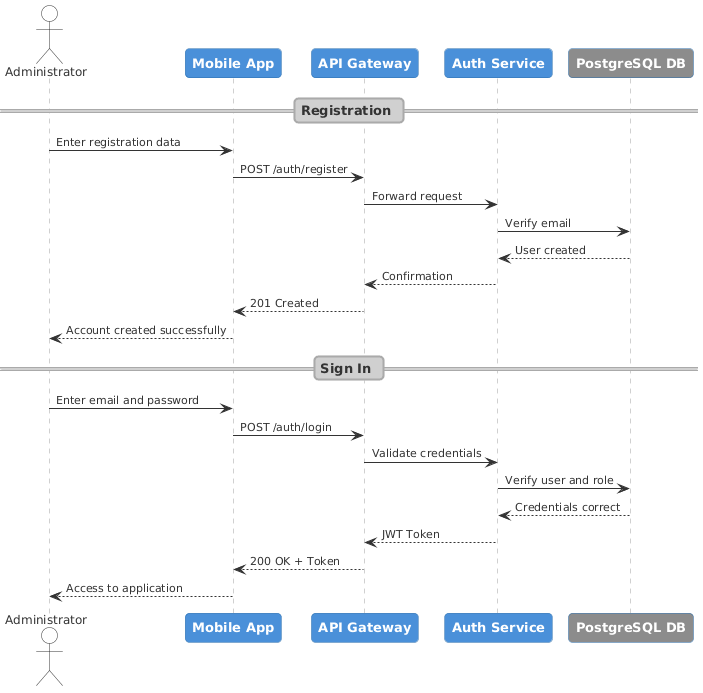

*Figura. IAM recibe el Command de registro/login vía API Gateway, valida contra su agregado de Usuario y responde con el token JWT (Event: `SessionStarted`).*

**Autenticación de residente** (Command: `LinkResidentToUnit` / `SignIn` → Event: `SessionStarted`)

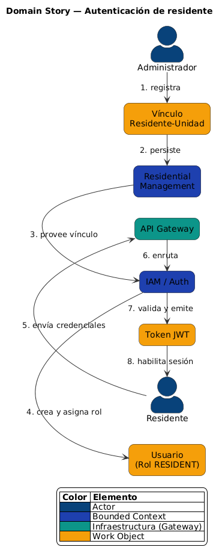

*Figura. Domain Story — a diferencia del administrador, el residente no se autorregistra: el Administrador registra el vínculo residente–unidad en Residential Management, que lo provee a IAM/Auth; recién entonces el Residente puede autenticarse.*

*Figura. A diferencia del administrador, el residente no se autorregistra: es Residential Management quien crea el vínculo residente–unidad; IAM solo valida credenciales y emite el token.*

**Publicación de comunicados** (Command: `PublishAnnouncement` → Event: `AnnouncementPublished` → Policy: notificar residentes)

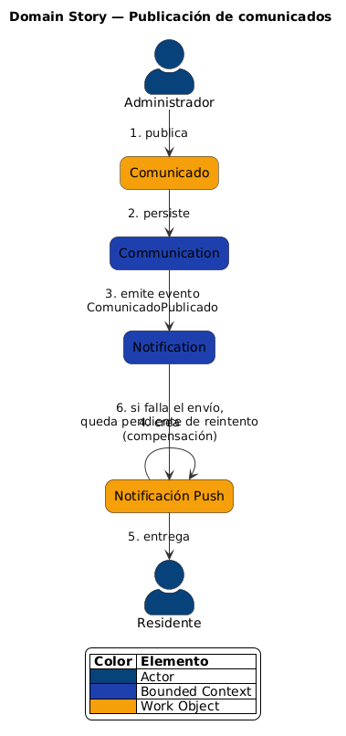

*Figura. Domain Story — el Administrador publica el Comunicado en Communication, que dispara a Notification la creación y entrega de la Notificación Push al Residente; si el envío falla, queda pendiente de reintento.*

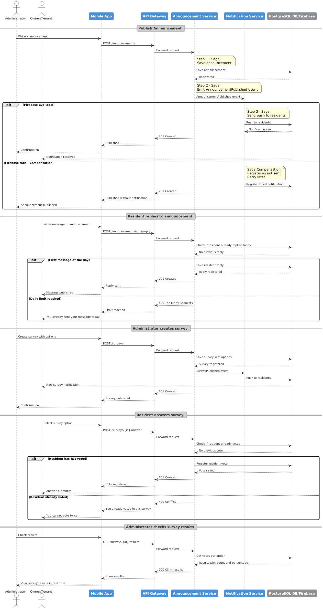

*Figura. Communication guarda el comunicado y emite el evento `AnnouncementPublished`; una policy reacciona enviando las notificaciones push a través de Notification (vía Firebase). Si el envío falla, una acción compensatoria marca la notificación como pendiente de reintento sin afectar el comunicado ya guardado.*

**Registro y aprobación de pagos** (Command: `RegisterPayment` / `ApprovePayment` → Event: `PaymentApproved`)

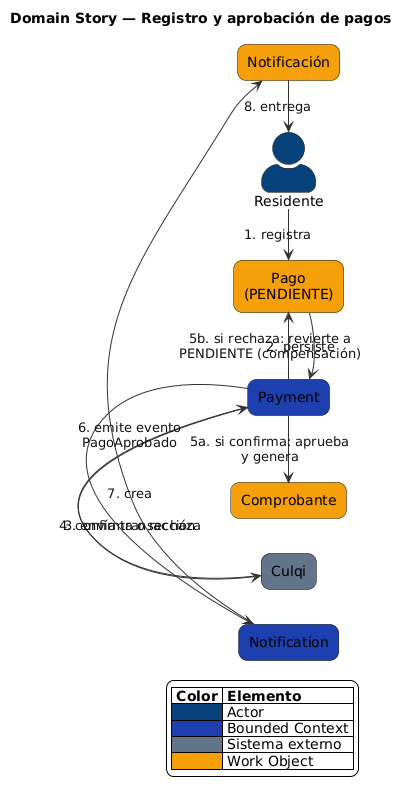

*Figura. Domain Story — el Residente registra el Pago en Payment, que lo envía a Culqi; según la confirmación, Payment aprueba y genera el Comprobante (o revierte la deuda) y notifica al Residente.*

*Figura. Payment registra el pago en estado `PENDING`; al aprobarlo, emite el evento `PaymentApproved` que dispara la policy de notificación al residente. Si la pasarela Culqi falla, la compensación revierte la deuda a `PENDING`.*

**Reserva y aprobación de áreas comunes** (Command: `CreateReservation` / `ApproveReservation` → Event: `ReservationApproved`)

*Figura. Domain Story — el Residente solicita la Reserva, el Administrador la aprueba, y Reservation dispara en paralelo la habilitación del Permiso de Acceso (IoT Access Management) y la notificación al Residente.*

*Figura. Reservation valida disponibilidad antes de crear la reserva; al aprobarla, emite `ReservationApproved`, que dispara la notificación al residente vía Notification.*

**Generación de reportes financieros** (Query: `GetFinancialReport` — solo lectura, sin Command ni Event)

*Figura. Domain Story — el Administrador solicita el Reporte Financiero, Report consulta a Payment vía REST, consolida y exporta el reporte de vuelta al Administrador; al ser de solo lectura, no hay Policy ni compensación involucradas.*

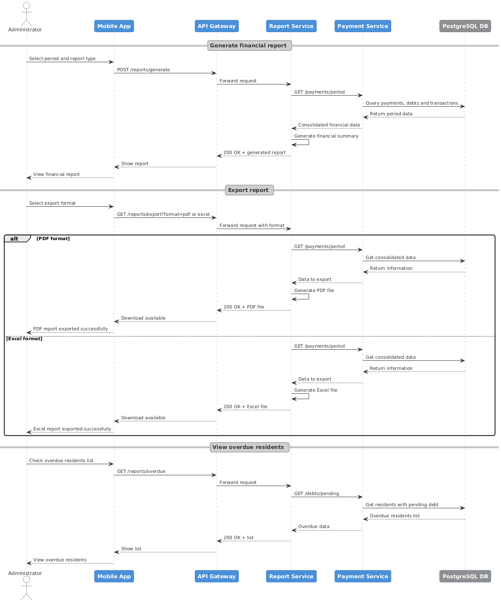

*Figura. Report consulta datos de Payment vía REST para consolidar y exportar reportes; al ser de solo lectura, no participa del flujo de eventos/compensaciones de los demás contextos.*

#### 4.1.1.3. Bounded Context Canvases

Siguiendo a Nick Tune (*Bounded Context Canvas*, DDD Crew), cada contexto candidato de 4.1.1.1 se elaboró con el proceso iterativo de seis pasos indicado por el enunciado: **(1) Context Overview Definition** (nombre y propósito en una frase), **(2) Business Rules Distillation & Ubiquitous Language Capture** (reglas de negocio que el contexto hace cumplir y términos propios del dominio), **(3) Capability Analysis** (clasificación estratégica: rol de dominio Core/Supporting/Generic, modelo de negocio y estadio de evolución de Wardley), **(4) Capability Layering** (cuando el contexto agrupa más de una capability, se anota la jerarquía), **(5) Dependencies Capture** (comunicación entrante y saliente, con el patrón DDD de 4.1.2), y **(6) Design Critique** (alternativas consideradas y por qué se descartaron).

El orden de elaboración siguió el criterio de importancia pedido por el enunciado: primero los contextos de los que depende toda la plataforma (IAM/Auth, Payment, Residential Management, Reservation), luego los tres contextos IoT que sostienen la propuesta de diferenciación del Capítulo II, y por último los contextos de soporte/genéricos (Communication, Notification, Report, Forum).

**1. IAM / Auth (4.2.1)**

| Campo | Detalle |
|---|---|
| Purpose | Autenticar y autorizar a administradores y residentes, siendo la única fuente de identidad, roles y tokens JWT de la plataforma. |
| Strategic Classification | Domain Role: **Generic** (autenticación JWT es un problema resuelto en la industria) · Business Model: Compliance Enforcer · Evolution: **Product** (patrón bien entendido; se construyó in-house en vez de adoptar un IDaaS externo como Auth0). |
| Ubiquitous Language | User, Role (ADMIN / RESIDENT), Credential, JWT, Session. |
| Business Decisions | Un residente desactivado no puede iniciar sesión · las acciones administrativas exigen rol ADMIN · las contraseñas se almacenan hasheadas y el JWT tiene expiración. |
| Inbound Communication | **Residential Management** (Customer/Supplier, REST síncrono) — provee el vínculo residente–unidad que autoriza la creación de la cuenta de un residente. |
| Outbound Communication | Ninguna: IAM no invoca a ningún otro contexto. Es *upstream* respecto de todos los contextos que validan su JWT (**Conformist** del contrato de token vía API Gateway), y *downstream* únicamente respecto de Residential Management, de quien recibe el vínculo residente–unidad. |
| Model (Aggregates) | `User` (Aggregate Root), `UserRol` (Entity referenciada por el agregado mediante el identificador `RolId`; ver 4.2.1.1). Value Objects: `Email`, `PasswordHash`, `JwtToken`. |
| Design Critique | Se evaluó externalizar a un IDaaS (Auth0/Firebase Auth) para reducir el mantenimiento de hashing/tokens, pero se descartó por el costo recurrente en un SaaS de bajo ticket y porque el modelo de roles (ADMIN/RESIDENT) está fuertemente acoplado al dominio propio de Residential Management. |

**2. Payment (4.2.4)**

| Campo | Detalle |
|---|---|
| Purpose | Registrar deudas y pagos de mantenimiento, y llevar a un residente moroso a un estado que otros contextos (acceso IoT) puedan consultar. |
| Strategic Classification | Domain Role: **Core** (motor de ingresos del negocio) · Business Model: Revenue Generator · Evolution: **Product** (procesamiento de pagos es un dominio bien entendido; lo diferencial es la integración con Culqi y la propagación de morosidad). |
| Ubiquitous Language | Debt (Deuda), Payment (Pago), Receipt (Comprobante), Delinquent Resident (Residente Moroso). |
| Business Decisions | Si el pago es rechazado, la deuda permanece pendiente · un pago aprobado genera constancia y notifica al residente · un residente con deuda vencida se marca moroso y esto restringe su acceso físico (ver IoT Access Management). |
| Inbound Communication | **Report** (Customer/Supplier, REST síncrono) — consulta datos de Payment para consolidar reportes financieros. |
| Outbound Communication | **Notification** (Customer/Supplier, evento `PaymentApproved`) · **IoT Access Management** (Customer/Supplier, evento `ResidentMarkedDelinquent`) · **Culqi** (Anti-Corruption Layer — pasarela de pagos externa). |
| Model (Aggregates) | `Debt` (Entity), `Payment` (Aggregate Root). |
| Design Critique | Se consideró que Payment abriera directamente el acceso/bloqueo físico del residente moroso, pero se descartó: acoplaría un contexto financiero a reglas de hardware. En su lugar, Payment solo publica el evento y es IoT Access Management quien decide la consecuencia sobre el acceso, manteniendo el Single Responsibility de cada contexto. |

**3. Residential Management (4.2.2)**

| Campo | Detalle |
|---|---|
| Purpose | Ser la fuente de verdad de edificios, unidades y del vínculo entre un residente y su unidad. |
| Strategic Classification | Domain Role: **Supporting** (necesario, pero no diferenciador) · Business Model: Engagement Creator · Evolution: **Product** (gestión de catálogo/CRUD es un patrón conocido). |
| Ubiquitous Language | Building (Edificio), Unit (Unidad), Resident-Unit Link (Vínculo Residente–Unidad). |
| Business Decisions | Un residente solo puede vincularse a una unidad activa · el residente no se autorregistra: es el administrador quien crea el vínculo (ver 4.1.1.2, "Autenticación de residente"). |
| Inbound Communication | Ninguna: no consume eventos ni llamadas de otros contextos de negocio. |
| Outbound Communication | **IAM** (Customer/Supplier, REST síncrono) — provee el vínculo residente–unidad que IAM usa para autorizar. |
| Model (Aggregates) | `Building` (Entity), `Unit` (Entity). |
| Design Critique | Se evaluó fusionar este contexto con IAM (ambos gestionan "quién es quién"), pero se mantuvo separado porque su ciclo de cambio es distinto: Residential Management cambia cuando cambia el padrón de residentes/unidades, mientras IAM cambia cuando cambian las políticas de autenticación — fusionarlos violaría el criterio de *single responsibility* de DDD. |

**4. Reservation (4.2.3)**

| Campo | Detalle |
|---|---|
| Purpose | Gestionar disponibilidad, solicitud, aprobación y cancelación de áreas comunes, siendo el disparador de la habilitación de acceso físico y de iluminación. |
| Strategic Classification | Domain Role: **Supporting** · Business Model: Engagement Creator · Evolution: **Product** (los sistemas de booking/disponibilidad son un patrón bien conocido). |
| Ubiquitous Language | Common Area (Área Común), Reservation (Reserva), Availability (Disponibilidad), Time Window (Ventana Horaria). |
| Business Decisions | No se puede reservar un área común fuera de sus reglas de uso/horario configuradas · no se permiten reservas duplicadas para la misma ventana horaria. |
| Inbound Communication | Ninguna: es un contexto *upstream* puro — no consume eventos ni llamadas de otros contextos. |
| Outbound Communication | **Notification** (Customer/Supplier, evento `ReservationApproved`) · **IoT Access Management** (Customer/Supplier, evento `ReservationApproved`) · **Smart Lighting & Automation** (Customer/Supplier, evento `ReservationStarted` disparado por un scheduler interno que detecta el inicio de la ventana horaria). |
| Model (Aggregates) | `CommonArea` (Entity), `Reservation` (Aggregate Root). |
| Design Critique | Se consideró que Reservation controlara directamente el actuador de acceso/luces al aprobar una reserva, pero se descartó: acoplaría un contexto administrativo a protocolos de hardware (MQTT/Edge). Reservation solo emite el evento de dominio; son los contextos IoT quienes lo traducen a una acción física. |

**5. IoT Access Management (4.2.10)**

| Campo | Detalle |
|---|---|
| Purpose | Decidir y auditar quién puede abrir físicamente un área común, combinando credenciales, reservas vigentes y estado de morosidad. |
| Strategic Classification | Domain Role: **Core** (pilar de la propuesta de diferenciación IoT del Capítulo II) · Business Model: Revenue Protector / Compliance Enforcer · Evolution: **Custom Built** (la combinación RFID + QR dinámico + reservas + morosidad no es un producto de catálogo). |
| Ubiquitous Language | Access Credential (Credencial de Acceso), Access Permission (Permiso de Acceso), Access Attempt (Intento de Acceso), Delinquent Resident. |
| Business Decisions | Una credencial concede acceso solo si está activa, el residente no está moroso y existe un permiso vigente para esa área en ese instante (`AccessDecisionService`, ver 4.2.10.1) · un residente moroso se suspende automáticamente. |
| Inbound Communication | **Reservation** (Customer/Supplier, evento `ReservationApproved`) · **Payment** (Customer/Supplier, evento `ResidentMarkedDelinquent`). |
| Outbound Communication | **Notification** (Customer/Supplier, eventos `PhysicalAccessGranted` / `PhysicalAccessDenied`) · **Edge API** (**Conformist** — sincroniza credenciales activas, reservas vigentes y blacklist hacia el gateway on-premise). |
| Model (Aggregates) | `AccessCredential` (Aggregate Root), `AccessPermission` (Entity), `AccessAttempt` (Entity). |
| Design Critique | Se evaluó que el Edge API tomara la decisión de acceso de forma autónoma consultando el cloud en cada intento, pero se descartó por latencia y por el requisito de resiliencia offline: la decisión final se cachea en el Edge y solo se sincroniza cuando hay conectividad, de ahí la relación Conformist hacia el Edge en vez de Customer/Supplier síncrona en tiempo real. |

**6. Smart Lighting & Automation (4.2.11)**

| Campo | Detalle |
|---|---|
| Purpose | Encender/apagar luminarias de áreas comunes combinando presencia, lux ambiental, horario de reserva y override manual, priorizando el ahorro energético. |
| Strategic Classification | Domain Role: **Core** (diferenciador IoT) · Business Model: Cost Reducer (ahorro energético) · Evolution: **Custom Built** (la precedencia entre presencia/lux/reserva/override es una regla propia del negocio, no un producto de catálogo). |
| Ubiquitous Language | Automation Rule (Regla de Automatización), Luminaire (Luminaria), Override Command (Comando de Override), Lux Threshold (Umbral de Lux). |
| Business Decisions | Si no hay movimiento por 3 minutos, apagar luces (política capturada en el EventStorm, ver 4.1.1.1) · un override manual suspende temporalmente la automatización con precedencia sobre las reglas programadas. |
| Inbound Communication | **Reservation** (Customer/Supplier, evento `ReservationStarted`) — el inicio de una reserva dispara el encendido programado del área · **Edge API** (Customer/Supplier, evento `AreaPresenceDetected` relayado desde el sensor PIR del nodo de iluminación, ver 4.2.11.3). |
| Outbound Communication | **Edge API** (**Conformist** — envía reglas de programación y comandos de override para ejecución local). |
| Model (Aggregates) | `AutomationRule` (Aggregate Root), `Luminaire` (Entity), `OverrideCommand` (Entity). |
| Design Critique | Se evaluó ejecutar la lógica de decisión (`AutomationDecisionService`) directamente en el Edge para no depender de la conectividad WAN, pero se optó por mantener la autoría de reglas en el cloud (más fácil de versionar y auditar desde la Web Application) y solo *empujar* las reglas ya resueltas al Edge — el mismo patrón Conformist que IoT Access Management. |

**7. IoT Telemetry & Analytics (4.2.12)**

| Campo | Detalle |
|---|---|
| Purpose | Ingerir telemetría de sensores, calcular consumo energético cuantitativo (kWh) y detectar anomalías de hardware, sosteniendo el requisito de analítica cuantitativa IoT del curso. |
| Strategic Classification | Domain Role: **Core** (el más diferenciador de los tres contextos IoT: es el único que produce analítica cuantitativa) · Business Model: Decision Support / Cost Reducer · Evolution: **Genesis → Custom Built** (el cálculo de integración temporal de potencia y la detección de anomalías por baseline estadística se diseñaron a medida para este dominio). |
| Ubiquitous Language | Sensor Reading (Lectura de Sensor), Energy Consumption (Consumo Energético), Consumption Baseline (Línea Base de Consumo), Anomaly Flag (Marca de Anomalía). |
| Business Decisions | El consumo se calcula por integración temporal de la potencia instantánea (`kWh = Σ(V × I × Δt) / 1000`) · una anomalía se distingue de una falla de luminaria por el patrón de corriente nula con la luminaria comandada en ON (`AnomalyDetectionService`, ver 4.2.12.1). |
| Inbound Communication | **Edge API** (Customer/Supplier, el Edge es *upstream* de datos) — reenvía la telemetría bufferizada y los registros de auditoría generados offline. |
| Outbound Communication | **Notification** (eventos `AbnormalConsumptionDetected`, `LuminaireFailureDetected`) · **Report** (Customer/Supplier — aporta las métricas de consumo que Report consolida). |
| Model (Aggregates) | `EnergyConsumption` (Aggregate Root), `ConsumptionBaseline` (Entity), `AnomalyFlag` (Entity), `SensorReading` (Value Object). |
| Design Critique | Se consideró persistir la telemetría en la misma instancia PostgreSQL que el resto del dominio, pero se descartó por el perfil de escritura (alta frecuencia) y de consulta (series temporales) incompatible con el transaccional — de ahí la instancia TimescaleDB dedicada (ver 4.1.3.4), la única decisión de persistencia que rompe el patrón "un PostgreSQL para todos" del resto de contextos. |

**8. Incident Management (4.2.9)**

| Campo | Detalle |
|---|---|
| Purpose | Permitir que un residente reporte una incidencia del edificio y que el administrador la siga hasta su cierre, y difundir alertas de emergencia a toda la comunidad. |
| Strategic Classification | Domain Role: **Supporting** · Business Model: Engagement Creator / Compliance Enforcer · Evolution: **Product** (la gestión de tickets es un patrón conocido; lo propio del dominio es la escalación por severidad y la ubicación por torre/unidad). |
| Ubiquitous Language | Incident (Incidencia), Incident Update (Seguimiento de Incidencias), Emergency Broadcast (Alerta de Emergencia), Severity (Severidad) — términos tomados directamente de 2.5. |
| Business Decisions | Una incidencia de severidad `CRITICAL` se difunde de inmediato a todo el edificio; el resto se enruta solo al administrador · toda incidencia queda georreferenciada a la torre y el departamento del residente que la reporta (US08 esc. 2). |
| Inbound Communication | Ninguna: es el residente o el administrador quien origina el hecho de dominio, no otro contexto. |
| Outbound Communication | **Residential Management** (Customer/Supplier, REST síncrono — resuelve la ubicación del residente) · **Notification** (Customer/Supplier, eventos `IncidentReported`, `IncidentStatusChanged` y `EmergencyDeclared`) · **Cloudinary** (Anti-Corruption Layer — fotografías de la incidencia). |
| Model (Aggregates) | `Incident` (Aggregate Root), `IncidentUpdate` (Entity), `EmergencyBroadcast` (Entity). |
| Design Critique | Se evaluó anexar esta capability a Communication, que ya publica contenido hacia los residentes, pero se descartó por la misma razón que separa Communication de Forum: un comunicado es unidireccional y lo origina el administrador, mientras una incidencia la origina el residente y tiene ciclo de vida, estados y seguimiento propios. También se consideró introducir el rol *Personal de Mantenimiento* que define el Ubiquitous Language de 2.5 para asignarle las incidencias; se difirió porque los Capítulos I y III solo definen dos segmentos objetivo (administrador y residente), y añadir un tercer rol en IAM excedería lo especificado. |

**9. Communication (4.2.6)**

| Campo | Detalle |
|---|---|
| Purpose | Publicar comunicados oficiales y encuestas de la comunidad hacia los residentes. |
| Strategic Classification | Domain Role: **Supporting** · Business Model: Engagement Creator · Evolution: **Product** (publicación de anuncios/encuestas es un patrón conocido). |
| Ubiquitous Language | Announcement (Comunicado), Poll (Encuesta), Reach (Alcance). |
| Business Decisions | Límite de un mensaje diario por residente (HTTP 429 si se excede) · voto único por encuesta (HTTP 409 si se duplica). |
| Inbound Communication | Ninguna. |
| Outbound Communication | **Notification** (Customer/Supplier, evento `AnnouncementPublished`) · **Cloudinary** (Anti-Corruption Layer — imágenes de comunicados). |
| Model (Aggregates) | `Announcement` (Entity), `Poll` (Entity). |
| Design Critique | Se evaluó fusionar Communication con Forum (ambos son "muros" de contenido), pero se mantuvieron separados porque su ubiquitous language y su ciclo de vida difieren: un comunicado es unidireccional y oficial (admin → todos), mientras un post de Forum es conversacional entre pares. |

**10. Notification (4.2.5)**

| Campo | Detalle |
|---|---|
| Purpose | Traducir eventos de dominio de todo el sistema en notificaciones push entregadas al residente o administrador correcto. |
| Strategic Classification | Domain Role: **Generic** (envío de notificaciones es una capability resuelta por FCM) · Business Model: Engagement Creator · Evolution: **Commodity** (delegada casi por completo a Firebase Cloud Messaging). |
| Ubiquitous Language | Notification (Notificación), Device Token (Token de Dispositivo). |
| Business Decisions | Si el envío a FCM falla, la notificación se marca pendiente de reintento sin afectar el estado del contexto que originó el evento (compensación, ver 4.1.1.2). |
| Inbound Communication | **Communication** (`AnnouncementPublished`) · **Payment** (`PaymentApproved`) · **Reservation** (`ReservationApproved`) · **IoT Access Management** (`PhysicalAccessGranted`/`Denied`) · **IoT Telemetry & Analytics** (`AbnormalConsumptionDetected`, `LuminaireFailureDetected`) — todos Customer/Supplier, Notification es downstream puro. |
| Outbound Communication | **Firebase Cloud Messaging** (Anti-Corruption Layer). |
| Model (Aggregates) | `Notification` (Entity), `DeviceToken` (Entity). |
| Design Critique | Al ser el único punto de consumo de eventos de los cinco contextos que publican alertas (Communication, Payment, Reservation, IoT Access Management e IoT Telemetry & Analytics), se evaluó el riesgo de que un fallo en Notification bloqueara el broker para todos; se mitigó con el **Factory Pattern** para desacoplar la creación del tipo de notificación (Push/Email/SMS) de su envío, y con colas de reintento independientes por evento. |

**11. Report (4.2.8)**

| Campo | Detalle |
|---|---|
| Purpose | Consolidar y exportar reportes financieros, de morosidad y de analítica de consumo energético de la comunidad. |
| Strategic Classification | Domain Role: **Supporting** · Business Model: Decision Support · Evolution: **Product** (generación de reportes PDF/Excel es un patrón conocido). |
| Ubiquitous Language | Financial Report (Reporte Financiero), Delinquency (Morosidad). |
| Business Decisions | Contexto mayormente de solo lectura (CQRS): no posee agregados transaccionales propios, solo modelos de lectura. |
| Inbound Communication | Ninguna. |
| Outbound Communication | **Payment** (Customer/Supplier, REST síncrono) · **IoT Telemetry & Analytics** (Customer/Supplier — métricas de consumo). |
| Model (Aggregates) | `FinancialReport` (modelo de lectura, sin Aggregate Root transaccional). |
| Design Critique | Se evaluó que Report consumiera eventos de Payment de forma asíncrona (event sourcing de proyecciones) en vez de consultarlo vía REST síncrono, lo que reduciría el acoplamiento temporal; se descartó por ahora dado el volumen de datos y el timebox del proyecto, dejándolo como una mejora futura explícita. |

**12. Forum (4.2.7)**

| Campo | Detalle |
|---|---|
| Purpose | Sostener el muro comunitario de mensajes entre residentes de un mismo edificio. |
| Strategic Classification | Domain Role: **Generic** · Business Model: Engagement Creator · Evolution: **Commodity** (patrón de muro/foro ampliamente disponible). |
| Ubiquitous Language | Post (Publicación), Wall (Muro). |
| Business Decisions | Límite de publicaciones diarias por residente (HTTP 429 si se excede). |
| Inbound Communication | Ninguna. |
| Outbound Communication | **Cloudinary** (Anti-Corruption Layer — imágenes de publicaciones del foro). |
| Model (Aggregates) | `Post` (Entity). |
| Design Critique | Es el contexto de menor prioridad estratégica de los 12 (Domain Role Generic, Evolution Commodity); se evaluó no construirlo como microservicio independiente y anexarlo a Communication, pero se mantuvo separado porque su Ubiquitous Language y su patrón de acceso (conversacional, muchos-a-muchos) son distintos a los de un comunicado oficial (uno-a-muchos), y porque así puede escalar o degradarse independientemente sin afectar la publicación de comunicados oficiales. |

### 4.1.2. Context Mapping

El context map documenta las relaciones estructurales entre contextos derivadas de los flujos de colaboración de 4.1.1.2 y del modelo de arquitectura ([`arquitectura/diagrama.dsl`](https://github.com/IoT-UPC-202620/edifika-report/blob/main/arquitectura/diagrama.dsl)); la clasificación según los patrones de relación de DDD que se lista en la tabla quedó validada por la discusión de alternativas que cierra esta sección y por el campo *Design Critique* de cada Bounded Context Canvas (4.1.1.3).

El nivel IoT introduce un patrón de relación característico de este tipo de soluciones: el **Conformist**. El Edge API y el firmware de los dispositivos no negocian su modelo con los contextos cloud —consumen el contrato de credenciales, reglas y comandos tal como lo define el nivel cloud— porque duplicar o traducir ese modelo en un dispositivo con recursos limitados no se justifica. La relación inversa (telemetría y auditoría que suben del edge al cloud) sí es Customer/Supplier: el edge es el productor del dato y los contextos cloud lo consumen.

| Contexto origen | Contexto destino | Relación observada | Patrón DDD más cercano (a validar) |
|---|---|---|---|
| Communication | Notification | Emite evento al publicar un comunicado para que se notifique a los residentes. | Customer/Supplier (Communication es upstream) |
| Payment | Notification | Emite evento al aprobar un pago. | Customer/Supplier |
| Reservation | Notification | Emite evento al aprobar una reserva. | Customer/Supplier |
| Payment | Culqi (sistema externo) | Integración vía Adapter/ACL (pasarela de pagos). | Anti-corruption Layer |
| Report | Payment | Consulta síncrona vía REST para consolidar reportes financieros. | Customer/Supplier (Report es downstream, solo lectura) |
| Residential Management | IAM | Provee el vínculo residente–unidad que IAM usa para autorizar el acceso. | Customer/Supplier |
| Reservation | IoT Access Management | `ReservationApproved` habilita el permiso temporal de acceso al área común reservada. | Customer/Supplier (Reservation es upstream) |
| Reservation | Smart Lighting & Automation | El inicio de la reserva dispara el encendido programado del área común. | Customer/Supplier |
| Payment | IoT Access Management | `ResidentMarkedDelinquent` suspende los permisos de acceso del residente moroso. | Customer/Supplier |
| Incident Management | Notification | Emite `IncidentReported`, `IncidentStatusChanged` y `EmergencyDeclared` para avisar al administrador y, en emergencias, a toda la comunidad. | Customer/Supplier |
| Incident Management | Residential Management | Consulta síncrona para resolver la torre y el departamento del residente que reporta la incidencia (US08 esc. 2). | Customer/Supplier (Incident Management es downstream) |
| Incident Management | Cloudinary (sistema externo) | Integración vía Adapter/ACL para las fotografías adjuntas a la incidencia. | Anti-corruption Layer |
| IoT Access Management | Notification | Emite `PhysicalAccessGranted` / `PhysicalAccessDenied` para notificar accesos y rechazos. | Customer/Supplier |
| IoT Telemetry & Analytics | Notification | Emite `AbnormalConsumptionDetected` y `LuminaireFailureDetected` para alertar al administrador. | Customer/Supplier |
| IoT Telemetry & Analytics | Report | Aporta las métricas de consumo energético que Report consolida en la analítica de la comunidad. | Customer/Supplier (Report es downstream) |
| IoT Access Management | Edge API | Sincroniza credenciales activas, reservas vigentes y blacklist hacia el gateway on-premise. | Conformist (el Edge conforma el modelo definido en el cloud) |
| Smart Lighting & Automation | Edge API | Envía las reglas de automatización y los comandos de override manual. | Conformist |
| Edge API | IoT Telemetry & Analytics | Reenvía la telemetría bufferizada y los registros de auditoría generados durante la operación offline. | Customer/Supplier (el Edge es upstream de datos) |
| Edge API | Smart Lighting & Automation | Relaya el evento `AreaPresenceDetected` apenas recibe la lectura del sensor PIR, priorizando latencia de encendido sobre interpretación de dominio. | Customer/Supplier (el Edge es upstream de datos, ver 4.2.11.3) |
| Dispositivos embebidos (ESP32) | Edge API | Intercambio local MQTT de lecturas y comandos; el firmware se adapta al contrato del Edge API. | Conformist (infraestructura física, no bounded context de dominio) |
| API Gateway | Todos los contextos | Enrutamiento y validación de JWT (infraestructura transversal, no bounded context de dominio). | — |

**Discusión de alternativas de context mapping**

Sobre el mapa anterior, el equipo evaluó explícitamente las preguntas de diseño sugeridas por el enunciado. La tabla siguiente resume los casos donde la respuesta no era obvia, la alternativa considerada y la decisión final:

| Pregunta de diseño | Alternativa evaluada | Decisión final y razón |
|---|---|---|
| ¿Qué pasaría si **movemos** este capability a otro contexto? | Mover la decisión de acceso (`AccessDecisionService`) del cloud (IoT Access Management) al Edge API, para que abra la puerta sin ida y vuelta al cloud. | **Se descarta mover el contexto completo**, pero sí se replica su *resultado* (credenciales/permisos ya resueltos) en el Edge vía sincronización — el Edge cachea la decisión, no la recalcula. Mantiene a IoT Access Management como única fuente de verdad y evita que la regla de negocio (moroso → sin acceso) viva en dos lugares. |
| ¿Qué pasaría si **descomponemos** el capability y movemos un sub-capability a otro contexto? | Separar la emisión/gestión de credenciales RFID/QR de la decisión de acceso en tiempo real, creando un contexto "Credential Management" aparte de "Access Decision". | **Se descarta**: ambos sub-capabilities comparten el mismo Aggregate (`AccessCredential`) y el mismo invariante (una credencial suspendida no debe poder decidir un acceso), partirlos forzaría una transacción distribuida para algo que hoy es una operación local. |
| ¿Qué pasaría si **partimos** el bounded context en varios? | Partir Payment en "Billing" (deudas/cuotas) y "Payment Processing" (cobro/Culqi) como dos contextos independientes. | **Se descarta para el alcance actual**: el volumen de reglas de negocio no justifica el costo de coordinación entre dos contextos: la Saga de aprobación (4.1.1.2) necesita ambas responsabilidades en la misma transacción local. Queda anotado como refactor natural si el dominio de facturación creciera (ej. múltiples pasarelas de pago). |
| ¿Qué pasaría si **tomamos capabilities de 3 contexts** para formar uno nuevo? | Extraer la lógica de "generar alerta" que hoy vive de forma repetida en IoT Access Management, Smart Lighting y IoT Telemetry, y consolidarla en un contexto nuevo. | **Ya resuelto por diseño**: ese contexto nuevo es exactamente **Notification** — los tres contextos IoT solo publican el evento de dominio (`PhysicalAccessDenied`, `AbnormalConsumptionDetected`, etc.) y es Notification quien concentra el *Factory Pattern* de creación de la alerta (push/email/SMS), evitando triplicar esa lógica. |
| ¿Qué pasaría si **duplicamos** una funcionalidad para romper una dependencia? | Que Report mantenga su propia copia denormalizada de pagos/deudas (vía eventos) en lugar de consultar a Payment por REST síncrono. | **Se descarta por ahora** (queda como Design Critique de Report en 4.1.1.3): el volumen de datos y el timebox del proyecto no justifican construir un pipeline de proyecciones; se acepta el acoplamiento síncrono Report → Payment sabiendo que es la única lectura cross-context sin desacoplar del informe. |
| ¿Qué pasaría si creamos un **shared service** para reducir duplicación? | Un servicio compartido de "estado de morosidad" consultado tanto por IoT Access Management como por futuras integraciones (ej. bloqueo de reservas a morosos). | **Se descarta un servicio nuevo**: Payment ya es la fuente de verdad y publica `ResidentMarkedDelinquent`; crear un shared service solo agregaría un salto de red adicional sin nueva capability. Se prefiere que cada contexto interesado se suscriba al evento (Customer/Supplier) en vez de introducir un Shared Kernel. |
| ¿Qué pasaría si **aislamos los core capabilities** y movemos el resto a un contexto aparte? | Separar `EnergyCalculationService`/`AnomalyDetectionService` (core, diferenciador) de la ingesta cruda de telemetría (`TelemetryIngestionService`, más genérica) en dos contextos. | **Se descarta dividir en dos microservicios** por el timebox del curso, pero sí se aisló en capas dentro del mismo contexto (Domain Service vs. Application Service, ver 4.2.12): si el volumen de sensores creciera, la ingesta cruda es la primera candidata a externalizarse hacia una plataforma IoT genérica (ej. AWS IoT Core), dejando el cálculo de energía y la detección de anomalías —el verdadero valor de negocio— en el contexto propio. |

Ninguna de las siete preguntas llevó a mover una línea del context map de la tabla anterior; el resultado de la discusión fue, en todos los casos, una confirmación explícita del diseño existente (o una nota de refactor futuro), no un cambio de alcance.

### 4.1.3. Software Architecture

La arquitectura se modeló con **C4 Model** aplicando *Diagram-as-Code* mediante **Structurizr DSL**. El modelo fuente único vive en [`arquitectura/diagrama.dsl`](https://github.com/IoT-UPC-202620/edifika-report/blob/main/arquitectura/diagrama.dsl) y de él se generan las cuatro vistas que se presentan a continuación (System Landscape, System Context, Container y Deployment), de modo que los cuatro diagramas son siempre consistentes entre sí por construcción.

La solución adopta una **arquitectura IoT distribuida en tres niveles** —*Cloud Computing*, *Edge Computing* y *IoT Devices con Embedded Systems*— y se apoya en los siguientes estilos y patrones:

- **Microservices Architecture:** escalabilidad y disponibilidad independientes; un fallo en Comunicados no interrumpe Pagos ni el control de accesos.
- **Layered Architecture** dentro de cada microservicio (Interface / Application / Domain / Infrastructure).
- **API Gateway Pattern:** punto único de entrada, validación del JWT, **políticas CORS** (TS15), rate limiting y enrutamiento.
- **Event-Driven Architecture:** un *Message & Event Broker* AMQP/MQTT desacopla la publicación de eventos de dominio de su consumo. Esto **complementa** —no reemplaza— la comunicación REST entre microservicios comprometida en la historia técnica **TS13** del Capítulo III: se usa REST síncrono cuando el emisor necesita la respuesta para continuar (Report → Payment, Residential Management → IAM, y la sincronización Cloud → Edge), y eventos asíncronos cuando el emisor no debe quedar bloqueado ni acoplado al consumidor (todo lo que desemboca en Notification, y los disparadores hacia los contextos IoT).
- **Saga Pattern coreografiado:** consistencia entre contextos sin locks distribuidos (ver 4.1.1.2).
- **CQRS parcial:** Report separa la lectura de reportes de las operaciones de escritura de los demás contextos.
- **Edge Computing offline-first:** el Edge API cachea credenciales y reservas activas, y mantiene operativos los accesos y la iluminación de áreas comunes aunque se caiga el enlace WAN del condominio.

**Tres decisiones que se apartan de lo especificado en el Capítulo III**

La arquitectura debe ser fiel a los requisitos, y donde se aparta de ellos corresponde declararlo en vez de dejar la divergencia tácita:

| Decisión | Lo que especifica el Capítulo III | Lo que hace la arquitectura y por qué |
|---|---|---|
| **Tres contextos IoT en lugar de uno** | TS16 define un único microservicio *IoT Access Management* que gestiona "el registro, estado y eventos de los dispositivos inteligentes del edificio" | Se separa en IoT Access Management, Smart Lighting & Automation e IoT Telemetry & Analytics. Los tres tienen Ubiquitous Language, invariantes y perfiles de carga distintos —decisión de acceso, precedencia de reglas de iluminación e ingesta de series temporales— y agruparlos habría producido un contexto sin un propósito de negocio único. TS16 debe reescribirse como tres historias técnicas de configuración base. |
| **Edge API entre el cloud y los ESP32** | TS17 especifica MQTT **directo** entre el microservicio y las placas ESP32 | Se interpone un gateway on-premise. **Ningún requisito pide operación sin conexión**: es una decisión propia del equipo, tomada porque una cerradura eléctrica que depende del enlace WAN del condominio deja a los residentes sin acceso ante cualquier corte, y porque la latencia de encendido de luces por presencia no tolera un ida y vuelta al cloud. Su costo debe explicitarse: exige **una instalación física por edificio**, lo que para el caso de la entrevista de 2.2.2 —un administrador con 15 edificios— significa 15 despliegues on-premise. Si ese costo se considera inaceptable, la alternativa fiel a TS17 es MQTT directo aceptando la pérdida de acceso durante los cortes. |
| **Riego fuera de alcance** | TS17 incluye "activar riego" entre los comandos de actuación, y US50–US52 cubren riego y monitoreo de agua | Se difiere por falta de hardware (ver 4.1.1.1). TS17 debe corregirse para retirar el riego de su lista de comandos, de modo que la historia técnica no comprometa una capacidad que el alcance ya excluyó. |

| Categoría | Herramienta / Tecnología |
|---|---|
| IDE | Visual Studio Code / IntelliJ IDEA |
| Landing Page | HTML5 / CSS3 / JavaScript |
| Framework Frontend Web | Angular / TypeScript (SPA) |
| Mobile Application | Flutter / Dart |
| Lenguaje / Framework Backend | Java / Spring Boot / Spring Data JPA |
| API Gateway | Spring Cloud Gateway / Java |
| Edge API | Python / Flask / Peewee ORM / SQLite |
| Embedded Applications | ESP32 / C++ |
| Mensajería y eventos | EMQX / RabbitMQ (AMQP y MQTT) |
| Base de Datos | PostgreSQL (datos de negocio) / TimescaleDB (series de telemetría) |
| Servicios externos | Culqi (pagos con tarjeta, Yape y Plin) / Cloudinary (imágenes y comprobantes) / Firebase Cloud Messaging (push) / Twilio (SMS de emergencia) |
| Documentación de APIs | Swagger / OpenAPI 3 con esquema de seguridad Bearer JWT (TS14) |
| Canal de tiempo real | Server-Sent Events (SSE) sobre el API Gateway |
| Diagramación de arquitectura | Structurizr DSL (C4 Model) |
| Testing | JUnit / Mockito |
| CI / CD | GitHub Actions |

#### 4.1.3.1. Software Architecture System Landscape Diagram

El System Landscape amplía el foco: en lugar de mirar hacia adentro de Edifika, ubica la plataforma dentro del **ecosistema completo del negocio de administración de condominios**. A diferencia del Context Diagram, aquí Edifika no se dibuja como sistema *en alcance* con un boundary propio, sino como un sistema más del paisaje, al mismo nivel que los servicios de terceros de los que depende. Esta vista permite discutir el modelo de negocio —quién llega al producto y por qué canal— antes de entrar a decisiones técnicas.

*Figura. System Landscape View de Edifika. Elaborado por el equipo aplicando C4 Model con Structurizr DSL (Structurizr, s.f.).*

El paisaje está compuesto por tres segmentos de personas y cuatro sistemas externos:

| Elemento | Tipo | Rol en el ecosistema |
|---|---|---|
| Visitor | Person | Prospecto anónimo que consulta el Landing Page estático para conocer el modelo de negocio, los segmentos objetivo y los precios antes de registrarse. |
| Administrator | Person | Administra residentes, pagos, unidades, reservas, comunicados oficiales, foro, reportes y **reglas de automatización IoT**. |
| Owner or Tenant | Person | Consulta deudas, paga, reserva áreas comunes, **accede a los espacios vía RFID/QR**, **interactúa con la iluminación** y participa del foro del edificio. |
| Culqi | Software System | Pasarela de pagos externa para cuotas de mantenimiento, deudas y servicios. Es la que habilita los medios de pago locales **Yape y Plin** además de tarjeta de crédito y débito, cumpliendo la táctica de adaptación al contexto local de 2.1.2 (HTTPS/REST). |
| Cloudinary | Software System | Servicio cloud externo de almacenamiento, optimización y entrega de imágenes: publicaciones del foro, comunicados oficiales, **comprobantes de pago** (US22) y fotografías de incidencias (US08) (HTTPS/REST). |
| Firebase Cloud Messaging | Software System | Servicio externo de notificaciones push en tiempo real hacia las aplicaciones móviles (HTTPS/REST). |
| Twilio | Software System | Pasarela externa de SMS, usada como canal redundante del push en las alertas de emergencia, donde US08 exige alcanzar a todos los residentes en menos de 5 segundos (HTTPS/REST). |

El **Visitor** es el segmento que cierra el circuito Landing Page → Web/Mobile Application exigido para la solución: llega de forma anónima al sitio estático y desde ahí los call-to-action lo dirigen a la aplicación que corresponde a su segmento. Los otros dos segmentos ya operan sobre la plataforma autenticados, con roles distintos sobre las mismas capacidades.

#### 4.1.3.2. Software Architecture Context Level Diagrams

El Context Diagram toma el paisaje anterior y fija el foco en Edifika: la plataforma se representa como una caja única en el centro —sin abrir su interior— rodeada por los usuarios que la operan y por los sistemas de terceros con los que se integra. Es el nivel de abstracción con el que se conversa con stakeholders no técnicos: qué entra, qué sale y con quién se habla, sin comprometer todavía ninguna decisión de tecnología.

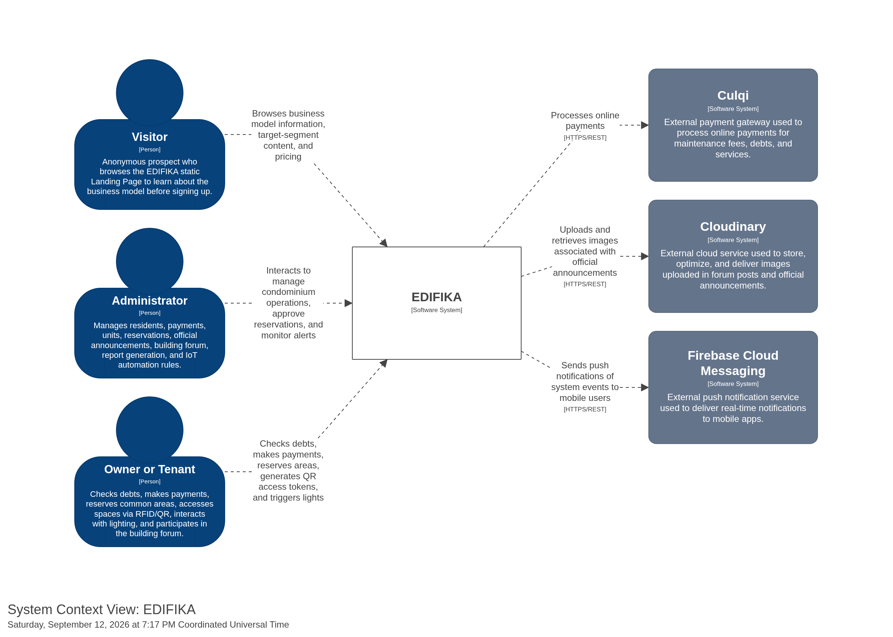

*Figura. System Context View de Edifika. Elaborado por el equipo aplicando C4 Model con Structurizr DSL (Structurizr, s.f.).*

Las interacciones representadas son:

- **Visitor → Edifika:** consulta información del modelo de negocio, contenido por segmento objetivo y precios a través del Landing Page.
- **Administrator → Edifika:** gestiona la operación del condominio, aprueba reservas y monitorea alertas (incluidas las alertas de consumo anómalo y de falla de luminarias que produce el nivel IoT).
- **Owner or Tenant → Edifika:** consulta deudas, paga, reserva áreas comunes, **genera tokens QR de acceso** y **activa la iluminación** de áreas comunes.
- **Edifika → Culqi:** procesa los pagos en línea (HTTPS/REST).
- **Edifika → Cloudinary:** sube y recupera las imágenes asociadas a comunicados oficiales y publicaciones del foro (HTTPS/REST).
- **Edifika → Firebase Cloud Messaging:** envía las notificaciones push de los eventos del sistema a los usuarios móviles (HTTPS/REST).
- **Edifika → Twilio:** envía por SMS las alertas de emergencia, en paralelo al push, para cumplir el alcance y la latencia que exige US08 (HTTPS/REST).

Las integraciones con terceros se acotan deliberadamente a cuatro: la pasarela de pagos, el servicio de gestión de imágenes, el servicio de notificaciones push y la pasarela de SMS. El resto de las capacidades —incluidas las de acceso físico, iluminación y telemetría— se resuelve dentro de Edifika, de modo que ningún flujo crítico de la operación del condominio queda condicionado a la disponibilidad de un proveedor externo.

#### 4.1.3.3. Software Architecture Container Level Diagrams

El Container Diagram abre la caja de Edifika y muestra los **22 containers** que componen la solución, distribuidos en los tres niveles de la arquitectura IoT. Cada container es una unidad de despliegue independiente —se construye, versiona y despliega por separado— y el color en el diagrama identifica su nivel: naranja el Landing Page y el Edge API, azul los clientes y los microservicios de gestión, verde los microservicios IoT cloud, morado el broker, azul oscuro las bases de datos y rojo los dispositivos embebidos.

*Figura. Container View de Edifika. Elaborado por el equipo aplicando C4 Model con Structurizr DSL (Structurizr, s.f.). Cada container es una unidad de despliegue independiente.*

**Decisiones de tecnología por container**

| Nivel | Container | Tecnología | Responsabilidad |
|---|---|---|---|
| Presentación | Landing Page | HTML5 / CSS3 / JavaScript | Sitio estático que presenta el modelo de negocio, los segmentos objetivo y los precios, con call-to-action por segmento. |
| Presentación | Web Application | Angular / TypeScript (SPA) | Pagos, reservas, comunicados, **dashboards de telemetría IoT** y reportes desde el navegador. |
| Presentación | Mobile Application | Flutter / Dart | Pagos, reservas, comunicados, **generación de QR dinámico de acceso** y foro desde iOS y Android. |
| Entrada | API Gateway | Spring Cloud Gateway / Java | Punto único de entrada: enrutamiento, validación del token JWT mediante `BearerAuthorizationRequestFilter`, **políticas CORS** (TS15), rate limiting y publicación del canal **SSE** de disponibilidad en tiempo real. |
| Cloud — gestión | IAM / Auth Service | Spring Boot / Spring Data JPA / Java | Autenticación, autorización, roles y emisión/validación de JWT. |
| Cloud — gestión | Residential Management Service | Spring Boot / Spring Data JPA / Java | Edificios, unidades, residentes y su vínculo con las unidades. |
| Cloud — gestión | Payment Service | Spring Boot / Spring Data JPA / Java | Deudas, cuotas, pagos, comprobantes e integración con Culqi. |
| Cloud — gestión | Reservation Service | Spring Boot / Spring Data JPA / Java | Áreas comunes, disponibilidad, reservas, aprobaciones y cancelaciones. |
| Cloud — gestión | Communication Service | Spring Boot / Spring Data JPA / Java | Comunicados oficiales y avisos administrativos. |
| Cloud — gestión | Messaging / Forum Service | Spring Boot / Spring Data JPA / Java | Publicaciones, comentarios e interacciones del foro privado de cada edificio. |
| Cloud — gestión | Notification Service | Spring Boot / Spring Data JPA / Java | Consume eventos del sistema y envía las notificaciones push (incluidas las alertas IoT). |
| Cloud — gestión | Report Service | Spring Boot / Spring Data JPA / Java | Reportes de pagos, morosidad, reservas y analítica de la comunidad. |
| Cloud — gestión | Incident Management Service | Spring Boot / Spring Data JPA / Java | Reporte y seguimiento de incidencias del edificio y difusión de alertas de emergencia. |
| Cloud — IoT | IoT Access Management Service | Spring Boot / Spring Data JPA / Java | Permisos de acceso a áreas comunes, credenciales RFID y QR dinámico, y control de cerraduras según reservas activas. |
| Cloud — IoT | Smart Lighting & Automation Service | Spring Boot / Spring Data JPA / Java | Control de luminarias según presencia, nivel de lux ambiental, horarios de reserva y override manual. |
| Cloud — IoT | IoT Telemetry & Analytics Service | Spring Boot / Spring Data JPA / Java | Ingesta de telemetría, **cálculo cuantitativo de energía (kWh)**, estadísticas y detección de anomalías de hardware. |
| Asincronía | Message & Event Broker | EMQX / RabbitMQ | Recibe y distribuye los eventos de dominio asíncronos (AMQP/MQTT): pagos, reservas, telemetría y comandos de actuadores. |
| Datos | PostgreSQL Database | PostgreSQL | Usuarios, edificios, unidades, deudas, pagos, reservas, comunicados, foro, notificaciones y credenciales de acceso. |
| Datos | Telemetry Database | TimescaleDB / PostgreSQL | Lecturas de sensores de alta frecuencia, registros de presencia, métricas de consumo y series ambientales. |
| Edge | Edge API & Gateway Controller | Flask / Peewee ORM / SQLite / Python | Gateway on-premise: caché de credenciales offline, coordinación local de dispositivos y operación resiliente ante caídas de internet. |
| Device | Common Area Access Controller | ESP32 / Embedded C++ | Lector RFID (RC522), escáner QR, sensor magnético de puerta, buzzer y relé de cerradura eléctrica. |
| Device | Smart Lighting & Sensing Node | ESP32 / Embedded C++ | Sensor de presencia PIR, sensor de lux LDR, sensor de corriente ACS712 y relé de luminaria. |

**Documentación y contrato de las APIs**

Cada uno de los 12 microservicios expone su propia interfaz **Swagger / OpenAPI 3** con el esquema de seguridad *Bearer JWT* declarado, de modo que los endpoints protegidos puedan probarse desde la propia interfaz gráfica introduciendo un token válido (TS14). El API Gateway no agrega ni unifica esas interfaces: cada servicio es dueño del contrato que publica, coherentemente con el principio de que cada bounded context define su propio modelo.

**Cómo se comunican los containers**

1. **Síncrono REST/JSON sobre HTTPS con JWT:** Web y Mobile Application consumen el API Gateway, que enruta hacia los 12 microservicios. Ningún cliente accede directamente a un microservicio.
2. **Asíncrono AMQP:** los microservicios publican eventos de dominio en el broker (`PaymentApproved`, `ReservationApproved`, `AnnouncementPublished`, `PhysicalAccessGranted`, `AbnormalConsumptionDetected`, etc.) y el broker los entrega a Notification, Report, Access y Lighting. Esto es lo que sostiene el Saga coreografiado de 4.1.1.2.
3. **MQTT local (Edge ↔ Device):** los dispositivos ESP32 envían intentos de acceso, estado de puerta, presencia, lux y corriente al Edge API, y reciben de vuelta comandos de apertura, feedback y PWM de luminaria.
4. **MQTT/AMQP sobre WAN (Edge → Cloud):** el Edge API reenvía al broker los registros de auditoría generados offline y la telemetría acumulada.
5. **Sincronización REST (Cloud → Edge):** IoT Access Management sincroniza credenciales activas, reservas vigentes y blacklist; Smart Lighting envía reglas de programación y overrides manuales.
6. **JDBC/SQL:** los microservicios de gestión e IoT persisten en PostgreSQL; Telemetry escribe y consulta agregaciones en TimescaleDB.
7. **SSE (servidor → cliente):** Reservation publica a través del API Gateway un flujo Server-Sent Events con los cambios de disponibilidad de áreas comunes, de modo que un residente que está consultando un horario vea liberarse u ocuparse ese espacio sin recargar (US19 esc. 3 y Estrategia 6 de 2.1.2). Es el único canal de servidor a cliente que no pasa por notificación push.
8. **Interacción física:** el residente presenta su tarjeta RFID o escanea el QR dinámico en la puerta, y su movimiento es detectado por el sensor PIR. Es el único canal del diagrama que no es de software.

La distribución de responsabilidades sigue el mismo criterio en los tres niveles: el cloud concentra las reglas de negocio y la persistencia de largo plazo, el edge concentra la autonomía operativa de cada condominio, y los dispositivos se limitan a sensar y actuar. Esa separación es la que permite que un corte de internet degrade la solución en lugar de detenerla: los dispositivos siguen respondiendo al Edge API y este sigue decidiendo con su caché local.

#### 4.1.3.4. Software Architecture Deployment Diagrams

El Deployment Diagram muestra en qué infraestructura se ejecuta cada uno de los containers del nivel anterior. La solución se despliega en **cinco nodos de infraestructura**: los dispositivos del usuario final, el PaaS que aloja el backend, el proveedor gestionado de bases de datos, el broker gestionado y —la diferencia central respecto de una solución puramente web— el **sitio físico del condominio**, donde viven el Edge Server y los dispositivos embebidos.

*Figura. Deployment View de Edifika — entorno Production. Elaborado por el equipo aplicando C4 Model con Structurizr DSL (Structurizr, s.f.).*

| Deployment Node | Infraestructura | Containers desplegados |
|---|---|---|
| Client Devices → Web Browser | Chrome, Edge, Safari o Firefox (desktop/mobile) | Landing Page, Web Application |
| Client Devices → Mobile Device | Smartphone iOS o Android | Mobile Application |
| Render → API Gateway Node | Render Web Service | API Gateway |
| Render → Core Microservices Cluster | Render Web Services | IAM, Residential Management, Payment, Reservation, Communication, Messaging/Forum, Notification, Report e Incident Management |
| Render → IoT Cloud Microservices Cluster | Render Web Services | IoT Access Management, Smart Lighting & Automation, IoT Telemetry & Analytics |
| Supabase → PostgreSQL Instance | PostgreSQL 15 gestionado | PostgreSQL Database |
| Supabase → TimescaleDB Instance | PostgreSQL 15 + TimescaleDB | Telemetry Database |
| Message Broker Cloud | CloudAMQP / EMQX Cloud | Message & Event Broker |
| Condominium Site → Edge Server | Raspberry Pi 4 / Mini PC on-premise | Edge API & Gateway Controller |
| Condominium Site → Common Area Door Unit | Hardware embebido en cada puerta de área común | Common Area Access Controller |
| Condominium Site → Common Area Lighting Unit | Hardware embebido en cada luminaria | Smart Lighting & Sensing Node |

El **Condominium Site** se instala una vez por edificio y es lo que hace viable el requisito de resiliencia: si se cae el enlace a internet, el Edge Server sigue validando credenciales contra su caché local y accionando cerraduras y luminarias; cuando el enlace se restablece, reenvía al broker los registros de auditoría y la telemetría acumulada. Los clusters de Render son *stateless*, de modo que escalan horizontalmente sin coordinación, y toda la persistencia queda confinada a Supabase.

La elección de infraestructura responde al perfil de carga de cada pieza: los clusters de Render son *stateless* y escalan horizontalmente sin coordinación; Supabase concentra la persistencia en dos instancias separadas porque el perfil de escritura de la telemetría —alta frecuencia y consulta por series temporales— no es compatible con el transaccional; el broker se contrata gestionado para no asumir la operación de su alta disponibilidad; y el sitio del condominio es la única infraestructura que el equipo instala y mantiene físicamente.

### 4.1.4. Atributos de Calidad y Presupuesto de Rendimiento

Los criterios de aceptación del Capítulo III no solo describen comportamiento: fijan **once presupuestos de tiempo de respuesta** y un conjunto de decisiones de seguridad y concurrencia que son, en rigor, requisitos no funcionales. Esta sección los recoge como restricciones de arquitectura verificables, en lugar de dejarlos enterrados en los escenarios Gherkin.

#### 4.1.4.1. Presupuesto de latencia

| Requisito | Operación | Presupuesto | Container responsable |
|---|---|---|---|
| TS04 | Rechazo 401 de una petición sin token | **< 100 ms**, sin reenviar al microservicio | API Gateway |
| TS01 | Rechazo 401 del filtro `BearerAuthorizationRequestFilter` | **< 100 ms** | API Gateway |
| TS04 | Sobrecosto de enrutamiento del Gateway | **< 200 ms** adicionales al procesamiento propio | API Gateway |
| TS01 | Inicio de sesión y emisión del token | **< 300 ms** | IAM / Auth Service |
| TS03 | Consulta de los datos de un usuario | **< 300 ms** | IAM / Auth Service |
| TS02 | Registro de usuario (incluye hashing) | **< 500 ms** | IAM / Auth Service |
| TS06 | Lista de residentes vinculados a un edificio | **< 400 ms** | Residential Management Service |
| TS11 | Consulta REST Report → Payment | **< 500 ms** | Payment Service |
| US25 | Reporte financiero consolidado completo | **< 1 s** | Report Service |
| TS10 | Entrega de la notificación push vía Firebase | **< 2 s** | Notification Service |
| US08 | Alerta de emergencia (push **y SMS**) a todos los residentes | **< 5 s** | Incident Management + Notification Service |

**Implicación sobre el diseño.** El presupuesto más exigente no es ninguno individual sino su composición. US25 obliga a que el reporte financiero completo responda en menos de 1 segundo, mientras que Report debe consultar a Payment por REST (**< 500 ms**, TS11) y, para la analítica de consumo, también a IoT Telemetry & Analytics. Encadenar dos llamadas síncronas dentro de ese presupuesto, sumando el sobrecosto del Gateway (**< 200 ms**), deja un margen muy estrecho. Se adoptan dos medidas:

1. **Paralelizar** las dos consultas salientes de Report en vez de encadenarlas, de modo que el costo sea el de la más lenta y no la suma.
2. **Cachear** en Report el resultado consolidado por periodo con TTL corto, dado que un reporte financiero mensual cerrado no cambia entre consultas.

Esta es, además, la razón concreta por la que el *Design Critique* de Report (4.1.1.3) deja anotada la proyección asíncrona de los datos de Payment como refactor natural: es la solución estructural a este presupuesto si el volumen crece.

#### 4.1.4.2. Seguridad

Las historias TS01 y TS02 especifican las decisiones criptográficas y de control de acceso que el sistema debe implementar. Se documentan aquí para que no queden como detalle de implementación:

| Decisión | Especificación | Origen |
|---|---|---|
| Hashing de contraseñas | **BCrypt**; la contraseña nunca se almacena ni circula en claro | TS02 |
| Firma del token | **JWT HMAC-SHA256** | TS01 |
| Contenido del token | `email`, `userId` y `rol` | TS01 |
| Vigencia del token | **7 días** | TS01 |
| Bloqueo por fuerza bruta | **5 intentos fallidos → cuenta bloqueada 15 minutos** | TS01 |
| Validación en el borde | Filtro `BearerAuthorizationRequestFilter` en el API Gateway; ningún microservicio recibe tráfico no autenticado | TS01, TS04 |
| Política de orígenes | **CORS** configurado en el API Gateway: un origen no registrado recibe error de política **sin que la solicitud se reenvíe** a ningún microservicio | TS15 |

#### 4.1.4.3. Concurrencia y consistencia

| Escenario | Requisito | Mecanismo |
|---|---|---|
| Dos residentes reservan la misma ventana horaria | La reserva se otorga **al primero en confirmar**; el segundo recibe **HTTP 409** | Restricción de unicidad sobre `(CommonArea, TimeWindow)` en Reservation, validada por `AvailabilityService` dentro de la transacción local |
| Un tercer usuario está viendo ese mismo horario | La disponibilidad se actualiza **en tiempo real** para él (US19 esc. 3 y Estrategia 6 de 2.1.2) | Canal **SSE** publicado por Reservation a través del API Gateway (ver 4.1.3.3) |
| 50 reservas registradas en 1 minuto | El sistema procesa todas las notificaciones sin degradarse (US11) | Consumo asíncrono vía broker con colas de reintento por evento, en vez de notificación síncrona en la transacción de reserva |
| Límite diario de publicaciones en el foro | **HTTP 429** | `PostQuotaService` (4.2.7) |
| Voto duplicado en una encuesta | **HTTP 409** | `PollVotingService` (4.2.6) |

#### 4.1.4.4. Degradación y tolerancia a fallos

Los criterios de aceptación describen el comportamiento esperado cuando una dependencia falla, y la arquitectura lo resuelve así:

| Fallo | Comportamiento exigido | Mecanismo |
|---|---|---|
| Falla el almacenamiento de comprobantes antiguos | Mostrar "Detalles temporalmente no disponibles" en lugar de un error (US22 esc. 3) | El historial de pagos se sirve desde PostgreSQL aunque la imagen alojada en Cloudinary no resuelva; el adjunto degrada de forma independiente del registro |
| Falla la pasarela Culqi | La deuda revierte a `PENDING` | Compensación de la Saga de pago (4.1.1.2) |
| Falla el envío a Firebase | La notificación queda pendiente de reintento sin afectar al contexto de origen | Colas de reintento en Notification (4.2.5) |
| Un microservicio consultado no responde | El llamante no colapsa y registra el fallo en sus logs (TS13) | Timeouts y manejo controlado de errores en los clientes REST |
| Un dispositivo IoT deja de emitir | Marcarlo **OFFLINE**, descartar comandos pendientes hacia él y notificar al administrador (TS16, TS17) | `DeviceHealthMonitor` en IoT Telemetry & Analytics (4.2.12.3) |

## 4.2. Tactical-Level Domain-Driven Design

**Trazabilidad con el Capítulo III**

Antes del detalle por capas, la tabla siguiente cierra la trazabilidad entre los 12 bounded contexts y el alcance especificado en el Capítulo III, de modo que ningún contexto exista sin una necesidad que lo justifique y ninguna historia comprometida quede sin contexto implementador.

| # | Bounded Context | Épica(s) del Cap. III | Historias que implementa | Historia técnica base |
|---|---|---|---|---|
| 4.2.1 | IAM / Auth | EP01 | US01, US02, US03, US05, US06, US34 | TS01, TS02, TS03 |
| 4.2.2 | Residential Management | EP01 | US04, US07 | TS06 |
| 4.2.3 | Reservation | EP03 | US16, US17, US18, US19, US20, US33, US35, US38, US39, US40 | TS08 |
| 4.2.4 | Payment | EP04 | US21, US22, US23, US24, US27, US28, US30 | TS07 |
| 4.2.5 | Notification | EP02 | US09, US10, US11, US12, US31 | TS10 |
| 4.2.6 | Communication | EP02 | US13, US14, US15, US32, US36 | TS09 |
| 4.2.7 | Forum | EP02 | US29, US37 | TS12 |
| 4.2.8 | Report | EP04 | US25, US26 | TS11 |
| 4.2.9 | Incident Management | EP02 | US08 | *(sin TS — ver nota)* |
| 4.2.10 | IoT Access Management | EP07 | US48, US49 | TS16, TS17 |
| 4.2.11 | Smart Lighting & Automation | EP07 | US53 | TS17 |
| 4.2.12 | IoT Telemetry & Analytics | EP07 | *(sin historia asociada — ver nota)* | TS17 |

Cuatro observaciones que se desprenden de esta trazabilidad:

- **EP05 (Infraestructura, seguridad y arquitectura técnica)** no se mapea a un bounded context propio porque es transversal: TS04, TS13, TS14 y TS15 se materializan en el API Gateway, y TS05 en la estrategia de persistencia descrita en 4.1.1.1 — ambos son infraestructura, no dominio.
- **EP06 (Landing Page e Interfaz Web)**, con US41–US47, tampoco corresponde a un bounded context: se implementa en los containers *Landing Page* y *Web Application* de 4.1.3.3, que consumen los contextos existentes sin aportar dominio propio.
- **Incident Management** implementa US08, la única historia de EP02 que no correspondía a Communication ni a Notification, y no tiene historia técnica asociada porque el Capítulo III no previó el microservicio: TS01–TS17 no incluyen su configuración base. Queda anotado como historia técnica a añadir junto con las de §4.2.12.
- **IoT Telemetry & Analytics** es el único contexto sin respaldo en el backlog de 3.3: responde al requisito del curso sobre procesamiento, cálculo estadístico y visualización de información cuantitativa recolectada por los dispositivos, pero el Capítulo III no llegó a redactar las historias correspondientes (medición de consumo en kWh, dashboard de telemetría y detección de anomalías de hardware). Queda registrado como **brecha de especificación a cerrar en la siguiente entrega**, incorporando esas historias a EP07 antes de dar por cerrado el alcance.

**Nivel de detalle de cada capa**

Cada bounded context se documenta a continuación separando Domain, Interface, Application e Infrastructure Layer. La subsección 4.2.X.1–4.2.X.4 da el diccionario en prosa (nombre, propósito e intención de cada clase, con sus atributos y relaciones principales); el detalle exacto de atributos tipados, métodos, *scope* y multiplicidad que pide el statement para el nivel de código vive en el Class Diagram UML de 4.2.X.6.1 de cada contexto (los 11 contextos ya cuentan con el suyo, ver 4.2.1–4.2.12) — evitando así transcribir en texto plano el mismo detalle que el diagrama ya expresa formalmente.

### 4.2.1. Bounded Context: IAM / Auth

#### 4.2.1.1. Domain Layer

El Domain Layer del bounded context IAM/Auth concentra la lógica de negocio relacionada con la identidad, autenticación y autorización de los usuarios dentro de Edifika. Este contexto se encarga de que cada usuario pueda registrarse, autenticarse y mantener una sesión activa mediante tokens, resguardando en todo momento la unicidad de las credenciales y la correcta asignación de roles.

El agregado principal identificado es:

**User**: concentra los datos y el comportamiento asociado a un usuario del sistema —credenciales, correo, estado de cuenta y rol— y es responsable de aplicar reglas como la validez de la contraseña o la coherencia entre el usuario y su rol.

La validación de reglas de negocio del contexto se apoya en un Domain Service, el **UserDomainService**, que centraliza comprobaciones como la unicidad del correo electrónico antes de registrar o autenticar una cuenta.

## Aggregate: UserAggregate
Representa a un usuario dado de alta en la plataforma, junto con su rol, estado y credenciales de acceso. Es responsable de sus propias transiciones de estado (activar, desactivar, cambiar contraseña).

### Entity: User

| Atributo | Tipo | Descripción |
|---|---|---|
| idUser | Long | Identificador único del usuario. |
| idRol | RolId | Referencia al rol asignado al usuario. |
| user | String | Nombre de usuario utilizado para el acceso. |
| passwordHash | String | Hash de la contraseña, nunca almacenado en texto plano. |
| email | String | Correo electrónico del usuario. |
| status | UserStatus | Estado actual de la cuenta. |
| telefono | String | Número de contacto del usuario. |

### Entity: UserRol

| Atributo | Tipo | Descripción |
|---|---|---|
| idRole | Long | Identificador único del rol. |
| role | String | Nombre del rol. Valores admitidos: `ADMIN` y `RESIDENT`, los dos únicos segmentos objetivo definidos en 1.3 y sobre los que se redactaron las historias de usuario del Capítulo III. |

## ValueObject: Email
Encapsula y valida la estructura del correo electrónico antes de asociarlo a una cuenta de usuario.

| Atributo | Tipo | Descripción |
|---|---|---|
| value | String | Dirección de correo electrónico. |

## ValueObject: PasswordHash
Protege la contraseña del usuario asegurando que solo su forma hasheada circule dentro del dominio. El algoritmo es **BCrypt**, conforme a TS02.

| Atributo | Tipo | Descripción |
|---|---|---|
| hash | String | Valor resultante del hashing de la contraseña. |

## ValueObject: JwtToken
Representa la sesión activa de un usuario autenticado, junto con su vigencia. Conforme a TS01, el token se firma con **HMAC-SHA256**, transporta `email`, `userId` y `rol` en su payload, y expira a los **7 días** de emitido.

| Atributo | Tipo | Descripción |
|---|---|---|
| token | String | Cadena del token JWT emitido. |
| expiresAt | DateTime | Momento en que el token deja de ser válido. |

## Enumeration

| Enumeración | Valores |
|---|---|
| UserStatus | `ACTIVE`, `INACTIVE`, `BLOCKED` |

## Domain Services

| Nombre | Responsabilidad | Reglas aplicadas y métodos |
|---|---|---|
| UserDomainService | Validar las reglas de negocio de usuarios y roles antes de persistir o autenticar una cuenta. | - El correo electrónico debe ser único en todo el sistema. - Las credenciales deben cumplir el formato mínimo de seguridad. - Todo usuario debe tener un rol válido asignado. - Método: `validateUserRules(user)`. |
| LoginAttemptService | Proteger la cuenta frente a ataques de fuerza bruta. | - Tras **5 intentos fallidos consecutivos**, la cuenta pasa a `BLOCKED` durante **15 minutos** (TS01). - Un inicio de sesión exitoso reinicia el contador. - Métodos: `registerFailure(email)`, `isBlocked(email)`. |

#### 4.2.1.2. Interface Layer

Esta capa expone el bounded context al exterior, recibiendo las solicitudes HTTP provenientes del API Gateway y traduciéndolas en comandos hacia la Application Layer.

**AuthController** *(REST Controller)*

Punto de entrada del microservicio de autenticación. Recibe las peticiones de login, registro y validación de sesión desde el API Gateway, valida el formato de entrada (DTOs) y delega la lógica al `AuthApplicationService`.

| Método | Firma | Descripción |
|---|---|---|
| `login` | `login(request: LoginRequest): ResponseEntity<TokenResponse>` | Recibe credenciales y devuelve un JWT si son válidas. |
| `register` | `register(request: RegisterRequest): ResponseEntity<UserResponse>` | Registra un nuevo usuario en el sistema. |
| `validateSession` | `validateSession(token: String): ResponseEntity<Boolean>` | Verifica si un token de sesión sigue siendo válido. |

El `AuthController` no contiene lógica de negocio: su responsabilidad es exclusivamente recibir, validar el formato de la solicitud y delegar.

#### 4.2.1.3. Application Layer

Esta capa coordina los flujos de negocio del bounded context IAM/Auth, sin definir reglas propias, apoyándose en las entidades y servicios del Domain Layer.

Se emplea un Command Handler para procesar las acciones explícitas que un usuario solicita —iniciar sesión o registrarse— y un servicio de soporte encargado de la emisión y verificación de tokens.

Clases principales:

- **AuthApplicationService**: orquesta los comandos de login y registro de usuarios.
- **TokenService**: gestiona la generación y validación de tokens JWT (HMAC-SHA256, vigencia de 7 días) una vez completada la autenticación.
- **AccountLockPolicy**: aplica el bloqueo temporal de la cuenta tras cinco intentos fallidos, apoyándose en `LoginAttemptService`.

## Auth Command Handler

| Capability | Command Handler | Descripción |
|---|---|---|
| Iniciar sesión | AuthApplicationService.handle(LoginCommand) | Verifica las credenciales del usuario y emite un token JWT. |
| Registrar usuario | AuthApplicationService.handle(RegisterCommand) | Aplica las reglas de negocio y crea la cuenta del nuevo usuario. |

## Token Service

| Capability | Método | Descripción |
|---|---|---|
| Generar token | generateToken(user) | Construye y firma un JWT a partir de los datos del usuario autenticado. |
| Validar token | validateToken(token) | Comprueba la firma y el tiempo de vigencia de un token recibido. |

#### 4.2.1.4. Infrastructure Layer

Esta capa implementa el acceso a los recursos externos que el bounded context necesita para operar, garantizando la persistencia de los datos conforme a los contratos definidos en el Domain Layer.

La clase principal de esta capa es:

**UserRepositoryImpl**: implementación concreta de la interfaz `UserRepository`. El hashing de contraseñas con **BCrypt** y la verificación de credenciales se resuelven en esta capa mediante el `PasswordEncoder` de Spring Security, de modo que el dominio solo manipule el Value Object `PasswordHash`. Gestiona el ciclo de vida de los usuarios en la base de datos —guardar, buscar y verificar credenciales— e incorpora validaciones adicionales para evitar registros duplicados de correo antes de crear una cuenta nueva.

## Repositories

### UserRepository

| Método | Descripción |
|---|---|
| save(User user) | Guarda un nuevo usuario o actualiza uno ya existente. |
| findById(Long id) | Recupera un usuario a partir de su identificador único. |
| findByEmail(String email) | Recupera un usuario a partir de su correo electrónico. |
| existsByEmail(String email) | Verifica si ya existe una cuenta registrada con ese correo. |

#### 4.2.1.5. Bounded Context Software Architecture Component Level Diagrams

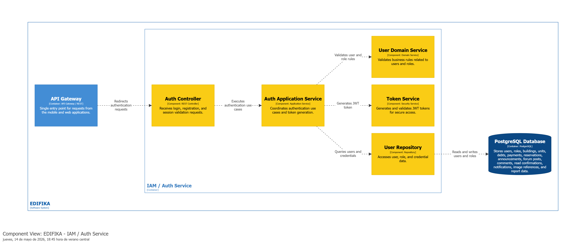

*Figura. Diagrama de Componentes — Auth Service. Elaborado utilizando Structurizr (Structurizr, s.f.).*

#### 4.2.1.6. Bounded Context Software Architecture Code Level Diagrams

En esta sección se presenta el nivel de mayor detalle de implementación del bounded context IAM/Auth, correspondiente al cuarto nivel del C4 Model: el Code diagram. A diferencia de los niveles de Context, Container y Component, este nivel se representa mediante un diagrama de clases UML, ya que detalla la estructura interna de las clases del Domain Layer: sus atributos, métodos, visibilidad y las relaciones con su respectiva multiplicidad. A continuación se desglosa en dos apartados: el diagrama de clases del dominio y el diagrama de diseño de base de datos.

##### 4.2.1.6.1. Bounded Context Domain Layer Class Diagrams

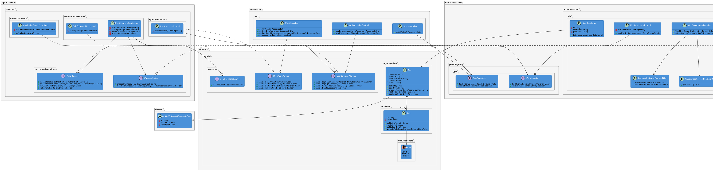

*Figura. Diagrama de Clases IAM — vista general. Elaborado utilizando PlantUML Editor (PlantUML, s.f.).*

*Figura. Diagrama de Clases IAM — capas de Aplicación y Dominio. Elaborado utilizando PlantUML Editor (PlantUML, s.f.).*

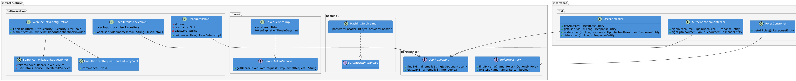

*Figura. Diagrama de Clases IAM — capas de Infraestructura e Interfaces. Elaborado utilizando PlantUML Editor (PlantUML, s.f.).*

##### 4.2.1.6.2. Bounded Context Database Design Diagram

El modelo entidad-relación del bounded context IAM/Auth está compuesto por las tablas **UserRol** y **User**. UserRol almacena los dos roles disponibles en la plataforma (`ADMIN` y `RESIDENT`, correspondientes a los dos segmentos objetivo de 1.3), mientras que User contiene los datos de cada cuenta registrada —credenciales, correo, estado y teléfono— junto con la referencia al rol que le corresponde.

La relación entre ambas tablas es `UserRol (1) —— (N) User`: un rol puede asignarse a múltiples usuarios, pero cada usuario posee un único rol activo, reforzado por una llave foránea obligatoria (`id_rol`).

El resto de tablas del modelo de Edifika (Payments, Reservations, Forum, Notifications, etc.) hacen referencia a `User.id_user`, pero corresponden a otros bounded contexts del sistema y no forman parte de este diagrama.

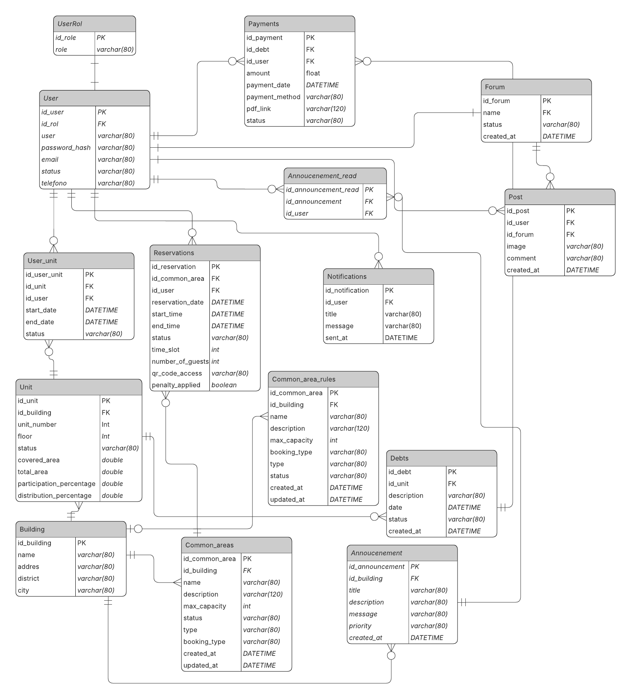

*Figura. Diagrama Entidad-Relación consolidado (incluye las tablas de IAM). Elaborado utilizando LucidChart (LucidChart, s.f.).*

### 4.2.2. Bounded Context: Residential Management

#### 4.2.2.1. Domain Layer

`PropertyManager` (Aggregate Root: la administradora o junta que opera uno o varios edificios — es la raíz de tenencia del sistema y responde al caso real recogido en la entrevista de 2.2.2, donde un único administrador gestiona 15 edificios), `Building` (Aggregate Root: edificio administrado, con nombre, dirección, conjunto de torres y la administradora a la que pertenece), `Unit` (Entity: unidad residencial identificada por torre, piso y número, con estado `OCCUPIED`/`VACANT`), `ResidentUnitLink` (Entity: vínculo entre un residente y su unidad, con tipo `OWNER`/`TENANT` y vigencia — es el registro que habilita la creación de la cuenta del residente en IAM, ver 4.1.1.2). Value Objects: `Address`, `TowerId`, `UnitNumber`. Domain Service: `UnitAssignmentService`, que concentra la regla del contexto —un residente solo puede vincularse a una unidad activa y una unidad no admite dos vínculos `OWNER` simultáneos—. Interfaces `PropertyManagerRepository`, `BuildingRepository`, `UnitRepository` y `ResidentUnitLinkRepository`.

**Alcance multi-edificio.** Todas las consultas del contexto se resuelven acotadas al `PropertyManager` del administrador autenticado, de modo que un administrador con varios edificios opere sobre todos desde una misma sesión sin que los datos de administradoras distintas se mezclen. El `buildingId` viaja como parte del contexto de la petición hacia los demás microservicios, que lo usan para filtrar sus propios datos.

#### 4.2.2.2. Interface Layer

`BuildingController` (registro y consulta de edificios y sus unidades, US07), `UnitController` (alta, edición y estado de cada unidad), `ResidentUnitController` (vinculación de residentes y verificación de la información por torre y departamento, US04).

#### 4.2.2.3. Application Layer

`BuildingCommandService` y `UnitCommandService` (alta y mantenimiento del padrón), `ResidentUnitCommandService` (crea y cierra el vínculo residente–unidad) y `ResidentialQueryService` (directorio de unidades y residentes, el Read Model identificado en 4.1.1.1). Publica `ResidentLinkedToUnit`, que habilita el alta de la cuenta del residente.

#### 4.2.2.4. Infrastructure Layer

Implementación JPA de los repositorios sobre PostgreSQL, con esquema propio del microservicio (TS05); `IamProvisioningClient`, cliente REST síncrono que entrega a IAM/Auth el vínculo residente–unidad que autoriza la creación de la cuenta (relación Customer/Supplier de 4.1.2).

#### 4.2.2.5. Bounded Context Software Architecture Component Level Diagrams

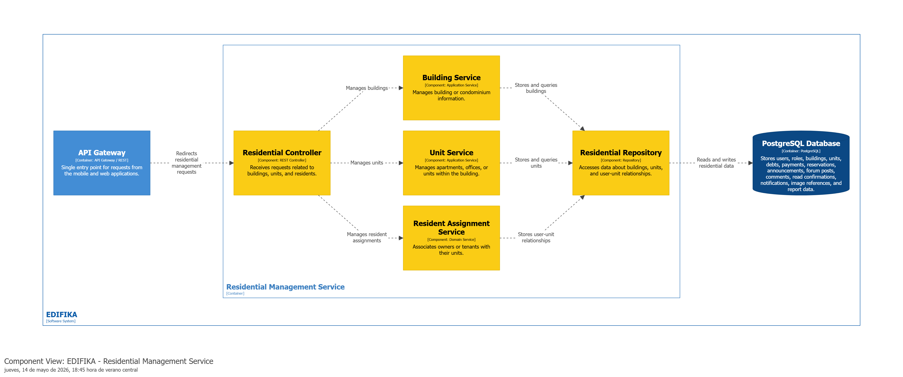

*Figura. Diagrama de Componentes — Residential Management Service. Elaborado utilizando Structurizr (Structurizr, s.f.).*

#### 4.2.2.6. Bounded Context Software Architecture Code Level Diagrams

##### 4.2.2.6.1. Bounded Context Domain Layer Class Diagrams

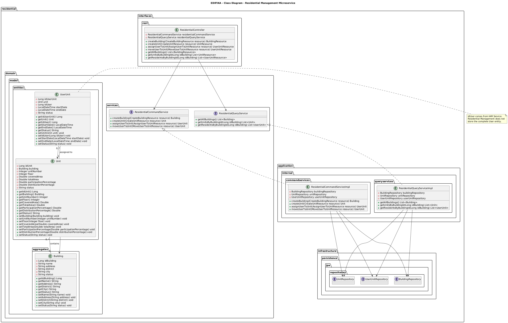

*Figura. Diagrama de Clases — Residential Management. Elaborado utilizando PlantUML Editor (PlantUML, s.f.).*

##### 4.2.2.6.2. Bounded Context Database Design Diagram

> ⚠️ Ver nota de ERD consolidado en 4.2.1.6.2.

*Figura. Diagrama Entidad-Relación consolidado (incluye las tablas de Residential Management).*

### 4.2.3. Bounded Context: Reservation

#### 4.2.3.1. Domain Layer

`Reservation` (Aggregate Root: solicitud de uso de un área común, con residente, ventana horaria y estado `PENDING`/`APPROVED`/`REJECTED`/`CANCELLED`), `CommonArea` (Entity: área común con nombre, aforo y estado `ENABLED`/`DISABLED` que el administrador conmuta según mantenimiento o restricciones, US38), `AreaRule` (Entity: reglas de uso de cada área —franja horaria permitida, duración máxima y anticipación mínima—, US39). Value Objects: `TimeWindow`, `ReservationStatus`, `AreaCapacity`. Domain Service: `AvailabilityService`, que resuelve la regla central del contexto —no se admite una reserva fuera de las reglas configuradas del área ni una segunda reserva sobre una ventana horaria ya ocupada (US19)—. Interfaces `ReservationRepository`, `CommonAreaRepository` y `AreaRuleRepository`.

#### 4.2.3.2. Interface Layer

`ReservationController` (solicitud y cancelación de reservas por el residente, US17 y US20), `ReservationApprovalController` (aprobación, rechazo y cancelación administrativa, US18 y US35), `CommonAreaController` (registro de áreas, habilitación/deshabilitación y configuración de reglas, US38 y US39), `AvailabilityQueryController` (disponibilidad del residente y mapa de ocupación global del administrador, US16 y US33; expone además el flujo **SSE** al que se suscriben los clientes para recibir los cambios de disponibilidad en vivo, US19 esc. 3), `ReservationHistoryController` (historial y estadísticas de uso, US40).

#### 4.2.3.3. Application Layer

`ReservationCommandService` (valida disponibilidad contra `AvailabilityService` antes de crear la reserva), `ReservationApprovalCommandService`, `CommonAreaCommandService`, `ReservationQueryService` (resuelve el calendario de reservas, Read Model de 4.1.1.1) y `ReservationSchedulerService`, el scheduler interno que detecta el inicio de cada ventana horaria. Publica `ReservationApproved` —que dispara en paralelo la notificación al residente y la habilitación del permiso de acceso físico—, `ReservationStarted` —consumido por Smart Lighting & Automation, ver 4.2.11.3— y `ReservationCancelled`. `AvailabilityBroadcastService` reemite estos mismos cambios por el canal SSE del API Gateway, de modo que un residente que esté consultando ese horario vea la actualización sin recargar. La unicidad de `(CommonArea, TimeWindow)` se garantiza en la transacción local: el segundo solicitante recibe **HTTP 409** (ver 4.1.4.3).

#### 4.2.3.4. Infrastructure Layer

Implementación JPA de los repositorios sobre PostgreSQL, con esquema propio del microservicio (TS05); publicador AMQP de los eventos del contexto hacia el Message & Event Broker.

#### 4.2.3.5. Bounded Context Software Architecture Component Level Diagrams

*Figura. Diagrama de Componentes — Reservation Service. Elaborado utilizando Structurizr (Structurizr, s.f.).*

#### 4.2.3.6. Bounded Context Software Architecture Code Level Diagrams

##### 4.2.3.6.1. Bounded Context Domain Layer Class Diagrams

*Figura. Diagrama de Clases — Reservation. Elaborado utilizando PlantUML Editor (PlantUML, s.f.).*

##### 4.2.3.6.2. Bounded Context Database Design Diagram

> ⚠️ Ver nota de ERD consolidado en 4.2.1.6.2.

*Figura. Diagrama Entidad-Relación consolidado (incluye las tablas de Reservation).*

### 4.2.4. Bounded Context: Payment

#### 4.2.4.1. Domain Layer

`Payment` (Aggregate Root: pago de un residente con monto, medio, comprobante adjunto y estado `PENDING`/`IN_REVIEW`/`PAID`/`REJECTED`), `Debt` (Entity: deuda de mantenimiento de una unidad para un periodo, con estado `PENDING`/`IN_REVIEW`/`SETTLED`/`OVERDUE` — el estado `IN_REVIEW` es el que exige el Escenario 1 de US22 cuando el residente adjunta su comprobante y este aún no ha sido validado por el administrador), `Receipt` (Entity: constancia generada al aprobarse un pago), `PaymentProof` (Entity: comprobante adjuntado por el residente, con la referencia al archivo almacenado y el resultado de su revisión — US22 esc. 2 contempla que el administrador lo rechace por ilegible), `Expense` (Entity: egreso o factura del edificio registrada por el administrador, con categoría, proveedor, monto y periodo — es el origen de los egresos que US25 y US27 exigen reportar, y la tarea semanal "Registrar gastos y facturas" de la User Task Matrix de 2.3.2). Value Objects: `Money`, `BillingPeriod`, `PaymentStatus`, `PaymentMethod` (`CARD`/`YAPE`/`PLIN`/`MANUAL`). Domain Services: `DebtCalculationService` (consolida el saldo vigente de una unidad a partir de sus deudas y pagos aplicados) y `DelinquencyEvaluationService`, que concentra la regla con efecto fuera del contexto —un residente con deuda vencida se marca moroso, y esa marca es la que restringe su acceso físico (ver 4.2.10)—. Interfaces `PaymentRepository`, `DebtRepository`, `ReceiptRepository`, `PaymentProofRepository` y `ExpenseRepository`. Repository Pattern aplicado para desacoplar estas reglas de la persistencia.

#### 4.2.4.2. Interface Layer

`DebtController` (consulta de la deuda vigente del residente, US21), `PaymentController` (registro del pago con comprobante y pago en línea, US22 y US30), `PaymentApprovalController` (registro y aprobación de pagos por el administrador, US23), `DelinquencyController` (listado de residentes morosos, US24), `PaymentHistoryController` (consulta de pagos pasados, US28), `ExpenseController` (registro de egresos y facturas del edificio por el administrador) y `ExpenseSummaryController` (resumen de gastos visible para el residente, US27).

#### 4.2.4.3. Application Layer

`PaymentCommandService` — registra el pago, deja la deuda en `IN_REVIEW` al recibir el comprobante y orquesta la Saga de aprobación (actualiza el estado → genera la constancia → emite `PaymentApproved`), con su compensación si Culqi falla—, `DebtCommandService`, `ExpenseCommandService` (alta de egresos y facturas), `DelinquencyCommandService` (evalúa periódicamente las deudas vencidas) y `PaymentQueryService` (resuelve el estado de cuenta del residente, Read Model de 4.1.1.1). Publica `PaymentApproved`, consumido por Notification, y `ResidentMarkedDelinquent`, consumido por IoT Access Management.

#### 4.2.4.4. Infrastructure Layer

Implementación JPA de los repositorios sobre PostgreSQL, con esquema propio del microservicio (TS05); **Adapter Pattern (Anti-Corruption Layer)** hacia la pasarela de pagos **Culqi**, traduciendo su API externa a la interfaz propia del sistema y habilitando tarjeta de crédito/débito junto con los medios locales **Yape y Plin** que exige la táctica de adaptación al contexto local de 2.1.2; **Adapter (ACL) hacia Cloudinary** para almacenar y servir las imágenes de los comprobantes de pago, con degradación independiente —si el adjunto no resuelve, el historial de pagos se sigue sirviendo desde PostgreSQL y la interfaz muestra "Detalles temporalmente no disponibles", según US22 esc. 3—; generador de la constancia de pago y publicador AMQP de los eventos del contexto.

#### 4.2.4.5. Bounded Context Software Architecture Component Level Diagrams

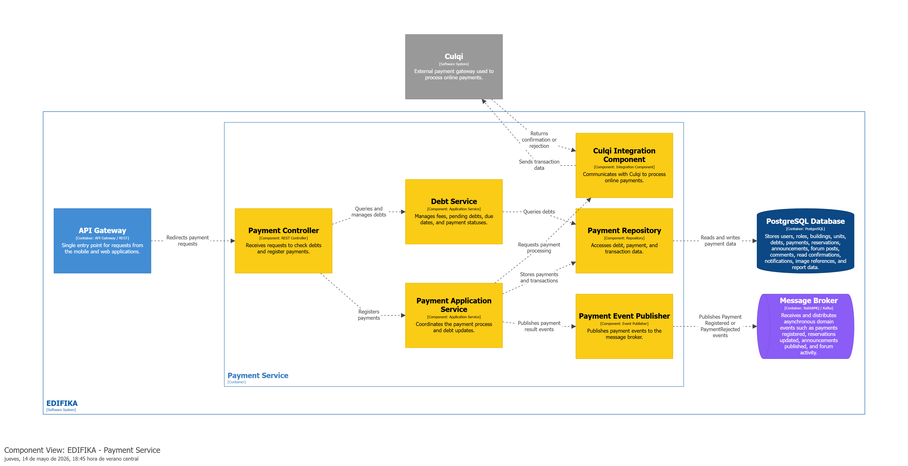

*Figura. Diagrama de Componentes — Payment Service. Elaborado utilizando Structurizr (Structurizr, s.f.).*

#### 4.2.4.6. Bounded Context Software Architecture Code Level Diagrams

##### 4.2.4.6.1. Bounded Context Domain Layer Class Diagrams

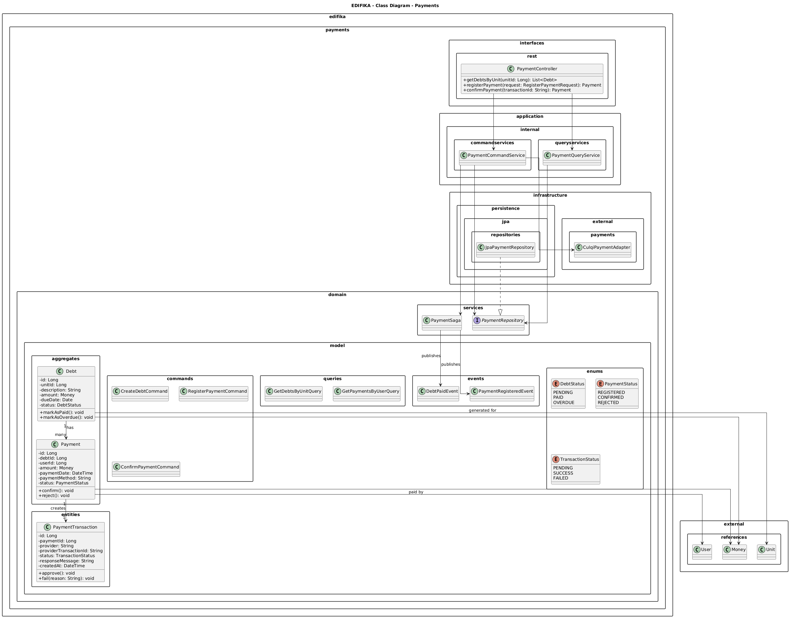

*Figura. Diagrama de Clases — Payment. Elaborado utilizando PlantUML Editor (PlantUML, s.f.).*

##### 4.2.4.6.2. Bounded Context Database Design Diagram

> ⚠️ Ver nota de ERD consolidado en 4.2.1.6.2.

*Figura. Diagrama Entidad-Relación consolidado (incluye las tablas de Payment).*

### 4.2.5. Bounded Context: Notification

#### 4.2.5.1. Domain Layer

`Notification` (Aggregate Root: notificación dirigida a un destinatario, con tipo, canal, contenido y estado `PENDING`/`SENT`/`FAILED`/`READ`), `DeviceToken` (Entity: token del dispositivo móvil sobre el que se entrega el push), `NotificationPreference` (Entity: configuración por usuario de qué tipos de notificación desea recibir y por qué canal, US12). Value Objects: `Recipient`, `NotificationChannel` (`PUSH`/`EMAIL`/`SMS`), `NotificationType`, `Priority` (`NORMAL`/`EMERGENCY`). Domain Service: `NotificationRoutingService`, que resuelve a qué destinatarios y por qué canal corresponde entregar cada evento según las preferencias vigentes, con una excepción explícita: una notificación de prioridad `EMERGENCY` se envía **simultáneamente por push y por SMS** e **ignora las preferencias del usuario**, porque US08 exige alcanzar a todos los residentes en menos de 5 segundos. Interfaces `NotificationRepository`, `DeviceTokenRepository` y `NotificationPreferenceRepository`.

#### 4.2.5.2. Interface Layer

`NotificationController` (bandeja y marcado de lectura del residente, US10), `DeviceTokenController` (registro y baja del token del dispositivo), `NotificationPreferenceController` (configuración de notificaciones, US12). Como *Consumers*: `AnnouncementEventConsumer`, `PaymentEventConsumer`, `ReservationEventConsumer`, `AccessEventConsumer`, `TelemetryAlertEventConsumer` e `IncidentEventConsumer`, suscritos por el broker a los seis contextos que publican eventos notificables.

#### 4.2.5.3. Application Layer

`NotificationCommandService`, `NotificationQueryService`, `DeviceTokenCommandService` y `NotificationPreferenceCommandService`. **Factory Pattern** (`NotificationFactory`) para crear el tipo de notificación (Push/Email/SMS) según el evento de origen, sin acoplar la creación a la lógica de envío. Event Handlers: `AnnouncementPublishedEventHandler` (US10), `PaymentApprovedEventHandler`, `DebtReminderScheduler` (recordatorios de pago, US09), `ReservationApprovedEventHandler` (US11 hacia el residente y US31 hacia el administrador), `PhysicalAccessEventHandler`, `TelemetryAlertEventHandler`, `IncidentReportedEventHandler` (avisa al administrador con la ubicación exacta de la incidencia, US08 esc. 2) y `EmergencyDeclaredEventHandler` (difusión `EMERGENCY` a todo el edificio por push y SMS en paralelo, US08 esc. 1).

#### 4.2.5.4. Infrastructure Layer

Implementación JPA de los repositorios sobre PostgreSQL, con esquema propio del microservicio (TS05); cliente de **Firebase Cloud Messaging** (Anti-Corruption Layer) para el envío de notificaciones push y cliente de **Twilio** (Anti-Corruption Layer) para el envío de SMS, ambos invocados en paralelo —no en cascada— cuando la prioridad es `EMERGENCY`, de modo que el fallo o la lentitud de un canal no consuma el presupuesto de 5 segundos del otro; colas de reintento independientes por evento y compensación que marca la notificación como pendiente de reintento si el envío falla, sin afectar el estado del contexto que originó el evento (ver 4.1.1.2).

#### 4.2.5.5. Bounded Context Software Architecture Component Level Diagrams

*Figura. Diagrama de Componentes — Notification Service. Elaborado utilizando Structurizr (Structurizr, s.f.).*

#### 4.2.5.6. Bounded Context Software Architecture Code Level Diagrams

##### 4.2.5.6.1. Bounded Context Domain Layer Class Diagrams

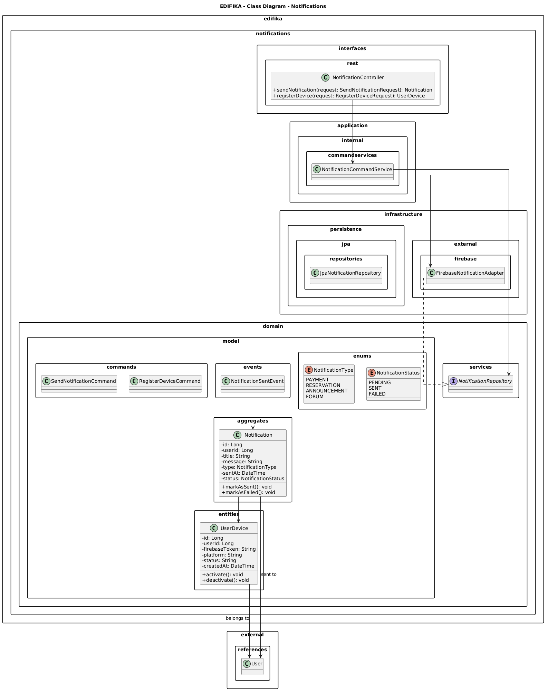

*Figura. Diagrama de Clases — Notification. Elaborado utilizando PlantUML Editor (PlantUML, s.f.).*

##### 4.2.5.6.2. Bounded Context Database Design Diagram

> ⚠️ Ver nota de ERD consolidado en 4.2.1.6.2.

*Figura. Diagrama Entidad-Relación consolidado (incluye las tablas de Notification).*

### 4.2.6. Bounded Context: Communication

#### 4.2.6.1. Domain Layer

`Announcement` / Comunicado (Aggregate Root: comunicado oficial con título, contenido, alcance y fecha de publicación), `Poll` / Encuesta (Aggregate Root: consulta a la comunidad con opciones, votos y estado `OPEN`/`CLOSED`, US36), `ReadReceipt` (Entity: registro de qué residente visualizó qué comunicado, que sostiene el seguimiento de alcance de US15), `Document` (Entity: normativa legal y manuales del edificio publicados para consulta, US32). Value Objects: `AnnouncementScope` (segmentación por tipo de usuario), `AnnouncementCategory` (categorización del anuncio: `MANTENIMIENTO`, `ADMINISTRATIVO`, `EVENTO`, `SEGURIDAD`, `OTRO`) y `PollOption`, `Reach`. La terna *confirmación de lectura · segmentación · categorización* es la que exige la táctica de comunicación centralizada de 2.1.2. Domain Services: `ReachTrackingService` (consolida el alcance real de un comunicado a partir de sus acuses de lectura) y `PollVotingService` (garantiza el voto único por residente y encuesta). Interfaces `AnnouncementRepository`, `PollRepository`, `ReadReceiptRepository` y `DocumentRepository`.

#### 4.2.6.2. Interface Layer

`AnnouncementController` (publicación de comunicados oficiales y consulta del histórico, US13 y US14), `ReadReceiptController` (seguimiento de visualización, US15), `PollController` (creación, votación y cierre de encuestas, US36), `DocumentController` (consulta de leyes y manuales del edificio, US32).

#### 4.2.6.3. Application Layer

`AnnouncementCommandService` — guarda el comunicado y emite `AnnouncementPublished`, que dispara la Saga coreografiada de notificación (ver 4.1.1.2) —, `PollCommandService` (valida el voto único por encuesta, HTTP 409 si se duplica), `DocumentCommandService` y `CommunicationQueryService` (resuelve el muro de anuncios y los resultados de encuesta, Read Models de 4.1.1.1). Valida además el límite de un mensaje diario por residente (HTTP 429 si se excede). Publica `AnnouncementPublished` y `PollClosed`.

#### 4.2.6.4. Infrastructure Layer

Implementación JPA de los repositorios sobre PostgreSQL, con esquema propio del microservicio (TS05); **Adapter Pattern (Anti-Corruption Layer)** hacia **Cloudinary** para el almacenamiento y la entrega de las imágenes adjuntas a los comunicados; publicador AMQP de los eventos del contexto.

#### 4.2.6.5. Bounded Context Software Architecture Component Level Diagrams

*Figura. Diagrama de Componentes — Communication Service. Elaborado utilizando Structurizr (Structurizr, s.f.).*

#### 4.2.6.6. Bounded Context Software Architecture Code Level Diagrams

##### 4.2.6.6.1. Bounded Context Domain Layer Class Diagrams

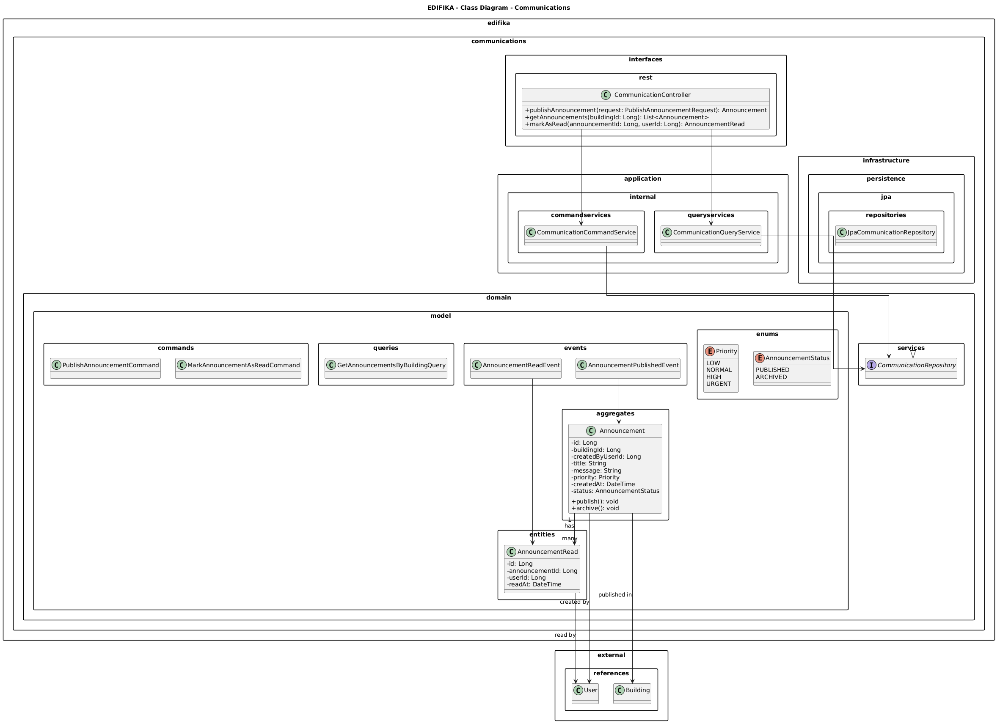

*Figura. Diagrama de Clases — Communication. Elaborado utilizando PlantUML Editor (PlantUML, s.f.).*

##### 4.2.6.6.2. Bounded Context Database Design Diagram

> ⚠️ Ver nota de ERD consolidado en 4.2.1.6.2.

*Figura. Diagrama Entidad-Relación consolidado (incluye las tablas de Communication).*

### 4.2.7. Bounded Context: Forum

#### 4.2.7.1. Domain Layer

`Post` (Aggregate Root: publicación del muro comunitario con autor, contenido, fecha y estado `VISIBLE`/`HIDDEN`, este último aplicado por la moderación de US37), `Comment` (Entity: respuesta de un residente a una publicación), `ModerationAction` (Entity: registro auditable de qué administrador ocultó qué publicación y por qué motivo). Value Objects: `PostContent`, `DailyPostQuota`. Domain Services: `PostQuotaService` (hace cumplir el límite diario de publicaciones por residente) y `ModerationService` (aplica y revierte el ocultamiento de contenido inapropiado). Interfaces `PostRepository`, `CommentRepository` y `ModerationActionRepository`.

#### 4.2.7.2. Interface Layer

`PostController` (publicación y consulta de mensajes del muro del edificio, US29), `CommentController` (respuestas a una publicación), `ModerationController` (revisión y ocultamiento de mensajes inapropiados por el administrador, US37).

#### 4.2.7.3. Application Layer

`PostCommandService` (valida el límite diario de publicaciones vía `PostQuotaService`, HTTP 429 si se excede), `CommentCommandService`, `ModerationCommandService` y `ForumQueryService` (resuelve el muro del edificio filtrando las publicaciones ocultas).

#### 4.2.7.4. Infrastructure Layer

Implementación JPA de los repositorios sobre PostgreSQL, con esquema propio del microservicio (TS05); **Adapter Pattern (Anti-Corruption Layer)** hacia **Cloudinary** para las imágenes adjuntas a las publicaciones del foro.

#### 4.2.7.5. Bounded Context Software Architecture Component Level Diagrams

*Figura. Diagrama de Componentes — Forum Service. Elaborado utilizando Structurizr (Structurizr, s.f.). La figura presenta en un mismo lienzo los componentes de Forum y de Notification; los de Notification se detallan por separado en 4.2.5.5.*

#### 4.2.7.6. Bounded Context Software Architecture Code Level Diagrams

##### 4.2.7.6.1. Bounded Context Domain Layer Class Diagrams

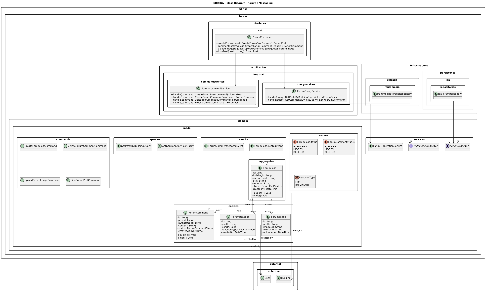

*Figura. Diagrama de Clases — Forum. Elaborado utilizando PlantUML Editor (PlantUML, s.f.).*

##### 4.2.7.6.2. Bounded Context Database Design Diagram

> ⚠️ Ver nota de ERD consolidado en 4.2.1.6.2.

*Figura. Diagrama Entidad-Relación consolidado (incluye las tablas de Forum).*

### 4.2.8. Bounded Context: Report

#### 4.2.8.1. Domain Layer

Modelos de lectura `FinancialReport` (consolidado de ingresos, egresos y deudas por periodo), `DelinquencyReport` (morosidad por unidad) y `EnergyConsumptionReport` (consumo energético del edificio, alimentado por IoT Telemetry & Analytics). Value Objects: `ReportPeriod`, `ExportFormat` (`PDF`/`EXCEL`). Domain Service: `ReportConsolidationService`, que unifica en una sola vista los datos que llegan de dos contextos distintos. Al ser un contexto mayormente de solo lectura (CQRS), **no posee agregados transaccionales propios**: su modelo son proyecciones construidas sobre datos de los que Payment e IoT Telemetry & Analytics siguen siendo dueños.

#### 4.2.8.2. Interface Layer

`ReportController` (generación de reportes financieros y de morosidad, US25), `ReportExportController` (exportación del reporte en el formato solicitado para compartirlo con la comunidad, US26).

#### 4.2.8.3. Application Layer

`ReportQueryService` (consulta a Payment vía REST y consolida el reporte, Read Model *Dashboard financiero* de 4.1.1.1) y `ReportExportCommandService`. **Factory Pattern** (`ReportExporterFactory`) para generar el archivo de salida en el formato solicitado (PDF o Excel) sin acoplar la lógica de creación a la de exportación.

#### 4.2.8.4. Infrastructure Layer

`PaymentQueryClient` y `TelemetryQueryClient`, clientes REST síncronos hacia Payment Service e IoT Telemetry & Analytics Service; generador de archivos PDF/Excel. Este contexto no persiste datos de negocio propios: su "persistencia" es la de los contextos que consulta (ver nota en 4.2.8.6.2).

#### 4.2.8.5. Bounded Context Software Architecture Component Level Diagrams

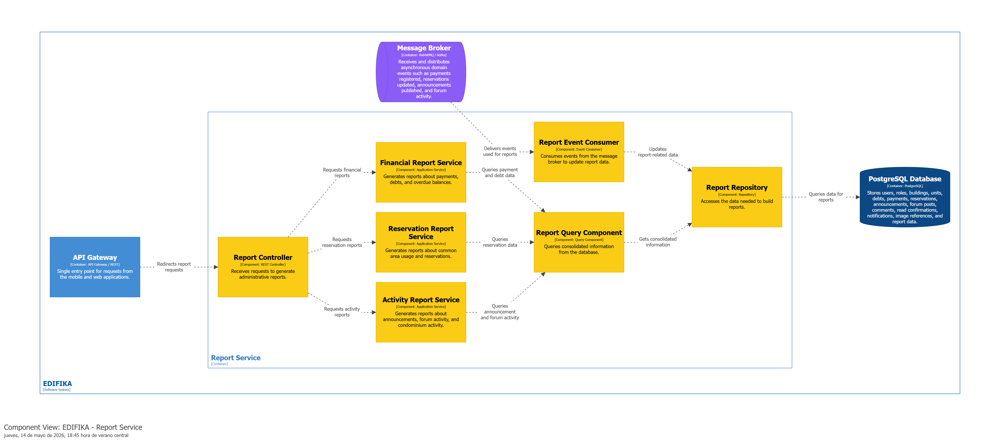

*Figura. Diagrama de Componentes — Report Service. Elaborado utilizando Structurizr (Structurizr, s.f.).*

#### 4.2.8.6. Bounded Context Software Architecture Code Level Diagrams

##### 4.2.8.6.1. Bounded Context Domain Layer Class Diagrams

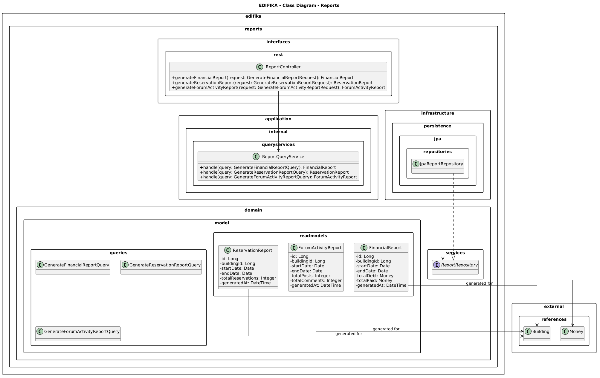

*Figura. Diagrama de Clases — Report. Elaborado utilizando PlantUML Editor (PlantUML, s.f.).*

##### 4.2.8.6.2. Bounded Context Database Design Diagram

> ⚠️ Ver nota de ERD consolidado en 4.2.1.6.2. Al ser un contexto mayormente de solo lectura, gran parte de su "persistencia" es en realidad la de Payment consultada vía REST.

*Figura. Diagrama Entidad-Relación consolidado.*

### 4.2.9. Bounded Context: Incident Management

> 📌 **Nota:** este contexto se incorpora en esta revisión al detectarse que el reporte de incidencias estaba especificado en tres lugares del informe —el Escenario 2 de **US08** ("un residente detecta una fuga de gas, cuando reporta la incidencia desde la app, entonces el admin recibe una notificación con la ubicación exacta Torre/Dpto"), la User Task Matrix de 2.3.2 ("Reportar una avería o incidencia", prioridad Alta y frustración Alta para Andrea) y el Ubiquitous Language de 2.5 (*Incidencia*, *Seguimiento de Incidencias*)— sin que ningún bounded context lo implementara. Notification no podía cubrirlo porque es *downstream* puro: traduce eventos ajenos en avisos, no permite a un residente originar un hecho de dominio.

#### 4.2.9.1. Domain Layer

`Incident` (Aggregate Root: incidencia reportada por un residente o registrada por el administrador, con categoría, descripción, severidad, ubicación y estado `REPORTED`/`ACKNOWLEDGED`/`IN_PROGRESS`/`RESOLVED`/`CLOSED`), `IncidentUpdate` (Entity: cada cambio de estado o comentario de seguimiento, que sostiene el *Seguimiento de Incidencias* del Ubiquitous Language), `EmergencyBroadcast` (Entity: aviso de emergencia que el administrador difunde a todo el edificio, con acuse de recepción). Value Objects: `IncidentLocation` (torre y departamento exactos que exige el criterio de US08), `IncidentCategory` (`GAS_LEAK`, `WATER_LEAK`, `ELECTRICAL`, `ELEVATOR`, `SECURITY`, `OTHER`), `Severity` (`LOW`/`MEDIUM`/`HIGH`/`CRITICAL`). Domain Service: `IncidentEscalationService`, que concentra la regla del contexto —una incidencia de severidad `CRITICAL` se difunde de inmediato como `EmergencyBroadcast` a todo el edificio, mientras que el resto se enruta únicamente al administrador—. Interfaces `IncidentRepository`, `IncidentUpdateRepository` y `EmergencyBroadcastRepository`.

#### 4.2.9.2. Interface Layer

`IncidentController` (reporte de una incidencia por el residente y consulta de su estado, US08 esc. 2), `IncidentTrackingController` (seguimiento y actualización del estado por el administrador), `EmergencyBroadcastController` (activación de una alerta de emergencia por el administrador, US08 esc. 1).

#### 4.2.9.3. Application Layer

`IncidentCommandService` (registra la incidencia, resuelve la ubicación contra Residential Management y evalúa la escalación), `IncidentTrackingCommandService` (transiciones de estado y comentarios de seguimiento), `EmergencyBroadcastCommandService` (difusión inmediata) e `IncidentQueryService` (bandeja de incidencias del administrador e historial del residente). Publica `IncidentReported`, `IncidentStatusChanged` y `EmergencyDeclared`; este último es el que Notification entrega por **push y SMS** dentro del presupuesto de 5 segundos fijado en US08 (ver 4.1.4).

#### 4.2.9.4. Infrastructure Layer

Implementación JPA de los repositorios sobre PostgreSQL, con esquema propio del microservicio (TS05); `ResidentialLocationClient`, cliente REST hacia Residential Management para resolver la torre y el departamento del residente que reporta; **Adapter Pattern (Anti-Corruption Layer)** hacia **Cloudinary** para las fotografías adjuntas a la incidencia; publicador AMQP de los eventos del contexto.

#### 4.2.9.5. Bounded Context Software Architecture Component Level Diagrams

> ⚠️ **Pendiente:** el Component View de este contexto debe generarse desde `arquitectura/diagrama.dsl` junto con el resto del modelo Structurizr, siguiendo el mismo formato que las figuras de 4.2.1.5 a 4.2.12.5.

#### 4.2.9.6. Bounded Context Software Architecture Code Level Diagrams

##### 4.2.9.6.1. Bounded Context Domain Layer Class Diagrams

> ⚠️ **Pendiente:** diagrama de clases UML del Domain Layer, a elaborar con PlantUML en `plantuml/class-diagrams/incident-management-class.puml`.

##### 4.2.9.6.2. Bounded Context Database Design Diagram

> ⚠️ **Pendiente:** las tablas `incidents`, `incident_updates` y `emergency_broadcasts` persisten en PostgreSQL y deben incorporarse al ERD consolidado de 4.2.1.6.2.

### 4.2.10. Bounded Context: IoT Access Management

#### 4.2.10.1. Domain Layer

`AccessCredential` (Aggregate Root: credencial de acceso de un residente, con tipo RFID o QR dinámico, identificador, titular, vigencia y estado ACTIVE/SUSPENDED/REVOKED), `AccessPermission` (Entity: habilitación de un residente sobre un área común, derivada de una reserva aprobada y acotada a su ventana horaria), `AccessAttempt` (Entity: intento de acceso registrado con dispositivo, credencial presentada, resultado y marca de tiempo — es la bitácora auditable del contexto). Value Objects: `RfidUid`, `QrToken` (token de un solo uso con TTL), `TimeWindow`. Domain Service: `AccessDecisionService`, que concentra la regla de negocio central del contexto —una credencial concede acceso solo si está activa, el residente no está moroso y existe un permiso vigente para esa área en ese instante—. Interfaces `AccessCredentialRepository`, `AccessPermissionRepository` y `AccessAttemptRepository`.

#### 4.2.10.2. Interface Layer

`AccessCredentialController` (emisión, suspensión y revocación de credenciales RFID), `QrAccessController` (generación del QR dinámico que el residente muestra en la puerta), `DoorControlController` (apertura remota por parte del administrador), `AccessAuditController` (consulta de la bitácora de accesos). Como *Consumers*: `ReservationEventConsumer` y `PaymentEventConsumer`, suscritos a los eventos que llegan por el broker.

#### 4.2.10.3. Application Layer

`AccessCredentialCommandService` (alta, suspensión y revocación), `QrTokenCommandService` (emisión del token con TTL y marca de un solo uso), `AccessQueryService` (consultas de credenciales, permisos y bitácora). Event Handlers: `ReservationApprovedEventHandler` —crea el `AccessPermission` temporal para el área reservada— y `ResidentMarkedDelinquentEventHandler` —suspende las credenciales del residente moroso—. Tras cada resolución de acceso publica `PhysicalAccessGranted` o `PhysicalAccessDenied`.

#### 4.2.10.4. Infrastructure Layer

Implementación JPA de los repositorios sobre PostgreSQL; `EdgeGatewaySyncClient`, cliente REST que empuja al Edge API las credenciales activas, las reservas vigentes y la blacklist para que el condominio siga operando sin conexión; publicador AMQP/MQTT de los eventos del contexto.

#### 4.2.10.5. Bounded Context Software Architecture Component Level Diagrams

*Figura. Diagrama de Componentes — IoT Access Management Service. Elaborado utilizando Structurizr (Structurizr, s.f.). Fuente en [`arquitectura/diagrama.dsl`](https://github.com/IoT-UPC-202620/edifika-report/blob/main/arquitectura/diagrama.dsl).*

#### 4.2.10.6. Bounded Context Software Architecture Code Level Diagrams

##### 4.2.10.6.1. Bounded Context Domain Layer Class Diagrams

*Figura. Diagrama de Clases — IoT Access Management. Elaborado con PlantUML; fuente en [`plantuml/class-diagrams/access-management-class.puml`](https://github.com/IoT-UPC-202620/edifika-report/blob/main/plantuml/class-diagrams/access-management-class.puml).*

##### 4.2.10.6.2. Bounded Context Database Design Diagram

> ⚠️ **Nota:** las tablas de este contexto persisten en PostgreSQL (igual que el resto de contextos de gestión), pero se documentan en un ERD complementario en vez de en el ERD consolidado de 4.2.1.6.2 — ver nota en 4.2.12.6.2.

*Figura. Diagrama Entidad-Relación — extensión IoT (`access_credentials`, `access_permissions`, `access_attempts`). Elaborado con PlantUML; fuente en [`plantuml/database/iot-erd-extension.puml`](https://github.com/IoT-UPC-202620/edifika-report/blob/main/plantuml/database/iot-erd-extension.puml).*

### 4.2.11. Bounded Context: Smart Lighting & Automation

#### 4.2.11.1. Domain Layer

`AutomationRule` (Aggregate Root: regla que gobierna una o varias luminarias de un área común, con condición de presencia, umbral de lux, franja horaria, duración de apagado por inactividad y prioridad frente a otras reglas), `Luminaire` (Entity: luminaria física con ubicación, área común asociada, potencia nominal y estado ON/OFF), `OverrideCommand` (Entity: encendido o apagado manual solicitado por un usuario, con duración y motivo, que suspende temporalmente la automatización). Value Objects: `LuxThreshold`, `PresenceTimeout`, `LightingSchedule`, `BrightnessLevel`. Domain Service: `AutomationDecisionService`, que resuelve el estado objetivo de cada luminaria combinando presencia, lux ambiental, horario de reserva y override vigente, aplicando la precedencia entre reglas. Interfaces `AutomationRuleRepository`, `LuminaireRepository` y `OverrideCommandRepository`.

#### 4.2.11.2. Interface Layer

`AutomationRuleController` (CRUD de reglas de automatización por parte del administrador), `LightingOverrideController` (encendido/apagado manual desde la aplicación del residente o del administrador), `LuminaireController` (registro y consulta de luminarias y su estado). Como *Consumer*: `PresenceEventConsumer`, suscrito a los eventos de presencia y de inicio de reserva.

#### 4.2.11.3. Application Layer

`AutomationRuleCommandService`, `OverrideCommandService` (aplica el override y programa su expiración), `LightingQueryService`. Event Handlers: `AreaPresenceDetectedEventHandler` —enciende según la regla vigente cuando se detecta presencia y el lux ambiental está por debajo del umbral— y `ReservationStartedEventHandler` —enciende de forma programada el área al iniciar la reserva—. Publica `LuminaireTurnedOn`, `LuminaireTurnedOff` y `OverrideTriggered`.

Los dos eventos consumidos por este contexto se cerraron de la siguiente forma en [`arquitectura/diagrama.dsl`](https://github.com/IoT-UPC-202620/edifika-report/blob/main/arquitectura/diagrama.dsl):

- **`AreaPresenceDetected`** lo publica el **Edge API**, no Telemetry: el Edge reenvía la lectura cruda del sensor PIR del nodo de iluminación como evento tan pronto la recibe por MQTT local, priorizando la latencia de encendido sobre la interpretación de dominio (que sí aplica Telemetry para sus propios fines analíticos, ver 4.2.12, pero por una ruta de datos separada).
- **`ReservationStarted`** lo publica **Reservation**, mediante un scheduler interno que revisa periódicamente las reservas cuya ventana horaria acaba de comenzar — se mantiene toda la lógica de reservas en un único contexto en vez de que Smart Lighting consulte el calendario de Reservation por su cuenta.

#### 4.2.11.4. Infrastructure Layer

Implementación JPA de los repositorios sobre PostgreSQL; `EdgeCommandPublisher`, que envía por MQTT/REST al Edge API las reglas de programación y los comandos de override para que este los ejecute localmente sobre los nodos de iluminación; publicador AMQP/MQTT de los eventos del contexto.

#### 4.2.11.5. Bounded Context Software Architecture Component Level Diagrams

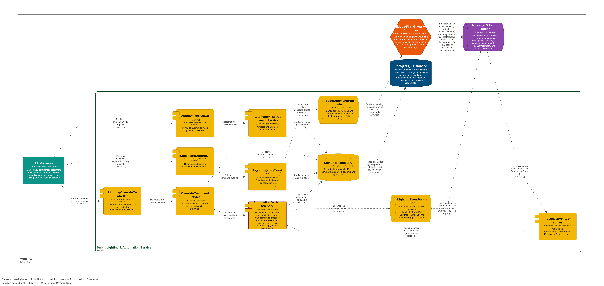

*Figura. Diagrama de Componentes — Smart Lighting & Automation Service. Elaborado utilizando Structurizr (Structurizr, s.f.). Fuente en [`arquitectura/diagrama.dsl`](https://github.com/IoT-UPC-202620/edifika-report/blob/main/arquitectura/diagrama.dsl).*

#### 4.2.11.6. Bounded Context Software Architecture Code Level Diagrams

##### 4.2.11.6.1. Bounded Context Domain Layer Class Diagrams

*Figura. Diagrama de Clases — Smart Lighting & Automation. Elaborado con PlantUML; fuente en [`plantuml/class-diagrams/lighting-automation-class.puml`](https://github.com/IoT-UPC-202620/edifika-report/blob/main/plantuml/class-diagrams/lighting-automation-class.puml).*

##### 4.2.11.6.2. Bounded Context Database Design Diagram

> ⚠️ **Nota:** ver la misma figura y nota de ERD complementario de 4.2.10.6.2 — `automation_rules`, `luminaires` y `override_commands` son las tablas de este contexto dentro de ese mismo diagrama (persisten en PostgreSQL).

### 4.2.12. Bounded Context: IoT Telemetry & Analytics

> 📌 **Nota:** este es el contexto que sostiene el requisito del curso sobre procesamiento, cálculo mediante expresiones matemáticas y estadísticas, y visualización de información cuantitativa recolectada por los dispositivos IoT.

#### 4.2.12.1. Domain Layer

`SensorReading` (Value Object inmutable: lectura individual con dispositivo de origen, tipo de magnitud —presencia, lux o corriente—, valor, unidad y marca de tiempo), `EnergyConsumption` (Aggregate Root: consumo acumulado de una luminaria o área común en un periodo, calculado por integración de la potencia instantánea en el tiempo, `kWh = Σ(V × I × Δt) / 1000`), `ConsumptionBaseline` (Entity: línea base estadística por área —media y desviación estándar móviles— contra la que se contrasta el consumo observado), `AnomalyFlag` (Entity: marca de anomalía con tipo, severidad y evidencia). Value Objects: `MeasurementUnit`, `TimeBucket`, `ZScore`. Domain Services: `EnergyCalculationService` (integración temporal de la potencia), `DeviceHealthService` (evalúa el *heartbeat* de cada dispositivo y lo marca `OFFLINE` cuando deja de emitir durante el tiempo límite configurado, conforme exigen TS16 y TS17) y `AnomalyDetectionService` (compara la muestra contra la baseline y distingue consumo anómalo de falla de luminaria, esta última caracterizada por corriente nula con la luminaria comandada en ON). Interfaces `TelemetryRepository`, `EnergyConsumptionRepository` y `BaselineRepository`.

#### 4.2.12.2. Interface Layer

`TelemetryQueryController` (series temporales y agregados que alimentan los dashboards de la Web Application), `EnergyReportController` (consumo por área y por periodo), `AnomalyController` (consulta de anomalías detectadas). Como *Consumer*: `TelemetryIngestionConsumer`, suscrito por MQTT a las lecturas crudas que el Edge API reenvía al broker.

#### 4.2.12.3. Application Layer

`TelemetryIngestionService` (valida, normaliza y persiste la lectura entrante), `EnergyCalculationCommandService` (recalcula el consumo del bucket temporal afectado), `BaselineRecalculationService` (actualiza media y desviación móviles), `AnomalyDetectionHandler` (evalúa cada nueva agregación contra la baseline), `DeviceHealthMonitor` (job periódico que detecta la ausencia de mensajes de un dispositivo, lo marca `OFFLINE`, descarta los comandos pendientes hacia él y notifica al administrador sin afectar la comunicación con el resto — TS16 y TS17) y `TelemetryQueryService` (resuelve las consultas de los dashboards). Publica `AbnormalConsumptionDetected`, `LuminaireFailureDetected` y `DeviceWentOffline`.

#### 4.2.12.4. Infrastructure Layer

Implementación del repositorio de series sobre **TimescaleDB** —hypertables particionadas por tiempo y agregados continuos para resolver las consultas del dashboard sin recorrer la serie cruda—, a diferencia del resto de contextos, que persisten en PostgreSQL relacional. Suscriptor MQTT hacia el broker y publicador AMQP/MQTT de los eventos de alerta.

#### 4.2.12.5. Bounded Context Software Architecture Component Level Diagrams

*Figura. Diagrama de Componentes — IoT Telemetry & Analytics Service. Elaborado utilizando Structurizr (Structurizr, s.f.). Fuente en [`arquitectura/diagrama.dsl`](https://github.com/IoT-UPC-202620/edifika-report/blob/main/arquitectura/diagrama.dsl).*

#### 4.2.12.6. Bounded Context Software Architecture Code Level Diagrams

##### 4.2.12.6.1. Bounded Context Domain Layer Class Diagrams

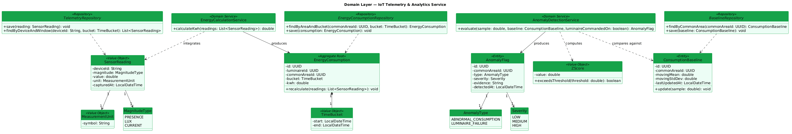

*Figura. Diagrama de Clases — IoT Telemetry & Analytics. Elaborado con PlantUML; fuente en [`plantuml/class-diagrams/telemetry-analytics-class.puml`](https://github.com/IoT-UPC-202620/edifika-report/blob/main/plantuml/class-diagrams/telemetry-analytics-class.puml).*

##### 4.2.12.6.2. Bounded Context Database Design Diagram

Por su naturaleza de series temporales, las tablas de este contexto (`sensor_readings` como hypertable, más `energy_consumption`, `consumption_baselines` y `anomaly_flags`) no forman parte del ERD relacional consolidado de 4.2.1.6.2 (LucidChart, solo PostgreSQL). Se documentan en el mismo ERD complementario de 4.2.10.6.2, separadas en su propio paquete TimescaleDB:

*Figura. Diagrama Entidad-Relación — extensión IoT, paquete TimescaleDB (`sensor_readings`, `energy_consumption`, `consumption_baselines`, `anomaly_flags`). Elaborado con PlantUML; fuente en [`plantuml/database/iot-erd-extension.puml`](https://github.com/IoT-UPC-202620/edifika-report/blob/main/plantuml/database/iot-erd-extension.puml).*

# Conclusiones
# Conclusiones y Recomendaciones
# Referencias Bibliográficas

- Lucidchart. (s.f.). <https://www.lucidchart.com>
- PlantUML. (s.f.). <https://plantuml.com>
- Structurizr. (s.f.). <https://structurizr.com/>

# Anexos
