<div align="center">
<p align="center">
  
</p>

<h3>Universidad Peruana de Ciencias Aplicadas</h3>
<h3>Ingeniería de Software</h3>

<h4>1ASI0572 - Desarrollo de Soluciones IOT<br>202620</h4>

<h4>NRC: 8740</h4>

<h4>Docente: Verla Olivera, David Carlos</h4>

<h3>Informe de Trabajo Final</h3>

<h4>Nombre del Startup: Condomia</h4>
<h4>Nombre del Producto: Edifika</h4>


<br>

<h4>Integrantes:</h4>

<table style="border-collapse: collapse;">
  <thead>
    <tr>
      <th style="border: 1px solid black;">Alumno</th>
      <th style="border: 1px solid black;">Codigo</th>
    </tr>
  </thead>
  <tbody>
    <tr><td style="border: 1px solid black;">Acuña Corahua, Jonatan Ariel</td><td style="border: 1px solid black;">u20211b995</td></tr>
    <tr><td style="border: 1px solid black;">Collantes Carrillo, Diego Mateo</td><td style="border: 1px solid black;">u202311823</td></tr>
    <tr><td style="border: 1px solid black;">Landa Ortiz, Sergio Javier</td><td style="border: 1px solid black;">u202311086</td></tr>
	<tr><td style="border: 1px solid black;">Lizarbe Alvarez, Ariana Nickole</td><td style="border: 1px solid black;">u202311704</td></tr>
    <tr><td style="border: 1px solid black;">Ortiz Cardenas, Johanna Antuanete</td><td style="border: 1px solid black;">u202310358</td></tr>
    <tr><td style="border: 1px solid black;">Perez Tuesta, Gabriel</td><td style="border: 1px solid black;">u202321281</td></tr>
    <tr><td style="border: 1px solid black;">Sarmiento Medina, Loreley</td><td style="border: 1px solid black;">u202310005</td></tr>
  </tbody>
</table>
<br>

<h4>Setiembre, 2026</h4>

</div>

<div style="page-break-after: always;"></div>

## Registro de Versiones del Informe

<div align="center">I
<table>
  <thead>
    <tr>
      <th>Versión</th>
      <th>Fecha</th>
      <th>Autor</th>
      <th>Descripción de modificación</th>
    </tr>
  </thead>
  <tbody>
    <tr>
      <td>AVN1</td>
      <td>20/09/2026</td>
      <td>
        - Acuña Corahua, Jonatan Ariel <br>
        - Collantes Carrillo, Diego Mateo <br>
        - Landa Ortiz, Sergio Javier <br>
        - Ortiz Cardenas, Johanna Antuanete <br>
        - Perez Tuesta, Gabriel <br>
        - Lizarbe Alvarez, Ariana Nickole <br>
        - Sarmiento Medina, Loreley
      </td>
      <td>
        - Capítulo I: Introducción <br>
        - Capítulo II: Requirements Elicitation & Analysis <br>
        - Capítulo III: Requirements Specification <br>
        - Capítulo IV: Solution Software Design
      </td>
    </tr>
  </tbody>
</table>
</div>

## **Project Report Collaboration Insights**

AV1 (20/09/2026):
<br>
<p align="center">
  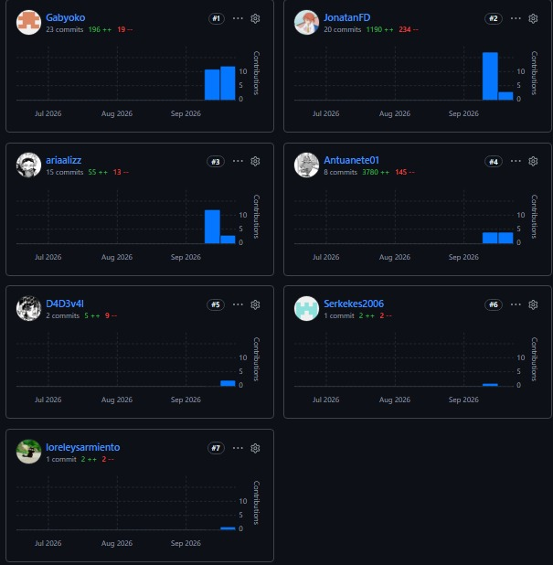
</p>

## **Contenido**
- [CAPÍTULO I: Introducción](#capítulo-i-introducción)
  - [1.1. Startup Profile](#11-startup-profile)
    - [1.1.1. Descripción de la Startup](#111-descripción-de-la-startup)
    - [1.1.2. Perfiles de integrantes del equipo](#112-perfiles-de-integrantes-del-equipo)
  - [1.2. Solution Profile](#12-solution-profile)
    - [1.2.1. Antecedentes y problemática](#121-antecedentes-y-problemática)
    - [1.2.2. Lean UX Process](#122-lean-ux-process)
      - [1.2.2.1. Lean UX Problem Statements](#1221-lean-ux-problem-statements)
      - [1.2.2.2. Lean UX Assumptions](#1222-lean-ux-assumptions)
      - [1.2.2.3. Lean UX Hypothesis Statements](#1223-lean-ux-hypothesis-statements)
      - [1.2.2.4. Lean UX Canvas](#1224-lean-ux-canvas)
  - [1.3. Segmentos objetivo](#13-segmentos-objetivo)
- [CAPÍTULO II: Requirements Elicitation & Analysis](#capítulo-ii-requirements-elicitation--analysis)
  - [2.1. Competidores](#21-competidores)
    - [2.1.1. Análisis competitivo](#211-análisis-competitivo)
    - [2.1.2. Estrategias y tácticas frente a competidores](#212-estrategias-y-tácticas-frente-a-competidores)
  - [2.2. Entrevistas](#22-entrevistas)
    - [2.2.1. Diseño de entrevistas](#221-diseño-de-entrevistas)
    - [2.2.2. Registro de entrevistas](#222-registro-de-entrevistas)
    - [2.2.3. Análisis de entrevistas](#223-análisis-de-entrevistas)
  - [2.3. Needfinding](#23-needfinding)
    - [2.3.1. User Personas](#231-user-personas)
    - [2.3.2. User Task Matrix](#232-user-task-matrix)
    - [2.3.3. User Journey Mapping](#233-user-journey-mapping)
    - [2.3.4. Empathy Mapping](#234-empathy-mapping)
  - [2.4. Big Picture EventStorming](#24-big-picture-eventstorming)
  - [2.5. Ubiquitous Language](#25-ubiquitous-language)
- [CAPÍTULO III: Requirements Specification](#capítulo-iii-requirements-specification)
  - [3.1. User Stories](#31-user-stories)
  - [3.2. Impact Mapping](#32-impact-mapping)
  - [3.3. Product Backlog](#33-product-backlog)
- [CAPÍTULO IV: Solution Software Design](#capítulo-iv-solution-software-design)
  - [4.1. Strategic-Level Domain-Driven Design](#41-strategic-level-domain-driven-design)
    - [4.1.1. Design-Level EventStorming](#411-design-level-eventstorming)
      - [4.1.1.1. Candidate Context Discovery](#4111-candidate-context-discovery)
      - [4.1.1.2. Domain Message Flows Modeling](#4112-domain-message-flows-modeling)
      - [4.1.1.3. Bounded Context Canvases](#4113-bounded-context-canvases)
    - [4.1.2. Context Mapping](#412-context-mapping)
    - [4.1.3. Software Architecture](#413-software-architecture)
      - [4.1.3.1. Software Architecture System Landscape Diagram](#4131-software-architecture-system-landscape-diagram)
      - [4.1.3.2. Software Architecture Context Level Diagrams](#4132-software-architecture-context-level-diagrams)
      - [4.1.3.3. Software Architecture Container Level Diagrams](#4133-software-architecture-container-level-diagrams)
      - [4.1.3.4. Software Architecture Deployment Diagrams](#4134-software-architecture-deployment-diagrams)
  - [4.2. Tactical-Level Domain-Driven Design](#42-tactical-level-domain-driven-design)
    - [4.2.1. Bounded Context: IAM / Auth](#421-bounded-context-iam--auth)
      - [4.2.1.1. Domain Layer](#4211-domain-layer)
      - [4.2.1.2. Interface Layer](#4212-interface-layer)
      - [4.2.1.3. Application Layer](#4213-application-layer)
      - [4.2.1.4. Infrastructure Layer](#4214-infrastructure-layer)
      - [4.2.1.5. Bounded Context Software Architecture Component Level Diagrams](#4215-bounded-context-software-architecture-component-level-diagrams)
      - [4.2.1.6. Bounded Context Software Architecture Code Level Diagrams](#4216-bounded-context-software-architecture-code-level-diagrams)
        - [4.2.1.6.1. Bounded Context Domain Layer Class Diagrams](#42161-bounded-context-domain-layer-class-diagrams)
        - [4.2.1.6.2. Bounded Context Database Design Diagram](#42162-bounded-context-database-design-diagram)
    - [4.2.2. Bounded Context: Residential Management](#422-bounded-context-residential-management)
      - [4.2.2.1. Domain Layer](#4221-domain-layer)
      - [4.2.2.2. Interface Layer](#4222-interface-layer)
      - [4.2.2.3. Application Layer](#4223-application-layer)
      - [4.2.2.4. Infrastructure Layer](#4224-infrastructure-layer)
      - [4.2.2.5. Bounded Context Software Architecture Component Level Diagrams](#4225-bounded-context-software-architecture-component-level-diagrams)
      - [4.2.2.6. Bounded Context Software Architecture Code Level Diagrams](#4226-bounded-context-software-architecture-code-level-diagrams)
        - [4.2.2.6.1. Bounded Context Domain Layer Class Diagrams](#42261-bounded-context-domain-layer-class-diagrams)
        - [4.2.2.6.2. Bounded Context Database Design Diagram](#42262-bounded-context-database-design-diagram)
    - [4.2.3. Bounded Context: Reservation](#423-bounded-context-reservation)
      - [4.2.3.1. Domain Layer](#4231-domain-layer)
      - [4.2.3.2. Interface Layer](#4232-interface-layer)
      - [4.2.3.3. Application Layer](#4233-application-layer)
      - [4.2.3.4. Infrastructure Layer](#4234-infrastructure-layer)
      - [4.2.3.5. Bounded Context Software Architecture Component Level Diagrams](#4235-bounded-context-software-architecture-component-level-diagrams)
      - [4.2.3.6. Bounded Context Software Architecture Code Level Diagrams](#4236-bounded-context-software-architecture-code-level-diagrams)
        - [4.2.3.6.1. Bounded Context Domain Layer Class Diagrams](#42361-bounded-context-domain-layer-class-diagrams)
        - [4.2.3.6.2. Bounded Context Database Design Diagram](#42362-bounded-context-database-design-diagram)
    - [4.2.4. Bounded Context: Payment](#424-bounded-context-payment)
      - [4.2.4.1. Domain Layer](#4241-domain-layer)
      - [4.2.4.2. Interface Layer](#4242-interface-layer)
      - [4.2.4.3. Application Layer](#4243-application-layer)
      - [4.2.4.4. Infrastructure Layer](#4244-infrastructure-layer)
      - [4.2.4.5. Bounded Context Software Architecture Component Level Diagrams](#4245-bounded-context-software-architecture-component-level-diagrams)
      - [4.2.4.6. Bounded Context Software Architecture Code Level Diagrams](#4246-bounded-context-software-architecture-code-level-diagrams)
        - [4.2.4.6.1. Bounded Context Domain Layer Class Diagrams](#42461-bounded-context-domain-layer-class-diagrams)
        - [4.2.4.6.2. Bounded Context Database Design Diagram](#42462-bounded-context-database-design-diagram)
    - [4.2.5. Bounded Context: Notification](#425-bounded-context-notification)
      - [4.2.5.1. Domain Layer](#4251-domain-layer)
      - [4.2.5.2. Interface Layer](#4252-interface-layer)
      - [4.2.5.3. Application Layer](#4253-application-layer)
      - [4.2.5.4. Infrastructure Layer](#4254-infrastructure-layer)
      - [4.2.5.5. Bounded Context Software Architecture Component Level Diagrams](#4255-bounded-context-software-architecture-component-level-diagrams)
      - [4.2.5.6. Bounded Context Software Architecture Code Level Diagrams](#4256-bounded-context-software-architecture-code-level-diagrams)
        - [4.2.5.6.1. Bounded Context Domain Layer Class Diagrams](#42561-bounded-context-domain-layer-class-diagrams)
        - [4.2.5.6.2. Bounded Context Database Design Diagram](#42562-bounded-context-database-design-diagram)
    - [4.2.6. Bounded Context: Communication](#426-bounded-context-communication)
      - [4.2.6.1. Domain Layer](#4261-domain-layer)
      - [4.2.6.2. Interface Layer](#4262-interface-layer)
      - [4.2.6.3. Application Layer](#4263-application-layer)
      - [4.2.6.4. Infrastructure Layer](#4264-infrastructure-layer)
      - [4.2.6.5. Bounded Context Software Architecture Component Level Diagrams](#4265-bounded-context-software-architecture-component-level-diagrams)
      - [4.2.6.6. Bounded Context Software Architecture Code Level Diagrams](#4266-bounded-context-software-architecture-code-level-diagrams)
        - [4.2.6.6.1. Bounded Context Domain Layer Class Diagrams](#42661-bounded-context-domain-layer-class-diagrams)
        - [4.2.6.6.2. Bounded Context Database Design Diagram](#42662-bounded-context-database-design-diagram)
    - [4.2.7. Bounded Context: Forum](#427-bounded-context-forum)
      - [4.2.7.1. Domain Layer](#4271-domain-layer)
      - [4.2.7.2. Interface Layer](#4272-interface-layer)
      - [4.2.7.3. Application Layer](#4273-application-layer)
      - [4.2.7.4. Infrastructure Layer](#4274-infrastructure-layer)
      - [4.2.7.5. Bounded Context Software Architecture Component Level Diagrams](#4275-bounded-context-software-architecture-component-level-diagrams)
      - [4.2.7.6. Bounded Context Software Architecture Code Level Diagrams](#4276-bounded-context-software-architecture-code-level-diagrams)
        - [4.2.7.6.1. Bounded Context Domain Layer Class Diagrams](#42761-bounded-context-domain-layer-class-diagrams)
        - [4.2.7.6.2. Bounded Context Database Design Diagram](#42762-bounded-context-database-design-diagram)
    - [4.2.8. Bounded Context: Report](#428-bounded-context-report)
      - [4.2.8.1. Domain Layer](#4281-domain-layer)
      - [4.2.8.2. Interface Layer](#4282-interface-layer)
      - [4.2.8.3. Application Layer](#4283-application-layer)
      - [4.2.8.4. Infrastructure Layer](#4284-infrastructure-layer)
      - [4.2.8.5. Bounded Context Software Architecture Component Level Diagrams](#4285-bounded-context-software-architecture-component-level-diagrams)
      - [4.2.8.6. Bounded Context Software Architecture Code Level Diagrams](#4286-bounded-context-software-architecture-code-level-diagrams)
        - [4.2.8.6.1. Bounded Context Domain Layer Class Diagrams](#42861-bounded-context-domain-layer-class-diagrams)
        - [4.2.8.6.2. Bounded Context Database Design Diagram](#42862-bounded-context-database-design-diagram)
      - [4.2.9. Bounded Context: IoT Access Management](#429-bounded-context-iot-access-management)
      - [4.2.9.1. Domain Layer](#4291-domain-layer)
      - [4.2.9.2. Interface Layer](#4292-interface-layer)
      - [4.2.9.3. Application Layer](#4293-application-layer)
      - [4.2.9.4. Infrastructure Layer](#4294-infrastructure-layer)
      - [4.2.9.5. Bounded Context Software Architecture Component Level Diagrams](#4295-bounded-context-software-architecture-component-level-diagrams)
      - [4.2.9.6. Bounded Context Software Architecture Code Level Diagrams](#4296-bounded-context-software-architecture-code-level-diagrams)
        - [4.2.9.6.1. Bounded Context Domain Layer Class Diagrams](#42961-bounded-context-domain-layer-class-diagrams)
        - [4.2.9.6.2. Bounded Context Database Design Diagram](#42962-bounded-context-database-design-diagram)
    - [4.2.10. Bounded Context: Smart Lighting & Automation](#4210-bounded-context-smart-lighting--automation)
      - [4.2.10.1. Domain Layer](#42101-domain-layer)
      - [4.2.10.2. Interface Layer](#42102-interface-layer)
      - [4.2.10.3. Application Layer](#42103-application-layer)
      - [4.2.10.4. Infrastructure Layer](#42104-infrastructure-layer)
      - [4.2.10.5. Bounded Context Software Architecture Component Level Diagrams](#42105-bounded-context-software-architecture-component-level-diagrams)
      - [4.2.10.6. Bounded Context Software Architecture Code Level Diagrams](#42106-bounded-context-software-architecture-code-level-diagrams)
        - [4.2.10.6.1. Bounded Context Domain Layer Class Diagrams](#421061-bounded-context-domain-layer-class-diagrams)
        - [4.2.10.6.2. Bounded Context Database Design Diagram](#421062-bounded-context-database-design-diagram)
    - [4.2.11. Bounded Context: IoT Telemetry & Analytics](#4211-bounded-context-iot-telemetry--analytics)
      - [4.2.11.1. Domain Layer](#42111-domain-layer)
      - [4.2.11.2. Interface Layer](#42112-interface-layer)
      - [4.2.11.3. Application Layer](#42113-application-layer)
      - [4.2.11.4. Infrastructure Layer](#42114-infrastructure-layer)
      - [4.2.11.5. Bounded Context Software Architecture Component Level Diagrams](#42115-bounded-context-software-architecture-component-level-diagrams)
      - [4.2.11.6. Bounded Context Software Architecture Code Level Diagrams](#42116-bounded-context-software-architecture-code-level-diagrams)
        - [4.2.11.6.1. Bounded Context Domain Layer Class Diagrams](#421161-bounded-context-domain-layer-class-diagrams)
        - [4.2.11.6.2. Bounded Context Database Design Diagram](#421162-bounded-context-database-design-diagram)
    - [4.2.12. Bounded Context: Water Pump Leak Detection](#4212-bounded-context-water-pump-leak-detection)
      - [4.2.12.1. Domain Layer](#42121-domain-layer)
      - [4.2.12.2. Interface Layer](#42122-interface-layer)
      - [4.2.12.3. Application Layer](#42123-application-layer)
      - [4.2.12.4. Infrastructure Layer](#42124-infrastructure-layer)
      - [4.2.12.5. Bounded Context Software Architecture Component Level Diagrams](#42125-bounded-context-software-architecture-component-level-diagrams)
      - [4.2.12.6. Bounded Context Software Architecture Code Level Diagrams](#42126-bounded-context-software-architecture-code-level-diagrams)
        - [4.2.12.6.1. Bounded Context Domain Layer Class Diagrams](#421261-bounded-context-domain-layer-class-diagrams)
        - [4.2.12.6.2. Bounded Context Database Design Diagram](#421262-bounded-context-database-design-diagram)
- [CAPÍTULO V: Solution UI/UX Design](#capítulo-v-solution-uiux-design)
  - [5.1. Style Guidelines](#51-style-guidelines)
    - [5.1.1. General Style Guidelines](#511-general-style-guidelines)
    - [5.1.2. Web, Mobile and IoT Style Guidelines](#512-web-mobile-and-iot-style-guidelines)
  - [5.2. Information Architecture](#52-information-architecture)
    - [5.2.1. Organization Systems](#521-organization-systems)
    - [5.2.2. Labeling Systems](#522-labeling-systems)
    - [5.2.3. SEO Tags and Meta Tags](#523-seo-tags-and-meta-tags)
    - [5.2.4. Searching Systems](#524-searching-systems)
    - [5.2.5. Navigation Systems](#525-navigation-systems)
  - [5.3. Landing Page UI Design](#53-landing-page-ui-design)
    - [5.3.1. Landing Page Wireframe](#531-landing-page-wireframe)
    - [5.3.2. Landing Page Mock-up](#532-landing-page-mock-up)
  - [5.4. Applications UX/UI Design](#54-applications-uxui-design)
    - [5.4.1. Applications Wireframes](#541-applications-wireframes)
    - [5.4.2. Applications Wireflow Diagrams](#542-applications-wireflow-diagrams)
      - [5.4.2.1. Applications Mock-ups](#5421-applications-mock-ups)
    - [5.4.3. Applications User Flow Diagrams](#543-applications-user-flow-diagrams)
  - [5.5. Applications Prototyping](#55-applications-prototyping)
  - [5.6. IoT Device Design](#56-iot-device-design)
- [CAPÍTULO VI: Product Implementation, Validation & Deployment](#capítulo-vi-product-implementation-validation--deployment)
  - [6.1. Software Configuration Management](#61-software-configuration-management)
    - [6.1.1. Software Development Environment Configuration](#611-software-development-environment-configuration)
    - [6.1.2. Source Code Management](#612-source-code-management)
    - [6.1.3. Source Code Style Guide & Coding Conventions](#613-source-code-style-guide--coding-conventions)
    - [6.1.4. Software Deployment Configuration](#614-software-deployment-configuration)
  - [6.2. Landing Page, Services & Applications Implementation](#62-landing-page-services--applications-implementation)
    - [6.2.1. Sprint 1](#621-sprint-1)
      - [6.2.1.1. Sprint Planning 1](#6211-sprint-planning-1)
      - [6.2.1.2. Aspect Leaders and Collaborators](#6212-aspect-leaders-and-collaborators)
      - [6.2.1.3. Sprint Backlog 1](#6213-sprint-backlog-1)
      - [6.2.1.4. Development Evidence for Sprint Review](#6214-development-evidence-for-sprint-review)
      - [6.2.1.5. Testing Suite Evidence for Sprint Review](#6215-testing-suite-evidence-for-sprint-review)
      - [6.2.1.6. Execution Evidence for Sprint Review](#6216-execution-evidence-for-sprint-review)
      - [6.2.1.7. Services Documentation Evidence for Sprint Review](#6217-services-documentation-evidence-for-sprint-review)
      - [6.2.1.8. Software Deployment Evidence for Sprint Review](#6218-software-deployment-evidence-for-sprint-review)
      - [6.2.1.9. Team Collaboration Insights during Sprint](#6219-team-collaboration-insights-during-sprint)
- [Conclusiones y Recomendaciones](#conclusiones-y-recomendaciones)
- [Referencias Bibliográficas](#referencias-bibliográficas)
- [Anexos](#anexos)

## **Student Outcome**
ABET – EAC - Student Outcome 5: La capacidad de funcionar efectivamente en un equipo cuyos miembros juntos proporcionan liderazgo, crean un entorno de colaboración e inclusivo, establecen objetivos, planifican tareas y cumplen objetivos

<table border="1">
<thead>
<tr>
<th>Criterio específico</th>
<th>Acciones realizadas</th>
<th>Conclusiones</th>
</tr>
</thead>
<tbody>
<tr>
<td>5.c.1 Trabaja en equipo para proporcionar liderazgo en forma conjunta</td>
<td>
Acuña Corahua, Jonatan Ariel<br><br>
AV1: Asumí el desarrollo de los principales artefactos de diseño de la solución. Modelé la arquitectura del sistema con C4 Model en Structurizr DSL (Landscape, Context, Container y Deployment, incluidos los microservicios IoT, el nivel de Edge Computing on-premise y los nodos físicos ESP32), definí los Bounded Contexts estratégicos, el Design-Level EventStorming de la extensión IoT y los diagramas de Domain Storytelling, y elaboré el modelado táctico DDD con la persistencia híbrida (PostgreSQL y TimescaleDB), consolidando el Capítulo IV como base común del diseño.<br><br>

Collantes Carrillo, Diego Mateo<br><br>
AV1: Desarrollé liderazgo compartido al coordinar colaborativamente la sección de Strategic-Level Domain-Driven Design. Guié al equipo en el Design-Level EventStorming (Candidate Context Discovery, Domain Message Flows Modeling y Bounded Context Canvases) y en el desarrollo del Context Mapping, facilitando la alineación y estructuración estratégica del dominio del sistema. <br><br>


Landa Ortiz, Sergio Javier<br><br>
AV1: <br>Desarrollé el Capítulo I del informe, incluyendo la definición del Startup Profile, la descripción de la startup y de los integrantes del equipo, los antecedentes y la problemática, así como la aplicación del proceso Lean UX mediante la elaboración de los Problem Statements, Assumptions, Hypothesis Statements y Lean UX Canvas. Además, definí los segmentos objetivo del proyecto, proporcionando una base estructurada para que el equipo comprendiera el contexto de la solución y alineara las actividades de investigación y análisis desarrolladas en las siguientes etapas.<br>

Lizarbe Alvarez, Ariana Nickole<br><br>
AV1: Participé activamente en las entrevistas realizadas a los usuarios para recopilar información sobre sus necesidades, comportamientos y problemas. Además, elaboré los User Stories, el Product Backlog y el Impact Mapping, contribuyendo a organizar los requerimientos, priorizar funcionalidades y relacionar las necesidades identificadas con los objetivos del producto. Estas actividades permitieron aportar al trabajo colaborativo y facilitar la toma de decisiones del equipo durante la definición de la solución. <br><br>

Ortiz Cardenas, Johanna Antuanete<br><br>
AV1: Participé en el Design-Level EventStorming de la extensión IoT, identificando los comandos, eventos de dominio y políticas que conectan los Bounded Contexts Reservation, Smart Lighting & Automation e IoT Access Management. A partir de ese modelo, redacté y documenté el Domain Layer, Interface Layer, Application Layer e Infrastructure Layer de todos los Bounded Contexts del Capítulo IV, incluyendo el nuevo contexto de Water Pump Leak Detection, junto con sus diagramas de clases y de entidad-relación en PlantUML. <br><br>

Perez Tuesta, Gabriel<br><br>
AV1: Asumí el desarrollo de los principales artefactos de investigación y análisis centrados en el usuario. Diseñé las entrevistas para la validación del segmento objetivo, elaboré el User Persona, el Customer Journey Map, el Análisis Competitivo y la User Task Matrix, contribuyendo a comprender las necesidades de los usuarios, identificar oportunidades de mejora y establecer una base sólida para la definición de requerimientos y funcionalidades del producto.<br><br>

Sarmiento Medina, Loreley<br><br>
AV1:Participé en el Design-Level EventStorming, en la identificación de los Bounded Contexts y en la definición de sus capas Domain, Application, Interface e Infrastructure. Además, apoyé en la elaboración de User Stories y en correcciones generales del informe. 
</td>
<td>
AV1: Durante esta entrega, el equipo desarrolló actividades de investigación y análisis orientadas a comprender el problema, identificar las necesidades de los usuarios y evaluar el contexto competitivo del producto. La elaboración del análisis competitivo, el diseño y ejecución de entrevistas, los User Personas, la User Task Matrix y el User Journey Map permitió obtener información relevante sobre los usuarios objetivo, sus necesidades, comportamientos y desafíos. Como resultado, se estableció una base sólida para la definición de requerimientos y la toma de decisiones en las siguientes etapas del proyecto, asegurando que la propuesta de solución estuviera alineada con las necesidades identificadas. Además, en el Capítulo IV el equipo pasó de la investigación al diseño de la solución: la arquitectura y los Bounded Contexts estratégicos quedaron definidos y sirvieron de base para el diseño táctico de cada contexto.
</td>
</tr>
<tr>
<td>5.c.2 Crea un entorno colaborativo e inclusivo, establece metas, planifica tareas y cumple objetivos</td>
<td>
Acuña Corahua, Jonatan Ariel<br><br>
AV1: Estructuré el repositorio del informe con una carpeta por capítulo según las pautas del trabajo final, migré los contenidos base y organicé los recursos gráficos en un directorio común de assets. Configuré un pipeline en Docker (Pandoc y Eisvogel, con filtros propios para tablas y HTML) que compila todo el informe a PDF y mantuve el Registro de Versiones, de modo que el equipo trabaje sobre una misma fuente y cada avance quede trazable.<br><br>

Collantes Carrillo, Diego Mateo<br><br>
AV1: Fomenté un entorno colaborativo e inclusivo al coordinar la planificación y ejecución estratégica del dominio del proyecto (Strategic-Level Domain-Driven Design). Establecí metas claras facilitando el Design-Level EventStorming (Candidate Context Discovery, Domain Message Flows Modeling y Bounded Context Canvases) y organicé el trabajo en equipo para definir el Context Mapping, cumpliendo exitosamente con los objetivos planteados. <br><br>

Landa Ortiz, Sergio Javier<br><br>
AV1: <br>Planifiqué y desarrollé el Capítulo I del proyecto, organizando la información relacionada con la startup, la problemática, el proceso Lean UX y los segmentos objetivo. Establecí una estructura clara para documentar el contexto y la propuesta inicial del producto, permitiendo que el equipo trabajara sobre una base común y alineada. Gracias a ello, se cumplieron los objetivos de la etapa inicial del proyecto y se facilitó el desarrollo de las actividades posteriores de investigación, validación y diseño de la solución.<br>

Lizarbe Alvarez, Ariana Nickole<br><br>
AV1: Participé en la planificación y desarrollo de las actividades de investigación y definición del producto. Colaboré en las entrevistas con usuarios y elaboré los User Stories, Product Backlog e Impact Mapping, organizando los requerimientos y funcionalidades de acuerdo con los objetivos identificados. Con estas actividades contribuí al cumplimiento de los objetivos de la etapa y a mantener una organización clara del trabajo del equipo. <br><br>

Ortiz Cardenas, Johanna Antuanete<br><br>
AV1: Planifiqué las sesiones de Design-Level EventStorming para la extensión IoT, definiendo el alcance de eventos a modelar por cada Bounded Context. Cumplí con la meta de dejar documentado y homogéneo todo el Capítulo IV, redactando cada Bounded Context bajo el mismo formato y corrigiendo la numeración de secciones para mantener la trazabilidad del informe.<br><br>

Perez Tuesta, Gabriel<br><br>
AV1: Planifiqué y desarrollé las actividades relacionadas con la investigación de usuarios y el análisis del contexto del producto. Diseñé las entrevistas, elaboré el User Persona, el Journey Map, el Análisis Competitivo y la User Task Matrix, cumpliendo con los objetivos establecidos para la fase de descubrimiento y validación inicial del proyecto.<br><br>

Sarmiento Medina, Loreley<br><br>
AV1:Colaboré en la organización y revisión de los Bounded Contexts, User Stories y artefactos del proyecto, realizando correcciones generales para mantener la consistencia del informe y contribuir al cumplimiento de los objetivos de la entrega. 
</td>
<td>
AV1: Durante esta entrega, el equipo organizó y ejecutó las actividades correspondientes a la fase de investigación y análisis del proyecto. La planificación de entrevistas, el análisis del mercado y la construcción de artefactos centrados en el usuario permitieron recopilar información relevante y estructurar el conocimiento obtenido. Gracias a ello, se cumplieron los objetivos planteados para la etapa de descubrimiento, generando insumos que sirvieron como base para la definición de requerimientos y el diseño de la solución propuesta. Además, trabajar sobre un único repositorio del informe, con un pipeline automatizado para generar el PDF y un registro de versiones, permitió que los integrantes avanzaran en paralelo y que cada aporte quedara trazable en los commits.
</td>
</tr>
</tbody>
</table>

# Capítulo I: Introducción

## 1.1. Startup Profile
### 1.1.1. Descripción de la Startup

Condomia es una startup tecnológica enfocada en transformar la gestión de condominios y edificios residenciales mediante soluciones digitales accesibles, intuitivas e innovadoras, diseñadas para responder a las necesidades cotidianas de las comunidades residenciales. Creemos que la administración y operación de estos espacios debe desarrollarse de manera ordenada, transparente y eficiente, facilitando la interacción entre administradores y residentes. Por ello, apostamos por la incorporación de tecnologías digitales que permitan modernizar los procesos administrativos, mejorar la comunicación y fortalecer la organización dentro de los edificios.

Asimismo, Condomia busca impulsar la evolución hacia comunidades residenciales más inteligentes mediante la integración de tecnologías de automatización e Internet de las Cosas (IoT). Nuestro enfoque consiste en aprovechar estas tecnologías para optimizar la gestión operativa, facilitar la supervisión de espacios compartidos y promover un entorno residencial más conectado y eficiente. Aspiramos a convertirnos en un aliado tecnológico de las comunidades residenciales, contribuyendo a una gestión basada en la confianza, la innovación y la mejora continua.

**Misión:** Desarrollar soluciones tecnológicas accesibles e innovadoras que integren digitalización y automatización para optimizar la gestión de comunidades residenciales, promoviendo la eficiencia, la transparencia y la comunicación.

**Visión:** Ser una startup tecnológica referente en el Perú en la modernización de condominios y edificios residenciales, reconocida por impulsar comunidades más inteligentes, organizadas y conectadas.

### 1.1.2. Perfiles de integrantes del equipo

| Estudiante | Descripción |
|------------|-------------|
|  **Acuña Corahua, Jonatan Ariel (u20211b995)** | Soy estudiante del 8vo ciclo de la carrera de Ingeniería de Software en la UPC. Me gustó la carrera tras aprender desarrollo web y desde entonces, sigo aprendiendo para mejorar mis habilidades cada vez más, actualmente me enfoco en aprender tecnologías relacionadas a DevSecOps. En mi tiempo libre juego videojuegos y de vez en cuando salir en bicicleta|
|  **Collantes Carrillo, Diego Mateo (u202311823)** | Mi nombre es Diego Collantes. Tengo 21 años. Soy estudiante de octavo ciclo en la Universidad Peruana de Ciencias Aplicadas (UPC). Disfruto de leer, redactar y escuchar música en mi tiempo libre. Elegí esta carrera, ya que me interesó todo el proceso que hay detrás de cada aplicación o programa que usamos en nuestro día a día. Personalmente, espero ampliar mis conocimientos en este ámbito a lo largo de este curso. Además, estoy comprometido a contribuir en todo lo que sea posible con el equipo y a desempeñarme de manera adecuada. |
|  **Ortiz Cardenas, Johanna Antuanete (u202310358)** | Mi nombre es Johanna Antuanete Ortiz Cardenas, tengo 20 años y actualmente curso el octavo ciclo de la carrera de Ingeniería de Software en la Universidad Peruana de Ciencias Aplicadas. Me considero una persona proactiva, responsable y orientada a la calidad, con especial interés en el desarrollo frontend, área en la que disfruto crear interfaces intuitivas y visualmente atractivas. Me apasiona mantenerme actualizada sobre las últimas tendencias y avances tecnológicos, lo que me permite aportar soluciones modernas y fundamentadas a cada proyecto. En mi tiempo libre, disfruto escuchar música y leer cómics, actividades que nutren mi creatividad y perspectiva. En el marco de este proyecto grupal, me comprometo a colaborar de manera activa y responsable, aportando ideas de valor y cumpliendo con los entregables en los plazos establecidos, con el objetivo de alcanzar resultados de alta calidad. |
|  **Landa Ortiz, Sergio Javier (u202311086)** |Soy Sergio Landa Ortiz, tengo 20 años. Soy estudiante de la UPC de la carrera de Ingeniería de Software y me encuentro cursando el séptimo ciclo. Me considero una persona responsable y activa, siempre con la actitud de ofrecer ayuda al equipo, cuento con experiencia trabajando como desarrollador frontend. Asimismo, en cuanto a habilidades extracurriculares, soy bailarin y profesor de marinera norteña, me apasionan los deportes y estar actualizado con las nuevas tecnologias que se actualizan dia a dia en el mundo. ||  **Ortiz Cardenas, Johanna Antuanete (u202310358)** | Mi nombre es Johanna Antuanete Ortiz Cardenas, tengo 20 años y actualmente curso el octavo ciclo de la carrera de Ingeniería de Software en la Universidad Peruana de Ciencias Aplicadas. Me considero una persona proactiva, responsable y orientada a la calidad, con especial interés en el desarrollo frontend, área en la que disfruto crear interfaces intuitivas y visualmente atractivas. Me apasiona mantenerme actualizada sobre las últimas tendencias y avances tecnológicos, lo que me permite aportar soluciones modernas y fundamentadas a cada proyecto. En mi tiempo libre, disfruto escuchar música y leer cómics, actividades que nutren mi creatividad y perspectiva. En el marco de este proyecto grupal, me comprometo a colaborar de manera activa y responsable, aportando ideas de valor y cumpliendo con los entregables en los plazos establecidos, con el objetivo de alcanzar resultados de alta calidad. |
|  **Perez Tuesta, Gabriel (u202321281)** | Soy Gabriel Perez Tuesta, tengo 23 años. Soy estudiante de la UPC de la carrera de Ingeniería de Software y me encuentro cursando el séptimo ciclo. Cuento con habilidades de programación en C++ y Python, así como aptitudes para el desarrollo en UX y UI. Asimismo, en cuanto a habilidades extracurriculares, he contribuido en proyectos con edición de video y fomentando una actitud colaborativa en el equipo. |
|  **Lizarbe Alvarez, Ariana Nickole (u202311704)** | Mi nombre es Ariana Lizarbe, tengo 21 años y me encuentro cursando el octavo ciclo de Ingeniería de Software en la UPC. Me considero una persona responsable y aplicada, siempre estoy dispuesta a aprender nuevos conceptos y tecnologías. Además de ello, trabajo muy bien en equipo, logrando dividir y delegar tareas a mis compañeros de manera eficiente. |
|  **Sarmiento Medina, Loreley (u202310005)** | Mi nombre es Loreley Sarmiento, tengo 20 años y actualmente curso la carrera de Ingeniería de Software. Me considero una persona responsable, organizada y con buena disposición para el trabajo en equipo, ya que valoro la comunicación y la colaboración como elementos clave para lograr buenos resultados. Me interesa seguir aprendiendo constantemente y asumir nuevos retos que me permitan fortalecer mis habilidades.En este proyecto, busco participar de manera activa, apoyar a mis compañeros, aportar ideas que contribuyan al desarrollo del equipo y cumplir con las tareas asignadas dentro de los plazos establecidos, con el objetivo de alcanzar un resultado de calidad. |

## 1.2. Solution Profile

Edifika es una plataforma tecnológica orientada a centralizar y simplificar la gestión de condominios y edificios residenciales, ofreciendo a administradores y residentes un entorno digital accesible e intuitivo para organizar sus actividades cotidianas.La plataforma contempla funcionalidades para la gestión y seguimiento de pagos y deudas, la reserva de áreas comunes, la publicación de comunicados oficiales y la consulta de información administrativa. De esta manera, busca reducir la dependencia de procesos manuales y herramientas dispersas, facilitando la comunicación, la transparencia y la coordinación entre los miembros de la comunidad residencial.

Como propuesta de innovación, Edifika incorpora tecnologías de Internet de las Cosas (IoT) para conectar determinados procesos digitales con operaciones físicas del edificio. Esta integración contempla el control inteligente de acceso a áreas comunes, la automatización de iluminación y la recopilación de información de dispositivos conectados para su monitoreo. Mediante una arquitectura que combina dispositivos IoT, Edge Computing y Cloud Computing, se busca facilitar la supervisión de espacios compartidos y mejorar la coordinación de las operaciones residenciales. La propuesta de valor de Edifika consiste en integrar la administración digital y la automatización inteligente dentro de un mismo ecosistema tecnológico, proporcionando herramientas que contribuyan a una gestión residencial más organizada, transparente y eficiente.

### 1.2.1. Antecedentes y problemática

**What — ¿Qué ocurre?**

La administración de edificios multifamiliares enfrenta dificultades relacionadas con la gestión de sus instalaciones, el consumo energético y el control de las áreas compartidas. En Lima, Fabian Malvaceda (2021) identificó que un edificio residencial de Barranco registraba un consumo eléctrico mensual aproximado de 6 195 kWh en sus servicios generales, debido, entre otros factores, al funcionamiento prolongado de luminarias y equipos eléctricos sin mecanismos adecuados de control. De manera similar, Cueva-Villanueva et al. (2025), al evaluar tres edificios multifamiliares en Lima, encontraron diferencias entre los niveles de ahorro energético proyectados y los resultados reales, mostrando que la eficiencia de una edificación también depende de cómo se utilizan y mantienen sus instalaciones.

Estas dificultades no se limitan al consumo eléctrico, sino que también involucran la seguridad y la integración de tecnologías para gestionar los edificios. Affonso et al. (2024) identificaron que los problemas de interoperabilidad, los costos de implementación y la protección de datos representan barreras importantes para el desarrollo de edificios inteligentes. Asimismo, Trabelsi et al. (2023) señalan que los sistemas IoT requieren mecanismos de autorización adecuados para evitar accesos no permitidos a dispositivos y recursos conectados. En conjunto, estas investigaciones muestran problemas de eficiencia operativa, integración tecnológica y seguridad que deben considerarse en la gestión de edificios residenciales.

**When — ¿Cuándo ocurre?**

Las dificultades en la gestión de condominios se presentan durante sus actividades cotidianas, especialmente en los periodos de cobranza de cuotas de mantenimiento, la comunicación de avisos y la coordinación de reservas de áreas comunes. Nieto-Cárdenas et al. (2025), en una investigación realizada en Lima, identificaron que los procesos manuales y los canales de comunicación dispersos ocasionaban retrasos en las tareas administrativas, inconsistencias en los registros financieros y dificultades para realizar el seguimiento de pagos. Por su parte, Asto-Aguilar et al. (2021) analizaron los procesos de reservas e incidencias en el condominio Nuevavista, donde el registro manual de una reserva requería aproximadamente 12 minutos y 38 segundos, lo que refleja las demoras que pueden producirse durante la atención de solicitudes de los residentes.

En el ámbito operativo, los problemas se presentan durante el funcionamiento diario de las instalaciones compartidas, particularmente cuando la iluminación permanece activa sin que exista tránsito de personas o cuando se requiere gestionar autorizaciones de acceso a espacios comunes. Fabian Malvaceda (2021) identificó en un edificio multifamiliar de Barranco que determinadas luminarias permanecían encendidas durante periodos de inactividad debido a la ausencia de mecanismos automáticos de control. Asimismo, Trabelsi et al. (2023) explican que los sistemas IoT requieren mecanismos de autorización capaces de adaptarse a diferentes condiciones de acceso y proteger los recursos conectados. Estas investigaciones permiten reconocer que tanto las actividades administrativas como la operación de las instalaciones presentan necesidades de control y seguimiento durante el funcionamiento habitual de los edificios.

**Where — ¿Dónde ocurre?**

Estas dificultades se presentan en condominios y edificios multifamiliares donde los administradores deben coordinar los servicios residenciales y los residentes comparten instalaciones y espacios comunes. En Lima Metropolitana, Nieto-Cárdenas et al. (2025) estudiaron la gestión administrativa de condominios e identificaron problemas relacionados con los registros manuales, la comunicación y el seguimiento de pagos. Asimismo, Asto-Aguilar et al. (2021) analizaron el condominio Nuevavista, en Perú, donde los procedimientos tradicionales dificultaban la gestión de reservas e incidencias. Estos casos muestran cómo la problemática administrativa puede manifestarse en comunidades residenciales que dependen de herramientas y procesos poco integrados.

En cuanto a la gestión operativa, las dificultades se encuentran principalmente en las instalaciones compartidas, como pasillos, escaleras, estacionamientos y otras áreas comunes que requieren iluminación y supervisión. Fabian Malvaceda (2021) identificó problemas de consumo eléctrico y ausencia de controles automáticos en estos espacios dentro de un edificio multifamiliar de Barranco, Lima. Por su parte, Cueva-Villanueva et al. (2025) estudiaron tres edificios multifamiliares en Santiago de Surco, encontrando diferencias entre la eficiencia energética proyectada y el desempeño real de sus instalaciones. Estos antecedentes permiten situar ambas problemáticas en el contexto residencial limeño, aunque los casos analizados no representan necesariamente a todos los condominios del país.

**Why — ¿Por qué ocurre?**

Las dificultades administrativas en los condominios se deben principalmente al uso de procedimientos manuales y herramientas que no comparten información entre sí. Nieto-Cárdenas et al. (2025) identificaron que la dependencia de hojas de cálculo, documentos físicos y aplicaciones de mensajería dificulta el seguimiento de pagos, la organización de comunicados y la coordinación de actividades comunes. De manera similar, Asto-Aguilar et al. (2021) encontraron que los procesos tradicionales de reservas e incidencias requerían la intervención de varias personas, generando demoras en la atención de solicitudes. Esta dependencia de registros dispersos limita la disponibilidad de información actualizada y aumenta el esfuerzo necesario para administrar las actividades del edificio. En el ámbito operativo, estas dificultades se relacionan con la ausencia de mecanismos automáticos de control y las barreras para incorporar tecnologías inteligentes. Fabian Malvaceda (2021) identificó que el funcionamiento innecesario de luminarias en áreas comunes se debía, entre otros factores, a la falta de sensores de movimiento y dispositivos de programación. Por su parte, Affonso et al. (2024) señalan que los elevados costos iniciales, la incompatibilidad entre dispositivos, la complejidad tecnológica y las preocupaciones sobre seguridad dificultan la adopción de sistemas inteligentes. A ello se suman los desafíos de autorización y protección de recursos conectados descritos por Trabelsi et al. (2023), lo que muestra que la automatización de edificios requiere considerar tanto su funcionamiento como la seguridad de los dispositivos IoT.

**Who — ¿A quién afecta?**

Los principales afectados son los administradores, propietarios e inquilinos de condominios y edificios multifamiliares. Los administradores deben encargarse de la cobranza de cuotas, la organización de reservas, la difusión de comunicados y la atención de solicitudes, tareas que demandan mayor tiempo cuando dependen de procedimientos manuales. Nieto-Cárdenas et al. (2025) identificaron que estas dificultades incrementan la carga administrativa y afectan la satisfacción de los propietarios. Asimismo, Asto-Aguilar et al. (2021) encontraron que los procesos tradicionales de reservas e incidencias requerían la participación de varias personas, dificultando la atención oportuna de los residentes.

Los propietarios e inquilinos también se ven afectados por las condiciones de funcionamiento de las instalaciones compartidas, ya que participan en su uso y, según las obligaciones que les correspondan, asumen parte de los gastos de mantenimiento. Fabian Malvaceda (2021) documentó cómo el consumo eléctrico elevado en las áreas comunes de un edificio de Barranco repercutía en los pagos de sus propietarios. Por otro lado, Affonso et al. (2024) señalan que la adopción de tecnologías inteligentes involucra a gestores y usuarios de edificios, quienes deben afrontar desafíos relacionados con los costos, la seguridad y el manejo de estos sistemas. Por ello, las dificultades de gestión residencial afectan tanto a quienes administran los espacios como a las personas que los utilizan diariamente.

**How — ¿Cómo ocurre?**

La problemática se manifiesta en la forma en que se ejecutan las actividades administrativas de los condominios, donde la información suele distribuirse entre documentos físicos, hojas de cálculo y aplicaciones de mensajería. Esto obliga a los administradores a revisar distintas fuentes para verificar pagos, comunicar decisiones o atender solicitudes de los residentes. Nieto-Cárdenas et al. (2025) documentaron que esta fragmentación genera inconsistencias en los registros financieros y dificultades para dar seguimiento a las actividades. Asto-Aguilar et al. (2021) también observaron que la gestión manual de reservas e incidencias requería la participación de varias personas, prolongando los tiempos de atención y dificultando la coordinación de los espacios compartidos.

Una situación similar se presenta en el funcionamiento de las instalaciones comunes, donde los sistemas eléctricos pueden operar sin considerar la presencia de personas o las necesidades reales de uso. Fabian Malvaceda (2021) identificó luminarias que permanecían encendidas durante periodos sin tránsito peatonal o vehicular, debido a la ausencia de controles automáticos. La incorporación de dispositivos conectados también introduce desafíos, pues estos necesitan intercambiar información y ejecutar acciones de manera segura. Trabelsi et al. (2023) explican que los sistemas IoT deben gestionar permisos y autorizaciones para proteger sus recursos, mientras que Affonso et al. (2024) identifican problemas de interoperabilidad entre equipos y plataformas. Estas condiciones dificultan coordinar las actividades administrativas con el funcionamiento y la supervisión de las instalaciones del edificio.

**How much — ¿Cuánto impacta?**

Las dificultades administrativas pueden afectar la recaudación de cuotas de mantenimiento, incrementar el trabajo de los administradores y generar demoras en la atención de los residentes. Nieto-Cárdenas et al. (2025), en un estudio realizado en un condominio de 416 viviendas ubicado en el Rímac, Lima, identificaron que aproximadamente entre el 25 % y el 30 % de los residentes no cumplía oportunamente con sus pagos de mantenimiento, situación que comprometía la disponibilidad de recursos para cubrir los gastos comunes. La investigación también reportó que, tras incorporar una plataforma digital, las cuotas impagas disminuyeron de aproximadamente un 30 % a un 10 %, mientras que la carga administrativa declarada por los responsables se redujo en un 25 %. En cuanto a las reservas, Asto-Aguilar et al. (2021) encontraron que, en el condominio Nuevavista, el registro de una solicitud tomaba inicialmente 12 minutos y 38 segundos, tiempo que disminuyó a 3 minutos y 40 segundos después de automatizar el proceso. Aunque estos resultados corresponden a experiencias específicas, permiten dimensionar el tiempo y los recursos que puede demandar una administración poco digitalizada.

El impacto económico también se refleja en el funcionamiento de las instalaciones compartidas. Fabian Malvaceda (2021) documentó que el edificio multifamiliar El Sol, ubicado en Barranco, registraba un consumo mensual de aproximadamente 6 195 kWh en sus áreas comunes, equivalente a pagos de entre S/ 4 310 y S/ 5 200 por electricidad. Parte del problema estaba relacionada con luminarias y equipos eléctricos que funcionaban sin controles adecuados, incluso cuando no era necesario mantenerlos encendidos. A su vez, Cueva-Villanueva et al. (2025) encontraron que uno de los edificios multifamiliares evaluados en Lima alcanzó un ahorro energético real del 10,64 %, pese a que sus estimaciones iniciales eran mayores. Esto demuestra que la eficiencia proyectada no siempre coincide con el desempeño durante la operación. Si bien los estudios muestran el costo de mantener procesos manuales y sistemas con control limitado, los beneficios económicos de integrar gestión administrativa e IoT dependerán de las características de cada edificio, sus patrones de uso y los costos de implementación y mantenimiento.

### 1.2.2. Lean UX Process
#### 1.2.2.1. Lean UX Problem Statements

Actualmente, la gestión de condominios y edificios multifamiliares se centra en actividades como el seguimiento de pagos, la reserva de áreas comunes y la comunicación entre administradores y residentes. Sin embargo, estas tareas suelen apoyarse en procedimientos manuales y herramientas poco integradas, lo que puede generar retrasos y dificultades para organizar la información (Asto-Aguilar et al., 2021; Nieto-Cárdenas et al., 2025). A ello se suman las limitaciones en el control de las instalaciones compartidas, como el funcionamiento innecesario de luminarias y la necesidad de gestionar de manera segura los accesos y dispositivos conectados (Fabian Malvaceda, 2021; Trabelsi et al., 2023).

Aunque existen herramientas digitales para administrar condominios y tecnologías IoT para automatizar instalaciones, estas capacidades no siempre se gestionan de manera conjunta. Esto plantea una oportunidad para conectar los procesos administrativos con el control de las áreas comunes, facilitando el seguimiento de las actividades y reduciendo la dependencia de procedimientos separados.

Para atender esta necesidad, Condomia propone Edifika, una plataforma que centralizará la gestión de pagos y deudas, reservas de áreas comunes y comunicados. Además, incorporará tecnologías IoT para gestionar accesos autorizados, automatizar la iluminación y supervisar eventos de los dispositivos conectados, buscando que administradores y residentes puedan realizar sus actividades desde un entorno integrado.

La propuesta se dirigirá inicialmente a administradores, propietarios e inquilinos de condominios y edificios multifamiliares de Lima Metropolitana que actualmente utilizan procedimientos manuales o herramientas dispersas para gestionar sus actividades y servicios compartidos.

Sabremos que la propuesta está cumpliendo sus objetivos cuando los administradores reduzcan el tiempo dedicado al seguimiento de pagos y reservas, los residentes puedan consultar información y gestionar solicitudes con mayor facilidad, los accesos autorizados queden registrados y disminuya el tiempo de funcionamiento innecesario de las luminarias en áreas comunes. Estos resultados se evaluarán mediante indicadores de tiempo, uso del sistema y registros operativos de los dispositivos IoT.

#### 1.2.2.2. Lean UX Assumptions

A partir del problema identificado, se plantean los siguientes supuestos sobre la viabilidad de Edifika, las necesidades de sus usuarios y las funcionalidades que podrían aportar valor a la gestión de condominios. Estas afirmaciones representan creencias iniciales del equipo y deberán contrastarse durante las actividades de investigación y validación del producto.

##### Business Assumptions

- **BA01:** Creemos que los condominios de Lima Metropolitana representan un mercado potencial para una plataforma que combine gestión administrativa y automatización de áreas comunes mediante IoT.
- **BA02:** Creemos que los administradores estarán dispuestos a contratar Edifika mediante una suscripción mensual si perciben mejoras en la organización de sus actividades y el control de las instalaciones.
- **BA03:** Creemos que integrar funcionalidades administrativas e IoT en una misma plataforma permitirá diferenciar a Edifika de las alternativas utilizadas actualmente por las comunidades residenciales.
- **BA04:** Creemos que el costo de instalación y mantenimiento de los dispositivos IoT influirá en la decisión de contratación, por lo que será importante ofrecer una implementación acorde con las características de cada edificio.

##### Business Outcome Assumptions

- **BO01:** Creemos que una experiencia de uso sencilla y beneficios percibidos por los administradores favorecerán la contratación y permanencia de los condominios en la plataforma.
- **BO02:** Creemos que la incorporación progresiva de funcionalidades IoT aumentará el valor percibido del servicio y permitirá ofrecer alternativas de suscripción según las necesidades de cada comunidad.
- **BO03:** Creemos que una mayor frecuencia de uso de los módulos administrativos y de supervisión contribuirá a la continuidad del servicio y a la retención de clientes.

##### User Assumptions

- **UA01:** Creemos que los administradores necesitan consultar información actualizada sobre pagos, deudas, reservas y comunicados sin depender de varios registros o canales.
- **UA02:** Creemos que los propietarios e inquilinos prefieren realizar sus consultas y reservas desde una plataforma accesible, en lugar de coordinar cada solicitud directamente con la administración.
- **UA03:** Creemos que los administradores valorarán la posibilidad de consultar registros de acceso y conocer el estado de los dispositivos instalados en las áreas comunes.
- **UA04:** Creemos que tanto administradores como residentes podrían mostrar resistencia a utilizar nuevas herramientas si estas resultan complicadas o requieren demasiados pasos para realizar tareas habituales.

##### User Outcome and Benefit Assumptions

- **UOB01:** Creemos que los administradores buscan reducir el tiempo dedicado al seguimiento de pagos y a la elaboración de reportes, manteniendo un mayor control de la información financiera.
- **UOB02:** Creemos que los residentes desean reservar áreas comunes sin duplicidades y conocer oportunamente la confirmación de sus solicitudes.
- **UOB03:** Creemos que una comunicación organizada permitirá que propietarios e inquilinos reciban avisos importantes y consulten información sin depender de mensajes dispersos.
- **UOB04:** Creemos que contar con registros de accesos autorizados facilitará la supervisión de las áreas compartidas y brindará mayor confianza a los usuarios.
- **UOB05:** Creemos que automatizar la iluminación según la presencia de personas permitirá disminuir el funcionamiento innecesario de luminarias y contribuirá a un uso más eficiente de la energía.

##### Feature Assumptions

- **FA01 — Gestión de pagos y deudas:** Creemos que un módulo que permita registrar pagos, consultar deudas y revisar estados de cuenta facilitará el seguimiento de las obligaciones de cada unidad residencial.
- **FA02 — Reservas de áreas comunes:** Creemos que un sistema de reservas con disponibilidad y confirmaciones permitirá organizar el uso de los espacios compartidos y evitar solicitudes superpuestas.
- **FA03 — Comunicados y notificaciones:** Creemos que disponer de comunicados oficiales y notificaciones dentro de una misma plataforma mejorará el acceso de los residentes a la información del condominio.
- **FA04 — Control de accesos IoT:** Creemos que la gestión de autorizaciones mediante dispositivos IoT permitirá controlar el ingreso a determinadas áreas comunes y conservar un registro de los eventos de acceso.
- **FA05 — Iluminación inteligente:** Creemos que utilizar sensores de presencia para controlar automáticamente las luminarias de áreas comunes reducirá los periodos de iluminación innecesaria.
- **FA06 — Monitoreo de dispositivos IoT:** Creemos que un módulo de supervisión que muestre el estado de los dispositivos y sus eventos permitirá a los administradores identificar situaciones que requieran atención sin realizar verificaciones presenciales constantes.

#### 1.2.2.3. Lean UX Hypothesis Statements

A partir de las Feature Assumptions identificadas, se plantean seis hipótesis orientadas a comprobar si las funcionalidades propuestas para Edifika generan beneficios para los administradores y residentes, y contribuyen a los resultados de negocio esperados por Condomia.

**HS01 — Gestión de pagos y deudas (FA01)**

Creemos que lograremos incrementar el uso recurrente de Edifika y favorecer la permanencia de los condominios en la plataforma, si los administradores consiguen reducir el tiempo dedicado al seguimiento de pagos y los propietarios pueden consultar sus obligaciones con mayor facilidad, mediante un módulo centralizado de pagos, deudas y estados de cuenta.

**HS02 — Reservas de áreas comunes (FA02)**

Creemos que lograremos incrementar el uso de Edifika en las actividades cotidianas de los condominios, si los propietarios e inquilinos consiguen reservar espacios compartidos sin duplicidades y recibir confirmaciones oportunas, mediante un sistema que permita consultar la disponibilidad y gestionar reservas de áreas comunes.

**HS03 — Comunicados y notificaciones (FA03)**

Creemos que lograremos fomentar el uso frecuente de Edifika y mejorar el valor percibido del servicio, si los administradores pueden difundir información de manera organizada y los residentes reciben oportunamente los avisos de su comunidad, mediante un módulo centralizado de comunicados y notificaciones.

**HS04 — Control de accesos IoT (FA04)**

Creemos que lograremos aumentar el valor percibido de Edifika y favorecer la contratación de sus funcionalidades IoT, si los administradores consiguen supervisar los accesos autorizados y los residentes pueden utilizar las áreas comunes con mayor confianza, mediante dispositivos IoT vinculados a un sistema de autorizaciones y registro de eventos de acceso.

**HS05 — Iluminación inteligente (FA05)**

Creemos que lograremos aumentar el interés de los condominios por incorporar las funcionalidades IoT de Edifika, si los administradores consiguen reducir el tiempo de funcionamiento innecesario de las luminarias en áreas comunes, mediante sensores de presencia y mecanismos de encendido y apagado automático.

**HS06 — Monitoreo de dispositivos IoT (FA06)**

Creemos que lograremos fortalecer el uso recurrente de las funcionalidades IoT de Edifika y favorecer la continuidad del servicio, si los administradores consiguen consultar el estado de los dispositivos conectados e identificar eventos que requieran atención, mediante un módulo centralizado de supervisión y monitoreo IoT.

La validación de estas hipótesis permitirá identificar qué funcionalidades aportan valor a los administradores y residentes, así como su contribución a los resultados de negocio esperados. Para ello, se evaluarán indicadores relacionados con el tiempo dedicado a las tareas administrativas, el uso de la plataforma, la gestión de accesos autorizados y el funcionamiento de la iluminación en áreas comunes. Los resultados obtenidos permitirán determinar qué supuestos se respaldan con evidencia y cuáles requieren ajustes.

#### 1.2.2.4. Lean UX Canvas

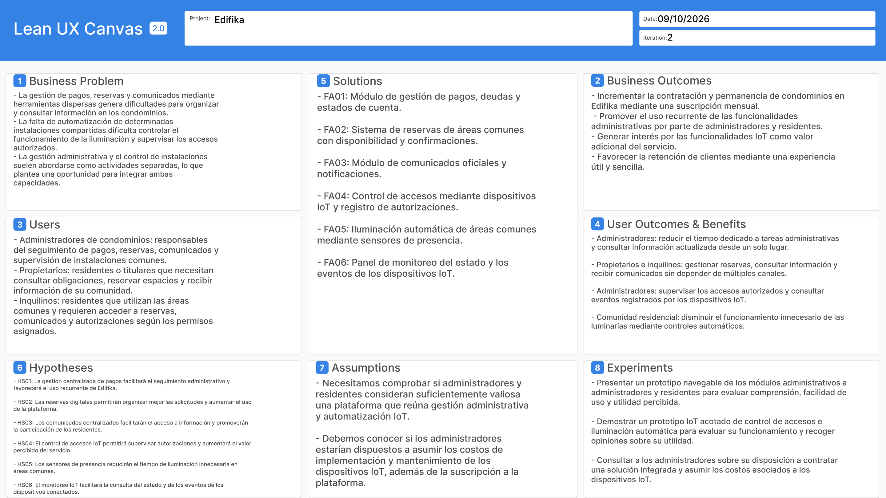

 *Figura. Lean Ux Canvas. Elaborado por el equipo utilizando Figma (Figma, s.f.).*

## 1.3. Segmentos objetivo

### Administradores de edificios y condominios

Este segmento comprende a las personas responsables de coordinar la administración, las finanzas y el funcionamiento de los edificios residenciales. En condominios estudiados en Lima se han identificado dificultades relacionadas con el uso de registros manuales, la cobranza de cuotas y la comunicación con los residentes (Nieto-Cárdenas et al., 2025). Para este grupo, Edifika plantea integrar las actividades administrativas con la supervisión de las instalaciones comunes.

- **Edad:** Personas adultas responsables de la administración del condominio, sin un rango etario excluyente.
- **Ubicación inicial:** Lima Metropolitana y Callao.
- **Características demográficas y de comportamiento:**
  - Administran pagos, deudas, reservas, comunicados y reportes.
  - Coordinan el mantenimiento y funcionamiento de las áreas comunes.
  - Pueden utilizar hojas de cálculo, mensajería y registros físicos para sus actividades.
  - Necesitan consultar información financiera y operativa para tomar decisiones.
- **Necesidades principales:**
  - Centralizar la información de pagos, deudas y estados de cuenta.
  - Organizar reservas y comunicados desde una misma plataforma.
  - Consultar reportes administrativos y financieros.
  - Supervisar los accesos autorizados y sus registros mediante dispositivos IoT.
  - Monitorear el estado de los dispositivos conectados y el funcionamiento de la iluminación en áreas comunes.

### Propietarios e inquilinos de condominios

Este segmento comprende a las personas que poseen o habitan unidades residenciales y utilizan los servicios compartidos del edificio. Sus necesidades se relacionan con la consulta de información, la coordinación de reservas y el acceso a las áreas comunes. Asto-Aguilar et al. (2021) documentaron dificultades en los procesos manuales de reservas en un condominio peruano, mientras que Nieto-Cárdenas et al. (2025) identificaron problemas vinculados con la comunicación y la información sobre pagos.

- **Edad:** Personas adultas propietarias o residentes, sin un rango etario excluyente.
- **Ubicación inicial:** Lima Metropolitana y Callao.
- **Características demográficas y de comportamiento:**
  - Incluye propietarios residentes, propietarios no residentes e inquilinos.
  - Consultan información sobre pagos, normas y actividades del condominio.
  - Utilizan espacios compartidos sujetos a horarios, reservas y autorizaciones.
  - Pueden acceder a los servicios digitales desde dispositivos móviles o computadoras.
- **Necesidades principales:**
  - Consultar sus pagos, deudas y estados de cuenta según los permisos asignados.
  - Recibir comunicados y notificaciones oportunamente.
  - Reservar áreas comunes y verificar su disponibilidad.
  - Utilizar accesos autorizados a espacios compartidos mediante mecanismos seguros.
  - Contar con instalaciones comunes cuyo funcionamiento responda a las necesidades de uso.

# Capítulo II: Requirements Elicitation & Analysis

## 2.1. Competidores
### 2.1.1. Análisis competitivo


| Categoría | Criterio | Edifika | Condo Control | Buildium | AppFolio |
|---|---|---|---|---|---|
| **Propósito** | **¿Por qué llevar a cabo este análisis?** | Identificar oportunidades de diferenciación para Edifika al comparar la gestión administrativa de condominios y la integración de tecnologías IoT, considerando pagos, reservas, comunicaciones, control de accesos e iluminación inteligente. | — | — | — |
| **Perfil** | **Overview** | Plataforma propuesta por Condomia para condominios peruanos. Busca centralizar pagos, deudas, reservas y comunicados, incorporando control de accesos, iluminación automática y monitoreo IoT. | Software especializado en la administración de condominios y asociaciones residenciales, con funciones administrativas, comunicación y seguridad mediante integraciones. | Plataforma en la nube para gestionar propiedades y asociaciones residenciales, con herramientas financieras, operativas y de atención a residentes. | Plataforma de administración inmobiliaria con funciones financieras, operativas y conexiones con sistemas inteligentes mediante proveedores asociados. |
| **Perfil** | **Ventaja competitiva: ¿Qué valor ofrece?** | Propone reunir la gestión administrativa y la supervisión IoT en una experiencia adaptada inicialmente a condominios de Lima Metropolitana. Su diferenciación deberá validarse. | Combina funciones para comunidades residenciales con integraciones especializadas de pagos y control de accesos, como ButterflyMX. | Ofrece herramientas financieras, gestión de residentes, automatización administrativa y reservas según el plan contratado. | Destaca por la amplitud de sus herramientas inmobiliarias y la posibilidad de integrar control de acceso y tecnología residencial inteligente. |
| **Perfil de Marketing** | **Mercado objetivo** | Administradores, propietarios e inquilinos de condominios y edificios multifamiliares de Lima Metropolitana. | Condominios, asociaciones de propietarios y empresas administradoras de comunidades residenciales. | Administradores profesionales de propiedades, asociaciones residenciales y carteras inmobiliarias. | Empresas administradoras, operadores inmobiliarios y propietarios de carteras de inmuebles. |
| **Perfil de Marketing** | **Estrategias de marketing** | Estrategia propuesta basada en demostraciones del producto, facilidad de uso, atención al mercado peruano y beneficios de integrar administración e IoT. | Promoción de soluciones para comunidades residenciales mediante demostraciones, recursos informativos y planes adaptados al tamaño de la comunidad. | Captación de administradores mediante contenidos especializados, demostraciones y presentación de beneficios de eficiencia operativa. | Promoción de una plataforma integral mediante demostraciones, contenido para profesionales inmobiliarios y un ecosistema de integraciones. |
| **Perfil de Producto** | **Productos y servicios** | Gestión de pagos y deudas; reservas de áreas comunes; comunicados y notificaciones; control de accesos IoT; iluminación automática mediante sensores; monitoreo de dispositivos conectados. **Funcionalidades propuestas.** | Pagos en línea, reservas de espacios, comunicados, documentos, gestión de visitantes y acceso inteligente mediante integraciones como ButterflyMX. | Contabilidad, pagos, reportes, comunicación con residentes, mantenimiento y reservas de áreas comunes según el plan. | Gestión financiera, cobros, mantenimiento, comunicación, control de accesos inteligente e integración con tecnología residencial mediante socios como Homebase y PointCentral. |
| **Perfil de Producto** | **Precios y costos** | Modelo propuesto de suscripción mensual por condominio, con costos de instalación y mantenimiento IoT por definir. No existe una tarifa comercial validada. | Planes y cotizaciones según las características de la comunidad. Algunas funciones e integraciones pueden representar costos adicionales. | Suscripción mediante planes escalonados según necesidades y unidades administradas. Algunas transacciones y funcionalidades tienen cargos adicionales. | Modelo comercial de suscripción con cotización según características de la cartera y funcionalidades requeridas. Las integraciones pueden implicar costos de terceros. |
| **Perfil de Producto** | **Canales de distribución** | Plataforma web propuesta para administradores y residentes, con interfaz adaptable a dispositivos móviles. La disponibilidad de aplicaciones nativas dependerá del alcance de desarrollo. | Plataforma web, portal de residentes y aplicación móvil. | Plataforma web y aplicaciones móviles para administradores y residentes. | Plataforma web, aplicaciones móviles e integraciones con proveedores tecnológicos. |
| **Análisis SWOT** | **Fortalezas** | Propuesta enfocada inicialmente en el contexto peruano; integración prevista entre gestión administrativa, accesos IoT e iluminación inteligente. | Especialización en condominios, herramientas de comunicación y ecosistema de integraciones de seguridad. | Funcionalidades financieras consolidadas, gestión de asociaciones y herramientas de automatización. | Amplia cobertura de procesos inmobiliarios, automatización y alianzas con proveedores de tecnología inteligente. |
| **Análisis SWOT** | **Debilidades** | Producto nuevo sin adopción comercial demostrada; costos y mantenimiento del hardware IoT pendientes de validar; necesidad de probar la integración física y digital. | El uso de determinadas capacidades de seguridad depende de proveedores externos y de sus integraciones. | Su orientación principal es la administración inmobiliaria; no se verificó una solución nativa equivalente al control de iluminación común planteado para Edifika. | Algunas capacidades inteligentes dependen de integraciones externas; su amplitud funcional puede exceder las necesidades de condominios pequeños. |
| **Análisis SWOT** | **Oportunidades** | Explorar la demanda local de digitalización residencial, automatización de iluminación y supervisión de accesos en áreas comunes. | Ampliar las integraciones y servicios disponibles para comunidades residenciales. | Extender sus servicios mediante integraciones y herramientas de automatización de propiedades. | Ampliar sus capacidades de edificios conectados mediante alianzas e integraciones tecnológicas. |
| **Análisis SWOT** | **Amenazas** | Competidores establecidos con servicios similares; costos de dispositivos e instalación; riesgos de ciberseguridad, interoperabilidad y resistencia a la adopción. | Nuevas plataformas especializadas, cambios tecnológicos y dependencia de integraciones de terceros. | Competidores con mayor especialización residencial e incorporación de soluciones inteligentes. | Competencia de plataformas especializadas y riesgos vinculados a la integración de distintas tecnologías y proveedores. |

**Fuente:** Elaboración propia a partir de la revisión de los sitios oficiales de Condo Control, Buildium y AppFolio (2026).


### 2.1.2. Estrategias y tácticas frente a competidores

**Gestión administrativa e IoT en una misma plataforma**

**Estrategia:** Diferenciar a Edifika mediante una propuesta que combine la administración de condominios con el control y monitoreo de sus instalaciones compartidas, evitando que ambas actividades dependan de sistemas separados.

**Táctica:** Integrar la gestión de pagos, deudas, reservas y comunicados con funcionalidades IoT de control de accesos, iluminación automática y supervisión de dispositivos conectados.

**Transparencia en la gestión administrativa**

**Estrategia:** Fortalecer la confianza entre administradores y residentes facilitando el acceso a información organizada sobre las actividades y obligaciones del condominio.

**Táctica:** Incorporar consultas de pagos pendientes, estados de cuenta y reportes financieros, respetando los permisos asignados a cada usuario y la confidencialidad de la información.

**Comunicación centralizada y accesible**

**Estrategia:** Reducir la dependencia de canales informales y facilitar la difusión de información relevante para la comunidad residencial.

**Táctica:** Implementar un módulo de comunicados y notificaciones que permita a los administradores publicar avisos y a los residentes consultarlos desde la plataforma.

**Experiencia de usuario simple y adaptable**

**Estrategia:** Facilitar la adopción de Edifika mediante una experiencia sencilla para administradores, propietarios e inquilinos, considerando que sus necesidades y niveles de familiaridad tecnológica pueden variar.

**Táctica:** Diseñar interfaces diferenciadas por rol, con navegación clara y acceso directo a las funciones más utilizadas, como consultar pagos, reservar espacios, revisar comunicados y supervisar instalaciones.

**Adaptación al contexto residencial peruano**

**Estrategia:** Orientar inicialmente la propuesta a condominios de Lima Metropolitana, considerando sus procesos de administración, necesidades operativas y condiciones de implementación tecnológica.

**Táctica:** Utilizar terminología y flujos administrativos acordes con el contexto local, contemplando mecanismos de registro y seguimiento de pagos utilizados en Perú. Evaluar posteriormente la integración con servicios como Yape y Plin, según su viabilidad técnica y comercial.

**Gestión coordinada de reservas y accesos IoT**

**Estrategia:** Mejorar la organización y supervisión del uso de áreas comunes mediante la relación entre las reservas realizadas por residentes y las autorizaciones de acceso correspondientes.

**Táctica:** Implementar un calendario de disponibilidad y confirmación de reservas, vinculado a mecanismos IoT de autorización y registro de accesos para los espacios que dispongan de dispositivos compatibles.

**Automatización de iluminación en áreas comunes**

**Estrategia:** Proponer un uso más eficiente de la energía mediante el control automático de la iluminación en espacios compartidos, como complemento a las funciones administrativas de Edifika.

**Táctica:** Incorporar sensores de presencia conectados a dispositivos de control que permitan encender o apagar luminarias según la ocupación del espacio, considerando las condiciones de seguridad y funcionamiento de cada instalación.

**Monitoreo y seguridad de dispositivos IoT**

**Estrategia:** Favorecer la supervisión de los dispositivos conectados y proteger las operaciones vinculadas al control de accesos y a la automatización de instalaciones comunes.

**Táctica:** Desarrollar un panel para consultar el estado de los dispositivos y sus eventos, establecer permisos de acceso según los roles autorizados e incorporar mecanismos de comunicación segura entre los componentes IoT y la plataforma.

## 2.2. Entrevistas

### 2.2.1. Diseño de entrevistas

Para el diseño de las entrevistas se utilizó el método de entrevistas semiestructuradas, el cual combina un conjunto de preguntas guía con la flexibilidad de profundizar en las respuestas del entrevistado según la dinámica de la conversación. Este enfoque permite recopilar información cualitativa sobre experiencias, hábitos, ineficiencias operativas y expectativas de los usuarios, sin condicionar sus respuestas mediante opciones cerradas o sesgadas. 

Las preguntas fueron redactadas de manera abierta e inductiva para incentivar respuestas narrativas y reflexivas. El instrumento se estructuró en dos guiones diferenciados según los segmentos objetivo del proyecto, abordando tanto la gestión administrativa y financiera tradicional como la supervisión y vivencia en torno a la infraestructura e innovaciones tecnológicas aplicadas a control de accesos inteligentes, sensores de iluminación y sistemas de riego automatizado.

#### 1. Segmento: Administradores de edificios y condominios

- ¿Cuántos inmuebles administran actualmente y cómo coordinan las tareas operativas cotidianas?
- ¿Qué procedimientos y herramientas emplean actualmente para la cobranza, registro contable y conciliación de cuotas de mantenimiento?
- ¿Cómo se realiza la gestión y control de las reservas de áreas comunes entre los edificios a su cargo?
- ¿De qué manera emiten los comunicados oficiales y cómo comprueban que todos los residentes han tomado conocimiento?
- ¿Cuál es la tarea que más tiempo y recursos consume en la rutina de su equipo de trabajo?
- ¿Cuáles son los motivos más comunes por los que surgen quejas o desconfianza por parte de las juntas de propietarios?
- ¿Qué experiencia han tenido al evaluar o implementar software especializado para condominios y cuáles fueron los principales obstáculos encontrados?
- ¿Qué criterios y requerimientos funcionales son determinantes al momento de decidir la adopción de una solución tecnológica unificada?
- ¿Bajo qué modelos de tarifación o rangos de inversión operan habitualmente para la contratación de herramientas digitales?
- ¿Cómo supervisan actualmente la seguridad en portería, el ingreso de visitantes externos y las autorizaciones para mudanzas o proveedores?
- ¿Cómo gestionan el consumo eléctrico en zonas comunes (pasadizos, estacionamientos, escaleras) y cómo evalúan la integración de sensores de iluminación inteligentes?
- ¿De qué manera monitorean el mantenimiento y riego de las áreas verdes y jardines, y qué impacto tendría supervisar un sistema de riego automático desde un panel centralizado?
- ¿Qué tan relevante resulta para su administración contar con un registro y monitoreo centralizado de cerraduras inteligentes, sensores de luz y riego automático sin sobrecargar al residente con tareas técnicas?

---

#### 2. Segmento: Propietarios e Inquilinos

- ¿Cómo se le notifica usualmente el desglose de su cuota de mantenimiento y las novedades del edificio?
- ¿Cómo describe su experiencia al momento de abonar la cuota mensual y hacer llegar el sustento de pago a la administración?
- ¿Dónde o de qué manera puede revisar su histórico de pagos cuando necesita contrastar cobros pasados?
- ¿Qué inconvenientes ha experimentado al querer solicitar o usar un área común del edificio?
- ¿Cómo percibe la claridad y rendición de cuentas sobre los gastos, compras y fondos de reserva del condominio?
- ¿A través de qué canales prefiere recibir la información formal del edificio y qué situaciones le generan saturación en canales informales (como chats grupales)?
- ¿Cuál es el trámite o gestión con la administración que considera más demorado o poco práctico?
- ¿Qué aspectos considera indispensables en un canal digital para gestionar los temas de su vivienda?
- ¿Cómo califica la agilidad y seguridad al momento de autorizar visitas, delivery o mudanzas en el acceso principal de su edificio?
- ¿Qué fallas o molestias identifica en la iluminación de pasadizos, cocheras o escaleras comunes, y cómo valora el funcionamiento de luces automáticas por detección de movimiento?
- ¿Cuál es su percepción sobre el cuidado de las áreas verdes del condominio y el impacto del riego en el uso eficiente del agua del edificio?
- Si el edificio contara con cerraduras digitales seguras, iluminación automática y riego optimizado, ¿cómo prefiere que la administración gestione estos sistemas sin que usted deba preocuparse por labores técnicas o configuraciones complejas?

---

### 2.2.2. Registro de entrevistas

#### Segmento objetivo: Administradores de edificios y condominios

| **ENTREVISTA 1** | |
|---|---|
| **Nombre entrevistado** | César Villalobos |
| **Edad** | 51 años |
| **Distrito** | Cercado de Lima |
| **Fecha y hora** | 12 de septiembre de 2026 – 10:30 p. m. |
| **Duración** | 00:06:48 |
| **Link del video** | [Ver video de la entrevista](https://upcedupe-my.sharepoint.com/:v:/g/personal/u202310358_upc_edu_pe/IQDEXx-uGk1tS71xXaDeSeDeAf3fEODmStVZKztx7vcr0i8?nav=eyJyZWZlcnJhbEluZm8iOnsicmVmZXJyYWxBcHAiOiJPbmVEcml2ZUZvckJ1c2luZXNzIiwicmVmZXJyYWxBcHBQbGF0Zm9ybSI6IldlYiIsInJlZmVycmFsTW9kZSI6InZpZXciLCJyZWZlcnJhbFZpZXciOiJNeUZpbGVzTGlua0NvcHkifX0&e=5V6W7o) |
| **Foto entrevista** |  |
| **Resumen** | César administra 15 edificios en GWM EIRL apoyándose en hojas de cálculo con macros, WhatsApp y banca online. Explica que la impresión y distribución física de avisos de cobranza es el proceso más engorroso de su rutina. Ha descartado software previo por su interfaz sobrecargada, la cual creaba confusión en las juntas vecinales. En el aspecto de infraestructura e IoT, resalta la necesidad de supervisar el control de accesos en portería mediante cerraduras inteligentes que generen bitácoras digitales, ya que los libros de visitas en papel suelen perderse o ser adulterados. Respecto a la eficiencia energética y áreas comunes, considera muy ventajoso auditar centralmente el estado de sensores de iluminación y programaciones de riego automático, dado que muchas quejas vecinales derivan del alto gasto eléctrico por luces encendidas innecesariamente o del mal aspecto de jardines por descuido del personal. Afirma que el administrador debe retener el control exclusivo de los registros y configuraciones de estos dispositivos, ofreciendo a los propietarios solo el beneficio directo sin saturarlos con aspectos técnicos. Considera aceptable una tarifa de entre 2 y 5 USD mensuales por departamento. |

| **ENTREVISTA 2** | |
|---|---|
| **Nombre entrevistado** | Alejandro Galindo |
| **Edad** | 26 años |
| **Distrito** | San Miguel |
| **Fecha y hora** | 13 de septiembre de 2026 – 04:00 p. m. |
| **Duración** | 00:02:26 |
| **Link del video** | [Ver video de la entrevista](https://upcedupe-my.sharepoint.com/:v:/g/personal/u202321281_upc_edu_pe/IQAW5DBOyn8xS6ZiZVZwufEIAU9yh_7P6mIIpJ_RzxJp6is?e=kLEW30&nav=eyJyZWZlcnJhbEluZm8iOnsicmVmZXJyYWxBcHAiOiJTdHJlYW1XZWJBcHAiLCJyZWZlcnJhbFZpZXciOiJTaGFyZURpYWxvZy1MaW5rIiwicmVmZXJyYWxBcHBQbGF0Zm9ybSI6IldlYiIsInJlZmVycmFsTW9kZSI6InZpZXcifX0%3D) |
| **Foto entrevista** |  |
| **Resumen** | Alejandro tiene a su cargo 4 edificios y opera bajo métodos mayormente manuales: hojas de cálculo para cobros y chats de mensajería instantánea para notificaciones y reservas. Manifiesta que el seguimiento manual de depósitos bancarios genera retrasos y constantes reclamos por recibos no conciliados a tiempo. En relación con las instalaciones de los inmuebles, resalta que la gestión de portería es un punto crítico: validar accesos con llaves tradicionales o registros físicos genera cuellos de botella en horas punta; por ello, ve de alto valor un sistema con cerraduras inteligentes donde el administrador supervise accesos y permisos. Asimismo, destaca que la automatización de iluminación mediante sensores de presencia y el riego inteligente de áreas verdes reducirían los costos variables del edificio, uno de los rubros que más observan los propietarios. Valora que la plataforma centralice los reportes de estos dispositivos para monitorear anomalías técnicas sin que los inquilinos deban intervenir en la administración del equipamiento. |

| **ENTREVISTA 3** | |
|---|---|
| **Nombre entrevistado** | Kattya Valentina |
| **Edad** | 25 años |
| **Distrito** | San Miguel |
| **Fecha y hora** | 14 de septiembre de 2026 – 11:15 a. m. |
| **Duración** | 00:02:39 |
| **Link del video** | [Ver video de la entrevista](https://upcedupe-my.sharepoint.com/:v:/g/personal/u202321281_upc_edu_pe/IQBytTOuLENRRpzS9nYLELHKAVVSvtdyP9hPyITLZN-VWLU?e=nGaihv&nav=eyJyZWZlcnJhbEluZm8iOnsicmVmZXJyYWxBcHAiOiJTdHJlYW1XZWJBcHAiLCJyZWZlcnJhbFZpZXciOiJTaGFyZURpYWxvZy1MaW5rIiwicmVmZXJyYWxBcHBQbGF0Zm9ybSI6IldlYiIsInJlZmVycmFsTW9kZSI6InZpZXcifX0%3D) |
| **Foto entrevista** |  |
| **Resumen** | Kattya gestiona 15 condominios apoyada en macros de Excel, mensajería de WhatsApp y portales bancarios. Señala que el desglose y cobranza física genera fricciones constantes por falta de inmediatez. Al revisar soluciones existentes en el mercado, notó que resultaban poco intuitivas y recargadas de módulos innecesarios. Al abordar el ámbito de infraestructura e IoT, subraya que la coordinación del mantenimiento físico representa un reto: frecuentemente hay quejas por áreas verdes secas o mal regadas por olvidos de conserjería, así como luminarias de pasadizos encendidas permanentemente que elevan los recibos de luz comunes. Apoya firmemente contar con un panel donde el administrador pueda auditar y configurar parámetros de riego automatizado, monitorear sensores lumínicos y revisar el historial de aperturas de cerraduras inteligentes en áreas sociales y accesos principales, manteniendo estos registros en el ámbito exclusivo de la administración para asegurar la privacidad y el orden del condominio. |

**Segmento objetivo: Propietarios e Inquilinos:**

| **ENTREVISTA 1** | |
|---|---|
| **Nombre entrevistado** | Melina López |
| **Edad** | 51 años |
| **Distrito** | San Miguel |
| **Fecha y hora** | 18 de septiembre de 2026 – 03:00 p. m. |
| **Duración** | 00:02:26 |
| **Link del video** | [Ver video de la entrevista](https://upcedupe-my.sharepoint.com/personal/u202310358_upc_edu_pe/_layouts/15/stream.aspx?id=%2Fpersonal%2Fu202310358%5Fupc%5Fedu%5Fpe%2FDocuments%2Fentrevista%5Fsegmento%5Fobjetivo%5Fpropietarios%2Emp4&nav=eyJyZWZlcnJhbEluZm8iOnsicmVmZXJyYWxBcHAiOiJPbmVEcml2ZUZvckJ1c2luZXNzIiwicmVmZXJyYWxBcHBQbGF0Zm9ybSI6IldlYiIsInJlZmVycmFsTW9kZSI6InZpZXciLCJyZWZlcnJhbFZpZXciOiJNeUZpbGVzTGlua0NvcHkifX0&ga=1&referrer=StreamWebApp%2EWeb&referrerScenario=AddressBarCopied%2Eview%2E90d21b78%2D17c7%2D47e6%2D9d8c%2D754be308c3c6) |
| **Foto entrevista** | 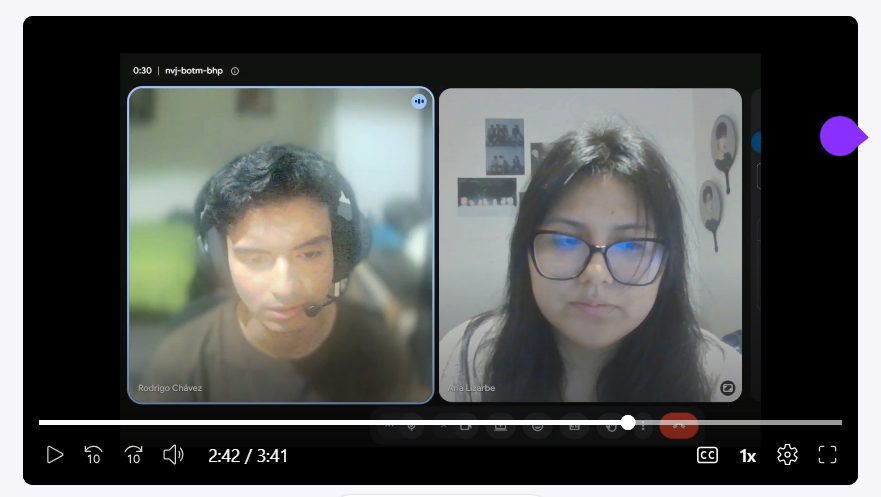 |
| **Resumen** | Melina es propietaria y señala que sus obligaciones laborales le impiden asistir a las reuniones presenciales. Realiza sus pagos bancarios y envía el comprobante por correo electrónico, guardando copias físicas en casa ante la falta de una plataforma que conserve su historial contable. Indica que la reserva de áreas comunes es un proceso engorroso por la gestión manual de garantías y la falta de un calendario en tiempo real. En el ámbito de la convivencia y el entorno físico, resalta que a menudo las luces de los pasillos permanecen encendidas de día o apagadas cuando se necesitan de noche; por ello, ve de gran utilidad que existan sensores de movimiento que funcionen solos. Asimismo, valora positivamente que el riego de jardines sea programado y automático para no depender de la voluntad del personal de turno, y considera prudente que el uso de cerraduras inteligentes agilice el acceso a las áreas del edificio sin que los residentes tengan que lidiar con configuraciones técnicas complejas ni acceso a historiales ajenos. |

| **ENTREVISTA 2** | |
|---|---|
| **Nombre entrevistado** | Jarol Panduro |
| **Edad** | 30 años |
| **Distrito** | San Miguel |
| **Fecha y hora** | 19 de septiembre de 2026 – 07:15 p. m. |
| **Duración** | 00:03:48 |
| **Link del video** | [Ver video de la entrevista](https://youtu.be/NHYPQzPL36M) |
| **Foto entrevista** |  |
| **Resumen** | Jarol, abogado de profesión, cuestiona la falta de modernización en la gestión de su edificio. Remitir capturas de pantalla por mensajería instantánea para certificar el pago de mantenimiento le resulta ineficiente y propenso a extravío de información. Manifiesta su disconformidad con el registro manual de visitas y paquetería en libretas físicas en la portería, el cual considera inseguro y lento. Sugiere la incorporación de cerraduras inteligentes y control de accesos centralizado gestionado por la administración para optimizar el ingreso de personas autorizadas. También menciona el gasto recurrente e injustificado en consumos comunes de agua y energía eléctrica, manifestando que un sistema de iluminación inteligente activado por sensores y un riego tecnificado resolverían el desperdicio en las áreas comunes. Subraya que la administración debe ser quien configure y supervise estos equipos, garantizando que el residente solo perciba una experiencia ágil, segura y libre de trámites manuales. |

| **ENTREVISTA 3** | |
|---|---|
| **Nombre entrevistado** | Marcelo Candia |
| **Edad** | 25 años |
| **Distrito** | San Miguel |
| **Fecha y hora** | 19 de septiembre de 2026 – 08:30 p. m. |
| **Duración** | 00:05:26 minutos |
| **Link del video** | [Ver video de la entrevista](https://youtu.be/E5k60PHyvYI) |
| **Foto entrevista** |  |
| **Resumen** | Marcelo expresa su insatisfacción por el uso obligatorio de recibos físicos y canales de pago tradicionales, reclamando la integración de pagos digitales instantáneos. Señala recurrentes empalmes de horarios y discusiones en la reserva de áreas sociales debido a la falta de un sistema digital transparente. En cuanto a las instalaciones físicas del edificio, critica que el proceso para autorizar mudanzas o visitas dependa enteramente de autorizaciones en papel en la entrada, sugiriendo cerraduras inteligentes con códigos o validación digital controladas por la administración. Igualmente, opina que la automatización de la iluminación en escaleras y cocheras mediante sensores evitaría el desperdicio eléctrico, y que el riego automático mantendría las áreas verdes sin elevar los costos de mantenimiento. Afirma que el inquilino o propietario debe disfrutar de estos servicios sin acceso a las consolas o registros técnicos internos, los cuales corresponden a la esfera de control del administrador. |

---

### 2.2.3. Análisis de entrevistas

##### 1. Segmento: Administradores de edificios y condominios
Las entrevistas sostenidas con **César Villalobos (15 edificios)**, **Alejandro Galindo (4 edificios)** y **Kattya Valentina (15 edificios)** demuestran que el modelo de administración actual presenta una alta dependencia de herramientas genéricas (hojas de cálculo con macros complejas, mensajería instantánea de WhatsApp y cuadernos físicos en portería). Esta fragmentación operativa da lugar a tres problemas centrales: la lentitud en la conciliación de cuotas de mantenimiento, la falta de confirmación de lectura de los comunicados institucionales y la sobrecarga que implica tramitar solicitudes de reserva y cobros en papel.

En lo relativo a la modernización de infraestructura e integración de **tecnología IoT**, los tres administradores concuerdan en que la supervisión de los condominios debe evolucionar hacia la automatización:
- **Control de accesos inteligentes:** Coinciden en la vulnerabilidad de las libretas de visitas tradicionales y la pérdida de llaves físicas; respaldan la implementación de cerraduras inteligentes y registro de visitas cuya auditoría y asignación de permisos recaiga en la administración.
- **Sensores de iluminación:** Identifican que las luminarias encendidas de forma continua representan uno de los costos comunes más cuestionados por las juntas; valoran monitorear sensores de presencia que enciendan las luces solo ante movimiento para reducir el consumo general.
- **Riego automatizado:** Reconocen que las quejas por deterioro de áreas verdes o exceso de gasto de agua se originan por el descuido en el riego manual. Consideran fundamental monitorear los ciclos y cronogramas de riego desde su panel administrativo.

Los administradores enfatizan un requerimiento arquitectónico clave: **la administración debe retener el acceso exclusivo a los registros, alertas y configuraciones de estos dispositivos**, de modo que los residentes experimenten los beneficios (seguridad, espacios iluminados y áreas verdes en buen estado) sin tener acceso a configuraciones técnicas ni a las bitácoras privadas de acceso de todo el inmueble. Asimismo, exigen que la plataforma unificada sea limpia, intuitiva y mantenga costos acordes al mercado inmobiliario (entre 2 y 5 USD mensuales por departamento).

##### 2. Segmento: Propietarios e inquilinos
Las entrevistas efectuadas a **Melina López**, **Jarol Panduro** y **Marcelo Candia** confirman un malestar extendido con los procedimientos tradicionales de gestión de edificios. En el aspecto financiero, los residentes resienten la obligación de enviar capturas de transferencias por correo o WhatsApp y la ausencia de un historial digital accesible donde puedan verificar saldos históricos, lo que los obliga a archivar recibos impresos por precaución. En cuanto a la convivencia, señalan que los grupos vecinales de mensajería están saturados de reclamos informales que diluyen los avisos importantes, mientras que la reserva de áreas comunes genera fricción por la falta de calendarios en tiempo real y la engorrosa devolución de garantías.

En lo concerniente a los **servicios e infraestructura tecnológica (IoT)**:
- **Accesos y seguridad:** Critican la lentitud e informalidad del registro manual en portería para visitas, servicios de entrega y mudanzas; valoran la presencia de cerraduras y accesos inteligentes que agilicen la validación de ingreso.
- **Iluminación automatizada:** Consideran indispensable el empleo de sensores de presencia en áreas de tránsito común (pasadizos, estacionamientos y escaleras), reduciendo costos innecesarios en la factura común y garantizando iluminación inmediata al transitar.
- **Riego inteligente:** Perciben el cuidado de las áreas verdes como un factor clave para el valor de su vivienda; apoyan sistemas tecnificados que eviten el desperdicio de agua y mantengan los jardines saludables.
- **Rol y experiencia de usuario:** Los entrevistados señalan que no desean encargarse de la configuración, mantenimiento ni revisión de bitácoras de los equipos IoT; esperan que sea la administración quien garantice su correcto funcionamiento, mientras que ellos disfrutan de las instalaciones mediante una aplicación móvil ágil, transparente y operativa las 24 horas del día.


## 2.3. Needfinding
### 2.3.1. User Personas

### Administrador de Condominio – Ricardo Mendoza

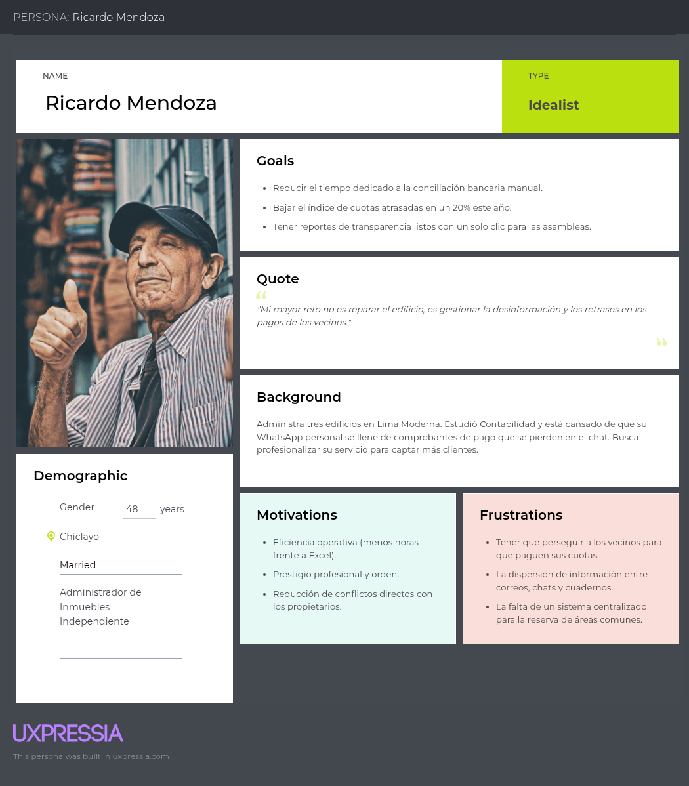

*Figura. User persona del administrador de condominio. Elaborado por el equipo utilizando UXPressia (UXPressia, s.f.).*

### Residente (Propietario/Inquilino) – Andrea Villacorta

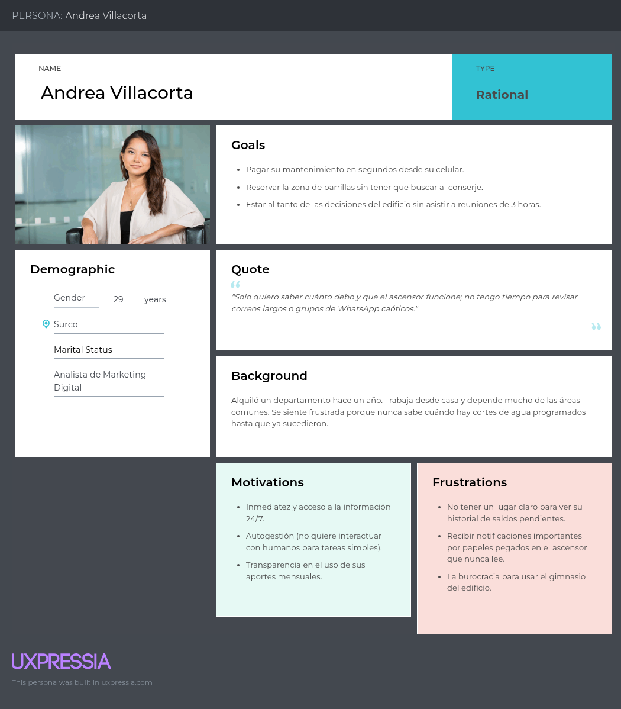

*Figura. User persona del residente. Elaborado por el equipo utilizando UXPressia (UXPressia, s.f.).*

### 2.3.2. User Task Matrix

### Administrador de Condominio – Ricardo Mendoza

| Tarea | Frecuencia | Prioridad | Frustración |
| :--- | :--- | :--- | :--- |
| Conciliar pagos y validar transferencias | Diario | Muy Alta | Alta |
| Actualizar el estado de saldos pendientes | Diario | Alta | Alta |
| Enviar comunicados oficiales masivos | Semanal | Alta | Media |
| Gestionar y aprobar reservas de áreas comunes | Diario | Media | Media |
| Generar reportes financieros mensuales | Mensual | Muy Alta | Alta |
| Registrar gastos y facturas del edificio | Semanal | Alta | Media |
| Identificar deudores críticos para cobranza | Semanal | Alta | Media |

### Residente (Propietario/Inquilino) – Andrea Villacorta

| Tarea | Frecuencia | Prioridad | Frustración |
| :--- | :--- | :--- | :--- |
| Consultar monto exacto de cuota del mes | Mensual | Muy Alta | Media |
| Subir el comprobante de pago realizado | Mensual | Alta | Alta |
| Verificar disponibilidad de áreas comunes | Ocasional | Media | Alta |
| Realizar una reserva (parrilla, SUM, etc.) | Ocasional | Media | Media |
| Leer notificaciones de mantenimiento | Semanal | Alta | Media |
| Revisar el estado de cuenta histórico | Semanal | Media | Alta |
| Reportar una avería o incidencia | Ocasional | Alta | Alta |

### 2.3.3. User Journey Mapping

Primer Segmento:

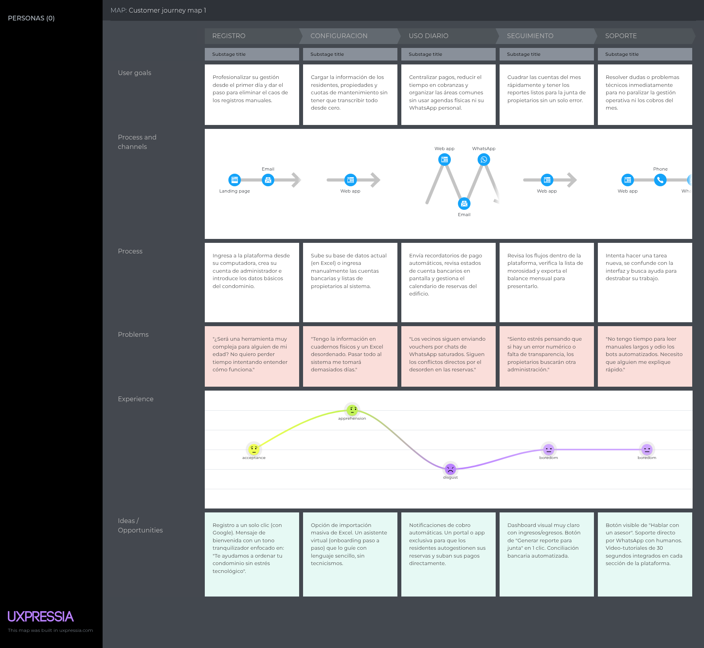 

Segundo Segmento:


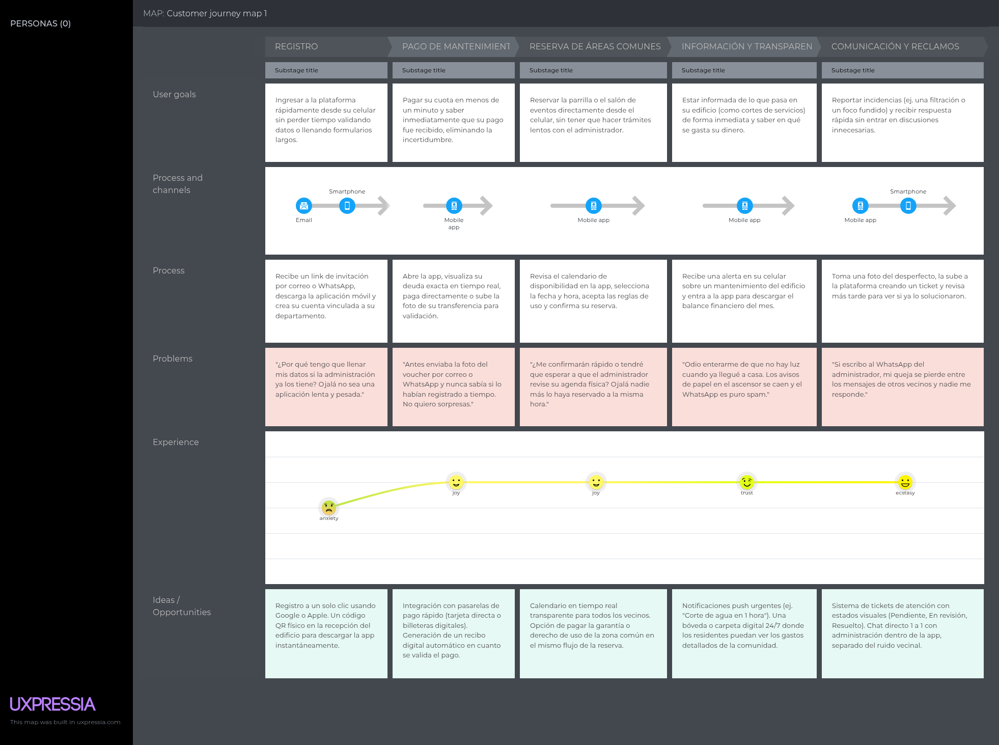 

### 2.3.4. Empathy Mapping

### Administrador de Condominio – Ricardo Mendoza

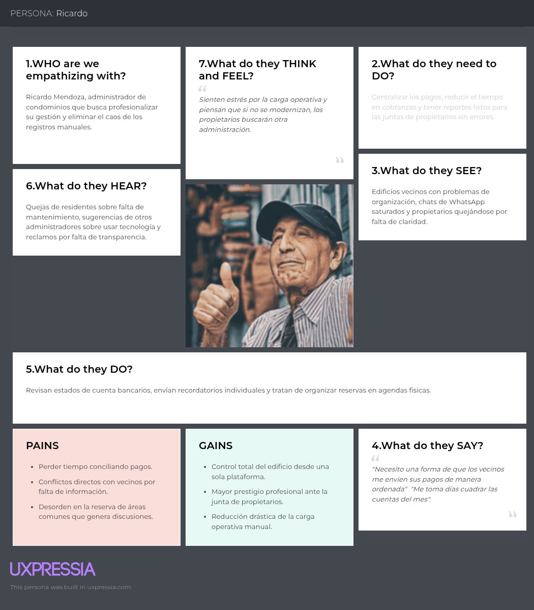

 *Figura. Empathy mapping del administrador de condominio. Elaborado por el equipo utilizando UXPressia (UXPressia, s.f.).*


### Residente (Propietario/Inquilino) – Andrea Villacorta

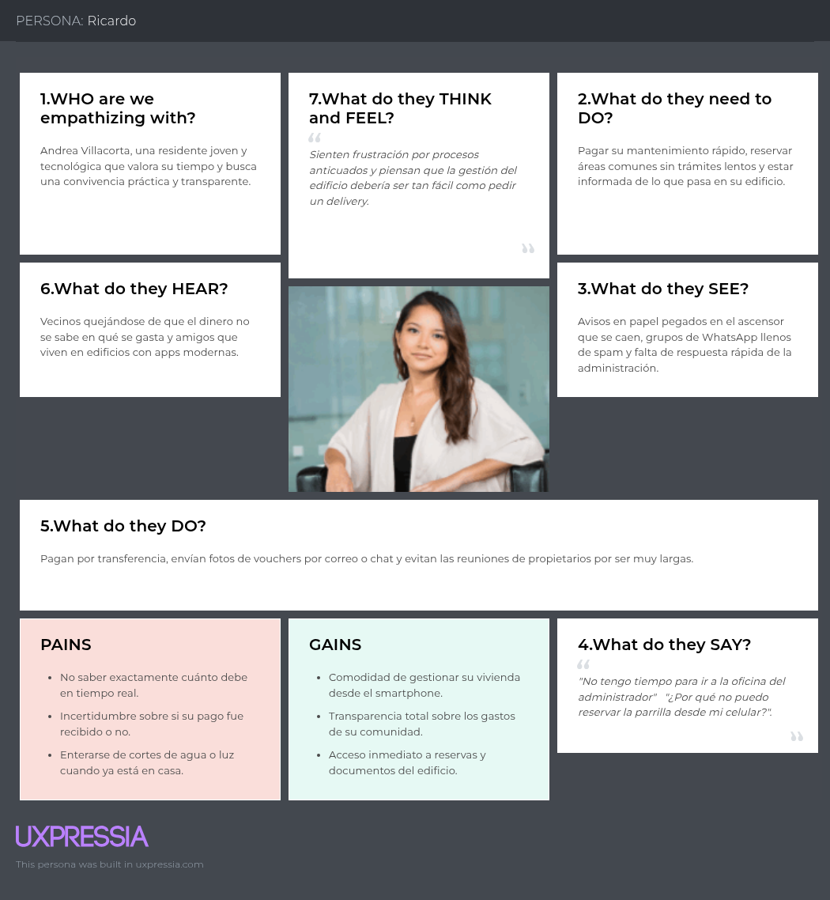

*Figura. Empathy mapping del residente. Elaborado por el equipo utilizando UXPressia (UXPressia, s.f.).*

## 2.4. Big Picture EventStorming

En esta sección se presenta el resultado de la sesión de Big Picture EventStorming, técnica de modelado colaborativo que reconstruye el funcionamiento de un negocio a partir de los hechos relevantes que ocurren en él. La sesión se enfocó en comprender el dominio general de la administración de condominios: el equipo registró en post-its naranjas los eventos de dominio significativos del flujo operativo, redactados en tiempo pasado, como Deuda generada, Reserva aceptada, Tarjeta reconocida o Luces encendidas automáticamente. Este mapeo permitió identificar los hechos clave de la operación diaria del edificio y agruparlos luego en bloques funcionales lógicos, asegurando que la solución tecnológica responda a los requisitos reales del flujo operativo.

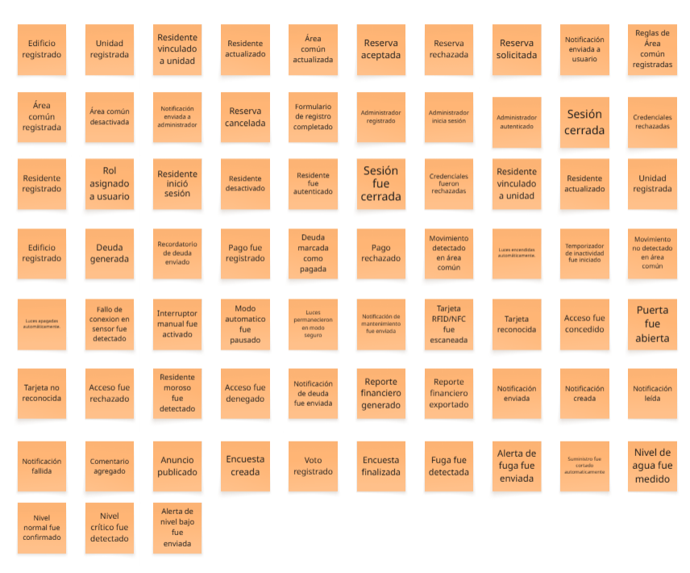

*Figura. Big Picture EventStorming de Edifika. Elaborado por el equipo utilizando Miro (Miro, s.f.).*

## 2.5 Ubiquitous Language

El Ubiquitous Language define un lenguaje común entre el equipo y los actores del negocio, de modo que los mismos términos se usen en las conversaciones, la documentación y el código. En este proyecto integra conceptos de administración de condominios y de automatización mediante IoT.

### Usuarios

- **Visitante:** persona anónima que consulta el Landing Page para conocer el modelo de negocio y los precios antes de registrarse.
- **Administrador:** persona responsable de la operación de uno o varios edificios. Gestiona residentes, unidades, deudas, pagos, reservas, comunicados, reportes y reglas IoT desde la aplicación web.
- **Residente (Propietario o Inquilino):** persona vinculada a una unidad que, desde la aplicación móvil, consulta y paga deudas, reserva áreas comunes, lee comunicados, participa del foro y accede a las áreas comunes con su tarjeta RFID.

### Gestión del condominio

- **Edificio:** conjunto de unidades residenciales administradas en la plataforma.
- **Unidad:** departamento asignado a uno o varios residentes dentro de un edificio.
- **Área común:** espacio compartido por los residentes, como salón de eventos, gimnasio o zona de parrillas.
- **Regla de área común:** condición que define el uso de un área común, como su aforo máximo o el tipo de reserva permitido.
- **Reserva:** solicitud de un residente para usar un área común en una fecha y horario determinados. Puede estar solicitada, aceptada, rechazada o cancelada.
- **Deuda:** monto que una unidad debe pagar por un periodo de mantenimiento, con fecha de vencimiento.
- **Deuda vencida:** deuda que no se pagó antes de su fecha de vencimiento.
- **Residente moroso:** residente con al menos una deuda vencida. Su acceso a las áreas comunes queda restringido.
- **Pago:** abono que realiza un residente para cancelar una deuda.
- **Pago en línea:** pago con tarjeta, Yape o billetera móvil procesado a través de la pasarela de pagos.
- **Pasarela de pagos:** servicio externo que procesa los cobros en línea (Culqi).
- **Comprobante de pago:** imagen del voucher que el residente adjunta cuando paga fuera de línea, y que el administrador revisa.
- **Constancia de pago:** documento que el sistema emite cuando un pago es aprobado.
- **Estado de cuenta:** resumen de las deudas pendientes y los pagos realizados de una unidad.
- **Historial de pagos:** registro de todos los pagos efectuados por el residente.
- **Comunicado:** anuncio oficial emitido por la administración para informar novedades o disposiciones.
- **Foro:** espacio privado de cada edificio donde los residentes publican y comentan.
- **Publicación:** mensaje que un residente comparte en el foro, con texto e imagen opcional.
- **Notificación:** mensaje push enviado a un residente o administrador para informar un evento relevante.
- **Reporte financiero:** documento que resume ingresos, deudas pendientes y morosidad del edificio.

### IoT

- **Dispositivo IoT:** equipo físico instalado en el edificio que mide variables del entorno o ejecuta acciones. Puede estar activo, inactivo, desconectado o en mantenimiento.
- **Edge Gateway:** equipo instalado en el condominio que coordina los dispositivos y sigue operando aunque se caiga el internet.
- **Control de accesos:** mecanismo que autoriza o deniega el ingreso a un área común.
- **Tarjeta RFID:** credencial física que el residente presenta en el lector para acceder a un área común.
- **Credencial activa:** tarjeta RFID habilitada para un residente y un área común en un horario determinado.
- **Acceso concedido / denegado:** resultado de validar una tarjeta RFID contra los permisos, la reserva vigente y la morosidad del residente.
- **Iluminación inteligente:** encendido y apagado automático de las luces de áreas comunes según presencia, luz ambiental y horarios de reserva.
- **Sensor de presencia:** sensor PIR que detecta movimiento de personas en un área común.
- **Nivel de lux:** cantidad de luz ambiental medida por el sensor LDR.
- **Temporizador de inactividad:** tiempo sin movimiento tras el cual las luces se apagan.
- **Riego automático:** activación del riego de áreas verdes según horarios programados o la humedad del suelo.
- **Humedad del suelo:** porcentaje de agua en la tierra medido por el sensor capacitivo.
- **Umbral de humedad:** valor de humedad por debajo del cual se activa el riego.
- **Override manual:** acción del administrador que anula temporalmente una regla automática de iluminación o riego.
- **Regla de automatización:** condición configurada que dispara una acción automática a partir de lo que detecta un sensor.
- **Telemetría:** datos que los dispositivos envían periódicamente, como presencia, lux, corriente, humedad y flujo de agua.
- **Consumo de recursos:** energía (kWh) y agua consumidas en las áreas comunes, calculadas a partir de la telemetría.
- **Anomalía:** consumo o lectura fuera de los parámetros esperados.
- **Falla de dispositivo:** pérdida de conexión o mal funcionamiento detectado en un dispositivo IoT.
- **Log de dispositivo:** registro cronológico de los eventos generados por un dispositivo.
- **Dashboard IoT:** panel de la aplicación web donde el administrador ve el estado de los dispositivos y el consumo de recursos.


# Capítulo III: Requirements Specification

## 3.1. User Stories

En esta sección se presentan las épicas, user stories y technical stories de Edifika. Se definen épicas que agrupan user stories y technical stories, alineadas con los bounded contexts de la solución. Cada historia se redacta desde la perspectiva de su rol: administrador, residente (propietario o inquilino), visitante para las funcionalidades de la landing page, sistema para los procesos automáticos de IoT y developer para las technical stories. Los criterios de aceptación siguen el formato Gherkin (Dado que – Cuando – Entonces), redactados en tercera persona y tiempo presente, e incluyen tanto el escenario exitoso como los casos de error, de modo que cada uno pueda verificarse con una prueba concreta.


| Epic ID | Título | Descripción | User Stories Asociadas |
|---------|--------|-------------|------------------------|
| EP01 | Autenticación y gestión de usuarios | Esta épica se enfoca en el registro y la administración de usuarios de la plataforma. El administrador se registra por sí mismo, mientras que los residentes son registrados por el administrador al vincularlos con su unidad. Incluye el inicio de sesión, la edición de datos y la activación o desactivación de cuentas. | US01, US02, US03, US04, US05 |
| EP02 | Comunicación centralizada | Esta épica aborda la publicación de comunicados oficiales y el foro comunitario del edificio, permitiendo mantener informados a los residentes y fomentar la interacción entre ellos. Incluye el seguimiento de lectura de comunicados y la moderación del foro. | US06, US07, US08, US09, US10 |
| EP03 | Gestión de áreas comunes | Esta épica se centra en la administración y el uso eficiente de las áreas comunes del edificio. Permite a los residentes consultar disponibilidad, solicitar y cancelar reservas, mientras que los administradores configuran las reglas de cada área, aprueban solicitudes y evitan conflictos de horario. | US11, US12, US13, US14, US15, US16 |
| EP04 | Gestión financiera y reportes | Esta épica se enfoca en la administración económica del edificio, permitiendo a los residentes consultar su deuda, pagar en línea o con comprobante y revisar su historial. Los administradores pueden registrar pagos, resolver pagos en verificación, identificar morosos y generar reportes financieros. | US17, US18, US19, US20, US21, US22, US23, US24, US25 |
| EP05 | Infraestructura, seguridad y arquitectura técnica | Esta épica abarca los aspectos técnicos necesarios para el funcionamiento de Edifika: configuración de microservicios, autenticación JWT, API Gateway, base de datos por microservicio, documentación de APIs, comunicación entre servicios, mensajería de eventos, Edge Gateway y despliegue. Su objetivo es garantizar que la plataforma sea segura, escalable y mantenible. | TS01, TS02, TS03, TS04, TS05, TS06, TS07, TS08, TS09, TS10, TS11, TS12, TS13, TS14, TS15, TS16, TS17, TS18, TS19, TS20, TS21, TS22, TS23, TS24, TS25, TS26, TS27, TS28, TS29, TS30, TS31, TS32 |
| EP06 | Landing Page e Interfaz Web | Esta épica cubre las funcionalidades de la landing page pública de Edifika: presentación de la propuesta de valor, navegación entre secciones, funcionalidades del producto y acceso a la aplicación web o móvil según el segmento del visitante. | US26, US27, US28 |
| EP07 | Control de accesos y riego automático | Esta épica abarca el control de acceso a las áreas comunes mediante tarjetas RFID, combinando reservas vigentes y estado de morosidad, y el riego automático de las áreas verdes según horarios programados y la humedad del suelo. Permite al administrador auditar los accesos, abrir accesos de forma remota y controlar manualmente el riego. | US29, US30, US31, US32, US33, US34, US35, US36 |
| EP08 | Iluminación inteligente y automatización | Esta épica abarca la automatización de la iluminación de áreas comunes mediante reglas configurables (presencia, lux, horario y prioridad), el encendido al iniciar una reserva y el control manual temporal (override), buscando mejorar la seguridad y reducir el consumo energético. | US37, US38, US39, US40 |
| EP09 | Telemetría y analítica IoT | Esta épica cubre la ingesta, almacenamiento y análisis de las lecturas de los sensores. Permite al administrador visualizar el consumo de energía y agua, recibir alertas de consumo anómalo y fallas de dispositivos, y monitorear el estado de conexión de los dispositivos. | US41, US42, US43, US44 |
| EP10 | Edge Gateway e integración con dispositivos ESP32 | Esta épica abarca el servicio Edge Gateway (Python, Flask, Peewee ORM y SQLite) que se ejecuta en el edificio y se comunica por MQTT local con los nodos ESP32 (lector RFID, cerradura eléctrica, buzzer, pantalla OLED, sensor PIR, sensor LDR, sensor de corriente ACS712, sensor de humedad del suelo, sensor de flujo y válvula solenoide). Resuelve accesos con una caché local, opera sin conexión a internet y se sincroniza con la nube. | US45, US46, US47, US48, US49, US50 |

**User Stories:**

<table>
  <thead>
    <tr>
      <th>Epic / Story ID</th>
      <th>Título</th>
      <th>Descripción</th>
      <th>Criterios de Aceptación (Escenarios)</th>
      <th>Relacionado</th>
    </tr>
  </thead>
  <tbody>

<tr>
  <td><strong>US01</strong></td>
  <td>Registrar residente y vincularlo a su unidad</td>
  <td>Como administrador, quiero registrar a un residente y vincularlo a su unidad para que pueda acceder a la aplicación móvil de su edificio.</td>
  <td>
    <strong>Escenario 1: Vinculación exitosa.</strong><br>
    Dado que el administrador ingresa los datos del residente y selecciona su torre y unidad,<br>
    cuando confirma el registro,<br>
    entonces el sistema vincula al residente con la unidad, crea su usuario con rol RESIDENT y le envía sus credenciales de acceso por correo.<br><br>
    <strong>Escenario 2: Unidad con titular activo.</strong><br>
    Dado que el administrador selecciona una unidad que ya tiene un titular activo,<br>
    cuando intenta registrar a un nuevo titular,<br>
    entonces el sistema bloquea el registro e indica "La unidad ya tiene un titular activo".<br><br>
    <strong>Escenario 3: Correo ya registrado.</strong><br>
    Dado que el correo ingresado ya pertenece a otro usuario,<br>
    cuando el administrador intenta completar el registro,<br>
    entonces el sistema muestra "El correo ya está registrado" sin crear el usuario.
  </td>
  <td>EP01</td>
</tr>

<tr>
  <td><strong>US02</strong></td>
  <td>Inicio de sesión</td>
  <td>Como usuario, quiero iniciar sesión para acceder a mi información.</td>
  <td>
    <strong>Escenario 1: Login exitoso.</strong><br>
    Dado que el usuario tiene credenciales válidas,<br>
    cuando las ingresa y confirma el inicio de sesión,<br>
    entonces el sistema lo redirige al dashboard correspondiente según su rol (Admin en la web, Residente en la app móvil).<br><br>
    <strong>Escenario 2: Bloqueo por intentos.</strong><br>
    Dado que el usuario ha ingresado credenciales incorrectas,<br>
    cuando acumula 5 intentos fallidos,<br>
    entonces el sistema bloquea la cuenta por 15 minutos por razones de seguridad.<br><br>
    <strong>Escenario 3: Sesión expirada.</strong><br>
    Dado que el token JWT del usuario ha caducado,<br>
    cuando intenta navegar dentro de la plataforma,<br>
    entonces el sistema lo redirige al login con el mensaje "Su sesión ha expirado".
  </td>
  <td>EP01</td>
</tr>

<tr>
  <td><strong>US03</strong></td>
  <td>Actualizar información de usuarios</td>
  <td>Como administrador, quiero editar datos de usuarios para corregir errores.</td>
  <td>
    <strong>Escenario 1: Edición de contacto.</strong><br>
    Dado que el admin accede al perfil de un residente,<br>
    cuando modifica el número de teléfono y guarda los cambios,<br>
    entonces el sistema almacena la información y registra en el log quién realizó el cambio.<br><br>
    <strong>Escenario 2: Cambio de rol inválido.</strong><br>
    Dado que el admin es el único administrador activo del sistema,<br>
    cuando intenta quitarse sus propios permisos de administrador,<br>
    entonces el sistema lanza "Error: Debe existir al menos un administrador activo".<br><br>
    <strong>Escenario 3: Fallo de persistencia.</strong><br>
    Dado que el admin intenta guardar cambios en un perfil,<br>
    cuando la base de datos se encuentra en mantenimiento,<br>
    entonces el sistema muestra "Error 500: No se pudieron guardar los cambios".
  </td>
  <td>EP01</td>
</tr>

<tr>
  <td><strong>US04</strong></td>
  <td>Registrar edificio y unidades</td>
  <td>Como administrador, quiero configurar la estructura del edificio (torres/unidades).</td>
  <td>
    <strong>Escenario 1: Configuración inicial.</strong><br>
    Dado que el admin ingresa la configuración del edificio,<br>
    cuando registra 2 torres con 20 departamentos cada una,<br>
    entonces el sistema genera IDs únicos para cada unidad automáticamente.<br><br>
    <strong>Escenario 2: Unidades duplicadas.</strong><br>
    Dado que el admin intenta registrar una unidad,<br>
    cuando el "Dpto 101" ya existe en la misma torre,<br>
    entonces el sistema arroja "Error: Identificador de unidad ya existe".<br><br>
    <strong>Escenario 3: Interrupción de carga masiva.</strong><br>
    Dado que el admin está subiendo un Excel de unidades,<br>
    cuando el proceso se interrumpe inesperadamente,<br>
    entonces el sistema indica cuál fue la última fila procesada exitosamente.
  </td>
  <td>EP01</td>
</tr>

<tr>
  <td><strong>US05</strong></td>
  <td>Activar/Desactivar cuentas</td>
  <td>Como administrador, quiero controlar quién tiene acceso a la app.</td>
  <td>
    <strong>Escenario 1: Desactivación por mudanza.</strong><br>
    Dado que un residente se ha mudado del edificio,<br>
    cuando el admin inactiva su cuenta,<br>
    entonces las credenciales del residente y su tarjeta RFID dejan de funcionar al instante.<br><br>
    <strong>Escenario 2: Reactivación.</strong><br>
    Dado que el admin habilita una cuenta suspendida,<br>
    cuando confirma la reactivación,<br>
    entonces el sistema envía automáticamente un correo: "Tu cuenta ha sido reactivada".<br><br>
    <strong>Escenario 3: Error al desactivar Admin.</strong><br>
    Dado que el sistema tiene un único administrador activo,<br>
    cuando se intenta desactivar esa cuenta,<br>
    entonces el sistema impide la acción por razones de seguridad.
  </td>
  <td>EP01</td>
</tr>

<tr>
  <td><strong>US06</strong></td>
  <td>Recibir y consultar comunicados</td>
  <td>Como residente, quiero recibir y consultar la información oficial del condominio.</td>
  <td>
    <strong>Escenario 1: Lectura de acta.</strong><br>
    Dado que el admin publica el acta de una junta,<br>
    cuando el residente recibe el aviso,<br>
    entonces puede abrir y leer el PDF directamente desde la app.<br><br>
    <strong>Escenario 2: Filtro de relevancia.</strong><br>
    Dado que el admin publica un aviso dirigido únicamente a "Torre A",<br>
    cuando el comunicado es enviado,<br>
    entonces los residentes de "Torre B" no reciben el mensaje.<br><br>
    <strong>Escenario 3: Historial de comunicados.</strong><br>
    Dado que el residente accede al historial de comunicados,<br>
    cuando filtra por un mes,<br>
    entonces el sistema lista los comunicados de ese período en orden cronológico o muestra "No hay comunicados para este periodo" si no existen.
  </td>
  <td>EP02</td>
</tr>

<tr>
  <td><strong>US07</strong></td>
  <td>Publicar comunicados oficiales</td>
  <td>Como administrador, quiero difundir noticias a la comunidad.</td>
  <td>
    <strong>Escenario 1: Publicación con adjunto.</strong><br>
    Dado que el admin redacta un comunicado con el presupuesto anual adjunto,<br>
    cuando lo publica,<br>
    entonces el sistema lo distribuye a todos los perfiles activos.<br><br>
    <strong>Escenario 2: Borrador de comunicado.</strong><br>
    Dado que el admin está redactando un comunicado,<br>
    cuando lo guarda como borrador,<br>
    entonces el sistema lo mantiene oculto para los residentes hasta su publicación.<br><br>
    <strong>Escenario 3: Error de formato.</strong><br>
    Dado que el admin intenta adjuntar un archivo al comunicado,<br>
    cuando el archivo supera los 10MB,<br>
    entonces el sistema indica "El archivo excede el límite permitido (10MB)".
  </td>
  <td>EP02</td>
</tr>

<tr>
  <td><strong>US08</strong></td>
  <td>Seguimiento de visualización de comunicados</td>
  <td>Como administrador, quiero saber quién ha visto los comunicados para asegurar su alcance.</td>
  <td>
    <strong>Escenario 1: Visualización del registro.</strong><br>
    Dado que el admin accede a un comunicado publicado,<br>
    cuando revisa el panel de seguimiento,<br>
    entonces el sistema muestra la lista de residentes que lo han leído con fecha y hora de lectura.<br><br>
    <strong>Escenario 2: Residentes que no han leído.</strong><br>
    Dado que el admin consulta el seguimiento de un comunicado,<br>
    cuando filtra por "No leído",<br>
    entonces el sistema lista los residentes que aún no han abierto el comunicado y permite reenviar la notificación.<br><br>
    <strong>Escenario 3: Error de carga del registro.</strong><br>
    Dado que el admin intenta ver el seguimiento de visualizaciones,<br>
    cuando el servicio de base de datos tarda en responder,<br>
    entonces el sistema muestra un "Skeleton loader" mientras recupera los datos.
  </td>
  <td>EP02</td>
</tr>

<tr>
  <td><strong>US09</strong></td>
  <td>Publicar mensaje en la comunidad</td>
  <td>Como residente, quiero escribir en el foro de mi edificio.</td>
  <td>
    <strong>Escenario 1: Publicación exitosa.</strong><br>
    Dado que el residente redacta un mensaje en el foro de su edificio,<br>
    cuando lo publica,<br>
    entonces el sistema lo muestra en el feed de la comunidad.<br><br>
    <strong>Escenario 2: Límite diario.</strong><br>
    Dado que el residente ya publicó un mensaje en el día,<br>
    cuando intenta publicar un segundo mensaje,<br>
    entonces el sistema bloquea la acción indicando "Máximo 1 post por día".<br><br>
    <strong>Escenario 3: Filtro de palabras.</strong><br>
    Dado que el residente redacta un mensaje con contenido inapropiado,<br>
    cuando intenta publicarlo,<br>
    entonces el sistema detecta las palabras prohibidas y bloquea la publicación.
  </td>
  <td>EP02</td>
</tr>

<tr>
  <td><strong>US10</strong></td>
  <td>Moderar publicaciones del foro</td>
  <td>Como administrador, quiero ocultar publicaciones inapropiadas del foro para mantener un ambiente respetuoso.</td>
  <td>
    <strong>Escenario 1: Publicación ocultada.</strong><br>
    Dado que el admin detecta una publicación con contenido inapropiado,<br>
    cuando la oculta desde el panel de moderación,<br>
    entonces la publicación desaparece del feed y el autor recibe una notificación con el motivo.<br><br>
    <strong>Escenario 2: Publicación ya oculta.</strong><br>
    Dado que la publicación ya fue ocultada,<br>
    cuando el admin intenta ocultarla nuevamente,<br>
    entonces el sistema retorna 409 sin modificar el registro.<br><br>
    <strong>Escenario 3: Usuario sin permiso.</strong><br>
    Dado que un residente intenta ocultar la publicación de otro residente,<br>
    cuando envía la solicitud,<br>
    entonces el sistema retorna 403 con "No tienes permiso para moderar el foro".
  </td>
  <td>EP02</td>
</tr>

<tr>
  <td><strong>US11</strong></td>
  <td>Notificaciones de reservas</td>
  <td>Como residente o administrador, quiero recibir avisos sobre las reservas de áreas comunes.</td>
  <td>
    <strong>Escenario 1: Confirmación al residente.</strong><br>
    Dado que el administrador aprueba la reserva de un residente en el gimnasio,<br>
    cuando el sistema procesa la aprobación,<br>
    entonces envía una notificación al residente confirmando el día y la hora reservados.<br><br>
    <strong>Escenario 2: Recordatorio de uso.</strong><br>
    Dado que el residente tiene una reserva activa,<br>
    cuando falta 1 hora para el inicio del turno,<br>
    entonces el sistema envía el aviso: "Tu turno en el área común inicia pronto".<br><br>
    <strong>Escenario 3: Aviso al administrador.</strong><br>
    Dado que un residente solicita una reserva en el área de parrillas,<br>
    cuando la solicitud es registrada,<br>
    entonces el admin recibe un push: "Reserva nueva en Área Parrillas - Dpto 501".
  </td>
  <td>EP03</td>
</tr>

<tr>
  <td><strong>US12</strong></td>
  <td>Ver disponibilidad de áreas comunes</td>
  <td>Como residente o administrador, quiero ver qué áreas están libres.</td>
  <td>
    <strong>Escenario 1: Consulta de calendario.</strong><br>
    Dado que el usuario accede al área "Piscina",<br>
    cuando visualiza el calendario,<br>
    entonces puede ver los bloques de 1 hora disponibles y ocupados.<br><br>
    <strong>Escenario 2: Área fuera de servicio.</strong><br>
    Dado que el admin marca el "Gimnasio" como inactivo,<br>
    cuando un residente consulta la disponibilidad,<br>
    entonces ve el área sombreada con el mensaje "Mantenimiento".<br><br>
    <strong>Escenario 3: Actualización en tiempo real.</strong><br>
    Dado que dos usuarios consultan el mismo horario simultáneamente,<br>
    cuando uno de ellos completa una reserva,<br>
    entonces el sistema actualiza la disponibilidad en tiempo real para el otro usuario sin recargar la página.<br><br>
    <strong>Escenario 4: Vista global del administrador.</strong><br>
    Dado que el admin accede al panel de disponibilidad global,<br>
    cuando consulta el día actual,<br>
    entonces puede ver qué áreas están ocupadas en todo el edificio.
  </td>
  <td>EP03</td>
</tr>

<tr>
  <td><strong>US13</strong></td>
  <td>Reservar área común</td>
  <td>Como residente, quiero separar un espacio para uso personal sin cruces de horario.</td>
  <td>
    <strong>Escenario 1: Reserva solicitada.</strong><br>
    Dado que el residente selecciona un horario disponible,<br>
    cuando confirma la reserva,<br>
    entonces el sistema la registra como solicitada y queda pendiente de aprobación del administrador.<br><br>
    <strong>Escenario 2: Cruce de horarios.</strong><br>
    Dado que el residente intenta reservar un área común,<br>
    cuando el horario seleccionado ya está tomado,<br>
    entonces el sistema indica "Horario no disponible, elija otro".<br><br>
    <strong>Escenario 3: Reserva simultánea.</strong><br>
    Dado que dos residentes intentan reservar el mismo horario al mismo tiempo,<br>
    cuando ambos confirman la reserva,<br>
    entonces el sistema otorga la reserva al primero en confirmar y notifica al segundo que el horario ya no está disponible.<br><br>
    <strong>Escenario 4: Límite de reservas.</strong><br>
    Dado que el residente ya alcanzó el máximo de reservas diarias,<br>
    cuando intenta realizar una nueva reserva en el mismo día,<br>
    entonces el sistema bloquea la acción indicando "Límite diario de reservas alcanzado".
  </td>
  <td>EP03</td>
</tr>

<tr>
  <td><strong>US14</strong></td>
  <td>Aprobar o rechazar reservas</td>
  <td>Como administrador, quiero aprobar o rechazar reservas de áreas comunes para mantener el control sobre su uso.</td>
  <td>
    <strong>Escenario 1: Aprobación exitosa.</strong><br>
    Dado que el admin recibe una solicitud de reserva pendiente,<br>
    cuando la aprueba desde el panel de administración,<br>
    entonces el sistema confirma la reserva, habilita el acceso RFID del residente para ese horario y le notifica la aprobación.<br><br>
    <strong>Escenario 2: Rechazo con motivo.</strong><br>
    Dado que el admin decide rechazar una solicitud de reserva,<br>
    cuando ingresa el motivo y confirma el rechazo,<br>
    entonces el sistema libera el horario y notifica al residente indicando el motivo del rechazo.<br><br>
    <strong>Escenario 3: Solicitud expirada.</strong><br>
    Dado que el admin accede a una solicitud de reserva pendiente,<br>
    cuando la fecha y hora solicitada ya pasó sin ser procesada,<br>
    entonces el sistema la marca automáticamente como "Expirada" y la excluye de la lista de pendientes.
  </td>
  <td>EP03</td>
</tr>

<tr>
  <td><strong>US15</strong></td>
  <td>Cancelar reserva</td>
  <td>Como residente o administrador, quiero cancelar una reserva para liberar el espacio.</td>
  <td>
    <strong>Escenario 1: Cancelación a tiempo.</strong><br>
    Dado que el residente desea cancelar su reserva,<br>
    cuando lo hace con al menos 24 horas de anticipación,<br>
    entonces el sistema libera el cupo, revoca el permiso de acceso asociado y notifica la disponibilidad.<br><br>
    <strong>Escenario 2: Cancelación tardía.</strong><br>
    Dado que el residente intenta cancelar una reserva,<br>
    cuando lo hace faltando menos de 24 horas para el turno,<br>
    entonces el sistema indica "Plazo de cancelación vencido, contacte al administrador".<br><br>
    <strong>Escenario 3: Cancelación por el administrador.</strong><br>
    Dado que ocurre una emergencia en un área con reservas activas,<br>
    cuando el admin cancela esas reservas indicando el motivo,<br>
    entonces el sistema revoca los permisos de acceso y notifica a cada residente afectado con el motivo.
  </td>
  <td>EP03</td>
</tr>

<tr>
  <td><strong>US16</strong></td>
  <td>Configurar reglas y estado de área común</td>
  <td>Como administrador, quiero definir las reglas, horarios y estado de cada área común para regular su uso correctamente.</td>
  <td>
    <strong>Escenario 1: Configuración exitosa.</strong><br>
    Dado que el admin accede a la configuración de un área,<br>
    cuando establece el aforo máximo, el horario de apertura y cierre y la duración máxima de reserva,<br>
    entonces el sistema aplica esas reglas a las nuevas reservas y sincroniza el horario con los lectores RFID del área.<br><br>
    <strong>Escenario 2: Conflicto con reservas existentes.</strong><br>
    Dado que el admin reduce el horario de un área con reservas ya registradas fuera del nuevo rango,<br>
    cuando guarda los cambios,<br>
    entonces el sistema alerta "Existen reservas que superan el nuevo horario, serán canceladas" y solicita confirmación.<br><br>
    <strong>Escenario 3: Deshabilitación del área.</strong><br>
    Dado que el admin deshabilita el "Gimnasio" por mantenimiento,<br>
    cuando confirma la acción,<br>
    entonces el área aparece como no disponible, se cancelan sus reservas vigentes y se notifica a los residentes afectados.<br><br>
    <strong>Escenario 4: Datos inválidos.</strong><br>
    Dado que el admin ingresa un aforo de 0 personas o un horario de cierre anterior al de apertura,<br>
    cuando intenta guardar,<br>
    entonces el sistema muestra "Configuración inválida, verifique los datos ingresados".
  </td>
  <td>EP03</td>
</tr>

<tr>
  <td><strong>US17</strong></td>
  <td>Recordatorios de pago</td>
  <td>Como residente, quiero recibir alertas de mis deudas próximas a vencer.</td>
  <td>
    <strong>Escenario 1: Aviso preventivo.</strong><br>
    Dado que una deuda de mantenimiento está próxima a vencer,<br>
    cuando faltan 3 días para la fecha límite,<br>
    entonces el sistema envía automáticamente un recordatorio al residente.<br><br>
    <strong>Escenario 2: Deuda vencida.</strong><br>
    Dado que un residente no realizó su pago a tiempo,<br>
    cuando se cumple el primer día de retraso,<br>
    entonces el sistema marca la deuda como vencida y alerta al residente.<br><br>
    <strong>Escenario 3: Residente moroso.</strong><br>
    Dado que un residente supera el límite de días de mora configurado,<br>
    cuando el sistema ejecuta la validación diaria de deudas,<br>
    entonces lo marca como moroso y le notifica que su acceso a las áreas comunes quedará restringido.
  </td>
  <td>EP04</td>
</tr>

<tr>
  <td><strong>US18</strong></td>
  <td>Ver deuda actual</td>
  <td>Como residente, quiero saber cuánto debo pagar de mantenimiento.</td>
  <td>
    <strong>Escenario 1: Detalle de deuda.</strong><br>
    Dado que el residente accede a la sección de pagos,<br>
    cuando consulta su deuda actual,<br>
    entonces el sistema lista sus deudas pendientes con periodo, monto, fecha de vencimiento y estado.<br><br>
    <strong>Escenario 2: Sin deuda.</strong><br>
    Dado que el residente está al día con sus pagos,<br>
    cuando consulta su saldo,<br>
    entonces el sistema muestra "Saldo: S/ 0.00" y un botón para descargar la constancia de no adeudo.<br><br>
    <strong>Escenario 3: Servicio no disponible.</strong><br>
    Dado que el residente consulta su deuda,<br>
    cuando el servicio de pagos no responde,<br>
    entonces se muestra el aviso "Los montos podrían no estar actualizados".
  </td>
  <td>EP04</td>
</tr>

<tr>
  <td><strong>US19</strong></td>
  <td>Registrar pago con comprobante</td>
  <td>Como residente, quiero subir la foto de mi voucher para validar un pago realizado fuera de línea.</td>
  <td>
    <strong>Escenario 1: Subida exitosa.</strong><br>
    Dado que el residente realizó un pago por transferencia,<br>
    cuando adjunta la foto del voucher en la plataforma,<br>
    entonces el sistema registra el pago como pendiente de revisión del administrador.<br><br>
    <strong>Escenario 2: Voucher ilegible.</strong><br>
    Dado que el admin revisa un comprobante enviado,<br>
    cuando la imagen no permite leer la información correctamente,<br>
    entonces el sistema notifica al residente que debe subir una imagen más clara.<br><br>
    <strong>Escenario 3: Archivo corrupto.</strong><br>
    Dado que el residente intenta subir su comprobante,<br>
    cuando el archivo seleccionado está dañado,<br>
    entonces el sistema muestra "Error: No se pudo procesar el archivo, intente de nuevo".
  </td>
  <td>EP04</td>
</tr>

<tr>
  <td><strong>US20</strong></td>
  <td>Registrar pagos en el sistema</td>
  <td>Como administrador, quiero registrar manualmente los pagos de los residentes para mantener el sistema actualizado.</td>
  <td>
    <strong>Escenario 1: Registro exitoso.</strong><br>
    Dado que el admin accede al módulo de pagos de un residente,<br>
    cuando selecciona la deuda, ingresa la fecha y el método de pago y confirma el registro,<br>
    entonces el sistema marca la deuda como pagada y genera la constancia de pago.<br><br>
    <strong>Escenario 2: Deuda ya pagada.</strong><br>
    Dado que el admin intenta registrar un pago,<br>
    cuando la deuda seleccionada ya está pagada,<br>
    entonces el sistema muestra "La deuda ya fue pagada" sin registrar un nuevo pago.<br><br>
    <strong>Escenario 3: Fallo de persistencia.</strong><br>
    Dado que el admin intenta guardar el registro de un pago,<br>
    cuando la base de datos se encuentra en mantenimiento,<br>
    entonces el sistema muestra "Error 500: No se pudo registrar el pago, intente nuevamente".
  </td>
  <td>EP04</td>
</tr>

<tr>
  <td><strong>US21</strong></td>
  <td>Visualizar residentes morosos</td>
  <td>Como administrador, quiero ver la lista de deudores.</td>
  <td>
    <strong>Escenario 1: Filtro de morosidad.</strong><br>
    Dado que el admin accede al módulo de morosidad,<br>
    cuando aplica el filtro de más de 2 meses de deuda,<br>
    entonces el sistema lista los residentes en esa condición.<br><br>
    <strong>Escenario 2: Exportar reporte.</strong><br>
    Dado que el admin necesita el listado de morosos,<br>
    cuando solicita la descarga en PDF,<br>
    entonces el sistema genera el archivo con nombres, departamentos y montos totales.<br><br>
    <strong>Escenario 3: Paginación.</strong><br>
    Dado que existen 500 residentes morosos registrados,<br>
    cuando el admin consulta la lista completa,<br>
    entonces el sistema implementa paginación para evitar que la aplicación se cuelgue.
  </td>
  <td>EP04</td>
</tr>

<tr>
  <td><strong>US22</strong></td>
  <td>Generar y exportar reportes financieros</td>
  <td>Como administrador, quiero generar y descargar el reporte de ingresos, deudas pendientes y morosidad del edificio.</td>
  <td>
    <strong>Escenario 1: Reporte mensual.</strong><br>
    Dado que el admin selecciona el mes "Mayo",<br>
    cuando solicita el reporte,<br>
    entonces el sistema muestra el total recaudado, las deudas pendientes y el porcentaje de morosidad del periodo.<br><br>
    <strong>Escenario 2: Rango inválido.</strong><br>
    Dado que el admin configura el rango de fechas del reporte,<br>
    cuando la fecha de fin es anterior a la fecha de inicio,<br>
    entonces el sistema muestra "Rango de fechas incoherente".<br><br>
    <strong>Escenario 3: Exportación.</strong><br>
    Dado que el admin generó un reporte,<br>
    cuando lo descarga en Excel o PDF,<br>
    entonces el sistema aplica correctamente los formatos de moneda o indica "Sin registros encontrados" si el periodo no tiene datos.
  </td>
  <td>EP04</td>
</tr>

<tr>
  <td><strong>US23</strong></td>
  <td>Consultar pagos pasados</td>
  <td>Como residente, quiero ver mi historial de transacciones.</td>
  <td>
    <strong>Escenario 1: Historial.</strong><br>
    Dado que el residente accede a su historial de pagos,<br>
    cuando consulta el período de los últimos 12 meses,<br>
    entonces el sistema lista todos sus pagos con sus constancias y comprobantes.<br><br>
    <strong>Escenario 2: Filtro por año.</strong><br>
    Dado que el residente desea revisar pagos anteriores,<br>
    cuando selecciona el año "2025",<br>
    entonces el sistema recupera únicamente los pagos de ese año.<br><br>
    <strong>Escenario 3: Imagen no disponible.</strong><br>
    Dado que el residente consulta su historial,<br>
    cuando el servidor de imágenes de los comprobantes falla,<br>
    entonces el sistema muestra el historial con el mensaje "Detalles temporalmente no disponibles".
  </td>
  <td>EP04</td>
</tr>

<tr>
  <td><strong>US24</strong></td>
  <td>Pagar deuda en línea</td>
  <td>Como residente, quiero pagar mi deuda con tarjeta de crédito, débito o Yape desde la app.</td>
  <td>
    <strong>Escenario 1: Pago aprobado.</strong><br>
    Dado que el residente selecciona una deuda de S/ 200 e ingresa los datos de su tarjeta,<br>
    cuando Culqi aprueba la transacción,<br>
    entonces el pago queda confirmado, la deuda se marca como pagada y el residente recibe su constancia.<br><br>
    <strong>Escenario 2: Transacción rechazada.</strong><br>
    Dado que el residente intenta pagar con su tarjeta,<br>
    cuando la tarjeta no tiene fondos suficientes,<br>
    entonces el sistema muestra "La tarjeta no tiene fondos suficientes", la deuda sigue pendiente y permite pagar con otra tarjeta.<br><br>
    <strong>Escenario 3: Pasarela sin respuesta.</strong><br>
    Dado que el residente confirma el pago,<br>
    cuando Culqi no responde dentro del tiempo límite,<br>
    entonces el pago queda en verificación, la deuda se bloquea para nuevos intentos y el residente ve "Estamos verificando tu pago".<br><br>
    <strong>Escenario 4: Reintento sin doble cobro.</strong><br>
    Dado que la app reenvía el mismo pago por una falla de red,<br>
    cuando llega con la misma clave de idempotencia,<br>
    entonces el sistema devuelve el pago ya registrado sin volver a cobrar.
  </td>
  <td>EP04</td>
</tr>

<tr>
  <td><strong>US25</strong></td>
  <td>Resolver pago en verificación</td>
  <td>Como administrador, quiero confirmar o rechazar un pago que quedó en verificación para evitar dobles cobros y liberar la deuda cuando corresponda.</td>
  <td>
    <strong>Escenario 1: Pago confirmado.</strong><br>
    Dado que un pago quedó en verificación y el administrador comprueba en el panel de Culqi que el cargo existe,<br>
    cuando confirma el pago con el identificador del cargo,<br>
    entonces el pago queda confirmado, la deuda se marca como pagada y se notifica al residente.<br><br>
    <strong>Escenario 2: Pago rechazado.</strong><br>
    Dado que el administrador comprueba que Culqi no realizó el cargo,<br>
    cuando rechaza el pago indicando el motivo,<br>
    entonces el pago queda rechazado y la deuda vuelve a estar disponible para un nuevo intento.<br><br>
    <strong>Escenario 3: Usuario sin permiso.</strong><br>
    Dado que un residente intenta confirmar o rechazar un pago,<br>
    cuando envía la solicitud,<br>
    entonces el sistema retorna 403 sin modificar el pago.
  </td>
  <td>EP04</td>
</tr>

<tr>
  <td><strong>US26</strong></td>
  <td>Visualizar hero y navegar en la Landing Page</td>
  <td>Como visitante, quiero ver la propuesta de valor de Edifika y navegar entre secciones para entender rápidamente de qué trata el producto.</td>
  <td>
    <strong>Escenario 1: Carga correcta.</strong><br>
    Dado que el visitante accede a la landing page,<br>
    cuando la página termina de cargar,<br>
    entonces visualiza el título principal, subtítulo descriptivo, botones CTA y el mockup del producto.<br><br>
    <strong>Escenario 2: Responsividad.</strong><br>
    Dado que el visitante accede desde un dispositivo móvil,<br>
    cuando carga la página,<br>
    entonces el contenido se adapta correctamente sin desbordamiento ni elementos superpuestos.<br><br>
    <strong>Escenario 3: Navegación entre secciones.</strong><br>
    Dado que el visitante hace clic en una opción del navbar,<br>
    cuando el sistema procesa la acción,<br>
    entonces la página realiza scroll suave hasta la sección y resalta el ítem activo en el navbar.
  </td>
  <td>EP06</td>
</tr>

<tr>
  <td><strong>US27</strong></td>
  <td>Visualizar sección de funcionalidades</td>
  <td>Como visitante, quiero ver las funcionalidades principales de Edifika para evaluar si la plataforma se adapta a mis necesidades.</td>
  <td>
    <strong>Escenario 1: Visualización de módulos.</strong><br>
    Dado que el visitante accede a la sección "Funciones",<br>
    cuando la sección carga correctamente,<br>
    entonces se muestran los módulos clave: Pagos y Deudas, Reservas de Áreas Comunes, Comunicados y Smart Building, cada uno con su descripción e ícono.<br><br>
    <strong>Escenario 2: Listado de características.</strong><br>
    Dado que el visitante revisa cada tarjeta de módulo,<br>
    cuando lee su contenido,<br>
    entonces puede ver el listado de características con íconos de verificación para cada funcionalidad incluida.<br><br>
    <strong>Escenario 3: Módulo destacado.</strong><br>
    Dado que el visitante visualiza las tarjetas de funcionalidades,<br>
    cuando observa la tarjeta de Pagos y Deudas,<br>
    entonces aparece visible la etiqueta "Más popular" para orientar la decisión del visitante.
  </td>
  <td>EP06</td>
</tr>

<tr>
  <td><strong>US28</strong></td>
  <td>Acceder a la aplicación desde la Landing Page</td>
  <td>Como usuario, quiero acceder a la aplicación que corresponde a mi rol directamente desde la landing page.</td>
  <td>
    <strong>Escenario 1: Administrador hacia la web.</strong><br>
    Dado que un administrador hace clic en "Ingresar" desde un navegador de escritorio,<br>
    cuando el sistema procesa la acción,<br>
    entonces es redirigido a la pantalla de login de la Web Application.<br><br>
    <strong>Escenario 2: Usuario con sesión activa.</strong><br>
    Dado que el administrador ya tiene una sesión activa,<br>
    cuando hace clic en "Ingresar",<br>
    entonces es redirigido directamente a su dashboard sin pasar por el login.<br><br>
    <strong>Escenario 3: Residente hacia la app móvil.</strong><br>
    Dado que el visitante accede desde un smartphone,<br>
    cuando hace clic en el CTA para residentes,<br>
    entonces el sistema lo redirige a la tienda de aplicaciones (App Store o Google Play) según su sistema operativo.
  </td>
  <td>EP06</td>
</tr>

<tr>
  <td><strong>US29</strong></td>
  <td>Registrar tarjeta RFID de acceso a áreas comunes</td>
  <td>Como administrador, quiero asignar una tarjeta RFID a cada residente para controlar el ingreso a las áreas comunes del edificio.</td>
  <td>
    <strong>Escenario 1: Asignación exitosa.</strong><br>
    Dado que el admin selecciona a un residente y vincula el UID de una tarjeta física,<br>
    cuando confirma la asignación,<br>
    entonces el sistema activa la tarjeta y la sincroniza con los lectores de las áreas comunes.<br><br>
    <strong>Escenario 2: Tarjeta ya asignada.</strong><br>
    Dado que el admin intenta vincular una tarjeta,<br>
    cuando el UID ya está asignado a otro residente,<br>
    entonces el sistema muestra "Esta tarjeta ya se encuentra en uso" y bloquea la acción.<br><br>
    <strong>Escenario 3: Tarjeta perdida.</strong><br>
    Dado que un residente reporta la pérdida de su tarjeta,<br>
    cuando el admin la marca como "Extraviada",<br>
    entonces el sistema la agrega a la blacklist y la desactiva de inmediato en todos los lectores.
  </td>
  <td>EP07</td>
</tr>

<tr>
  <td><strong>US30</strong></td>
  <td>Desactivar acceso a áreas comunes por morosidad</td>
  <td>Como sistema, quiero desactivar automáticamente el acceso de un residente moroso a las áreas comunes para asegurar el cumplimiento de pagos, permitiendo que el administrador lo revierta en casos de emergencia.</td>
  <td>
    <strong>Escenario 1: Desactivación automática.</strong><br>
    Dado que un residente es marcado como moroso,<br>
    cuando el sistema recibe el evento de morosidad,<br>
    entonces suspende su tarjeta RFID en todos los lectores y le notifica el motivo.<br><br>
    <strong>Escenario 2: Reactivación manual por emergencia.</strong><br>
    Dado que un residente con acceso suspendido por mora presenta una emergencia,<br>
    cuando el admin reactiva manualmente su tarjeta,<br>
    entonces el sistema restablece el acceso y registra en el log el motivo de la excepción.<br><br>
    <strong>Escenario 3: Reactivación automática al pagar.</strong><br>
    Dado que un residente con acceso suspendido regulariza su deuda,<br>
    cuando el pago es confirmado,<br>
    entonces el sistema reactiva automáticamente su tarjeta sin intervención del administrador.
  </td>
  <td>EP07</td>
</tr>

<tr>
  <td><strong>US31</strong></td>
  <td>Configurar horarios de riego automático</td>
  <td>Como administrador, quiero configurar los horarios y la duración del riego de cada zona verde para optimizar el mantenimiento del edificio.</td>
  <td>
    <strong>Escenario 1: Configuración exitosa.</strong><br>
    Dado que el admin define para una zona un riego a las 6:00 a.m. por 15 minutos,<br>
    cuando guarda la configuración,<br>
    entonces el sistema programa el riego y sincroniza la programación con el Edge Gateway.<br><br>
    <strong>Escenario 2: Horario en conflicto.</strong><br>
    Dado que el admin intenta programar un riego,<br>
    cuando el horario se superpone con otro ya configurado para la misma zona,<br>
    entonces el sistema muestra "Ya existe un riego programado en este horario para esta zona".<br><br>
    <strong>Escenario 3: Válvula sin respuesta.</strong><br>
    Dado que llega la hora programada de riego,<br>
    cuando la válvula de la zona no confirma la apertura,<br>
    entonces el sistema registra el riego como fallido y notifica al administrador.
  </td>
  <td>EP07</td>
</tr>

<tr>
  <td><strong>US32</strong></td>
  <td>Riego automático según humedad del suelo</td>
  <td>Como sistema, quiero activar el riego según la humedad del suelo para evitar el desperdicio de agua en las áreas verdes.</td>
  <td>
    <strong>Escenario 1: Activación por baja humedad.</strong><br>
    Dado que el sensor de humedad de una zona envía lecturas periódicas al Edge Gateway,<br>
    cuando la humedad medida está por debajo del umbral configurado,<br>
    entonces el sistema abre la válvula de la zona hasta alcanzar el nivel óptimo.<br><br>
    <strong>Escenario 2: Suelo con humedad suficiente.</strong><br>
    Dado que llega el horario de riego programado,<br>
    cuando el sensor detecta que la humedad ya está sobre el umbral,<br>
    entonces el sistema omite el riego y registra el evento como "Riego omitido".<br><br>
    <strong>Escenario 3: Lectura fuera de rango.</strong><br>
    Dado que el sensor envía una lectura inválida o fuera del rango 0 % a 100 %,<br>
    cuando el sistema la recibe,<br>
    entonces descarta la lectura, notifica una posible falla del sensor y aplica la programación por defecto.
  </td>
  <td>EP07</td>
</tr>

<tr>
  <td><strong>US33</strong></td>
  <td>Otorgar acceso temporal por reserva aprobada</td>
  <td>Como residente, quiero que mi reserva aprobada me habilite automáticamente el ingreso al área común solo durante mi horario, para no depender del administrador para entrar.</td>
  <td>
    <strong>Escenario 1: Acceso dentro de la ventana de reserva.</strong><br>
    Dado que el administrador aprueba la reserva de la piscina de 18:00 a 20:00 y el residente tiene una tarjeta ACTIVA,<br>
    cuando presenta su tarjeta en el lector de la piscina a las 18:30,<br>
    entonces el sistema concede el acceso, registra el intento como GRANTED y libera la puerta en menos de 1 segundo.<br><br>
    <strong>Escenario 2: Acceso fuera de la ventana.</strong><br>
    Dado que el residente tiene un permiso vigente de 18:00 a 20:00,<br>
    cuando presenta su tarjeta a las 20:15,<br>
    entonces el sistema deniega el acceso, registra el intento como DENIED y el lector muestra la señal de denegación.<br><br>
    <strong>Escenario 3: Reserva cancelada.</strong><br>
    Dado que el residente tenía un permiso generado por una reserva aprobada,<br>
    cuando la reserva es cancelada,<br>
    entonces el sistema revoca el permiso, lo sincroniza con el Edge Gateway y cualquier intento posterior es denegado.
  </td>
  <td>EP07</td>
</tr>

<tr>
  <td><strong>US34</strong></td>
  <td>Consultar bitácora de accesos</td>
  <td>Como administrador, quiero consultar la bitácora de intentos de acceso a las áreas comunes para auditar quién ingresó y detectar accesos no autorizados.</td>
  <td>
    <strong>Escenario 1: Consulta con filtros.</strong><br>
    Dado que el administrador selecciona un área común, un rango de fechas y el resultado GRANTED o DENIED,<br>
    cuando solicita la bitácora,<br>
    entonces el sistema retorna los intentos ordenados por fecha descendente con dispositivo, tarjeta enmascarada, resultado y marca de tiempo en menos de 500 ms.<br><br>
    <strong>Escenario 2: Sin resultados.</strong><br>
    Dado que no existen intentos de acceso para los filtros seleccionados,<br>
    cuando el administrador ejecuta la consulta,<br>
    entonces el sistema muestra "No se encontraron intentos de acceso para los filtros seleccionados".<br><br>
    <strong>Escenario 3: Intentos denegados repetidos.</strong><br>
    Dado que una misma tarjeta acumula 3 intentos DENIED consecutivos en el mismo lector en menos de 5 minutos,<br>
    cuando el sistema registra el tercer intento,<br>
    entonces marca el evento como "Posible acceso no autorizado" y notifica al administrador con la ubicación del lector.
  </td>
  <td>EP07</td>
</tr>

<tr>
  <td><strong>US35</strong></td>
  <td>Apertura remota de acceso</td>
  <td>Como administrador, quiero abrir remotamente un acceso desde la aplicación web para atender situaciones excepcionales sin desplazarme al lector.</td>
  <td>
    <strong>Escenario 1: Apertura exitosa.</strong><br>
    Dado que el administrador selecciona un lector en estado ACTIVO,<br>
    cuando solicita la apertura remota,<br>
    entonces el Edge Gateway envía el comando al nodo, recibe el ACK en menos de 2 segundos y registra el evento con el identificador del administrador.<br><br>
    <strong>Escenario 2: Lector desconectado.</strong><br>
    Dado que el lector seleccionado se encuentra OFFLINE,<br>
    cuando el administrador solicita la apertura remota,<br>
    entonces el sistema muestra "El lector no está disponible" y no encola el comando para evitar aperturas diferidas.<br><br>
    <strong>Escenario 3: Sin confirmación del dispositivo.</strong><br>
    Dado que el sistema envió el comando de apertura,<br>
    cuando transcurren 5 segundos sin recibir el ACK,<br>
    entonces el sistema muestra "No se confirmó la apertura" y registra el intento como fallido.
  </td>
  <td>EP07</td>
</tr>

<tr>
  <td><strong>US36</strong></td>
  <td>Controlar manualmente el riego</td>
  <td>Como administrador, quiero activar o detener manualmente el riego de una zona para atender situaciones que la programación no contempla.</td>
  <td>
    <strong>Escenario 1: Riego manual activado.</strong><br>
    Dado que el administrador selecciona una zona y define una duración de 10 minutos,<br>
    cuando activa el riego manual,<br>
    entonces el sistema envía el comando de apertura al Edge Gateway, suspende la programación de esa zona durante ese tiempo y registra el override.<br><br>
    <strong>Escenario 2: Detener un riego en curso.</strong><br>
    Dado que una zona se está regando,<br>
    cuando el administrador lo detiene,<br>
    entonces el sistema cierra la válvula y la zona retoma su programación habitual.<br><br>
    <strong>Escenario 3: Válvula sin confirmación.</strong><br>
    Dado que el sistema envió el comando de apertura o cierre,<br>
    cuando la válvula no confirma la acción en 5 segundos,<br>
    entonces el sistema registra el fallo y notifica al administrador con la zona afectada.
  </td>
  <td>EP07</td>
</tr>

<tr>
  <td><strong>US37</strong></td>
  <td>Encendido automático de luces por movimiento</td>
  <td>Como sistema, quiero encender automáticamente las luces de áreas comunes al detectar movimiento para mejorar la seguridad y el ahorro energético del edificio.</td>
  <td>
    <strong>Escenario 1: Encendido por movimiento.</strong><br>
    Dado que el sensor PIR detecta movimiento en un área común y el nivel de lux está por debajo del umbral,<br>
    cuando se activa la señal,<br>
    entonces el sistema enciende automáticamente las luces de esa zona.<br><br>
    <strong>Escenario 2: Apagado por inactividad.</strong><br>
    Dado que las luces de una zona se encendieron por movimiento,<br>
    cuando no se detecta movimiento durante 3 minutos,<br>
    entonces el sistema apaga automáticamente las luces de esa zona.<br><br>
    <strong>Escenario 3: Falla del sensor.</strong><br>
    Dado que un sensor de movimiento deja de responder,<br>
    cuando el sistema intenta comunicarse con el dispositivo sin éxito,<br>
    entonces mantiene las luces en modo seguro y notifica al administrador "Sensor de movimiento sin respuesta" con la ubicación exacta.
  </td>
  <td>EP08</td>
</tr>

<tr>
  <td><strong>US38</strong></td>
  <td>Configurar reglas de automatización de iluminación</td>
  <td>Como administrador, quiero configurar reglas de iluminación por área común (presencia, umbral de lux, franja horaria, tiempo de apagado y prioridad) para automatizar el uso eficiente de la energía.</td>
  <td>
    <strong>Escenario 1: Configuración exitosa.</strong><br>
    Dado que el administrador define para el pasillo de la Torre A presencia requerida, umbral de 50 lux, franja de 18:00 a 06:00, apagado a los 120 segundos y prioridad 1,<br>
    cuando guarda la regla,<br>
    entonces el sistema la persiste y la envía al Edge Gateway para su ejecución local, retornando 201 en menos de 300 ms.<br><br>
    <strong>Escenario 2: Conflicto de prioridad.</strong><br>
    Dado que ya existe una regla activa con la misma prioridad y franja solapada en el área,<br>
    cuando el administrador intenta guardar una nueva regla,<br>
    entonces el sistema retorna 409 con "Ya existe una regla con la misma prioridad para esta franja" sin crear el registro.<br><br>
    <strong>Escenario 3: Valores inválidos.</strong><br>
    Dado que el administrador ingresa un umbral de lux negativo o una franja con hora de inicio igual a la de fin,<br>
    cuando envía la configuración,<br>
    entonces el sistema retorna 400 indicando el campo inválido y no guarda la regla.
  </td>
  <td>EP08</td>
</tr>

<tr>
  <td><strong>US39</strong></td>
  <td>Encender o apagar luces manualmente (override)</td>
  <td>Como residente con una reserva vigente o como administrador, quiero encender o apagar manualmente las luces de un área por un tiempo determinado, para cubrir situaciones que la automatización no contempla.</td>
  <td>
    <strong>Escenario 1: Override aplicado.</strong><br>
    Dado que el residente tiene una reserva vigente del salón de eventos,<br>
    cuando solicita encender las luces por 2 horas,<br>
    entonces el sistema aplica el override ON, suspende la automatización de esa zona durante ese tiempo y publica OverrideTriggered.<br><br>
    <strong>Escenario 2: Expiración del override.</strong><br>
    Dado que un override tiene una duración configurada,<br>
    cuando se cumple ese tiempo,<br>
    entonces el sistema lo da por finalizado y la zona retoma la automatización según la regla vigente.<br><br>
    <strong>Escenario 3: Usuario sin autorización.</strong><br>
    Dado que un residente sin reserva vigente intenta controlar las luces de un área,<br>
    cuando envía la solicitud,<br>
    entonces el sistema retorna 403 con "No tienes permiso para controlar esta zona" sin enviar ningún comando.
  </td>
  <td>EP08</td>
</tr>

<tr>
  <td><strong>US40</strong></td>
  <td>Encender área al iniciar una reserva</td>
  <td>Como sistema, quiero encender automáticamente las luces del área reservada al iniciar la reserva, para que el residente encuentre el espacio listo para su uso.</td>
  <td>
    <strong>Escenario 1: Encendido programado.</strong><br>
    Dado que una reserva aprobada inicia a las 18:00 y el área no tiene presencia detectada,<br>
    cuando el sistema recibe el evento ReservationStarted,<br>
    entonces enciende las luminarias del área y publica LuminaireTurnedOn.<br><br>
    <strong>Escenario 2: Override vigente con precedencia.</strong><br>
    Dado que existe un override OFF vigente solicitado por el administrador en esa área,<br>
    cuando inicia la reserva,<br>
    entonces el sistema respeta el override y no enciende las luces.<br><br>
    <strong>Escenario 3: Edge Gateway sin respuesta.</strong><br>
    Dado que el sistema envía el comando de encendido al Edge Gateway,<br>
    cuando este no confirma la ejecución,<br>
    entonces el sistema reintenta hasta 3 veces y, si persiste el fallo, notifica al administrador con la ubicación afectada.
  </td>
  <td>EP08</td>
</tr>

<tr>
  <td><strong>US41</strong></td>
  <td>Visualizar consumo de energía y agua</td>
  <td>Como administrador, quiero visualizar el consumo de energía (kWh) y agua (litros) por área común y periodo, para identificar dónde se puede reducir el gasto.</td>
  <td>
    <strong>Escenario 1: Consulta exitosa.</strong><br>
    Dado que el administrador selecciona un área y un rango de fechas válido,<br>
    cuando solicita el reporte de consumo,<br>
    entonces el sistema retorna el consumo en kWh y litros agregado por periodo en menos de 1 segundo.<br><br>
    <strong>Escenario 2: Periodo sin datos.</strong><br>
    Dado que no existen lecturas para el área en el rango seleccionado,<br>
    cuando el administrador consulta el consumo,<br>
    entonces el sistema responde con consumo 0 y el mensaje "Sin datos de consumo para el periodo".<br><br>
    <strong>Escenario 3: Rango de fechas inválido.</strong><br>
    Dado que la fecha de inicio es posterior a la fecha de fin,<br>
    cuando el administrador envía la consulta,<br>
    entonces el sistema retorna 400 con "El rango de fechas no es válido" sin consultar la base de series temporales.<br><br>
    <strong>Escenario 4: Lecturas históricas de un sensor.</strong><br>
    Dado que el administrador selecciona un sensor y un rango de tiempo,<br>
    cuando solicita la serie,<br>
    entonces el sistema retorna las lecturas agregadas con su unidad de medida en menos de 1 segundo.
  </td>
  <td>EP09</td>
</tr>

<tr>
  <td><strong>US42</strong></td>
  <td>Alertar consumo anómalo</td>
  <td>Como administrador, quiero recibir una alerta cuando el consumo de un área se desvíe de su comportamiento habitual, para investigar posibles fallas o usos indebidos.</td>
  <td>
    <strong>Escenario 1: Anomalía detectada.</strong><br>
    Dado que el consumo de un área supera su media móvil en más de 3 desviaciones estándar (|z| > 3),<br>
    cuando el sistema evalúa la nueva agregación,<br>
    entonces registra la anomalía con severidad y evidencia, publica AbnormalConsumptionDetected y notifica al administrador.<br><br>
    <strong>Escenario 2: Consumo dentro de la línea base.</strong><br>
    Dado que el consumo del área se mantiene dentro del rango esperado,<br>
    cuando el sistema evalúa la agregación,<br>
    entonces no genera alerta y actualiza la línea base.<br><br>
    <strong>Escenario 3: Línea base insuficiente.</strong><br>
    Dado que el área tiene menos de 7 días de datos,<br>
    cuando el sistema intenta evaluar anomalías,<br>
    entonces omite la evaluación y registra "Línea base en construcción" sin generar falsas alertas.
  </td>
  <td>EP09</td>
</tr>

<tr>
  <td><strong>US43</strong></td>
  <td>Detectar falla de dispositivo</td>
  <td>Como administrador, quiero ser notificado cuando un dispositivo no funcione pese a haber recibido una orden, para repararlo oportunamente.</td>
  <td>
    <strong>Escenario 1: Falla de luminaria.</strong><br>
    Dado que una luminaria fue comandada en ON y su corriente medida es 0 durante más de 30 segundos,<br>
    cuando el sistema evalúa la lectura,<br>
    entonces publica DeviceFailureDetected y notifica al administrador con la ubicación de la luminaria.<br><br>
    <strong>Escenario 2: Falla de válvula de riego.</strong><br>
    Dado que la válvula de una zona fue comandada a abrir y el sensor de flujo no registra paso de agua durante más de 30 segundos,<br>
    cuando el sistema evalúa la lectura,<br>
    entonces publica DeviceFailureDetected y notifica al administrador con la zona afectada.<br><br>
    <strong>Escenario 3: Sensor sin lectura.</strong><br>
    Dado que un sensor deja de enviar datos,<br>
    cuando el sistema no recibe lecturas dentro del tiempo límite,<br>
    entonces no declara falla del dispositivo y lo trata como dispositivo sin comunicación (US44).
  </td>
  <td>EP09</td>
</tr>

<tr>
  <td><strong>US44</strong></td>
  <td>Monitorear estado de conexión de dispositivos</td>
  <td>Como administrador, quiero ver el estado de conexión de todos los dispositivos IoT del edificio, para saber cuáles requieren atención.</td>
  <td>
    <strong>Escenario 1: Visualización del estado.</strong><br>
    Dado que el administrador abre el panel de dispositivos,<br>
    cuando el sistema carga la información,<br>
    entonces muestra cada dispositivo con estado ACTIVO u OFFLINE y su última conexión.<br><br>
    <strong>Escenario 2: Dispositivo sin heartbeat.</strong><br>
    Dado que un dispositivo no emite heartbeat durante el tiempo límite configurado,<br>
    cuando el Edge Gateway ejecuta la validación periódica,<br>
    entonces lo marca OFFLINE, descarta los comandos pendientes hacia él, lo reporta a la nube y se notifica al administrador sin afectar a los demás dispositivos.<br><br>
    <strong>Escenario 3: Reconexión.</strong><br>
    Dado que un dispositivo OFFLINE reanuda su heartbeat,<br>
    cuando el sistema recibe la señal,<br>
    entonces lo marca ACTIVO, registra la recuperación y no ejecuta los comandos que fueron descartados.
  </td>
  <td>EP09</td>
</tr>

<tr>
  <td><strong>US45</strong></td>
  <td>Leer tarjeta RFID y resolver el acceso</td>
  <td>Como residente, quiero acercar mi tarjeta RFID al lector de la puerta para ingresar a un área común sin depender de otra persona.</td>
  <td>
    <strong>Escenario 1: Acceso concedido.</strong><br>
    Dado que el lector RFID del ESP32 lee la tarjeta de un residente con credencial ACTIVA y permiso vigente en la caché local del Edge Gateway,<br>
    cuando el ESP32 publica el UID leído por MQTT local,<br>
    entonces el Edge Gateway resuelve el acceso como GRANTED y responde al nodo en menos de 500 ms, sin consultar a la nube.<br><br>
    <strong>Escenario 2: Tarjeta desconocida o revocada.</strong><br>
    Dado que el UID leído no existe en la caché o figura en la blacklist,<br>
    cuando el Edge Gateway evalúa el intento,<br>
    entonces responde DENIED al nodo y registra el intento con el UID, el dispositivo y la marca de tiempo.<br><br>
    <strong>Escenario 3: Lecturas repetidas.</strong><br>
    Dado que la misma tarjeta permanece frente al lector,<br>
    cuando el ESP32 detecta el mismo UID varias veces en menos de 2 segundos,<br>
    entonces el sistema procesa una sola lectura y descarta las repetidas.
  </td>
  <td>EP10</td>
</tr>

<tr>
  <td><strong>US46</strong></td>
  <td>Abrir la cerradura eléctrica y re-bloquearla automáticamente</td>
  <td>Como sistema, quiero energizar la cerradura eléctrica solo el tiempo necesario cuando se concede un acceso, para que la puerta no quede abierta.</td>
  <td>
    <strong>Escenario 1: Apertura temporal.</strong><br>
    Dado que el Edge Gateway resolvió un acceso como GRANTED,<br>
    cuando envía el comando de apertura al ESP32,<br>
    entonces el nodo activa la cerradura durante el tiempo configurado (por ejemplo 5 segundos), vuelve a bloquearla y confirma con un ACK.<br><br>
    <strong>Escenario 2: Cerradura sin confirmación.</strong><br>
    Dado que el Edge Gateway envió el comando de apertura,<br>
    cuando no recibe el ACK del nodo en 3 segundos,<br>
    entonces registra el evento como fallido y notifica al administrador "La cerradura no respondió".<br><br>
    <strong>Escenario 3: Reinicio del nodo con la cerradura activa.</strong><br>
    Dado que el ESP32 se reinicia mientras la cerradura está energizada,<br>
    cuando el nodo arranca,<br>
    entonces la cerradura inicia en estado bloqueado y no se reactiva hasta recibir un nuevo comando.
  </td>
  <td>EP10</td>
</tr>

<tr>
  <td><strong>US47</strong></td>
  <td>Mostrar el resultado del acceso en el punto de acceso</td>
  <td>Como residente, quiero ver en la pantalla OLED y escuchar una señal sonora con el resultado de mi acceso, para saber si puedo pasar y por qué.</td>
  <td>
    <strong>Escenario 1: Acceso concedido.</strong><br>
    Dado que el Edge Gateway responde GRANTED con el nombre del residente,<br>
    cuando el ESP32 recibe el resultado,<br>
    entonces el buzzer emite un pitido corto y la OLED muestra "Acceso concedido" y el nombre del residente durante 3 segundos.<br><br>
    <strong>Escenario 2: Acceso denegado con motivo.</strong><br>
    Dado que el Edge Gateway responde DENIED con un motivo (tarjeta no registrada, fuera de horario o moroso),<br>
    cuando el ESP32 recibe el resultado,<br>
    entonces el buzzer emite dos pitidos largos y la OLED muestra "Acceso denegado" y el motivo en máximo 2 líneas.<br><br>
    <strong>Escenario 3: Edge Gateway inalcanzable.</strong><br>
    Dado que el ESP32 no logra comunicarse con el Edge Gateway,<br>
    cuando transcurren 5 segundos sin respuesta,<br>
    entonces la OLED muestra "Sin conexión" y el nodo no concede el acceso hasta restablecer la comunicación.
  </td>
  <td>EP10</td>
</tr>

<tr>
  <td><strong>US48</strong></td>
  <td>Registrar y sincronizar datos generados sin conexión</td>
  <td>Como administrador, quiero que los accesos y la telemetría registrados sin internet se sincronicen luego con la nube, para no perder la auditoría ni los datos de consumo.</td>
  <td>
    <strong>Escenario 1: Registro local sin internet.</strong><br>
    Dado que el edificio perdió la conexión a internet,<br>
    cuando un residente accede con su tarjeta o un sensor envía una lectura,<br>
    entonces el Edge Gateway lo resuelve con su caché y guarda el evento en la cola local de salida (outbox).<br><br>
    <strong>Escenario 2: Sincronización al reconectar.</strong><br>
    Dado que existen eventos pendientes en la cola local,<br>
    cuando se restablece la conexión con la nube,<br>
    entonces los envía en orden cronológico con su marca de tiempo original y marca cada uno como sincronizado solo tras recibir la confirmación.<br><br>
    <strong>Escenario 3: Fallo parcial de sincronización.</strong><br>
    Dado que la nube rechaza o no responde a un lote de eventos,<br>
    cuando el Edge Gateway recibe el error,<br>
    entonces conserva los registros no confirmados y reintenta con espera creciente sin eliminar ni duplicar ninguno.<br><br>
    <strong>Escenario 4: Límite de almacenamiento local.</strong><br>
    Dado que la cola local alcanza el tamaño máximo configurado,<br>
    cuando ingresan nuevas lecturas,<br>
    entonces el Edge Gateway descarta primero la telemetría más antigua, conserva los eventos de acceso y alertas, y registra la pérdida.
  </td>
  <td>EP10</td>
</tr>

<tr>
  <td><strong>US49</strong></td>
  <td>Registrar y autenticar nodos ESP32</td>
  <td>Como administrador, quiero registrar cada ESP32 en el Edge Gateway con sus sensores y actuadores, para que solo los dispositivos autorizados puedan operar.</td>
  <td>
    <strong>Escenario 1: Registro exitoso.</strong><br>
    Dado que el administrador ingresa el identificador, la ubicación y las capacidades del nodo (RFID, cerradura, buzzer, OLED, PIR, LDR, ACS712, humedad, flujo o válvula),<br>
    cuando confirma el registro,<br>
    entonces el Edge Gateway guarda el dispositivo y genera sus credenciales de conexión.<br><br>
    <strong>Escenario 2: Dispositivo no registrado.</strong><br>
    Dado que un ESP32 desconocido intenta publicar o suscribirse en el broker local,<br>
    cuando el Edge Gateway lo detecta,<br>
    entonces rechaza sus mensajes, los registra como intento no autorizado y no los procesa.<br><br>
    <strong>Escenario 3: Identificador duplicado.</strong><br>
    Dado que ya existe un nodo con el mismo identificador,<br>
    cuando el administrador intenta registrarlo de nuevo,<br>
    entonces el sistema retorna 409 con "El dispositivo ya está registrado" sin crear el registro.
  </td>
  <td>EP10</td>
</tr>

<tr>
  <td><strong>US50</strong></td>
  <td>Sincronizar credenciales, reservas, reglas y blacklist desde la nube</td>
  <td>Como sistema, quiero que el Edge Gateway mantenga una copia local de credenciales, reservas vigentes, blacklist y reglas de iluminación y riego, para operar sin depender de internet.</td>
  <td>
    <strong>Escenario 1: Sincronización inicial.</strong><br>
    Dado que el Edge Gateway inicia y tiene conexión con la nube,<br>
    cuando solicita el estado vigente,<br>
    entonces almacena en su base local las credenciales activas, las reservas vigentes, la blacklist y las reglas de iluminación y riego, y registra la versión sincronizada.<br><br>
    <strong>Escenario 2: Actualización incremental.</strong><br>
    Dado que la nube publica un cambio (por ejemplo, la suspensión de una tarjeta o una nueva programación de riego),<br>
    cuando el Edge Gateway recibe la actualización,<br>
    entonces la aplica en su caché en menos de 5 segundos y las siguientes decisiones usan el dato actualizado.<br><br>
    <strong>Escenario 3: Caché desactualizada.</strong><br>
    Dado que el Edge Gateway no se sincroniza durante más de 24 horas,<br>
    cuando se cumple dicho plazo,<br>
    entonces sigue operando con la última caché disponible, registra una advertencia y notifica al administrador al recuperar la conexión.
  </td>
  <td>EP10</td>
</tr>

  </tbody>
</table>

**Technical Stories**

<table>
  <thead>
    <tr>
      <th>Epic / User Story ID</th>
      <th>Título</th>
      <th>Descripción</th>
      <th>Criterios de Aceptación</th>
      <th>Relacionado con (Epic ID)</th>
    </tr>
  </thead>
  <tbody>

<tr>
  <td>TS01</td>
  <td>Configuración de autenticación y autorización con JWT</td>
  <td>Como desarrollador, quiero implementar autenticación y autorización basada en JWT en el microservicio IAM, para que solo los usuarios autorizados (administradores y residentes) accedan a los endpoints protegidos según su rol.</td>
  <td>
    <strong>Escenario 1: Generación de token JWT exitosa</strong><br>
    Dado que un usuario envía credenciales válidas al endpoint de sign-in<br>
    Cuando el sistema valida el email y la contraseña correctamente<br>
    Entonces genera un token JWT firmado con HMAC-SHA256 que incluye email, userId y rol, con expiración configurable y tiempo de respuesta menor a 300ms.<br><br>
    <strong>Escenario 2: Acceso con token inválido o expirado</strong><br>
    Dado que un cliente intenta acceder a un endpoint protegido con un token inválido o expirado<br>
    Cuando el filtro BearerAuthorizationRequestFilter evalúa la solicitud<br>
    Entonces el sistema retorna un error 401 en menos de 100ms con el mensaje correspondiente al tipo de fallo.<br><br>
    <strong>Escenario 3: Acceso con rol no permitido</strong><br>
    Dado que un residente intenta acceder a un endpoint exclusivo de administradores con un token válido<br>
    Cuando el sistema evalúa el rol del token<br>
    Entonces retorna 403 sin ejecutar la operación.
  </td>
  <td>EP05</td>
</tr>

<tr>
  <td>TS02</td>
  <td>Implementación de endpoints de registro e inicio de sesión con validaciones</td>
  <td>Como desarrollador, quiero implementar los endpoints de registro e inicio de sesión del microservicio IAM con validaciones estrictas de datos, para garantizar que solo administradores con información válida puedan autorregistrarse.</td>
  <td>
    <strong>Escenario 1: Registro exitoso de administrador</strong><br>
    Dado que se envía un POST a /api/v1/authentication/sign-up con datos válidos incluyendo rol ADMIN, email con formato correcto, contraseña con mayúscula y símbolo, DNI de 8 dígitos y teléfono de 9 dígitos comenzando con 9<br>
    Cuando el sistema procesa el SignUpCommand<br>
    Entonces crea el usuario con la contraseña encriptada en BCrypt y retorna 201 con los datos del usuario en menos de 500ms.<br><br>
    <strong>Escenario 2: Registro rechazado por email duplicado</strong><br>
    Dado que ya existe un usuario registrado con el mismo email<br>
    Cuando se intenta registrar otro usuario con ese email<br>
    Entonces el sistema retorna 400 con el mensaje "El email ya está registrado" sin crear ningún registro.<br><br>
    <strong>Escenario 3: Autorregistro de residente rechazado</strong><br>
    Dado que se intenta registrar un usuario con rol OWNER o TENANT por el endpoint de sign-up<br>
    Cuando el sistema valida el rol en el SignUpCommand<br>
    Entonces retorna 400 con el mensaje "Los residentes son registrados por el administrador".<br><br>
    <strong>Escenario 4: Inicio de sesión exitoso con retorno de token</strong><br>
    Dado que un usuario registrado envía sus credenciales correctas al endpoint de sign-in<br>
    Cuando el sistema valida el email y la contraseña con BCrypt<br>
    Entonces retorna 200 con el token JWT, el id y el email del usuario autenticado.
  </td>
  <td>EP05</td>
</tr>

<tr>
  <td>TS03</td>
  <td>Implementación de endpoints de gestión de usuarios</td>
  <td>Como desarrollador, quiero implementar los endpoints CRUD de gestión de usuarios y consulta de roles en el microservicio IAM, para que los administradores puedan consultar, actualizar y desactivar usuarios del sistema.</td>
  <td>
    <strong>Escenario 1: Consulta exitosa de usuario por id</strong><br>
    Dado que se envía un GET a /api/v1/users/{id} con token válido<br>
    Cuando el sistema encuentra al usuario<br>
    Entonces retorna 200 con fullName, email, phone, status, documentType, documentNumber y roles asignados en menos de 300ms.<br><br>
    <strong>Escenario 2: Actualización exitosa de datos de usuario</strong><br>
    Dado que se envía un PUT a /api/v1/users/{id} con datos válidos y token válido<br>
    Cuando el sistema procesa la solicitud<br>
    Entonces actualiza los datos del usuario y retorna 200 con la información actualizada.<br><br>
    <strong>Escenario 3: Desactivación de usuario</strong><br>
    Dado que se envía un PATCH a /api/v1/users/{id}/deactivate con token de administrador<br>
    Cuando el sistema procesa la solicitud<br>
    Entonces cambia el estado del usuario a INACTIVE, impide nuevos inicios de sesión y retorna 200.<br><br>
    <strong>Escenario 4: Consulta de roles disponibles</strong><br>
    Dado que se envía un GET a /api/v1/roles con token válido<br>
    Cuando el sistema procesa la solicitud<br>
    Entonces retorna 200 con la lista de roles configurados en el sistema.
  </td>
  <td>EP05</td>
</tr>

<tr>
  <td>TS04</td>
  <td>Configuración del API Gateway como punto de entrada centralizado</td>
  <td>Como desarrollador, quiero configurar un API Gateway que centralice todas las solicitudes de la Web Application y la Mobile Application hacia los microservicios de Edifika, para gestionar el enrutamiento, la validación de tokens JWT y las políticas de seguridad en un único punto de acceso.</td>
  <td>
    <strong>Escenario 1: Enrutamiento exitoso con token válido</strong><br>
    Dado que la aplicación web o móvil envía una solicitud al API Gateway con un token JWT válido<br>
    Cuando el gateway valida el token y determina el microservicio destino según la ruta<br>
    Entonces redirige la solicitud y agrega menos de 200ms al tiempo de procesamiento del microservicio.<br><br>
    <strong>Escenario 2: Bloqueo de solicitud sin token</strong><br>
    Dado que un cliente envía una solicitud a un endpoint protegido sin token<br>
    Cuando el API Gateway intercepta la solicitud<br>
    Entonces retorna 401 en menos de 100ms sin reenviarla a ningún microservicio.<br><br>
    <strong>Escenario 3: Microservicio no disponible</strong><br>
    Dado que el API Gateway recibe una solicitud válida hacia un microservicio que no está disponible<br>
    Cuando intenta redirigir la solicitud<br>
    Entonces retorna 503 con un mensaje claro sin afectar a los demás microservicios.
  </td>
  <td>EP05</td>
</tr>

<tr>
  <td>TS05</td>
  <td>Configuración de base de datos independiente por microservicio</td>
  <td>Como desarrollador, quiero que cada microservicio de Edifika tenga su propia base de datos, implementada como un schema y una credencial exclusivos dentro de la instancia PostgreSQL, para garantizar el aislamiento de datos y la autonomía de cada dominio.</td>
  <td>
    <strong>Escenario 1: Creación automática del esquema al iniciar</strong><br>
    Dado que un microservicio arranca por primera vez con su configuración de base de datos<br>
    Cuando Hibernate inicializa el contexto de persistencia con ddl-auto en update<br>
    Entonces crea las tablas del dominio solo en el schema de ese microservicio en menos de 5 segundos.<br><br>
    <strong>Escenario 2: Aislamiento entre microservicios</strong><br>
    Dado que un microservicio intenta leer una tabla del schema de otro microservicio<br>
    Cuando ejecuta la consulta con su propia credencial<br>
    Entonces la base de datos rechaza el acceso por falta de permisos.<br><br>
    <strong>Escenario 3: Aislamiento de fallos</strong><br>
    Dado que la conexión de un microservicio a su base de datos falla<br>
    Cuando ocurre el error<br>
    Entonces únicamente ese microservicio retorna errores 500 mientras los demás continúan respondiendo.
  </td>
  <td>EP05</td>
</tr>

<tr>
  <td>TS06</td>
  <td>Configuración base del microservicio Residential Management</td>
  <td>Como desarrollador, quiero crear el microservicio de gestión residencial para administrar edificios, unidades y la vinculación de residentes con sus unidades, de forma independiente del microservicio IAM.</td>
  <td>
    <strong>Escenario 1: Registro exitoso de edificio con unidades</strong><br>
    Dado que el administrador envía un POST con los datos del edificio y sus unidades con token válido<br>
    Cuando el microservicio procesa la solicitud<br>
    Entonces guarda el edificio y sus unidades y retorna 201 con los datos registrados.<br><br>
    <strong>Escenario 2: Vinculación de residente a unidad</strong><br>
    Dado que el administrador vincula un residente a una unidad<br>
    Cuando el microservicio procesa la solicitud<br>
    Entonces registra la relación sin duplicarla, publica ResidentAssignedToUnit y retorna 201.<br><br>
    <strong>Escenario 3: Consulta de residentes por edificio</strong><br>
    Dado que el administrador consulta los residentes de un edificio con token válido<br>
    Cuando el microservicio procesa la solicitud<br>
    Entonces retorna 200 con userId, número de unidad y fecha de vinculación en menos de 400ms.
  </td>
  <td>EP05</td>
</tr>

<tr>
  <td>TS07</td>
  <td>Configuración base del microservicio Payment con integración Culqi</td>
  <td>Como desarrollador, quiero crear el microservicio de pagos para gestionar deudas y pagos del condominio integrándose con Culqi mediante un Saga, garantizando que una deuda nunca se cobre dos veces ni quede en un estado inconsistente.</td>
  <td>
    <strong>Escenario 1: Registro de deuda para una unidad</strong><br>
    Dado que el administrador registra una deuda con monto, descripción y fecha de vencimiento<br>
    Cuando el Payment Service procesa la solicitud con token válido<br>
    Entonces crea la deuda con estado PENDING y retorna 201 en menos de 300ms.<br><br>
    <strong>Escenario 2: Cargo confirmado por Culqi</strong><br>
    Dado que un residente envía un pago con un token de Culqi y una Idempotency-Key<br>
    Cuando Culqi aprueba el cargo creado con el monto de la deuda<br>
    Entonces el pago pasa a CONFIRMED, la deuda a PAID, se guarda el chargeId y los últimos 4 dígitos de la tarjeta, y se publica PaymentConfirmed.<br><br>
    <strong>Escenario 3: Cargo rechazado por Culqi</strong><br>
    Dado que Culqi rechaza el cargo<br>
    Cuando el Payment Service recibe la respuesta<br>
    Entonces el pago pasa a REJECTED con un motivo de rechazo propio, la deuda permanece PENDING y se publica PaymentRejected.<br><br>
    <strong>Escenario 4: Timeout de Culqi</strong><br>
    Dado que Culqi no responde dentro del tiempo límite<br>
    Cuando el microservicio detecta el timeout<br>
    Entonces el pago pasa a PENDING_VERIFICATION, la deuda queda bloqueada para nuevos intentos y se retorna 502.<br><br>
    <strong>Escenario 5: Reintento idempotente</strong><br>
    Dado que llega un pago con una Idempotency-Key ya registrada<br>
    Cuando el microservicio procesa la solicitud<br>
    Entonces retorna 200 con el pago existente sin crear un nuevo cargo en Culqi.
  </td>
  <td>EP05</td>
</tr>

<tr>
  <td>TS08</td>
  <td>Configuración base del microservicio Reservation</td>
  <td>Como desarrollador, quiero crear el microservicio de reservas para gestionar la disponibilidad y el uso de las áreas comunes, garantizando que no existan reservas duplicadas.</td>
  <td>
    <strong>Escenario 1: Consulta de disponibilidad</strong><br>
    Dado que un residente consulta la disponibilidad de un área común con fecha y horario<br>
    Cuando el Reservation Service procesa la solicitud<br>
    Entonces retorna 200 con los horarios disponibles en menos de 300ms.<br><br>
    <strong>Escenario 2: Bloqueo de reserva duplicada</strong><br>
    Dado que ya existe una reserva aprobada para un área en un horario específico<br>
    Cuando otro residente intenta reservar el mismo horario<br>
    Entonces el sistema retorna 409 con "El horario seleccionado ya está reservado" sin crear el registro.<br><br>
    <strong>Escenario 3: Publicación de evento al aprobar</strong><br>
    Dado que el administrador aprueba una reserva pendiente<br>
    Cuando el microservicio actualiza el estado a APPROVED<br>
    Entonces publica ReservationApproved para que IoT Access Management habilite el acceso y Notification avise al residente.
  </td>
  <td>EP05</td>
</tr>

<tr>
  <td>TS09</td>
  <td>Configuración base del microservicio Communication</td>
  <td>Como desarrollador, quiero crear el microservicio de comunicados para que los administradores publiquen avisos oficiales con trazabilidad de lectura.</td>
  <td>
    <strong>Escenario 1: Publicación de comunicado</strong><br>
    Dado que el administrador publica un comunicado con título, descripción y prioridad<br>
    Cuando el Communication Service procesa la solicitud<br>
    Entonces guarda el comunicado, publica AnnouncementPublished y retorna 201 en menos de 400ms.<br><br>
    <strong>Escenario 2: Registro de lectura</strong><br>
    Dado que un residente abre un comunicado en la aplicación<br>
    Cuando el microservicio registra la acción<br>
    Entonces guarda el userId, el id del comunicado y la fecha de visualización en la tabla announcement_read.<br><br>
    <strong>Escenario 3: Métricas de lectura</strong><br>
    Dado que el administrador consulta las métricas de un comunicado<br>
    Cuando el microservicio procesa la solicitud<br>
    Entonces retorna 200 con el total de residentes, cuántos lo leyeron y el porcentaje de alcance.
  </td>
  <td>EP05</td>
</tr>

<tr>
  <td>TS10</td>
  <td>Configuración base del microservicio Notification con Firebase</td>
  <td>Como desarrollador, quiero crear el microservicio de notificaciones integrado con Firebase Cloud Messaging para enviar alertas push ante eventos relevantes del sistema.</td>
  <td>
    <strong>Escenario 1: Envío exitoso de notificación push</strong><br>
    Dado que Notification consume un evento como PaymentConfirmed o ReservationApproved<br>
    Cuando procesa el evento y lo envía a Firebase<br>
    Entonces Firebase entrega la notificación al dispositivo del usuario en menos de 2 segundos.<br><br>
    <strong>Escenario 2: Firebase no disponible</strong><br>
    Dado que Notification intenta enviar una notificación y Firebase no responde<br>
    Cuando se detecta el timeout o error de conexión<br>
    Entonces registra la notificación con estado FAILED y la reintenta sin afectar al servicio que originó el evento.<br><br>
    <strong>Escenario 3: Token de dispositivo inválido</strong><br>
    Dado que Firebase indica que el token del dispositivo es inválido o expiró<br>
    Cuando Notification recibe la respuesta<br>
    Entonces elimina el token inválido sin reintentar el envío y registra el incidente.
  </td>
  <td>EP05</td>
</tr>

<tr>
  <td>TS11</td>
  <td>Configuración base del microservicio Report</td>
  <td>Como desarrollador, quiero crear el microservicio de reportes para que los administradores generen y exporten reportes financieros y de consumo del condominio.</td>
  <td>
    <strong>Escenario 1: Reporte financiero por período</strong><br>
    Dado que el administrador solicita un reporte con fecha de inicio y fin<br>
    Cuando el Report Service consulta los datos al Payment Service mediante REST<br>
    Entonces genera el total recaudado, las deudas pendientes y la lista de morosos, retornando 200 en menos de 1 segundo.<br><br>
    <strong>Escenario 2: Exportación en PDF</strong><br>
    Dado que el administrador solicita exportar un reporte<br>
    Cuando el microservicio procesa la solicitud<br>
    Entonces genera el PDF y lo retorna con el header Content-Type application/pdf.<br><br>
    <strong>Escenario 3: Rango de fechas inválido</strong><br>
    Dado que la fecha de inicio es posterior a la fecha de fin<br>
    Cuando el microservicio valida los parámetros<br>
    Entonces retorna 400 con "El rango de fechas no es válido" sin consultar a otros microservicios.
  </td>
  <td>EP05</td>
</tr>

<tr>
  <td>TS12</td>
  <td>Configuración base del microservicio Messaging / Forum</td>
  <td>Como desarrollador, quiero crear el microservicio de foro para que los residentes publiquen mensajes en el foro de su edificio con un límite de una publicación diaria.</td>
  <td>
    <strong>Escenario 1: Publicación exitosa</strong><br>
    Dado que un residente que no ha publicado en el día envía un POST con su mensaje<br>
    Cuando el Forum Service valida el límite diario y procesa la solicitud<br>
    Entonces guarda la publicación vinculada al edificio y al userId, publica ForumPostCreated y retorna 201.<br><br>
    <strong>Escenario 2: Límite diario alcanzado</strong><br>
    Dado que un residente ya publicó en el día<br>
    Cuando intenta publicar otro mensaje<br>
    Entonces el microservicio retorna 429 con "Has alcanzado el límite de una publicación diaria".<br><br>
    <strong>Escenario 3: Consulta del foro por edificio</strong><br>
    Dado que un residente o administrador consulta el foro de un edificio con token válido<br>
    Cuando el microservicio procesa la solicitud<br>
    Entonces retorna 200 con las publicaciones visibles ordenadas por fecha descendente con autor, contenido e imagen si aplica.
  </td>
  <td>EP05</td>
</tr>

<tr>
  <td>TS13</td>
  <td>Comunicación entre microservicios mediante REST con manejo de fallos</td>
  <td>Como desarrollador, quiero implementar la comunicación síncrona entre microservicios mediante REST con manejo controlado de errores, para los casos en que el servicio que llama necesita la respuesta para continuar.</td>
  <td>
    <strong>Escenario 1: Consulta exitosa entre microservicios</strong><br>
    Dado que Payment necesita validar con Residential Management que una unidad existe antes de crear una deuda<br>
    Cuando realiza la llamada REST con el token de servicio<br>
    Entonces obtiene la respuesta en menos de 500ms y continúa el procesamiento.<br><br>
    <strong>Escenario 2: Microservicio destino no disponible</strong><br>
    Dado que un microservicio intenta comunicarse con otro que no está disponible<br>
    Cuando se produce un timeout o error de conexión<br>
    Entonces retorna un error descriptivo al cliente sin colapsar su propio servicio y registra el fallo en sus logs.
  </td>
  <td>EP05</td>
</tr>

<tr>
  <td>TS14</td>
  <td>Documentación de API con Swagger y autenticación JWT</td>
  <td>Como desarrollador, quiero integrar Swagger con soporte de autenticación JWT en cada microservicio, para que los endpoints estén documentados y puedan probarse desde una interfaz gráfica.</td>
  <td>
    <strong>Escenario 1: Visualización de endpoints</strong><br>
    Dado que un desarrollador accede a la URL de Swagger de un microservicio<br>
    Cuando la interfaz carga correctamente<br>
    Entonces muestra todos los endpoints agrupados por controlador con sus métodos HTTP, parámetros, esquemas y códigos de error.<br><br>
    <strong>Escenario 2: Prueba de endpoint protegido</strong><br>
    Dado que un desarrollador ingresa un token JWT válido en el campo Authorize<br>
    Cuando ejecuta una petición con Try it out<br>
    Entonces el sistema procesa la solicitud y muestra la respuesta con el código HTTP correspondiente.
  </td>
  <td>EP05</td>
</tr>

<tr>
  <td>TS15</td>
  <td>Configuración de CORS en el API Gateway</td>
  <td>Como desarrollador, quiero configurar las políticas de CORS en el API Gateway para que la Web Application y la Mobile Application se comuniquen con el backend en desarrollo y producción.</td>
  <td>
    <strong>Escenario 1: Origen autorizado</strong><br>
    Dado que un cliente realiza una solicitud desde un dominio registrado en la lista de orígenes permitidos<br>
    Cuando el gateway procesa la solicitud<br>
    Entonces responde con los headers Access-Control-Allow-Origin y Access-Control-Allow-Methods correctos.<br><br>
    <strong>Escenario 2: Origen no autorizado</strong><br>
    Dado que una aplicación externa consume un endpoint desde un dominio no registrado<br>
    Cuando realiza la petición<br>
    Entonces el gateway la rechaza por política CORS sin reenviarla a ningún microservicio.
  </td>
  <td>EP05</td>
</tr>

<tr>
  <td>TS16</td>
  <td>Configuración base del microservicio IoT Access Management</td>
  <td>Como desarrollador, quiero crear el microservicio IoT Access Management para gestionar tarjetas RFID, permisos de acceso por área común, restricciones por morosidad y la auditoría de accesos.</td>
  <td>
    <strong>Escenario 1: Registro de tarjeta RFID</strong><br>
    Dado que el administrador asigna una tarjeta RFID a un residente con token válido<br>
    Cuando el microservicio procesa la solicitud<br>
    Entonces guarda la credencial con estado ACTIVE y retorna 201 en menos de 300ms.<br><br>
    <strong>Escenario 2: Decisión de acceso</strong><br>
    Dado que existe una credencial activa, un residente no moroso y un permiso vigente para el área<br>
    Cuando AccessDecisionService evalúa un intento de acceso<br>
    Entonces lo resuelve como GRANTED; si falta cualquiera de las tres condiciones, lo resuelve como DENIED con el motivo.<br><br>
    <strong>Escenario 3: Suspensión por morosidad</strong><br>
    Dado que el microservicio consume el evento ResidentMarkedDelinquent<br>
    Cuando procesa el evento<br>
    Entonces suspende las credenciales del residente y sincroniza el cambio con el Edge Gateway.
  </td>
  <td>EP05</td>
</tr>

<tr>
  <td>TS17</td>
  <td>Comunicación con dispositivos ESP32 a través del Edge Gateway</td>
  <td>Como desarrollador, quiero que los microservicios IoT se comuniquen con las placas ESP32 a través del Edge Gateway y el broker MQTT, para recibir lecturas de sensores y enviar comandos de actuación (abrir acceso, encender luces, abrir o cerrar válvulas) de forma confiable.</td>
  <td>
    <strong>Escenario 1: Recepción de lectura de sensor</strong><br>
    Dado que un ESP32 publica una lectura de humedad en su tópico MQTT local<br>
    Cuando el Edge Gateway la reenvía al broker de la nube<br>
    Entonces IoT Telemetry & Analytics la almacena y Smart Irrigation evalúa el umbral en menos de 500ms.<br><br>
    <strong>Escenario 2: Envío de comando de actuación</strong><br>
    Dado que un microservicio IoT determina que debe encenderse una luz o abrirse una válvula<br>
    Cuando envía el comando al Edge Gateway<br>
    Entonces el Edge Gateway lo publica al ESP32 destino, que ejecuta la acción y confirma con un ACK.<br><br>
    <strong>Escenario 3: Pérdida de conexión</strong><br>
    Dado que se interrumpe la conexión entre el Edge Gateway y la nube<br>
    Cuando los microservicios IoT dejan de recibir datos del edificio<br>
    Entonces el Edge Gateway sigue operando con su caché local y los microservicios no envían comandos hasta restablecer la conexión.
  </td>
  <td>EP05</td>
</tr>

<tr>
  <td>TS18</td>
  <td>Configuración base del microservicio Smart Lighting & Automation</td>
  <td>Como desarrollador, quiero crear el microservicio Smart Lighting & Automation para gestionar luminarias, reglas de automatización y comandos de override de forma independiente de los demás microservicios.</td>
  <td>
    <strong>Escenario 1: Persistencia de regla y luminaria</strong><br>
    Dado que el administrador envía una regla de automatización válida con token JWT<br>
    Cuando el microservicio procesa la solicitud<br>
    Entonces persiste la regla en su propia base de datos y retorna 201 en menos de 300 ms.<br><br>
    <strong>Escenario 2: Resolución por precedencia</strong><br>
    Dado que coexisten una regla programada y un override vigente sobre la misma luminaria<br>
    Cuando AutomationDecisionService evalúa el estado objetivo<br>
    Entonces aplica el override por encima de la regla y publica el evento correspondiente.<br><br>
    <strong>Escenario 3: Aislamiento de fallos</strong><br>
    Dado que la base de datos del servicio deja de responder<br>
    Cuando ocurre el error de conexión<br>
    Entonces únicamente este microservicio retorna errores 500 mientras los demás continúan operando.
  </td>
  <td>EP05</td>
</tr>

<tr>
  <td>TS19</td>
  <td>Configuración base del microservicio IoT Telemetry & Analytics con TimescaleDB</td>
  <td>Como desarrollador, quiero crear el microservicio de telemetría con almacenamiento en TimescaleDB para ingerir lecturas de sensores y resolver consultas analíticas con baja latencia.</td>
  <td>
    <strong>Escenario 1: Ingesta de lectura válida</strong><br>
    Dado que el Edge Gateway reenvía una lectura de sensor por MQTT<br>
    Cuando el servicio la valida y normaliza<br>
    Entonces la persiste en la hypertable sensor_readings en menos de 500 ms.<br><br>
    <strong>Escenario 2: Consulta sobre agregados continuos</strong><br>
    Dado que el administrador consulta el consumo de un mes<br>
    Cuando el servicio resuelve la consulta<br>
    Entonces responde usando agregados continuos sin recorrer la serie cruda, en menos de 1 segundo.<br><br>
    <strong>Escenario 3: Mensaje malformado</strong><br>
    Dado que llega un mensaje MQTT con formato inválido<br>
    Cuando el servicio intenta procesarlo<br>
    Entonces lo descarta, registra el error y continúa la ingesta sin interrupciones.
  </td>
  <td>EP05</td>
</tr>

<tr>
  <td>TS20</td>
  <td>Configuración base del microservicio Smart Irrigation</td>
  <td>Como desarrollador, quiero crear el microservicio Smart Irrigation para gestionar zonas de riego, programaciones, umbrales de humedad y overrides manuales de forma independiente de los demás microservicios.</td>
  <td>
    <strong>Escenario 1: Registro de zona y programación</strong><br>
    Dado que el administrador registra una zona con su programación y umbral de humedad con token JWT<br>
    Cuando el microservicio procesa la solicitud<br>
    Entonces persiste los datos en su propia base de datos, los sincroniza con el Edge Gateway y retorna 201 en menos de 300 ms.<br><br>
    <strong>Escenario 2: Decisión de riego por humedad</strong><br>
    Dado que el servicio consume el evento SoilMoistureMeasured de una zona<br>
    Cuando la humedad está por debajo del umbral configurado<br>
    Entonces envía el comando de apertura de válvula al Edge Gateway y publica IrrigationStarted.<br><br>
    <strong>Escenario 3: Evento duplicado</strong><br>
    Dado que el mismo SoilMoistureMeasured llega dos veces<br>
    Cuando el servicio lo procesa<br>
    Entonces no genera un segundo comando de riego.
  </td>
  <td>EP05</td>
</tr>

<tr>
  <td>TS21</td>
  <td>Implementación del Edge Gateway con operación sin conexión y sincronización</td>
  <td>Como desarrollador, quiero implementar el Edge Gateway que se comunica por MQTT local con los nodos ESP32 y se sincroniza con la nube, para que el condominio siga operando aun sin conexión a internet.</td>
  <td>
    <strong>Escenario 1: Operación sin conexión</strong><br>
    Dado que se pierde la conexión a internet del edificio<br>
    Cuando un residente presenta una tarjeta con permiso vigente<br>
    Entonces el Edge Gateway resuelve el acceso con las credenciales, reservas y blacklist sincronizadas y mantiene el acceso funcionando.<br><br>
    <strong>Escenario 2: Sincronización al reconectar</strong><br>
    Dado que el Edge Gateway acumuló eventos y lecturas durante la desconexión<br>
    Cuando se restablece la conexión<br>
    Entonces los envía en orden cronológico a la nube sin duplicarlos.<br><br>
    <strong>Escenario 3: Reenvío de eventos de baja latencia</strong><br>
    Dado que el Edge Gateway recibe una lectura de presencia por MQTT local<br>
    Cuando la reenvía como evento<br>
    Entonces lo publica en menos de 200 ms priorizando la latencia sobre su interpretación de dominio.
  </td>
  <td>EP05</td>
</tr>

<tr>
  <td>TS22</td>
  <td>Publicación y consumo de eventos de dominio mediante el broker</td>
  <td>Como desarrollador, quiero implementar la mensajería de eventos de dominio mediante el broker AMQP/MQTT con consumo idempotente, para integrar los contextos sin acoplarlos.</td>
  <td>
    <strong>Escenario 1: Consumo de evento de otro contexto</strong><br>
    Dado que Reservation publica ReservationApproved<br>
    Cuando IoT Access Management consume el evento<br>
    Entonces crea el permiso temporal correspondiente en menos de 500 ms.<br><br>
    <strong>Escenario 2: Consumo idempotente</strong><br>
    Dado que el broker entrega el mismo evento más de una vez<br>
    Cuando el consumidor lo procesa<br>
    Entonces aplica el efecto una sola vez, registrando el identificador del evento procesado.<br><br>
    <strong>Escenario 3: Broker no disponible</strong><br>
    Dado que el broker no responde al publicar un evento<br>
    Cuando el contexto intenta enviarlo<br>
    Entonces lo conserva en una cola de salida y lo reintenta hasta confirmar su entrega sin perderlo.
  </td>
  <td>EP05</td>
</tr>

<tr>
  <td>TS23</td>
  <td>Configuración base del Edge Gateway con Python, Flask, Peewee ORM y SQLite</td>
  <td>Como desarrollador, quiero crear el servicio Edge Gateway con Python, Flask, Peewee ORM y SQLite con configuración por variables de entorno y endpoint de salud, para tener una base ejecutable en el equipo del edificio.</td>
  <td>
    <strong>Escenario 1: Arranque del servicio</strong><br>
    Dado que el servicio se inicia con la configuración requerida<br>
    Cuando Flask termina de levantar<br>
    Entonces el endpoint GET /health responde 200 en menos de 200 ms con el estado del servicio, de la base local y del broker.<br><br>
    <strong>Escenario 2: Documentación de la API</strong><br>
    Dado que el desarrollador accede a la interfaz Swagger del servicio<br>
    Cuando la interfaz carga<br>
    Entonces muestra todos los endpoints con sus esquemas de solicitud y respuesta.<br><br>
    <strong>Escenario 3: Configuración faltante</strong><br>
    Dado que falta una variable de entorno obligatoria<br>
    Cuando el servicio intenta iniciar<br>
    Entonces falla al arrancar con un mensaje que indica la variable ausente.
  </td>
  <td>EP05</td>
</tr>

<tr>
  <td>TS24</td>
  <td>Contrato de mensajes MQTT entre el Edge Gateway y los ESP32</td>
  <td>Como desarrollador, quiero definir y validar el contrato de tópicos y mensajes JSON entre el Edge Gateway y los nodos ESP32, para que firmware y servicio evolucionen sin romperse.</td>
  <td>
    <strong>Escenario 1: Mensaje válido</strong><br>
    Dado que un ESP32 publica una lectura que cumple el esquema (deviceId, tipo, valor, unidad y marca de tiempo)<br>
    Cuando el Edge Gateway la recibe<br>
    Entonces la valida y la procesa en menos de 100 ms.<br><br>
    <strong>Escenario 2: Mensaje inválido</strong><br>
    Dado que llega un mensaje con campos faltantes o tipos incorrectos<br>
    Cuando el Edge Gateway lo valida<br>
    Entonces lo descarta, registra el error con el tópico de origen y continúa con los siguientes.<br><br>
    <strong>Escenario 3: Versión de contrato</strong><br>
    Dado que un nodo publica con una versión de esquema no soportada<br>
    Cuando el Edge Gateway la evalúa<br>
    Entonces rechaza el mensaje y reporta "Versión de firmware incompatible" para ese dispositivo.
  </td>
  <td>EP05</td>
</tr>

<tr>
  <td>TS25</td>
  <td>Persistencia local con SQLite y cola de salida</td>
  <td>Como desarrollador, quiero almacenar localmente credenciales, reglas, lecturas y eventos pendientes en SQLite, para garantizar la operación offline y la entrega confiable a la nube.</td>
  <td>
    <strong>Escenario 1: Persistencia tras reinicio</strong><br>
    Dado que el Edge Gateway tiene datos en su base local<br>
    Cuando el servicio se reinicia<br>
    Entonces recupera credenciales, reservas, reglas y eventos pendientes sin pérdida de información.<br><br>
    <strong>Escenario 2: Escritura atómica del evento</strong><br>
    Dado que se procesa un intento de acceso<br>
    Cuando el sistema lo registra<br>
    Entonces guarda el resultado y el evento de salida en una única transacción.<br><br>
    <strong>Escenario 3: Base local llena o corrupta</strong><br>
    Dado que la base local no puede escribirse<br>
    Cuando el servicio detecta el error<br>
    Entonces lo registra, lo notifica a la nube cuando es posible y sigue resolviendo accesos con la caché en memoria.
  </td>
  <td>EP05</td>
</tr>

<tr>
  <td>TS26</td>
  <td>Firmware base del ESP32 con lectura de sensores y reconexión</td>
  <td>Como desarrollador, quiero implementar el firmware base del ESP32 que lea los sensores (RFID, PIR, LDR, ACS712, humedad y flujo), controle los actuadores (cerradura, buzzer, OLED, luminaria y válvula) y mantenga la conexión Wi-Fi y MQTT.</td>
  <td>
    <strong>Escenario 1: Publicación de lecturas</strong><br>
    Dado que el nodo está conectado a Wi-Fi y al broker local<br>
    Cuando se cumple el intervalo de muestreo<br>
    Entonces publica las lecturas de sus sensores y el heartbeat en sus tópicos.<br><br>
    <strong>Escenario 2: Reconexión automática</strong><br>
    Dado que se pierde la conexión Wi-Fi o MQTT<br>
    Cuando el nodo detecta la desconexión<br>
    Entonces reintenta con espera creciente sin reiniciarse y los actuadores permanecen en estado seguro (cerradura bloqueada, válvula cerrada, buzzer apagado).<br><br>
    <strong>Escenario 3: Watchdog</strong><br>
    Dado que el programa principal se bloquea<br>
    Cuando vence el temporizador watchdog<br>
    Entonces el nodo se reinicia y retoma su operación normal.
  </td>
  <td>EP05</td>
</tr>

<tr>
  <td>TS27</td>
  <td>Seguridad de la comunicación del Edge Gateway</td>
  <td>Como desarrollador, quiero asegurar la comunicación entre los ESP32, el Edge Gateway y la nube, para evitar accesos o comandos no autorizados.</td>
  <td>
    <strong>Escenario 1: Conexión de nodo autenticada</strong><br>
    Dado que un ESP32 se conecta al broker local con sus credenciales<br>
    Cuando el broker valida usuario y contraseña<br>
    Entonces permite publicar y suscribirse únicamente a los tópicos asignados a ese dispositivo.<br><br>
    <strong>Escenario 2: Comunicación con la nube</strong><br>
    Dado que el Edge Gateway invoca a la nube<br>
    Cuando envía la solicitud<br>
    Entonces usa HTTPS y un token de servicio, y no registra secretos en los logs.<br><br>
    <strong>Escenario 3: Credencial comprometida</strong><br>
    Dado que el administrador revoca las credenciales de un nodo<br>
    Cuando el nodo intenta reconectarse<br>
    Entonces el broker rechaza la conexión y el Edge Gateway registra el intento.
  </td>
  <td>EP05</td>
</tr>

<tr>
  <td>TS28</td>
  <td>Estandarización de marcas de tiempo y sincronización de reloj</td>
  <td>Como desarrollador, quiero que todos los componentes registren las marcas de tiempo en UTC (ISO 8601), las muestren en America/Lima y mantengan el reloj sincronizado, para que los permisos por horario y los eventos sean confiables.</td>
  <td>
    <strong>Escenario 1: Registro en UTC</strong><br>
    Dado que un nodo publica una lectura o evento<br>
    Cuando el Edge Gateway lo recibe<br>
    Entonces lo almacena con la marca de tiempo en UTC (ISO 8601) sin perder el offset original.<br><br>
    <strong>Escenario 2: Visualización en hora local</strong><br>
    Dado que el administrador consulta la bitácora de accesos<br>
    Cuando el sistema muestra las fechas<br>
    Entonces las presenta en America/Lima sin alterar el valor almacenado.<br><br>
    <strong>Escenario 3: Sincronización del reloj del nodo</strong><br>
    Dado que el Edge Gateway tiene la hora sincronizada por NTP<br>
    Cuando un nodo presenta una diferencia mayor a 2 segundos o arranca sin hora válida<br>
    Entonces el nodo ajusta su reloj con la hora del Edge Gateway y no concede accesos que dependan del horario hasta tenerla.
  </td>
  <td>EP05</td>
</tr>

<tr>
  <td>TS29</td>
  <td>Despliegue del Edge Gateway con Docker Compose</td>
  <td>Como desarrollador, quiero desplegar el Edge Gateway, el broker MQTT y un backend simulado con Docker Compose, para ejecutar y demostrar la solución con un solo comando.</td>
  <td>
    <strong>Escenario 1: Arranque completo</strong><br>
    Dado que el desarrollador ejecuta docker compose up<br>
    Cuando los servicios superan sus verificaciones de salud<br>
    Entonces el Edge Gateway responde 200 en /health, conectado al broker MQTT y al backend.<br><br>
    <strong>Escenario 2: Persistencia tras reinicio</strong><br>
    Dado que el Edge Gateway tiene datos y eventos pendientes almacenados<br>
    Cuando se reinicia su contenedor<br>
    Entonces recupera la información desde el volumen sin pérdida de datos.<br><br>
    <strong>Escenario 3: Broker aún no disponible</strong><br>
    Dado que el broker MQTT todavía no está listo o se cae<br>
    Cuando el Edge Gateway intenta conectarse<br>
    Entonces reintenta con espera creciente sin terminar el proceso y se suscribe de nuevo al reconectar.
  </td>
  <td>EP05</td>
</tr>

<tr>
  <td>TS30</td>
  <td>Simulador de nodos ESP32 para pruebas sin hardware</td>
  <td>Como desarrollador, quiero un simulador de nodos ESP32 que respete el contrato MQTT, para probar el Edge Gateway sin depender del hardware físico.</td>
  <td>
    <strong>Escenario 1: Nodo virtual en operación</strong><br>
    Dado que el simulador se ejecuta con el identificador de un nodo registrado<br>
    Cuando transcurre el intervalo de muestreo<br>
    Entonces publica el heartbeat y lecturas de presencia, lux, corriente, humedad y flujo conforme al contrato, y confirma los comandos recibidos.<br><br>
    <strong>Escenario 2: Lectura de una tarjeta</strong><br>
    Dado que el desarrollador indica un UID de tarjeta<br>
    Cuando el simulador lo publica como lectura de acceso<br>
    Entonces muestra el resultado recibido del Edge Gateway y termina con código 0 si el acceso fue concedido y 1 si fue denegado.<br><br>
    <strong>Escenario 3: Actuador que no responde</strong><br>
    Dado que el simulador se ejecuta sin confirmar comandos<br>
    Cuando el Edge Gateway envía una orden de apertura de cerradura o válvula<br>
    Entonces la orden expira y el Edge Gateway reporta una alerta de dispositivo sin respuesta.
  </td>
  <td>EP05</td>
</tr>

<tr>
  <td>TS31</td>
  <td>Contrato de integración entre el Edge Gateway y el backend</td>
  <td>Como desarrollador, quiero un contrato de integración entre el Edge Gateway y el backend con entrega por lotes e idempotencia, para transportar la información de los nodos sin pérdidas ni duplicados.</td>
  <td>
    <strong>Escenario 1: Entrega idempotente por lotes</strong><br>
    Dado que el Edge Gateway envía un lote de eventos, cada uno con un identificador único<br>
    Cuando el backend los acepta<br>
    Entonces responde con los identificadores aceptados y un reenvío del mismo lote no duplica ningún evento.<br><br>
    <strong>Escenario 2: Error transitorio</strong><br>
    Dado que el backend responde 5xx, 429 o no está disponible<br>
    Cuando el Edge Gateway intenta entregar los eventos<br>
    Entonces los conserva en su cola y reintenta con espera creciente (máximo 60 segundos) sin perder el orden cronológico.<br><br>
    <strong>Escenario 3: Rechazo permanente</strong><br>
    Dado que el backend rechaza un evento con un error 4xx distinto de 401, 403, 408 y 429<br>
    Cuando se agotan 5 intentos<br>
    Entonces el Edge Gateway descarta ese evento, lo registra y continúa con los siguientes sin bloquear la cola.
  </td>
  <td>EP05</td>
</tr>

<tr>
  <td>TS32</td>
  <td>Pruebas automatizadas del Edge Gateway</td>
  <td>Como desarrollador, quiero una suite de pruebas automatizadas del Edge Gateway que no dependa del broker ni de la red, para detectar regresiones antes de cada integración.</td>
  <td>
    <strong>Escenario 1: Ejecución aislada</strong><br>
    Dado que el desarrollador ejecuta la suite en un equipo sin broker MQTT ni internet<br>
    Cuando las pruebas se ejecutan<br>
    Entonces todas usan dobles de prueba para el broker y el backend, cada una con su propia base de datos, y terminan en menos de 30 segundos.<br><br>
    <strong>Escenario 2: Cobertura de escenarios</strong><br>
    Dado que cada historia del Edge Gateway define sus escenarios de aceptación<br>
    Cuando se revisa la suite<br>
    Entonces existe al menos una prueba por escenario, incluidos los casos de error.<br><br>
    <strong>Escenario 3: Detección de regresiones</strong><br>
    Dado que un cambio altera una regla de negocio, como el orden de entrega de eventos o la decisión de acceso<br>
    Cuando se ejecuta la suite<br>
    Entonces al menos una prueba falla e indica el comportamiento que cambió.
  </td>
  <td>EP05</td>
</tr>

  </tbody>
</table>


## Justificación y Trazabilidad de las Historias de Usuario

La siguiente tabla relaciona cada user story con el user persona que la origina, la necesidad o pain identificado en las entrevistas y su justificación. La columna **Evidencia** indica el respaldo de cada historia: **Directa**, cuando un entrevistado mencionó el problema explícitamente; **Indirecta**, cuando la historia se deriva de un problema mencionado, aunque la solución no fue planteada en las entrevistas; y **Propuesta**, cuando corresponde a una capacidad incorporada por el equipo dentro del alcance IoT de la solución o como requisito habilitante de otras historias.

| **Historia de Usuario** | **User Persona** | **Necesidad / Pain Identificado** | **Evidencia** | **Justificación** |
|---|---|---|---|---|
| **US01 – Registrar residente y vincularlo a su unidad** | Administrador | Información de residentes gestionada en Excel y registros manuales. | Directa | César administra 15 edificios usando Excel. Registrar a cada residente y vincularlo a su unidad centraliza esa información en la plataforma. |
| **US02 – Inicio de sesión** | Administrador / Residente | Necesidad de acceso seguro y diferenciado por rol. | Propuesta | Es un requisito habilitante: sin autenticación por rol no es posible separar la gestión del administrador del uso del residente. |
| **US03 – Actualizar información de usuarios** | Administrador | Dificultad para mantener actualizados los datos de residentes. | Directa | Los administradores usan Excel y registros manuales; actualizar los datos desde la plataforma los mantiene centralizados. |
| **US04 – Registrar edificio y unidades** | Administrador | Gestión de múltiples edificios con herramientas separadas. | Directa | César administra 15 edificios con Excel como herramienta principal, lo que evidencia la necesidad de centralizar edificios y unidades. |
| **US05 – Activar/Desactivar cuentas** | Administrador | Control de quién accede a la información de la comunidad. | Propuesta | Se relaciona con la centralización de la gestión de residentes, aunque no fue mencionada explícitamente en las entrevistas. |
| **US06 – Recibir y consultar comunicados** | Residente | Información dispersa entre WhatsApp, correos y otros medios. | Directa | Melina señala que la cantidad de mensajes en WhatsApp dificulta encontrar información relevante. Un historial de comunicados oficiales en la app la ordena. |
| **US07 – Publicar comunicados oficiales** | Administrador | Información dispersa entre WhatsApp, correos y otros medios. | Directa | Los administradores identificaron dificultades para comunicar información de forma organizada. Centralizar los comunicados reduce la dependencia de canales dispersos. |
| **US08 – Seguimiento de visualización de comunicados** | Administrador | Falta de confirmación sobre si los comunicados fueron recibidos. | Directa | Alejandro señaló la falta de confirmación sobre la recepción de comunicados; saber quién los leyó responde directamente a esa necesidad. |
| **US09 – Publicar mensaje en la comunidad** | Residente | Saturación de mensajes en WhatsApp. | Indirecta | Melina señala que la cantidad de mensajes en WhatsApp dificulta encontrar información. Un foro por edificio separa la conversación entre vecinos de los comunicados oficiales. |
| **US10 – Moderar publicaciones del foro** | Administrador | Saturación y desorganización de mensajes en WhatsApp. | Directa | Melina señala la saturación de mensajes en WhatsApp. Un foro moderado mantiene la comunicación ordenada y respetuosa. |
| **US11 – Notificaciones de reservas** | Residente / Administrador | Necesidad de conocer oportunamente las solicitudes y su estado. | Indirecta | La gestión de reservas es uno de los procesos problemáticos de las entrevistas. Las notificaciones evitan depender de mensajes informales para confirmar una reserva. |
| **US12 – Ver disponibilidad de áreas comunes** | Residente / Administrador | Cruces de horarios al reservar áreas comunes. | Directa | Marcelo menciona problemas recurrentes por cruces de horarios. Ver la disponibilidad antes de reservar previene esos conflictos. |
| **US13 – Reservar área común** | Residente | Cruces de horarios y conflictos al reservar. | Directa | Marcelo menciona cruces de horarios recurrentes. La reserva en la plataforma bloquea los horarios ocupados y resuelve las solicitudes simultáneas. |
| **US14 – Aprobar o rechazar reservas** | Administrador | Desorganización en la gestión de reservas. | Directa | Las reservas se realizan con procesos manuales que generan conflictos. La aprobación administrativa permite controlar las solicitudes. |
| **US15 – Cancelar reserva** | Residente / Administrador | Conflictos derivados de cambios en el uso de áreas comunes. | Indirecta | Se deriva de los problemas de gestión manual de reservas. Permite liberar espacios y corregir situaciones por cambios, emergencias o mantenimiento. |
| **US16 – Configurar reglas y estado de área común** | Administrador | Procesos poco organizados para reservar y usar áreas comunes. | Directa | Las entrevistas muestran problemas de organización en las reservas; definir reglas, horarios y estado de cada área regula su uso. |
| **US17 – Recordatorios de pago** | Residente | Pagos realizados fuera de plazo. | Indirecta | Alejandro identifica el seguimiento de pagos como uno de sus principales problemas. Los recordatorios reducen los pagos tardíos antes de que se conviertan en morosidad. |
| **US18 – Ver deuda actual** | Residente | Desconocimiento del monto pendiente de mantenimiento. | Indirecta | Se deriva del problema de seguimiento de pagos señalado por Alejandro. El residente conoce su deuda sin tener que consultar al administrador. |
| **US19 – Registrar pago con comprobante** | Residente | Comprobantes enviados manualmente por WhatsApp o correo. | Directa | Los propietarios envían hoy sus comprobantes por WhatsApp o correo. Adjuntarlos en la plataforma centraliza su revisión. |
| **US20 – Registrar pagos en el sistema** | Administrador | Seguimiento de pagos mediante comprobantes enviados manualmente. | Directa | Alejandro identifica el seguimiento de pagos como uno de sus principales problemas, lo que justifica centralizar el registro de pagos. |
| **US21 – Visualizar residentes morosos** | Administrador | Dificultad para controlar los pagos pendientes. | Directa | La falta de seguimiento eficiente de pagos justifica una vista que identifique a los residentes morosos. |
| **US22 – Generar y exportar reportes financieros** | Administrador | Falta de transparencia en los gastos administrativos. | Directa | Jarol y Marcelo señalan problemas de transparencia de los gastos. Los reportes organizan la información y permiten compartirla con la comunidad. |
| **US23 – Consultar pagos pasados** | Residente | Comprobantes de pago dispersos en distintos canales. | Indirecta | Al enviarse los comprobantes por WhatsApp o correo, el historial queda disperso. Un historial en la app lo centraliza. |
| **US24 – Pagar deuda en línea** | Residente | Pagos y envío de comprobantes manuales. | Indirecta | Se deriva del problema de seguimiento de pagos. El pago en línea elimina el envío manual del comprobante y confirma el pago al instante. |
| **US25 – Resolver pago en verificación** | Administrador | Riesgo de doble cobro cuando la pasarela no responde. | Indirecta | Se deriva del problema de seguimiento de pagos señalado por Alejandro: el administrador confirma el resultado real del cobro antes de liberar o cerrar la deuda. |
| **US26 – Visualizar hero y navegar en la Landing Page** | Visitante | Necesidad de entender rápidamente la propuesta de valor. | Propuesta | Requisito de la solución: la landing page presenta Edifika a los prospectos antes de su registro. |
| **US27 – Visualizar sección de funcionalidades** | Visitante | Evaluar si la plataforma se adapta a sus necesidades. | Propuesta | Requisito de la solución: muestra los módulos que resuelven los problemas identificados en las entrevistas. |
| **US28 – Acceder a la aplicación desde la Landing Page** | Administrador / Residente | Acceso directo a la aplicación de cada segmento. | Propuesta | Requisito de la solución: dirige al administrador a la web y al residente a la app móvil. |
| **US29 – Registrar tarjeta RFID de acceso** | Administrador | Gestión centralizada del acceso a áreas comunes. | Propuesta | Se relaciona con la gestión de áreas comunes, aunque las entrevistas no mencionan el uso de tarjetas de acceso. |
| **US30 – Desactivar acceso por morosidad** | Sistema / Administrador | Relación entre pagos pendientes y uso de áreas comunes. | Indirecta | Se deriva del problema de seguimiento de morosidad, aunque las entrevistas no plantean restringir el acceso por falta de pago. |
| **US31 – Configurar horarios de riego automático** | Administrador | Mantenimiento de áreas verdes. | Propuesta | Funcionalidad incorporada dentro del alcance IoT de la solución. |
| **US32 – Riego automático según humedad del suelo** | Sistema | Desperdicio de agua en el riego de áreas verdes. | Propuesta | Funcionalidad incorporada dentro del alcance IoT de la solución. |
| **US33 – Otorgar acceso temporal por reserva aprobada** | Residente | Ingreso a áreas comunes dependiente del administrador. | Indirecta | Se deriva del problema de gestión manual de reservas (US14). El acceso por reserva aprobada evita la intervención manual del administrador. |
| **US34 – Consultar bitácora de accesos** | Administrador | Falta de trazabilidad sobre el uso de áreas comunes. | Propuesta | Funcionalidad incorporada dentro del alcance IoT de la solución. |
| **US35 – Apertura remota de acceso** | Administrador | Atención de emergencias o fallas del lector. | Propuesta | Funcionalidad incorporada dentro del alcance IoT de la solución. |
| **US36 – Controlar manualmente el riego** | Administrador | Situaciones que la programación de riego no contempla. | Propuesta | Funcionalidad incorporada dentro del alcance IoT de la solución. |
| **US37 – Encendido automático de luces por movimiento** | Sistema | Consumo energético innecesario en áreas comunes. | Propuesta | Funcionalidad incorporada dentro del alcance IoT de la solución. |
| **US38 – Configurar reglas de automatización de iluminación** | Administrador | Consumo energético innecesario en áreas comunes. | Propuesta | Amplía US37 con condiciones de lux, horario y prioridad. Funcionalidad incorporada dentro del alcance IoT. |
| **US39 – Encender o apagar luces manualmente (override)** | Residente / Administrador | Falta de control manual sobre la iluminación. | Propuesta | Funcionalidad incorporada dentro del alcance IoT de la solución. |
| **US40 – Encender área al iniciar una reserva** | Sistema | Preparación de las áreas comunes reservadas. | Propuesta | Integra Reservation con Smart Lighting & Automation. Funcionalidad incorporada dentro del alcance IoT. |
| **US41 – Visualizar consumo de energía y agua** | Administrador | Falta de transparencia y control de los gastos del edificio. | Indirecta | Se relaciona con la preocupación por la transparencia de los gastos que señalan Jarol y Marcelo (US22). |
| **US42 – Alertar consumo anómalo** | Administrador | Detección tardía de consumos irregulares. | Propuesta | Funcionalidad incorporada dentro del alcance IoT de la solución. |
| **US43 – Detectar falla de dispositivo** | Administrador | Mantenimiento correctivo tardío de luminarias y válvulas. | Propuesta | Funcionalidad incorporada dentro del alcance IoT de la solución. |
| **US44 – Monitorear estado de conexión de dispositivos** | Administrador | Falta de visibilidad sobre la infraestructura IoT. | Propuesta | Complementa TS16 y TS17 desde la perspectiva del administrador. Funcionalidad incorporada dentro del alcance IoT. |
| **US45 – Leer tarjeta RFID y resolver el acceso** | Residente | Ingreso a áreas comunes sin intervención manual. | Propuesta | Se relaciona con US29 y US33. Funcionalidad incorporada dentro del alcance IoT de la solución. |
| **US46 – Abrir la cerradura eléctrica y re-bloquearla** | Sistema | Seguridad física de las áreas comunes. | Propuesta | Funcionalidad incorporada dentro del alcance IoT de la solución. |
| **US47 – Mostrar el resultado del acceso en el punto de acceso** | Residente | Falta de retroalimentación inmediata al ingresar. | Propuesta | Funcionalidad incorporada dentro del alcance IoT de la solución. |
| **US48 – Registrar y sincronizar datos generados sin conexión** | Administrador | Pérdida de trazabilidad ante caídas de internet. | Propuesta | Responde a la decisión de operación offline del Edge Gateway (Capítulo IV). |
| **US49 – Registrar y autenticar nodos ESP32** | Administrador | Control de los dispositivos que forman parte del edificio. | Propuesta | Funcionalidad incorporada dentro del alcance IoT de la solución. |
| **US50 – Sincronizar credenciales, reservas, reglas y blacklist** | Sistema | Continuidad del acceso, la iluminación y el riego ante caídas de internet. | Propuesta | Responde a la decisión de operación offline del Edge Gateway (Capítulo IV). |

De las historias de usuario, 15 tienen evidencia directa en las entrevistas, 11 se derivan de problemas mencionados y 24 corresponden a capacidades propuestas por el equipo, principalmente las del alcance IoT. Estas últimas deberán validarse con los usuarios en las siguientes iteraciones del proyecto.


## 3.2. Impact Mapping

El Impact Map muestra la relación entre el objetivo de negocio de Edifika y los cambios de comportamiento esperados en los usuarios clave: administradores y residentes. A partir de este análisis, se definen los impactos principales que la solución busca generar en cada tipo de usuario y los entregables necesarios para lograrlo, los cuales están directamente vinculados a las historias de usuario planteadas. Esto permite asegurar que cada funcionalidad desarrollada responda a necesidades reales y contribuya al cumplimiento del objetivo del sistema.

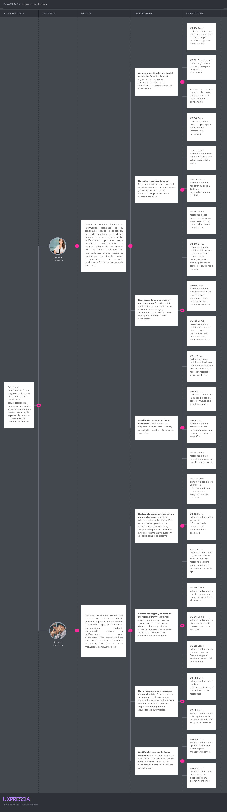

## 3.3. Product Backlog

En esta sección se presenta el Product Backlog de Edifika como una recopilación ordenada de las historias definidas en 3.1. La estimación se realizó mediante story points basados en la escala de Fibonacci, con el fin de tener una planificación clara y una gestión eficiente del desarrollo.

El backlog contiene la totalidad del alcance vigente del proyecto. El orden sigue dos criterios: primero la prioridad MoSCoW (Must Have, Should Have, Could Have) y, dentro de cada prioridad, las dependencias técnicas, de modo que la technical story de configuración base de cada microservicio precede a las user stories que se implementan sobre él.

| Orden | User Story ID | Título | Descripción | Epic ID | Story Points | MoSCoW |
|-------|--------------|--------|-------------|---------|--------------|--------|
| 1 | TS01 | Configuración de autenticación y autorización con JWT | Como desarrollador, quiero implementar autenticación y autorización basada en JWT en el microservicio IAM, para que solo los usuarios autorizados (administradores y residentes) accedan a los endpoints protegidos según su rol. | EP05 | 5 | Must Have |
| 2 | TS02 | Implementación de endpoints de registro e inicio de sesión con validaciones | Como desarrollador, quiero implementar los endpoints de registro e inicio de sesión del microservicio IAM con validaciones estrictas de datos, para garantizar que solo administradores con información válida puedan autorregistrarse. | EP05 | 5 | Must Have |
| 3 | TS03 | Implementación de endpoints de gestión de usuarios | Como desarrollador, quiero implementar los endpoints CRUD de gestión de usuarios y consulta de roles en el microservicio IAM, para que los administradores puedan consultar, actualizar y desactivar usuarios del sistema. | EP05 | 8 | Must Have |
| 4 | TS04 | Configuración del API Gateway como punto de entrada centralizado | Como desarrollador, quiero configurar un API Gateway que centralice todas las solicitudes de la Web Application y la Mobile Application hacia los microservicios de Edifika, para gestionar el enrutamiento, la validación de tokens JWT y las políticas de seguridad en un único punto de acceso. | EP05 | 5 | Must Have |
| 5 | TS05 | Configuración de base de datos independiente por microservicio | Como desarrollador, quiero que cada microservicio de Edifika tenga su propia base de datos, implementada como un schema y una credencial exclusivos dentro de la instancia PostgreSQL, para garantizar el aislamiento de datos y la autonomía de cada dominio. | EP05 | 8 | Must Have |
| 6 | TS15 | Configuración de CORS en el API Gateway | Como desarrollador, quiero configurar las políticas de CORS en el API Gateway para que la Web Application y la Mobile Application se comuniquen con el backend en desarrollo y producción. | EP05 | 3 | Must Have |
| 7 | TS13 | Comunicación entre microservicios mediante REST con manejo de fallos | Como desarrollador, quiero implementar la comunicación síncrona entre microservicios mediante REST con manejo controlado de errores, para los casos en que el servicio que llama necesita la respuesta para continuar. | EP05 | 5 | Must Have |
| 8 | TS06 | Configuración base del microservicio Residential Management | Como desarrollador, quiero crear el microservicio de gestión residencial para administrar edificios, unidades y la vinculación de residentes con sus unidades, de forma independiente del microservicio IAM. | EP05 | 5 | Must Have |
| 9 | US02 | Inicio de sesión | Como usuario, quiero iniciar sesión para acceder a mi información. | EP01 | 2 | Must Have |
| 10 | US04 | Registrar edificio y unidades | Como administrador, quiero configurar la estructura del edificio (torres/unidades). | EP01 | 8 | Must Have |
| 11 | US01 | Registrar residente y vincularlo a su unidad | Como administrador, quiero registrar a un residente y vincularlo a su unidad para que pueda acceder a la aplicación móvil de su edificio. | EP01 | 5 | Must Have |
| 12 | US03 | Actualizar información de usuarios | Como administrador, quiero editar datos de usuarios para corregir errores. | EP01 | 2 | Must Have |
| 13 | US05 | Activar/Desactivar cuentas | Como administrador, quiero controlar quién tiene acceso a la app. | EP01 | 3 | Must Have |
| 14 | TS07 | Configuración base del microservicio Payment con integración Culqi | Como desarrollador, quiero crear el microservicio de pagos para gestionar deudas y pagos del condominio integrándose con Culqi mediante un Saga, garantizando que una deuda nunca se cobre dos veces ni quede en un estado inconsistente. | EP05 | 8 | Must Have |
| 15 | US18 | Ver deuda actual | Como residente, quiero saber cuánto debo pagar de mantenimiento. | EP04 | 3 | Must Have |
| 16 | US24 | Pagar deuda en línea | Como residente, quiero pagar mi deuda con tarjeta de crédito, débito o Yape desde la app. | EP04 | 8 | Must Have |
| 17 | US19 | Registrar pago con comprobante | Como residente, quiero subir la foto de mi voucher para validar un pago realizado fuera de línea. | EP04 | 5 | Must Have |
| 18 | US20 | Registrar pagos en el sistema | Como administrador, quiero registrar manualmente los pagos de los residentes para mantener el sistema actualizado. | EP04 | 3 | Must Have |
| 19 | US21 | Visualizar residentes morosos | Como administrador, quiero ver la lista de deudores. | EP04 | 5 | Must Have |
| 20 | US25 | Resolver pago en verificación | Como administrador, quiero confirmar o rechazar un pago que quedó en verificación para evitar dobles cobros y liberar la deuda cuando corresponda. | EP04 | 3 | Must Have |
| 21 | TS08 | Configuración base del microservicio Reservation | Como desarrollador, quiero crear el microservicio de reservas para gestionar la disponibilidad y el uso de las áreas comunes, garantizando que no existan reservas duplicadas. | EP05 | 5 | Must Have |
| 22 | US12 | Ver disponibilidad de áreas comunes | Como residente o administrador, quiero ver qué áreas están libres. | EP03 | 5 | Must Have |
| 23 | US13 | Reservar área común | Como residente, quiero separar un espacio para uso personal sin cruces de horario. | EP03 | 8 | Must Have |
| 24 | US14 | Aprobar o rechazar reservas | Como administrador, quiero aprobar o rechazar reservas de áreas comunes para mantener el control sobre su uso. | EP03 | 3 | Must Have |
| 25 | US16 | Configurar reglas y estado de área común | Como administrador, quiero definir las reglas, horarios y estado de cada área común para regular su uso correctamente. | EP03 | 8 | Must Have |
| 26 | TS09 | Configuración base del microservicio Communication | Como desarrollador, quiero crear el microservicio de comunicados para que los administradores publiquen avisos oficiales con trazabilidad de lectura. | EP05 | 5 | Must Have |
| 27 | TS10 | Configuración base del microservicio Notification con Firebase | Como desarrollador, quiero crear el microservicio de notificaciones integrado con Firebase Cloud Messaging para enviar alertas push ante eventos relevantes del sistema. | EP05 | 5 | Must Have |
| 28 | US07 | Publicar comunicados oficiales | Como administrador, quiero difundir noticias a la comunidad. | EP02 | 3 | Must Have |
| 29 | US06 | Recibir y consultar comunicados | Como residente, quiero recibir y consultar la información oficial del condominio. | EP02 | 3 | Must Have |
| 30 | US26 | Visualizar hero y navegar en la Landing Page | Como visitante, quiero ver la propuesta de valor de Edifika y navegar entre secciones para entender rápidamente de qué trata el producto. | EP06 | 2 | Must Have |
| 31 | US28 | Acceder a la aplicación desde la Landing Page | Como usuario, quiero acceder a la aplicación que corresponde a mi rol directamente desde la landing page. | EP06 | 1 | Must Have |
| 32 | TS22 | Publicación y consumo de eventos de dominio mediante el broker | Como desarrollador, quiero implementar la mensajería de eventos de dominio mediante el broker AMQP/MQTT con consumo idempotente, para integrar los contextos sin acoplarlos. | EP05 | 5 | Must Have |
| 33 | TS16 | Configuración base del microservicio IoT Access Management | Como desarrollador, quiero crear el microservicio IoT Access Management para gestionar tarjetas RFID, permisos de acceso por área común, restricciones por morosidad y la auditoría de accesos. | EP05 | 5 | Must Have |
| 34 | US29 | Registrar tarjeta RFID de acceso a áreas comunes | Como administrador, quiero asignar una tarjeta RFID a cada residente para controlar el ingreso a las áreas comunes del edificio. | EP07 | 5 | Must Have |
| 35 | US30 | Desactivar acceso a áreas comunes por morosidad | Como sistema, quiero desactivar automáticamente el acceso de un residente moroso a las áreas comunes para asegurar el cumplimiento de pagos, permitiendo que el administrador lo revierta en casos de emergencia. | EP07 | 5 | Must Have |
| 36 | US33 | Otorgar acceso temporal por reserva aprobada | Como residente, quiero que mi reserva aprobada me habilite automáticamente el ingreso al área común solo durante mi horario, para no depender del administrador para entrar. | EP07 | 5 | Must Have |
| 37 | TS23 | Configuración base del Edge Gateway con Python, Flask, Peewee ORM y SQLite | Como desarrollador, quiero crear el servicio Edge Gateway con Python, Flask, Peewee ORM y SQLite con configuración por variables de entorno y endpoint de salud, para tener una base ejecutable en el equipo del edificio. | EP05 | 5 | Must Have |
| 38 | TS24 | Contrato de mensajes MQTT entre el Edge Gateway y los ESP32 | Como desarrollador, quiero definir y validar el contrato de tópicos y mensajes JSON entre el Edge Gateway y los nodos ESP32, para que firmware y servicio evolucionen sin romperse. | EP05 | 5 | Must Have |
| 39 | TS25 | Persistencia local con SQLite y cola de salida | Como desarrollador, quiero almacenar localmente credenciales, reglas, lecturas y eventos pendientes en SQLite, para garantizar la operación offline y la entrega confiable a la nube. | EP05 | 5 | Must Have |
| 40 | TS26 | Firmware base del ESP32 con lectura de sensores y reconexión | Como desarrollador, quiero implementar el firmware base del ESP32 que lea los sensores (RFID, PIR, LDR, ACS712, humedad y flujo), controle los actuadores (cerradura, buzzer, OLED, luminaria y válvula) y mantenga la conexión Wi-Fi y MQTT. | EP05 | 8 | Must Have |
| 41 | TS31 | Contrato de integración entre el Edge Gateway y el backend | Como desarrollador, quiero un contrato de integración entre el Edge Gateway y el backend con entrega por lotes e idempotencia, para transportar la información de los nodos sin pérdidas ni duplicados. | EP05 | 5 | Must Have |
| 42 | TS17 | Comunicación con dispositivos ESP32 a través del Edge Gateway | Como desarrollador, quiero que los microservicios IoT se comuniquen con las placas ESP32 a través del Edge Gateway y el broker MQTT, para recibir lecturas de sensores y enviar comandos de actuación (abrir acceso, encender luces, abrir o cerrar válvulas) de forma confiable. | EP05 | 8 | Must Have |
| 43 | TS21 | Implementación del Edge Gateway con operación sin conexión y sincronización | Como desarrollador, quiero implementar el Edge Gateway que se comunica por MQTT local con los nodos ESP32 y se sincroniza con la nube, para que el condominio siga operando aun sin conexión a internet. | EP05 | 8 | Must Have |
| 44 | US49 | Registrar y autenticar nodos ESP32 | Como administrador, quiero registrar cada ESP32 en el Edge Gateway con sus sensores y actuadores, para que solo los dispositivos autorizados puedan operar. | EP10 | 5 | Must Have |
| 45 | US45 | Leer tarjeta RFID y resolver el acceso | Como residente, quiero acercar mi tarjeta RFID al lector de la puerta para ingresar a un área común sin depender de otra persona. | EP10 | 5 | Must Have |
| 46 | US46 | Abrir la cerradura eléctrica y re-bloquearla automáticamente | Como sistema, quiero energizar la cerradura eléctrica solo el tiempo necesario cuando se concede un acceso, para que la puerta no quede abierta. | EP10 | 5 | Must Have |
| 47 | US48 | Registrar y sincronizar datos generados sin conexión | Como administrador, quiero que los accesos y la telemetría registrados sin internet se sincronicen luego con la nube, para no perder la auditoría ni los datos de consumo. | EP10 | 8 | Must Have |
| 48 | US50 | Sincronizar credenciales, reservas, reglas y blacklist desde la nube | Como sistema, quiero que el Edge Gateway mantenga una copia local de credenciales, reservas vigentes, blacklist y reglas de iluminación y riego, para operar sin depender de internet. | EP10 | 5 | Must Have |
| 49 | US17 | Recordatorios de pago | Como residente, quiero recibir alertas de mis deudas próximas a vencer. | EP04 | 3 | Should Have |
| 50 | US23 | Consultar pagos pasados | Como residente, quiero ver mi historial de transacciones. | EP04 | 2 | Should Have |
| 51 | US15 | Cancelar reserva | Como residente o administrador, quiero cancelar una reserva para liberar el espacio. | EP03 | 3 | Should Have |
| 52 | US11 | Notificaciones de reservas | Como residente o administrador, quiero recibir avisos sobre las reservas de áreas comunes. | EP03 | 3 | Should Have |
| 53 | US08 | Seguimiento de visualización de comunicados | Como administrador, quiero saber quién ha visto los comunicados para asegurar su alcance. | EP02 | 5 | Should Have |
| 54 | TS11 | Configuración base del microservicio Report | Como desarrollador, quiero crear el microservicio de reportes para que los administradores generen y exporten reportes financieros y de consumo del condominio. | EP05 | 8 | Should Have |
| 55 | US22 | Generar y exportar reportes financieros | Como administrador, quiero generar y descargar el reporte de ingresos, deudas pendientes y morosidad del edificio. | EP04 | 8 | Should Have |
| 56 | US27 | Visualizar sección de funcionalidades | Como visitante, quiero ver las funcionalidades principales de Edifika para evaluar si la plataforma se adapta a mis necesidades. | EP06 | 2 | Should Have |
| 57 | TS14 | Documentación de API con Swagger y autenticación JWT | Como desarrollador, quiero integrar Swagger con soporte de autenticación JWT en cada microservicio, para que los endpoints estén documentados y puedan probarse desde una interfaz gráfica. | EP05 | 3 | Should Have |
| 58 | TS27 | Seguridad de la comunicación del Edge Gateway | Como desarrollador, quiero asegurar la comunicación entre los ESP32, el Edge Gateway y la nube, para evitar accesos o comandos no autorizados. | EP05 | 5 | Should Have |
| 59 | TS28 | Estandarización de marcas de tiempo y sincronización de reloj | Como desarrollador, quiero que todos los componentes registren las marcas de tiempo en UTC (ISO 8601), las muestren en America/Lima y mantengan el reloj sincronizado, para que los permisos por horario y los eventos sean confiables. | EP05 | 5 | Should Have |
| 60 | US34 | Consultar bitácora de accesos | Como administrador, quiero consultar la bitácora de intentos de acceso a las áreas comunes para auditar quién ingresó y detectar accesos no autorizados. | EP07 | 3 | Should Have |
| 61 | US47 | Mostrar el resultado del acceso en el punto de acceso | Como residente, quiero ver en la pantalla OLED y escuchar una señal sonora con el resultado de mi acceso, para saber si puedo pasar y por qué. | EP10 | 3 | Should Have |
| 62 | TS18 | Configuración base del microservicio Smart Lighting & Automation | Como desarrollador, quiero crear el microservicio Smart Lighting & Automation para gestionar luminarias, reglas de automatización y comandos de override de forma independiente de los demás microservicios. | EP05 | 5 | Should Have |
| 63 | US37 | Encendido automático de luces por movimiento | Como sistema, quiero encender automáticamente las luces de áreas comunes al detectar movimiento para mejorar la seguridad y el ahorro energético del edificio. | EP08 | 3 | Should Have |
| 64 | US38 | Configurar reglas de automatización de iluminación | Como administrador, quiero configurar reglas de iluminación por área común (presencia, umbral de lux, franja horaria, tiempo de apagado y prioridad) para automatizar el uso eficiente de la energía. | EP08 | 5 | Should Have |
| 65 | US40 | Encender área al iniciar una reserva | Como sistema, quiero encender automáticamente las luces del área reservada al iniciar la reserva, para que el residente encuentre el espacio listo para su uso. | EP08 | 3 | Should Have |
| 66 | TS19 | Configuración base del microservicio IoT Telemetry & Analytics con TimescaleDB | Como desarrollador, quiero crear el microservicio de telemetría con almacenamiento en TimescaleDB para ingerir lecturas de sensores y resolver consultas analíticas con baja latencia. | EP05 | 8 | Should Have |
| 67 | US44 | Monitorear estado de conexión de dispositivos | Como administrador, quiero ver el estado de conexión de todos los dispositivos IoT del edificio, para saber cuáles requieren atención. | EP09 | 5 | Should Have |
| 68 | US41 | Visualizar consumo de energía y agua | Como administrador, quiero visualizar el consumo de energía (kWh) y agua (litros) por área común y periodo, para identificar dónde se puede reducir el gasto. | EP09 | 8 | Should Have |
| 69 | TS20 | Configuración base del microservicio Smart Irrigation | Como desarrollador, quiero crear el microservicio Smart Irrigation para gestionar zonas de riego, programaciones, umbrales de humedad y overrides manuales de forma independiente de los demás microservicios. | EP05 | 5 | Should Have |
| 70 | US31 | Configurar horarios de riego automático | Como administrador, quiero configurar los horarios y la duración del riego de cada zona verde para optimizar el mantenimiento del edificio. | EP07 | 3 | Should Have |
| 71 | US32 | Riego automático según humedad del suelo | Como sistema, quiero activar el riego según la humedad del suelo para evitar el desperdicio de agua en las áreas verdes. | EP07 | 5 | Should Have |
| 72 | TS29 | Despliegue del Edge Gateway con Docker Compose | Como desarrollador, quiero desplegar el Edge Gateway, el broker MQTT y un backend simulado con Docker Compose, para ejecutar y demostrar la solución con un solo comando. | EP05 | 5 | Should Have |
| 73 | TS30 | Simulador de nodos ESP32 para pruebas sin hardware | Como desarrollador, quiero un simulador de nodos ESP32 que respete el contrato MQTT, para probar el Edge Gateway sin depender del hardware físico. | EP05 | 3 | Should Have |
| 74 | TS32 | Pruebas automatizadas del Edge Gateway | Como desarrollador, quiero una suite de pruebas automatizadas del Edge Gateway que no dependa del broker ni de la red, para detectar regresiones antes de cada integración. | EP05 | 5 | Should Have |
| 75 | TS12 | Configuración base del microservicio Messaging / Forum | Como desarrollador, quiero crear el microservicio de foro para que los residentes publiquen mensajes en el foro de su edificio con un límite de una publicación diaria. | EP05 | 5 | Could Have |
| 76 | US09 | Publicar mensaje en la comunidad | Como residente, quiero escribir en el foro de mi edificio. | EP02 | 3 | Could Have |
| 77 | US10 | Moderar publicaciones del foro | Como administrador, quiero ocultar publicaciones inapropiadas del foro para mantener un ambiente respetuoso. | EP02 | 3 | Could Have |
| 78 | US35 | Apertura remota de acceso | Como administrador, quiero abrir remotamente un acceso desde la aplicación web para atender situaciones excepcionales sin desplazarme al lector. | EP07 | 5 | Could Have |
| 79 | US36 | Controlar manualmente el riego | Como administrador, quiero activar o detener manualmente el riego de una zona para atender situaciones que la programación no contempla. | EP07 | 3 | Could Have |
| 80 | US39 | Encender o apagar luces manualmente (override) | Como residente con una reserva vigente o como administrador, quiero encender o apagar manualmente las luces de un área por un tiempo determinado, para cubrir situaciones que la automatización no contempla. | EP08 | 5 | Could Have |
| 81 | US42 | Alertar consumo anómalo | Como administrador, quiero recibir una alerta cuando el consumo de un área se desvíe de su comportamiento habitual, para investigar posibles fallas o usos indebidos. | EP09 | 8 | Could Have |
| 82 | US43 | Detectar falla de dispositivo | Como administrador, quiero ser notificado cuando un dispositivo no funcione pese a haber recibido una orden, para repararlo oportunamente. | EP09 | 5 | Could Have |

**Resumen del Product Backlog**

| MoSCoW | User Stories | Technical Stories | Total de ítems | Story Points |
|---|---|---|---|---|
| Must Have | 27 | 21 | 48 | 244 |
| Should Have | 16 | 10 | 26 | 116 |
| Could Have | 7 | 1 | 8 | 37 |
| **Total** | **50** | **32** | **82** | **397** |

**Análisis de costos y viabilidad económica del despliegue Edge por edificio**

La propuesta IoT de Edifika exige instalar hardware en cada edificio: un Edge Gateway y los nodos ESP32 de acceso, iluminación y riego. Para comprobar que ese despliegue es viable, se estimó la inversión inicial (CAPEX) de un **edificio de referencia de 40 departamentos** con 3 áreas comunes con control de acceso (por ejemplo piscina, gimnasio y salón de usos múltiples), 4 zonas de iluminación inteligente y 1 zona de riego. Los precios corresponden a la tienda peruana Naylamp Mechatronics (consulta de octubre de 2026); los ítems marcados con (*) son estimaciones del equipo.

| Componente | Nodo de acceso (S/) | Nodo de iluminación (S/) | Nodo de riego (S/) |
|---|---|---|---|
| ESP32 DevKit V1 | 35.00 | 35.00 | 35.00 |
| Lector RFID RC522 | 20.00 | — | — |
| Cerradura eléctrica 12 VDC | 35.00 | — | — |
| Sensor magnético de puerta MC-38 | 5.00 | — | — |
| Pantalla OLED 0.96" SSD1306 | 25.00 | — | 25.00 |
| Buzzer activo 5 VDC | 2.00 | — | 2.00 |
| Módulo RTC DS3231 | 16.00 | — | — |
| Sensor PIR HC-SR501 | — | 8.00 | — |
| Módulo sensor LDR | — | 5.00 | — |
| Sensor de corriente ACS712 20 A | — | 15.00 | — |
| Sensor de humedad de suelo capacitivo v1.2 | — | — | 15.00 |
| Válvula solenoide 1/2" 12 VDC (NC) | — | — | 25.00 |
| Módulo relé 1 canal 5 VDC | 5.00 | 5.00 | 5.00 |
| Fuente de alimentación | 25.00 (12 V 2 A) | 15.00 (5 V)* | 25.00 (12 V 2 A) |
| Caja, borneras y cableado* | 30.00 | 30.00 | 35.00 |
| **Costo por nodo** | **198.00** | **113.00** | **167.00** |

| Edge Gateway (uno por edificio) | Costo (S/) |
|---|---|
| Raspberry Pi 4 Model B 4 GB | 520.00 |
| Case para Raspberry Pi 4 | 40.00 |
| Fuente USB-C 5 V 3 A* | 45.00 |
| Tarjeta microSD 32 GB* | 35.00 |
| **Total Edge Gateway** | **640.00** |

| Inversión inicial del edificio de referencia | Cantidad | Subtotal (S/) |
|---|---|---|
| Edge Gateway | 1 | 640.00 |
| Nodos de acceso | 3 | 594.00 |
| Nodos de iluminación | 4 | 452.00 |
| Nodo de riego | 1 | 167.00 |
| Tarjetas RFID Mifare 1K (S/ 3.00 c/u) | 40 | 120.00 |
| Instalación y configuración (2 técnicos, 1 día)* | 1 | 400.00 |
| **CAPEX total** | | **2,373.00 (≈ USD 641)** |

El costo de operación del Edge en el edificio es marginal: el Raspberry Pi consume alrededor de 5 W (≈ 3.6 kWh al mes, menos de S/ 3 mensuales) y utiliza la conexión a internet que el edificio ya tiene. Se reserva además un 10 % anual del CAPEX (≈ S/ 20 al mes) para reponer componentes dañados.

**Recuperación de la inversión.** En las entrevistas, el administrador César indicó que las soluciones de gestión se pagan entre **2 y 5 USD por departamento al mes**. Se supone que el 30 % de ese ingreso cubre la infraestructura cloud compartida, el soporte y la operación, y que el 70 % restante recupera el hardware del edificio (tipo de cambio referencial: S/ 3.70 por USD).

| Tarifa por departamento | Ingreso mensual (40 dptos.) | Margen para el hardware (70 %) | Meses para recuperar el CAPEX | Tamaño mínimo para recuperar en 12 meses |
|---|---|---|---|---|
| USD 2.00 | S/ 296.00 | S/ 207.20 | 11.5 | 39 departamentos |
| USD 3.50 | S/ 518.00 | S/ 362.60 | 6.5 | 22 departamentos |
| USD 5.00 | S/ 740.00 | S/ 518.00 | 4.6 | 15 departamentos |

El tamaño mínimo se calcula con la parte fija del CAPEX (S/ 2,253, que no depende del número de departamentos) más S/ 3 por tarjeta RFID de cada departamento.

**Conclusión de viabilidad.** Incluso con la tarifa mínima mencionada en las entrevistas, el hardware de un edificio de 40 departamentos se recupera en menos de un año, y con una tarifa intermedia basta con edificios de 22 departamentos. El componente más caro es el Edge Gateway (27 % del CAPEX). Un Raspberry Pi 4 de 2 GB (S/ 300) es suficiente para el servicio Flask, SQLite y el broker MQTT local, y reduce el CAPEX a S/ 2,153. Para edificios pequeños se recomienda cobrar una tarifa de instalación única o un plan IoT con permanencia mínima de 12 meses, de modo que la inversión en hardware no dependa solo de la suscripción mensual.

# Capítulo IV: Solution Software Design

## 4.1. Strategic-Level Domain-Driven Design

### 4.1.1. Design-Level EventStorming

En esta sección se documenta el Design-Level EventStorming realizado en Miro, cuyo objetivo fue pasar de la visión general del negocio obtenida en el Big Picture a un modelo detallado del dominio de Edifika. A partir de los eventos identificados, el equipo los organizó en flujos, incorporó los comandos y actores que los provocan, y añadió las políticas, read models y sistemas que intervienen en cada proceso. El resultado sirvió como base para definir los bounded contexts y diseñar la arquitectura de la solución.

#### 4.1.1.1. Candidate Context Discovery

##### Step 1: Unstructured Exploration

El equipo registró, sin un orden establecido, todos los eventos de dominio relevantes que pueden ocurrir en la operación de un condominio: registro de edificios y residentes, inicio de sesión, generación de deudas y pagos, reservas de áreas comunes, comunicados, notificaciones, control de accesos con tarjeta RFID e iluminación automática. Este paso permitió obtener una visión amplia del dominio antes de estructurarlo.


*Figura. Step 1: Unstructured Exploration. Elaborado por el equipo utilizando Miro (Miro, s.f.).*

##### Step 2: Organize your events

Los eventos se ordenaron en líneas de tiempo que representan el flujo cronológico de cada proceso, incluyendo los caminos alternativos y de error.

**Registro y autenticación.** El administrador completa el formulario de registro y, una vez registrado, inicia sesión y es autenticado hasta cerrar su sesión. El residente sigue un flujo similar: es registrado, se le asigna un rol, inicia sesión y es autenticado. En ambos casos el flujo contempla el rechazo de credenciales, y en el caso del residente, su desactivación.

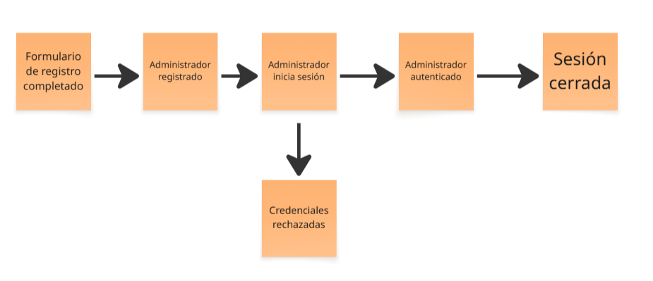

*Figura. Step 2: flujos de registro y autenticación. Elaborado por el equipo utilizando Miro (Miro, s.f.).*

**Gestión residencial, reservas y pagos.** El administrador registra el edificio y sus unidades, y vincula a cada residente con su unidad. Para las reservas, se registra el área común y sus reglas; el residente solicita una reserva, que puede ser aceptada, rechazada o cancelada, y en cada caso se notifica al usuario y al administrador. En pagos, el sistema genera la deuda y envía un recordatorio; cuando el residente registra su pago, la deuda se marca como pagada o el pago es rechazado.

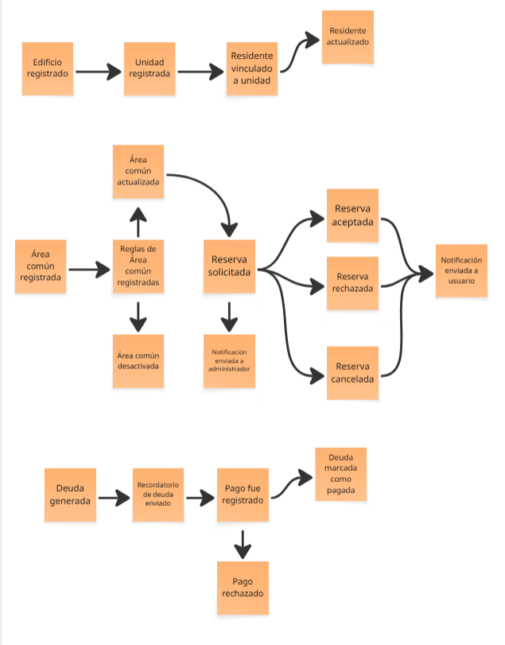

*Figura. Step 2: flujos de gestión residencial, reservas y pagos. Elaborado por el equipo utilizando Miro (Miro, s.f.).*

**IoT: iluminación y control de accesos.** Cuando se detecta movimiento en un área común, las luces se encienden automáticamente y se inicia un temporizador de inactividad; si deja de detectarse movimiento, las luces se apagan. Si falla la conexión del sensor, se envía una notificación de mantenimiento y las luces permanecen en modo seguro; si el administrador activa el interruptor manual, el modo automático se pausa. En el control de accesos, el residente escanea su tarjeta RFID; si es reconocida, el acceso se concede y la puerta se abre. Si la tarjeta no es reconocida, el acceso se rechaza, y si el residente es moroso, el acceso se deniega y se le envía una notificación de deuda.

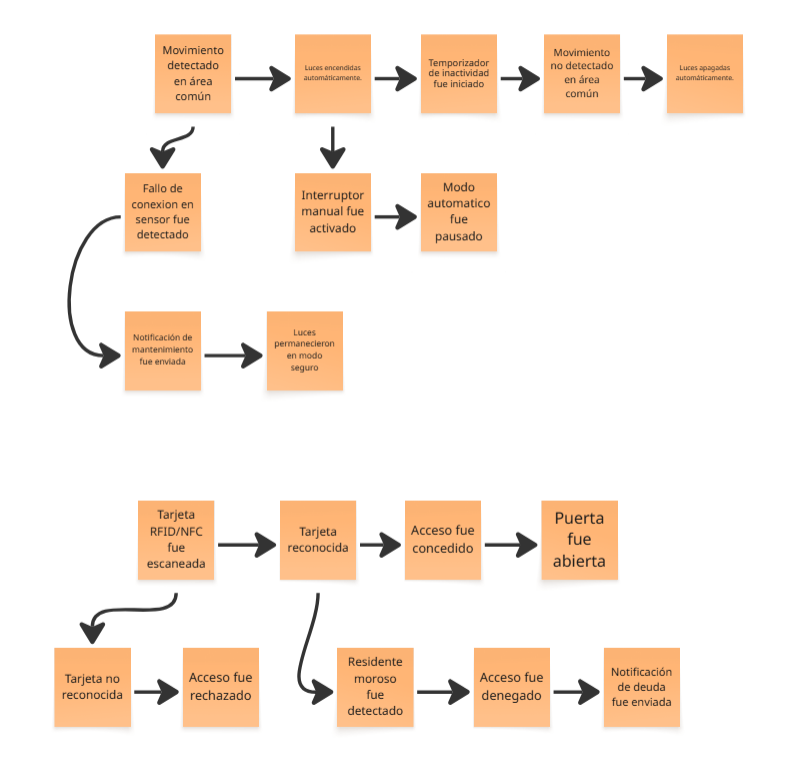

*Figura. Step 2: flujos de iluminación y control de accesos. Elaborado por el equipo utilizando Miro (Miro, s.f.).*

##### Step 3: Add commands and actors

Se incorporaron los comandos (azul), que representan las acciones que provocan los eventos, y los actores (amarillo) que los ejecutan.

**Registro y autenticación.** El administrador ejecuta *Completar formulario de registro*, *Iniciar sesión* y *Cerrar sesión*, y registra a los residentes con *Registrar residente*. El residente o inquilino ejecuta *Iniciar sesión* y *Cerrar sesión*.

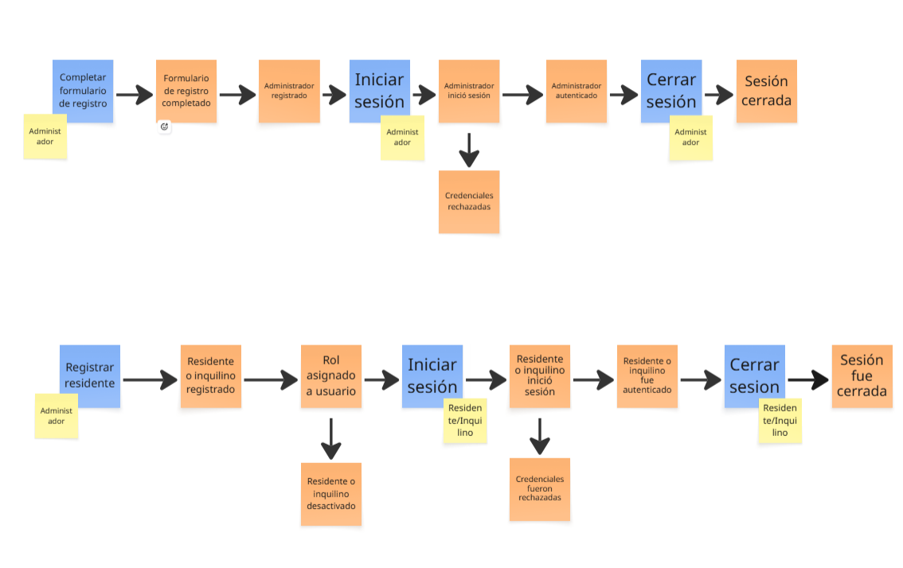

*Figura. Step 3: comandos y actores de registro y autenticación. Elaborado por el equipo utilizando Miro (Miro, s.f.).*

**Gestión residencial, reservas y pagos.** El administrador ejecuta *Registrar edificio y unidades* y *Actualizar residente*. El residente ejecuta *Solicitar reserva* y *Registrar pago*.

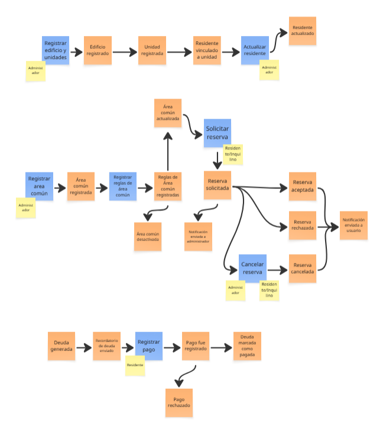

*Figura. Step 3: comandos y actores de gestión residencial, reservas y pagos. Elaborado por el equipo utilizando Miro (Miro, s.f.).*

**IoT: iluminación y control de accesos.** El administrador ejecuta *Activar interruptor manual* para pausar el modo automático, y el sistema ejecuta *Apagar luces* tras el periodo de inactividad. En el control de accesos, el residente ejecuta *Escanear tarjeta*.

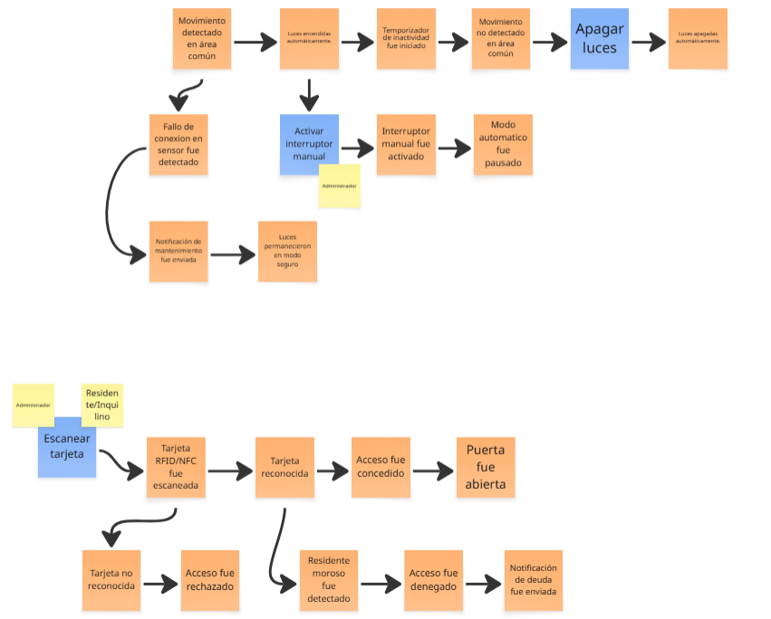

*Figura. Step 3: comandos y actores de iluminación y control de accesos. Elaborado por el equipo utilizando Miro (Miro, s.f.).*

##### Step 4: Add read models, policies and system commands

Se añadieron las políticas (morado), que definen las reglas de negocio que disparan o restringen acciones; los read models (verde), que representan la información que el actor consulta para decidir; y los sistemas (rosado) que ejecutan comandos automáticos.

**Registro y autenticación.** Se definieron dos políticas: el rol de quien completa el registro inicial siempre debe ser administrador, y un residente desactivado no puede iniciar sesión. La autenticación es ejecutada por el sistema.

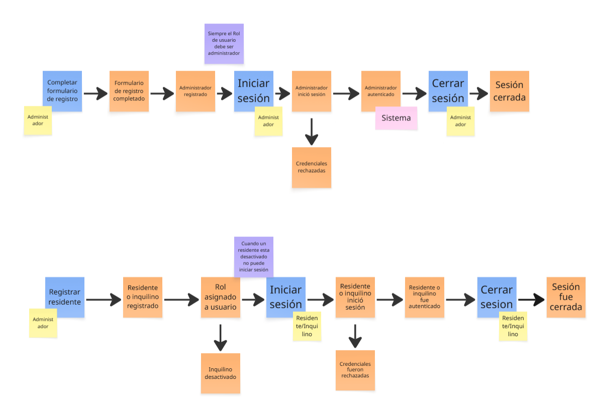

*Figura. Step 4: políticas y sistema de registro y autenticación. Elaborado por el equipo utilizando Miro (Miro, s.f.).*

**Gestión residencial, reservas y pagos.** Se definieron tres read models: *Directorio de unidades y residentes*, que el administrador consulta al registrar edificios y unidades; *Calendario de reservas*, que el residente consulta antes de solicitar una reserva; y *Estado de cuenta del residente*, que resume sus deudas y pagos. La política de pagos establece que el pago solo se registra si el formato del comprobante es válido, y el sistema es quien registra el pago y marca la deuda como pagada.

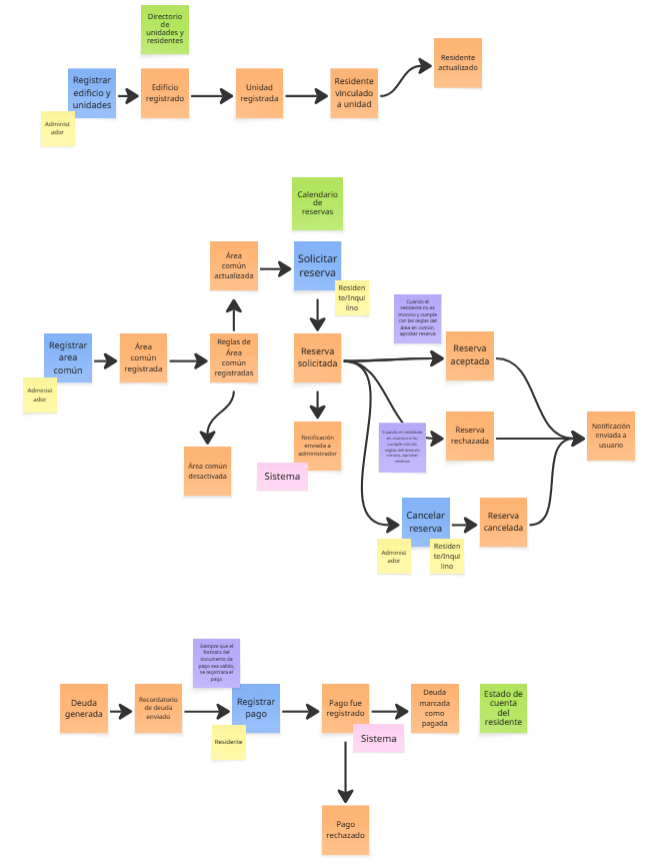

*Figura. Step 4: read models, políticas y sistema de gestión residencial, reservas y pagos. Elaborado por el equipo utilizando Miro (Miro, s.f.).*

**IoT: iluminación y control de accesos.** En iluminación, la política establece que, si no se detecta movimiento durante 3 minutos, se apagan las luces, y el sistema detecta tanto el movimiento como las fallas de conexión del sensor. En control de accesos, la política establece que, si el residente no es moroso, siempre se le otorga el acceso, y el sistema es quien valida la tarjeta RFID escaneada.

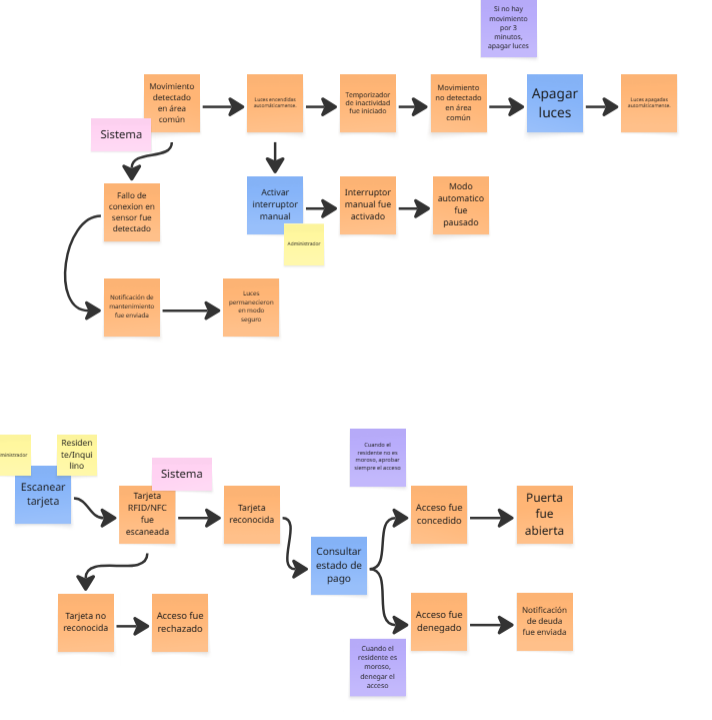

*Figura. Step 4: políticas y sistema de iluminación y control de accesos. Elaborado por el equipo utilizando Miro (Miro, s.f.).*

#### Bounded Contexts

Finalmente, los eventos, comandos y políticas se agruparon en bounded contexts con límites claros, de modo que cada uno tenga una responsabilidad única y pueda evolucionar y desplegarse de forma independiente.

**Bounded Context: IAM.** Registro, autenticación, asignación de roles y cierre de sesión de administradores y residentes.

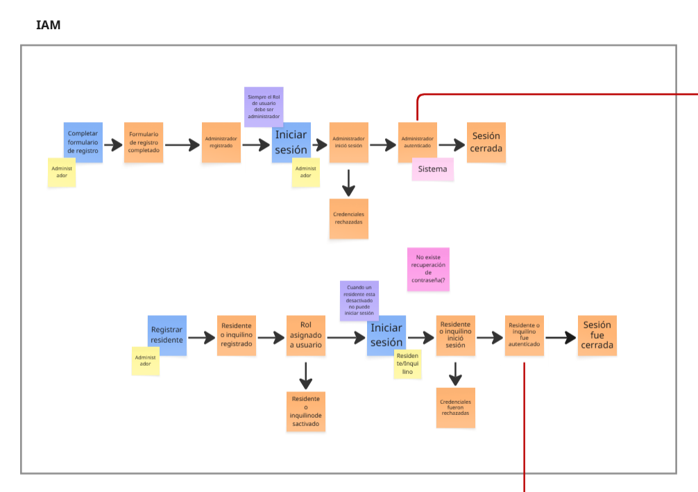

**Bounded Context: Residential Management.** Registro de edificios y unidades, y vinculación y actualización de residentes.

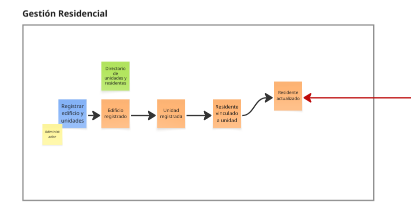

**Bounded Context: Payment.** Generación de deudas, recordatorios, registro y validación de pagos, y detección de morosidad.

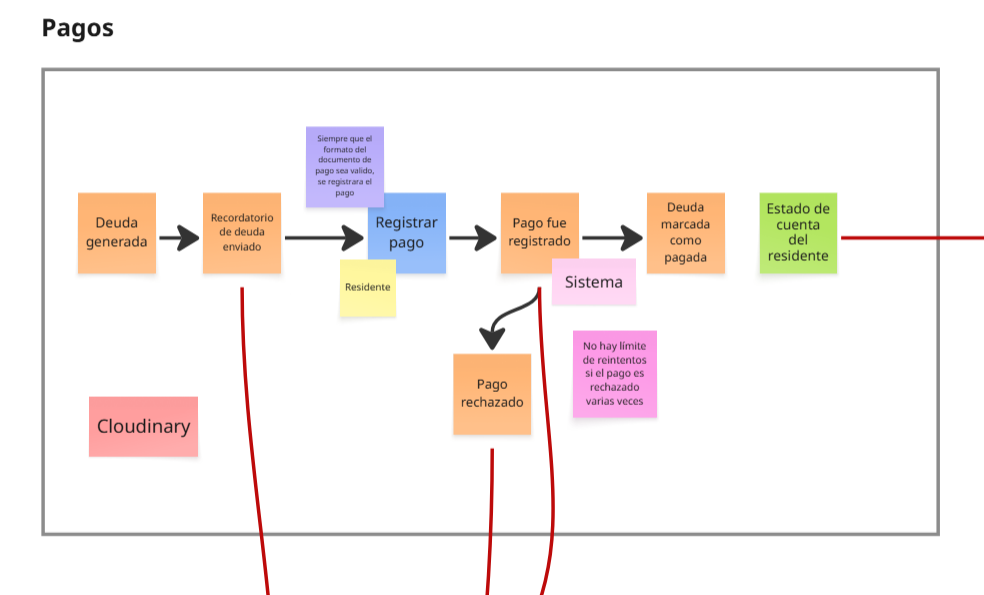

**Bounded Context: Reservation.** Registro de áreas comunes y sus reglas, y solicitud, aceptación, rechazo y cancelación de reservas.

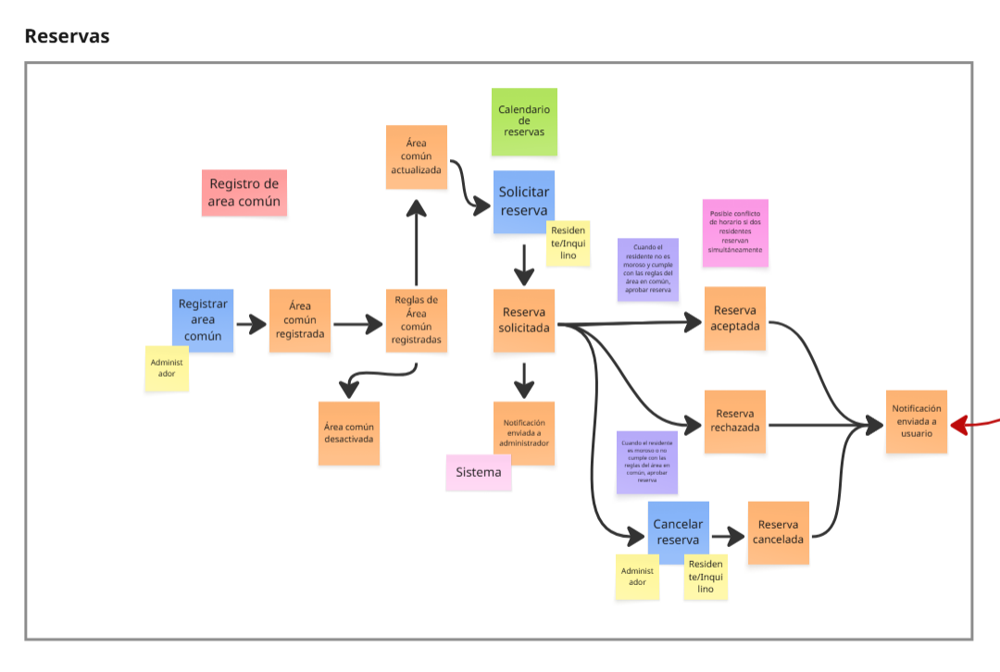

**Bounded Context: Communication.** Publicación de comunicados oficiales de la administración.

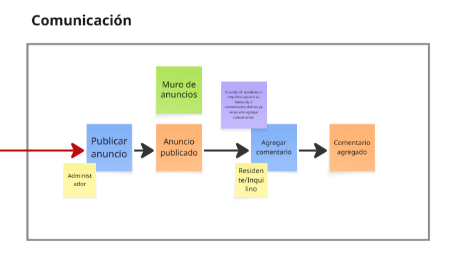

**Bounded Context: Messaging / Forum.** Publicaciones y comentarios de los residentes en el foro del edificio.

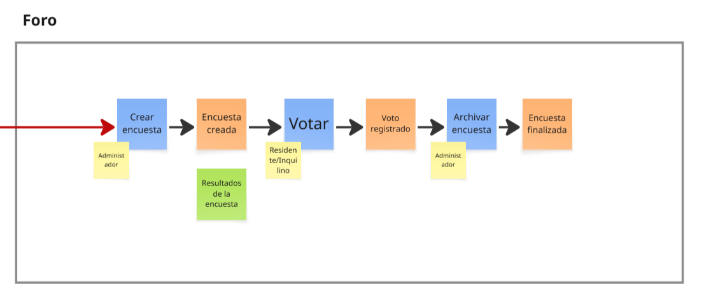

**Bounded Context: Notification.** Creación, envío, lectura y fallo de notificaciones a residentes y administradores.

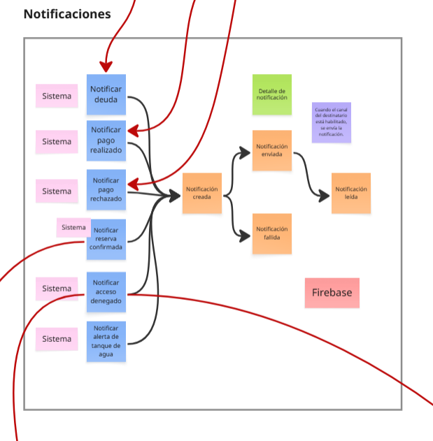

**Bounded Context: Report.** Generación y exportación de reportes financieros y de consumo.

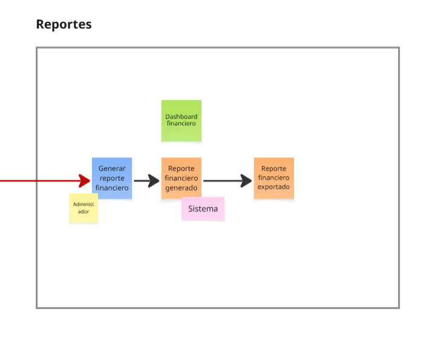

**Bounded Context: Smart Building.** Agrupa las capacidades IoT del edificio: escaneo y validación de tarjetas RFID con concesión o denegación de acceso, encendido y apagado automático de luces por presencia con temporizador de inactividad, modo seguro e interruptor manual, riego automático según horarios y humedad del suelo, e ingesta de las lecturas de los dispositivos para calcular consumo y detectar anomalías y fallas.

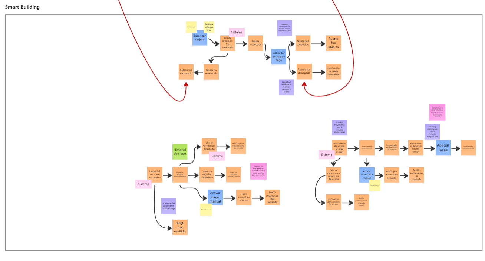

En la etapa de arquitectura, Smart Building se refina en cuatro bounded contexts: IoT Access Management, Smart Lighting & Automation, Smart Irrigation e IoT Telemetry & Analytics porque cada capacidad tiene reglas, lenguaje y perfil de carga distintos.

#### 4.1.1.2. Domain Message Flows Modeling

En esta sección se presenta el Domain Message Flows Modeling, técnica que modela cómo los bounded contexts colaboran entre sí para resolver un escenario del negocio, mostrando los mensajes que intercambian. Se apoya en la notación de Domain Storytelling: los actores y bounded contexts se conectan mediante mensajes numerados que indican el orden del flujo. Cada mensaje se clasifica según su tipo: los commands solicitan una acción que cambia el estado de un contexto, los events  informan algo que ya ocurrió y pueden ser consumidos por otros contextos, y las queries  solo leen información sin modificarla. Estos flujos permiten validar las relaciones definidas en el Context Mapping y confirmar qué integraciones son síncronas y cuáles se resuelven por eventos.

**Autenticación de administrador** (Command: `RegisterAdministrator` / `SignIn` → Event: `SessionStarted`)

Este escenario describe cómo un administrador obtiene acceso a la plataforma. El administrador completa el formulario de registro en la Web Application, que envía la solicitud a través del API Gateway hasta IAM/Auth. IAM/Auth registra al usuario con el rol ADMIN y emite el evento de administrador registrado. Luego, el administrador inicia sesión: IAM/Auth valida sus credenciales, genera el token JWT y emite el evento de sesión iniciada, con el que queda habilitado para operar desde la web.

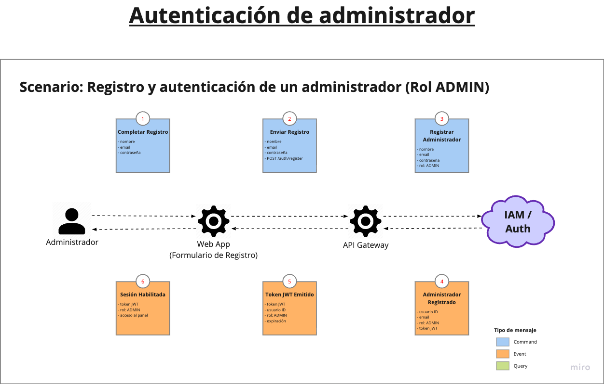

*Figura. Domain Story — el Administrador completa el formulario, que atraviesa el API Gateway hasta IAM/Auth, quien crea el Usuario con rol ADMIN y emite el Token JWT que habilita la sesión.*

**Autenticación de residente** (Command: `LinkResidentToUnit` / `SignIn` → Event: `SessionStarted`)

Este escenario muestra que el residente no puede registrarse por sí mismo. Primero, el administrador registra al residente y lo vincula a su unidad en Residential Management, que emite el evento de residente vinculado. IAM/Auth consume ese evento y crea el usuario con el rol RESIDENT. Recién entonces el residente puede iniciar sesión desde la Mobile Application: la solicitud pasa por el API Gateway, IAM/Auth valida las credenciales, emite el token JWT y registra la sesión iniciada.

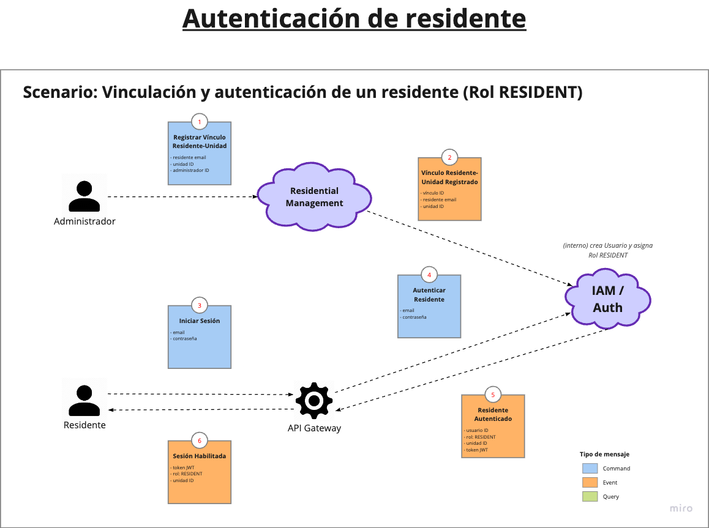

*Figura. Domain Story — a diferencia del administrador, el residente no se autorregistra: el Administrador registra el vínculo residente–unidad en Residential Management, que lo provee a IAM/Auth; recién entonces el Residente puede autenticarse.*

**Publicación de comunicados** (Command: `PublishAnnouncement` → Event: `AnnouncementPublished` → Policy: notificar residentes)

Este escenario describe cómo un comunicado oficial llega a los residentes. El administrador publica el comunicado en Communication, que lo registra y emite el evento de comunicado publicado. Notification consume ese evento y, siguiendo la política de notificar a los residentes del edificio, crea la notificación y la envía como push al residente. Si el envío falla, Notification registra el fallo y deja la notificación pendiente de reintento, sin afectar la publicación del comunicado.

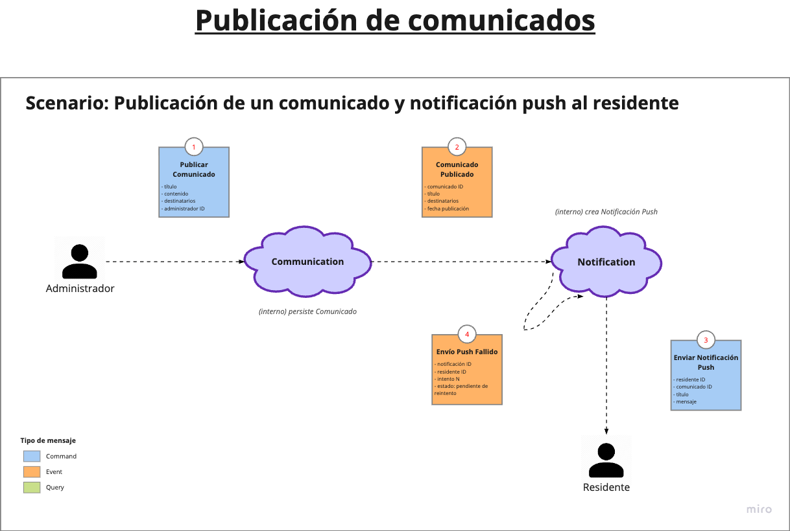

*Figura. Domain Story — el Administrador publica el Comunicado en Communication, que dispara a Notification la creación y entrega de la Notificación Push al Residente; si el envío falla, queda pendiente de reintento.*

**Registro y aprobación de pagos** (Command: `RegisterPayment` → Event: `PaymentConfirmed` / `PaymentRejected`)

Este escenario describe el pago en línea de una deuda. El residente registra el pago en Payment, que toma el monto de la deuda y envía el cargo a Culqi. Culqi responde con el resultado de la transacción. Si la confirma, Payment marca el pago como confirmado, la deuda como pagada, emite la constancia y publica el evento de pago confirmado. Si Culqi la rechaza, Payment marca el pago como rechazado con el motivo, la deuda permanece pendiente y el residente puede reintentar. En ambos casos, Notification consume el evento y avisa al residente del resultado.

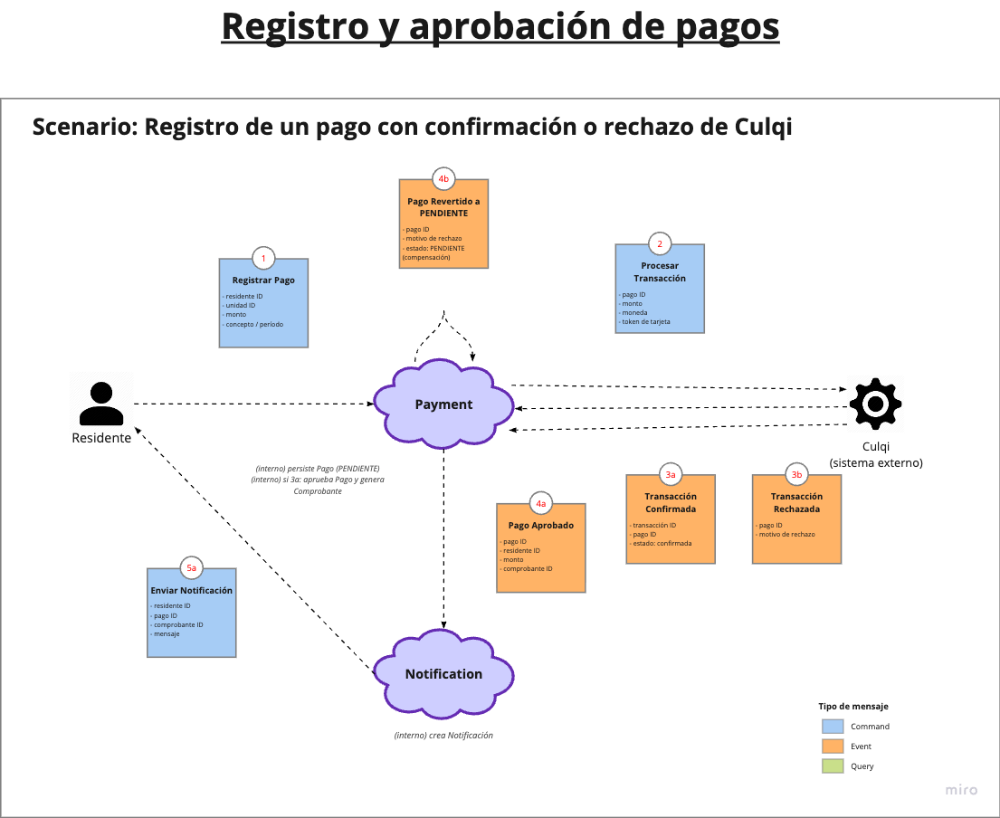

*Figura. Domain Story — el Residente registra el Pago en Payment, que lo envía a Culqi; si la transacción se confirma, Payment confirma el Pago, emite la Constancia y publica `PaymentConfirmed` para que Notification avise al Residente; si Culqi la rechaza, el Pago queda rechazado y la Deuda sigue pendiente como compensación.*

**Reserva y aprobación de áreas comunes** (Command: `CreateReservation` / `ApproveReservation` → Event: `ReservationApproved`)

Este escenario describe cómo un residente obtiene acceso a un área común. El residente solicita la reserva en Reservation, que la registra como solicitada. El administrador revisa la solicitud y la aprueba, y Reservation emite el evento de reserva aprobada. A partir de ese evento ocurren dos acciones en paralelo: IoT Access Management habilita el permiso de acceso de la tarjeta RFID del residente para el horario reservado, y Notification le envía la confirmación de la reserva.

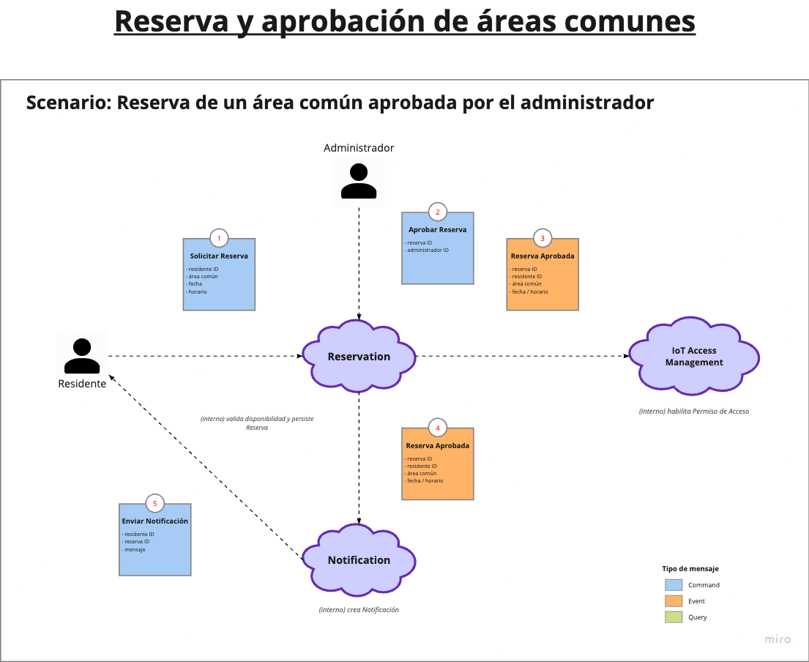

*Figura. Domain Story — el Residente solicita la Reserva, el Administrador la aprueba, y Reservation dispara en paralelo la habilitación del Permiso de Acceso (IoT Access Management) y la notificación al Residente.*

**Generación de reportes financieros** (Query: `GetFinancialReport` — solo lectura, sin Command ni Event)

Este escenario describe la obtención de un reporte financiero del edificio. El administrador solicita el reporte a Report, que consulta a Payment los pagos y deudas del periodo. Report consolida la información, genera el reporte y lo devuelve al administrador para su exportación. Como el escenario solo lee información, no modifica el estado de ningún contexto ni requiere políticas ni compensaciones.

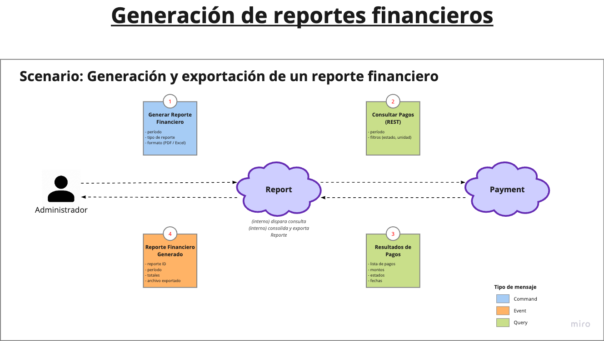

*Figura. Domain Story — el Administrador solicita el Reporte Financiero, Report consulta a Payment vía REST, consolida y exporta el reporte de vuelta al Administrador; al ser de solo lectura, no hay Policy ni compensación involucradas.*

#### 4.1.1.3. Bounded Context Canvases

El Bounded Context Canvas es un recurso gráfico dentro del enfoque Domain-Driven Design (DDD) que facilita la definición, comprensión y comunicación precisa de los límites, funciones y componentes esenciales de un Bounded Context. Su uso permite al equipo mantener una visión común del dominio, reconociendo entidades, eventos, comandos y conexiones con otros contextos. Asimismo, gracias a las convenciones que establece, posibilita construir un diseño modular y coherente del sistema.

Los canvas se elaboraron en orden de importancia: primero los contextos de los que depende toda la plataforma (IAM, Residential Management, Payment y Reservation), luego los contextos IoT que sostienen la propuesta de diferenciación (IoT Access Management, Smart Lighting & Automation, Smart Irrigation e IoT Telemetry & Analytics) y por último los contextos de soporte (Communication, Messaging / Forum, Notification y Report). Al final se documenta el Edge API, que no es un bounded context de dominio, pero conecta los dispositivos con los contextos IoT.

### Bounded Context – IAM (Identity & Access Management)

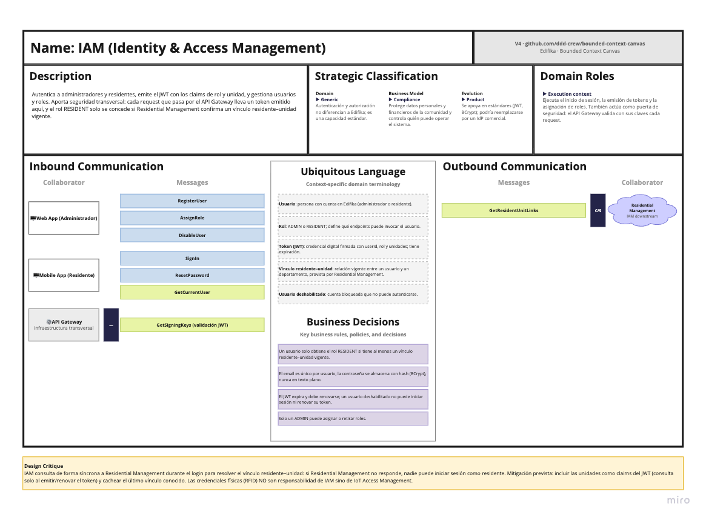

*Figura. Bounded Context Canvas de IAM. Elaborado por el equipo utilizando Miro (Miro, s.f.).*

**Description**
En este bounded context se gestionan el registro de administradores, la creación de usuarios residentes a partir de su vínculo con una unidad, la asignación de roles, el inicio y cierre de sesión, y la emisión del token JWT con el que se accede a los demás contextos.

**Strategic Classification**
- **Generic:** la autenticación y autorización son capacidades comunes a cualquier plataforma; no diferencian a Edifika, pero son la base de acceso a todos los demás contextos.
- **Compliance Enforcer:** su modelo de negocio garantiza que cada usuario acceda solo a las funciones que su rol le permite.
- **Commodity:** se basa en un patrón conocido (usuarios, roles y JWT).

**Domain Role**
Asume el rol de **gateway context**, porque controla la entrada al ecosistema, y de **execution context**, porque valida credenciales y emite tokens.

**Inbound Communication**
- El administrador completa su registro e inicia o cierra sesión desde la Web Application.
- El residente inicia o cierra sesión desde la Mobile Application.
- Residential Management informa el vínculo residente–unidad para que IAM cree el usuario con rol RESIDENT.

**Outbound Communication**
- El token JWT emitido habilita el acceso a todos los bounded contexts a través del API Gateway.
- Un usuario desactivado deja de poder iniciar sesión.

**Capability Analysis**
- **Registro de administrador:** crea el usuario con rol ADMIN.
- **Creación de usuario residente:** crea el usuario con rol RESIDENT solo después de que el administrador lo vincula a una unidad.
- **Autenticación:** valida credenciales y emite el token JWT.
- **Gestión de roles:** asegura que cada operación la ejecute el rol correcto.

### Bounded Context – Residential Management

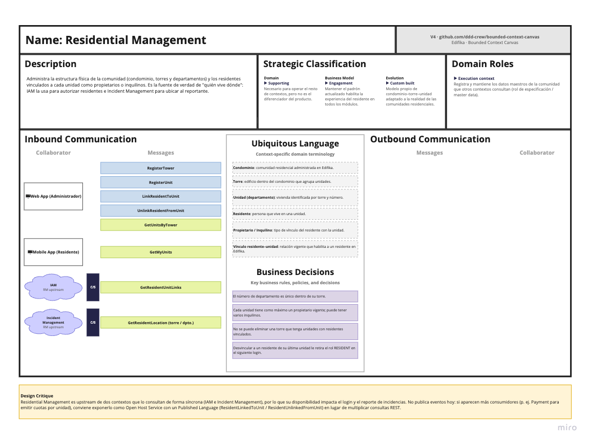

*Figura. Bounded Context Canvas de Residential Management. Elaborado por el equipo utilizando Miro (Miro, s.f.).*

**Description**
En este bounded context se registran los edificios y sus unidades, y se vincula a cada residente, propietario o inquilino, con la unidad que ocupa. Es la fuente de verdad de la estructura física y de la población del condominio.

**Strategic Classification**
- **Supporting:** no es el diferenciador del producto, pero todos los procesos del condominio dependen de él.
- **Engagement Creator:** permite que cada residente quede asociado a su edificio y acceda a los servicios que le corresponden.
- **Product:** la gestión de edificios, unidades y residentes es un patrón conocido en administración de condominios.

**Domain Role**
Asume el rol de **specification context**, porque define qué edificios, unidades y residentes existen y cómo se relacionan, y otros contextos dependen de esa definición.

**Inbound Communication**
- El administrador registra edificios y unidades, vincula residentes a unidades y actualiza sus datos desde la Web Application.

**Outbound Communication**
- Un residente vinculado a una unidad habilita su usuario en IAM.
- Los eventos de residente vinculado o retirado permiten a IoT Access Management habilitar o revocar su tarjeta RFID.
- Payment consulta la existencia de la unidad antes de generar una deuda.

**Capability Analysis**
- **Registro de edificios y unidades:** define la estructura física del condominio.
- **Vinculación residente–unidad:** asocia a cada residente con su departamento.
- **Directorio de unidades y residentes:** permite al administrador consultar la población del edificio.

### Bounded Context – Payment

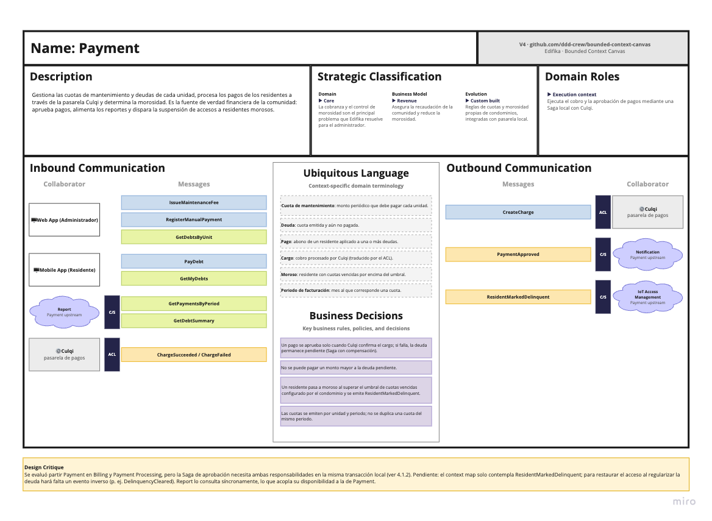

*Figura. Bounded Context Canvas de Payment. Elaborado por el equipo utilizando Miro (Miro, s.f.).*

**Description**
En este bounded context se generan las deudas de mantenimiento de cada unidad, se procesan los pagos en línea a través de Culqi, se emiten las constancias de pago y se determina la morosidad de los residentes.

**Strategic Classification**
- **Core:** el cobro de cuotas y el control de la morosidad son el motivo principal por el que un administrador contrata Edifika.
- **Revenue Generator:** su modelo de negocio asegura la recaudación del condominio y habilita pagos con tarjeta y Yape.
- **Custom Built:** la combinación de deudas, cobro con Culqi, idempotencia y restricción de acceso por morosidad es propia del negocio.

**Domain Role**
Asume el rol de **execution context**, porque ejecuta el cobro y cambia el estado de deudas y pagos.

**Inbound Communication**
- El administrador genera las deudas desde la Web Application.
- El residente consulta su estado de cuenta y registra el pago desde la Mobile Application.
- Report consulta los pagos y deudas para consolidar los reportes financieros.

**Outbound Communication**
- Payment envía el cargo a Culqi a través de un Anticorruption Layer.
- `PaymentConfirmed` y `PaymentRejected` permiten a Notification informar al residente el resultado.
- `ResidentMarkedDelinquent` permite a IoT Access Management restringir el acceso del residente moroso.
- Payment consulta a Residential Management la existencia de la unidad antes de generar una deuda.

**Capability Analysis**
- **Generación de deudas:** registra el monto y la fecha de vencimiento de cada periodo.
- **Pago en línea:** cobra el monto de la deuda a través de Culqi, evitando cobros duplicados con una clave de idempotencia.
- **Compensación:** si Culqi rechaza el cargo, la deuda sigue pendiente; si no responde a tiempo, el pago queda en verificación hasta que el administrador lo resuelva.
- **Morosidad:** detecta deudas vencidas y marca al residente como moroso.

### Bounded Context – Reservation

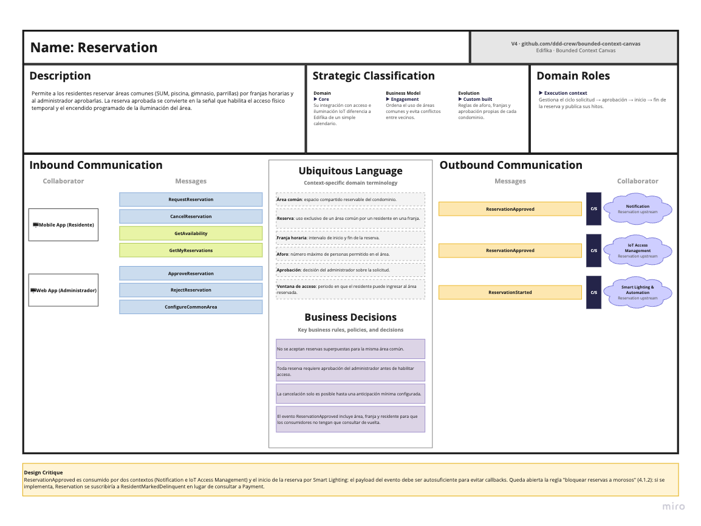

*Figura. Bounded Context Canvas de Reservation. Elaborado por el equipo utilizando Miro (Miro, s.f.).*

**Description**
En este bounded context se registran las áreas comunes y sus reglas de uso, y se gestiona el ciclo de vida de las reservas: solicitud, aprobación, rechazo, cancelación e inicio.

**Strategic Classification**
- **Supporting:** organiza el uso de los espacios compartidos y alimenta a los contextos IoT.
- **Engagement Creator:** mejora la convivencia al ordenar el uso de las áreas comunes.
- **Product:** la reserva de espacios por horario es un patrón conocido.

**Domain Role**
Asume el rol de **execution context**, porque aplica las reglas de aforo y horario, y de **upstream** de los contextos IoT, porque sus eventos habilitan accesos y encienden luces.

**Inbound Communication**
- El residente consulta el calendario de reservas y solicita o cancela una reserva desde la Mobile Application.
- El administrador registra áreas comunes y sus reglas, y aprueba o rechaza reservas desde la Web Application.

**Outbound Communication**
- `ReservationApproved` y `ReservationCancelled` permiten a IoT Access Management habilitar o retirar el permiso de acceso al área.
- `ReservationStarted` permite a Smart Lighting & Automation encender las luces del área reservada.
- Los eventos de reserva permiten a Notification informar al residente y al administrador.

**Capability Analysis**
- **Gestión de áreas comunes:** registra espacios, aforo y tipo de reserva.
- **Ciclo de vida de la reserva:** controla la solicitud, aprobación, rechazo y cancelación.
- **Calendario de reservas:** muestra la disponibilidad en tiempo real.

### Bounded Context – IoT Access Management

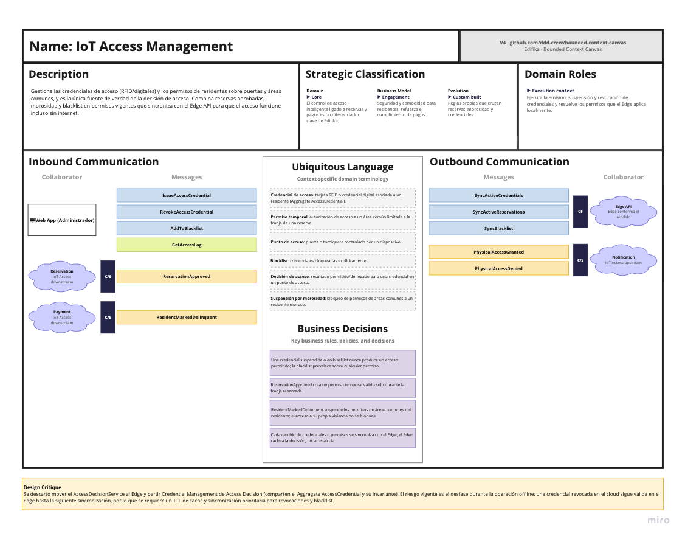

*Figura. Bounded Context Canvas de IoT Access Management. Elaborado por el equipo utilizando Miro (Miro, s.f.).*

**Description**
En este bounded context se decide y audita quién puede abrir físicamente la puerta de un área común, combinando la tarjeta RFID del residente, sus reservas vigentes y su estado de morosidad.

**Strategic Classification**
- **Core:** el control de accesos con RFID es un pilar de la propuesta de diferenciación IoT.
- **Compliance Enforcer:** asegura que solo los residentes habilitados y al día ingresen a las áreas comunes.
- **Custom Built:** la combinación de RFID, reservas y morosidad no es un producto de catálogo.

**Domain Role**
Asume el rol de **execution context**, porque toma la decisión de acceso, y de **analysis context**, porque registra la auditoría de cada intento.

**Inbound Communication**
- El administrador emite, asigna o revoca tarjetas RFID desde la Web Application.
- Residential Management informa los residentes vinculados o retirados de una unidad.
- Reservation informa las reservas aprobadas y canceladas.
- Payment informa los residentes marcados como morosos.

**Outbound Communication**
- Sincroniza con el Edge API las credenciales activas, las ventanas de reserva y la blacklist.
- `PhysicalAccessGranted` y `PhysicalAccessDenied` permiten a Notification y Report registrar e informar los accesos.

**Capability Analysis**
- **Gestión de credenciales RFID:** emite, activa y revoca tarjetas.
- **Decisión de acceso:** concede el acceso solo si la credencial está activa, el residente no es moroso y existe un permiso vigente para esa área.
- **Auditoría de accesos:** registra cada intento concedido o denegado.

### Bounded Context – Smart Lighting & Automation

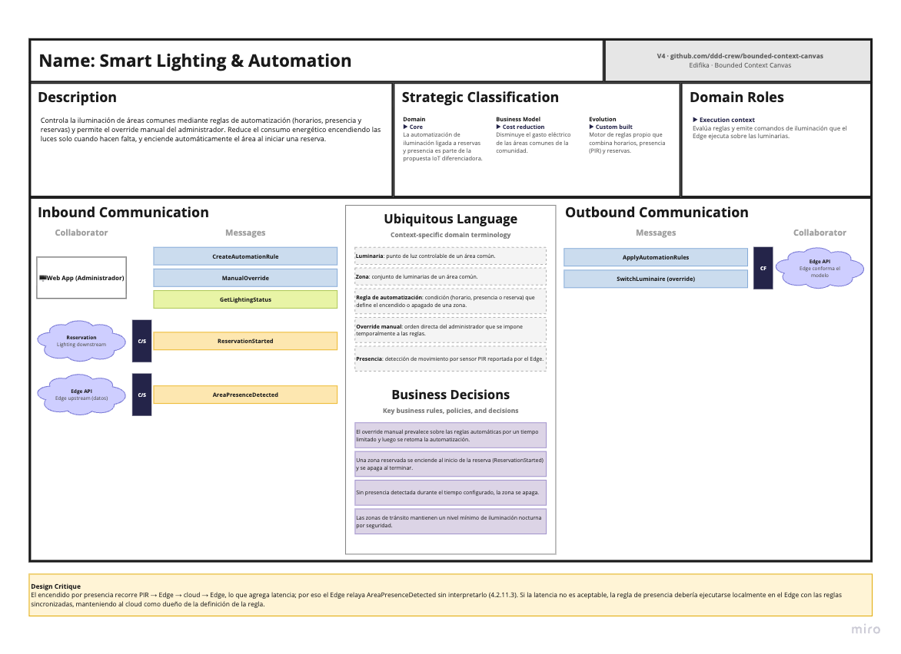

*Figura. Bounded Context Canvas de Smart Lighting & Automation. Elaborado por el equipo utilizando Miro (Miro, s.f.).*

**Description**
En este bounded context se controla el encendido y apagado de las luminarias de las áreas comunes combinando presencia, luz ambiental, horarios de reserva y override manual, priorizando el ahorro energético.

**Strategic Classification**
- **Core:** la iluminación automática es parte de la diferenciación IoT.
- **Cost Reducer:** su modelo de negocio reduce el consumo de energía de las áreas comunes.
- **Custom Built:** la precedencia entre presencia, lux, reserva y override es una regla propia del negocio.

**Domain Role**
Asume el rol de **execution context**, porque decide cuándo encender o apagar cada luminaria.

**Inbound Communication**
- El administrador configura reglas de automatización y activa el override manual desde la Web Application.
- Reservation informa el inicio de una reserva.
- IoT Telemetry & Analytics informa la presencia detectada en un área.

**Outbound Communication**
- Envía al Edge API las reglas de automatización y los comandos de override para su ejecución local.
- Publica los eventos de luminaria encendida, apagada y override activado.

**Capability Analysis**
- **Encendido por presencia:** enciende las luces al detectar movimiento si el nivel de lux es bajo.
- **Apagado por inactividad:** apaga las luces tras 3 minutos sin movimiento.
- **Override manual:** suspende temporalmente la automatización.
- **Modo seguro:** mantiene las luces encendidas si falla el sensor.

### Bounded Context – Smart Irrigation

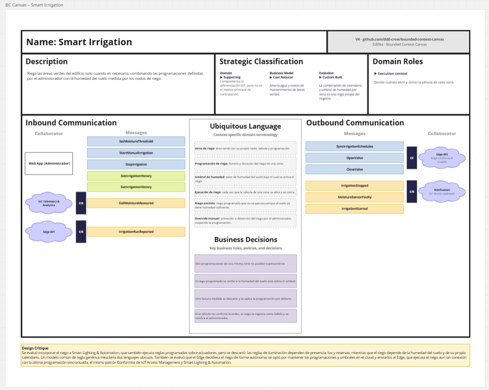

*Figura. Bounded Context Canvas de Smart Irrigation. Elaborado por el equipo utilizando Miro (Miro, s.f.).*

**Description**
En este bounded context se riegan las áreas verdes del edificio solo cuando es necesario, combinando las programaciones definidas por el administrador con la humedad del suelo medida por los nodos de riego.

**Strategic Classification**
- **Supporting:** complementa la diferenciación IoT, pero no es el motivo principal de contratación.
- **Cost Reducer:** su modelo de negocio ahorra agua y costos de mantenimiento de áreas verdes.
- **Custom Built:** la combinación de calendario y umbral de humedad por zona es una regla propia del negocio.

**Domain Role**
Asume el rol de **execution context**, porque decide cuándo abrir y cerrar la válvula de cada zona.

**Inbound Communication**
- El administrador define zonas, programaciones, umbrales de humedad y override manual desde la Web Application.
- IoT Telemetry & Analytics informa la humedad del suelo medida.
- El Edge API confirma la apertura y el cierre de la válvula.

**Outbound Communication**
- Envía al Edge API las programaciones, los umbrales y los comandos de apertura y cierre de la válvula.
- Los eventos de riego fallido o sensor con falla permiten a Notification alertar al administrador.

**Capability Analysis**
- **Programación de riego:** define horarios por zona sin superposición.
- **Riego por humedad:** omite el riego si la humedad del suelo supera el umbral.
- **Override manual:** permite al administrador activar o detener el riego.
- **Detección de fallas:** registra el riego como fallido si la válvula no confirma la orden.

### Bounded Context – IoT Telemetry & Analytics

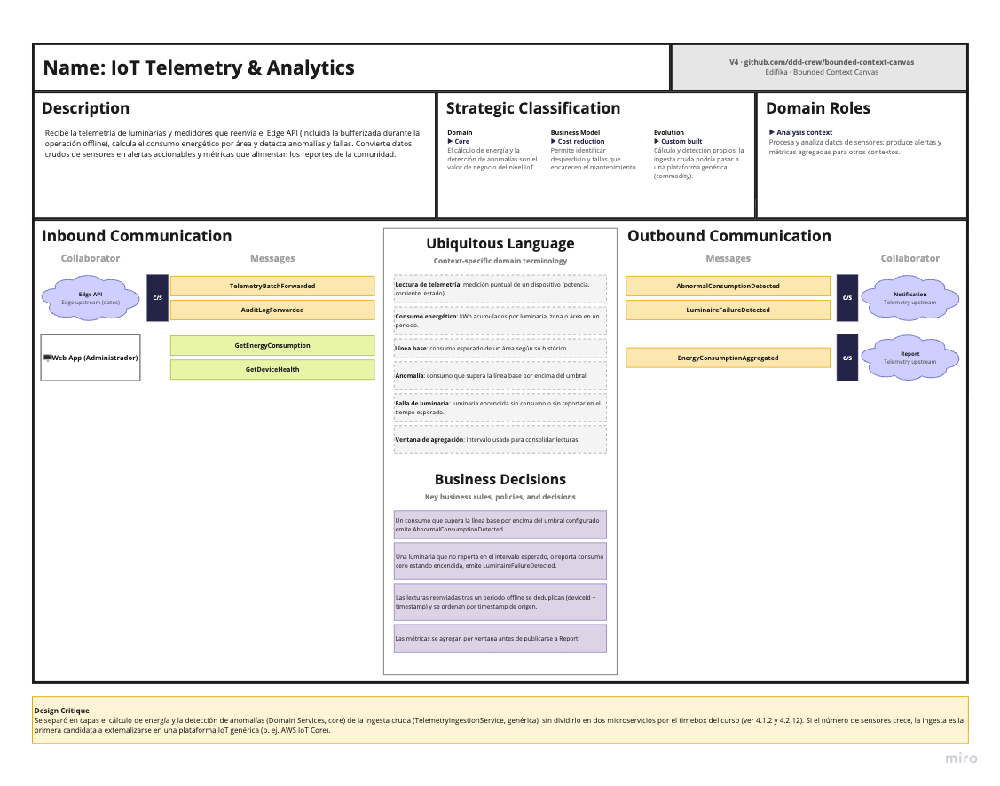

*Figura. Bounded Context Canvas de IoT Telemetry & Analytics. Elaborado por el equipo utilizando Miro (Miro, s.f.).*

**Description**
En este bounded context se ingieren las lecturas y logs de todos los dispositivos IoT, se calcula el consumo de energía y agua de las áreas comunes y se detectan anomalías y fallas de dispositivos.

**Strategic Classification**
- **Core:** es el único contexto que produce analítica cuantitativa del edificio.
- **Decision Support:** su modelo de negocio entrega al administrador datos para reducir costos y anticipar fallas.
- **Custom Built:** el cálculo de consumo y la detección de anomalías se diseñaron a medida para este dominio.

**Domain Role**
Asume el rol de **analysis context**, porque transforma lecturas crudas en métricas y alertas.

**Inbound Communication**
- El Edge API reenvía la telemetría y los logs acumulados de los nodos de acceso, iluminación y riego.
- El administrador consulta el dashboard de consumo y el estado de los dispositivos desde la Web Application.

**Outbound Communication**
- Informa a Smart Lighting & Automation la presencia detectada.
- Informa a Smart Irrigation la humedad del suelo medida.
- `AbnormalConsumptionDetected` y `DeviceFailureDetected` permiten a Notification alertar al administrador.
- Aporta a Report las métricas de consumo de energía y agua.

**Capability Analysis**
- **Ingesta de telemetría:** almacena lecturas de alta frecuencia en TimescaleDB.
- **Cálculo de consumo:** obtiene los kWh por integración de la potencia en el tiempo.
- **Detección de anomalías:** compara el consumo contra una línea base.
- **Detección de fallas:** identifica dispositivos desconectados o con lecturas inválidas.

### Bounded Context – Communication

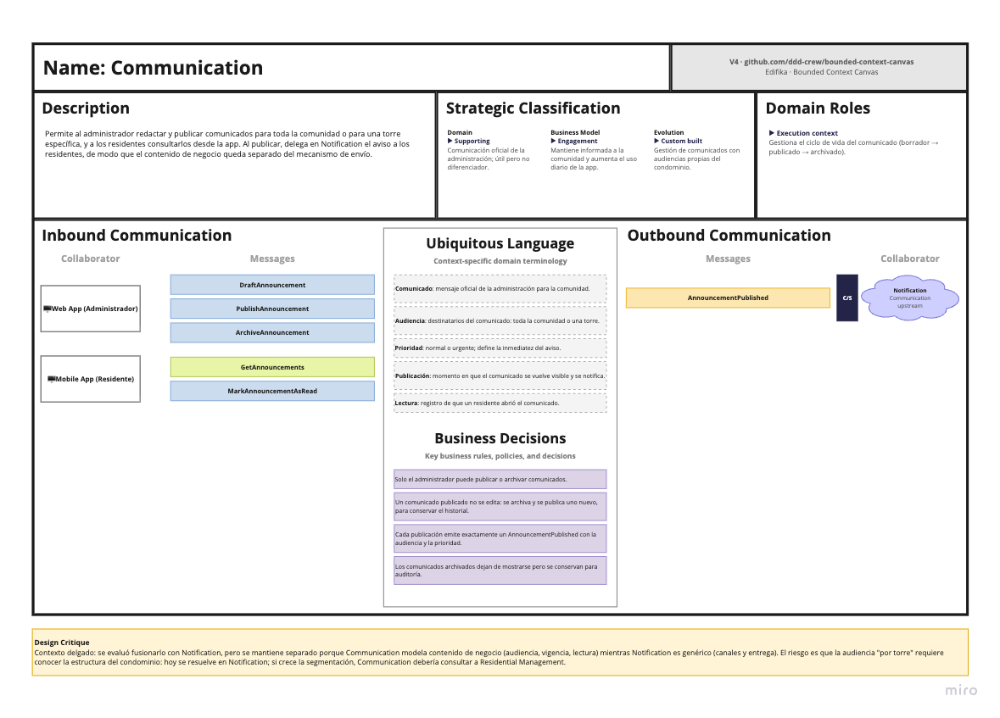

*Figura. Bounded Context Canvas de Communication. Elaborado por el equipo utilizando Miro (Miro, s.f.).*

**Description**
En este bounded context el administrador redacta y publica comunicados oficiales dirigidos a los residentes del edificio, y se registra su estado de lectura.

**Strategic Classification**
- **Supporting:** facilita la comunicación oficial, pero no es el diferenciador del producto.
- **Engagement Creator:** mantiene informados a los residentes sobre novedades y disposiciones.
- **Product:** la publicación de anuncios es un patrón conocido.

**Domain Role**
Asume el rol de **execution context**, porque publica el comunicado y registra su lectura.

**Inbound Communication**
- El administrador redacta y publica comunicados desde la Web Application.
- El residente lee los comunicados desde la Mobile Application.

**Outbound Communication**
- `AnnouncementPublished` permite a Notification enviar la notificación push a los residentes.
- Las imágenes de los comunicados se almacenan en Cloudinary a través de un Anticorruption Layer.

**Capability Analysis**
- **Publicación de comunicados:** difunde un mensaje oficial a todo el edificio.
- **Confirmación de lectura:** registra qué residentes leyeron cada comunicado.

### Bounded Context – Messaging / Forum

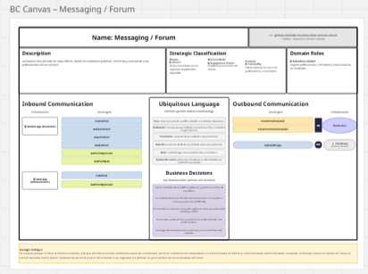

*Figura. Bounded Context Canvas de Messaging / Forum. Elaborado por el equipo utilizando Miro (Miro, s.f.).*

**Description**
En este bounded context se gestiona el foro privado de cada edificio, donde los residentes publican, comentan e interactúan entre ellos.

**Strategic Classification**
- **Generic:** el foro comunitario es una capacidad ampliamente disponible.
- **Engagement Creator:** fortalece la comunidad del edificio.
- **Commodity:** se basa en un patrón estándar de muro con publicaciones y comentarios.

**Domain Role**
Asume el rol de **execution context**, porque registra publicaciones y comentarios.

**Inbound Communication**
- El residente crea publicaciones y comentarios desde la Mobile Application.

**Outbound Communication**
- Los eventos de publicación y comentario creados permiten a Notification avisar a los residentes.
- Las imágenes de las publicaciones se almacenan en Cloudinary a través de un Anticorruption Layer.

**Capability Analysis**
- **Publicaciones:** permite compartir mensajes con texto e imagen.
- **Comentarios:** permite la conversación entre residentes.

### Bounded Context – Notification

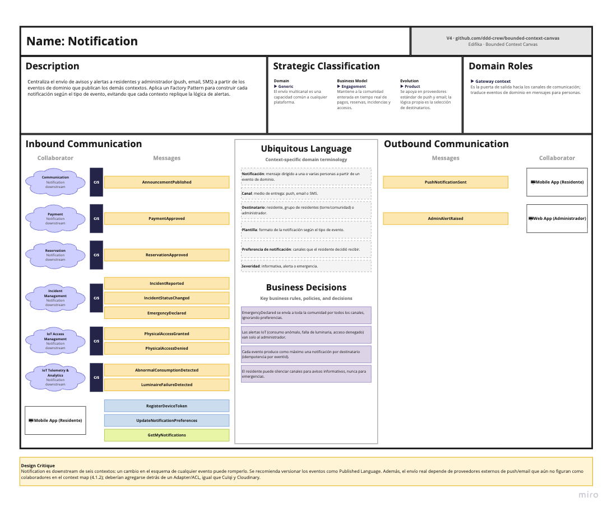

*Figura. Bounded Context Canvas de Notification. Elaborado por el equipo utilizando Miro (Miro, s.f.).*

**Description**
En este bounded context se traducen los eventos de dominio de toda la plataforma en notificaciones push entregadas al residente o administrador correspondiente.

**Strategic Classification**
- **Generic:** el envío de notificaciones es una capacidad resuelta en gran parte por Firebase Cloud Messaging.
- **Engagement Creator:** mantiene al usuario informado en tiempo real.
- **Commodity:** delega el envío a un servicio externo.

**Domain Role**
Asume el rol de **downstream context**, porque solo consume eventos de otros contextos y no influye en su estado.

**Inbound Communication**
- Payment informa pagos confirmados y rechazados.
- Reservation informa los eventos de reserva.
- Communication informa los comunicados publicados.
- Messaging / Forum informa las publicaciones y comentarios creados.
- IoT Access Management informa los accesos concedidos y denegados.
- IoT Telemetry & Analytics informa anomalías de consumo y fallas de dispositivos.
- Smart Irrigation informa riegos fallidos y sensores con falla.

**Outbound Communication**
- Envía las notificaciones push a la Mobile Application a través de Firebase Cloud Messaging, mediante un Anticorruption Layer.

**Capability Analysis**
- **Creación de notificaciones:** traduce cada evento a un mensaje comprensible para el usuario.
- **Envío push:** entrega la notificación al dispositivo registrado.
- **Reintento:** si el envío falla, deja la notificación pendiente sin afectar al contexto que originó el evento.
- **Historial:** registra las notificaciones enviadas y leídas.

### Bounded Context – Report

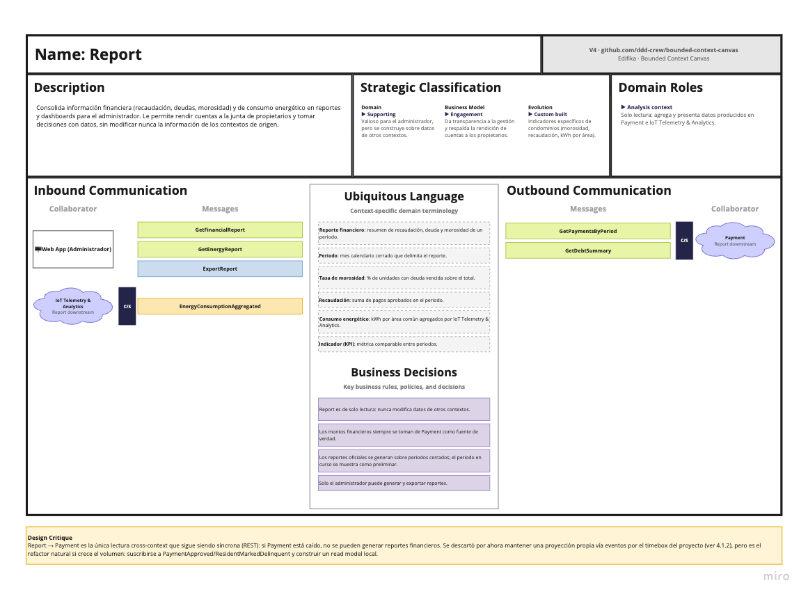

*Figura. Bounded Context Canvas de Report. Elaborado por el equipo utilizando Miro (Miro, s.f.).*

**Description**
En este bounded context se consolidan y exportan los reportes financieros, de morosidad y de consumo de recursos del edificio.

**Strategic Classification**
- **Supporting:** apoya la toma de decisiones del administrador.
- **Decision Support:** su modelo de negocio convierte los datos operativos en información para gestionar el edificio.
- **Product:** la generación de reportes es un patrón conocido.

**Domain Role**
Asume el rol de **analysis context**, porque solo lee y consolida información de otros contextos, sin modificar su estado.

**Inbound Communication**
- El administrador solicita y exporta reportes desde la Web Application.
- IoT Telemetry & Analytics aporta las métricas de consumo de energía y agua.
- IoT Access Management aporta los accesos concedidos y denegados.

**Outbound Communication**
- Consulta a Payment los pagos y deudas del periodo.

**Capability Analysis**
- **Reporte financiero:** resume ingresos, deudas pendientes y morosidad.
- **Reporte de consumo:** muestra el uso de energía y agua de las áreas comunes.
- **Exportación:** permite descargar los reportes para compartirlos.

### Edge API

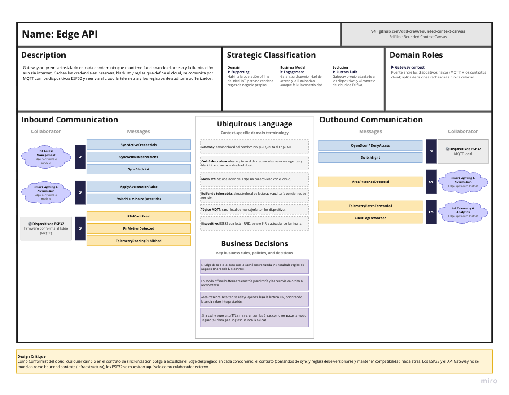

*Figura. Canvas del Edge API. Elaborado por el equipo utilizando Miro (Miro, s.f.).*

**Description**
El Edge API es el gateway instalado en cada condominio que coordina los dispositivos ESP32, cachea las credenciales RFID y las reglas de iluminación y riego, y mantiene la operación aunque se caiga el internet. No es un bounded context de dominio, pero se documenta porque conecta los dispositivos con los contextos IoT.

**Strategic Classification**
- **Supporting:** sostiene la resiliencia offline de los contextos IoT.
- **Compliance Enforcer:** garantiza que los accesos sigan validándose sin conexión.
- **Custom Built:** se diseñó a medida para la operación local del condominio.

**Domain Role**
Asume el rol de **gateway context**, porque traduce entre los dispositivos físicos y el cloud, y actúa como **conformist** del modelo definido por los contextos IoT.

**Inbound Communication**
- IoT Access Management sincroniza credenciales activas, ventanas de reserva y blacklist.
- Smart Lighting & Automation y Smart Irrigation envían reglas, programaciones y comandos de override.
- Los dispositivos ESP32 envían intentos de acceso RFID, presencia, lux, corriente, humedad del suelo y estado de la válvula.

**Outbound Communication**
- Envía a los dispositivos los comandos de apertura de puerta, encendido de luces y apertura o cierre de válvula.
- Reenvía al broker los registros de acceso generados offline y la telemetría acumulada.

**Capability Analysis**
- **Validación offline:** decide accesos con su caché local de credenciales.
- **Ejecución local:** acciona luces y válvulas sin depender del cloud.
- **Sincronización:** reenvía los datos acumulados cuando se restablece la conexión.


### 4.1.2. Context Mapping

El Context Mapping de Edifika muestra cómo se relacionan los doce bounded contexts mediante relaciones upstream (U), que proveen el modelo o los datos, y downstream (D), que dependen de ellos. IAM actúa como Open Host Service (OHS): expone una API estable de autenticación y emite el JWT con el que todos los contextos identifican al usuario y su rol. Residential Management también es OHS, ya que publica la información de edificios, unidades y residentes que consumen Payment, para validar la unidad antes de generar una deuda, e IoT Access, para habilitar o revocar tarjetas RFID. Payment aplica un Anticorruption Layer (ACL) para traducir los datos de Residential Management y de la pasarela Culqi a su propio modelo, y actúa como upstream de IoT Access, al que informa la morosidad de los residentes, y de Report, que construye sus reportes financieros a partir de los pagos y deudas. IoT Access también aplica un ACL, porque combina en una sola regla de acceso los datos que recibe de Residential Management, Payment y Reservation. Reservation es upstream de IoT Access y Smart Lighting, a los que comunica las reservas aprobadas e iniciadas para habilitar el acceso y encender las luces del área común. IoT Telemetry es upstream de Smart Lighting y Smart Irrigation, a los que entrega las lecturas de presencia y de humedad del suelo que disparan sus automatizaciones. Finalmente, Notification es el principal downstream del sistema: recibe los eventos de Payment, Reservation, Communication, Forum y Smart Irrigation, y aplica un ACL para traducirlos al formato de Firebase Cloud Messaging antes de enviarlos como notificaciones push.

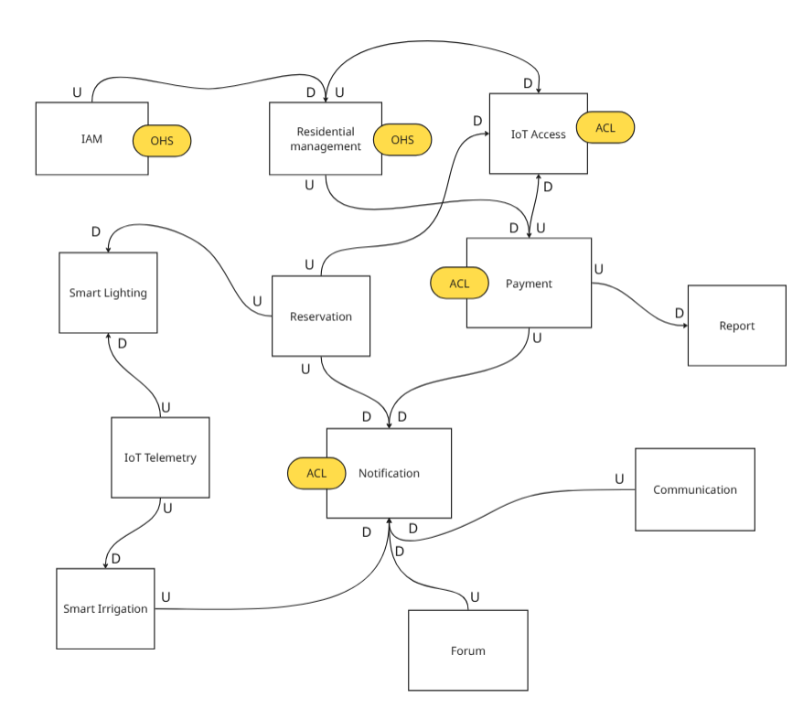

*Figura. Context mapping. Elaborado por el equipo utilizando Miro (Miro, s.f.).*

### 4.1.3. Software Architecture

La arquitectura se modeló con C4 Model aplicando Diagram-as-Code mediante Structurizr DSL. Un único modelo fuente genera las cuatro vistas que se presentan a continuación (System Landscape, System Context, Container y Deployment), de modo que los cuatro diagramas son consistentes entre sí por construcción.

La solución adopta una arquitectura IoT distribuida en tres niveles: Cloud Computing, Edge Computing y IoT Devices con Embedded Systems, y se apoya en los siguientes estilos y patrones:

- **Microservices Architecture:** escalabilidad y disponibilidad independientes; un fallo en Comunicados no interrumpe Pagos ni el control de accesos.
- **Database per Service:** cada microservicio es dueño exclusivo de su base de datos; ningún servicio lee ni escribe la base de otro.
- **Layered Architecture** dentro de cada microservicio (Interface / Application / Domain / Infrastructure).
- **API Gateway Pattern:** punto único de entrada, validación del JWT, políticas CORS, rate limiting y enrutamiento.
- **Event-Driven Architecture:** un Message & Event Broker AMQP/MQTT desacopla la publicación de eventos de dominio de su consumo. Complementa la comunicación REST entre microservicios. Se usa REST síncrono cuando el emisor necesita la respuesta para continuar (Payment → Residential Management para validar la unidad, y la sincronización Cloud → Edge), y eventos asíncronos cuando el emisor no debe quedar bloqueado ni acoplado al consumidor (todo lo que desemboca en Notification y Report, y los disparadores hacia los contextos IoT).
- **Saga Pattern:** consistencia entre contextos sin locks distribuidos. En Payment, el cobro con Culqi se orquesta con compensación ante rechazo y un estado de verificación ante timeout.
- **CQRS parcial:** Report construye su propio modelo de lectura a partir de los eventos que consume, sin consultar las bases de otros contextos.
- **Ports & Adapters (Anti-Corruption Layer):** las integraciones con Culqi, Cloudinary y Firebase se encapsulan detrás de interfaces propias del dominio.
- **Edge Computing offline-first:** el Edge API cachea credenciales RFID y reservas activas, y mantiene operativos los accesos, la iluminación y el riego aunque se caiga el enlace WAN del condominio.

**Stack tecnológico**

| Categoría | Herramienta / Tecnología |
|---|---|
| IDE | Visual Studio Code / IntelliJ IDEA |
| Landing Page | HTML5 / CSS3 / JavaScript |
| Framework Frontend Web | Angular / TypeScript (SPA) |
| Mobile Application | Flutter / Dart |
| Lenguaje / Framework Backend | Java 21 / Spring Boot / Spring Data JPA |
| API Gateway | Spring Cloud Gateway / Java |
| Edge API | Python / Flask / Peewee ORM / SQLite |
| Embedded Applications | ESP32 / C++ |
| Mensajería y eventos | RabbitMQ (AMQP) / EMQX (MQTT) |
| Base de Datos | PostgreSQL (una base por microservicio) / TimescaleDB (series de telemetría) |
| Servicios externos | Culqi (tarjeta, Yape y billeteras móviles) / Cloudinary (imágenes y comprobantes) / Firebase Cloud Messaging (push) |
| Documentación de APIs | Swagger / OpenAPI 3 con esquema de seguridad Bearer JWT |
| Canal de tiempo real | Server-Sent Events (SSE) sobre el API Gateway |
| Diagramación de arquitectura | Structurizr DSL (C4 Model) |
| Testing | JUnit / Mockito / WireMock |
| CI / CD | GitHub Actions |

#### 4.1.3.1. Software Architecture System Landscape Diagram

El System Landscape ubica a Edifika dentro del ecosistema completo del negocio de administración de condominios. A diferencia del Context Diagram, Edifika no se dibuja como sistema en alcance con boundary propio, sino como un sistema más del ecosistema, al mismo nivel que los servicios de terceros de los que depende. Esta vista permite discutir el modelo de negocio —quién llega al producto y por qué canal— antes de entrar a decisiones técnicas.

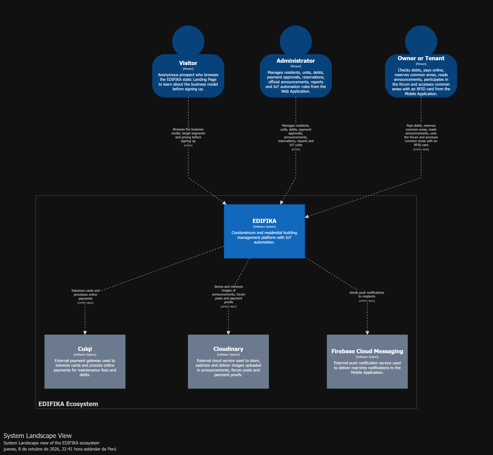

*Figura. System Landscape View de Edifika. Elaborado por el equipo aplicando C4 Model con Structurizr DSL (Structurizr, s.f.).*

El ecosistema está compuesto por tres segmentos de personas y tres sistemas externos:

| Elemento | Tipo | Rol en el ecosistema |
|---|---|---|
| Visitor | Person | Prospecto anónimo que consulta el Landing Page para conocer el modelo de negocio, los segmentos objetivo y los precios antes de registrarse. |
| Administrator | Person | Administra residentes, unidades, deudas, aprobación de pagos, reservas, comunicados oficiales, reportes y reglas de automatización IoT desde la Web Application. |
| Owner or Tenant | Person | Consulta y paga deudas, reserva áreas comunes, lee comunicados, participa del foro y accede a las áreas comunes con su tarjeta RFID, desde la Mobile Application. |
| Culqi | Software System | Pasarela de pagos para cuotas de mantenimiento y deudas. Habilita billeteras móviles además de tarjeta de crédito y débito, cumpliendo la táctica de adaptación al contexto local (HTTPS/REST). |
| Cloudinary | Software System | Almacenamiento, optimización y entrega de imágenes de comunicados oficiales, publicaciones del foro y comprobantes de pago (HTTPS/REST). |
| Firebase Cloud Messaging | Software System | Notificaciones push en tiempo real hacia la Mobile Application (HTTPS/REST). |

El **Visitor** cierra el circuito Landing Page → Web/Mobile Application exigido para la solución: llega de forma anónima al sitio estático y desde ahí los call-to-action lo dirigen a la aplicación de su segmento. El Landing Page es el único punto que comparten los tres segmentos; a partir de él, el Administrator opera desde la web y el Owner or Tenant desde el móvil.

#### 4.1.3.2. Software Architecture Context Level Diagrams

El Context Diagram fija el foco en Edifika: la plataforma se representa como una caja única —sin abrir su interior— rodeada por los usuarios que la operan y los sistemas de terceros con los que se integra. Es el nivel con el que se conversa con stakeholders no técnicos: qué entra, qué sale y con quién se habla.

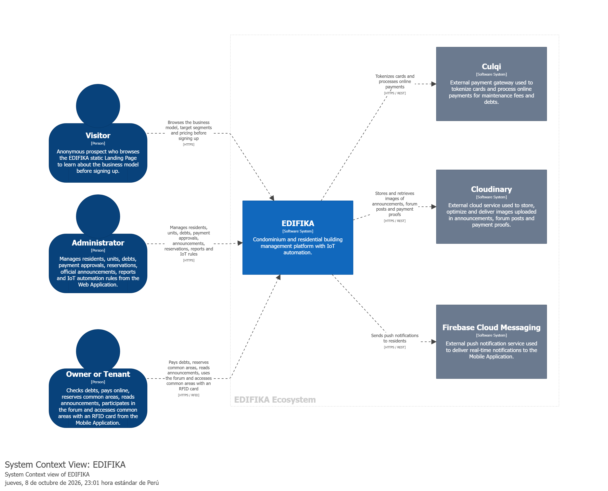

*Figura. System Context View de Edifika. Elaborado por el equipo aplicando C4 Model con Structurizr DSL (Structurizr, s.f.).*

Las interacciones representadas son:

- **Visitor → Edifika:** consulta el modelo de negocio, el contenido por segmento y los precios.
- **Administrator → Edifika:** gestiona la operación del condominio, aprueba pagos y reservas, configura reglas IoT y monitorea alertas de consumo anómalo y falla de dispositivos.
- **Owner or Tenant → Edifika:** paga deudas, reserva áreas comunes, lee comunicados, usa el foro y accede a las áreas comunes con RFID.
- **Edifika → Culqi:** tokeniza tarjetas y procesa los pagos en línea (HTTPS/REST).
- **Edifika → Cloudinary:** sube y recupera imágenes de comunicados, publicaciones del foro y comprobantes de pago (HTTPS/REST).
- **Edifika → Firebase Cloud Messaging:** envía las notificaciones push a los residentes (HTTPS/REST).

Las integraciones con terceros se acotan a tres: pagos, imágenes y notificaciones push. Las capacidades de acceso físico, iluminación, riego y telemetría se resuelven dentro de Edifika, de modo que ningún flujo crítico del condominio depende de la disponibilidad de un proveedor externo.

#### 4.1.3.3. Software Architecture Container Level Diagrams

El Container Diagram abre la caja de Edifika y muestra los 33 containers de la solución, distribuidos en los tres niveles de la arquitectura IoT. Cada container es una unidad de despliegue independiente. El color identifica su tipo: azul los clientes web y los microservicios de gestión, celeste la Mobile Application, verde azulado el API Gateway, verde los microservicios IoT, morado el broker, azul oscuro las bases de datos, naranja el Edge API y rojo los dispositivos embebidos.


*Figura. Container View de Edifika. Elaborado por el equipo aplicando C4 Model con Structurizr DSL (Structurizr, s.f.).*

**Decisiones de tecnología por container**

| Nivel | Container | Tecnología | Responsabilidad |
|---|---|---|---|
| Presentación | Landing Page | HTML5 / CSS3 / JavaScript | Sitio estático con el modelo de negocio, segmentos objetivo y precios; redirige al Administrator a la web y al residente a la tienda de aplicaciones. |
| Presentación | Web Application | Angular / TypeScript (SPA) | Solo para administradores: residentes, unidades, deudas, aprobación de pagos, comunicados, reservas, reportes, reglas IoT y dashboards de telemetría. |
| Presentación | Mobile Application | Flutter / Dart | Solo para residentes:** consulta y pago de deudas, reservas, comunicados, foro y notificaciones push en iOS y Android. Tokeniza la tarjeta directamente con Culqi usando la llave pública. |
| Entrada | API Gateway | Spring Cloud Gateway / Java | Punto único de entrada: enrutamiento, validación del JWT, políticas CORS, rate limiting y canal SSE de disponibilidad en tiempo real. |
| Cloud — gestión | IAM / Auth Service | Spring Boot / Spring Data JPA / Java | Autenticación, autorización, roles y emisión de JWT. |
| Cloud — gestión | Residential Management Service | Spring Boot / Spring Data JPA / Java | Edificios, unidades, residentes y su vínculo con las unidades. |
| Cloud — gestión | Payment Service | Spring Boot / Spring Data JPA / Java | Deudas, pagos, comprobantes y cobros con Culqi mediante Saga, con idempotencia por `Idempotency-Key`. |
| Cloud — gestión | Communication Service | Spring Boot / Spring Data JPA / Java | Comunicados oficiales, avisos administrativos y su estado de lectura. |
| Cloud — gestión | Messaging / Forum Service | Spring Boot / Spring Data JPA / Java | Publicaciones, comentarios e interacciones del foro privado de cada edificio. |
| Cloud — gestión | Reservation Service | Spring Boot / Spring Data JPA / Java | Áreas comunes, reglas, disponibilidad, reservas y aprobaciones. |
| Cloud — gestión | Notification Service | Spring Boot / Spring Data JPA / Java | Consume eventos del sistema y envía notificaciones push, incluidas las alertas IoT. |
| Cloud — gestión | Report Service | Spring Boot / Spring Data JPA / Java | Reportes de pagos, morosidad, reservas, actividad de la comunidad y consumo, construidos desde los eventos que consume. |
| Cloud — IoT | IoT Access Management Service | Spring Boot / Spring Data JPA / Java | Credenciales RFID, permisos por área común, restricción por morosidad y auditoría de accesos. |
| Cloud — IoT | Smart Lighting & Automation Service | Spring Boot / Spring Data JPA / Java | Control de luminarias según presencia, lux ambiental, horarios de reserva y override manual. |
| Cloud — IoT | Smart Irrigation Service | Spring Boot / Spring Data JPA / Java | Riego automático de áreas verdes según horarios y umbrales de humedad del suelo, con override manual. |
| Cloud — IoT | IoT Telemetry & Analytics Service | Spring Boot / Spring Data JPA / Java | Ingesta de telemetría y logs de todos los dispositivos, cálculo de consumo de energía (kWh) y agua, y detección de anomalías y fallas. |
| Datos | IAM Database | PostgreSQL | Usuarios, roles y credenciales. |
| Datos | Residential Database | PostgreSQL | Edificios, unidades y asignaciones usuario-unidad. |
| Datos | Payment Database | PostgreSQL | Deudas, pagos y transacciones. |
| Datos | Communication Database | PostgreSQL | Comunicados, confirmaciones de lectura y referencias a imágenes. |
| Datos | Forum Database | PostgreSQL | Foros, publicaciones, comentarios y reacciones. |
| Datos | Reservation Database | PostgreSQL | Áreas comunes, reglas y reservas. |
| Datos | Notification Database | PostgreSQL | Historial de notificaciones, tokens de dispositivo y preferencias. |
| Datos | Report Database | PostgreSQL | Modelos de lectura y agregaciones para reportes. |
| Datos | Access Database | PostgreSQL | Credenciales RFID, permisos, blacklist y auditoría de accesos. |
| Datos | Lighting Database | PostgreSQL | Políticas, horarios y configuración de luminarias. |
| Datos | Irrigation Database | PostgreSQL | Zonas, horarios, umbrales de humedad y configuración de válvulas. |
| Datos | Telemetry Database | TimescaleDB / PostgreSQL | Lecturas de alta frecuencia, logs de dispositivos, métricas de consumo y series ambientales. |
| Asincronía | Message & Event Broker | RabbitMQ (AMQP) / EMQX (MQTT) | Distribuye eventos de dominio (AMQP) y telemetría y comandos de dispositivos (MQTT). |
| Edge | Edge API & Gateway Controller | Python / Flask / Peewee ORM / SQLite | Gateway on-premise: caché de credenciales RFID offline, coordinación local de dispositivos y operación resiliente ante caídas de internet. |
| Device | Common Area Access Controller | ESP32 / Embedded C++ | Lector RFID, sensor magnético de puerta, buzzer y relé de cerradura eléctrica. |
| Device | Smart Lighting & Sensing Node | ESP32 / Embedded C++ | Sensor de presencia PIR, sensor de lux LDR, sensor de corriente ACS712 y relé de luminaria. |
| Device | Smart Irrigation Node | ESP32 / Embedded C++ | Sensor capacitivo de humedad del suelo, sensor de flujo de agua y relé de válvula solenoide. |

**Documentación y contrato de las APIs**

Cada uno de los 12 microservicios expone su propia interfaz Swagger / OpenAPI 3 con el esquema de seguridad Bearer JWT, de modo que los endpoints protegidos se prueban desde la interfaz gráfica con un token válido (TS14). El API Gateway no unifica esas interfaces: cada servicio es dueño del contrato que publica, coherente con el principio de que cada bounded context define su propio modelo.

**Cómo se comunican los containers**

1. **Síncrono REST/JSON sobre HTTPS con JWT:** la Web y la Mobile Application consumen el API Gateway, que enruta hacia los 12 microservicios. Ningún cliente accede directamente a un microservicio.
2. **Asíncrono AMQP:** los microservicios publican eventos de dominio en el broker (`PaymentConfirmed`, `ResidentMarkedDelinquent`, `ReservationApproved`, `AnnouncementPublished`, `PhysicalAccessGranted`, `AbnormalConsumptionDetected`, entre otros) y el broker los entrega a Notification, Report, Access, Lighting e Irrigation.
3. **MQTT local (Edge ↔ Device):** los ESP32 envían al Edge API intentos de acceso RFID, estado de puerta, presencia, lux, corriente, humedad del suelo y flujo de agua; reciben de vuelta comandos de apertura, feedback, PWM de luminaria y apertura o cierre de válvula.
4. **MQTT/AMQP sobre WAN (Edge → Cloud):** el Edge API reenvía al broker los registros de acceso generados offline y la telemetría acumulada.
5. **Sincronización REST (Cloud → Edge):** IoT Access Management sincroniza credenciales activas, ventanas de reserva y blacklist; Smart Lighting y Smart Irrigation envían horarios y overrides manuales.
6. **JDBC/SQL:** cada microservicio persiste únicamente en su propia base de datos; Telemetry escribe y consulta agregaciones en TimescaleDB.
7. **SSE (servidor → cliente):** Reservation publica, a través del API Gateway, un flujo Server-Sent Events con los cambios de disponibilidad de áreas comunes, de modo que un residente vea liberarse u ocuparse un horario sin recargar.
8. **Integraciones externas:** la Mobile Application tokeniza la tarjeta con Culqi; Payment crea el cargo con la llave secreta; Payment, Communication y Forum usan Cloudinary; Notification usa Firebase Cloud Messaging.
9. **Interacción física:** el residente presenta su tarjeta RFID y su movimiento es detectado por el sensor PIR. Es el único canal del diagrama que no es de software.

El cloud concentra las reglas de negocio y la persistencia de largo plazo, el edge concentra la autonomía operativa de cada condominio y los dispositivos se limitan a sensar y actuar. Esa separación permite que un corte de internet degrade la solución en lugar de detenerla: los dispositivos siguen respondiendo al Edge API y este sigue decidiendo con su caché local.

#### 4.1.3.4. Software Architecture Deployment Diagrams

El Deployment Diagram muestra en qué infraestructura se ejecuta cada container. La solución se despliega en seis grupos de infraestructura: los dispositivos de cada segmento de usuario, el PaaS del backend, el proveedor gestionado de bases de datos transaccionales, el proveedor de series temporales, el broker gestionado y la diferencia central respecto de una solución puramente web, el sitio físico del condominio, donde viven el Edge Server y los dispositivos embebidos.


*Figura. Deployment View de Edifika — entorno Production. Elaborado por el equipo aplicando C4 Model con Structurizr DSL (Structurizr, s.f.).*

| Deployment Node | Infraestructura | Containers desplegados |
|---|---|---|
| Administrator Workstation → Web Browser | Chrome, Edge o Firefox en Windows / macOS | Landing Page, Web Application |
| Resident Smartphone → Mobile Browser | Chrome o Safari Mobile | Landing Page |
| Resident Smartphone → Mobile OS | Android 10+ / iOS 15+ | Mobile Application |
| Visitor Device → Browser | Cualquier navegador moderno | Landing Page |
| Render → API Gateway Node | Render Web Service / Docker / Java 21 | API Gateway |
| Render → Core Microservices | Render Web Services / Docker / Java 21 | IAM, Residential Management, Payment, Communication, Messaging/Forum, Reservation, Notification, Report |
| Render → IoT Cloud Microservices | Render Web Services / Docker / Java 21 | IoT Access Management, Smart Lighting & Automation, Smart Irrigation, IoT Telemetry & Analytics |
| Supabase → PostgreSQL Instance | PostgreSQL 15 gestionado, un schema y una credencial por servicio | Las 11 bases transaccionales (IAM, Residential, Payment, Communication, Forum, Reservation, Notification, Report, Access, Lighting, Irrigation) |
| Timescale Cloud → TimescaleDB Instance | PostgreSQL + TimescaleDB gestionado | Telemetry Database |
| Managed Broker Cloud | CloudAMQP / EMQX Cloud | Message & Event Broker |
| Culqi Cloud / Cloudinary Cloud / Google Firebase | SaaS | Culqi, Cloudinary, Firebase Cloud Messaging |
| Condominium Site → Edge Server | Raspberry Pi 4 on-premise | Edge API & Gateway Controller |
| Condominium Site → Common Area Door Unit | Hardware embebido por puerta de área común | Common Area Access Controller |
| Condominium Site → Common Area Lighting Unit | Hardware embebido por zona de iluminación | Smart Lighting & Sensing Node |
| Condominium Site → Green Area Irrigation Unit | Hardware embebido por zona de riego | Smart Irrigation Node |

El **Condominium Site** se instala una vez por edificio y hace viable la resiliencia: si se cae el enlace a internet, el Edge Server sigue validando credenciales RFID contra su caché local y accionando cerraduras, luminarias y válvulas; cuando el enlace se restablece, reenvía al broker los registros de acceso y la telemetría acumulada.

La infraestructura responde al perfil de carga de cada pieza: los servicios de Render son *stateless* y escalan horizontalmente sin coordinación; la persistencia transaccional se aísla por schema dentro de Supabase; la telemetría se separa en TimescaleDB porque su perfil —escritura de alta frecuencia y consulta por series temporales, no es compatible con el transaccional; el broker se contrata gestionado para no asumir la operación de su alta disponibilidad; y el sitio del condominio es la única infraestructura que el equipo instala y mantiene físicamente.

## 4.2. Tactical-Level Domain-Driven Design

### 4.2.1. Bounded Context: IAM / Auth

#### 4.2.1.1. Domain Layer

El Domain Layer del bounded context IAM/Auth concentra la lógica de negocio relacionada con la identidad, autenticación y autorización de los usuarios dentro de Edifika. Este contexto se encarga de que cada usuario pueda registrarse, autenticarse y mantener una sesión activa mediante tokens, resguardando en todo momento la unicidad de las credenciales y la correcta asignación de roles.

El agregado principal identificado es:

**User**: concentra los datos y el comportamiento asociado a un usuario del sistema —credenciales, correo, estado de cuenta y rol— y es responsable de aplicar reglas como la validez de la contraseña o la coherencia entre el usuario y su rol.

La validación de reglas de negocio del contexto se apoya en un Domain Service, el **UserDomainService**, que centraliza comprobaciones como la unicidad del correo electrónico antes de registrar o autenticar una cuenta.

## Aggregate: UserAggregate
Representa a un usuario dado de alta en la plataforma, junto con su rol, estado y credenciales de acceso. Es responsable de sus propias transiciones de estado (activar, desactivar, cambiar contraseña).

### Entity: User

| Atributo | Tipo | Descripción |
|---|---|---|
| idUser | Long | Identificador único del usuario. |
| idRol | RolId | Referencia al rol asignado al usuario. |
| user | String | Nombre de usuario utilizado para el acceso. |
| passwordHash | String | Hash de la contraseña, nunca almacenado en texto plano. |
| email | String | Correo electrónico del usuario. |
| status | UserStatus | Estado actual de la cuenta. |
| telefono | String | Número de contacto del usuario. |

### Entity: UserRol

| Atributo | Tipo | Descripción |
|---|---|---|
| idRole | Long | Identificador único del rol. |
| role | String | Nombre del rol. Valores admitidos: `ADMIN` y `RESIDENT`, los dos únicos segmentos objetivo definidos en 1.3 y sobre los que se redactaron las historias de usuario del Capítulo III. |

## ValueObject: Email
Encapsula y valida la estructura del correo electrónico antes de asociarlo a una cuenta de usuario.

| Atributo | Tipo | Descripción |
|---|---|---|
| value | String | Dirección de correo electrónico. |

## ValueObject: PasswordHash
Protege la contraseña del usuario asegurando que solo su forma hasheada circule dentro del dominio. El algoritmo es **BCrypt**, conforme a TS02.

| Atributo | Tipo | Descripción |
|---|---|---|
| hash | String | Valor resultante del hashing de la contraseña. |

## ValueObject: JwtToken
Representa la sesión activa de un usuario autenticado, junto con su vigencia. Conforme a TS01, el token se firma con **HMAC-SHA256**, transporta `email`, `userId` y `rol` en su payload, y expira a los **7 días** de emitido.

| Atributo | Tipo | Descripción |
|---|---|---|
| token | String | Cadena del token JWT emitido. |
| expiresAt | DateTime | Momento en que el token deja de ser válido. |

## Enumeration

| Enumeración | Valores |
|---|---|
| UserStatus | `ACTIVE`, `INACTIVE`, `BLOCKED` |

## Domain Services

| Nombre | Responsabilidad | Reglas aplicadas y métodos |
|---|---|---|
| UserDomainService | Validar las reglas de negocio de usuarios y roles antes de persistir o autenticar una cuenta. | - El correo electrónico debe ser único en todo el sistema.<br>- Las credenciales deben cumplir el formato mínimo de seguridad.<br>- Todo usuario debe tener un rol válido asignado.<br>- Método: `validateUserRules(user)`. |
| LoginAttemptService | Proteger la cuenta frente a ataques de fuerza bruta. | - Tras **5 intentos fallidos consecutivos**, la cuenta pasa a `BLOCKED` durante **15 minutos** (TS01).<br>- Un inicio de sesión exitoso reinicia el contador.<br>- Métodos: `registerFailure(email)`, `isBlocked(email)`. |

#### 4.2.1.2. Interface Layer

Esta capa expone el bounded context al exterior, recibiendo las solicitudes HTTP provenientes del API Gateway y traduciéndolas en comandos hacia la Application Layer.

**AuthController** *(REST Controller)*

Punto de entrada del microservicio de autenticación. Recibe las peticiones de login, registro y validación de sesión desde el API Gateway, valida el formato de entrada (DTOs) y delega la lógica al `AuthApplicationService`.

| Método | Firma | Descripción |
|---|---|---|
| `login` | `login(request: LoginRequest): ResponseEntity<TokenResponse>` | Recibe credenciales y devuelve un JWT si son válidas. |
| `register` | `register(request: RegisterRequest): ResponseEntity<UserResponse>` | Registra un nuevo usuario en el sistema. |
| `validateSession` | `validateSession(token: String): ResponseEntity<Boolean>` | Verifica si un token de sesión sigue siendo válido. |

El `AuthController` no contiene lógica de negocio: su responsabilidad es exclusivamente recibir, validar el formato de la solicitud y delegar.

#### 4.2.1.3. Application Layer

Esta capa coordina los flujos de negocio del bounded context IAM/Auth, sin definir reglas propias, apoyándose en las entidades y servicios del Domain Layer.

Se emplea un Command Handler para procesar las acciones explícitas que un usuario solicita —iniciar sesión o registrarse— y un servicio de soporte encargado de la emisión y verificación de tokens.

Clases principales:

- **AuthApplicationService**: orquesta los comandos de login y registro de usuarios.
- **TokenService**: gestiona la generación y validación de tokens JWT (HMAC-SHA256, vigencia de 7 días) una vez completada la autenticación.
- **AccountLockPolicy**: aplica el bloqueo temporal de la cuenta tras cinco intentos fallidos, apoyándose en `LoginAttemptService`.

## Auth Command Handler

| Capability | Command Handler | Descripción |
|---|---|---|
| Iniciar sesión | AuthApplicationService.handle(LoginCommand) | Verifica las credenciales del usuario y emite un token JWT. |
| Registrar usuario | AuthApplicationService.handle(RegisterCommand) | Aplica las reglas de negocio y crea la cuenta del nuevo usuario. |

## Token Service

| Capability | Método | Descripción |
|---|---|---|
| Generar token | generateToken(user) | Construye y firma un JWT a partir de los datos del usuario autenticado. |
| Validar token | validateToken(token) | Comprueba la firma y el tiempo de vigencia de un token recibido. |

#### 4.2.1.4. Infrastructure Layer

Esta capa implementa el acceso a los recursos externos que el bounded context necesita para operar, garantizando la persistencia de los datos conforme a los contratos definidos en el Domain Layer.

La clase principal de esta capa es:

**UserRepositoryImpl**: implementación concreta de la interfaz `UserRepository`. El hashing de contraseñas con **BCrypt** y la verificación de credenciales se resuelven en esta capa mediante el `PasswordEncoder` de Spring Security, de modo que el dominio solo manipule el Value Object `PasswordHash`. Gestiona el ciclo de vida de los usuarios en la base de datos —guardar, buscar y verificar credenciales— e incorpora validaciones adicionales para evitar registros duplicados de correo antes de crear una cuenta nueva.

## Repositories

### UserRepository

| Método | Descripción |
|---|---|
| save(User user) | Guarda un nuevo usuario o actualiza uno ya existente. |
| findById(Long id) | Recupera un usuario a partir de su identificador único. |
| findByEmail(String email) | Recupera un usuario a partir de su correo electrónico. |
| existsByEmail(String email) | Verifica si ya existe una cuenta registrada con ese correo. |

#### 4.2.1.5. Bounded Context Software Architecture Component Level Diagrams

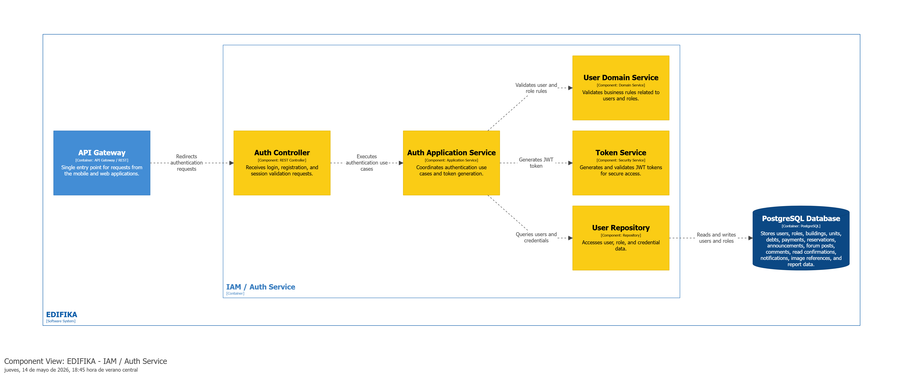

*Figura. Diagrama de Componentes — Auth Service. Elaborado utilizando Structurizr (Structurizr, s.f.).*

#### 4.2.1.6. Bounded Context Software Architecture Code Level Diagrams

En esta sección se presenta el nivel de mayor detalle de implementación del bounded context IAM/Auth, correspondiente al cuarto nivel del C4 Model: el Code diagram. A diferencia de los niveles de Context, Container y Component, este nivel se representa mediante un diagrama de clases UML, ya que detalla la estructura interna de las clases del Domain Layer: sus atributos, métodos, visibilidad y las relaciones con su respectiva multiplicidad. A continuación se desglosa en dos apartados: el diagrama de clases del dominio y el diagrama de diseño de base de datos.

##### 4.2.1.6.1. Bounded Context Domain Layer Class Diagrams

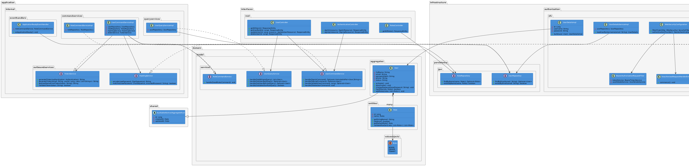

*Figura. Diagrama de Clases IAM — vista general. Elaborado utilizando PlantUML Editor (PlantUML, s.f.).*

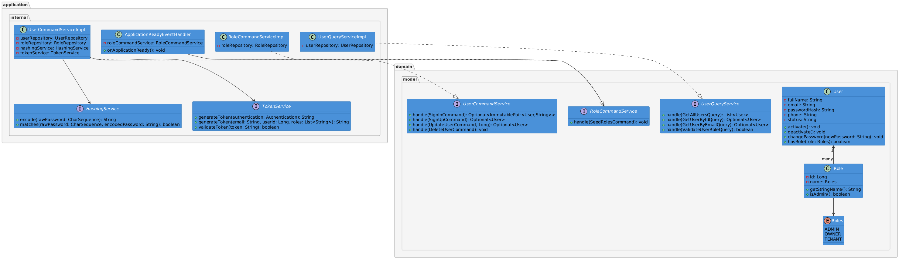

*Figura. Diagrama de Clases IAM — capas de Aplicación y Dominio. Elaborado utilizando PlantUML Editor (PlantUML, s.f.).*

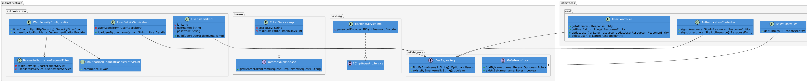

*Figura. Diagrama de Clases IAM — capas de Infraestructura e Interfaces. Elaborado utilizando PlantUML Editor (PlantUML, s.f.).*

##### 4.2.1.6.2. Bounded Context Database Design Diagram

El modelo entidad-relación del bounded context IAM/Auth está compuesto por las tablas **UserRol** y **User**. UserRol almacena los dos roles disponibles en la plataforma (`ADMIN` y `RESIDENT`, correspondientes a los dos segmentos objetivo de 1.3), mientras que User contiene los datos de cada cuenta registrada —credenciales, correo, estado y teléfono— junto con la referencia al rol que le corresponde.

La relación entre ambas tablas es `UserRol (1) —— (N) User`: un rol puede asignarse a múltiples usuarios, pero cada usuario posee un único rol activo, reforzado por una llave foránea obligatoria (`id_rol`).

El resto de tablas del modelo de Edifika (Payments, Reservations, Forum, Notifications, etc.) hacen referencia a `User.id_user`, pero corresponden a otros bounded contexts del sistema y no forman parte de este diagrama.

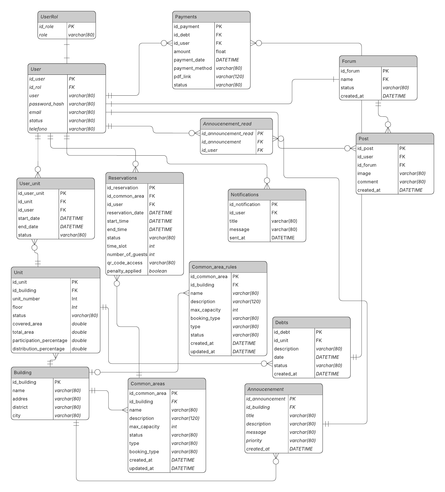

*Figura. Diagrama Entidad-Relación consolidado (incluye las tablas de IAM). Elaborado utilizando LucidChart (LucidChart, s.f.).*

### 4.2.2. Bounded Context: Residential Management

#### 4.2.2.1. Domain Layer

El Domain Layer de Residential Management concentra la lógica de tenencia del sistema: qué administradora opera qué edificio, cómo se estructuran sus unidades y cómo se vincula un residente a la unidad que ocupa.

Los agregados identificados son:

**PropertyManager**: representa a la administradora o junta que opera uno o varios edificios. Es la raíz de tenencia del sistema y responde al caso real recogido en la entrevista, donde un único administrador gestiona 15 edificios.

**Building**: representa el edificio administrado, con su conjunto de torres y unidades.

La regla central del contexto se apoya en el Domain Service **UnitAssignmentService**.

## Aggregate: PropertyManagerAggregate
Representa a la administradora dada de alta en la plataforma y a los edificios que le pertenecen.

### Entity: PropertyManager

| Atributo | Tipo | Descripción |
|---|---|---|
| idPropertyManager | Long | Identificador único de la administradora. |
| name | String | Nombre de la administradora o junta. |

## Aggregate: BuildingAggregate
Representa un edificio administrado y su padrón de unidades.

### Entity: Building

| Atributo | Tipo | Descripción |
|---|---|---|
| idBuilding | Long | Identificador único del edificio. |
| idPropertyManager | PropertyManagerId | Referencia a la administradora propietaria. |
| name | String | Nombre del edificio. |
| address | Address | Dirección del edificio. |

### Entity: Unit

| Atributo | Tipo | Descripción |
|---|---|---|
| idUnit | Long | Identificador único de la unidad. |
| idBuilding | BuildingId | Referencia al edificio al que pertenece. |
| tower | TowerId | Torre a la que pertenece la unidad. |
| number | UnitNumber | Número de la unidad dentro de la torre. |
| status | UnitStatus | Estado actual de la unidad. |

### Entity: ResidentUnitLink

| Atributo | Tipo | Descripción |
|---|---|---|
| idLink | Long | Identificador único del vínculo. |
| idResident | Long | Referencia al residente vinculado. |
| idUnit | UnitId | Referencia a la unidad vinculada. |
| type | LinkType | Tipo de vínculo (`OWNER`/`TENANT`). |
| validFrom | DateTime | Inicio de vigencia del vínculo. |
| validUntil | DateTime | Fin de vigencia del vínculo. |

Este vínculo es el registro que habilita la creación de la cuenta del residente en IAM.

## ValueObject: Address

| Atributo | Tipo | Descripción |
|---|---|---|
| value | String | Dirección física del edificio. |

## ValueObject: TowerId

| Atributo | Tipo | Descripción |
|---|---|---|
| value | String | Identificador de la torre dentro del edificio. |

## ValueObject: UnitNumber

| Atributo | Tipo | Descripción |
|---|---|---|
| value | String | Número de la unidad dentro de la torre. |

## Enumeration

| Enumeración | Valores |
|---|---|
| UnitStatus | `OCCUPIED`, `VACANT` |
| LinkType | `OWNER`, `TENANT` |

## Domain Services

| Nombre | Responsabilidad | Reglas aplicadas |
|---|---|---|
| UnitAssignmentService | Garantizar la coherencia de la asignación residente–unidad. | - Un residente solo puede vincularse a una unidad activa.<br>- Una unidad no admite dos vínculos `OWNER` simultáneos. |

**Alcance multi-edificio.** Todas las consultas del contexto se resuelven acotadas al `PropertyManager` del administrador autenticado, de modo que un administrador con varios edificios opere sobre todos desde una misma sesión sin que los datos de administradoras distintas se mezclen. El `buildingId` viaja como parte del contexto de la petición hacia los demás microservicios, que lo usan para filtrar sus propios datos.

#### 4.2.2.2. Interface Layer

**BuildingController**: registro y consulta de edificios y sus unidades (US07). **UnitController**: alta, edición y estado de cada unidad. **ResidentUnitController**: vinculación de residentes y verificación de la información por torre y departamento (US04).

#### 4.2.2.3. Application Layer

Esta capa coordina el alta y mantenimiento del padrón de edificios, unidades y vínculos, sin definir reglas propias.

## Residential Command Handler

| Capability | Command Handler | Descripción |
|---|---|---|
| Registrar edificio | BuildingCommandService.handle(RegisterBuildingCommand) | Da de alta un edificio y sus torres. |
| Registrar/editar unidad | UnitCommandService.handle(UpsertUnitCommand) | Crea o actualiza una unidad y su estado. |
| Vincular residente | ResidentUnitCommandService.handle(LinkResidentCommand) | Crea el vínculo residente–unidad aplicando `UnitAssignmentService`. |
| Cerrar vínculo | ResidentUnitCommandService.handle(CloseLinkCommand) | Cierra la vigencia de un vínculo existente. |

`ResidentialQueryService` resuelve el directorio de unidades y residentes. El contexto publica `ResidentLinkedToUnit`, que habilita el alta de la cuenta del residente.

#### 4.2.2.4. Infrastructure Layer

## Repositories

| Repositorio | Responsabilidad |
|---|---|
| PropertyManagerRepository | Persistencia de administradoras. |
| BuildingRepository | Persistencia de edificios. |
| UnitRepository | Persistencia de unidades. |
| ResidentUnitLinkRepository | Persistencia de vínculos residente–unidad. |

Implementación JPA de los repositorios sobre PostgreSQL, con esquema propio del microservicio; `IamProvisioningClient`, cliente REST síncrono que entrega a IAM/Auth el vínculo residente–unidad que autoriza la creación de la cuenta.

#### 4.2.2.5. Bounded Context Software Architecture Component Level Diagrams

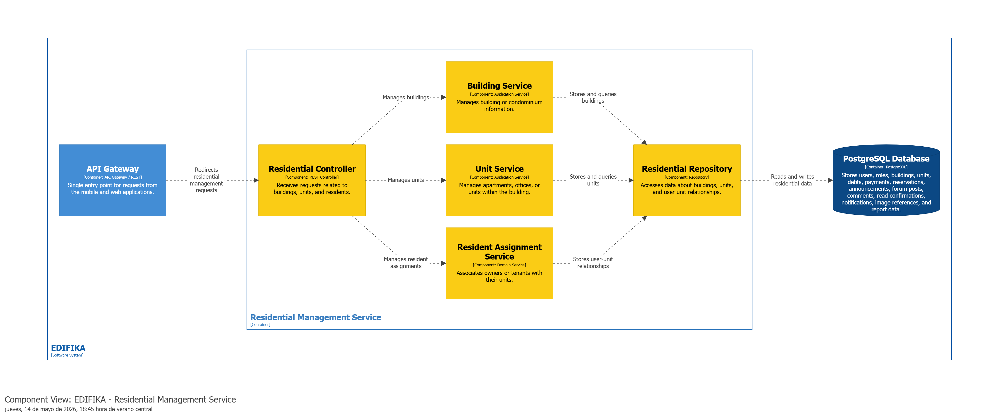

*Figura. Diagrama de Componentes — Residential Management Service. Elaborado utilizando Structurizr (Structurizr, s.f.).*

#### 4.2.2.6. Bounded Context Software Architecture Code Level Diagrams

##### 4.2.2.6.1. Bounded Context Domain Layer Class Diagrams

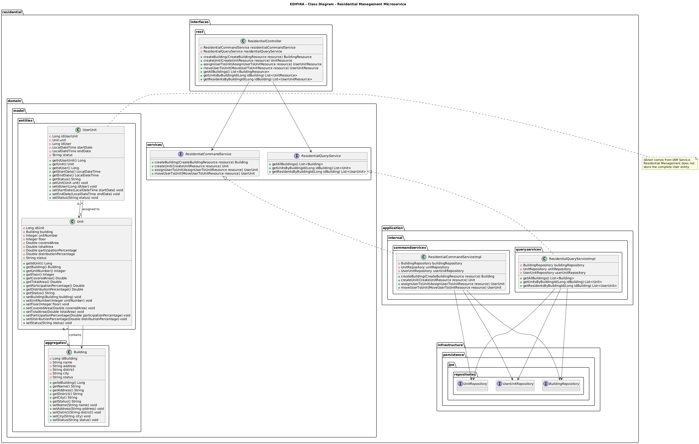

*Figura. Diagrama de Clases — Residential Management. Elaborado utilizando PlantUML Editor (PlantUML, s.f.).*

##### 4.2.2.6.2. Bounded Context Database Design Diagram


*Figura. Diagrama Entidad-Relación consolidado (incluye las tablas de Residential Management). Elaborado utilizando LucidChart (LucidChart, s.f.).*

---

### 4.2.3. Bounded Context: Reservation

#### 4.2.3.1. Domain Layer

El agregado principal identificado es:

**Reservation**: solicitud de uso de un área común, con residente, ventana horaria y estado. La regla central del contexto se resuelve mediante el Domain Service **AvailabilityService**.

## Aggregate: ReservationAggregate

### Entity: Reservation

| Atributo | Tipo | Descripción |
|---|---|---|
| idReservation | Long | Identificador único de la reserva. |
| idResident | Long | Residente que solicita la reserva. |
| idCommonArea | CommonAreaId | Área común reservada. |
| timeWindow | TimeWindow | Ventana horaria solicitada. |
| status | ReservationStatus | Estado actual de la reserva. |

## Aggregate: CommonAreaAggregate

### Entity: CommonArea

| Atributo | Tipo | Descripción |
|---|---|---|
| idCommonArea | Long | Identificador único del área común. |
| name | String | Nombre del área. |
| capacity | AreaCapacity | Aforo del área. |
| status | CommonAreaStatus | Estado del área (`ENABLED`/`DISABLED`), que el administrador conmuta según mantenimiento o restricciones (US38). |

### Entity: AreaRule

| Atributo | Tipo | Descripción |
|---|---|---|
| idRule | Long | Identificador único de la regla. |
| idCommonArea | CommonAreaId | Área común a la que aplica. |
| allowedWindow | TimeWindow | Franja horaria permitida. |
| maxDuration | Duration | Duración máxima de una reserva. |
| minAdvance | Duration | Anticipación mínima exigida (US39). |

## ValueObject: TimeWindow

| Atributo | Tipo | Descripción |
|---|---|---|
| start | DateTime | Inicio de la ventana. |
| end | DateTime | Fin de la ventana. |

## ValueObject: AreaCapacity

| Atributo | Tipo | Descripción |
|---|---|---|
| value | Int | Aforo máximo del área común. |

## Enumeration

| Enumeración | Valores |
|---|---|
| ReservationStatus | `PENDING`, `APPROVED`, `REJECTED`, `CANCELLED` |
| CommonAreaStatus | `ENABLED`, `DISABLED` |

## Domain Services

| Nombre | Responsabilidad | Reglas aplicadas |
|---|---|---|
| AvailabilityService | Resolver la disponibilidad de un área común. | - No se admite una reserva fuera de las reglas configuradas del área.<br>- No se admite una segunda reserva sobre una ventana horaria ya ocupada (US19). |

#### 4.2.3.2. Interface Layer

**ReservationController**: solicitud y cancelación de reservas por el residente (US17, US20). **ReservationApprovalController**: aprobación, rechazo y cancelación administrativa (US18, US35). **CommonAreaController**: registro de áreas, habilitación/deshabilitación y configuración de reglas (US38, US39). **AvailabilityQueryController**: disponibilidad del residente y mapa de ocupación global del administrador (US16, US33); expone además el flujo **SSE** al que se suscriben los clientes para recibir los cambios de disponibilidad en vivo (US19 esc. 3). **ReservationHistoryController**: historial y estadísticas de uso (US40).

#### 4.2.3.3. Application Layer

## Reservation Command Handler

| Capability | Command Handler | Descripción |
|---|---|---|
| Solicitar reserva | ReservationCommandService.handle(CreateReservationCommand) | Valida disponibilidad contra `AvailabilityService` antes de crear la reserva. |
| Aprobar/rechazar reserva | ReservationApprovalCommandService.handle(ResolveReservationCommand) | Aplica la decisión administrativa sobre la reserva. |
| Configurar área común | CommonAreaCommandService.handle(UpsertCommonAreaCommand) | Alta, habilitación/deshabilitación y reglas del área. |

`ReservationQueryService` resuelve el calendario de reservas. `ReservationSchedulerService` es el scheduler interno que detecta el inicio de cada ventana horaria. `AvailabilityBroadcastService` reemite los cambios por el canal SSE del API Gateway, de modo que un residente que esté consultando ese horario vea la actualización sin recargar. La unicidad de `(CommonArea, TimeWindow)` se garantiza en la transacción local: el segundo solicitante recibe **HTTP 409**.

## Domain Events Published

| Evento | Disparado por | Consumido por |
|---|---|---|
| ReservationApproved | ReservationApprovalCommandService | Notification, IoT Access Management |
| ReservationStarted | ReservationSchedulerService | Smart Lighting & Automation |
| ReservationCancelled | ReservationApprovalCommandService / ReservationCommandService | Notification |

#### 4.2.3.4. Infrastructure Layer

## Repositories

| Repositorio | Responsabilidad |
|---|---|
| ReservationRepository | Persistencia de reservas. |
| CommonAreaRepository | Persistencia de áreas comunes. |
| AreaRuleRepository | Persistencia de reglas de uso por área. |

Implementación JPA de los repositorios sobre PostgreSQL, con esquema propio del microservicio; publicador AMQP de los eventos del contexto hacia el Message & Event Broker.

#### 4.2.3.5. Bounded Context Software Architecture Component Level Diagrams

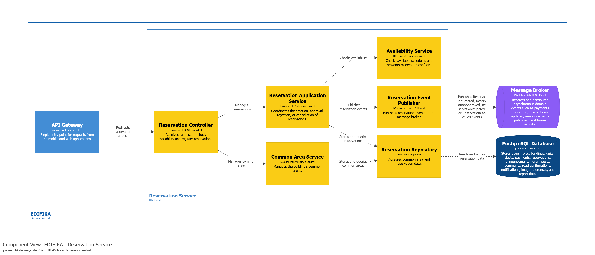

*Figura. Diagrama de Componentes — Reservation Service. Elaborado utilizando Structurizr (Structurizr, s.f.).*

#### 4.2.3.6. Bounded Context Software Architecture Code Level Diagrams

##### 4.2.3.6.1. Bounded Context Domain Layer Class Diagrams

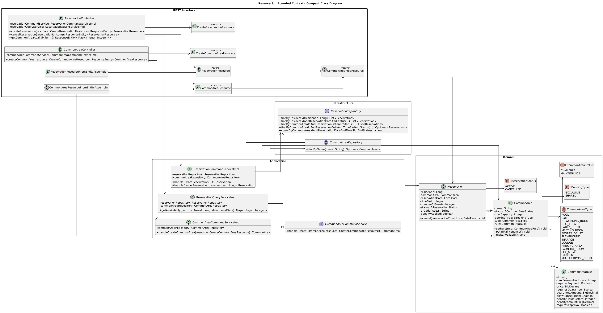

*Figura. Diagrama de Clases — Reservation. Elaborado utilizando PlantUML Editor (PlantUML, s.f.).*

##### 4.2.3.6.2. Bounded Context Database Design Diagram


*Figura. Diagrama Entidad-Relación consolidado (incluye las tablas de Reservation). Elaborado utilizando LucidChart (LucidChart, s.f.).*

---

### 4.2.4. Bounded Context: Payment

#### 4.2.4.1. Domain Layer

El agregado principal identificado es:

**Payment**: pago de un residente con monto, medio, comprobante adjunto y estado. Las reglas del contexto se resuelven mediante los Domain Services **DebtCalculationService** y **DelinquencyEvaluationService**, este último con efecto fuera del contexto: un residente con deuda vencida se marca moroso, y esa marca restringe su acceso físico.

## Aggregate: PaymentAggregate
Agrupa el pago, su comprobante y la constancia generada al aprobarse.

### Entity: Payment

| Atributo | Tipo | Descripción |
|---|---|---|
| idPayment | Long | Identificador único del pago. |
| idDebt | DebtId | Deuda que el pago cubre. |
| amount | Money | Monto pagado. |
| method | PaymentMethod | Medio de pago utilizado. |
| status | PaymentStatus | Estado del pago. |

### Entity: Debt

| Atributo | Tipo | Descripción |
|---|---|---|
| idDebt | Long | Identificador único de la deuda. |
| idUnit | UnitId | Unidad a la que corresponde la deuda. |
| period | BillingPeriod | Periodo de mantenimiento facturado. |
| amount | Money | Monto adeudado. |
| status | DebtStatus | Estado de la deuda. El estado `IN_REVIEW` es el que exige el Escenario 1 de US22 cuando el residente adjunta su comprobante y este aún no ha sido validado por el administrador. |

### Entity: Receipt

| Atributo | Tipo | Descripción |
|---|---|---|
| idReceipt | Long | Identificador único de la constancia. |
| idPayment | PaymentId | Pago sobre el que se emite. |
| issuedAt | DateTime | Fecha de emisión. |

### Entity: PaymentProof

| Atributo | Tipo | Descripción |
|---|---|---|
| idProof | Long | Identificador único del comprobante. |
| idPayment | PaymentId | Pago al que corresponde. |
| fileReference | String | Referencia al archivo almacenado. |
| reviewResult | String | Resultado de la revisión (US22 esc. 2 contempla el rechazo por comprobante ilegible). |

## Entity independiente: Expense
No forma parte del agregado Payment; registra los egresos del edificio a cargo del administrador. Es el origen de los egresos que US25 y US27 exigen reportar.

| Atributo | Tipo | Descripción |
|---|---|---|
| idExpense | Long | Identificador único del egreso. |
| idBuilding | BuildingId | Edificio al que corresponde el egreso. |
| category | String | Categoría del egreso. |
| provider | String | Proveedor asociado. |
| amount | Money | Monto del egreso. |
| period | BillingPeriod | Periodo del egreso. |

## ValueObject: Money

| Atributo | Tipo | Descripción |
|---|---|---|
| amount | Decimal | Monto monetario. |
| currency | String | Moneda del monto. |

## ValueObject: BillingPeriod

| Atributo | Tipo | Descripción |
|---|---|---|
| month | Int | Mes del periodo de facturación. |
| year | Int | Año del periodo de facturación. |

## Enumeration

| Enumeración | Valores |
|---|---|
| PaymentStatus | `PENDING`, `IN_REVIEW`, `PAID`, `REJECTED` |
| DebtStatus | `PENDING`, `IN_REVIEW`, `SETTLED`, `OVERDUE` |
| PaymentMethod | `CARD`, `YAPE`, `PLIN`, `MANUAL` |

## Domain Services

| Nombre | Responsabilidad | Reglas aplicadas |
|---|---|---|
| DebtCalculationService | Consolidar el saldo vigente de una unidad. | Suma las deudas y los pagos aplicados de la unidad. |
| DelinquencyEvaluationService | Evaluar la morosidad del residente. | Un residente con deuda vencida se marca moroso; esa marca restringe su acceso físico. |

Repository Pattern aplicado para desacoplar estas reglas de la persistencia.

#### 4.2.4.2. Interface Layer

**DebtController**: consulta de la deuda vigente del residente (US21). **PaymentController**: registro del pago con comprobante y pago en línea (US22, US30). **PaymentApprovalController**: registro y aprobación de pagos por el administrador (US23). **DelinquencyController**: listado de residentes morosos (US24). **PaymentHistoryController**: consulta de pagos pasados (US28). **ExpenseController**: registro de egresos y facturas del edificio por el administrador. **ExpenseSummaryController**: resumen de gastos visible para el residente (US27).

#### 4.2.4.3. Application Layer

## Payment Command Handler

| Capability | Command Handler | Descripción |
|---|---|---|
| Registrar pago | PaymentCommandService.handle(RegisterPaymentCommand) | Registra el pago, deja la deuda en `IN_REVIEW` al recibir el comprobante y orquesta la Saga de aprobación (actualiza el estado → genera la constancia → emite `PaymentApproved`), con compensación si Culqi falla. |
| Registrar egreso | ExpenseCommandService.handle(RegisterExpenseCommand) | Da de alta un egreso o factura del edificio. |
| Evaluar morosidad | DelinquencyCommandService.handle(EvaluateDelinquencyCommand) | Evalúa periódicamente las deudas vencidas. |

`PaymentQueryService` resuelve el estado de cuenta del residente. El contexto publica `PaymentApproved` —consumido por Notification— y `ResidentMarkedDelinquent` —consumido por IoT Access Management—.

#### 4.2.4.4. Infrastructure Layer

## Repositories

| Repositorio | Responsabilidad |
|---|---|
| PaymentRepository | Persistencia de pagos. |
| DebtRepository | Persistencia de deudas. |
| ReceiptRepository | Persistencia de constancias de pago. |
| PaymentProofRepository | Persistencia de comprobantes de pago. |
| ExpenseRepository | Persistencia de egresos y facturas. |

Implementación JPA de los repositorios sobre PostgreSQL, con esquema propio del microservicio; **Adapter Pattern (Anti-Corruption Layer)** hacia la pasarela de pagos **Culqi**, traduciendo su API externa a la interfaz propia del sistema y habilitando tarjeta de crédito/débito junto con los medios locales **Yape y Plin**; **Adapter (ACL) hacia Cloudinary** para almacenar y servir las imágenes de los comprobantes de pago, con degradación independiente —si el adjunto no resuelve, el historial de pagos se sigue sirviendo desde PostgreSQL y la interfaz muestra "Detalles temporalmente no disponibles", según US22 esc. 3—; generador de la constancia de pago y publicador AMQP de los eventos del contexto.

#### 4.2.4.5. Bounded Context Software Architecture Component Level Diagrams

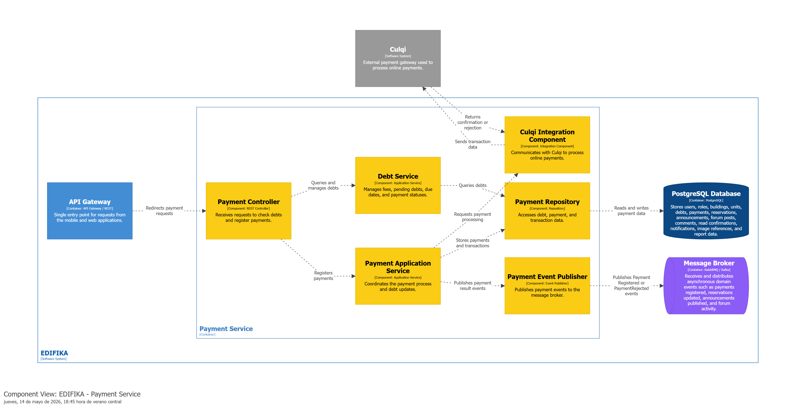

*Figura. Diagrama de Componentes — Payment Service. Elaborado utilizando Structurizr (Structurizr, s.f.).*

#### 4.2.4.6. Bounded Context Software Architecture Code Level Diagrams

##### 4.2.4.6.1. Bounded Context Domain Layer Class Diagrams

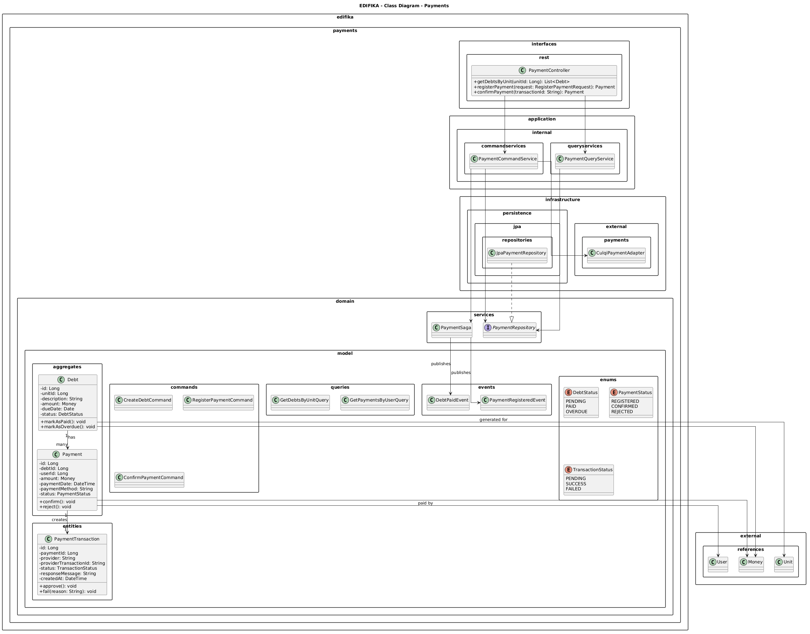

*Figura. Diagrama de Clases — Payment. Elaborado utilizando PlantUML Editor (PlantUML, s.f.).*

##### 4.2.4.6.2. Bounded Context Database Design Diagram


*Figura. Diagrama Entidad-Relación consolidado (incluye las tablas de Payment). Elaborado utilizando LucidChart (LucidChart, s.f.).*

---

### 4.2.5. Bounded Context: Notification

#### 4.2.5.1. Domain Layer

El agregado principal identificado es:

**Notification**: notificación dirigida a un destinatario, con tipo, canal, contenido y estado. La regla del contexto se resuelve mediante el Domain Service **NotificationRoutingService**.

## Aggregate: NotificationAggregate

### Entity: Notification

| Atributo | Tipo | Descripción |
|---|---|---|
| idNotification | Long | Identificador único de la notificación. |
| recipient | Recipient | Destinatario de la notificación. |
| type | NotificationType | Tipo de notificación. |
| channel | NotificationChannel | Canal de envío. |
| priority | Priority | Prioridad de la notificación. |
| content | String | Contenido de la notificación. |
| status | NotificationStatus | Estado de entrega. |

### Entity: DeviceToken

| Atributo | Tipo | Descripción |
|---|---|---|
| idToken | Long | Identificador único del token. |
| idUser | Long | Usuario propietario del dispositivo. |
| token | String | Token del dispositivo móvil sobre el que se entrega el push. |

### Entity: NotificationPreference

| Atributo | Tipo | Descripción |
|---|---|---|
| idPreference | Long | Identificador único de la preferencia. |
| idUser | Long | Usuario propietario de la preferencia. |
| type | NotificationType | Tipo de notificación configurado. |
| channel | NotificationChannel | Canal preferido para ese tipo (US12). |

## ValueObject: Recipient

| Atributo | Tipo | Descripción |
|---|---|---|
| idUser | Long | Identificador del destinatario. |

## Enumeration

| Enumeración | Valores |
|---|---|
| NotificationChannel | `PUSH`, `EMAIL`, `SMS` |
| Priority | `NORMAL`, `EMERGENCY` |
| NotificationStatus | `PENDING`, `SENT`, `FAILED`, `READ` |

## Domain Services

| Nombre | Responsabilidad | Reglas aplicadas |
|---|---|---|
| NotificationRoutingService | Resolver destinatarios y canal de entrega según las preferencias vigentes. | Una notificación de prioridad `EMERGENCY` se envía simultáneamente por push y por SMS e ignora las preferencias del usuario, porque US08 exige alcanzar a todos los residentes en menos de 5 segundos. |

#### 4.2.5.2. Interface Layer

**NotificationController**: bandeja y marcado de lectura del residente (US10). **DeviceTokenController**: registro y baja del token del dispositivo. **NotificationPreferenceController**: configuración de notificaciones (US12). Como *Consumers*: `AnnouncementEventConsumer`, `PaymentEventConsumer`, `ReservationEventConsumer`, `AccessEventConsumer`, `TelemetryAlertEventConsumer` e `IncidentEventConsumer`, suscritos por el broker a los seis contextos que publican eventos notificables.

#### 4.2.5.3. Application Layer

**Factory Pattern** (`NotificationFactory`) para crear el tipo de notificación (Push/Email/SMS) según el evento de origen, sin acoplar la creación a la lógica de envío.

## Event Handlers

| Handler | Evento de origen | Descripción |
|---|---|---|
| AnnouncementPublishedEventHandler | AnnouncementPublished | Notifica al residente el nuevo comunicado (US10). |
| PaymentApprovedEventHandler | PaymentApproved | Notifica la aprobación del pago. |
| DebtReminderScheduler | (job periódico) | Recordatorios de pago (US09). |
| ReservationApprovedEventHandler | ReservationApproved | Notifica al residente (US11) y al administrador (US31). |
| PhysicalAccessEventHandler | PhysicalAccessGranted / PhysicalAccessDenied | Notifica eventos de acceso físico. |
| TelemetryAlertEventHandler | AbnormalConsumptionDetected / LuminaireFailureDetected | Notifica alertas de telemetría. |
| IncidentReportedEventHandler | IncidentReported | Avisa al administrador con la ubicación exacta de la incidencia (US08 esc. 2). |
| EmergencyDeclaredEventHandler | EmergencyDeclared | Difusión `EMERGENCY` a todo el edificio por push y SMS en paralelo (US08 esc. 1). |

#### 4.2.5.4. Infrastructure Layer

## Repositories

| Repositorio | Responsabilidad |
|---|---|
| NotificationRepository | Persistencia de notificaciones. |
| DeviceTokenRepository | Persistencia de tokens de dispositivo. |
| NotificationPreferenceRepository | Persistencia de preferencias de notificación. |

Implementación JPA de los repositorios sobre PostgreSQL, con esquema propio del microservicio; cliente de **Firebase Cloud Messaging** (Anti-Corruption Layer) para el envío de notificaciones push y cliente de **Twilio** (Anti-Corruption Layer) para el envío de SMS, ambos invocados en paralelo —no en cascada— cuando la prioridad es `EMERGENCY`, de modo que el fallo o la lentitud de un canal no consuma el presupuesto de 5 segundos del otro; colas de reintento independientes por evento y compensación que marca la notificación como pendiente de reintento si el envío falla, sin afectar el estado del contexto que originó el evento.

#### 4.2.5.5. Bounded Context Software Architecture Component Level Diagrams

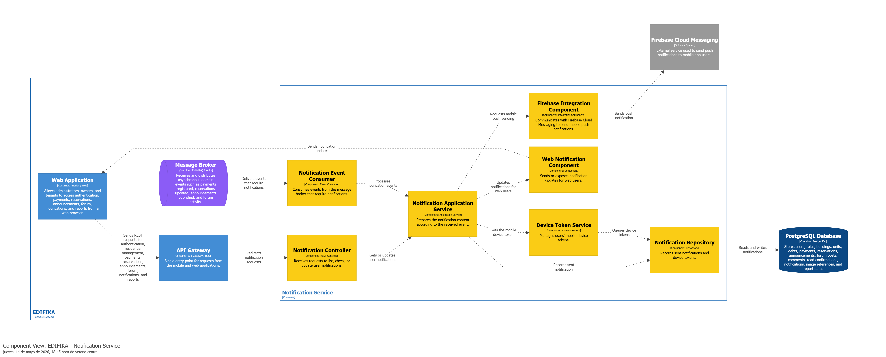

*Figura. Diagrama de Componentes — Notification Service. Elaborado utilizando Structurizr (Structurizr, s.f.).*

#### 4.2.5.6. Bounded Context Software Architecture Code Level Diagrams

##### 4.2.5.6.1. Bounded Context Domain Layer Class Diagrams

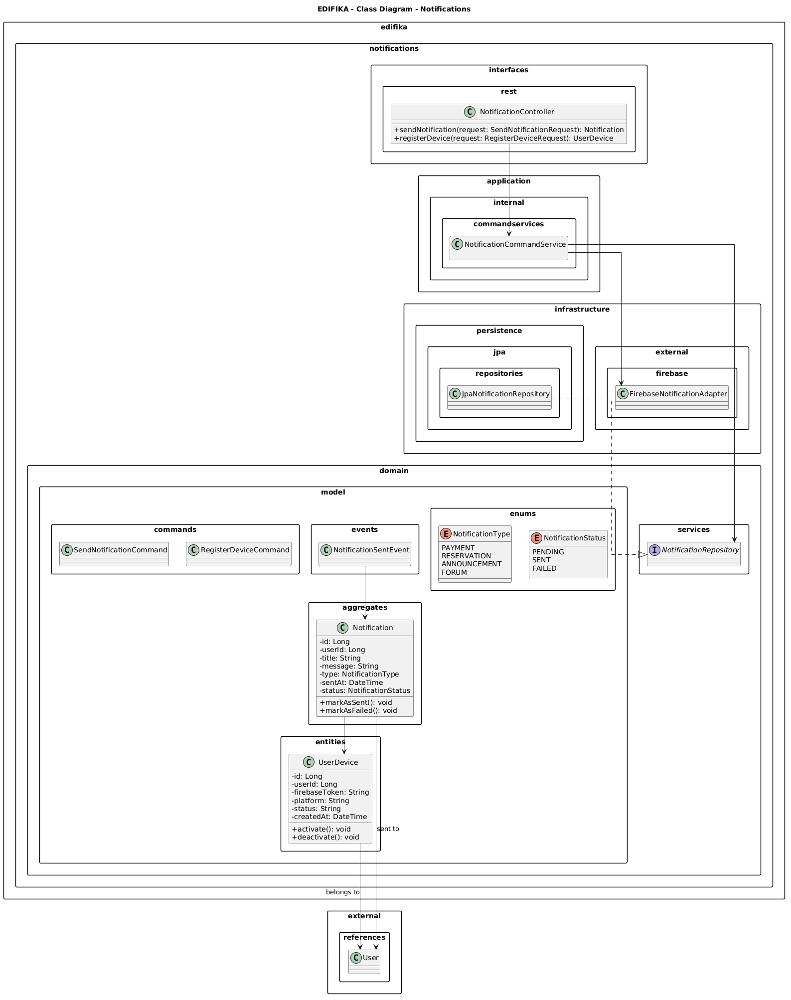

*Figura. Diagrama de Clases — Notification. Elaborado utilizando PlantUML Editor (PlantUML, s.f.).*

##### 4.2.5.6.2. Bounded Context Database Design Diagram


*Figura. Diagrama Entidad-Relación consolidado (incluye las tablas de Notification). Elaborado utilizando LucidChart (LucidChart, s.f.).*

---

### 4.2.6. Bounded Context: Communication

#### 4.2.6.1. Domain Layer

Los agregados identificados son:

**Announcement** (Comunicado): comunicado oficial con título, contenido, alcance y fecha de publicación. **Poll** (Encuesta): consulta a la comunidad con opciones, votos y estado (US36).

La terna *confirmación de lectura · segmentación · categorización* es la que exige la táctica de comunicación centralizada del proyecto.

## Aggregate: AnnouncementAggregate

### Entity: Announcement

| Atributo | Tipo | Descripción |
|---|---|---|
| idAnnouncement | Long | Identificador único del comunicado. |
| title | String | Título del comunicado. |
| content | String | Contenido del comunicado. |
| scope | AnnouncementScope | Segmentación por tipo de usuario. |
| category | AnnouncementCategory | Categoría del anuncio. |
| publishedAt | DateTime | Fecha de publicación. |

### Entity: ReadReceipt

| Atributo | Tipo | Descripción |
|---|---|---|
| idReceipt | Long | Identificador único del acuse. |
| idAnnouncement | AnnouncementId | Comunicado visualizado. |
| idResident | Long | Residente que lo visualizó. |
| readAt | DateTime | Momento de la lectura. Sostiene el seguimiento de alcance de US15. |

### Entity: Document

| Atributo | Tipo | Descripción |
|---|---|---|
| idDocument | Long | Identificador único del documento. |
| title | String | Título del documento. |
| fileReference | String | Referencia al archivo publicado. |

Normativa legal y manuales del edificio publicados para consulta (US32).

## Aggregate: PollAggregate

### Entity: Poll

| Atributo | Tipo | Descripción |
|---|---|---|
| idPoll | Long | Identificador único de la encuesta. |
| question | String | Pregunta de la encuesta. |
| status | PollStatus | Estado de la encuesta. |

## ValueObject: AnnouncementScope

| Atributo | Tipo | Descripción |
|---|---|---|
| value | String | Segmento de usuarios al que se dirige el comunicado. |

## ValueObject: PollOption

| Atributo | Tipo | Descripción |
|---|---|---|
| label | String | Texto de la opción. |
| votes | Int | Número de votos recibidos. |

## Enumeration

| Enumeración | Valores |
|---|---|
| AnnouncementCategory | `MANTENIMIENTO`, `ADMINISTRATIVO`, `EVENTO`, `SEGURIDAD`, `OTRO` |
| PollStatus | `OPEN`, `CLOSED` |

## Domain Services

| Nombre | Responsabilidad | Reglas aplicadas |
|---|---|---|
| ReachTrackingService | Consolidar el alcance real de un comunicado a partir de sus acuses de lectura. | — |
| PollVotingService | Garantizar el voto único por residente y encuesta. | Un residente no puede votar dos veces la misma encuesta. |

#### 4.2.6.2. Interface Layer

**AnnouncementController**: publicación de comunicados oficiales y consulta del histórico (US13, US14). **ReadReceiptController**: seguimiento de visualización (US15). **PollController**: creación, votación y cierre de encuestas (US36). **DocumentController**: consulta de leyes y manuales del edificio (US32).

#### 4.2.6.3. Application Layer

## Communication Command Handler

| Capability | Command Handler | Descripción |
|---|---|---|
| Publicar comunicado | AnnouncementCommandService.handle(PublishAnnouncementCommand) | Guarda el comunicado y emite `AnnouncementPublished`, que dispara la Saga coreografiada de notificación. |
| Votar encuesta | PollCommandService.handle(VotePollCommand) | Valida el voto único por encuesta, **HTTP 409** si se duplica. |
| Publicar documento | DocumentCommandService.handle(PublishDocumentCommand) | Publica una normativa o manual del edificio. |

`CommunicationQueryService` resuelve el muro de anuncios y los resultados de encuesta. Valida además el límite de un mensaje diario por residente (**HTTP 429** si se excede). El contexto publica `AnnouncementPublished` y `PollClosed`.

#### 4.2.6.4. Infrastructure Layer

## Repositories

| Repositorio | Responsabilidad |
|---|---|
| AnnouncementRepository | Persistencia de comunicados. |
| PollRepository | Persistencia de encuestas. |
| ReadReceiptRepository | Persistencia de acuses de lectura. |
| DocumentRepository | Persistencia de documentos normativos. |

Implementación JPA de los repositorios sobre PostgreSQL, con esquema propio del microservicio; **Adapter Pattern (Anti-Corruption Layer)** hacia **Cloudinary** para el almacenamiento y la entrega de las imágenes adjuntas a los comunicados; publicador AMQP de los eventos del contexto.

#### 4.2.6.5. Bounded Context Software Architecture Component Level Diagrams

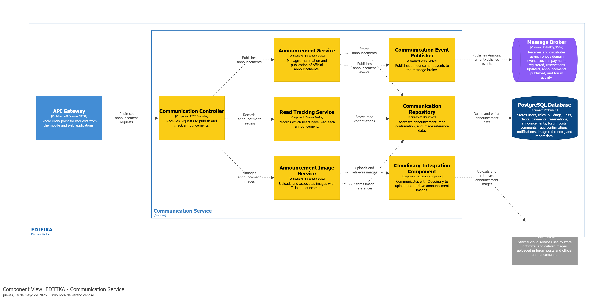

*Figura. Diagrama de Componentes — Communication Service. Elaborado utilizando Structurizr (Structurizr, s.f.).*

#### 4.2.6.6. Bounded Context Software Architecture Code Level Diagrams

##### 4.2.6.6.1. Bounded Context Domain Layer Class Diagrams

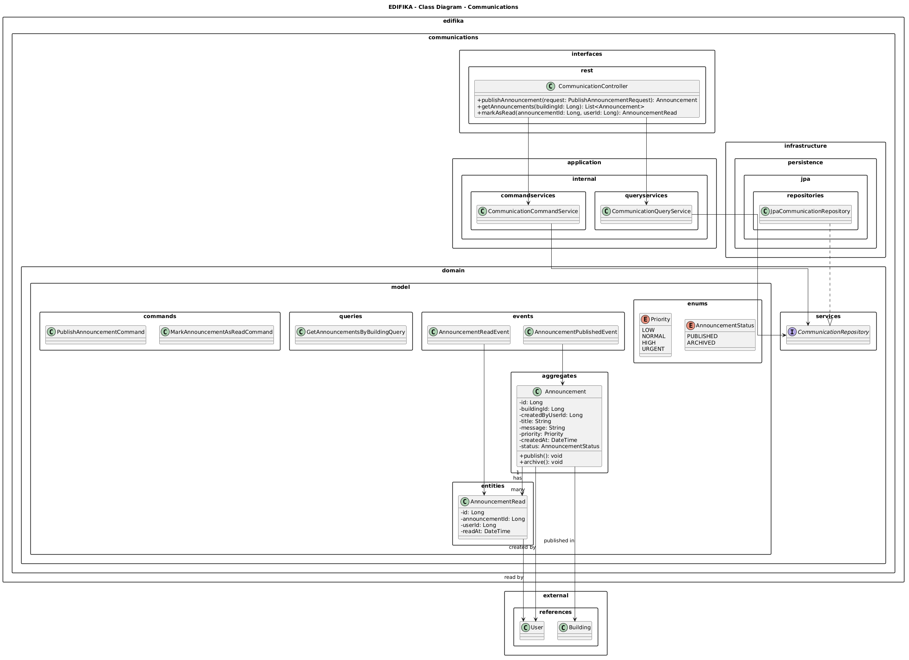

*Figura. Diagrama de Clases — Communication. Elaborado utilizando PlantUML Editor (PlantUML, s.f.).*

##### 4.2.6.6.2. Bounded Context Database Design Diagram


*Figura. Diagrama Entidad-Relación consolidado (incluye las tablas de Communication). Elaborado utilizando LucidChart (LucidChart, s.f.).*

---

### 4.2.7. Bounded Context: Forum

#### 4.2.7.1. Domain Layer

El agregado principal identificado es:

**Post**: publicación del muro comunitario con autor, contenido, fecha y estado. El estado `HIDDEN` es aplicado por la moderación de US37.

## Aggregate: PostAggregate

### Entity: Post

| Atributo | Tipo | Descripción |
|---|---|---|
| idPost | Long | Identificador único de la publicación. |
| idAuthor | Long | Residente autor de la publicación. |
| content | PostContent | Contenido de la publicación. |
| createdAt | DateTime | Fecha de creación. |
| status | PostStatus | Estado de visibilidad. |

### Entity: Comment

| Atributo | Tipo | Descripción |
|---|---|---|
| idComment | Long | Identificador único del comentario. |
| idPost | PostId | Publicación a la que responde. |
| idAuthor | Long | Residente autor del comentario. |
| content | String | Contenido del comentario. |

### Entity: ModerationAction

| Atributo | Tipo | Descripción |
|---|---|---|
| idAction | Long | Identificador único de la acción. |
| idPost | PostId | Publicación moderada. |
| idAdmin | Long | Administrador que ejecutó la acción. |
| reason | String | Motivo del ocultamiento. |
| actionAt | DateTime | Momento de la acción. Registro auditable de qué administrador ocultó qué publicación y por qué motivo. |

## ValueObject: PostContent

| Atributo | Tipo | Descripción |
|---|---|---|
| text | String | Texto de la publicación. |

## ValueObject: DailyPostQuota

| Atributo | Tipo | Descripción |
|---|---|---|
| maxPerDay | Int | Límite diario de publicaciones por residente. |

## Enumeration

| Enumeración | Valores |
|---|---|
| PostStatus | `VISIBLE`, `HIDDEN` |

## Domain Services

| Nombre | Responsabilidad | Reglas aplicadas |
|---|---|---|
| PostQuotaService | Hacer cumplir el límite diario de publicaciones por residente. | — |
| ModerationService | Aplicar y revertir el ocultamiento de contenido inapropiado. | — |

#### 4.2.7.2. Interface Layer

**PostController**: publicación y consulta de mensajes del muro del edificio (US29). **CommentController**: respuestas a una publicación. **ModerationController**: revisión y ocultamiento de mensajes inapropiados por el administrador (US37).

#### 4.2.7.3. Application Layer

## Forum Command Handler

| Capability | Command Handler | Descripción |
|---|---|---|
| Publicar mensaje | PostCommandService.handle(CreatePostCommand) | Valida el límite diario de publicaciones vía `PostQuotaService`, **HTTP 429** si se excede. |
| Comentar publicación | CommentCommandService.handle(CreateCommentCommand) | Registra la respuesta a una publicación. |
| Moderar publicación | ModerationCommandService.handle(HidePostCommand) | Oculta una publicación inapropiada y registra la `ModerationAction`. |

`ForumQueryService` resuelve el muro del edificio filtrando las publicaciones ocultas.

#### 4.2.7.4. Infrastructure Layer

## Repositories

| Repositorio | Responsabilidad |
|---|---|
| PostRepository | Persistencia de publicaciones. |
| CommentRepository | Persistencia de comentarios. |
| ModerationActionRepository | Persistencia de acciones de moderación. |

Implementación JPA de los repositorios sobre PostgreSQL, con esquema propio del microservicio; **Adapter Pattern (Anti-Corruption Layer)** hacia **Cloudinary** para las imágenes adjuntas a las publicaciones del foro.

#### 4.2.7.5. Bounded Context Software Architecture Component Level Diagrams

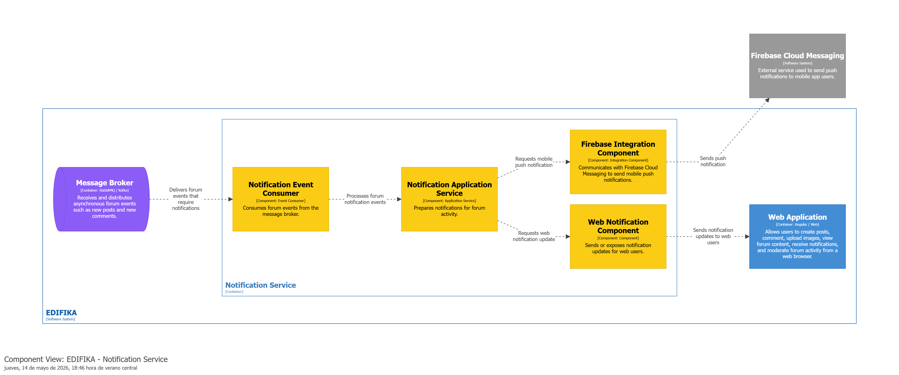

*Figura. Diagrama de Componentes — Forum Service. Elaborado utilizando Structurizr (Structurizr, s.f.). La figura presenta en un mismo lienzo los componentes de Forum y de Notification.*

#### 4.2.7.6. Bounded Context Software Architecture Code Level Diagrams

##### 4.2.7.6.1. Bounded Context Domain Layer Class Diagrams

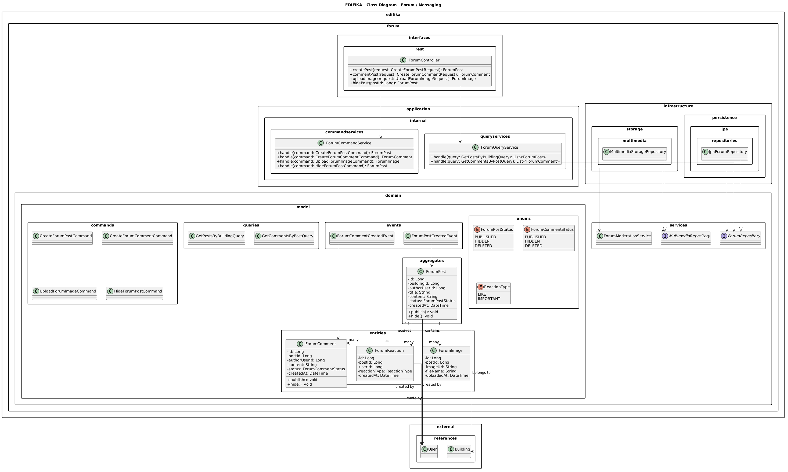

*Figura. Diagrama de Clases — Forum. Elaborado utilizando PlantUML Editor (PlantUML, s.f.).*

##### 4.2.7.6.2. Bounded Context Database Design Diagram


*Figura. Diagrama Entidad-Relación consolidado (incluye las tablas de Forum). Elaborado utilizando LucidChart (LucidChart, s.f.).*

---

### 4.2.8. Bounded Context: Report

#### 4.2.8.1. Domain Layer

Al ser un contexto mayormente de solo lectura (CQRS), **no posee agregados transaccionales propios**: su modelo son proyecciones construidas sobre datos de los que Payment e IoT Telemetry & Analytics siguen siendo dueños.

## Read Models

| Read Model | Descripción |
|---|---|
| FinancialReport | Consolidado de ingresos, egresos y deudas por periodo. |
| DelinquencyReport | Morosidad por unidad. |
| EnergyConsumptionReport | Consumo energético del edificio, alimentado por IoT Telemetry & Analytics. |

## ValueObject: ReportPeriod

| Atributo | Tipo | Descripción |
|---|---|---|
| from | Date | Inicio del periodo del reporte. |
| to | Date | Fin del periodo del reporte. |

## Enumeration

| Enumeración | Valores |
|---|---|
| ExportFormat | `PDF`, `EXCEL` |

## Domain Services

| Nombre | Responsabilidad |
|---|---|
| ReportConsolidationService | Unificar en una sola vista los datos que llegan de Payment e IoT Telemetry & Analytics. |

#### 4.2.8.2. Interface Layer

**ReportController**: generación de reportes financieros y de morosidad (US25). **ReportExportController**: exportación del reporte en el formato solicitado para compartirlo con la comunidad (US26).

#### 4.2.8.3. Application Layer

`ReportQueryService` consulta a Payment vía REST y consolida el reporte (Dashboard financiero). `ReportExportCommandService` gestiona la exportación. **Factory Pattern** (`ReportExporterFactory`) para generar el archivo de salida en el formato solicitado (PDF o Excel) sin acoplar la lógica de creación a la de exportación.

#### 4.2.8.4. Infrastructure Layer

`PaymentQueryClient` y `TelemetryQueryClient`, clientes REST síncronos hacia Payment Service e IoT Telemetry & Analytics Service; generador de archivos PDF/Excel. Este contexto no persiste datos de negocio propios: su "persistencia" es la de los contextos que consulta.

#### 4.2.8.5. Bounded Context Software Architecture Component Level Diagrams

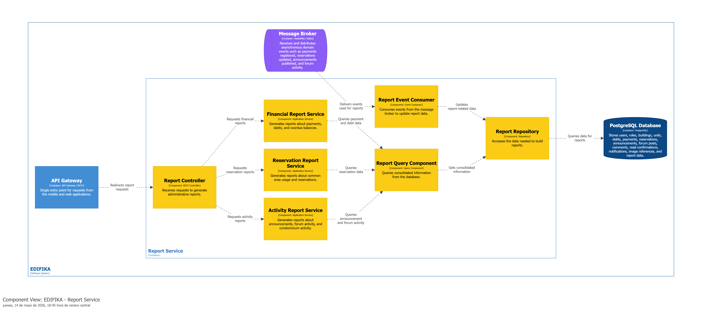

*Figura. Diagrama de Componentes — Report Service. Elaborado utilizando Structurizr (Structurizr, s.f.).*

#### 4.2.8.6. Bounded Context Software Architecture Code Level Diagrams

##### 4.2.8.6.1. Bounded Context Domain Layer Class Diagrams

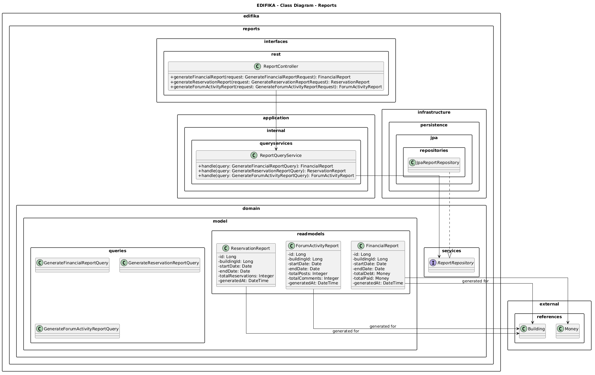

*Figura. Diagrama de Clases — Report. Elaborado utilizando PlantUML Editor (PlantUML, s.f.).*

##### 4.2.8.6.2. Bounded Context Database Design Diagram


*Figura. Diagrama Entidad-Relación consolidado.*

---

### 4.2.9. Bounded Context: IoT Access Management

#### 4.2.9.1. Domain Layer

El agregado principal identificado es:

**AccessCredential**: credencial de acceso de un residente, con tipo RFID , identificador, titular, vigencia y estado. La regla de negocio central del contexto se resuelve mediante el Domain Service **AccessDecisionService**.

## Aggregate: AccessCredentialAggregate

### Entity: AccessCredential

| Atributo | Tipo | Descripción |
|---|---|---|
| idCredential | Long | Identificador único de la credencial. |
| idResident | Long | Titular de la credencial. |
| type | CredentialType | Tipo de credencial (RFID). |
| identifier | RfidUid | Identificador físico o token de la credencial. |
| validFrom | DateTime | Inicio de vigencia. |
| validUntil | DateTime | Fin de vigencia. |
| status | CredentialStatus | Estado de la credencial. |

### Entity: AccessPermission

| Atributo | Tipo | Descripción |
|---|---|---|
| idPermission | Long | Identificador único del permiso. |
| idResident | Long | Residente habilitado. |
| idCommonArea | Long | Área común habilitada. |
| window | TimeWindow | Ventana horaria vigente del permiso. |

Habilitación de un residente sobre un área común, derivada de una reserva aprobada y acotada a su ventana horaria.

### Entity: AccessAttempt

| Atributo | Tipo | Descripción |
|---|---|---|
| idAttempt | Long | Identificador único del intento. |
| deviceId | String | Dispositivo en el que se registró el intento. |
| credentialPresented | String | Credencial presentada. |
| result | AccessResult | Resultado del intento. |
| occurredAt | DateTime | Marca de tiempo del intento. |

Bitácora auditable del contexto.

## ValueObject: RfidUid

| Atributo | Tipo | Descripción |
|---|---|---|
| value | String | Identificador único de la tarjeta RFID. |


## Enumeration

| Enumeración | Valores |
|---|---|
| CredentialStatus | `ACTIVE`, `SUSPENDED`, `REVOKED` |
| AccessResult | `GRANTED`, `DENIED` |

## Domain Services

| Nombre | Responsabilidad | Reglas aplicadas |
|---|---|---|
| AccessDecisionService | Resolver si una credencial concede acceso. | Una credencial concede acceso solo si está activa, el residente no está moroso y existe un permiso vigente para esa área en ese instante. |

#### 4.2.9.2. Interface Layer

**AccessCredentialController**: emisión, suspensión y revocación de credenciales RFID. **AccessController**: dar acceso a tarjetas. **DoorControlController**: apertura remota por parte del administrador. **AccessAuditController**: consulta de la bitácora de accesos. Como *Consumers*: `ReservationEventConsumer` y `PaymentEventConsumer`, suscritos a los eventos que llegan por el broker.

#### 4.2.9.3. Application Layer

## Access Command Handler

| Capability | Command Handler | Descripción |
|---|---|---|
| Emitir/suspender/revocar credencial | AccessCredentialCommandService.handle(...) | Gestiona el ciclo de vida de la credencial RFID. |


`AccessQueryService` resuelve las consultas de credenciales, permisos y bitácora.

## Event Handlers

| Handler | Evento de origen | Descripción |
|---|---|---|
| ReservationApprovedEventHandler | ReservationApproved | Crea el `AccessPermission` temporal para el área reservada. |
| ResidentMarkedDelinquentEventHandler | ResidentMarkedDelinquent | Suspende las credenciales del residente moroso. |

Tras cada resolución de acceso el contexto publica `PhysicalAccessGranted` o `PhysicalAccessDenied`.

#### 4.2.9.4. Infrastructure Layer

## Repositories

| Repositorio | Responsabilidad |
|---|---|
| AccessCredentialRepository | Persistencia de credenciales. |
| AccessPermissionRepository | Persistencia de permisos de acceso. |
| AccessAttemptRepository | Persistencia de la bitácora de intentos. |

Implementación JPA de los repositorios sobre PostgreSQL; `EdgeGatewaySyncClient`, cliente REST que empuja al Edge API las credenciales activas, las reservas vigentes y la blacklist para que el condominio siga operando sin conexión; publicador AMQP/MQTT de los eventos del contexto.

#### 4.2.9.5. Bounded Context Software Architecture Component Level Diagrams

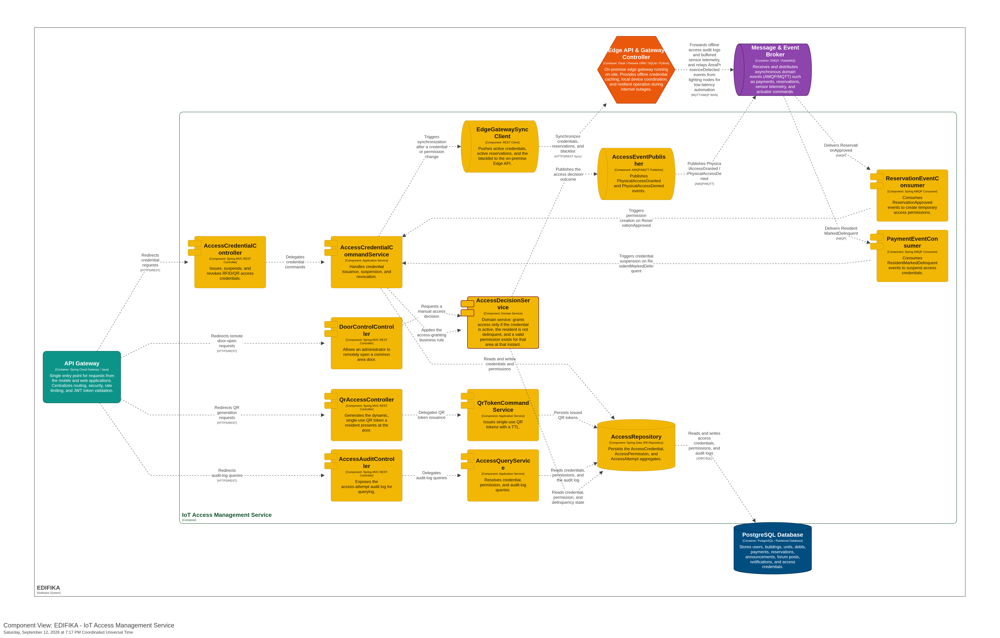

*Figura. Diagrama de Componentes — IoT Access Management Service. Elaborado utilizando Structurizr (Structurizr, s.f.).*

#### 4.2.9.6. Bounded Context Software Architecture Code Level Diagrams

##### 4.2.9.6.1. Bounded Context Domain Layer Class Diagrams

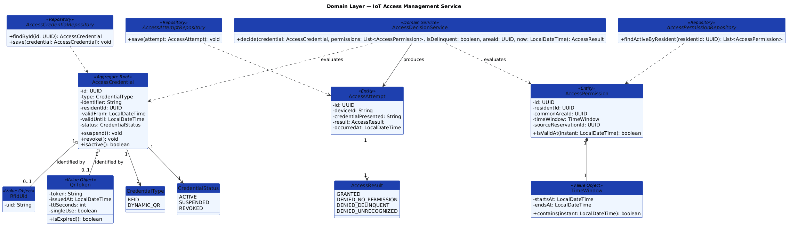

*Figura. Diagrama de Clases — IoT Access Management. Elaborado con PlantUML.*

##### 4.2.9.6.2. Bounded Context Database Design Diagram

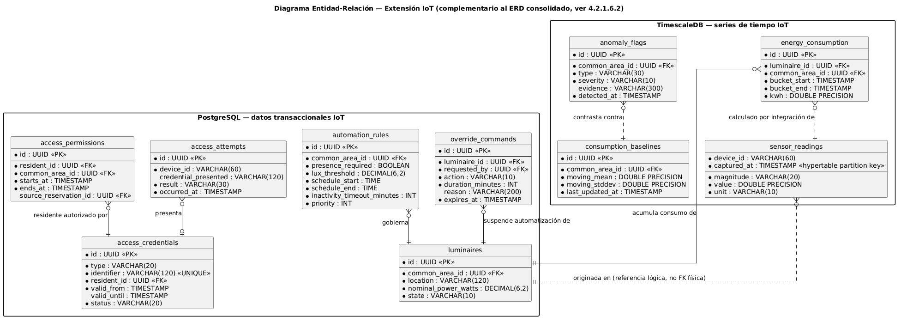

*Figura. Diagrama Entidad-Relación — extensión IoT. Elaborado con PlantUML.*

---

### 4.2.10. Bounded Context: Smart Lighting & Automation

#### 4.2.10.1. Domain Layer

El agregado principal identificado es:

**AutomationRule**: regla que gobierna una o varias luminarias de un área común, con condición de presencia, umbral de lux, franja horaria, duración de apagado por inactividad y prioridad frente a otras reglas. La regla se resuelve mediante el Domain Service **AutomationDecisionService**, que combina presencia, lux ambiental, horario de reserva y anulación vigente, aplicando la precedencia entre reglas.

## Aggregate: AutomationRuleAggregate

### Entity: AutomationRule

| Atributo | Tipo | Descripción |
|---|---|---|
| idRule | Long | Identificador único de la regla. |
| idCommonArea | Long | Área común a la que aplica. |
| presenceRequired | Boolean | Condición de presencia. |
| luxThreshold | LuxThreshold | Umbral de lux para activar la regla. |
| schedule | LightingSchedule | Franja horaria de la regla. |
| inactivityTimeout | PresenceTimeout | Duración de apagado por inactividad. |
| priority | Int | Prioridad frente a otras reglas. |

### Entity: Luminaire

| Atributo | Tipo | Descripción |
|---|---|---|
| idLuminaire | Long | Identificador único de la luminaria. |
| location | String | Ubicación física de la luminaria. |
| idCommonArea | Long | Área común asociada. |
| nominalPower | Decimal | Potencia nominal. |
| state | LuminaireState | Estado ON/OFF. |

### Entity: OverrideCommand

| Atributo | Tipo | Descripción |
|---|---|---|
| idOverride | Long | Identificador único del comando. |
| idLuminaire | Long | Luminaria afectada. |
| requestedBy | Long | Usuario que solicita el override. |
| action | OverrideAction | Encendido o apagado manual solicitado. |
| duration | Duration | Duración del override. |
| reason | String | Motivo del override, que suspende temporalmente la automatización. |

## ValueObject: LuxThreshold

| Atributo | Tipo | Descripción |
|---|---|---|
| value | Decimal | Umbral de lux ambiental. |

## ValueObject: PresenceTimeout

| Atributo | Tipo | Descripción |
|---|---|---|
| seconds | Int | Tiempo de inactividad antes de apagar. |

## ValueObject: LightingSchedule

| Atributo | Tipo | Descripción |
|---|---|---|
| start | Time | Inicio de la franja horaria. |
| end | Time | Fin de la franja horaria. |

## ValueObject: BrightnessLevel

| Atributo | Tipo | Descripción |
|---|---|---|
| value | Decimal | Nivel de brillo objetivo. |

## Enumeration

| Enumeración | Valores |
|---|---|
| LuminaireState | `ON`, `OFF` |
| OverrideAction | `ON`, `OFF` |

## Domain Services

| Nombre | Responsabilidad | Reglas aplicadas |
|---|---|---|
| AutomationDecisionService | Resolver el estado objetivo de cada luminaria. | Combina presencia, lux ambiental, horario de reserva y anulación vigente, aplicando la precedencia entre reglas. |

#### 4.2.10.2. Interface Layer

**AutomationRuleController**: CRUD de reglas de automatización por parte del administrador. **LightingOverrideController**: encendido/apagado manual desde la aplicación del residente o del administrador. **LuminaireController**: registro y consulta de luminarias y su estado. Como *Consumer*: `PresenceEventConsumer`, suscrito a los eventos de presencia y de inicio de reserva.

#### 4.2.10.3. Application Layer

## Event Handlers

| Handler | Evento de origen | Descripción |
|---|---|---|
| AreaPresenceDetectedEventHandler | AreaPresenceDetected | Enciende según la regla vigente cuando se detecta presencia y el lux ambiental está por debajo del umbral. |
| ReservationStartedEventHandler | ReservationStarted | Enciende de forma programada el área al iniciar la reserva. |

`AutomationRuleCommandService`, `OverrideCommandService` (aplica el override y programa su expiración) y `LightingQueryService` completan la capa. El contexto publica `LuminaireTurnedOn`, `LuminaireTurnedOff` y `OverrideTriggered`.

Los dos eventos consumidos por este contexto se cerraron de la siguiente forma:

- **`AreaPresenceDetected`** lo publica el **Edge API**, no Telemetry: el Edge reenvía la lectura cruda del sensor PIR del nodo de iluminación como evento tan pronto la recibe por MQTT local, priorizando la latencia de encendido sobre la interpretación de dominio (que sí aplica Telemetry para sus propios fines analíticos, pero por una ruta de datos separada).
- **`ReservationStarted`** lo publica **Reservation**, mediante un scheduler interno que revisa periódicamente las reservas cuya ventana horaria acaba de comenzar — se mantiene toda la lógica de reservas en un único contexto en vez de que Smart Lighting consulte el calendario de Reservation por su cuenta.

#### 4.2.10.4. Infrastructure Layer

## Repositories

| Repositorio | Responsabilidad |
|---|---|
| AutomationRuleRepository | Persistencia de reglas de automatización. |
| LuminaireRepository | Persistencia de luminarias. |
| OverrideCommandRepository | Persistencia de comandos de override. |

Implementación JPA de los repositorios sobre PostgreSQL; `EdgeCommandPublisher`, que envía por MQTT/REST al Edge API las reglas de programación y los comandos de override para que este los ejecute localmente sobre los nodos de iluminación; publicador AMQP/MQTT de los eventos del contexto.

#### 4.2.10.5. Bounded Context Software Architecture Component Level Diagrams

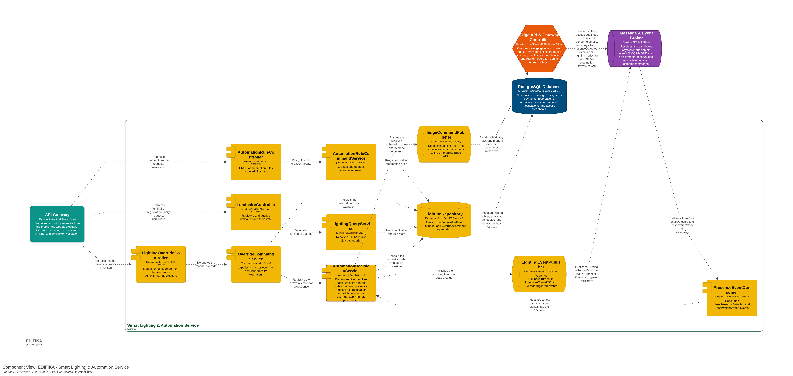

*Figura. Diagrama de Componentes — Smart Lighting & Automation Service. Elaborado utilizando Structurizr (Structurizr, s.f.).*

#### 4.2.10.6. Bounded Context Software Architecture Code Level Diagrams

##### 4.2.10.6.1. Bounded Context Domain Layer Class Diagrams

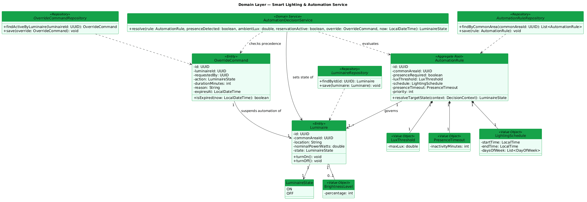

*Figura. Diagrama de Clases — Smart Lighting & Automation. Elaborado con PlantUML.*

##### 4.2.10.6.2. Bounded Context Database Design Diagram

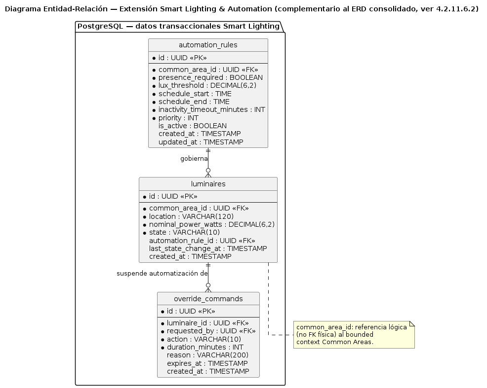

*Figura. Diagrama Entidad-Relación — extensión Smart Lighting & Automation. Elaborado con PlantUML.*

---

### 4.2.11. Bounded Context: IoT Telemetry & Analytics

#### 4.2.11.1. Domain Layer

El agregado principal identificado es:

**EnergyConsumption**: consumo acumulado de una luminaria o área común en un periodo, calculado por integración de la potencia instantánea en el tiempo, `kWh = Σ(V × I × Δt) / 1000`.

## Aggregate: EnergyConsumptionAggregate

### Entity: EnergyConsumption

| Atributo | Tipo | Descripción |
|---|---|---|
| idConsumption | Long | Identificador único del registro. |
| idLuminaire | Long | Luminaria o área común medida. |
| bucket | TimeBucket | Periodo de agregación. |
| kwh | Decimal | Consumo acumulado en kWh. |

### Entity: ConsumptionBaseline

| Atributo | Tipo | Descripción |
|---|---|---|
| idBaseline | Long | Identificador único de la línea base. |
| idCommonArea | Long | Área a la que corresponde la línea base. |
| movingMean | Decimal | Media móvil de consumo. |
| movingStdDev | Decimal | Desviación estándar móvil. |

Línea base estadística por área contra la que se contrasta el consumo observado.

### Entity: AnomalyFlag

| Atributo | Tipo | Descripción |
|---|---|---|
| idFlag | Long | Identificador único de la marca. |
| type | String | Tipo de anomalía. |
| severity | String | Severidad de la anomalía. |
| evidence | String | Evidencia de la anomalía. |
| detectedAt | DateTime | Momento de la detección. |

## ValueObject: SensorReading
Value Object inmutable.

| Atributo | Tipo | Descripción |
|---|---|---|
| deviceId | String | Dispositivo de origen. |
| magnitudeType | String | Tipo de magnitud (presencia, lux o corriente). |
| value | Decimal | Valor de la lectura. |
| unit | MeasurementUnit | Unidad de medida. |
| capturedAt | DateTime | Marca de tiempo de la lectura. |

## ValueObject: MeasurementUnit

| Atributo | Tipo | Descripción |
|---|---|---|
| value | String | Unidad de medida de la lectura. |

## ValueObject: TimeBucket

| Atributo | Tipo | Descripción |
|---|---|---|
| start | DateTime | Inicio del bucket temporal. |
| end | DateTime | Fin del bucket temporal. |

## ValueObject: ZScore

| Atributo | Tipo | Descripción |
|---|---|---|
| value | Decimal | Puntuación Z usada para contrastar contra la baseline. |

## Domain Services

| Nombre | Responsabilidad | Reglas aplicadas |
|---|---|---|
| EnergyCalculationService | Integración temporal de la potencia. | `kWh = Σ(V × I × Δt) / 1000`. |
| DeviceHealthService | Evaluar el *heartbeat* de cada dispositivo. | Marca el dispositivo `OFFLINE` cuando deja de emitir durante el tiempo límite configurado (TS16, TS17). |
| AnomalyDetectionService | Comparar la muestra contra la baseline. | Distingue consumo anómalo de falla de luminaria, esta última caracterizada por corriente nula con la luminaria comandada en ON. |

#### 4.2.11.2. Interface Layer

**TelemetryQueryController**: series temporales y agregados que alimentan los dashboards de la Web Application. **EnergyReportController**: consumo por área y por periodo. **AnomalyController**: consulta de anomalías detectadas. Como *Consumer*: `TelemetryIngestionConsumer`, suscrito por MQTT a las lecturas crudas que el Edge API reenvía al broker.

#### 4.2.11.3. Application Layer

`TelemetryIngestionService` (valida, normaliza y persiste la lectura entrante), `EnergyCalculationCommandService` (recalcula el consumo del bucket temporal afectado), `BaselineRecalculationService` (actualiza media y desviación móviles), `AnomalyDetectionHandler` (evalúa cada nueva agregación contra la baseline), `DeviceHealthMonitor` (job periódico que detecta la ausencia de mensajes de un dispositivo, lo marca `OFFLINE`, descarta los comandos pendientes hacia él y notifica al administrador sin afectar la comunicación con el resto) y `TelemetryQueryService` (resuelve las consultas de los dashboards). El contexto publica `AbnormalConsumptionDetected`, `LuminaireFailureDetected` y `DeviceWentOffline`.

#### 4.2.11.4. Infrastructure Layer

## Repositories

| Repositorio | Responsabilidad |
|---|---|
| TelemetryRepository | Persistencia de lecturas crudas (`sensor_readings`, hypertable). |
| EnergyConsumptionRepository | Persistencia del consumo agregado. |
| BaselineRepository | Persistencia de las líneas base de consumo. |

Implementación del repositorio de series sobre **TimescaleDB** —hypertables particionadas por tiempo y agregados continuos para resolver las consultas del dashboard sin recorrer la serie cruda—, a diferencia del resto de contextos, que persisten en PostgreSQL relacional. Suscriptor MQTT hacia el broker y publicador AMQP/MQTT de los eventos de alerta.

#### 4.2.11.5. Bounded Context Software Architecture Component Level Diagrams

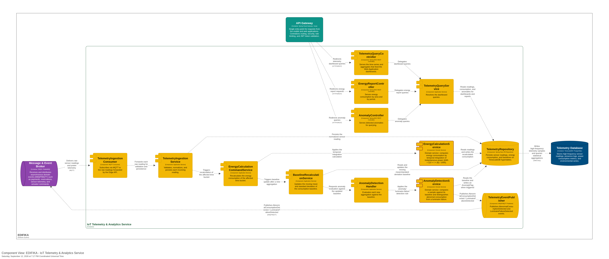

*Figura. Diagrama de Componentes — IoT Telemetry & Analytics Service. Elaborado utilizando Structurizr (Structurizr, s.f.).*

#### 4.2.11.6. Bounded Context Software Architecture Code Level Diagrams

##### 4.2.11.6.1. Bounded Context Domain Layer Class Diagrams

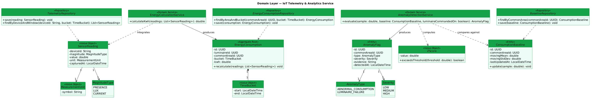

*Figura. Diagrama de Clases — IoT Telemetry & Analytics. Elaborado con PlantUML.*

##### 4.2.11.6.2. Bounded Context Database Design Diagram

Por su naturaleza de series temporales, las tablas de este contexto (`sensor_readings` como hypertable, más `energy_consumption`, `consumption_baselines` y `anomaly_flags`) no forman parte del ERD relacional consolidado (LucidChart, solo PostgreSQL). Se documentan en el mismo ERD complementario de IoT Access Management, separadas en su propio paquete TimescaleDB:


*Figura. Diagrama Entidad-Relación — extensión IoT, paquete TimescaleDB (`sensor_readings`, `energy_consumption`, `consumption_baselines`, `anomaly_flags`). Elaborado con PlantUML.*

### 4.2.12. Bounded Context: Water Pump Leak Detection

#### 4.2.12.1. Domain Layer

El agregado principal identificado es:

**LeakDetectionRule** (Aggregate Root: regla que gobierna una o varias bombas de agua, con umbral de caudal, umbral de presión, franja horaria de consumo esperado y duración mínima de desviación antes de declarar una fuga), **WaterPump** (Entity: bomba física con ubicación, zona asociada, potencia nominal y estado `ON`/`OFF`/`FAULT`), **LeakAlert** (Entity: evento de fuga detectado, con severidad, evidencia y estado de resolución). Value Objects: `FlowThreshold`, `PressureThreshold`, `FlowRate`, `LeakSeverity`. Domain Service: **LeakDetectionService**, que compara la lectura de caudal y presión contra la línea base esperada de la zona y distingue una fuga real de un consumo legítimo fuera de horario. Interfaces `LeakDetectionRuleRepository`, `WaterPumpRepository` y `LeakAlertRepository`.

## Aggregate: LeakDetectionRuleAggregate

### Entity: LeakDetectionRule

| Atributo | Tipo | Descripción |
|---|---|---|
| idRule | Long | Identificador único de la regla. |
| idZone | Long | Zona hidráulica a la que aplica. |
| flowThreshold | FlowThreshold | Caudal máximo esperado fuera de horario de consumo. |
| pressureThreshold | PressureThreshold | Caída de presión mínima que dispara la evaluación. |
| expectedWindow | LightingSchedule | Franja horaria de consumo esperado. |
| minDeviationMinutes | Int | Duración mínima de desviación antes de declarar fuga. |
| isActive | Boolean | Indica si la regla está vigente. |

## Aggregate: WaterPumpAggregate

### Entity: WaterPump

| Atributo | Tipo | Descripción |
|---|---|---|
| idPump | Long | Identificador único de la bomba. |
| idZone | Long | Zona hidráulica asociada. |
| location | String | Ubicación física de la bomba. |
| nominalFlow | Decimal | Caudal nominal de la bomba. |
| state | PumpState | Estado actual de la bomba. |

### Entity: LeakAlert

| Atributo | Tipo | Descripción |
|---|---|---|
| idAlert | Long | Identificador único de la alerta. |
| idPump | PumpId | Bomba en la que se detectó la desviación. |
| severity | LeakSeverity | Severidad de la fuga detectada. |
| evidence | String | Lectura de caudal/presión que sustenta la alerta. |
| detectedAt | DateTime | Momento de la detección. |
| resolvedAt | DateTime | Momento de resolución (si aplica). |
| status | LeakAlertStatus | Estado de la alerta. |

## ValueObject: FlowThreshold

| Atributo | Tipo | Descripción |
|---|---|---|
| value | Decimal | Caudal límite antes de considerar una posible fuga. |

## ValueObject: PressureThreshold

| Atributo | Tipo | Descripción |
|---|---|---|
| value | Decimal | Caída de presión mínima que activa la evaluación. |

## ValueObject: FlowRate

| Atributo | Tipo | Descripción |
|---|---|---|
| value | Decimal | Caudal instantáneo medido. |
| unit | String | Unidad de medida del caudal. |

## Enumeration

| Enumeración | Valores |
|---|---|
| PumpState | `ON`, `OFF`, `FAULT` |
| LeakSeverity | `LOW`, `MEDIUM`, `HIGH` |
| LeakAlertStatus | `OPEN`, `ACKNOWLEDGED`, `RESOLVED` |

## Domain Services

| Nombre | Responsabilidad | Reglas aplicadas |
|---|---|---|
| LeakDetectionService | Distinguir una fuga real de un consumo legítimo. | Un caudal por encima del umbral fuera de la franja horaria esperada, sostenido más allá de la duración mínima configurada, se declara fuga. Una caída de presión sin caudal correspondiente marca la bomba como `FAULT`. |

#### 4.2.12.2. Interface Layer

**LeakDetectionRuleController**: CRUD de reglas de detección por parte del administrador. **WaterPumpController**: registro y consulta de bombas y su estado. **LeakAlertController**: consulta y resolución de alertas de fuga. **PumpControlController**: apagado remoto manual de una bomba. Como *Consumer*: `FlowReadingEventConsumer`, suscrito a las lecturas de caudal y presión que reenvía el Edge API.

#### 4.2.12.3. Application Layer

## Event Handlers

| Handler | Evento de origen | Descripción |
|---|---|---|
| FlowReadingReceivedEventHandler | FlowReadingReceived | Evalúa la lectura contra `LeakDetectionService`; si corresponde, crea la `LeakAlert` y ordena el corte de la bomba. |

`LeakDetectionRuleCommandService`, `PumpControlCommandService` (ejecuta el comando de apagado y programa su confirmación) y `LeakQueryService` completan la capa. El contexto publica `LeakDetected`, `PumpShutOff` y `LeakResolved`.

**`FlowReadingReceived`** lo publica el **Edge API**, no Telemetry: reenvía la lectura cruda del sensor de caudal/presión del nodo hidráulico como evento tan pronto la recibe por MQTT local, priorizando la latencia de corte sobre la interpretación de dominio, siguiendo el mismo criterio aplicado en `AreaPresenceDetected` (ver 4.2.10.3).

#### 4.2.12.4. Infrastructure Layer

## Repositories

| Repositorio | Responsabilidad |
|---|---|
| LeakDetectionRuleRepository | Persistencia de reglas de detección. |
| WaterPumpRepository | Persistencia de bombas. |
| LeakAlertRepository | Persistencia de alertas de fuga. |

Implementación JPA de los repositorios sobre PostgreSQL; `EdgeCommandPublisher`, que envía por MQTT/REST al Edge API el comando de corte de la bomba para que este lo ejecute localmente sobre el nodo hidráulico; publicador AMQP/MQTT de los eventos del contexto.

#### 4.2.12.5. Bounded Context Software Architecture Component Level Diagrams

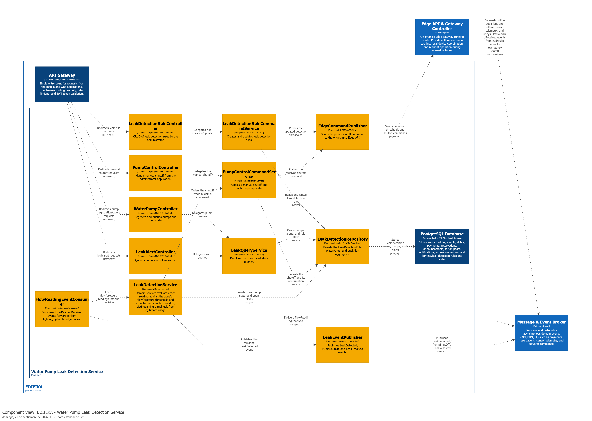

*Figura. Diagrama de Componentes — Water Pump Leak Detection Service. Elaborado utilizando Structurizr (Structurizr, s.f.).*

#### 4.2.12.6. Bounded Context Software Architecture Code Level Diagrams

##### 4.2.12.6.1. Bounded Context Domain Layer Class Diagrams


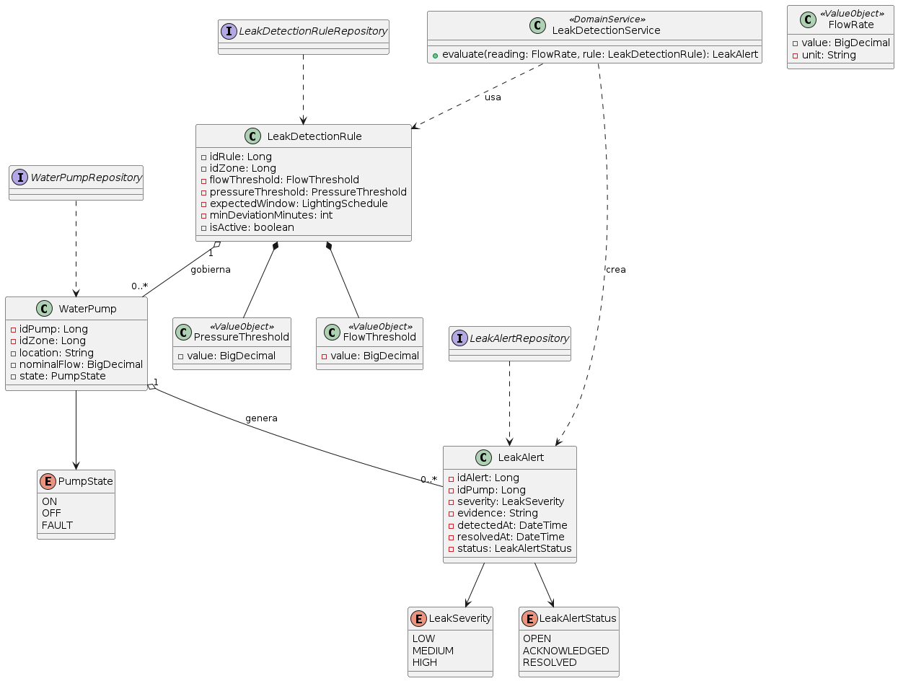

*Figura. Diagrama de Clases — Water Pump Leak Detection. Elaborado con PlantUML.*

##### 4.2.12.6.2. Bounded Context Database Design Diagram


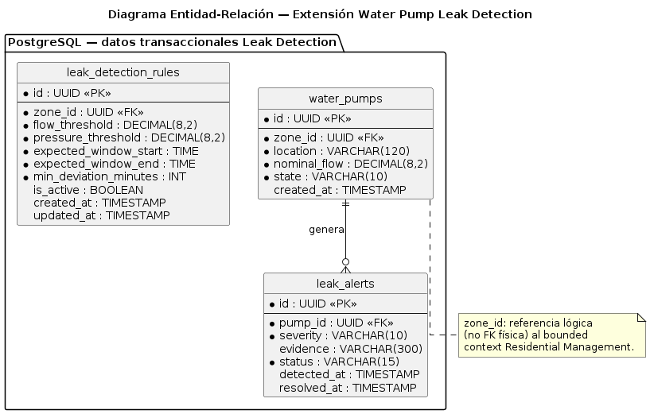

*Figura. Diagrama Entidad-Relación — extensión Water Pump Leak Detection. Elaborado con PlantUML.*

# Capítulo V: Solution UI/UX Design

## 5.1. Style Guidelines

### 5.1.1. General Style Guidelines

En esta sección hemos establecido las directrices de estilo que rigen todas las pantallas de Edifika (aplicación web, aplicación móvil y dispositivos IoT). Su propósito es garantizar coherencia visual y de comunicación: que un mismo color, un mismo tamaño de texto y un mismo tono de redacción signifiquen siempre lo mismo en todo el producto.

Para que estas directrices no quedaran como recomendaciones subjetivas, se realizó un **levantamiento de las decisiones observables** en los mock-ups de la plataforma (secciones 5.4.1 y 5.4.3): a partir de las siete pantallas de referencia —acceso, registro, unidades y residentes, áreas comunes, muro comunitario, finanzas y formulario de reserva— se identificaron el color de marca, la familia tipográfica, la escala de espaciados y el registro del texto, y con esos hallazgos se definieron los **tokens** de diseño (variables de estilo) que se replican en todas las vistas. Estos tokens funcionan como un mini design system propio, tomando como referencia los sistemas **Material Design 3** y **Tailwind CSS** (para la nomenclatura de la escala de espaciado y de los breakpoints), y fueron adaptados a las necesidades del producto: una interfaz administrativa densa en información, con alto volumen de tablas, estados y alertas, que debe seguir siendo legible por adultos mayores y por usuarios con baja familiaridad tecnológica.

**Sustento: principios de diseño considerados**

Las decisiones no son arbitrarias; cada una se sustenta en principios de diseño establecidos y en las restricciones del contexto de uso:

- **Principio de consistencia y reconocimiento (Nielsen, 2020):** el usuario debe reconocer los controles y su comportamiento a partir de vistas anteriores. Esto exige un único color de marca para toda acción primaria y un único patrón de badges de estado, de modo que un botón morado siempre signifique lo mismo.
- **Principio de jerarquía visual:** la pantalla debe comunicar qué es lo importante primero. Se resuelve con una escala tipográfica, con el uso del color solo para elementos de acción o estado, y con densidad de información controlada (tarjetas KPI superiores, tabla como bloque dominante).
- **Ley de Hick-Hyman:** al cubrir información crítica (deuda vencida, comentarios denunciados, espacios deshabilitados) se reduce el tiempo de decisión. Por eso los estados críticos usan color rojo/verde y no solo texto, y los elementos que requieren acción inmediata se aíslan en bloques separados (tarjetas "Outstanding Balances", "Mod Queue").
- **Principio de correspondencia (Einstellung):** la lectura de una interfaz es más rápida cuando su estructura sigue el orden de lectura. De aquí que la composición se base en un layout de 12 columnas con cabecera de página (título + subtítulo + acciones), contenido principal y panel lateral contextual.
- **Principio de espacio en blanco (Larkin, 2015):** el espacio en blanco agrupa elementos relacionados y reduce la carga cognitiva. Se materializa en el espaciado interno de tarjetas y en los márgenes generosos de los formularios.
- **Principio de la buena forma (Norman, 1986):** los componentes de la interfaz deben parecer presionables: bordes redondeados consistentes, sombras discretas y estados de hover/focus visibles.
- **Accesibilidad y diseño universal:** contraste mínimo 4.5:1 en texto y 3:1 en elementos gráficos, tamaño mínimo de 14 px para texto de formulario, y nunca dependencia única del color para transmitir estado (siempre se acompaña de etiqueta textual, por ejemplo "PAID", "LATE (12D)", "OCCUPIED").
- **Principio de "content first" y revelado progresivo:** la información se presenta en bloques cerrados (cards) en lugar de listas interminables, con revelado progresivo mediante paginación y filtros.

#### Branding

El branding de Edifika se sustenta en el **nombre, el símbolo y el color de marca** como trío indivisible:

- **Nombre:** "Edifika", fusión de "edificio" y el sufijo "-ka" que le da identidad de producto. Se escribe siempre capitalizado ("Edifika") y en ningún caso en mayúsculas sostenidas ni con variantes ("EdifikaApp", "edifika").
- **Símbolo (isotipo):** icono de edificio en línea con ventanas, acompañado del nombre en una misma línea. Aparece en el encabezado del panel lateral izquierdo ("Edifika / Residential Platform"), en las pantallas de acceso y registro, y como favicon.
- **Color de marca:** violeta profundo, que es el único color con permiso de uso como fondo sólido de elementos de marca y de acciones primarias.
- **Descriptor de marca (tagline):** "Residential Platform" como línea de apoyo bajo el logotipo, en tono claro. Resume el posicionamiento (plataforma de gestión residencial) y evita ambigüedad sobre el tipo de producto. En el pie de las pantallas de acceso y registro se añade el aviso legal en versalitas: "© 2024 EDIFIKA RESIDENTIAL PLATFORM".
- **Área de respeto (clear space):** el espacio libre alrededor del logotipo equivale a la altura de la "E" del nombre. El logotipo no se deforma, no se recolorea fuera de la paleta y no se acompaña de sombras ni efectos.
- **Aplicación en marketing vs. en producto:** en piezas de comunicación (login, registro, landing) el logotipo se apoya en un panel fotográfico con duotono de marca y el titular de posicionamiento; dentro de la aplicación el logotipo se mantiene fijo en la cabecera del sidebar y no se repite en cada tarjeta para no competir con el contenido.

#### Lenguaje Aplicado

El tono de comunicación se definió como **serio, semi-formal, respetuoso y sereno con episodios de entusiasmo controlado**, coherente con un producto de gestión administrativa donde el usuario puede estar tratando con deudas y conflictos vecinales. El detalle de las dimensiones adoptadas es el siguiente:

| Dimensión | Posición adoptada | Decisión y sustento |
| :--- | :--- | :--- |
| Divertido / Serio | Serio | El producto comunica estados financieros (deuda, morosidad, arrears) y conflictos entre residentes. El humor restaría credibilidad y puede minimizar un problema serio. Se mantiene un tono profesional y directo, sin juegos de palabras ni emojis en la interfaz. |
| Formal / Casual | Semi-formal | Se usa lenguaje corporativo natural ("Manage your property ecosystem with ease", "Real-time overview of the residential financial health"), evitando tecnicismos y jerga de ingeniería, pero sin tratar al usuario de forma coloquial ni usar slang. |
| Respetuoso / Irreverente | Respetuoso | Se citan los nombres de las personas y de las unidades ("Unit 1204 · Julian Thorne", "Sarah Mitchell · Unit 402") y se evita cualquier carga valorativa sobre los residentes morosos. Los mensajes de estado son descriptivos del hecho, no juicios: "OVERDUE 15 DAYS" en lugar de "You failed to pay". |
| Entusiasta / Sereno | Sereno con entusiasmo controlado | El copy evita la exageración y los signos de exclamación múltiples. El optimismo se transmite con verbos de acción y de logro ("Elevating Residential Living", "Vote Now", "RSVP Now"), con iconografía positiva y con la claridad de las métricas, no con adjetivos enfáticos. |

Además de las dimensiones anteriores, se establecen las siguientes **reglas de redacción de la interfaz (microcopy)**:

- **Voz del producto:** el sistema se expresa con voz activa en primera persona del plural implícita ("Elevating Residential Living", "Seamless building management for the modern homeowner and administrator"), transmitiendo que la plataforma trabaja para el usuario.
- **Títulos y etiquetas:** los títulos de vista y de tarjeta se escriben en **Title Case** ("Finance & Reports", "Units & Residents", "Reservations Calendar", "Manage Areas"); los encabezados de columna, etiquetas de formulario y títulos de bloque lateral van en **MAYÚSCAS** ("TOTAL REVENUE", "UNIT / RESIDENT", "ACTIVE POLLS"); los párrafos de contenido, en oración ("Join us this Saturday for our annual summer celebration!").
- **Botones:** se escribe la acción con verbo en infinitivo o imperativo corto ("Post", "Vote Now", "Send Notice", "Export CSV", "Add New Unit", "Save Changes"), nunca etiquetas vagas ("Aceptar", "OK"). El botón principal de cada pantalla lleva la acción de mayor frecuencia de uso, y las secundarias se degradan a variantes outline o ghost.
- **Mensajes de error y vacíos:** se indica qué pasó y qué hacer a continuación, sin culpar al usuario. El caso de la tarjeta "Flagged Comment" del Mod Queue ilustra el patrón: se muestra la cita del conflicto y se ofrecen las acciones "Dismiss" y "Review" para que el administrador resuelva sin salir del contexto.
- **Textos auxiliares:** los toggles y campos complejos se acompañan de una línea de ayuda que explica la consecuencia de la acción ("Toggle to set as Active or Under Maintenance"), evitando que el usuario descubra el comportamiento a posteriori.
- **Consistencia de mayúsculas en estados:** los badges de estado se escriben en MAYÚSCAS para ser escaneables de un vistazo ("OCCUPIED", "PAID", "LATE (12D)", "VACANT", "CANCELED", "MAINTENANCE"); los títulos de sección, en Title Case.
- **Sin emojis en la interfaz:** los íconos pertenecen a un set vectorial consistente; los emojis se reservan para la comunicación externa (redes, correos).

Esta directriz se complementa con las dimensiones concretas por plataforma (web, móvil e IoT) descritas en la sección 5.1.2.

#### Paleta de Colores

La paleta se construyó sobre una base de **violeta de marca**, neutros fríos para la estructura general (superficies, bordes, tipografía) y una paleta semántica acotada para estados. La regla estructural es: **el color no se usa para decorar, solo para comunicar** (marca, acción primaria, estado); el resto de la superficie se resuelve con blanco, grises muy claros y bordes.

Los tokens definidos, tomados de las variables de estilo de Figma, son:

| Token | Color | Uso |
| :--- | :--- | :--- |
| **Primary / Brand** | `#8C088F` | Botón de acción principal, FAB, item activo del sidebar, toggle en estado "on", chip de reserva confirmada, encabezado de tarjeta destacada ("Manage Areas"), texto de enlace activo. |
| **Primary Dark** | `#6F1D71` | Estado hover/pressed de la acción primaria, relleno de barras de progreso, texto de enlace ("CLEAR", "Forgot password?", "View Full Queue"). |
| **Primary Light / Tint** | `#F9F2F9` | Fondo del ítem activo del menú, fondo de chips y de píldoras de estado informativo, fondo de barras de encuesta. |
| **Primary Icon Tint** | `#F3E7F3` | Contenedor cuadrado de íconos de área común y de anuncio oficial. |
| **Surface** | `#FFFFFF` | Tarjetas, tablas, paneles laterales, campos de formulario y superficie del diálogo modal. |
| **Background** | `#F9FAFC` | Lienzo de la aplicación: separa visualmente las tarjetas blancas del fondo. |
| **Surface Muted** | `#FAFAFA` | Zona de escritura de publicaciones, tarjetas de contenido secundario y encabezados de tabla. |
| **Border** | `#E5E5E5` | Bordes de tarjetas, separadores de tabla, contorno de campos e inputs. |
| **Border Strong** | `#D1D1D1` | Bordes de botones outline ("Export PDF", "Excel", "Remind") y de tarjetas de KPI. |
| **Text Primary** | `#1A1A1A` | Títulos de página, cifras KPI, nombres de personas, celdas de tabla. |
| **Text Secondary** | `#7D787E` | Etiquetas en mayúsculas, encabezados de columna, texto de ayuda y metadatos ("Unit 402 · 5 hours ago", "142 votes · 2 days left"). |
| **Text Tertiary** | `#9A9599` | Subtítulos de KPI ("Across 4 Towers", "Active requests"), pies de tabla y mensajes de baja prioridad. |
| **Success** | `#2C6E4A` sobre `#F0FDF3` | "PAID", tendencias positivas ("+12% vs last month"), metas superadas en barras de progreso. |
| **Danger** | `#B91C1C` sobre `#FDF2F2` | "ARREARS", "LATE (12D)", "OVERDUE 15 DAYS", "CANCELED", "3 NEW", alertas de incidencia y barra lateral del comentario denunciado. |
| **Neutral** | `#6B6B6B` sobre `#F1F1F1` | "VACANT", "PENDING APPROVAL", "GRACE PERIOD", "EVENT", switches en estado off, elementos deshabilitados. |
| **Slate** | `#4E525C` | Categorías de reserva sin acción pendiente ("Gym Center · Tennis") y su entrada en la leyenda del calendario. |
| **Scrim / Overlay** | `#808080` (negro al 50%) | Velo del diálogo modal: atenúa el fondo sin ocultar el contexto de la acción en curso. |
| **Overlay photographic** | `#0F1231` | Duotono índigo del panel fotográfico de acceso y registro, sobre el que se apoya el titular de marca en blanco. |

**Reglas de aplicación de color:**

- **Regla 60-30-10:** aproximadamente 60% superficie (blanco y gris de lienzo), 30% componentes neutros y texto, 10% color de marca y semántico. Así el violeta se percibe como acento y no como fondo dominante.
- **Una sola acción primaria por pantalla:** si hay varios botones sólidos, solo el de mayor frecuencia lleva `Primary`; los demás son `Outline` (borde `Border Strong`, texto `Primary`) o `Ghost` (ícono). Se observa en "Generate Report" (solid) frente a "Export PDF" y "Excel" (outline), y en "Send Notice" (solid) frente a "Remind" (outline).
- **Contraste verificado:** `Primary #8C088F` sobre `#FFFFFF` cumple relación de contraste superior a 4.5:1, por lo que puede usarse también como color de texto de enlace y de badge sobre fondo blanco; los badges semánticos usan texto saturado sobre fondo muy claro del mismo tono para mantener legibilidad sin bloques sólidos que compitan con la acción primaria.
- **Tintes de badge:** cada estado tiene un fondo de baja saturación derivado de su color (`#F0FDF3`, `#FDF2F2`, `#F1F1F1`, `#F9F2F9`), lo que permite tener muchos estados sin aumentar la carga cromática de la pantalla. El estado nunca se transmite solo con color: siempre lleva su etiqueta textual.
- **Color como código de categoría:** en el calendario de reservas, el color del chip identifica el área y su estado, y se acompaña de una leyenda textual ("BBQ AREA", "PARTY ROOM", "CANCELED", "GYM CENTER") para usuarios que no distinguen los tonos.
- **Los dispositivos IoT** (sección 5.1.2) reutilizan los mismos tokens: el LED de estado y la carcasa del dispositivo emplean `Primary` y `Neutral` para mantener coherencia entre el objeto físico y la app. El único token que la plataforma IoT añade a esta paleta es `Warning` (`#B45309` sobre `#FFFBEB`), por la necesidad de representar estados intermedios del dispositivo que las tablas de la web no tienen.

#### Tipografía

La familia tipográfica elegida es una **sans-serif geométrica y humanista de alta legibilidad en tamaños pequeños**, con un juego de pesos completo (Regular a Bold) que permite construir jerarquía sin recurrir a familias adicionales ni a negritas sintéticas. Se definieron los siguientes estilos:

| Rol | Uso | Tamaño / Peso | Interlineado |
| :--- | :--- | :--- | :---: |
| **Display / Hero** | Titular de posicionamiento sobre el panel fotográfico ("Elevating Residential Living"). | 48–56 px / Bold (700), mayúscula inicial, tracking cerrado | 1.1 |
| **Page Title** | Título de la vista actual ("Finance & Reports", "Units & Residents", "Create Account"). | 24–28 px / Bold (700), Title Case | 1.2 |
| **Section / Card Title** | Encabezado de tarjeta o panel ("Revenue vs Projections", "Manage Areas", "Reservations Calendar"). | 18–20 px / Semibold (600) | 1.3 |
| **Subtitle / Description** | Bajada que explica el propósito de la pantalla ("Manage property inventory and resident information across all towers"). | 15–16 px / Regular (400), `Text Tertiary` | 1.4 |
| **Body** | Párrafos de publicaciones, comunicados y descripciones de reglas de uso de un área. | 14–15 px / Regular (400) | 1.5 |
| **Label / Column Header** | Encabezados de tabla, etiquetas de formulario y títulos de bloque ("TOTAL REVENUE", "EMAIL ADDRESS", "ACTIVE POLLS"). | 11–12 px / Semibold (600), MAYÚSCULAS, tracking amplio (+0.05 em) | 1.2 |
| **Metric / KPI** | Cifras destacadas ("$428.5k", "428", "94.2%"). | 28–32 px / Bold (700), `Text Primary` | 1.1 |
| **Button** | Texto de acciones ("Post", "Send Notice", "Save Changes", "Add New Unit"). | 14 px / Semibold (600) | 1.0 |
| **Badge / Status** | Píldoras de estado y chips de calendario ("PAID", "LATE", "BBQ Area · Unit 1205"). | 11–12 px / Semibold (600), MAYÚSCULAS | 1.0 |
| **Caption / Meta** | Información secundaria ("Owner since 2018", "142 votes · 2 days left", "Showing 1–10 of 428 units"). | 12–13 px / Regular (400), `Text Tertiary` | 1.4 |

**Reglas de aplicación tipográfica:**

- **Jerarquía por peso y tamaño, no por color:** los niveles se distinguen por tamaño y peso; el color se reserva para el significado (marca o estado). Así, un título nunca compite cromáticamente con un badge.
- **Máximo dos niveles de jerarquía por bloque:** un `Section Title` y su contenido; nunca tres títulos seguidos sin separación visual.
- **Números con formato tabular:** cifras financieras y de KPI (`$428.5k`, `$1,240.00`, `94.2%`) usan cifras de ancho fijo para que las columnas de la tabla alineen y sean comparables de un vistazo.
- **Límite de longitud de línea:** 60–75 caracteres en párrafos (publicaciones y comunicados); se parte el texto en bloques cortos con espaciado entre párrafos.
- **Legibilidad mínima:** 14 px para texto de formulario y 12 px para metadatos; nunca por debajo de 11 px, para preservar legibilidad en el segmento de adultos mayores.

#### Espaciado

El espaciado sigue una **escala base de 4 px (múltiplos: 4, 8, 12, 16, 20, 24, 32, 40, 48, 64)**, tomado de la convención de Tailwind CSS para que los valores sean consistentes entre diseño y código. Esta escala hace predecibles los ritmos verticales y permite que cualquier componente nuevo encaje sin cálculos ad hoc.

| Token | Valor | Aplicación típica |
| :--- | :---: | :--- |
| space-1 | 4 px | Separación entre ícono y texto dentro de un botón o de una etiqueta. |
| space-2 | 8 px | Gap entre badges e inputs apilados; padding interno de píldoras. |
| space-3 | 12 px | Gap entre elementos de una misma tarjeta; padding de celdas compactas. |
| space-4 | 16 px | Padding interno estándar de tarjetas; separación entre tarjeta KPI y tarjeta principal. |
| space-5 | 20 px | Padding de celdas de tabla (densidad cómoda por defecto). |
| space-6 | 24 px | Separación entre tarjetas de contenido y entre el contenido y el borde del panel. |
| space-8 | 32 px | Separación entre secciones mayores y padding del panel lateral respecto al contenido. |
| space-10 / 12 | 40 / 48 px | Aire de las vistas de acceso y registro, que emplean un diseño más respirado por ser pantallas de bajo número de elementos. |

**Reglas de composición derivadas del espaciado:**

- **Layout de 12 columnas** con gutter de 24 px y márgenes laterales de 48 px en escritorio; el sidebar ocupa una columna fija de 280 px (delimitada por una línea de 1 px en `Border`) y el área de contenido se divide en bloque principal (aproximadamente 8 columnas) más panel lateral contextual (aproximadamente 4 columnas), como se observa en Community Wall, Common Areas y Finance.
- **Ritmo vertical constante:** cabecera de página (título + subtítulo + acciones) → fila de tarjetas KPI → contenido principal, con 24 px de separación entre bloques y 16 px dentro de un mismo bloque.
- **Densidad de tabla:** padding vertical de 20 px por fila y altura mínima de fila de 56 px, suficientes para el objetivo táctil y para separar visualmente los registros en tablas con mucha información. La fila de unidades incluye avatar de 40 px, lo que eleva la altura a 96 px sin romper la alineación de las columnas.
- **Formulario en dos columnas:** los campos del diálogo de reserva se alinean en una retícula de dos columnas con gap de 16 px; los campos de ancho completo (descripción de reglas) ocupan las 12 columnas del diálogo, que tiene un ancho máximo de 512 px y padding interno de 24 px.
- **Radios y bordes:** radios de 8 px para botones y badges, 12 px para tarjetas, campos e inputs, y radio completo para píldoras (badges, buscador, elementos de la barra superior); borde de 1 px en `Border` o `Border Strong` para delimitar superficies claras.
- **Sombras:** muy sutiles (elevación baja en hover de tarjetas); en el panel fotográfico de acceso y registro la profundidad se logra con overlay de color y no con sombras duras.
- **Objetivos táctiles:** ningún control interactivo por debajo de 44 × 44 px en móvil; en escritorio, altura mínima de 40 px para botones y 56 px para filas de tabla, lo que además mejora la precisión del clic.

### 5.1.2. Web, Mobile and IoT Style Guidelines

La sección 5.1.1 definió los tokens del producto: una paleta, una escala tipográfica, una escala de espaciado y un registro de texto. Esos tokens **no se duplican por plataforma**. Lo que cambia de una superficie a otra es la densidad de información, el modelo de navegación y la forma física de la interacción, y eso es precisamente lo que hay que fijar aquí, porque de lo contrario cada frente (web, móvil, firmware) interpretaría los mismos tokens por su cuenta y el producto se leería como tres aplicaciones distintas.

Edifika tiene tres clientes que consumen los mismos datos: la **Web Application** en navegador, la **Mobile Application** en Flutter/Dart para iOS y Android, y los **nodos ESP32** gobernados por el Edge API on-premise (sección 4.1.3). Un mismo hecho de dominio, como una reserva confirmada, una credencial suspendida o una lectura de 340 lux, debe verse y leerse igual en los tres. Por eso el trabajo no consistió en inventar una guía nueva para cada plataforma, sino en bajar de la pantalla a los centímetros.

Las siete pantallas de referencia se diseñaron primero para escritorio, porque el segmento administrador trabaja con tablas densas: 428 unidades, 45 saldos pendientes y reservas de cuatro áreas comunes. A partir de ellas se derivaron las reglas siguientes. Cada decisión se justifica con lo que esas pantallas ya hacen, y cuando una regla no se observa en ninguna de ellas, se declara como regla nueva y no como observación.

| Elemento | Web | Mobile | Dispositivo IoT |
| --- | --- | --- | --- |
| Densidad | Alta: 3 o 4 tarjetas KPI, tabla y panel lateral en la misma vista. | Media: 2 o 3 KPI y una tarjeta por fila; la tabla no viaja. | Nula: un LED, un tono y una etiqueta. |
| Navegación | Sidebar fijo de 280 px con seis destinos. | Barra inferior con cuatro destinos y un FAB. | Ninguna. El pulsador y el contactless son el acceso. |
| Color de acción | `Primary #8C088F` | `Primary #8C088F`, idéntico | `Primary #8C088F` en el LED y en el acento de la carcasa. |
| Tipografía | Escala de 11 a 56 px. | Misma escala, cuerpo a 16 px y tamaño dinámico del sistema. | Altura de letra mínima de 2.5 mm en etiqueta impresa, siempre en mayúsculas. |
| Estado | Píldora con texto ("PAID", "LATE (12D)", "VACANT"). | La misma píldora. | LED más código de parpadeo; el color solo nunca basta. |
| Objetivo táctil | 40 px de alto en botones, 56 px en filas. | 44 × 44 px como mínimo. | Superficie de contactless de 25 mm o más. |
| Diálogo | Modal centrado de 512 px con scrim del 50 %. | Bottom sheet con la acción principal anclada abajo. | Pulsación mantenida de 1.5 s para acciones irreversibles. |
| Movimiento y retardo | Elevación baja en hover, sin animaciones de más de 200 ms. | Gesto con alternativa visible siempre disponible. | Retardo máximo de 500 ms entre la pulsación y el relé. |
| Accesibilidad | Contraste 4.5:1, foco visible, sin dependencia del color. | Tamaño dinámico del sistema, contraste alto del sistema operativo. | Código de parpadeo redundante y silencio programable en horario nocturno. |

#### Web Style Guidelines

La Web Application es la superficie de trabajo del segmento administrador y la única capaz de sostener la densidad de información que ese rol exige. Todas las reglas de este bloque se leen sobre pantallas ya construidas, y la vista de **Units & Residents** es la línea base: sidebar fijo, barra superior, fila de cuatro tarjetas KPI, barra de filtros y tabla como bloque dominante.

| Breakpoint | Ancho | Composición |
| --- | --- | --- |
| xs | Menos de 640 px | Una columna. El sidebar pasa a cajón deslizante con scrim. Las tablas se convierten en tarjetas apiladas y la fila de KPIs se desplaza horizontalmente. |
| sm | 640 px | Dos columnas para los KPIs. El buscador ocupa el ancho completo de la barra superior. |
| md | 768 px | Sidebar reducido a iconos de 72 px con etiqueta al pasar el cursor. El panel lateral contextual pasa debajo del contenido principal. |
| lg | 1024 px | Sidebar de 280 px restaurado. El contenido principal ocupa 8 columnas y el panel lateral 4, con gutter de 24 px. |
| xl | 1280 px | Composición de referencia completa: sidebar fijo, barra superior, fila de KPIs, bloque principal de 8 columnas y panel lateral de 4. |
| 2xl | 1536 px o más | El contenido se limita a 1440 px y se centra. Estirar más solo alarga las líneas por encima de los 75 caracteres fijados en 5.1.1. |

**Sidebar.** Ocupa una columna fija de 280 px delimitada por una línea de 1 px en `Border`, y sostiene seis destinos sin desplazamiento: Dashboard, Units & Residents, Common Areas, Finance, Community Wall y Documentation. El destino activo se marca con fondo `Primary Light`, texto `Primary` y una barra de 4 px en el borde izquierdo. La combinación se repite en las cuatro pantallas de aplicación para que el usuario sepa dónde está sin leer el título. La acción "New Alert" se mantiene por encima de los destinos secundarios (Settings, Support) porque es la de mayor frecuencia del administrador, y no se mezcla con la navegación: mezclar la acción más frecuente con el menú hace que ninguna de las dos se pueda recorrer de un vistazo.

**Barra superior.** El buscador en píldora solo aparece donde hay algo que buscar, con su placeholder "Search community posts..." en el muro comunitario, y se omite en las vistas sin búsqueda, como Common Areas, porque un campo de búsqueda vacío es una promesa que la pantalla no cumple. A la derecha van las notificaciones con punto rojo solo si hay elementos no leídos, la ayuda y el avatar con la etiqueta de rol ("Admin Portal"), que recuerda qué rol está operando la pantalla.

**Composición del contenido.** El ritmo vertical es fijo: cabecera de página con título, bajada y acciones a la derecha; fila de tarjetas KPI; bloque principal. La cantidad de tarjetas KPI varía según la información disponible y la fila no se estira para llenar el ancho: Finance muestra tres porque tiene tres métricas, mientras Units & Residents muestra cuatro. La tarjeta en `Danger` (ARREARS) se sostiene sola por su tinte y su etiqueta roja, sin competir con la acción primaria.

**De la tabla a la tarjeta.** Por debajo de 768 px, las tablas de Units & Residents y de Residents with Outstanding Balances se rehacen como tarjetas apiladas en lugar de comprimirse con desplazamiento horizontal. Cada tarjeta conserva el avatar de 40 px, el nombre de la persona, la unidad, la píldora de estado y las acciones, con los mismos rótulos en `MAYÚSCAS` que antes servían de encabezado de columna. Los filtros y la paginación pasan a una barra fija al pie para que el alcance de los datos siga visible.

**Interacción.** El hover eleva la tarjeta de forma apenas perceptible y el foco de teclado se dibuja como un anillo `Primary` de 2 px con desfase de 2 px, de modo que recorrer la interfaz con el teclado sea tan visible como con el mouse. Cada pantalla conserva una sola acción primaria sólida: "Generate Report" es sólida y "Export PDF" y "Excel" quedan en outline. El diálogo de reglas de reserva es el patrón de referencia para cualquier confirmación en la web.

El modal mide 512 px de ancho máximo, se centra, usa radio de 12 px y un scrim al 50 % que **atenúa pero no oculta** el calendario de fondo: el administrador tiene que seguir viendo sobre qué fecha y sobre qué área estaba trabajando cuando aparece "Reservation of Loreley". El foco queda atrapado dentro del diálogo, se cierra con la X, con la tecla Escape o con un clic en el scrim, y al cerrarse devuelve el foco al elemento que lo abrió. Las acciones irreversibles, como revocar una credencial o suspender un área, exigen un segundo paso de confirmación con el nombre del objeto en la frase.

**Estados de carga, vacío y error.** Los skeletons respetan las dimensiones del contenido final para que la página no salte mientras llegan los datos. El pie de tabla siempre declara el alcance ("Showing 1–10 of 428 units", "Showing 4 of 45"), porque en tablas largas el usuario necesita saber dónde está antes de decidir si pagina. Los estados vacíos explican la causa y ofrecen la acción siguiente, del tipo "No hay reservas para este mes" con el botón para crearla. Nunca se deja un bloque blanco sin explicación, porque el usuario lo lee como una falla del sistema.

**Muro comunitario.** La vista reparte el feed a la izquierda y tres tarjetas de moderación a la derecha, con la misma proporción 8/4 del resto del producto. Esa fila de KPIs y el panel lateral cumplen una función de jerarquía, no de adorno. En el Mod Queue, el comentario denunciado se separa con una barra roja a la izquierda y ofrece "Dismiss" y "Review" dentro del mismo bloque, de modo que la resolución no obliga a navegar. En ACTIVE POLLS, las opciones se leen como barras horizontales con su porcentaje en `Primary` y el conteo debajo ("142 votes · 2 days left"): es una lectura de decisión, no una lectura de datos crudos.

**Áreas comunes.** El calendario es la vista más densa del producto y por eso concentra más reglas. El chip de color identifica área y estado, la leyenda textual de cuatro entradas está siempre visible al pie, y los días deshabilitados quedan en gris, nunca en blanco.

**Acceso y registro.** Las dos vistas de entrada comparten una retícula de dos mitades que resuelve la responsividad sin código adicional: a partir de 1024 px el panel fotográfico ocupa la mitad y el formulario la otra; por debajo de 768 px el panel se oculta y el formulario toma el ancho completo con márgenes de 24 px. El formulario se escribe en columna única, con etiquetas en `MAYÚSCAS`, campos con ícono a la izquierda y separador inferior en lugar de caja completa, y un botón sólido seguido de su variante outline. Ambas vistas comparten el mismo esqueleto y solo cambian los campos, lo que hace que el paso entre una y otra se perciba como continuo.

#### Mobile Style Guidelines

La Mobile Application cubre al propietario y al inquilino en sus tareas de uso frecuente: pagos, reservas, comunicados y foro desde iOS y Android. Los datos y los tokens de color, tipografía y microcopy son los mismos que en la web, porque el residente no debería tener que aprender un segundo idioma visual. Lo que se rediseña es el modelo de navegación: una tabla de 428 unidades no cabe en 360 px, y el error fácil sería comprimirla hasta que quepa en lugar de cambiarla.

**Densidad.** Se conserva la escala tipográfica, pero el cuerpo sube a 16 px, que es el tamaño base que las plataformas móviles esperan y el que evita el auto-zoom al enfocar un campo. El mínimo de 12 px de las tablas web desaparece: en móvil ningún texto baja de 14 px, y los metadatos como "Unit 402 · 5 hours ago" se mantienen en 13 px porque el nombre de la unidad es parte del dato, no decorado.

**Navegación.** La barra inferior admite un máximo de cuatro destinos visibles, el número que un pulgar alcanza sin reposicionar la mano; un quinto destino abre una pantalla secundaria. La regla que gobierna la decisión es "un destino, una tarea". La web organiza por módulo (Finance, Common Areas) porque el administrador trabaja en sesiones largas frente al monitor, mientras la app móvil organiza por intención del momento: pagar, reservar, avisarme.

**Objetivos táctiles.** Ningún control interactivo baja de 44 × 44 px, y los que ejecutan acciones destructivas suben a 48 px de lado. Las celdas de una tarjeta son un objetivo de 56 px de alto, la misma medida ya usada para las filas de tabla en escritorio, lo que preserva el ritmo visual entre las dos plataformas.

**FAB.** El botón flotante violeta que aparece abajo a la derecha en Units & Residents, Finance y Community Wall se conserva como patrón de creación. En móvil se ancla encima de la barra inferior respetando el *safe area* del dispositivo, y no se muestra en las pantallas que no admiten creación, como Finance o la consulta de una reserva existente.

**Diálogos.** El modal centrado de la web se convierte en *bottom sheet*, porque en móvil el teclado ocupa la mitad superior de la pantalla y la acción principal quedaría fuera de vista. Los campos se apilan en una columna con separaciones de 16 px, la acción primaria queda anclada en el borde inferior dentro del alcance del pulgar, y el cierre por arrastre hacia abajo tiene su equivalente accesible en un botón de cerrar explícito.

**Listas y tarjetas.** Cada fila de lista mantiene la composición de la tabla web, con avatar de 40 px, nombre primario, subunitario y píldora de estado, para que el residente reconozca una pantalla que ya conoce en el escritorio. Los filtros se aplican con un botón en la barra superior que muestra la cantidad activa como contador, en lugar de los tres desplegables en línea de la vista web.

**Gestos.** Deslizar para revelar acciones secundarias, tirar hacia abajo para refrescar telemetría y pulsación larga para el menú contextual. Cada gesto tiene una alternativa visible en un botón de tres puntos, porque no todo usuario descubre los gestos por sí solo, y esconder una acción tras un deslizamiento la deja inaccesible para quien no lo conoce. Por el mismo motivo se descarta el gesto de "deslizar para borrar": la confirmación en dos pasos es más segura y produce menos errores de precisión.

**Notificaciones.** Las alertas push usan el mismo `Danger` de la aplicación y el badge se limita visualmente a tres dígitos. Los eventos críticos de IoT, como una fuga o un corte automático de bomba, ignoran el modo silencioso del sistema, porque el costo de no avisar supera al de interrumpir. El toque sobre la notificación lleva directo a la incidencia, sin pasar por el dashboard.

**Sin conexión.** La app muestra los datos en caché con su marca de tiempo ("actualizado hace 4 min") y un banner en `Neutral` cuando el Edge API o la nube no responden. Nunca se muestra un vacío como si fuera un resultado. Esta es la traducción en pantalla de la decisión de arquitectura del capítulo IV: el condominio sigue operando con la última lista de credenciales sincronizadas.

**Estado de madurez.** Las decisiones anteriores se derivan de los mismos tokens de las siete pantallas de referencia aplicados sobre las convenciones de Material Design 3. El juego de pantallas específico de la app móvil todavía no está formalizado, así que estas reglas quedan fijadas aquí como contrato de diseño para esa etapa y no como descripción de pantallas ya construidas.


#### IoT Style Guidelines

La interfaz IoT de Edifika es software: es el dashboard donde el administrador y el residente ven el estado de los dispositivos del edificio, y hereda la paleta sin excepciones. Lo que cambia es la naturaleza del dato. Las lecturas llegan por MQTT desde el Edge API con latencia variable, y un dispositivo puede simplemente no estar conectado. De ahí la regla que gobierna todo este bloque: **cuando no se sabe el estado de un dispositivo, la interfaz dice que no lo sabe**. Un vacío ambiguo es peor que un mensaje explícito de "sin conexión", porque se toman decisiones sobre puertas, luz y bombas de agua sobre la base de ese vacío.

**Anatomía de la tarjeta de dispositivo.** Replica la tarjeta KPI ya usada en Finance: contenedor de ícono en `Primary Icon Tint`, nombre del dispositivo en Semibold de 18 a 20 px, rótulo de zona en `MAYÚSCAS` y fila de lectura con el valor en cifras tabulares. A eso se suman tres elementos que las pantallas web no necesitan: la píldora de conexión (ONLINE, OFFLINE, SYNCING), la hora de la última lectura y la antigüedad de esa lectura.

**Color de estado.** Se reutilizan `Success`, `Danger` y `Neutral` con la semántica de 5.1.1. La única adición de todo el sistema es el token `Warning` (`#B45309` sobre `#FFFBEB`), y la razón es concreta: un dispositivo tiene estados intermedios que una tabla web no tiene. La batería baja del nodo de iluminación, un sensor intermitente o una calibración pendiente no son "todo bien" ni son "falla", y sin ese nivel intermedio el administrador se enfrenta a elegir entre mentir en verde o declarar una alarma donde no la hay.

**Tiempo real.** Las actualizaciones llegan por suscripción y no por sondeo, y la marca de tiempo nunca desaparece de la tarjeta. Si dejan de llegar lecturas durante más de 60 segundos, la tarjeta pasa a estado SYNCING en `Neutral` y deja de presentar el último valor como si fuera actual. Un número congelado mostrado en vivo es la forma más rápida de perder la confianza del usuario en todo el panel.

**Umbrales y alertas.** Los umbrales se definen en el editor de reglas, con el mismo formulario en dos columnas que se ve en las reglas de reserva. Cuando un umbral se cruza, la alerta se presenta con el patrón ya usado en el comentario denunciado: barra de color `Danger` a la izquierda, ícono, título, valor con cifras tabulares, hora y las dos acciones de resolución. Nunca se limita a una franja roja en el calendario.

**Series de tiempo.** Los gráficos de telemetría reutilizan la composición de "Revenue vs Projections", con área de datos, eje temporal y selector de periodo a la derecha, y cifras tabulares. Cuando falta un tramo, la línea se dibuja discontinua y el hueco se rotula como "sin datos": rellenar por interpolación haría ver que el sensor midió cuando en realidad no informó, y esa diferencia importa cuando la lectura es una alarma de nivel de agua.

**Acciones sobre dispositivos.** La tarjeta de dispositivo sirve para leer y para llevar al detalle, no para mandar. El control manual de una luminaria o de una bomba se hace desde el editor de reglas y desde la vista de detalle, con confirmación, para respetar la regla de "una sola acción primaria por pantalla" y para que ninguna acción irreversible quede a un toque de distancia de una lectura rutinaria. La apertura remota de un acceso sí es una acción inmediata y conserva su propio botón sólido, porque es una emergencia con ventana de segundos.

**Modo degradado.** Cuando el Edge API pierde el broker, la aplicación muestra un banner en `Neutral` con el texto "operando con datos locales" y la hora de la última sincronización, siguiendo el patrón de la tarjeta "Maintenance Schedule" de la vista de áreas comunes. Las lecturas que sí llegan se distinguen con una marca de "local", para que nadie confunda lo acumulado en el edificio con lo validado en la nube.

#### IoT Physical Interface Style Guidelines

Los nodos que se despliegan en el edificio (el nodo de iluminación con sensor de presencia y de lux, el nodo hidráulico con sensor de caudal y presión, el lector de credenciales y el medidor de consumo, coordinados por el Edge API) tienen una interfaz física mínima: un LED RGB, un pulsador, una superficie de contactless, un orificio de restablecimiento y una etiqueta. No hay pantalla, y no siempre hay un teléfono en la mano, así que cada señal física tiene que sostenerse por sí sola. La decisión de fondo es mantener el mismo vocabulario de color y de etiquetas que la aplicación, y añadir redundancia donde el color no alcanza.

**Código del LED de estado.** El LED es la única señal siempre disponible: funciona en la oscuridad, a distancia y sin que nadie toque el dispositivo. Cada estado tiene un color tomado de la paleta y además un patrón de parpadeo, para que el significado sobreviva a la daltonía, al sol directo de un estacionamiento o a un LED quemado por un pico de tensión.

| Estado | Color | Patrón | Lectura |
| --- | --- | --- | --- |
| Normal | `Success` `#2C6E4A` | Fijo | Conectado y dentro de parámetros. |
| Atención | `Warning` `#B45309` | Dos parpadeos lentos | Batería baja, sensor intermitente o calibración pendiente. |
| Alarma | `Danger` `#B91C1C` | Tres parpadeos rápidos y continuos | Fuga, nivel de agua crítico o apertura forzada. |
| Acción en curso | `Primary` `#8C088F` | Intermitente rápido | Aceptando una credencial o ejecutando un comando. |
| Sin conexión | `Neutral` `#6B6B6B` | Un parpadeo cada 5 s | Sin broker. El dispositivo conserva el último estado y sigue operando localmente. |
| Apagado | Sin emisión | Ninguno | Sin alimentación. Es el único estado sin señal, y por eso se reserva para un hecho inequívoco. |

**Pulsador.** La pulsación corta ejecuta el control manual local, por ejemplo encender o apagar la luminaria del nodo, porque es la acción de emergencia cuando el teléfono no tiene cobertura o la nube está caída, y es coherente con la decisión de operar en el borde descrita en 4.1.3. La pulsación mantenida de 1.5 s empareja o restablece el dispositivo, y el LED violeta intermitente confirma que el modo está activo. La distinción evita que un residente apoye el pie o una herramienta contra el pulsador en un pasillo y desactive la luz, o corte un equipo sin querer.

**Contactless.** Tocar la credencial es el camino más corto y el único que sigue funcionando sin enlace WAN, así que hereda el mismo criterio del Edge API. Un parpadeo verde y la apertura del relé confirman el acceso aceptado; un parpadeo rojo y un tono corto rechazan la credencial, sin dejar ambigüedad entre "tarjeta no leída" y "credencial suspendida", dos situaciones que exigen respuestas opuestas del residente. La superficie de lectura se dimensiona a 25 mm o más para que no dependa de la precisión del dedo.

**Tono audible.** El buzzer suena solo en tres casos: fuga detectada, corte automático de la bomba y apertura forzada. En un condominio, un tono que se repite por cualquier otra condición entrena a los vecinos a ignorarlo, que es el peor resultado posible para una alarma real. Por eso se limita a tres segundos por evento y admite silenciamiento por horario, de 23:00 a 06:00 por defecto, momento en el que solo queda el LED.

**Retardo de respuesta.** El LED confirma la intención en un máximo de 200 ms, el relé completa la acción física en 500 ms y el tono llega antes de un segundo. Más allá de ese margen el usuario asume que el dispositivo no respondió y repite la acción, y una repetición sobre un actuador es un incidente. Estos tres números son también el criterio con el que se evalúa el firmware en la sección de prototipado.

**Apariencia del objeto.** La carcasa es de plástico claro mate en `Neutral`, con una franja o un aro en `Primary` en el frente, de modo que el dispositivo se lea como parte del producto y no como un aparato ajeno. El acabado mate evita reflejos que confunden tanto al sensor infrarrojo de presencia como a quien intenta ver el LED a contraluz. El radio de las esquinas de la carcasa replica los 12 px de las tarjetas de la aplicación.

**Etiqueta del dispositivo.** Cada nodo lleva una etiqueta con su identificador, un código QR o NFC y el tópico MQTT corto al que publica. La escala tipográfica de 5.1.1 se traduce aquí a milímetros: el `Label` de 11 a 12 px se imprime con una altura de letra mínima de 2.5 mm, siempre en mayúsculas, sobre fondo con contraste superior a 4.5:1, porque una etiqueta se lee a distancia y con la linterna del teléfono, no a la distancia de un monitor.

**Terminología.** Los textos impresos y los mensajes del dispositivo usan el Lenguaje Ubicuo de la sección 2.5: "Credencial suspendida", "Fuga detectada", "Corte automático", "Acceso concedido". Nunca un código interno ni un número de error que el residente tenga que traducir, y nunca el nombre del microservicio que produjo el evento.

**Instalación y accesibilidad.** El lector de credenciales se coloca entre 1.2 y 1.6 m de altura, con iluminación suficiente y sin reflejos en la superficie del sensor. El orificio de restablecimiento exige una aguja y queda sellado para que solo mantenimiento lo alcance. Entre las 23:00 y las 06:00 el LED baja al 10 % de brillo pero **nunca se apaga del todo**: un LED apagado no codifica ningún estado, y el residente terminaría tocando el dispositivo para comprobar si funciona.

**A prueba de fallo.** Si el nodo pierde el broker, mantiene el último estado conocido, su LED pasa a `Neutral` con un parpadeo lento y el Edge lo reporta como desconectado en la aplicación. El sistema no aparenta estar bien cuando no lo está. En el nodo hidráulico eso significa que la bomba se corta por la lectura local aunque el cloud no responda, porque una inundación no espera a la red.

## 5.2. Information Architecture

La arquitectura de información (AI) de Edifika define **cómo se estructura, se nombra, se encuentra y se recorre el contenido** del producto digital. En esta sección no se resuelve el problema del condominio, sino que se toman las decisiones que permiten que ese contenido —que crece con cada torre, cada unidad, cada reserva y cada publicación— siga siendo localizable y comprensible tanto para un administrador con años de responsabilidad administrativa como para un residente que usa la plataforma desde el celular.

El alcance abarca dos superficies digitales que comparten contenido pero no audiencia ni permisos:

- **Landing Page (sitio web estático):** primera fase de la experiencia, dirigida a visitantes que aún no tienen cuenta. Su función es explicar el problema, demostrar el producto y convertir al visitante en usuario registrado.
- **Web Application (aplicación web):** segunda fase, restringida a usuarios autenticados. Atiende a dos audiencias con permisos distintos: **ADMIN** (administrador de la torre o condominio) y **RESIDENT** (propietario o inquilino vinculado a una unidad), los dos roles definidos en el microservicio IAM/Auth (sección 4.2.1).

La estructura de contenido resultante es la siguiente:

| Nivel | Landing Page | Web Application |
| :--- | :--- | :--- |
| **0 — Acceso** | Home pública, sin autenticación | Login · Create Account · recuperación de contraseña |
| **1 — Global** | Hero con propuesta de valor y llamada a la acción | Dashboard (resumen operativo del condominio) |
| **2 — Módulos** | Cómo funciona · Módulos · Planes · Recursos | Units & Residents · Common Areas · Finance · Community Wall · Documentation |
| **3 — Detalle** | Solicitar demo · Contacto | Unidad y residente · Reglas y calendario de un área común · Saldo de un residente · Hilo de una publicación · Documento del reglamento |
| **Transversal** | Barra superior fija y pie con enlaces agrupados | Barra superior (búsqueda, notificaciones, ayuda, perfil) + sidebar + New Alert + Settings + Support |

Cuatro decisiones estructurales rigen esta arquitectura y se explican a lo largo de la sección:

1. **Cinco módulos, no más.** El sidebar del mock-up expone exactamente cinco destinos de gestión (Dashboard, Units & Residents, Common Areas, Finance, Community Wall) más Documentation como fuente de consulta. No existe un sexto módulo: cuando una necesidad no cabe en ninguno, se resuelve como estado, filtro o acción dentro del módulo correspondiente, en lugar de crear un destino nuevo.
2. **Un criterio de nombrado único.** Cada módulo tiene un nombre en inglés fijo ("Finance", "Common Areas") y ese mismo nombre se repite en el título de la vista, en el encabezado del correo de notificación y en el nombre de la columna en el archivo exportado. El detalle se desarrolla en 5.2.2.
3. **Profundidad máxima de tres niveles.** La información definitiva —una regla de uso, un saldo, un comprobante— nunca exige más de tres niveles. Cuando una excepción lo requiere, se resuelve con un enlace directo en la fila de la tabla o con un modal, no con un cuarto nivel de árbol. Esta regla se apoya en la ley de Hick-Hyman ya aplicada en 5.1.1: cada decisión que se elimina del usuario es un clic que se le ahorra.
4. **Acciones a dos clics o menos.** El presupuesto de profundidad se traduce en una regla operativa para la navegación: una acción frecuente debe estar a dos clics o menos desde la pantalla donde el usuario ya se encuentra.

### 5.2.1. Organization Systems

**Jerárquica (Visual Hierarchy):** <br>

La organización jerárquica es el sistema principal de Edifika y se aplica en tres escalas distintas:

- **Escala de producto:** el sidebar establece el orden de prioridad de los módulos, de la tarea más frecuente a la menos frecuente. El orden publicado es *Dashboard → Units & Residents → Common Areas → Finance → Community Wall → Documentation*: primero lo que se consulta a diario (padrón y estado del condominio), luego lo que se opera por evento (reservas), después lo que se revisa mensualmente (finanzas), luego lo que es social (muro comunitario) y al final lo que es referencial y estático (documentación). Documentation se ubica última de forma deliberada: es contenido de consulta, no de acción, y no debe competir con los destinos de trabajo.
- **Escala de vista:** dentro de cada pantalla, la jerarquía se construye con cuatro niveles, siempre en el mismo orden. (1) Cabecera de vista con título y bajada —"Finance & Reports" / "Real-time overview of the residential financial health"—, que enuncia qué es la pantalla y para qué sirve. (2) Fila de tarjetas KPI, que responde primero a "¿cómo va el condominio?" con un máximo de cuatro cifras. (3) Bloque principal, que responde "¿qué detalle debo revisar?" y ocupa el mayor ancho. (4) Panel lateral contextual, que responde "¿qué requiere mi atención ahora?" y contiene las tareas pendientes del módulo: "Manage Areas", "Residents with Outstanding Balances", "ACTIVE POLLS" y "MOD QUEUE". El criterio es que la información accionable nunca compite en el bloque principal con la información consultable.
- **Escala de registro:** dentro de una tabla, la jerarquía se resuelve por peso tipográfico y no por color. El nombre de la unidad y el del residente forman la celda dominante ("Unit 1204 · Julian Thorne"); el estado y la deuda se muestran como badges ("OCCUPIED", "LATE (12D)") porque requieren lectura rápida; y el metadato de contexto ("TOWER A", "Owner since 2018") se degrada a texto terciario porque sirve de apoyo y no de respuesta.

La jerarquía se refuerza con una regla de **escaneo descendente en tres pasos**: título → KPI → bloque principal. Si un usuario solo lee esos tres elementos, ya debe entender en qué módulo está, cómo está la situación general y dónde está el detalle que le compete.

El Dashboard aplica la jerarquía al revés de lo habitual: el contenido de menor prioridad (comunicados del muro, invitaciones a eventos) se presenta en la parte inferior, porque el administrador que abre la aplicación por la mañana solo necesita saber qué cambió desde ayer.

**Secuencial (Step-by-step):** <br>

La organización secuencial se aplica a las tareas que tienen un orden obligatorio, donde saltar un paso produce un error o una tarea incompleta. Se materializa en dos formatos.

- **Paso a paso explícito (flujo guiado):** el alta de un nuevo residente o la configuración de un área común no puede completarse en un solo paso. El administrador configura primero el área (capacidad, tarifa, horario de apertura y cierre, reglas de uso y estado) y recién después la asocia a las unidades que la usan. Los campos del diálogo de reserva del mock-up siguen exactamente ese orden: "Area Name" → "Capacity" y "Fee/Cost ($)" → "Opening Hours" y "Closing Hours" → "Rules & Description" → "Status" → "Save Changes". Los campos derivados se completan solos al elegir el área (elegir "BBQ Area" carga su tarifa de $25.00, su capacidad de 12 y su horario de 08:00 AM a 10:00 PM), de modo que el usuario nunca pierde el contexto ni tiene que recordar lo que escribió.
- **Secuencia de estados dentro de la vista:** en lugar de esconder información, cada entidad muestra su etapa actual en la propia fila. La reserva tiene cuatro estados visibles en la leyenda del calendario (Confirmed, Pending, Blocked, Maintenance); el pago de una unidad tiene cuatro (Paid, Pending Approval, Late, Overdue); y la unidad tiene cuatro estados de ocupación (Occupied, Vacant, In transition y su deuda asociada), mientras que el saldo global del condominio se resume en un quinto estado, ARREARS. La secuencia se comunica con posición en el espacio —de izquierda a derecha en el calendario, de arriba abajo en el flujo— y con color de badge, nunca con numeración de pasos, porque el usuario no necesita saber que va "por el paso 3": necesita saber en qué estado está lo que está viendo.

La secuencia se refuerza con mensajes de transición que explican el siguiente paso. Cuando una reserva entra en mantenimiento, el sistema muestra "System maintenance scheduled for Oct 25" en el panel *Manage Areas*, de modo que el administrador y el residente mencionen el mismo motivo y la misma fecha. Cuando un residente debe, el botón "Send Notice" ofrece el paso siguiente ("Remind") como acción secundaria en la misma fila, sin obligar al administrador a abandonar la tabla.

El principio general es **terminar antes de empezar otra cosa**: cada flujo secuencial cierra con una confirmación que devuelve al usuario al punto de partida con el resultado visible. Una reserva confirmada reaparece en el calendario, un cobro enviado cambia el estado de la fila y una publicación creada aparece en el muro. El usuario nunca queda en un limbo del tipo "¿se guardó?".

**Matricial (matriz de datos):** <br>

Cuando un registro debe leerse en dos dimensiones simultáneas —"¿qué pasa en cada día?" y "¿qué pasa en cada área?"— la organización jerárquica o secuencial resulta insuficiente y se recurre a una matriz. Edifika aplica la matriz en un único y crítico lugar: el **calendario de reservas de áreas comunes**, que es simultáneamente un registro temporal y un inventario de recursos.

La matriz tiene **un eje fijo y un eje cambiante**:

- **Eje X (columnas):** los días de la semana, con el mes y año como contexto de cabecera ("Reservations Calendar · October 2023"). Este eje es cronológico y siempre ocupa la misma posición, de modo que leer en horizontal equivale a recorrer la línea de tiempo del mes.
- **Eje Y (filas):** las semanas del mes. La intersección entre celda y día es la unidad de información: en cada celda caben uno o varios chips de reserva, cada uno rotulado con el área y, cuando corresponde, la unidad o el motivo ("BBQ Area · Unit 402", "Canceled · Renovation", "Gym Center · Tennis"). Hay un chip por celda cuando no existe conflicto, y varios cuando el área admite reservas simultáneas.

La matriz se vuelve navegable gracias a tres convenciones:

- **Leyenda como filtro, no como adorno:** cada entrada de la leyenda ("BBQ AREA", "PARTY ROOM", "CANCELED", "GYM CENTER") funciona como un selector que atenúa las celdas que no corresponden al área o estado elegido, y que funciona además como leyenda para quien no distingue los tonos.
- **Color con redundancia textual:** el chip combina color (violeta = confirmada, ámbar = pendiente, rojo = cancelada) con etiqueta escrita, de modo que el estado nunca dependa de la percepción cromática.
- **Navegación temporal explícita:** los controles `<` `Today` `>` permiten pasar de mes en mes y volver al mes en curso sin recorrer el calendario día por día.

La tabla de saldos pendientes de Finance aplica el mismo principio matricial en forma tabular: las filas son residentes, las columnas son atributos de la deuda (Status, Last Payment, Amount Due) y las acciones ("Send Notice", "Remind") viven en la última columna, de modo que cada fila es una unidad de decisión y no solo un dato. Los indicadores "Collection Rate" y "Expense Efficiency" cierran ese bloque con la versión unidimensional de la misma matriz: el valor real, su barra de progreso y su "TARGET" (95.0% y 85.0%), que permiten comparar de inmediato lo logrado contra lo esperado.

**Por tópicos:** <br>

La categorización por tópicos agrupa el contenido que responde a la misma pregunta, aunque provenga de módulos distintos. Edifika la aplica en tres escalas.

**a) El sidebar es la categoría de primer nivel.** Los cinco módulos son los tópicos maestros del producto: *padrón del condominio* (Units & Residents), *espacios y reservas* (Common Areas), *economía* (Finance), *comunicación entre vecinos* (Community Wall) y *referencia normativa* (Documentation). Un usuario que busca "¿cuánto debo?" no necesita saber en qué módulo vive el dato: sabe que es una cuestión financiera y va directo a Finance.

**b) Los paneles laterales son el segundo nivel temático.** Cada módulo agrupa sus tareas pendientes en un panel con título en mayúsculas, que funciona como categoría contextual: "ACTIVE POLLS" agrupa las encuestas abiertas, "MOD QUEUE" agrupa la moderación pendiente y "MANAGE AREAS" agrupa la configuración de espacios. De este modo, el contenido lateral nunca se mezcla con el contenido principal y el usuario sabe de antemano que está viendo un subconjunto temático.

**c) Las etiquetas de contenido son el tercer nivel.** Dentro de una publicación o de un documento se aplica el mismo criterio con etiquetas de una sola palabra, en mayúsculas y dentro de una píldora: "EVENT" distingue una invitación de un aviso, y "ADMIN" marca un mensaje oficial frente a uno publicado por un vecino. En Documentation, las categorías son los tipos de documento (Reglamento interno, Acta de asamblea, Política de acceso vehicular, Normas de convivencia) y no el orden alfabético, porque el usuario busca el tipo de documento que necesita, no un título que recuerda a medias.

**Cronológico:** la organización cronológica es el eje natural de todo lo que tiene fecha de vencimiento o de ocurrencia. Se aplica en tres escalas, cada una con su granularidad correcta:

- **Día:** el calendario de Common Areas es la vista cronológica por defecto, porque la pregunta del administrador es "¿qué pasa hoy y esta semana?".
- **Mes:** Finance agrega los datos en ventanas de "Last 6 Months" (JAN–JUN en el mock-up), porque la pregunta del administrador es "¿cómo viene el año?", no "¿qué pasó el martes?". La unidad temporal se elige según la decisión que se debe tomar: se cobra por día, se proyecta por mes.
- **Antigüedad relativa:** el muro comunitario usa tiempo relativo ("2 hours ago", "5 hours ago", "2 days left") en lugar de fechas absolutas, porque el valor para el lector está en saber qué es nuevo. Las fechas absolutas se reservan para los datos que citan un hecho ("Owner since 2018", "Last Payment: Oct 12, 2023") o para las vistas de detalle, donde sí se requiere precisión.

La regla que ordena estas tres escalas es: **el reloj más grueso va arriba y el más fino abajo**. Así, la vista anual de ingresos no compite visualmente con la fecha de vencimiento de una cuota, y el usuario baja en la escala solo cuando necesita detalle.

**Alfabético:** se aplica únicamente donde la búsqueda alfabética es un recurso de decisión y no un descuido de diseño, es decir, cuando el usuario recuerda el nombre del elemento y solo necesita alcanzarlo rápido:

- **Documentación:** los reglamentos, actas y políticas se ordenan alfabéticamente por título dentro de cada categoría, de modo que quien recuerda el nombre exacto de un documento ("Reglamento de convivencia", "Política de acceso vehicular") lo alcance con una lectura vertical corta. Los títulos se ordenan por la palabra significativa, ignorando artículos y preposiciones, para que "Política de acceso" ordene bajo P y no bajo una palabra descartable.
- **Directorio de residentes:** el criterio alfabético aparece como opción de orden dentro de la tabla de Units & Residents, junto al criterio por torre. No es el orden por defecto, porque el administrador busca el código de la unidad ("Unit 1204"), no el nombre del propietario; el criterio alfabético cubre el caso inverso —cuando la consulta llega por el nombre de una persona— y ambos criterios conviven en el mismo control, etiquetados con la misma jerarquía.
- **Índice de la landing page:** los enlaces del pie se ordenan alfabéticamente dentro de su grupo, lo que hace predecible encontrarlos sin recorrer la columna.

En todas las pantallas que ofrecen orden alfabético, la alternativa por relevancia está siempre disponible y es la que se aplica por defecto cuando el usuario escribe en el buscador: **el orden alfabético sirve al recuerdo; el orden por relevancia sirve a la búsqueda**.

**Según audiencia (Personalización):** <br>

La organización por audiencia es el eje transversal más importante de Edifika, porque el mismo conjunto de datos —un saldo, una regla de uso, una publicación— se presenta, se ordena y se etiqueta de forma distinta según quién lo mire. La personalización no se limita a ocultar módulos: cambia el orden, la granularidad y la etiqueta.

**a) Dos versiones del sidebar a partir del mismo conjunto de módulos.** El menú del ADMIN es el de los mock-ups: *Dashboard, Units & Residents, Common Areas, Finance, Community Wall, Documentation*. El menú del RESIDENT es un subconjunto del anterior —*Dashboard, Common Areas, Community Wall, Documentation*—, porque un residente no administra el padrón ni tiene legitimidad sobre la economía de la junta. La regla de construcción del menú por audiencia es explícita: **cada rol ve solo los destinos que le corresponden según IAM/Auth (sección 4.2.1), y la estructura de niveles se mantiene idéntica**, de modo que quien aprende a moverse como residente no tiene que reaprender la navegación si más adelante asume la administración.

**b) Reordenamiento por frecuencia, no por completitud.** Dentro de los módulos compartidos, el orden interno cambia según la audiencia. En Common Areas, el ADMIN ve primero "Manage Areas" —su trabajo es configurar reglas, tarifas y horarios— y el RESIDENT ve primero el calendario de disponibilidad —su trabajo es reservar—. Misma pantalla, misma estructura, distinta prioridad.

**c) Etiqueta de contexto del rol.** La barra superior muestra el rol de forma explícita —"Admin Portal" junto al avatar—, de modo que la identidad de la sesión sea visible en todo momento y nunca haya que deducirla. Esto reduce el riesgo de error por sesión compartida, un caso frecuente en condominios donde el administrador atiende desde el mismo equipo que un vecino.

**d) En el muro comunitario, la audiencia define el derecho a actuar, no el derecho a leer.** Todos los residentes leen el mismo feed en el mismo orden (cronológico descendente). Lo que cambia es qué puede hacer cada quien: el ADMIN publica comunicados oficiales ("Official Announcement", firmados "Edifika Management"), modera ("MOD QUEUE" con "Dismiss" y "Review") y crea encuestas; el RESIDENT publica en su perfil ("Sarah Mitchell · Unit 402"), vota ("Vote Now") y confirma asistencia ("RSVP Now"). Las acciones disponibles sobre una publicación dependen del rol del lector, no de un menú distinto: el mismo post muestra "RSVP Now" al residente y "Dismiss"/"Review" al moderador.

**e) El condominio como unidad de aislamiento.** Cuando una administración opera varios condominios, la audiencia se refina por condominio: el sidebar añade un selector que reordina el contenido completo (unidades, saldos, comunicados, reservas) sin duplicar la aplicación. La etiqueta del selector es el nombre del condominio y todo el contenido ajeno se retira de la vista en lugar de mostrarse atenuado, para que un administrador que trabaja entre dos edificios nunca arrastre datos de uno al contexto del otro.

### 5.2.2. Labelling Systems

El sistema de etiquetado de Edifika persigue un objetivo único: que **cada conjunto de información tenga una sola etiqueta y que esa etiqueta baste para encontrarlo**. La regla que gobierna todo el sistema es una restricción de longitud: **ninguna etiqueta de interfaz supera las tres palabras**, porque por debajo de dos palabras la etiqueta es ambigua y por encima de tres ya no cabe en la barra lateral ni en una píldora de estado. Toda decisión de este apartado se evalúa contra ese criterio y contra la pregunta de si el usuario novato entiende la palabra sin ayuda.

**Acciones con verbos descriptivos:** <br>

Un botón debe decir qué hace, no ofrecer una posibilidad. La regla es **verbo + objeto**, con el verbo en infinitivo o imperativo corto y el objeto en el término que el usuario usa en su vida diaria:

| Patrón | Etiquetas de Edifika | Contexto de uso |
| :--- | :--- | :--- |
| Verbo + objeto | **Save Changes**, **Cancel**, **Dismiss**, **Review** | Acciones de un diálogo o de una cola. La confirmación nombra el contenido de la edición ("Save Changes") en lugar de un "OK" genérico. |
| Verbo + recurso | **Add New Unit**, **New Alert** | Creación de entidades. El recurso se nombra como el usuario lo llama ("Unit", "Alert"), nunca con el nombre técnico del modelo de datos. |
| Verbo + formato | **Export CSV**, **Export PDF**, **Excel** | Generación de archivos. El formato se declara en la propia etiqueta, de modo que el usuario sepa qué va a obtener antes de hacer clic. |
| Verbo + destinatario | **Send Notice**, **Remind** | Comunicación con un resident. "Send Notice" es el aviso formal y "Remind" el recordatorio; se distinguen porque producen efectos distintos en la relación con la comunidad. |
| Verbo + intención | **Vote Now**, **RSVP Now**, **Post** | Interacción en el muro. El verbo es la acción concreta que el lector quiere realizar: votar, confirmar asistencia, publicar. |
| Verbo + estado | **Edit Rules** | Modificación de una configuración. Se usa "Edit" y no "Manage" porque la acción es acotada y su resultado es un formulario. |
| Verbo + periodicidad | **Export**, **Generate Report** | Acciones de la barra de Finance. El verbo señala que se produce un archivo nuevo, no que se navega a otra pantalla. |

Dos reglas derivan de esta tabla completan el criterio:

- **El botón principal lleva el verbo de la acción más frecuente de esa pantalla, y solo hay uno.** En Finance el sólido es "Generate Report" (la tarea dominante del administrador) y "Export PDF" y "Excel" degradan a variante secundaria; en Units & Residents el sólido es "Add New Unit" y "Export CSV" es secundario. Nunca hay dos botones sólidos compitiendo en la misma vista, porque el usuario no puede jerarquizar por color lo que la pantalla no jerarquizó por orden.
- **"Cancel" siempre devuelve, nunca borra.** En los diálogos, "Cancel" cierra sin aplicar cambios y el estado previo se conserva; la alternativa a "Save Changes" nunca se presenta como "Discard", porque el usuario no está destruyendo nada, solo está optando por no guardar todavía.

**Categorías uniformes:** <br>

Cada conjunto de información tiene una única etiqueta, y esa etiqueta es la que aparece en **todos** los lugares donde el conjunto aparece: navegación, título de vista, encabezado de tabla, chip del calendario, asunto del correo de notificación y nombre de la columna en el archivo exportado. La uniformidad es total: si el sidebar dice "Finance", el archivo descargado dice "Finance" y el correo de aviso dice "Finance".

| Conjunto de información | Etiqueta en la interfaz | Asociación que debe crear en el usuario |
| :--- | :--- | :--- |
| Inventario de unidades y de las personas que viven en ellas | **Units & Residents** | Une en un solo lugar la unidad física y la persona que la ocupa; quien busca "mi departamento" entiende que ahí también encontrará "quién vive en ella". |
| Espacios de uso compartido y su disponibilidad | **Common Areas** | Anticipa que el contenido incluye tanto las reglas del espacio como el calendario de sus reservas. |
| Salud económica del condominio | **Finance** | Concentración de saldos, pagos, morosidad y reportes; una sola palabra cubre pagos y deudas sin necesidad de dos menús. |
| Comunicación entre los miembros de la comunidad | **Community Wall** | Superficie de publicación con moderación; el nombre en inglés se conserva por consistencia con la etiqueta visible del producto y del sidebar. |
| Reglamento, actas y políticas vigentes | **Documentation** | Fuente de consulta formal y normativa, sin capacidad de escritura. |
| Configuración de las reglas de un espacio | **Manage Areas** | Configura reglas, disponibilidad y estado de cada área; el gerundio indica que es un panel de administración, no una lista. |
| Consultas abiertas a la comunidad | **ACTIVE POLLS** | Rótulo constante aunque cambie la pregunta que se somete a votación. |
| Contenido que requiere intervención del administrador | **MOD QUEUE** | Cola de trabajo; la palabra "Queue" comunica que hay un orden de atención y que las tareas se acumulan. |
| Redacción de un comunicado para los residentes | **Share an update with residents…** | Invita a publicar sin absorbir el formato; el destinatario queda explícito dentro de la propia etiqueta. |
| Autenticación | **Welcome back** / **Create Account** | Entiende la sesión: "Welcome back" reconoce a quien ya tiene cuenta y "Create Account" marca el inicio de una relación nueva. |

La uniformidad se extiende a los subconjuntos: un área común siempre se nombra por su nombre propio ("BBQ Area", "Swimming Pool", "Gym Center", "Party Room") y una unidad siempre por su código ("Unit 1204", "Unit 402"). El nombre de la persona nunca sustituye al código de unidad en un contexto administrativo, porque el código es el dato estable y el nombre puede repetirse o cambiar.

**Mensajes y estados comprensibles:** <br>

Los estados son los rótulos más delicados del sistema, porque describen la situación del usuario y no la del sistema. Se aplican dos reglas: **describir el hecho, sin juzgar**, y **nunca dejar que el color sea el único mensaje**.

Los estados se nombran en **MAYÚSCULAS**, dentro de una píldora de baja saturación, y siempre con una etiqueta textual completa:

| Estado | Etiqueta exacta | Asociación que crea | Cómo se representa |
| :--- | :--- | :--- | :--- |
| Cuota pagada | **PAID** | La unidad está al día y no requiere acción. | Verde sobre fondo verde muy claro. |
| Cuota vencida con retraso | **LATE (12D)** | Hay deuda y la cifra entre paréntesis cuantifica el retraso: el usuario sabe si es urgente o no. | Rojo; el número de días es lo que hace la etiqueta accionable. |
| Deuda acumulada | **ARREARS**, **Action required** | Es la salud financiera del condominio, no la de una persona; el rótulo va en la tarjeta KPI, no junto al nombre de un resident. | Rojo intenso con icono de advertencia. |
| Deuda en manos de la administración | **OVERDUE 15 DAYS** | La administración debe actuar; describe el hecho ("vencida hace 15 días") sin calificar al resident. | Rojo claro en la columna Debt de la tabla. |
| Pago registrado y pendiente de validación | **PENDING APPROVAL** | El pago ya existe pero falta confirmarlo, por eso dice "approval" y no "processing". | Neutro, con texto en dos líneas para no perder legibilidad. |
| Unidad habitada o vacía | **OCCUPIED** / **VACANT** | Hay o no hay alguien residiendo; la diferencia entre propietario e inquilino vive en otra columna ("Owner", "Tenant (Corporate)"), no dentro del estado. | Violeta suave para el dato de ocupación, neutro para la vacancia. |
| Sin resident asignado | **No Resident** + "In transition" | Explica que la vacancia es un proceso en curso y no un abandono; evita la lectura de "unidad abandonada". | Neutro, con avatar vacío. |
| Reserva confirmada | **CONFIRMED** | La reserva podrá usarse en la fecha indicada; no requiere ninguna acción del usuario, por eso comparte color con la acción primaria. | Violeta sólido, el mismo de los botones. |
| Reserva anulada | **CANCELED** + "Renovation" | La reserva ya no existe y el motivo acompaña a la etiqueta, de modo que nadie interpreta la baja como un rechazo. | Rojo claro con barra lateral. |
| Espacio en mantenimiento | **MAINTENANCE** | El espacio no está disponible y hay fecha de retorno, expresada en el panel: "System maintenance scheduled for Oct 25". | Tinte neutro con icono de mantenimiento. |
| Reglas de acceso de un área | **OPEN ACCESS**, **FEE APPLIES**, **CAPACITY: 15**, **PREMIUM AMENITY** | Cada línea del panel "Manage Areas" declara **una sola regla** y se lee como una frase corta, no como un parámetro del sistema. | Mayúsculas, texto secundario, una línea por regla. |
| Encuesta con plazo | **142 votes · 2 days left** | Da el dato y el plazo juntos, porque "142 votes" sin tiempo no permite decidir. | Texto terciario bajo la barra de resultados. |
| Contenido oficial frente a contenido de vecino | **Official Announcement** + "Edifika Management" / nombre propio + "Unit 402" | Distingue la voz institucional de la voz de un resident, y hace visible la unidad desde la que se escribe. | Avatar e ícono distintos: megafono oficial frente al ícono personal. |

Los mensajes de sistema siguen la misma lógica. Los errores y los estados vacíos **dicen qué pasó y qué hacer a continuación, sin culpar al usuario**: en lugar de "No hay datos" se muestra "Unit not found. Check the code and try again."; en lugar de una tabla vacía, se muestra el motivo y la acción ("No outstanding balances in this period. All units are up to date." con el enlace a Finance); y el caso del comentario denunciado se resuelve dentro del contexto, mostrando el texto citado junto a las acciones "Dismiss" y "Review", para que el administrador decida sin salir de la pantalla.

**Contenido de la landing orientado al usuario:** <br>

La landing page comunica en español lo que la aplicación nombra en inglés, porque sus visitantes son administradores y propietarios que todavía no conocen el vocabulario del producto. Cada bloque responde a una pregunta, en el orden en que se pregunta:

| Orden | Bloque | Copy de referencia | Asociación que debe crear |
| :--- | :--- | :--- | :--- |
| 1 | Propuesta de valor | **Elevating Residential Living** | Edifika trabaja por la convivencia del edificio, no por una función técnica. |
| 2 | Promesa concreta | **Seamless building management for the modern homeowner and administrator.** | El producto sirve a las dos audiencias a la vez; quien se identifique con alguna de las dos se reconoce en la frase. |
| 3 | Módulos | Áreas comunes, finanzas, muro comunitario, unidades y residentes | Traduce cada nombre en inglés a su equivalente en el mundo del visitante, para que sepa qué va a encontrar dentro. |
| 4 | Cómo funciona | Tres pasos: crear cuenta, invitar al equipo, operar | Convierte el producto en algo completable: el visitante ve el recorrido completo antes de registrarse. |
| 5 | Planes | Comparativa por tamaño de condominio | La etiqueta del plan describe **a quién corresponde** ("Edificio", "Condominio", "Junta directiva") y no una cifra de usuarios. |
| 6 | Llamado a la acción | **Get Started** / **Solicitar Demo** | Dos intenciones distintas y separables: empezar ahora o conocer antes de decidir. |
| 7 | Pie de página | Logotipo, enlaces agrupados, aviso legal | Cierra con la referencia normativa y repite el nombre del producto. |

Esta tabla se mantiene sincronizada con 5.2.1: los mismos tres pasos del bloque "Cómo funciona" son los del flujo de wireframe de 5.4.2, y el vocabulario de los módulos del bloque 3 es el mismo que usan las etiquetas del sidebar. **La promesa de la landing y el primer minuto del producto dicen exactamente lo mismo.**

### 5.2.3. SEO Tags and Meta Tags

El sitio de Edifika tiene dos superficies con estrategias opuestas: la **landing page**, pública, que debe ser encontrada por administradores y propietarios que buscan una solución; y la **web application**, privada y dependiente de autenticación, que **no debe indexarse** porque su contenido es específico de cada condominio.

Los valores respetan los límites de cada campo: `Title` de hasta 60 caracteres, `Description` de hasta 155 caracteres y un máximo de cinco conceptos en `Keywords`, sin repetir términos ya presentes en el `Title`.

#### Landing:

| Página | Title | Meta Description | Keywords | Author |
| :--- | :--- | :--- | :--- | :--- |
| Home | Edifika \| Gestión de Condominios y Edificios Residenciales | Centraliza pagos, deudas, reservas de áreas comunes y comunicados de tu condominio en una sola plataforma. Menos hojas de cálculo, más orden. | gestión de condominios, software para edificios, plataforma para administradores, reservas de áreas comunes, control de pagos de condominio | Condomia |
| Módulos | Módulos \| Áreas comunes, finanzas y muro comunitario | Conoce cómo Edifika organiza el padrón de residentes, el calendario de reservas, la cobranza y la comunicación interna del edificio. | áreas comunes de condominio, cobranza de condominios, muro comunitario para edificios, padrón de residentes | Condomia |
| Cómo funciona | Cómo Funciona \| De la planilla al condominio en orden | Del registro de pagos a los comunicados oficiales: conoce el recorrido completo de Edifika en tres pasos. | cómo digitalizar un condominio, de gestión residencial, pasos para implementar una plataforma | Condomia |
| Planes | Planes y Precios \| Edifika | Elige el plan según el tamaño de tu edificio: desde un solo edificio hasta varios condominios administrados a la vez. | precio de software para condominios, planes de gestión de edificios, suscripción por condominio | Condomia |
| Solicitar demo | Solicita una Demo \| Edifika | Agenda una demostración guiada con datos de ejemplo y conoce cómo Edifika se adapta a la forma en que hoy administras tu edificio. | demo de gestión de condominios, prueba de software residencial, demostración de plataforma | Condomia |
| Recursos | Recursos y Guías \| Edifika | Guías prácticas sobre reglamento interno, cobranza, uso de áreas comunes y convivencia en edificios verticales. | reglamento de condominio, manual de convivencia en edificios, guías de gestión de edificios | Condomia |
| Contacto | Contacto \| Edifika | Escríbenos o agenda una llamada con nuestro equipo. Respondemos en menos de un día hábil. | contacto Edifika, soporte de software de condominios, correo de contacto plataforma | Condomia |

Etiquetas técnicas comunes a todas las páginas públicas:

| Etiqueta | Valor asignado |
| :--- | :--- |
| `lang` | `es-PE` |
| `viewport` | `width=device-width, initial-scale=1` |
| `canonical` | URL absoluta con barra final y una sola versión por página (con o sin `www`, con o sin parámetros de campaña). |
| `robots` | `index, follow, max-image-preview:large` |
| `theme-color` | `#8C088F`, el violeta de marca definido en 5.1.1 |
| Open Graph | `og:type` `website`, `og:title`, `og:description` (mismo texto que `Description`), `og:image`, `og:locale` `es_PE`, `og:site_name` `Edifika` |
| Twitter Card | `summary_large_image` con la misma imagen de Open Graph |
| `robots.txt` | Permite `/` y bloquea `/app/`, `/login`, `/register` y cualquier ruta con identificador de condominio |
| `sitemap.xml` | Las siete páginas públicas con su `lastmod`, enviada a Search Console |

#### App:

La aplicación web se protege con `noindex, nofollow` en todas sus rutas y declara `canonical` hacia `/app`, de modo que ninguna variante con parámetros de sesión resulte indexable. Aun así se declaran las etiquetas por página porque se usan en el título de la pestaña del navegador, en los enlaces que el usuario comparte por mensajería y en las previsualizaciones de las notificaciones.

| Ruta | Title | Meta Description | Keywords | Author |
| :--- | :--- | :--- | :--- | :--- |
| /app/login | Iniciar sesión \| Edifika | Accede al panel de gestión de tu condominio: unidades, reservas, finanzas y comunicados en un solo lugar. | acceso a panel de condominio, iniciar sesión en Edifika, gestión de edificio online | Condomia |
| /app/register | Crear cuenta \| Edifika | Registra tu condominio en Edifika e invita a tus residentes a gestionar juntos sus unidades y espacios comunes. | registro de plataforma residencial, crear cuenta de administrador de edificio | Condomia |
| /app/dashboard | Dashboard \| Edifika | Resumen del estado de tu condominio: saldos pendientes, reservas activas y comunicados recientes. | panel de control de condominio, resumen de gestión residencial | Condomia |
| /app/units | Unidades y Residentes \| Edifika | Consulta el padrón de unidades, sus residentes, el estado de ocupación y la deuda asociada de cada una. | padrón de residentes, inventario de unidades, control de ocupación residencial | Condomia |
| /app/common-areas | Áreas Comunes \| Edifika | Consulta la disponibilidad de las áreas comunes, reserva espacios y revisa las reglas de uso de cada uno. | reserva de áreas comunes, calendario de espacios comunes, reglas de uso de salones | Condomia |
| /app/finance | Finanzas \| Edifika | Revisa ingresos, cuotas pendientes y morosidad por unidad; exporta reportes y envía avisos de cobro. | estado de cuenta de condominio, morosidad de residentes, reportes financieros de edificios | Condomia |
| /app/community-wall | Muro Comunitario \| Edifika | Publica comunicados, comparte novedades, vota en encuestas y participa en la moderación de tu comunidad. | comunicados de condominio, encuestas para residentes, muro de comunidad | Condomia |
| /app/documentation | Documentación \| Edifika | Consulta el reglamento interno, las actas de asamblea y las políticas vigentes de tu condominio. | reglamento interno de condominio, actas de asamblea, políticas de edificio | Condomia |

**Elementos ASO (App Store Optimization) de la aplicación móvil:**

La versión móvil se distribuye en Google Play y App Store, donde no existe un motor de búsqueda sino un criterio de instalación: la persona instala la aplicación después de leer el título y el subtítulo. Los elementos ASO se definen respetando los límites de cada tienda.

| Elemento | Límite | Valor asignado |
| :--- | :--- | :--- |
| **App Title** | 30 caracteres | Edifika: Gestión de Condominios |
| **App Subtitle** (solo iOS) | 30 caracteres | Áreas comunes, pagos y avisos |
| **App Keywords** (solo iOS) | 100 caracteres, separados por coma y sin espacios | condominio,edificio,residencial,cuotas,morosidad,reservas,areas comunes,comunicados,vecinos,edifika |
| **Descripción corta** | 80 caracteres | Administra tu condominio: pagos, reservas y comunicados en un solo lugar. |
| **Descripción larga** | hasta 4 000 caracteres | Edifika es la plataforma con la que administradores, propietarios e inquilinos gestionan su edificio sin hojas de cálculo ni chats perdidos. Desde una sola cuenta puedes consultar el padrón de unidades y ver quién vive en cada una, revisar el estado de cada cuota y enviar avisos de cobro a tiempo, reservar las áreas comunes del edificio en el calendario disponible y consultar las reglas de uso de cada espacio, y mantener a toda la comunidad informada con comunicados oficiales, encuestas y conversaciones moderadas. Todo se actualiza en tiempo real y cada usuario ve solo la información que le corresponde según su rol: el administrador gestiona el padrón y las finanzas, el residente reserva, paga y participa. Edifika funciona con modo oscuro, avisa cada cambio importante por notificación y permite exportar los reportes de gestión en PDF o Excel cuando los necesitas para la asamblea. Edifika está disponible en español y funciona en Android e iOS. Tu condominio, en orden. |
| **Categoría** | — | Negocios, con Productividad como categoría secundaria |
| **Icono** | 512 × 512 px | El isotipo de edificio de marca sobre fondo violeta `#8C088F`; es el mismo símbolo del favicon y del encabezado del sidebar. |
| **Capturas de pantalla** | mínimo 6 | Login, Dashboard, Calendario de áreas comunes, Muro comunitario, Tabla de unidades y Finanzas, en el mismo orden del sidebar, para que quien navega la tienda imagine el recorrido real de la aplicación. |
| **URL de política de privacidad** | obligatoria en ambas tiendas | https://edifika.com/legal/privacy |
| **Clasificación de contenido** | obligatoria | Sin contenido sensible, apto para todas las edades |

### 5.2.4. Searching Systems

El sistema de búsqueda persigue un objetivo único: **que ninguna tarea termine en "¿dónde estaba eso?"**. Se apoya en tres herramientas complementarias —búsqueda de texto global con alcance contextual, filtros por facetas en cada módulo y contadores de resultados que siempre dicen cuántos elementos quedan fuera de la vista actual—, de modo que el usuario nunca tenga que recordar dónde vio un dato para recuperarlo.

**Búsqueda global con alcance contextual.** La barra superior de la aplicación es un único campo, presente en todas las vistas autenticadas, cuyo alcance cambia según el módulo desde el que se escribe:

| Módulo desde el que se escribe | Placeholder del campo | Qué encuentra |
| :--- | :--- | :--- |
| Community Wall | **Search community posts…** | Título y cuerpo de las publicaciones, nombre del autor, unidad desde la que se escribió y etiquetas del evento o comunicado. |
| Common Areas | **Search reservations or units…** | Nombre del área común, código de unidad ("402", "Unit 1205") y motivo de la reserva o de la cancelación. |
| Unidades y finanzas | **Search residents, units or invoices…** | Nombre del resident, código de unidad, número de comprobante y referencia del pago. |

El uso del mismo campo con alcances distintos evita que el usuario aprenda un buscador diferente en cada pantalla, y el placeholder le dice en todo momento **qué tipo de contenido va a encontrar** antes de escribir. La búsqueda no distingue mayúsculas y tolera errores de tecleo, porque quien busca "julian" no debe fallar si escribió "Julian" o "julián"; los términos coincididos se resaltan dentro del resultado para que el usuario entienda por qué apareció.

**Filtros por facetas.** Cada módulo declara sus propios filtros, elegidos según el atributo que realmente segmenta la información de ese módulo:

| Módulo | Filtros disponibles | Qué resuelve cada filtro |
| :--- | :--- | :--- |
| **Units & Residents** | All Towers · All Occupancy · All Debt Status · CLEAR | **Tower** segmenta por ubicación física; **Occupancy** (Occupied, Vacant, In transition) por situación de la unidad; **Debt Status** (Paid, Late, Overdue) por situación de pago. Son las tres dimensiones con las que el administrador razona sobre el padrón. |
| **Common Areas** | Leyenda del calendario (BBQ AREA, PARTY ROOM, GYM CENTER, CANCELED) y navegación `<` `Today` `>` | La leyenda filtra el calendario por área y por estado de reserva; la navegación de mes cambia la ventana temporal, no el conjunto de datos. |
| **Finance** | Last 6 Months · Export PDF · Excel · paginación de saldos | El selector de período acota la serie de ingresos y proyecciones; la paginación recorre los residentes con saldo pendiente. |
| **Community Wall** | Búsqueda de publicaciones y filtro por tipo (post, encuesta, evento) | El tipo separa publicaciones de comunicados, encuestas y respuestas a encuestas, que requieren lecturas distintas. |
| **Documentation** | Categoría de documento y orden alfabético | La categoría agrupa por tipo (reglamento, acta, política); el orden alfabético organiza dentro de la categoría. |

Tres reglas gobiernan el comportamiento de los filtros:

1. **El filtro aplicado es visible y reversible.** El botón "CLEAR" aparece siempre que hay al menos un filtro activo y elimina todos en un solo paso. Un filtro que no se puede quitar es un error de navegación, porque el usuario queda atrapado en un subconjunto que no recuerda haber elegido.
2. **Los filtros sobreviven a la paginación.** Cambiar de página no reinicia la selección: el administrador que filtró por Tower B y estado Overdue sigue viendo ese subconjunto al avanzar. El filtrado se aplica al conjunto de datos antes de paginar, nunca después.
3. **Cada filtro tiene una etiqueta, no un valor crudo.** El desplegable muestra "All Towers", "All Occupancy" y "All Debt Status" en reposo, y el valor elegido ("Tower B", "Vacant") al aplicarse. El usuario nunca ve un identificador técnico del modelo de datos.

**Cómo se ven los resultados después de buscar.** La presentación responde a la misma estructura del módulo, de modo que el usuario reconoce la pantalla aunque el contenido haya cambiado:

- **Contador de resultados con contexto.** Siempre se indica el rango y el total: "Showing 1–10 of 428 units", "Showing 4 of 45", "142 votes · 2 days left". El usuario sabe de inmediato si está viendo el conjunto completo o una fracción.
- **Paginación predecible.** Botones de página numerada con elipsis ("1 2 3 … 43") y flechas de anterior y siguiente, con acceso a la última página en un solo clic, porque quien busca el final de la lista no debería recorrer 43 páginas.
- **Mismas etiquetas de estado, en cualquier resultado.** Un saldo aparece con el mismo badge "OVERDUE 15 DAYS" que en el listado general y una reserva con el mismo chip que en el calendario. El vocabulario de los resultados es idéntico al del módulo, para que aprenderlo una vez sirva siempre.
- **Criterio de orden explícito.** Por omisión los resultados se ordenan por relevancia y, en empate, por fecha descendente; el usuario puede cambiar a orden alfabético o por unidad, y el criterio activo se muestra en el control de orden.
- **Estado vacío accionable.** Cuando la búsqueda no arroja resultados, la pantalla explica por qué y ofrece la salida: "No posts match 'piscina'. Try a different term or clear filters", acompañado del botón "CLEAR". Nunca se muestra una pantalla vacía sin explicación.
- **Resultados accionables, no solo informativos.** Cada fila ofrece la acción propia de su módulo —"Send Notice" en un saldo vencido, "Edit Rules" en un área, "Review" en un comentario denunciado—, de modo que el usuario no tenga que volver a la pantalla de origen para actuar sobre lo que encontró.
- **La exportación conserva los filtros.** "Export CSV" y "Export PDF" descargan exactamente el conjunto que se está viendo, con los filtros aplicados, y el nombre del archivo incluye el período y el filtro para que sea identificable después.

### 5.2.5. Navigation Systems

La navegación de Edifika tiene cuatro capas que trabajan juntas: la **navegación global** (dónde estoy y a dónde puedo ir), la **navegación por contenido** (cómo recorro los datos), la **navegación de retorno** (cómo vuelvo) y la **navegación por audiencia** (qué veo según mi rol). El objetivo medible es que cualquier acción frecuente se alcance en dos clics o menos desde la pantalla de mayor frecuencia.

**De la landing a la aplicación.** El recorrido de conversión tiene dos finales y ninguno obliga a buscar un enlace oculto:

- **Anfitrión de un condominio (caso principal).** Home → **Get Started** (llamado a la acción del hero) → *Create Account* → *Register New Account* → Dashboard. Cuatro pasos visibles, cada uno con un único botón principal, y el formulario de registro se resuelve en una sola columna vertical (Email address, User, Cellphone, Password), de modo que la cantidad de lo que se pide resulta evidente antes de empezar.
- **Residente invitado (caso secundario).** Home → **Iniciar sesión** → *Login to Dashboard*. El visitante que ya tiene cuenta nunca ve el registro como acción principal; "Register New Account" permanece disponible, pero como botón secundario.
- **Ambos recorridos se entrelazan sin trampas.** Desde *Login to Dashboard* hay un enlace explícito a *Register New Account* y desde *Register New Account* a *Login to Dashboard*. Un usuario que tomó el camino equivocado lo corrige en un clic, sin volver a la home ni abrir el menú.

La navegación del sitio público se apoya en una barra superior fija con enlaces ancla a las secciones de la página (#modulos, #planes, #contacto), de modo que el visitante salte al bloque que le interesa sin recorrerla completa, y en un pie con enlaces agrupados por sección y ordenados alfabéticamente dentro de cada grupo.

**Navegación global dentro de la aplicación.** La posición del usuario es siempre legible porque cuatro elementos cooperan:

| Elemento | Ubicación | Función en la navegación |
| :--- | :--- | :--- |
| **Sidebar** | Izquierda, 280 px, fijo | Es el mapa del producto: cinco destinos de gestión (Dashboard, Units & Residents, Common Areas, Finance, Community Wall) más Documentation como fuente de consulta. Es la única navegación de alcance completo. |
| **Barra superior** | Superior, fija | Herramientas transversales: búsqueda con alcance contextual, notificaciones (campana con indicador de no leídos), ayuda y perfil (avatar con la etiqueta de rol, "Admin Portal"). |
| **New Alert** | Pie del sidebar, destacado | Acción primaria persistente que lleva a la tarea de mayor consecuencia en el producto: emitir un comunicado. Se separa visualmente de los destinos porque es una acción, no un lugar. |
| **Settings / Support** | Pie del sidebar, bajo la línea divisoria | Utilidades de cuenta y de ayuda, fuera del flujo de trabajo principal. |

**Indicación de ubicación.** El ítem activo del sidebar se marca con tres señales redundantes —fondo violeta claro, texto violeta y una barra vertical de 2 px en el borde izquierdo—, de modo que la posición actual se reconozca incluso si el usuario no distingue los tonos. La barra lateral no se colapsa ni se oculta: la visibilidad completa del mapa del producto es parte del principio de reconocimiento. Además, cada vista repite su nombre en el título y la bajada ("Units & Residents" / "Manage property inventory and resident information across all towers"), lo que funciona como una segunda confirmación de ubicación.

**Navegación por contenido.** Dentro de una vista con muchos elementos, la navegación se resuelve con el control que corresponde a la naturaleza del contenido:

- **Registros en tabla → paginación.** Numeración con elipsis, flechas de anterior y siguiente y última página a un clic ("Showing 1–10 of 428 units" con páginas 1, 2, 3 … 43). La paginación vive en el pie de la tabla, porque pertenece a la tabla y no a la navegación del módulo.
- **Series en el tiempo → navegación temporal.** El calendario de reservas y el gráfico de ingresos se recorren con `<` `Today` `>`, de modo que el usuario pase de mes en mes sin perder su posición de lectura.
- **Espacios multidimensionales → filtros persistentes.** Los filtros descritos en 5.2.4 no sustituyen la navegación: acotan el conjunto y dejan visible la posición del usuario mediante el botón "CLEAR" y el contador de resultados.
- **Tareas pendientes → paneles laterales.** "MOD QUEUE" y "MANAGE AREAS" son colas de trabajo con acción directa ("Review", "Edit Rules"), no páginas de navegación: el usuario no "va" a la cola, la cola lo espera en el lateral de la pantalla en la que ya está trabajando.

**Revelado progresivo y retorno.** Las tareas que requieren datos adicionales —configurar las reglas de un área, revisar un comentario denunciado, confirmar una reserva— se revelan en un **diálogo modal** superpuesto al contexto, nunca en una pantalla nueva que pierda el contexto. El modal se cierra por tres vías equivalentes (el botón "Cancel", la "X" de la esquina y la tecla Escape) y las tres devuelven al usuario **al mismo lugar con el mismo contexto**: el calendario, el muro o la tabla quedan exactamente como estaban, con el desplazamiento conservado. El par "Cancel / Save Changes" garantiza además que el modal nunca se cierre por error con cambios a medias.

**Navegación por audiencia.** El menú del RESIDENT es un subconjunto del menú del ADMIN (sección 5.2.1), pero conserva la misma estructura de niveles y la misma posición de cada elemento restante, de modo que quien aprende a moverse como residente no tiene que reaprender la navegación el día que asume la administración. La etiqueta de rol junto al avatar refuerza esta separación sin necesidad de dos productos distintos.

**Reglas de navegación y de error.** Cuatro reglas cierran el sistema:

1. **Ningún elemento del menú es un callejón sin salida.** Todo destino del sidebar tiene al menos una acción principal visible en su propia vista ("Add New Unit", "New Alert", "Generate Report"), de modo que el usuario nunca llega a una pantalla que solo puede observar.
2. **Todo estado vacío contiene una salida.** Si un módulo no tiene datos, muestra el motivo y la acción que los creará ("No outstanding balances in this period. All units are up to date." con el enlace a Finance), en lugar de una pantalla vacía.
3. **La búsqueda es una puerta de entrada, no un destino.** El resultado lleva a la vista de origen con el registro ya posicionado, de modo que el usuario nunca edita un dato desde un contexto que no corresponde a su naturaleza.
4. **El soporte está siempre a un clic.** El enlace "Support" permanece visible en el pie del sidebar en todas las vistas, incluidos los estados vacíos, porque el usuario que se equivoca debe poder preguntar sin abandonar lo que estaba haciendo.

## 5.3. Landing Page UI Design

### 5.3.1. Landing Page Wireframe

### 5.3.2. Landing Page Mock-Up

### 5.4. Applications UX/UI Design

### 5.4.1. Applications Wireframes

**Login**

<p align="center">
  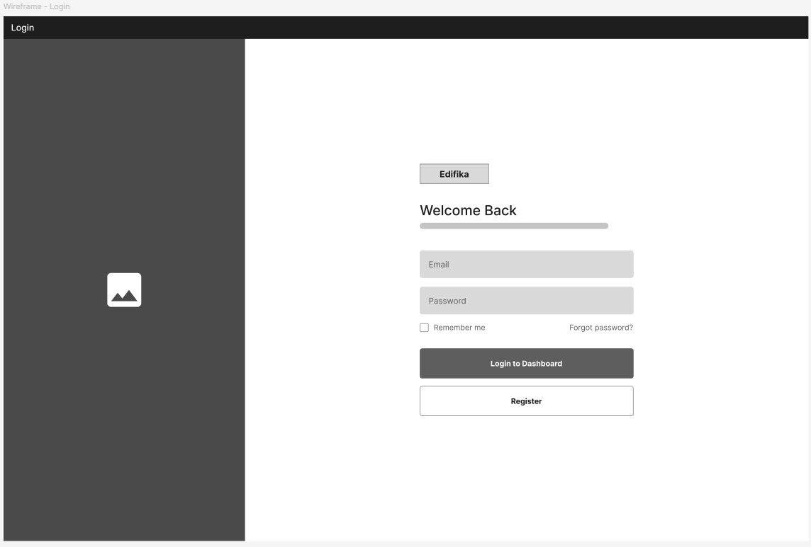
</p>

**Register**

<p align="center">
  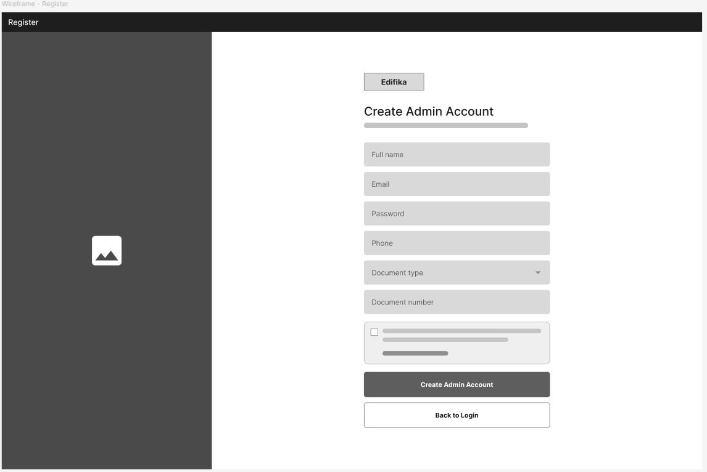
</p>

**Dashboard**

<p align="center">
  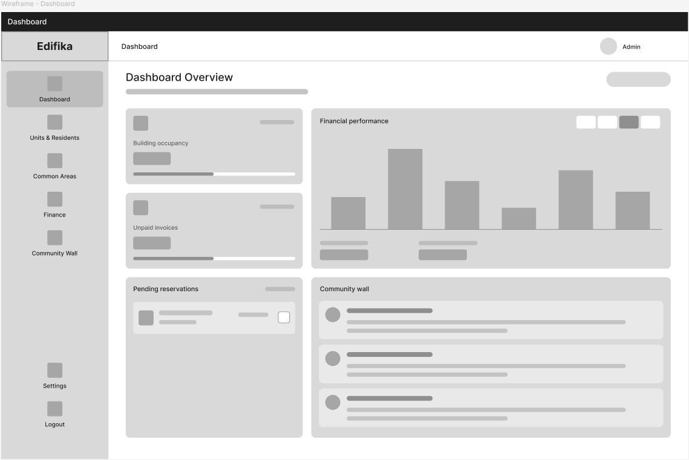
</p>

**Units & Residents**
<p align="center">
  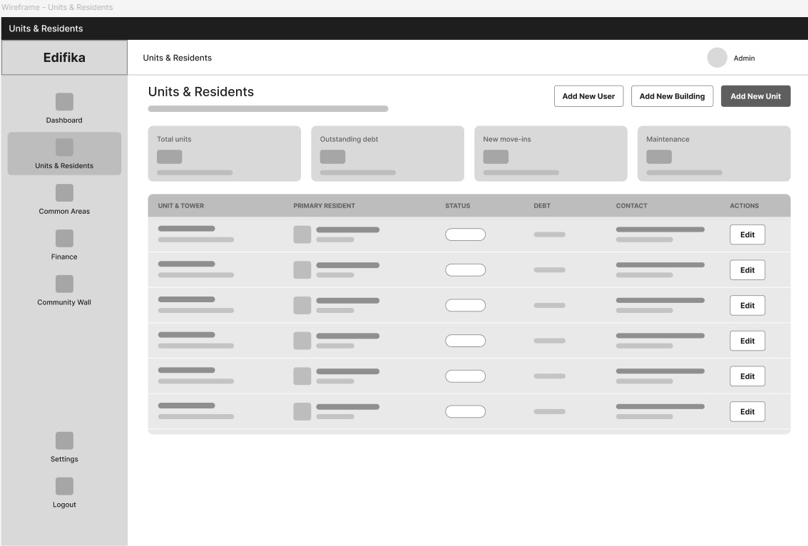
</p>

**Common Areas**

<p align="center">
  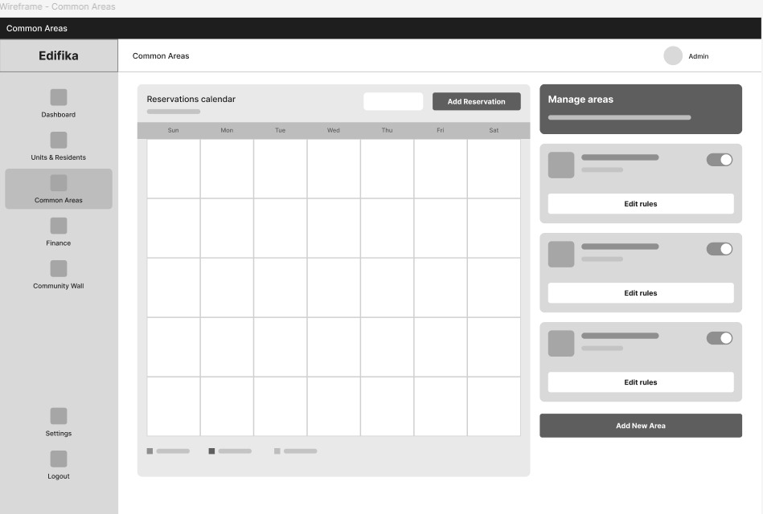
</p>

**Finance**
<p align="center">
  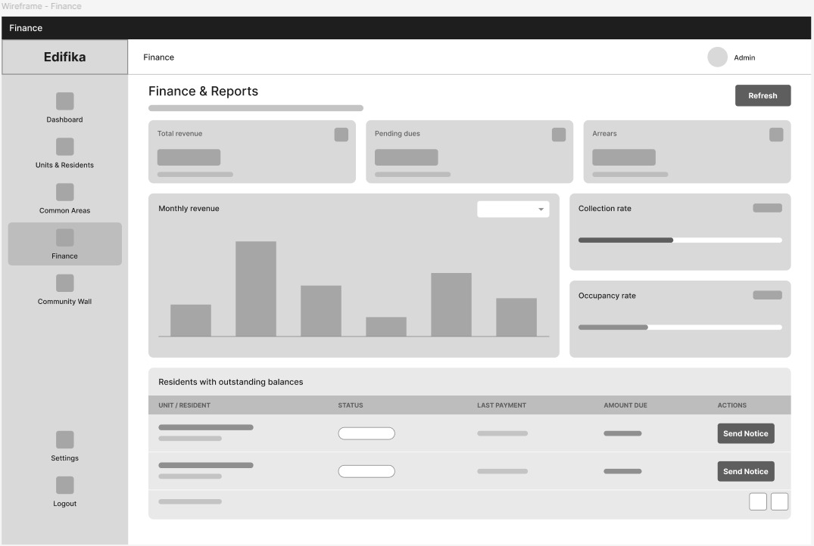
</p>

**Community Wall**

<p align="center">
  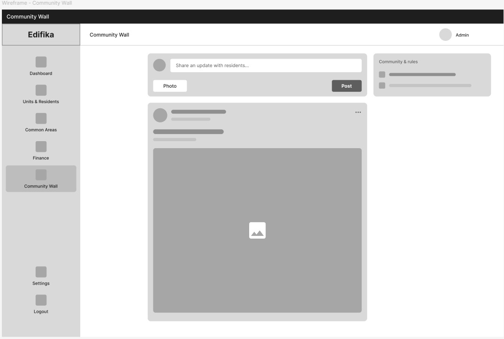
</p>

Link del Figma: https://www.figma.com/design/ty6TOS7jOtA6f0111hRNGo/Edifika---Login-Mockup?node-id=19-339&t=GfR39Vruiix1XYFB-0

### 5.4.2. Applications Wireflow Diagrams

**1. Wireflow 1: Registro e inicio de sesión del administrador**

User Persona: Administrador
User goal: El administrador quiere registrarse o iniciar sesión para acceder a Edifika y gestionar su edificio.

<p align="center">
  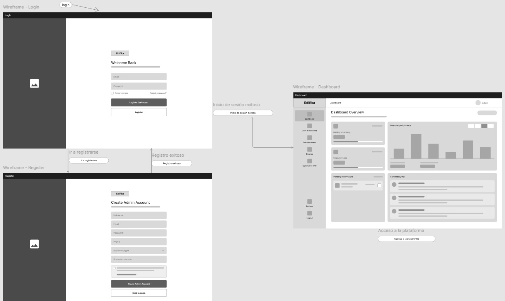
</p>

Este flujo representa el acceso inicial del administrador a la aplicación web. Puede crear una cuenta aceptando el reglamento interno, volver al inicio de sesión e ingresar al dashboard, desde donde accede a unidades, áreas comunes, finanzas y muro comunitario.


**2. Wireflow 2: Reserva de un área común **

User Persona: Usuario  
User goal: El usuario quiere reservar un área común en una fecha y horario disponibles, y ver su reserva en el calendario.

<p align="center">
  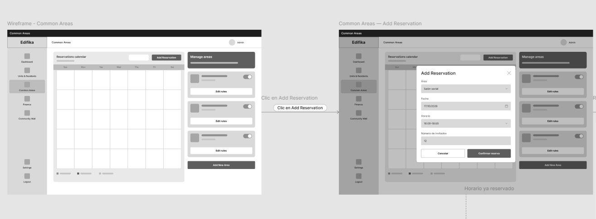
</p>
<p align="center">
  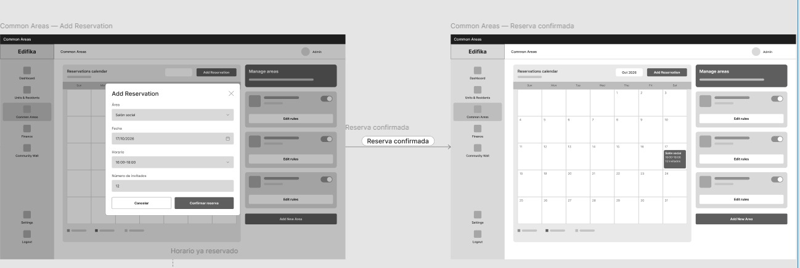
</p>
<p align="center">
  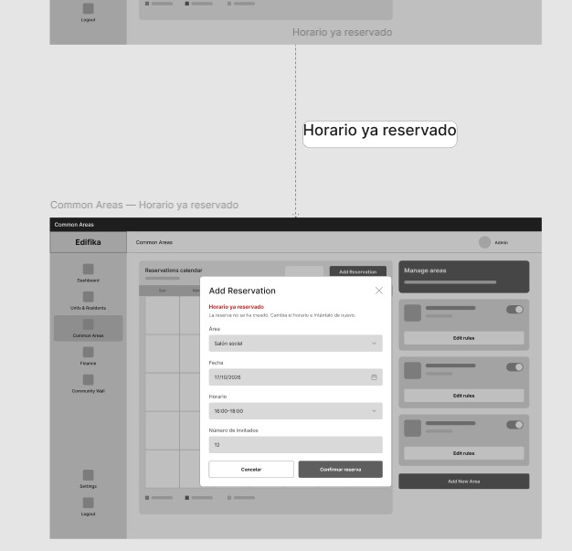
</p>

Este flujo muestra cómo se registra una reserva desde el calendario de áreas comunes. Si el horario elegido ya está ocupado, el sistema avisa y permite elegir otro; si está libre, la reserva queda confirmada y aparece en el calendario.

**3. Wireflow 3: Seguimiento financiero y morosidad**

User Persona: Administrador 
User goal: El administrador quiere revisar los ingresos y las deudas del edificio e identificar a los residentes morosos para enviarles un aviso.

<p align="center">
  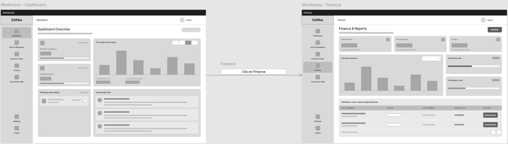
</p>

Este flujo parte del dashboard hacia la sección Finance, donde se revisan los indicadores y la lista de residentes con saldos pendientes. Desde ahí el administrador envía un aviso de cobro.

### 5.4.3. Applications Mock-Ups

**Login:**

<p align="center">
  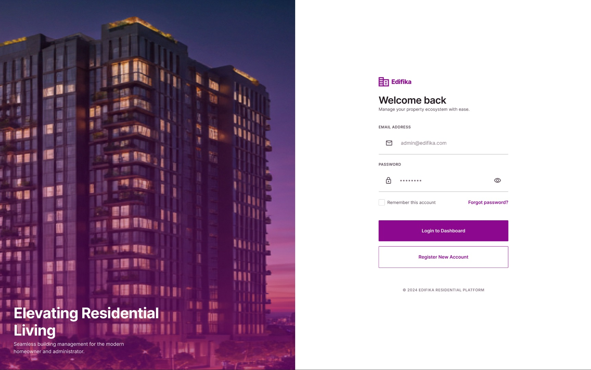
</p>

**Register:**

<p align="center">
  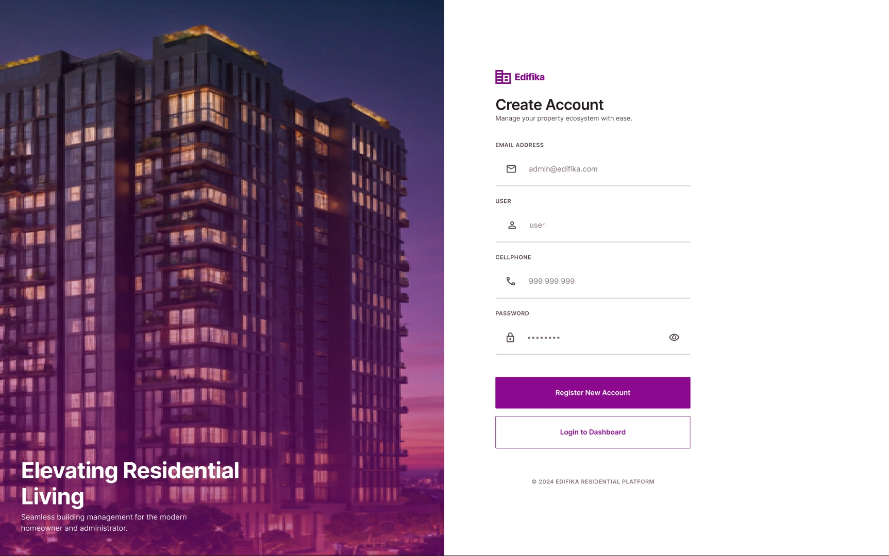
</p>

**Units & Residents:**

<p align="center">
  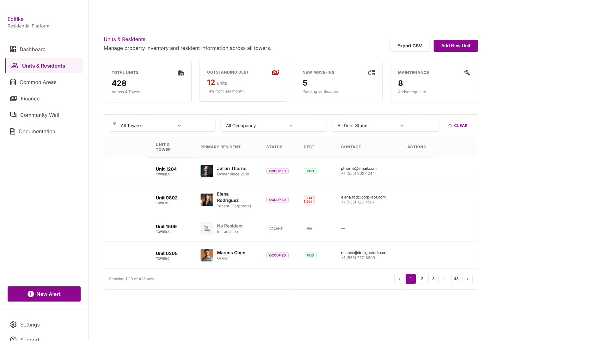
</p>

**Common Areas:**

<p align="center">
  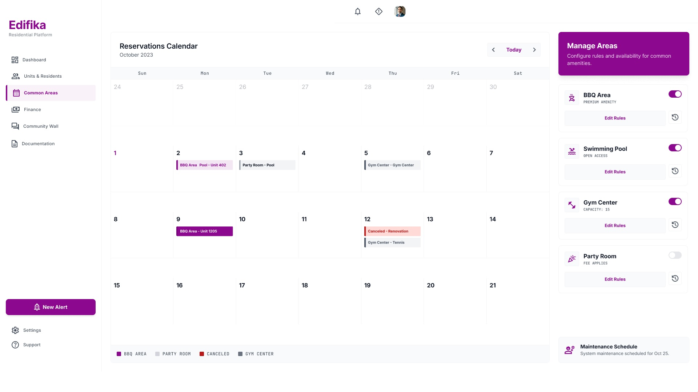
</p>

**Finance:**
<p align="center">
  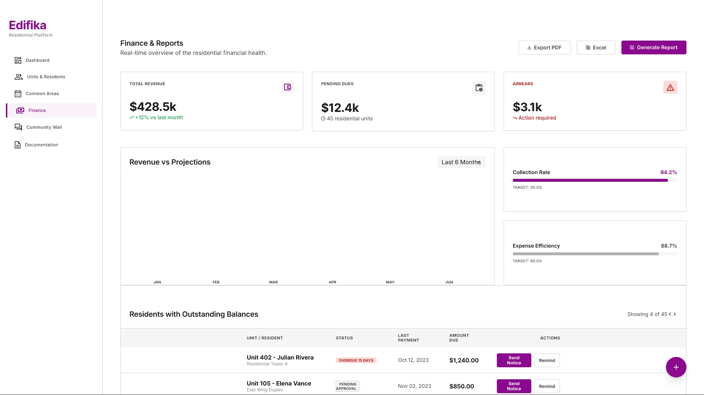
</p>

**Community Wall:**

<p align="center">
  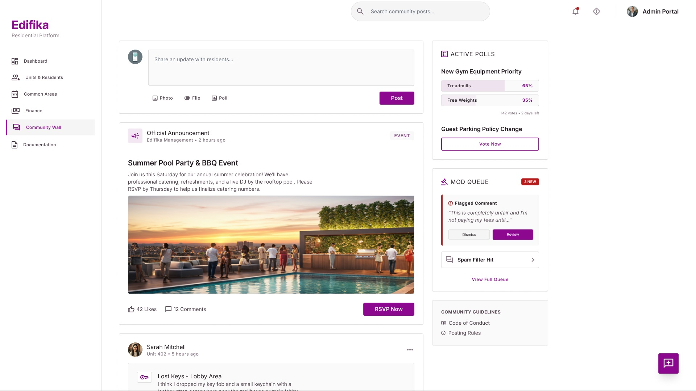
</p>

Link del Figma: https://www.figma.com/design/ty6TOS7jOtA6f0111hRNGo/Edifika---Login-Mockup?node-id=0-1&p=f&t=GfR39Vruiix1XYFB-0

### 5.4.4. Applications User Flow Diagrams

**User Flow 1: **

**User Persona:**   
**User goal:** 

**Pantallas base:**

- Register
- Login
- Dashboard

**Happy path:**


**Unhappy paths:**


---

**User Flow 2: **

**User Persona:**   
**User goal:** 

**Pantallas base:**


**Happy path:**


**Unhappy paths:**


---

**User Flow 3: **

**User Persona:**   
**User goal:** 

**Pantallas base:**


**Happy path:**


**Unhappy paths:**


## 5.5. Application Prototyping

## 5.6. IoT Device Design

### 5.6.1. Introducción y criterios de diseño

Edifika se ejecuta en el teléfono y en el navegador del administrador, pero la parte de la solución que decide sobre el mundo físico no es software: son cuatro tipos de nodo que se instalan dentro del condominio y que el usuario nunca configura, nunca ve y de los que depende para que un área tenga luz, una puerta se abra a la hora correcta y una fuga no se convierta en una inundación. El diseño de esos dispositivos es, por lo tanto, la decisión de diseño con las consecuencias más físicas del proyecto, y es donde los errores no se manifiestan como una excepción en la consola ni como un estado vacío en una tarjeta: se salen como una puerta que no abre con la visita dentro, o como un área común encendida a las tres de la mañana.

La propuesta de diseño físico y de circuito de estos dispositivos se apoya en **ocho criterios**, que no son una lista de deseos sino el orden en que se resuelven las decisiones cuando dos criterios entran en conflicto.

| Código | Criterio | Fundamento y consecuencia de diseño | Dónde se hace visible |
| :--- | :--- | :--- | :--- |
| **C1** | **A prueba de fallo por defecto** | El fallo más grave de un nodo no es que se apague, sino que se quede en un estado que perjudique a quien lo usa. Por eso cada actuador elige su posición en reposo según la consecuencia de quedarse sin alimentación: la cerradura abre y la luminaria se apaga. Un corte de energía no puede encerrar a un resident ni encender un área vacía. | Posición de reposo de los relés, sección 5.6.4 y 5.6.5 |
| **C2** | **Decisión física sin ida y vuelta a la nube** | La arquitectura ya decidió que el cloud concentra reglas de negocio y el edge la autonomía operativa (4.1.3.3). Traducido al dispositivo, el criterio significa que un umbral de lux, una comparación de caudal o una validación de UID se resuelven en el nodo o en el Edge API: esperar al cloud para abrir una puerta agrega latencia a una acción que el resident mide en el tiempo que tarda en apoyar la tarjeta. | Caché local de credenciales, corte local de bomba, sección 5.6.4 a 5.6.7 |
| **C3** | **Presupuesto de respuesta física** | La guía de estilos fija tres máximos medibles: LED en 200 ms, relé completo en 500 ms y tono antes de un segundo (5.1.2). Más allá de ese margen el usuario asume que el dispositivo no respondió y repite la acción, y una repetición sobre un actuador es un incidente. El firmware se evalúa contra esos tres números, no contra una impresión de rapidez. | Sección 5.6.8 |
| **C4** | **Un solo vocabulario de estado** | El LED, la etiqueta, el serial del Edge y la tarjeta del dashboard describen el mismo hecho con el mismo nombre. No existe un estado que el dispositivo llame de una forma y la aplicación de otra, porque el resident solo conoce una versión de la plataforma. | Sección 5.6.2 |
| **C5** | **Consumo, calor y mantenimiento** | Los nodos quedan conectados a la red eléctrica del edificio, pero se instalan en sitio y no se mantienen: la autonomía, el modo de bajo consumo y la posibilidad de diagnosticarlos importan tanto como el costo de la placa. Un nodo que hay que abrir para reconfigurar es un nodo que nadie reconfigura. | Suspensión profunda, ausencia de pantalla, reset sellado, sección 5.6.3 |
| **C6** | **Aislamiento eléctrico** | Ningún conductor de 220 V debe entrar en la placa de control. La conmutación de cargas se delega a un relé o contactor y la medición de corriente se hace con una pinza sobre el conductor, de modo que el aislamiento entre la red y la lógica sea físico y no una convención del software. | Sección 5.6.5 y 5.6.7 |
| **C7** | **Identidad y trazabilidad del objeto** | Un dispositivo instalado en un edificio real es un objeto físico que se pierde, se daña o se reemplaza. Cada nodo declara su identificador, su código QR y el tópico MQTT al que publica, porque el inventario de la aplicación y el objeto del pasillo tienen que poder reconocerse mutuamente. | Sección 5.6.2 |
| **C8** | **Instalación y accesibilidad** | Las decisiones dimensionales no son detalles de carpintería: determinan si un resident puede usar el dispositivo. La altura de instalación, el tamaño de la superficie de lectura y la separación entre un pulso corto y uno sostenido salen de la experiencia de uso, no del datasheet. | Sección 5.6.2 |

El criterio C4 merece una aclaración, porque es el que más restringe el diseño. Los tres contextos IoT del cloud —IoT Access Management, Smart Lighting & Automation e IoT Telemetry & Analytics— modelan el estado del dispositivo en su propio vocabulario (`ACTIVE`, `SUSPENDED`, `REVOKED`, `ON`, `OFF`, `OPEN`, `RESOLVED`, `LOW`, `MEDIUM`, `HIGH`), y el Edge API lo traduce al contrato MQTT. Ese vocabulario es correcto en el dominio, pero el resident frente a una puerta no conoce esos términos. La decisión de diseño que se adopta es que **el vocabulario físico es un subconjunto del vocabulario de la interfaz, nunca un tercero**: los términos que el usuario puede ver en la tarjeta de un dispositivo del dashboard son exactamente los que el LED codifica y los que el texto del Serial Monitor imprime. Un estado que solo existe en el firmware se considera un defecto de diseño, no una decisión de implementación.

### 5.6.2. Relación con la arquitectura de información y con la guía de estilos de interfaz física

La sección 5.1.2 (IoT Physical Interface Style Guidelines) define la interfaz física de los nodos y la sección 5.2 define cómo se nombra, se encuentra y se recorre el contenido del producto. Ambas condicionan el diseño de los dispositivos, y la relación no es de estilo sino estructural: sin ella existirían cuatro dispositivos técnicamente correctos que el usuario no podría distinguir de un producto ajeno.

| Decisión de arquitectura de información (5.2) | Regla de interfaz física (5.1.2) | Consecuencia en el diseño del dispositivo |
| :--- | :--- | :--- |
| **Criterio de nombrado único** (5.2.2): cada conjunto tiene una sola etiqueta, repetida en navegación, título, tabla y exportación. | Los textos impresos usan el Lenguaje Ubicuo (2.5), nunca un código interno ni un número de error. | La etiqueta del nodo repite el nombre del módulo del que cuelga —`Lighting & Sensing Node`, `Access Controller`, `Leak Detection Node`, `Energy Meter`— y no el nombre del microservicio que consume sus datos. La suscripción MQTT vive en la etiqueta como dato técnico, separada del nombre, para que instalar no exija entender la arquitectura. |
| **Organización por tópicos** en tres escalas (5.2.1). | La etiqueta declara "el tópico MQTT corto al que publica". | El espacio de nombres replica la taxonomía del producto en el orden `edifika/{edificio}/{módulo}/{dispositivo}`: el módulo es el mismo sidebar, el dispositivo es el mismo registro de inventario. Un técnico que lea la etiqueta entiende a qué parte del producto pertenece el nodo. |
| **Estados en mayúsculas con etiqueta textual, nunca solo color** (5.2.2). | Código del LED: cada estado tiene color **y** patrón de parpadeo, para sobrevivir a la daltonía, al sol directo y a un LED quemado. | El WS2812B de cada nodo implementa la tabla completa de 5.1.2 (fijo, dos parpadeos lentos, tres rápidos, intermitente, un parpadeo cada 5 s, apagado). La redundancia no es decorativa: es la traducción literal de la regla "el estado nunca se transmite solo con color" al medio físico. |
| **Cuando no se sabe el estado, la interfaz dice que no lo sabe** (5.1.2, IoT Style Guidelines). | Modo degradado: sin broker, el LED pasa a `Neutral` con parpadeo lento y el dispositivo conserva el último estado. | El firmware nunca re-publica un valor viejo con marca de tiempo reciente ni rellena un hueco por interpolación. La ausencia de lectura se publica como ausencia: `{ts, value: null, stale: true}`. Es la razón por la que el mensaje MQTT lleva el campo `stale` y no solo un número. |
| **Acciones a dos clics o menos** y **una sola acción primaria por pantalla** (5.2). | La pulsación corta ejecuta el control manual local; la mantenida de 1.5 s empareja o restablece. | El pulsador del nodo es la excepción controlada a esa regla de interfaz, y por eso se distinguen las dos duraciones: el control manual es una emergencia cuando el teléfono no tiene cobertura, y el emparejamiento no puede ocurrir por accidente porque un resident apoye el pie en el pulsador de un pasillo. |
| **Términos del Lenguaje Ubicuo** (2.5): "Acceso concedido", "Fuga detectada", "Corte automático", "Credencial suspendida". | El tono audible suena solo en tres casos: fuga detectada, corte automático de la bomba y apertura forzada. | El `Serial Monitor` del prototipo y el texto que el Edge reenvía a la notificación usan esas frases exactas. El firmware no emite "DENY", "TRIP" ni "ERR_07": esos nombres viven en el log técnico del Edge, no en el mensaje que ve el resident. |
| **Anatomía de la tarjeta de dispositivo**: píldora de conexión, hora de la última lectura y antigüedad de esa lectura. | El LED baja al 10 % de brillo entre 23:00 y 06:00 pero nunca se apaga del todo. | El heartbeat de 60 s que publica el nodo es el mismo dato que permite a la tarjeta calcular la antigüedad de la lectura; el brillo nocturno existe para que la señal siga presente sin molestar, que es el compromiso equivalente a "no mostrar un vacío como si fuera un resultado". |
| **Modo degradado**: banner "operando con datos locales" con la hora de la última sincronización. | A prueba de fallo: si el nodo pierde el broker, mantiene el último estado conocido y opera localmente. | La caché en SPIFFS del ESP32 es la contraparte física de ese banner. Sin él, el indicador "datos locales" de la aplicación sería una afirmación sin respaldo. |

De esta tabla se sigue una conclusión de diseño que conviene enunciar antes de entrar en los dispositivos: **el objeto físico y la tarjeta del dispositivo son dos vistas del mismo dato, no dos fuentes de verdad**. Por eso el nodo publica exactamente los campos que la tarjeta necesita mostrar —estado, valor, marca de tiempo, señal, batería— y nada que la tarjeta no sepa presentar. Un campo que solo existe en el firmware es un campo que nadie puede leer.

### 5.6.3. Stack común y cadena de herramientas

Los cuatro nodos comparten la misma base de hardware y de software. Esa decisión reduce el costo por unidad, simplifica el reemplazo de una placa y, sobre todo, hace posible que un solo manual de instalación sirva para todo el condominio.

| Capa | Elección | Justificación |
| :--- | :--- | :--- |
| **Microcontrolador** | ESP32 DevKit V1 | Wi-Fi integrado, suficientes GPIO analógicos y digitales, ecosistema Arduino con cliente MQTT nativo. Es el microcontrolador que ya aparece en el Container Diagram (4.1.3.3) y en TS17. |
| **Transporte** | MQTT 3.1.1 sobre Wi-Fi, QoS 1, mensajes `retained` para estado y credenciales | Es el protocolo que fija TS17 y el que usa el Edge API on-premise. QoS 1 evita perder la orden de cierre de una llave o la lista de credenciales; `retained` permite que un nodo que se enciende después del Edge reciba el estado vigente sin pedirlo. |
| **Broker** | EMQX local en el Edge Server (Raspberry Pi 4), reenvío al broker cloud gestionado | El broker no está en la nube: la arquitectura de 4.1.3.4 despliega el Edge Server on-premise precisamente para que el condominio siga operando sin enlace WAN. Un broker alojado únicamente en la nube convertiría cada corte de internet en una puerta que no abre. |
| **Firmware** | C++ sobre el framework Arduino, con `DeepSleep` por niveles | Común a los cuatro nodos; permite un modo de suspensión automático entre lecturas y reduce el consumo a un presupuesto medible. |
| **Diseño de circuito** | Fritzing (vista esquemática) | Permite documentar el circuito con la red de alimentación y los buses explícitos, condición para que un instalador pueda verificar el cableado sin interpretar un esquema de conexiones en silueta. |
| **Simulación y prototipado** | Wokwi, con ESP32 DevKit V1, MFRC522, sensor PIR, fotorresistencia, relé y buzzer | Es el entorno donde se ejercitan los flujos de interacción antes de tocar el hardware: presentación de credencial, disparo de movimiento, corte de bomba y pérdida de broker. |
| **Identificación** | QR/NFC en la etiqueta con `edificio`, `dispositivo`, `tópico` y `firmware` | Responde al criterio C7 y permite que el inventario de la aplicación y el objeto del pasillo se reconozcan mutuamente. |

Una decisión de diseño que atraviesa a los cuatro nodos y que conviene explicitar porque es contraintuitiva: **no hay pantalla en ningún dispositivo**. Una pantalla obligaría a cada nodo a resolver por su cuenta la composición de texto, los estados y la accesibilidad —es decir, a reimplementar dentro del firmware lo que 5.2 ya resolvió para el conjunto del producto—, y además habría que mantenerla encendida, lo que contradice el criterio de consumo. Toda la información que el resident necesita del objeto cabe en un LED codificado, un tono acotado y una etiqueta impresa.

### 5.6.4. Dispositivo 01 — Controlador de acceso de áreas comunes (ACC-01)

#### Descripción y criterios de diseño

El ACC-01 es el nodo instalado junto a cada puerta de área común que admite reservas. Su función es materializar una decisión que ya está tomada antes de que el resident llegue: la reserva aprobada genera un `AccessPermission` acotado a su ventana horaria, `EdgeGatewaySyncClient` lo empuja al Edge API, y el Edge lo deja disponible para el nodo en un tópico `retained`. El ACC-01 **no consulta al cloud en cada intento**: resuelve la UID contra la caché local y publica el resultado.

Los criterios que gobiernan su diseño son **C1** (la puerta no puede quedar cerrada a alguien dentro), **C2** (la decisión es local), **C4** (verde y rojo significan lo mismo que en la tarjeta) y **C8** (la lectura tiene que funcionar sin mirar el teléfono).

#### Diseño físico

La carcasa es de plástico ABS mate en `Neutral` con una franja frontal en `Primary`, con radios de 12 mm que replican las esquinas de las tarjetas de la aplicación, montada entre **1.2 y 1.6 m de altura** con iluminación suficiente y sin reflejos sobre la superficie del sensor. La superficie de lectura contactless se dimensiona a **25 mm o más**, de manera que el resident no dependa de la precisión de la alineación del dedo o de la tarjeta. No hay pantalla; hay LED, contactless, pulsador y orificio de reset.

El orden de los elementos en el frente responde a la frecuencia de uso, el mismo criterio que 5.2.1 aplica a las pantallas: el LED en la zona más visible del marco, el contactless a la altura natural de la mano, el pulsador debajo y el orificio de reset en la base, sellado con epoxy y alcanzable solo con una aguja por mantenimiento.

| Elemento | Cota / material | Razón de la decisión |
| :--- | :--- | :--- |
| Superficie contactless | ≥ 25 × 25 mm | Un área menor obliga a apuntar la tarjeta; el usuario interpreta el fallo como tarjeta no leída y repite el gesto, que en un lector bloqueado por anti-passback cuenta como intento adicional. |
| LED WS2812B | Ø 8 mm, visible a 3 m | Único indicador que funciona en la oscuridad, a distancia y sin contacto físico. |
| Pulsador tactil | Ø 12 mm, con recorrido distinguible | Permite el control manual local de emergencia y el emparejamiento, separados por duración. |
| Orificio de reset | Ø 2 mm, sellado | Su presencia sin acceso evita que un resident reinicie el dispositivo y borre la caché de credenciales. |
| Etiqueta | Altura de letra ≥ 2.5 mm, mayúsculas, contraste > 4.5:1 | Se lee a distancia y con la linterna del teléfono, no a la distancia de un monitor. |
| Altura de instalación | 1.2 – 1.6 m | Altura de uso de la mano adulta, y accesible para el resident mayor sin agacharse. |

#### Diseño de circuito

| Componente | Función | Nota de diseño |
| :--- | :--- | :--- |
| **ESP32 DevKit V1** | MCU, Wi-Fi, cliente MQTT, decisión local de acceso | Concentra la lógica de `AccessDecisionService` en su versión local: activa, no está en la blacklist y tiene permiso vigente para esa área en ese instante. |
| **MFRC522 (RC522)** | Lector RFID 13.56 MHz por SPI | Se alimenta desde el regulador de **3.3 V**, no del riel de 5 V: es la causa más común de lecturas de UID intermitentes en la implementación de referencia. |
| **Reed magnético** | Estado de la puerta y detección de apertura forzada | Normalmente cerrado dentro del circuito de alarma, de modo que también detecte el sabotaje del cable. |
| **WS2812B** | Código de estado | Un solo pin de datos, con protocolo one-wire de 800 ns; no requiere resistencias limitadoras por canal. |
| **Driver MOSFET IRLZ44N** | Excitación de la bobina | Un GPIO no puede conmutar una bobina de 12 V: la corriente de conmutación lo degrada. |
| **1N4007** | Diodo de volante en paralelo a la bobina | Sin él, el pico inductivo de la bobina al cortar vuelve al GPIO y produce reinicios esporádicos, que en un lector se manifiestan como "puertas que a veces no abren". |
| **Relé fail-safe 12 V** | Cerradura eléctrica | Contacto **NA**: sin alimentación, la puerta queda abierta (C1). |
| **Buzzer piezo 3 V** | Apertura forzada únicamente | Silenciado entre 23:00 y 06:00; máximo 3 s por evento. |

La decisión eléctrica más importante del ACC-01 es la **posición de reposo del relé**. El criterio C1 se resuelve aquí de forma explícita: la cerradura se alimenta en reposo, de modo que un corte de energía, un reinicio del nodo o una falla del Edge dejan la puerta abierta. El peor escenario en un recinto común no es una puerta que se abre de más —que se audita y se registra— sino una persona encerrada en un área común sin cobertura. El control de acceso sigue existiendo en el sentido contrario, que es el que protege a la comunidad, y esa asunción está documentada porque es la que un instalador va a cuestionar.

La segunda decisión es la **resolución por omisión**. Si la UID presentada no está en la caché local —porque el nodo acaba de encenderse, porque la caché está corrupta o porque el resident fue dado de baja hace minutos y la sincronización no ha llegado—, el resultado es `DENEGADO`, no "permitido por no saber". Un sistema de control de acceso que falla hacia la apertura no es un sistema con una tasa de error: es un sistema sin control de acceso.

#### Flujos de interacción que cubre el prototipo

El prototipo en Wokwi ejercita el recorrido completo de una credencial sobre el nodo, con el MFRC522, la puerta, el relé y el buzzer conectados y el ESP32 publicando por MQTT contra el broker del Edge.

| Paso | Actor / componente | Acción | Respuesta del sistema | Verificación observable |
| :--- | :--- | :--- | :--- | :--- |
| 1 | Resident | Acerca la credencial a la superficie | El MFRC522 lee el UID y el nodo lo busca en la caché local | LED violeta intermitente = acción en curso |
| 2 | ACC-01 | Compara contra credenciales, blacklist y permiso vigente | Decide `GRANTED` y acciona el relé | Parpadeo verde antes de 200 ms; relé completo antes de 500 ms |
| 3 | ACC-01 | Publica el intento | `acc-01/attempts {uid, result, rssi, ts}` en menos de 200 ms | El `Serial Monitor` imprime "Acceso concedido" |
| 4 | Edge API | Reenvía el intento | IoT Access Management persiste `AccessAttempt` y publica `PhysicalAccessGranted` | La tarjeta del dispositivo en el dashboard pasa a ONLINE con la hora de la lectura |
| 5 | Resident | Retira la credencial | El relé vuelve a reposo y la puerta se cierra sola | El lector vuelve a LED verde fijo = normal |

Los **caminos infelices** son los que justifican el diseño del hardware, y son cinco:

| Situación | Comportamiento diseñado | Por qué esa respuesta |
| :--- | :--- | :--- |
| Credencial **suspendida o revocada** (por morosidad, `ResidentMarkedDelinquent`) | LED rojo con tono corto; el relé no acciona; se publica `PhysicalAccessDenied` | Son dos situaciones distintas para el resident —“tarjeta no leída” y “me la suspendieron”— y exigen respuestas opuestas: repetir el gesto en el primer caso, llamar al administrador en el segundo. Un único tono genérico obligaría al resident a adivinar siempre. |
| **Sin broker** (WAN caído) | El nodo sigue resolviendo contra la caché, publica en cuanto vuelve el enlace y el LED pasa a `Neutral` con un parpadeo cada 5 s | Es el criterio C2: la operación del condominio no depende del cloud. Lo que se pierde es la inmediatez de la auditoría, no el acceso ya autorizado. |
| **Puerta forzada o cable saboteado** | El reed dispara; LED rojo con tres parpadeos rápidos y tono, y se publica el estado de puerta | Es uno de los tres únicos casos que justifican el tono audible, porque exige una respuesta del resident en el momento y no puede resolverse en el dashboard de mañana. |
| **Sin permiso vigente** (la reserva ya terminó) | LED ámbar, dos parpadeos lentos, sin tono | Es el estado `Atención` de 5.1.2: no es una falla ni una alarma, es una explicación. El resident está en la puerta correcta pero fuera de horario, y el ámbar le dice que la respuesta está en la aplicación. |
| **Reinicio del dispositivo** | Contacto NA: la puerta queda abierta y el LED vuelve a normal al reconectarse | El peor resultado posible de un corte de energía en un espacio común es dejar gente encerrada; el criterio C1 manda sobre la conveniencia de la puerta cerrada. |

### 5.6.5. Dispositivo 02 — Nodo de iluminación inteligente y sensado (LGT-01)

#### Descripción y criterios de diseño

El LGT-01 se instala embebido en cada luminaria de las áreas comunes. Mide presencia, nivel de lux y corriente, decide localmente el encendido y el apagado, y reporta telemetría al Edge. Es el nodo donde el criterio C2 es más estricto, porque la latencia de encendido es lo que el resident percibe como "la luz tarda": si el nodo consultara la nube antes de conmutar, cada vez que una persona cruza la puerta de la sala de fiestas esperaría en la oscuridad el tiempo de un viaje de ida y vuelta a los servidores.

Los criterios que gobiernan su diseño son **C2** (decisión local del umbral de luz), **C3** (presupuesto de respuesta física), **C6** (aislamiento de la red) y **C5** (el nodo queda encima de la luminaria, sin mantenimiento).

#### Diseño físico

El LGT-01 se monta en el techo o en el marco de la luminaria, con el sensor PIR orientado hacia el acceso y con el campo de detección ajustado para que no alcance el fondo de la sala, de modo que un resident que cruza la puerta active la luz sin que alguien sentado al fondo la apague desde el borde opuesto. El acabado mate del frente evita reflejos que confundan tanto al sensor infrarrojo como a quien intenta ver el LED a contraluz; el LED queda en el borde inferior de la carcasa, que es la única posición visible desde el suelo.

| Elemento | Cota / material | Razón de la decisión |
| :--- | :--- | :--- |
| Frontal del sensor PIR | Orientado hacia el acceso, sin detectar el fondo de la sala | Detecta el cruce de una persona y no el movimiento de alguien ya sentado. |
| Ventana del LDR | Opuesta al PIR, nunca tras la propia fuente de luz | Si el LDR midiera la luz emitida por la luminaria, la lectura dependería del estado del actuador y el umbral de lux nunca se estabilizaría. |
| LED de estado | En el borde inferior de la carcasa, visible desde el suelo | Es la única forma de que el resident sepa si el nodo está vivo sin abrir el tablero del condominio. |
| Etiqueta | Con el ID de nodo, QR y tópico | El inventario de la aplicación lista luminarias por ubicación; la etiqueta dice cuál de ellas es. |
| Alimentación | Vía derivación de la propia luminaria | Evita un cable de red por punto de luz y por lo tanto una obra mayor por nodo instalado. |

#### Diseño de circuito

| Componente | Función | Nota de diseño |
| :--- | :--- | :--- |
| **ESP32 DevKit V1** | Sensado, decisión local y publicación | Aplica la regla de `AutomationDecisionService` en su versión local: presencia, lux, franja horaria de reserva y anulación vigente. |
| **PIR HC-SR501** | Presencia, salida digital | Sensor digital: no consume un canal ADC y su señal no requiere filtrado analógico. |
| **LDR GL5528 con divisor 10 kΩ / 10 kΩ** | Nivel de lux | Va al **ADC1**; la salida digital DO del módulo se omite porque el umbral se define en el editor de reglas de la aplicación, no con un potenciómetro en el techo. |
| **ACS712 5 A** | Corriente real de la luminaria, en mA | Pinza sobre la fase: es la forma de medir sin poner un conductor de 220 V en la placa (C6). |
| **WS2812B** | Código de estado completo | Traducción literal de la tabla de 5.1.2. |
| **BC547 + 1N4007** | Driver del relé con diodo de volante | La bobina del relé nunca conecta directamente al GPIO. |
| **Relé SRD-05VDC-SL-C (SPDT 10 A)** | Conmutación de la luminaria | Contacto **NA**: ante reinicio del nodo, la luminaria queda apagada (C1 aplicado a una carga, con el criterio inverso al de la cerradura: el riesgo del error es el consumo de energía, no la seguridad de una persona). |

La decisión de canal analógico es la que más restricciones impone al resto del circuito y conviene explicitarla: **todos los sensores analógicos se conectan al ADC1 (GPIO 32–39)**. El ADC2 del ESP32 deja de estar disponible mientras el driver Wi-Fi está activo, de modo que un LDR o un ACS712 en GPIO 4, 13, 14, 15, 25 o 27 devolvería lecturas corruptas justamente cuando el nodo está conectado, que es cuando más importa medir. Además, el LDR y el ACS712 comparten masa con la bobina del relé, de modo que un cable de potencia colocado mal puede derivar ruido de conmutación sobre la lectura de corriente. Por eso la fuente, la bobina y el plano de sensado se cablean con trayectorias separadas dentro de la caja, y el ACS712 se instala a 10 cm del borne, no sobre él.

#### Flujos de interacción que cubre el prototipo

| Paso | Disparador | Decisión | Respuesta física | Verificación observable |
| :--- | :--- | :--- | :--- | :--- |
| 1 | El PIR detecta presencia | El nodo lee el LDR | LED violeta intermitente durante el sensado | En Wokwi, "Simulate Motion" en el PIR |
| 2 | Lux por debajo del umbral y franja dentro de `LightingSchedule` | Enciende localmente y publica `AreaPresenceDetected` | Relé en menos de 500 ms | El relé de Wokwi cambia de estado; el `Serial Monitor` imprime el valor de lux |
| 3 | La reserva empieza (`ReservationStarted`) | Enciende de forma programada el área | Relé en menos de 500 ms | Simulación de la franja horaria de la regla |
| 4 | Presencia detectada y luz alta | No enciende | LED verde fijo = normal, sin tono | El evento se publica igualmente: "hubo alguien y no encendimos" es un dato de analítica |
| 5 | Inactividad por más de `PresenceTimeout` | Apaga | LED verde fijo | La curva de consumo en el dashboard refleja el ciclo |

**Caminos infelices:**

| Situación | Comportamiento diseñado | Razón |
| :--- | :--- | :--- |
| **Anulación manual desde la aplicación** | El nodo ejecuta la anulación con su duración y expiración, y lo registra como `OverrideTriggered` | Un resident que enciende la luz manualmente y se olvida de apagarla es un caso normal; la anulación tiene fecha de expiración justamente para que no quede una luminaria encendida hasta que alguien se fije. |
| **Sin broker** | El nodo sigue encendiendo y apagando por su regla local, el LED pasa a `Neutral` con parpadeo de 5 s y acumula la telemetría en memoria | Un corte de internet en la noche no puede dejar el área común a oscuras. La telemetría pendiente se publica al restablecerse el enlace, marcada como local. |
| **Reinicio del nodo** | La luminaria queda apagada y el nodo vuelve a su regla en menos de un minuto | Con contacto NA, un reinicio accidental no enciende un área vacía a las tres de la mañana. |
| **Batería de respaldo degradada** (en las instalaciones con respaldo) | LED ámbar, dos parpadeos lentos; la automatización sigue operando | `Atención` es el estado intermedio entre "todo bien" y "falla": el administrador necesita verlo antes de que sea una falla, y el resident no debe presenciarla como una alarma sobre una luz que sí funciona. |
| **Lectura de lux inválida** (LDR desconectado) | No se enciende por presencia en ese punto; publica `stale: true` y el LED pasa a ámbar | El firmware no rellena con el último valor ni interpola: un umbral de lux aplicado sobre una lectura muerta enciende la luz de día, que es el peor modo de falla visible para la comunidad. |

### 5.6.6. Dispositivo 03 — Nodo hidráulico de detección de fugas (HYD-01)

#### Descripción y criterios de diseño

El HYD-01 se instala en la bomba y la cámara de agua de una zona hidráulica. Mide caudal y presión, distingue una fuga real de un consumo legítimo fuera de horario, corta la bomba y emite la alerta. Es el nodo con la consecuencia más grave de los cuatro, y por eso es también el que concentra las decisiones de **C1** (cortar antes que inundar), **C2** (el corte no espera al cloud) y **C5** (está en un cuarto de máquinas, sin nadie que lo mire).

Los criterios que lo gobiernan se refuerzan: un corte de bomba es una molestia discutible; una inundación en un departamento es un daño irreversible. Ante la duda, el diseño corta.

#### Diseño físico

La carcasa se monta en la pared de la cámara de agua, a la altura de la vista del operador de mantenimiento, con prensaestopa y entrada de cable con prensaestopa PG7 para que el agua no entre por el conector. A diferencia de los otros nodos, este puede tener un tono audible porque está en un espacio técnico y no en un pasillo: el criterio de 5.1.2 que limita el tono a tres casos se cumple íntegro, pero el tono de corte automático se emite sin silenciamiento nocturno, porque un corte de bomba a las 3 a. m. sí requiere que alguien lo sepa.

| Elemento | Cota / material | Razón de la decisión |
| :--- | :--- | :--- |
| Carcasa | IP54, con prensaestopa PG7 y junta | El cuarto de máquinas tiene humedad y goteo occasional; un nodo sin protección falla por entrada de agua y arrastra a la bomba. |
| Sensor de caudal | En la línea de impulsión, aguas arriba de la bomba | Medir el caudal que llega a la bomba es lo que permite distinguir una demanda real de una fuga en la línea. |
| Sensor de presión | En la toma de aspiración | Una caída de presión sin caudal correspondiente es lo que marca la bomba como `FAULT`, según `LeakDetectionService`. |
| LED y buzzer | En el frente, visibles desde el acceso | El operador de mantenimiento debe ver el estado sin entrar al cuarto. |
| Etiqueta | Con la zona hidráulica y el ID de la bomba | `LeakAlert` se crea sobre una bomba concreta; la alerta sin ubicación no es accionable. |

#### Diseño de circuito

| Componente | Función | Nota de diseño |
| :--- | :--- | :--- |
| **ESP32 DevKit V1** | Lectura, comparación contra umbrales, corte y publicación | Aplica localmente `LeakDetectionService`: caudal sobre umbral fuera de la franja esperada, sostenido más de `minDeviationMinutes`, se declara fuga. |
| **Sensor de caudal con salida de pulsos** | Caudal instantáneo | Se conecta por interrupción: el firmware cuenta pulsos por intervalo en lugar de leer un ADC, porque el sensor no tiene salida analógica y porque contar pulsos en el flanco es la forma de no perder los eventos que la bomba genera. |
| **Sensor de presión analógico** | Presión de la línea | Al **ADC1**, con la misma restricción de canal que el LGT-01. |
| **Relé de corte de la bomba** | Interrumpe la alimentación de la bomba | Se acciona por **pulsos**, no por nivel mantenido: el corte tiene que funcionar también con la alimentación de la bomba en el mismo circuito que el nodo. |
| **Buzzer piezo** | Fuga detectada y corte automático | Uno de los tres casos que 5.1.2 autoriza a hacer sonar. |
| **WS2812B** | Estado de la bomba y de la línea | Código completo de 5.1.2. |
| **Alimentación con respaldo** | Batería de respaldo del nodo | El corte de bomba por lectura local tiene que funcionar aunque se caiga la red eléctrica, no solo si se cae el internet. |

La decisión de circuito que distingue a este nodo es el **corte por lectura local, no por comando remoto**. La arquitectura ya resolvió que `FlowReadingReceived` lo publica el Edge API y no Telemetry, priorizando la latencia de corte sobre la interpretación de dominio. Traducido al hardware, eso significa que el nodo no espera el comando `shutoff` del cloud: si su propia lectura supera el umbral durante el tiempo mínimo configurado, corta y publica el evento. El corte remoto sigue existiendo como redundancia —el administrador puede cortar desde la aplicación y el nodo obedece—, pero no es el mecanismo primario. Una inundación no espera el tiempo de un viaje de ida y vuelta a los servidores, y un nodo que solo cortara por comando remoto habría convertido la arquitectura offline-first en decorativa.

#### Flujos de interacción que cubre el prototipo

| Paso | Disparador | Decisión | Respuesta física | Verificación observable |
| :--- | :--- | :--- | :--- | :--- |
| 1 | Consumo legítimo dentro de la franja esperada | Caudal bajo el umbral | LED verde fijo = normal | La curva de caudal en el dashboard sigue el perfil de uso |
| 2 | Caudal sobre el umbral fuera de la franja | Comienza el conteo de `minDeviationMinutes` | LED violeta intermitente = evaluando | El `Serial Monitor` imprime el tiempo de desviación acumulado |
| 3 | La desviación se sostiene más de `minDeviationMinutes` | Declara fuga, corta la bomba | LED rojo con tres parpadeos rápidos + tono; relé de corte en menos de 500 ms | El relé de Wokwi se abre; se publica `LeakDetected` y `PumpShutOff` |
| 4 | El administrador revisa y cierra la alerta | Registra la resolución | LED verde fijo = normal | `LeakResolved` publica; la alerta sale de la lista abierta |
| 5 | Presión cae sin caudal correspondiente | Marca la bomba `FAULT` | LED rojo + tono | La bomba aparece como `FAULT` en el inventario |

**Caminos infelices:**

| Situación | Comportamiento diseñado | Razón |
| :--- | :--- | :--- |
| **Consumo legítimo nocturno** (una familia se ducha tarde) | La franja esperada y el umbral por zona evitan la falsa alarma; si aun así llegara a dispararse, la `LeakAlert` queda `OPEN` y el administrador puede resolverla sin que la bomba se haya detenido por un segundo | Una falsa alarma que apaga la bomba entrena al administrador a ignorar las alertas, que es el peor resultado posible para una fuga real. La separación entre `LOW`, `MEDIUM` y `HIGH` existe para que solo `HIGH` corte de inmediato. |
| **Corte de la alimentación eléctrica** | El respaldo del nodo mantiene la lectura y el corte local; al restablecerse, publica el evento acumulado | El corte de bomba por lectura local tiene que ser independiente de la red, no solo del internet. |
| **El sensor de caudal falla (no emite pulsos)** | No se declara ni fuga ni normalidad: publica `stale: true` y el LED pasa a ámbar | La ausencia de lectura se declara como ausencia. Un firmware que asumiera "sin pulsos = sin caudal" apagaría la bomba en cada falla del sensor. |
| **Fuga lenta, por debajo del umbral durante minutos** | `minDeviationMinutes` y la línea base por zona evitan el disparo por ruido; el resto se cubre con analítica, no con corte | El corte es para la fuga evidente; la fuga lenta se detecta en el dashboard por tendencia, que es donde el costo de equivocarse es menor. |
| **Apertura forzada de la caja del nodo** | Reed antimanipulación en la misma caja, publicado como parte del estado del dispositivo | Un nodo del cuarto de máquinas que puede ser abierto sin dejar rastro no es confiable para una función de seguridad hydraulic. |

### 5.6.7. Dispositivo 04 — Medidor de consumo energético (PWR-01)

#### Descripción y criterios de diseño

El PWR-01 mide el consumo de las luminarias y de los equipos comunes de las áreas que las consumen, y es el dispositivo que alimenta el cálculo de kWh, las estadísticas y la detección de anomalías del contexto IoT Telemetry & Analytics. A diferencia de los otros tres nodos, **no actuá**: no enciende ni apaga nada. Su única salida es la lectura.

Los criterios que lo gobiernan son **C5** (consumo y ausencia total de mantenimiento en el punto de medición), **C6** (la pinza de corriente es el único punto de contacto con el conductor energizado) y **C4** (el valor que publica es el mismo que muestra la tarjeta, con su marca de tiempo).

#### Diseño físico

El PWR-01 se monta en el tablero del cuadro eléctrico del área, o en el tablero de la bomba cuando corresponde. La carcasa es más cerrada que la de los otros nodos, porque no hay ninguna superficie de interacción que proteger: no hay LED de estado para el resident ni contactless que esperar. Aun así conserva el LED en estado `Warning` de batería baja cuando la instalación usa respaldo, y la etiqueta con el ID del medidor, porque el inventario de telemetría lista medidores por ubicación igual que lista luminarias.

| Elemento | Cota / material | Razón de la decisión |
| :--- | :--- | :--- |
| Ventana de la pinza | Ø 12 mm, para conductores de hasta 12 mm | La pinza se cierra alrededor del conductor sin cortar ni pelar el cableado del edificio. |
| Posición de la pinza | En la fase, a 10 cm del borne | Evita medir la caída de tensión del propio cable de conexión y mantiene la lectura estable. |
| LED | `Warning` de batería baja, cuando hay respaldo | Único estado que el PWR-01 necesita poder mostrar: el resto se lee en el dashboard. |
| Etiqueta | Con el ID del medidor y la zona | La anomalía se reporta por zona, no por nodo. |

#### Diseño de circuito

| Componente | Función | Nota de diseño |
| :--- | :--- | :--- |
| **ESP32 DevKit V1** | Muestreo, integración y publicación | Publica por evento y con un heartbeat de 60 s, igual que los otros nodos, para que la tarjeta del dispositivo pueda calcular la antigüedad de la lectura. |
| **ACS712 5 A** | Corriente RMS de la zona | Salida analógica al **ADC1**; el cálculo de kWh lo hace el microservicio de telemetría, no el nodo. |
| **WS2812B** | Estado de batería del respaldo | Solo para instalaciones con respaldo. |
| **Pulsador** | Reinicio de fábrica del contador acumulado | Sellado igual que en los otros nodos; reinicia la energía acumulada, no la configuración. |
| **Alimentación** | Derivación del propio cuadro | El medidor no necesita alimentación propia: se alimenta de la línea que mide. |

La decisión que define a este nodo es **dónde se calcula el kWh**. El nodo mide corriente y la publica; el servidor la agrega en ventanas de tiempo. Concentrar el cálculo en el nodo obligaría a cada dispositivo a mantener la línea base y el modelo de consumo, y a sincronizar ese modelo con el servidor en cada cambio de regla, con el riesgo de que dos copias del cálculo diverjan. El cálculo en el servidor mantiene una sola verdad del consumo y deja al nodo con la única tarea que no puede fallar sin que se note, que es medir bien.

#### Flujos de interacción que cubre el prototipo

| Paso | Disparador | Decisión | Respuesta | Verificación observable |
| :--- | :--- | :--- | :--- | :--- |
| 1 | Corriente estable en la zona | Muestreo periódico | Publica `{ma, ts}` | La serie de consumo crece en el dashboard |
| 2 | Consumo por encima de la línea base del área | Se evalúa la desviación | LED violeta intermitente = evaluando | Se publica el evento; el `Serial Monitor` imprime la desviación |
| 3 | Anomalía confirmada | IoT Telemetry crea `AnomalyFlag` | LED `Danger` | `AbnormalConsumptionDetected` aparece en el panel de anomalías |
| 4 | Normalización del consumo | La anomalía se cierra | LED verde fijo = normal | La serie vuelve a la línea base |

**Caminos infelices:**

| Situación | Comportamiento diseñado | Razón |
| :--- | :--- | :--- |
| **Conductor sin corriente** | Publica 0 mA con marca de tiempo válida; no es una lectura ausente | Un cero es un dato. La distinción entre "no hay consumo" y "no sé el consumo" es la misma que la tarjeta de la interfaz necesita para no presentar un vacío como si fuera un resultado. |
| **Pinza abierta o mal cerrada** | Publica `stale: true` y LED ámbar | Es el modo de falla más común de una pinza de corriente, y el más silencioso: sin la marca de `stale`, el dashboard mostraría un cero perfecto durante horas. |
| **Pico de corriente por arranque de la bomba** | Se integra como lectura normal; el filtro no descarta picos | Descartar picos "para limpiar la serie" produce un consumo subestimado justo cuando hay una anomalía real; la limpieza se hace en el análisis, no en la medida. |
| **Sin broker** | El nodo acumula en memoria y publica al restablecerse, con marca de "local" | Criterio C2 aplicado a la lectura: la pérdida del enlace no interrumpe la medición, solo su visibilidad inmediata. |
| **Alimentación interrumpida** | Con respaldo, el nodo sigue midiendo y avisa con LED ámbar cuando la batería baja | Sin respaldo, la lectura se declara ausente en lugar de congelarse en el último valor, porque un valor congelado en vivo es la forma más rápida de perder la confianza del usuario en todo el panel. |

### 5.6.8. Verificación de los prototipos y presupuestos de respuesta

Los cuatro prototipos se construyeron en Wokwi sobre ESP32 DevKit V1, con los sensores y actuadores reales del diseño, y se ejercitaron contra los flujos descritos en cada dispositivo. La verificación no se limita a "funciona": se contrasta contra los presupuestos de respuesta fijados en 5.1.2, porque esos tres números son la diferencia entre una alarma creíble y una alarma que el usuario aprende a ignorar.

| Presupuesto de 5.1.2 | Valor | Verificación en el prototipo | Dispositivo donde es crítico |
| :--- | :--- | :--- | :--- |
| **El LED confirma la intención** | ≤ 200 ms | Con el MFRC522 leyendo la UID, el WS2812B cambia a violeta intermitente antes de los 200 ms | ACC-01, LGT-01 |
| **El relé completa la acción física** | ≤ 500 ms | El relé de Wokwi conmuta dentro de la ventana, medido entre la decisión del firmware y el cambio de estado del contacto | ACC-01, HYD-01, LGT-01 |
| **El tono llega antes de un segundo** | < 1 s | El buzzer suena dentro del segundo en el caso de apertura forzada, corte de bomba y fuga | ACC-01, HYD-01 |
| **El LED baja al 10 % sin apagarse entre 23:00 y 06:00** | Verificado por inspección de firmware | La atenuación se aplica al brillo, nunca al estado: el LED apagado no codifica ningún estado | Todos |
| **Sin broker, el nodo conserva el último estado y sigue operando** | Verificado desconectando el broker en la simulación | La caché en NVS y SPIFFS permite operar y encolar la telemetría | Todos |
| **El mensaje distingue valor ausente de valor cero** | Verificado en el `Serial Monitor` | El campo `stale` acompaña a cualquier lectura que no provenga del sensor | PWR-01, HYD-01, LGT-01 |

Estos presupuestos son, además, el criterio con el que se evalúa el firmware antes de cada despliegue. Un cambio que agregue un retardo perceptible al LED o al relé no es una regresión de rendimiento sino un cambio de comportamiento de la interfaz física, y se trata como tal: se mide contra la tabla, no contra una sensación.

### 5.6.9. Trazabilidad con las historias de usuario

El diseño de los dispositivos no introduce funcionalidades nuevas: materializa las que ya están especificadas. La correspondencia completa está en TS16 y TS17, que fijan el registro y la comunicación de los dispositivos ESP32 por MQTT.

| Historia | Requisito que fija el dispositivo | Dispositivo y decisión de diseño que lo satisface |
| :--- | :--- | :--- |
| **TS16**, escenario 1 | Registrar el dispositivo con tipo, ubicación y edificio; queda `INACTIVO` hasta su primera conexión | Los cuatro nodos declaran su ID, tipo y ubicación en la etiqueta (C7) y no publican estado hasta conectar con el broker, de modo que el inventario de la aplicación y el objeto físico coincidan. |
| **TS16**, escenario 2 | Heartbeat periódico actualiza el estado a `ACTIVO` y la marca de última conexión | Heartbeat de 60 s en los cuatro nodos, que es el mismo dato con el que la tarjeta de la interfaz calcula la antigüedad de la lectura. |
| **TS16**, escenario 3 | Ausencia de heartbeat marca `OFFLINE` y notifica al administrador | El LED pasa a `Neutral` con un parpadeo cada 5 s y el sistema no finge normalidad: la ausencia se declara como ausencia, en el objeto y en la pantalla. |
| **TS17**, escenario 1 | Recibir lecturas por MQTT y evaluar el umbral en menos de 500 ms | El umbral se evalúa localmente (C2) y el corte de la bomba ocurre dentro de la ventana de 500 ms, sin esperar la ida y vuelta al cloud. |
| **TS17**, escenario 2 | Recibir comandos de actuación y confirmar con un ACK | Los nodos suscribidos a `cmd` ejecutan el comando y publican el estado resultante; el comando manual desde la aplicación es la excepción controlada a la regla de "una sola acción primaria por pantalla", con confirmación en la vista de detalle. |
| **TS17**, escenario 3 | Pérdida del broker marca `OFFLINE`, descarta comandos pendientes y notifica sin afectar a los demás dispositivos | La caché local por nodo permite que cada dispositivo siga operando de forma independiente; un nodo sin enlace no arrastra a los demás, y los comandos pendientes hacia él se descartan en lugar de acumularse. |

# Capítulo VI: Product Implementation, Validation & Deployment

## 6.1. Software Configuration Management

### 6.1.1. Software Development Environment Configuration

Antes de comenzar, es importante definir claramente los requisitos de la plataforma EDIFIKA. Esto incluye las funcionalidades relacionadas con la gestión de usuarios, autenticación, acceso al sistema, presentación del producto mediante la Landing Page y futura integración con los demás módulos de la solución.

Las herramientas se registran por tipo de actividad y, dentro de cada tipo, se incluyen las utilizadas en cada producto digital de EDIFIKA. Además de las de la Landing Page, el Frontend Web Application y los Web Services, esta sección incluye las del **Edge Gateway**, el servicio Edge del proyecto, que se incorporan a las mismas categorías junto con las de los productos digitales que se agreguen en el futuro.

#### Project Management

##### Trello

**Propósito de Uso:**  
Gestión de tareas del equipo, seguimiento de actividades, organización del flujo de trabajo del proyecto y control del avance de las funcionalidades desarrolladas para EDIFIKA.

**Ruta de Referencia/Descarga:**  
Trello (SaaS)

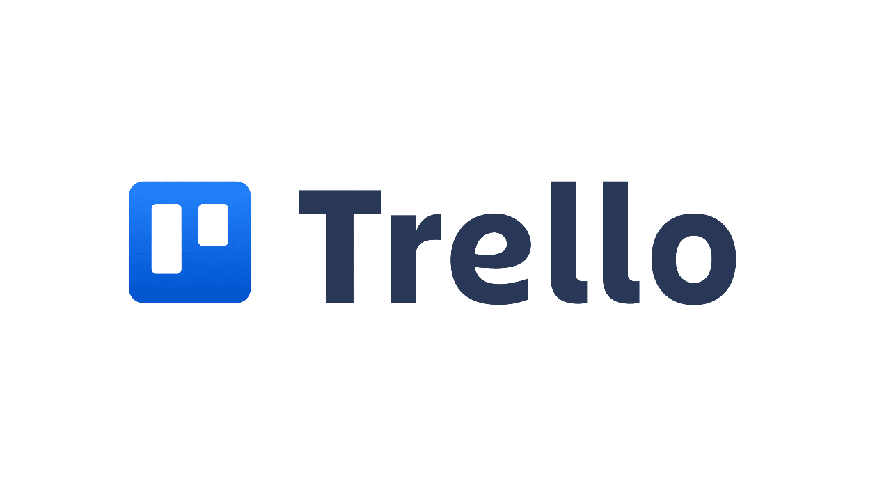

*Figura. Plataforma Trello utilizada para la gestión y organización de tareas del proyecto EDIFIKA (Trello, s.f.).*


#### Team Communication

##### Discord

**Propósito de Uso:**  
Comunicación interna del equipo, coordinación de reuniones, resolución de dudas, revisión de avances y organización de acuerdos relacionados con el desarrollo de EDIFIKA.

**Ruta de Referencia/Descarga:**  
Discord (SaaS / Aplicación de escritorio)


*Figura. Plataforma Discord utilizada para la comunicación y coordinación interna del equipo de desarrollo de EDIFIKA (Discord, s.f.).*


### Product UX/UI Design

#### Figma

**Propósito de Uso:**  
Diseño de interfaces, wireframes, prototipos navegables y flujos visuales de la solución EDIFIKA. Se utiliza para definir la experiencia de usuario de la Landing Page y de las futuras interfaces del sistema.

**Ruta de Referencia/Descarga:**  
Figma (SaaS)

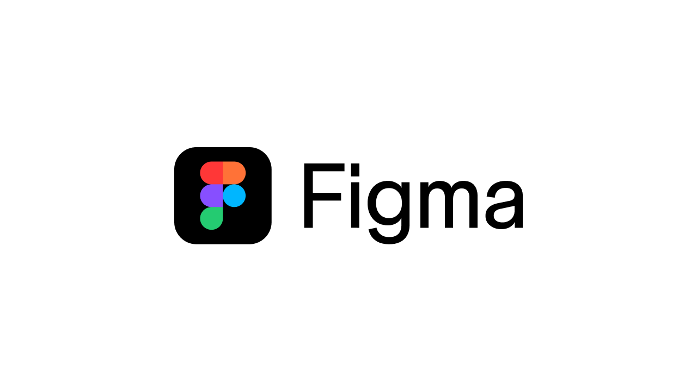

*Figura. Plataforma Figma utilizada para el diseño de interfaces, wireframes y prototipos visuales de la solución EDIFIKA (Figma, s.f.).*

## Software Development

### GitHub con GitFlow

**Propósito de Uso:**  
Control de versiones, colaboración entre desarrolladores, organización mediante ramas y almacenamiento del código fuente de los productos digitales de EDIFIKA, incluyendo la Landing Page, el Frontend Web Application y los Web Services.

**Ruta de Referencia/Descarga:**  
GitHub (SaaS)


*Figura. Plataforma GitHub utilizada para el control de versiones y colaboración en el desarrollo de los productos digitales de EDIFIKA (GitHub, s.f.).*


### IntelliJ IDEA

**Propósito de Uso:**  
Entorno de desarrollo utilizado para implementar el microservicio IAM de EDIFIKA, desarrollado con Java, Spring Boot y Maven. Permite gestionar la estructura del backend, ejecutar el proyecto, revisar dependencias y trabajar con archivos del proyecto Spring Boot.

**Ruta de Referencia/Descarga:**  
IntelliJ IDEA (Aplicación de escritorio)


*Figura. Entorno de desarrollo IntelliJ IDEA utilizado para la implementación del microservicio IAM basado en Spring Boot y Java (JetBrains, s.f.).*


### Visual Studio Code

**Propósito de Uso:**  
Editor utilizado para trabajar con la Landing Page, documentación técnica, archivos Markdown, configuración del proyecto y apoyo en tareas de desarrollo frontend.

**Ruta de Referencia/Descarga:**  
Visual Studio Code (Aplicación de escritorio)


*Figura. Editor Visual Studio Code utilizado para el desarrollo frontend, edición de archivos Markdown y documentación técnica del proyecto EDIFIKA (Microsoft, s.f.).*


### Angular

**Propósito de Uso:**  
Framework utilizado para el desarrollo de la aplicación web frontend de EDIFIKA. Permite construir vistas, componentes, rutas, servicios y la comunicación con los microservicios backend.

**Ruta de Referencia/Descarga:**  
Angular Framework


*Figura. Framework Angular utilizado para el desarrollo de la aplicación web frontend de EDIFIKA (Angular, s.f.).*


#### Spring Boot

**Propósito de Uso:**  
Framework utilizado para construir el microservicio IAM como Web Service backend, exponiendo endpoints REST para funcionalidades de autenticación, identidad y acceso.

**Ruta de Referencia/Descarga:**  
Spring Boot Framework


*Figura. Framework Spring Boot utilizado para la construcción y despliegue del microservicio IAM de EDIFIKA (Spring, s.f.).*


### Python

**Propósito de Uso:**  
Lenguaje de programación del Edge Gateway, según lo indicado en el enunciado para Edge Services. Se utiliza en el servicio que corre en el Raspberry Pi 4 del condominio (API REST, resolución de accesos, sincronización con la nube) y en las utilidades de apoyo: backend simulado y simulador de nodos ESP32.

**Ruta de Referencia/Descarga:**  
Python 3.12 (imagen Docker `python:3.12-slim`) — https://www.python.org/downloads/


*Figura. Lenguaje Python utilizado para desarrollar el Edge Gateway del proyecto EDIFIKA (Python Software Foundation, s.f.).*


### Flask

**Propósito de Uso:**  
Framework web del Edge Gateway. Expone la API REST local que permite consultar el estado de los nodos, revisar la bitácora de accesos y las lecturas de sensores, enviar comandos remotos y activar el modo mantenimiento de un dispositivo, además de servir la documentación de la interfaz en `/docs`.

**Ruta de Referencia/Descarga:**  
Flask 3.1.3 — https://flask.palletsprojects.com/


*Figura. Framework Flask utilizado para implementar la API REST local del Edge Gateway de EDIFIKA (Pallets, s.f.).*


### flask-smorest

**Propósito de Uso:**  
Extensión de Flask empleada para definir los endpoints del Edge Gateway y generar automáticamente su documentación OpenAPI/Swagger, disponible en `/docs` y en `/openapi.json`. Centraliza la declaración de los esquemas de entrada y salida para que la documentación no se desactualice respecto del código.

**Ruta de Referencia/Descarga:**  
flask-smorest 0.47.0 — https://flask-smorest.readthedocs.io/


*Figura. Extensión flask-smorest utilizada para documentar la API del Edge Gateway con OpenAPI/Swagger (flask-smorest, s.f.).*


### marshmallow

**Propósito de Uso:**  
Validación de datos y serialización. Valida tanto las solicitudes de la API REST local como los mensajes MQTT que intercambian el Edge Gateway y los nodos ESP32, de modo que un mensaje con un formato o una versión de contrato inválida se descarte y se reporte una sola vez a la nube, sin interrumpir la operación del edificio.

**Ruta de Referencia/Descarga:**  
marshmallow 4.3.1 — https://marshmallow.readthedocs.io/


*Figura. Biblioteca marshmallow utilizada para validar los mensajes MQTT y las solicitudes de la API del Edge Gateway (marshmallow, s.f.).*


### Peewee ORM

**Propósito de Uso:**  
ORM del Edge Gateway, según lo indicado en el enunciado. Modela los nodos registrados y su estado, las credenciales RFID y los permisos en caché local, la bitácora de accesos, las lecturas de sensores y la cola de salida de eventos hacia la nube, que es lo que permite operar sin conexión a internet.

**Ruta de Referencia/Descarga:**  
Peewee ORM 4.5.2 — https://docs.peewee-orm.com/


*Figura. ORM Peewee utilizado para la persistencia local del Edge Gateway de EDIFIKA (Peewee, s.f.).*


### SQLite

**Propósito de Uso:**  
Base de datos local del Edge Gateway, configurada en modo WAL. Persiste el estado de los dispositivos y la cola de eventos pendientes de enviar a la nube, y sobrevive a los reinicios del contenedor gracias al volumen `edge-data`. Al residir en el propio condominio, permite resolver accesos, lecturas y comandos aunque se caiga el enlace a internet.

**Ruta de Referencia/Descarga:**  
Incluido en Python 3.12 — https://www.sqlite.org/


*Figura. Base de datos SQLite utilizada por el Edge Gateway para operar sin conexión a internet (SQLite, s.f.).*


### paho-mqtt

**Propósito de Uso:**  
Cliente MQTT del Edge Gateway. Suscribe los tópicos de heartbeat, intentos de acceso, lecturas y confirmaciones de los nodos ESP32, y publica los comandos que estos deben ejecutar: apertura de la cerradura, mensajes para la pantalla OLED, patrones del buzzer y sincronización de reloj.

**Ruta de Referencia/Descarga:**  
paho-mqtt 2.1.0 — https://eclipse.dev/paho/


*Figura. Cliente MQTT paho-mqtt utilizado para la comunicación entre el Edge Gateway y los nodos ESP32 (Eclipse Foundation, s.f.).*


### Eclipse Mosquitto

**Propósito de Uso:**  
Broker MQTT local del condominio, instalado en el Raspberry Pi 4 on-premise. Distribuye los mensajes entre el Edge Gateway y los nodos ESP32 sin salir del edificio y conserva su estado en el volumen `mosquitto-data`. Al no depender de la nube, una caída de internet no detiene la operación de accesos, iluminación y riego.

**Ruta de Referencia/Descarga:**  
Eclipse Mosquitto 2 — https://mosquitto.org/


*Figura. Broker Eclipse Mosquitto instalado en el Edge Server del condominio para la mensajería MQTT local (Eclipse Foundation, s.f.).*


### gunicorn

**Propósito de Uso:**  
Servidor de aplicación del contenedor del Edge Gateway. Se ejecuta con un único worker y varios hilos, porque el cliente MQTT y los planificadores de tareas (sincronización de caché, reintentos y alertas) deben existir una sola vez en el proceso.

**Ruta de Referencia/Descarga:**  
gunicorn 26.2.0 — https://gunicorn.org/


*Figura. Servidor gunicorn utilizado para ejecutar el Edge Gateway dentro de su contenedor (gunicorn, s.f.).*


### Software Testing

#### Postman

**Propósito de Uso:**  
Pruebas de APIs para verificar peticiones, respuestas y funcionamiento de los endpoints del microservicio IAM. Se utiliza para validar rutas de autenticación, registro, inicio de sesión y otros servicios relacionados con identidad y acceso.

**Ruta de Referencia/Descarga:**  
Postman (SaaS / Aplicación de escritorio)


*Figura. Plataforma Postman utilizada para realizar pruebas y validaciones de los endpoints REST del microservicio IAM (Postman, s.f.).*


#### Swagger UI

**Propósito de Uso:**  
Documentación y prueba visual de los endpoints expuestos por el microservicio IAM. Permite observar las rutas disponibles del servicio backend desplegado en Render.

**Ruta de Referencia/Descarga:**  
Swagger UI integrado en el microservicio IAM

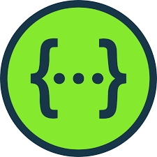

*Figura. Herramienta Swagger UI utilizada para la documentación y prueba visual de los endpoints expuestos por el backend de EDIFIKA (Swagger, s.f.).*


#### pytest

**Propósito de Uso:**  
Framework de pruebas del Edge Gateway. La suite de 188 pruebas se ejecuta sin broker MQTT y sin conexión a internet, reemplazando el broker, el backend y el reloj por dobles de prueba y usando una base de datos SQLite temporal por prueba, de modo que las regresiones se detecten antes de cada integración.

**Ruta de Referencia/Descarga:**  
pytest 9.1.1 — https://docs.pytest.org/


*Figura. Framework pytest utilizado para las pruebas automatizadas del Edge Gateway de EDIFIKA (pytest, s.f.).*


### Software Deployment

#### GitHub Pages

**Propósito de Uso:**  
Despliegue de la Landing Page de EDIFIKA, permitiendo su visualización pública desde el repositorio del proyecto.

**Ruta de Referencia/Descarga:**  
GitHub Pages (SaaS)


*Figura. Plataforma GitHub Pages utilizada para el despliegue y visualización pública de la Landing Page de EDIFIKA (GitHub, s.f.).*


#### Render

**Propósito de Uso:**  
Plataforma en la nube utilizada para desplegar el microservicio IAM de EDIFIKA. Permite ejecutar el backend desarrollado con Spring Boot, realizar despliegues desde GitHub y exponer públicamente los endpoints del servicio.

**Ruta de Referencia/Descarga:**  
Render (PaaS - Plataforma como Servicio)


*Figura. Plataforma Render utilizada para el despliegue en la nube del microservicio IAM desarrollado para EDIFIKA (Render, s.f.).*


#### Docker y Docker Compose

**Propósito de Uso:**  
Empaquetado y despliegue de todo el servicio Edge. La imagen del Edge Gateway, el broker MQTT local, el backend simulado y los nodos ESP32 virtuales se levantan con un solo comando, lo que permite ejecutar y demostrar la solución completa de forma reproducible tanto en el equipo de desarrollo como en el Raspberry Pi 4 del condominio.

**Ruta de Referencia/Descarga:**  
Docker 29.8 y Docker Compose 5.5 — https://www.docker.com/products/docker-desktop/


*Figura. Docker y Docker Compose utilizados para el empaquetado y despliegue del Edge Gateway de EDIFIKA (Docker Inc., s.f.).*


### Software Documentation

#### GitHub

**Propósito de Uso:**  
Almacenamiento, versionado y colaboración en la documentación técnica del proyecto. También permite organizar el código fuente, los README, guías de despliegue y archivos relacionados al desarrollo de EDIFIKA.

**Ruta de Referencia/Descarga:**  
GitHub (SaaS)


*Figura. Plataforma GitHub utilizada para el almacenamiento y versionado de la documentación técnica y código fuente del proyecto EDIFIKA (GitHub, s.f.).*


#### Visual Studio Code

**Propósito de Uso:**  
Edición de archivos Markdown y documentación técnica relacionada al proyecto. Se utiliza para estructurar y organizar información del producto, guías de instalación, despliegue y configuración.

**Ruta de Referencia/Descarga:**  
Visual Studio Code (Aplicación de escritorio)


*Figura. Editor Visual Studio Code utilizado para la edición y organización de la documentación técnica y archivos Markdown del proyecto EDIFIKA (Microsoft, s.f.).*

Con esta configuración, nuestro equipo puede colaborar de manera eficiente y gestionar el ciclo de vida completo del desarrollo de EDIFIKA, desde la planificación y diseño hasta el desarrollo, pruebas, documentación, despliegue y mantenimiento.

### 6.1.2. Source Code Management

En esta sección, nuestro equipo establece los medios y el esquema de organización que aplicará para el seguimiento de modificaciones, utilizando **GitHub** como plataforma y sistema de control de versiones. De esta manera, configuramos repositorios remotos para almacenar el código fuente de EDIFIKA y colaborar entre los miembros del equipo.

### Plataforma de control de versiones

El equipo utiliza GitHub para almacenar los productos digitales de EDIFIKA. Los repositorios se organizan según el tipo de producto desarrollado:

- **Landing Page:** contiene el sitio web informativo de EDIFIKA desplegado mediante GitHub Pages.
- **Frontend Web Application:** contiene la aplicación web desarrollada con Angular.
- **Backend Web Services:** contiene los microservicios backend, incluyendo el microservicio IAM desarrollado con Java, Spring Boot y Maven.
- **Edge Gateway:** contiene el servicio Edge del proyecto IoT, desarrollado con Python, Flask, Peewee ORM y SQLite, junto con el simulador de nodos ESP32 y el backend simulado.

Los URLs de los repositorios son los siguientes:

- **Landing Page:**  
  `https://github.com/Condomia/Edifika-LandingPage`


- **Backend Web Services - IAM Microservice:**  
  `https://github.com/Condomia/Edifika-Microservice-IAM`


- **Edge Gateway (servicio Edge):**  
  `https://github.com/IoT-UPC-202620/Edifika-Microservice-IoT-Gateway`

URLs de despliegue actualmente disponibles:

- **Landing Page:**  
  `https://condomia.github.io/Edifika-LandingPage/#cta`

- **IAM Microservice - Swagger UI:**  
  `https://edifika-microservice-iam.onrender.com/swagger-ui/index.html#/`

En el caso de **Web Services**, el repositorio incluye el proyecto backend del microservicio IAM, su configuración Maven mediante el archivo `pom.xml`, el código fuente en la carpeta `src`, los archivos de pruebas y, cuando corresponda, los archivos `.feature` para escenarios definidos con Gherkin.


### Implementación de GitFlow

Organizamos el repositorio en ramas para diferentes entornos de trabajo. Para ello, el equipo aplica GitFlow como flujo de control de versiones, separando el código estable, el código en desarrollo, las nuevas funcionalidades, las versiones de lanzamiento y las correcciones urgentes.

## Ramas base

### Main branch

Contiene la versión estable del producto. Esta rama representa el código listo para producción o despliegue. En el caso de EDIFIKA, puede contener la versión desplegada de la Landing Page o del microservicio IAM.

##### Develop branch

Contiene el código en desarrollo, que eventualmente será fusionado en la rama principal. En esta rama se integran las funcionalidades terminadas antes de preparar una nueva versión estable.


#### Feature branches

##### Feature branch

Para cada funcionalidad nueva se crea una rama desde `develop`.

**Convención para el nombre:**

```text
feature/nombre-corto-descriptivo
```

Ejemplos:

```text
feature/landing-page
feature/iam-authentication
feature/user-registration
feature/swagger-documentation
feature/angular-login
feature/postman-tests
```


## Release branches

### Release branch

Se crean cuando el proyecto está listo para pasar a producción desde `develop`.

**Convención:**

```text
release/x.y.z
```

Ejemplos:

```text
release/1.0.0
release/1.1.0
```

Estas ramas se utilizan para preparar una versión estable, realizar ajustes finales, corregir errores menores y validar que el producto pueda desplegarse correctamente.


## Hotfix branches

### Hotfix branch

Se crean desde `main` para corregir errores críticos detectados en producción.

**Convención:**

```text
hotfix/x.y.z
```

Ejemplos:

```text
hotfix/1.0.1
hotfix/1.1.1
```

Estas ramas permiten solucionar fallos urgentes en la Landing Page o en el microservicio IAM sin afectar el desarrollo activo de nuevas funcionalidades.

---

### Versionado semántico - Semantic Versioning

Aplicamos Semantic Versioning para nombrar nuestras releases siguiendo el esquema:

```text
MAJOR.MINOR.PATCH
```

| Parte | Significado |
|---|---|
| MAJOR | Cambios importantes que rompen compatibilidad con versiones anteriores, por ejemplo cambios en endpoints del microservicio IAM que afecten a otros módulos. |
| MINOR | Nuevas funcionalidades agregadas de forma compatible, por ejemplo agregar un nuevo endpoint de autenticación sin romper los anteriores. |
| PATCH | Correcciones de errores o bugs, sin agregar nuevas funciones ni romper lo que ya funciona. |

Ejemplos:

```text
1.0.0
1.1.0
1.1.1
```


### Mensajes de commit con Conventional Commits

Utilizamos Conventional Commits para los mensajes en nuestros commits.

**Template:**

```text
<tipo>(<opcional-alcance>): <mensaje>
```

#### Tipos

- `feat`: nueva funcionalidad.
- `fix`: corrección de errores.
- `docs`: cambios en la documentación.
- `style`: cambios de estilo o formato sin afectar funcionalidad.
- `refactor`: reestructuración del código sin cambios funcionales.
- `test`: añadir o modificar pruebas.
- `chore`: tareas de mantenimiento o configuración.

Ejemplos:

```text
feat(iam): add sign in endpoint
feat(iam): add user registration
fix(iam): fix token validation
docs(readme): update deployment instructions
style(landing): fix landing header spacing
test(auth): add login feature scenario
chore(maven): update project dependencies
```

El código fuente se gestiona en GitHub, dentro de la organización pública del equipo. Cada producto digital tiene su propio repositorio, que incluye el proyecto y sus archivos de pruebas.

**GitFlow.** El Edge Gateway aplica el mismo flujo de control de versiones descrito anteriormente, con las siguientes ramas propias:

**Feature branches.** Se crea una rama desde `develop` por cada historia o grupo de historias relacionadas, y se integra a `develop` mediante un merge sin avance rápido (`--no-ff`), de modo que el historial conserve qué cambios pertenecen a cada historia.

**Convención:**

```text
feature/<ID de historia>-<nombre corto>
```

Ejemplos:

```text
feature/US71-access-control
feature/US79-US80-device-registry
```

**Release branches.** Se crea una rama desde `develop` al cerrar una versión, y se integra tanto a `main` como a `develop`. Cada versión publicada queda etiquetada en `main`.

**Convención:**

```text
release/<versión>
```

Ejemplo:

```text
release/0.1.0
```

**Hotfix branches.** Se crea una rama desde `main` para corregir un fallo detectado en el condominio, y se integra a `main` y a `develop`.

**Convención:**

```text
hotfix/<nombre>
```

Ejemplo:

```text
hotfix/lock-timeout
```

**Semantic Versioning.** Las versiones siguen el formato `MAJOR.MINOR.PATCH`. La primera versión funcional es la **0.1.0**: se preparó en `release/0.1.0` (con su `CHANGELOG.md`), se integró a `main` y se etiquetó como `v0.1.0`.

**Conventional Commits.** Los mensajes de commit usan el formato `<tipo>(<ámbito>): <descripción>`, con los tipos `feat`, `fix`, `docs`, `test`, `chore` y `refactor`, y mencionan entre paréntesis los identificadores de las historias implementadas. Por ejemplo: `feat(access): resolve RFID access locally with lock, buzzer and OLED feedback (US71-US75, US87)`.

### 6.1.3. Source Code Style Guide & Coding Conventions

El equipo ha definido las siguientes convenciones de nombres y estilos de codificación, aplicadas en los lenguajes y tecnologías utilizados en la solución EDIFIKA. Todas las nomenclaturas están en inglés, buscando claridad, estandarización y buenas prácticas de desarrollo.

### HTML

**Guía adoptada:**  
W3C HTML Style Guide

**Nomenclatura y convenciones:**

- Minúsculas para etiquetas y atributos.

```html
<div class="container">
```

- Indentación de 2 espacios.
- Atributos entre comillas dobles.

```html

```

- Uso semántico de etiquetas.

```html
<header>
<section>
<footer>
```

- Comentarios HTML.

```html
<!-- Main landing section -->
```


### CSS

**Guía adoptada:**  
Google HTML/CSS Style Guide

**Nomenclatura y convenciones:**

- `kebab-case` para clases e IDs.

```css
.main-header
.footer-section
.call-to-action
```

- Agrupación de estilos por componente o sección.
- Evitar `!important` a menos que sea necesario.
- Indentación de 2 espacios.
- Nombres en inglés.

Ejemplo:

```css
.call-to-action {
  padding: 3rem 2rem;
  text-align: center;
}
```


### JavaScript

**Guía adoptada:**  
Google JavaScript Style Guide

**Nomenclatura y convenciones:**

- `camelCase` para variables y funciones.

```javascript
let userName = 'Admin';

function validateForm() {}
```

- `PascalCase` para clases.

```javascript
class LandingAnimation {}
```

- Evitar `snake_case`.
- Usar `const` y `let` en lugar de `var`.
- Comentarios:

```javascript
// Validate landing form
```

```javascript
/**
 * Sends contact form data.
 */
function sendContactForm() {}
```


### TypeScript

**Guía adoptada:**  
Google TypeScript Style Guide

**Nomenclatura y convenciones:**

- `camelCase` para variables, funciones y propiedades.

```ts
let isActive: boolean = true;

function getUserData() {}
```

- `PascalCase` para clases, interfaces, enums y tipos.

```ts
class LoginComponent {}

interface UserDto {}

enum UserRole {
  Admin,
  Resident
}
```

- Tipado estricto habilitado cuando corresponda.
- Interfaces nombradas con sufijo `Dto`, `Request`, `Response` o `Props`, según el caso.
- Uso de modificadores `readonly`, `private` y `public` cuando sea necesario.
- Nombres en inglés.


### Java

**Guía adoptada:**  
Google Java Style Guide

**Nomenclatura y convenciones:**

- `PascalCase` para clases.

```java
public class AuthenticationService {}
```

- `camelCase` para variables, métodos y atributos.

```java
int totalUsers;

calculateTotalUsers();
```

- Constantes en mayúsculas con `snake_case`.

```java
public static final int MAX_LOGIN_ATTEMPTS = 5;
```

- Comentarios tipo Javadoc.

```java
/**
 * Gets the authenticated user information.
 * @return authenticated user data
 */
public UserDto getAuthenticatedUser() {}
```

- Paquetes en minúsculas separados por punto.

```java
com.edifika.iam.authentication
com.edifika.iam.users
com.edifika.iam.security
```


### Gherkin Conventions for Readable Specifications

**Guía adoptada:**  
Gherkin Syntax and Conventions

**Nomenclatura y convenciones:**

- Estructura:

#### Given

Define el contexto o el estado inicial.

#### When

Define la acción o evento que ocurre.

#### Then

Define el resultado o la expectativa después de la acción.

Ejemplo:

```gherkin
Feature: User login

Scenario: Successful login with valid credentials
  Given the user is registered in EDIFIKA
  When the user enters valid credentials
  Then the system should return an authentication token
```

- Uso de tablas para datos:

```gherkin
Given the following users exist:
  | email              | password  | role          |
  | admin@edifika.com  | pass123   | administrator |
  | user@edifika.com   | pass456   | resident      |
```


### Angular Coding Style Guide

**Guía adoptada:**  
Angular Style Guide

**Nomenclatura y convenciones:**

- Estructura de carpetas:

```text
app/
assets/
environments/
```

- Organización por componentes, servicios, modelos y rutas.

```text
authentication/
shared/
core/
```

- Nombres de clases en `PascalCase`.

```ts
export class LoginComponent {}
export class AuthenticationService {}
```

- Componentes Standalone cuando corresponda.

```ts
@Component({
  selector: 'app-login',
  standalone: true,
  templateUrl: './login.component.html'
})
export class LoginComponent {}
```

- Indentación de 2 espacios.
- Uso de `trackBy` en listas grandes cuando sea necesario.
- Servicios con métodos en `camelCase`.

```ts
signIn()
signUp()
getCurrentUser()
```


### Spring Boot Features

**Guía adoptada:**  
Spring Boot Features

**Nomenclatura y convenciones:**

- Paquetes: el paquete raíz debe representar el proyecto y el bounded context o módulo.

Ejemplo:

```text
com.edifika.iam
```

- Subpaquetes organizados por responsabilidad.

```text
com.edifika.iam.interfaces.rest
com.edifika.iam.application.internal.commandservices
com.edifika.iam.application.internal.queryservices
com.edifika.iam.domain.model.aggregates
com.edifika.iam.infrastructure.persistence.jpa.repositories
```

- Clases y métodos:

```java
public class UserController {}

public ResponseEntity<?> signIn() {}
```

- Configuración mediante `application.properties` o variables de entorno.

```properties
server.port=${PORT}
jwt.secret=${JWT_SECRET}
```

- Controladores REST:

```java
@RestController
@RequestMapping("/api/v1/authentication")
public class AuthenticationController {

    @PostMapping("/sign-in")
    public ResponseEntity<?> signIn(@RequestBody SignInRequest request) {
        return ResponseEntity.ok().build();
    }
}
```

- Seguridad:

Se utiliza JWT como mecanismo de seguridad para proteger endpoints y validar el acceso de los usuarios autenticados.

### Python

**Guía adoptada:**  
Python Style Guide — PEP 8 (https://peps.python.org/pep-0008/)

**Nomenclatura y convenciones:**

- `snake_case` para funciones, variables y módulos.

```python
def resolve_access(credential):
    pass
```

- `PascalCase` para clases.

```python
class AccessService:
    pass
```

- `MAYUSCULAS_CON_GUION_BAJO` para constantes.

```python
MAX_OUTBOX_SIZE = 1000
```

- Docstrings según PEP 257 (https://peps.python.org/pep-0257/) en módulos y clases públicos.

```python
"""Decide un intento de acceso con la caché local del condominio."""
```

- Anotaciones de tipo en las firmas públicas de los servicios.

```python
def resolve_access(credential: str) -> AccessDecision:
    pass
```

- Organización en capas separadas.

```text
edge_gateway/
  api/          interfaz REST
  services/     reglas de negocio
  mqtt/         contrato y mensajería
  models.py     modelos Peewee
  db.py         configuración de SQLite
```

- Nombres en inglés.
- Mensajes al usuario en inglés como idioma por defecto (respuestas de la API, textos de la pantalla OLED y documentación Swagger), según el enunciado.
- Configuración únicamente mediante variables de entorno con el prefijo `EDGE_`; ningún secreto en el código.
- Pruebas: un archivo por componente y nombre de prueba que describe el comportamiento esperado; los escenarios Dado/Cuando/Entonces de las historias se traducen en pruebas `pytest` (ver 6.1.1).
- Commits y ramas: Conventional Commits y GitFlow (ver 6.1.2).

### 6.1.4. Software Deployment Configuration

Esta sección describe la configuración y los pasos necesarios para realizar el despliegue exitoso de los productos digitales desarrollados en EDIFIKA. Actualmente, la solución cuenta con la **Landing Page desplegada en GitHub Pages**, el **microservicio IAM desplegado en Render** y el **Edge Gateway desplegado on-premise con Docker Compose**.

A continuación, se especifican los pasos para desplegar la Landing Page en GitHub Pages, los Web Services Backend en Render y el Edge Gateway en el servidor del condominio.


## Despliegue de la Landing Page en GitHub Pages

### Consideraciones previas al despliegue

- Asegurarse de que todos los archivos de la Landing Page estén implementados correctamente en HTML, CSS y JavaScript.
- Se permite el uso de distintos formatos de imagen como `.jpg`, `.png`, `.webp`, entre otros.
- Contar con un repositorio público o privado en GitHub con los permisos adecuados para la edición y despliegue del sitio.
- El repositorio debe pertenecer a una organización compartida entre los miembros del equipo para permitir la colaboración y control de versiones.
- Verificar que la rama de despliegue contenga la versión estable de la Landing Page.

## URL desplegada

```text
https://condomia.github.io/Edifika-LandingPage/#cta
```

## Pasos de despliegue

### 1. Preparar el repositorio

a. Asegurarse de que el código de la Landing Page esté en el repositorio correcto de GitHub.

b. El repositorio debe contener todos los archivos estáticos necesarios:

```text
HTML
CSS
JavaScript
Images
Assets
```

### 2. Configurar GitHub Pages

a. En el repositorio de GitHub, ir a la pestaña **Settings**.

b. En la sección **Pages**, seleccionar la rama que se desea usar para desplegar el sitio. Generalmente, se usa la rama `main` o `gh-pages`.

c. En la opción **Source**, seleccionar la carpeta del proyecto, usualmente `root` o `docs`, según la configuración del repositorio.

d. Confirmar la configuración.

### 3. Desplegar

a. Una vez configurado, GitHub generará una URL en la sección GitHub Pages.

b. El despliegue se realizará automáticamente con cada cambio realizado en la rama seleccionada, siempre que se realicen commits que actualicen el repositorio.

### 4. Verificación

a. Acceder a la URL proporcionada por GitHub Pages.

b. Verificar que la Landing Page cargue correctamente.

c. Validar que las imágenes, estilos, botones y secciones principales se muestren de forma adecuada.

---

### Despliegue de los Web Services Backend en Render

El microservicio IAM de EDIFIKA se encuentra desplegado en Render. Este backend fue desarrollado con **Java, Spring Boot y Maven**, y expone documentación mediante Swagger UI.

#### URL desplegada

```text
https://edifika-microservice-iam.onrender.com/swagger-ui/index.html#/
```

#### Consideraciones previas

- Tener el proyecto Spring Boot correctamente estructurado.
- Tener el archivo `pom.xml` configurado con las dependencias necesarias.
- Verificar que el proyecto pueda ejecutarse localmente.
- Tener el repositorio de GitHub con el código del proyecto.
- No subir archivos sensibles al repositorio.
- Configurar variables de entorno en Render, como claves JWT, credenciales de base de datos o configuración de puerto.
- No subir el archivo `.jar` generado manualmente, ya que Render puede construirlo automáticamente desde el proyecto.

Estructura recomendada:

```text
edifika-microservice-iam/
├── pom.xml
├── src/
│   ├── main/
│   │   ├── java/
│   │   └── resources/
│   └── test/
├── README.md
└── .gitignore
```

#### Pasos de despliegue

### 1. Preparar el repositorio de GitHub

Asegurarse de que el repositorio tenga:

- `pom.xml`, configuración de Maven.
- `src/`, código fuente.
- `README.md`, instrucciones del proyecto.
- `.gitignore`, para evitar subir archivos innecesarios.
- Archivos `.feature`, si se usan pruebas de comportamiento con Gherkin.

No subir el archivo `.jar` ni la carpeta `/target`, porque Render puede construir el proyecto automáticamente.

### 2. Crear cuenta en Render

a. Ir a Render.

b. Registrarse o iniciar sesión con la cuenta de GitHub para facilitar la integración con el repositorio.

### 3. Crear un Web Service

a. En el dashboard de Render, hacer clic en **New +**.

b. Seleccionar **Web Service**.

c. Conectar la cuenta de GitHub si aún no está conectada.

### 4. Vincular el repositorio

a. Seleccionar el repositorio del microservicio IAM.

b. Verificar que el repositorio corresponda al backend correcto de EDIFIKA.

### 5. Configurar el servicio

a. **Name:** colocar un nombre representativo, por ejemplo:

```text
edifika-microservice-iam
```

b. **Environment:** seleccionar Java.

c. **Branch:** seleccionar la rama a desplegar, por ejemplo:

```text
main
```

d. **Root Directory:** dejar vacío si el proyecto está en la raíz del repositorio. Si está dentro de una carpeta específica, indicar la ruta correspondiente.

e. **Build Command:**

```bash
mvn clean install
```

f. **Start Command:**

```bash
java -jar target/*.jar
```

### 6. Configurar variables de entorno

Agregar las variables que la aplicación necesita para ejecutarse correctamente.

Ejemplos:

```text
PORT
DATABASE_URL
JWT_SECRET
SPRING_PROFILES_ACTIVE
```

Importante: nunca subir valores sensibles dentro de `application.properties` o `application.yml` si contienen credenciales, claves secretas o datos privados.

### 7. Desplegar

a. Hacer clic en **Create Web Service**.

b. Render construirá el proyecto con Maven.

c. Luego ejecutará el archivo `.jar` generado.

d. Revisar los logs en tiempo real para verificar que el microservicio se haya iniciado correctamente.

### 8. Verificar el despliegue

a. Al finalizar, Render asignará una URL pública al servicio.

b. Acceder al Swagger UI del microservicio IAM:

```text
https://edifika-microservice-iam.onrender.com/swagger-ui/index.html#/
```

c. Probar los endpoints desde Swagger UI o Postman.

d. Si hay errores, revisar los logs en la pestaña **Logs** de Render.

---

### Deployment Diagram del C4 Model

Como parte de la configuración de despliegue, el equipo incluye el **Deployment Diagram del C4 Model**, donde se representa la distribución física de los productos digitales de EDIFIKA.

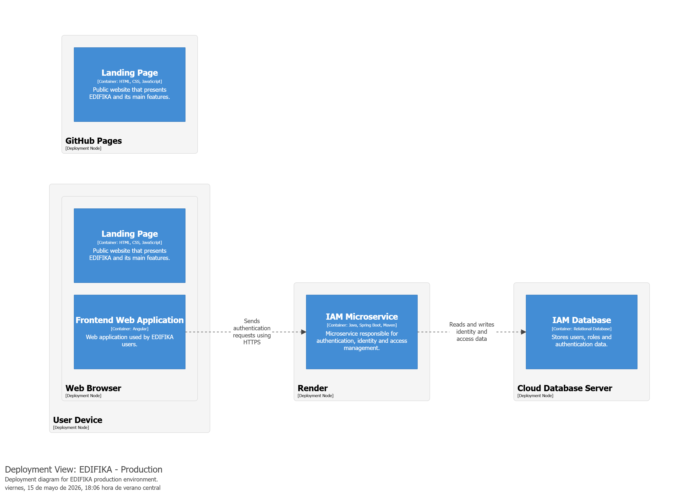

Este diagrama considera:

- La **Landing Page** desplegada en **GitHub Pages**.
- El **microservicio IAM** desplegado en **Render**.
- El uso de **GitHub** como repositorio de código fuente.
- El acceso de los usuarios mediante navegador web.
- La comunicación entre el frontend y el microservicio IAM mediante HTTP/HTTPS.


## Despliegue del Edge Gateway con Docker Compose

El Edge Gateway del proyecto IoT, implementado con Python, Flask, Peewee ORM y SQLite, se despliega en el servidor on-premise del condominio con **Docker Compose**, junto con el broker MQTT local y un backend simulado para las demostraciones. A diferencia de la Landing Page y de los Web Services, este servicio no se despliega en la nube: reside en el Raspberry Pi 4 instalado en el edificio (ver 4.1.3.4), de modo que el condominio siga operando aunque se caiga el enlace a internet.

### Consideraciones previas al despliegue

- Tener instalado Docker Engine con el plugin Compose (o Docker Desktop) en el equipo donde se levanta el servicio.
- Contar con los archivos de despliegue del repositorio `https://github.com/IoT-UPC-202620/Edifika-Microservice-IoT-Gateway`: `Dockerfile`, `docker-compose.yml`, `mosquitto/mosquitto.conf` y `.env.example`.
- Verificar que los puertos 1883 (broker MQTT), 8000 (API REST del Edge Gateway) y 9000 (backend simulado) estén libres en el equipo.
- Verificar que la rama o el tag a desplegar sea una versión publicada, según el flujo de GitFlow descrito en 6.1.2.
- No subir valores sensibles al repositorio: el archivo `.env` se crea localmente a partir de `.env.example` y no se versiona.

Estructura del despliegue:

```text
edifika-microservice-iot-gateway/
├── Dockerfile
├── docker-compose.yml
├── mosquitto/
│   └── mosquitto.conf
├── .env.example
└── .env              (local, no versionado)
```

### Servicios del `docker-compose.yml`

- `mosquitto`, imagen `eclipse-mosquitto:2`, puerto 1883: broker MQTT local, con verificación de salud mediante `mosquitto_sub`.
- `edge-gateway`, construida desde el `Dockerfile` con `python:3.12-slim`, puerto 8000: API REST, documentación Swagger (`/docs`) y endpoint de salud `/health`.
- `mock-cloud`, misma imagen, puerto 9000: backend simulado que recibe los eventos y entrega las credenciales.
- `seed`, `sim-door` y `sim-garden`, misma imagen y perfil `sim`: registro de los nodos de demostración y dos ESP32 virtuales.

### Variables de entorno

Todas las variables del servicio se declaran con el prefijo `EDGE_`:

- `EDGE_SERVICE_TOKEN`, por defecto `dev-service-token`: token Bearer de la API REST local. Es obligatoria.
- `EDGE_MQTT_HOST`, por defecto `mosquitto`: host del broker MQTT.
- `EDGE_CLOUD_BASE_URL`, por defecto `http://mock-cloud:9000`: backend al que se envían los eventos.
- `EDGE_CLOUD_TOKEN`, por defecto `dev-cloud-token`: credencial del Edge Gateway ante el backend.
- `EDGE_DATABASE_PATH`, por defecto `/data/edge-gateway.db`: archivo SQLite del servicio.
- `EDGE_TIMEZONE`, por defecto `America/Lima`: zona horaria de los horarios de las áreas.

Los valores por defecto corresponden al archivo `docker-compose.yml` y pueden sobrescribirse con un archivo `.env`.

### Pasos de despliegue

#### 1. Preparar el repositorio

a. Clonar o descargar el repositorio del Edge Gateway y ubicarse en la rama o el tag a desplegar.

b. Crear el archivo de variables de entorno a partir del ejemplo y ajustar los valores:

```bash
cp .env.example .env
```

#### 2. Levantar los servicios

a. Construir las imágenes y levantar el broker MQTT, el Edge Gateway y el backend simulado:

```bash
docker compose up --build
```

b. Levantar además los dos nodos ESP32 virtuales del perfil `sim`, para las demostraciones sin hardware físico:

```bash
docker compose --profile sim up --build
```

#### 3. Verificar el despliegue

a. Consultar el endpoint de salud, que reporta el estado de la base de datos, la cola de eventos, la caché y la conexión al broker:

```text
http://localhost:8000/health
```

b. Abrir la documentación de la API en Swagger:

```text
http://localhost:8000/docs
```

c. Revisar los logs del contenedor `edge-gateway` para confirmar la conexión al broker y la sincronización inicial de la caché.

### Decisiones de despliegue

- El Edge Gateway se ejecuta con un solo worker de gunicorn (y varios hilos), porque el cliente MQTT y los planificadores de tareas deben existir una única vez.
- La base de datos SQLite se guarda en el volumen `edge-data`, de modo que sobreviva a los reinicios del contenedor. El broker conserva su estado en el volumen `mosquitto-data`.
- El Edge Gateway espera a que el broker y el backend superen sus verificaciones de salud antes de iniciar (`depends_on` con `service_healthy`). Si el broker se cae después, el cliente reintenta la conexión con espera creciente.
- El contenedor se ejecuta con un usuario sin privilegios y define su propio `HEALTHCHECK` sobre `/health`.
- La topología desplegada se representa en el Deployment Diagram de la sección 4.1.3.4.

## 6.2. Landing Page, Services & Applications Implementation

### 6.2.1. Sprint 1

#### 6.2.1.1. Sprint Planning 1

El Sprint Planning Meeting del Sprint 1 se realizó el **21 de septiembre de 2026**, inmediatamente después de la entrega de AV1 y al inicio de la etapa de implementación de la solución. La sesión se condujo de forma remota por Microsoft Teams, con el Scrum Master designado como facilitador y una duración de tres horas. Participaron los siete integrantes del equipo, quienes actuaron como Developers y revisaron conjuntamente el alcance de la iteración.

La sesión se apoyó en el Product Backlog de la sección 3.3, en el diseño de solución del Capítulo IV y en los criterios de aceptación redactados en Gherkin para cada historia. A partir de estos insumos, el equipo realizó tres actividades: la selección de las historias y technical stories que componen el Sprint 1, la definición del Sprint Goal como criterio único de éxito de la iteración y la asignación de responsables según la matriz de líderes y colaboradores que se presenta en 6.2.1.2.

El alcance comprometido se concentró en tres productos digitales: la **Landing Page** pública de Edifika, la **Web Application** (frontend) y el **Edge Gateway**, el servicio Edge que se ejecuta dentro del edificio y se comunica por MQTT local con los nodos ESP32. Estos tres productos se eligieron porque son los entregables exigidos para esta etapa (TB1 – Stage Review) y porque, juntos, permiten demostrar de extremo a extremo la propuesta de valor de Edifika: un visitante entiende la plataforma y accede a ella, un administrador o un residente usa las primeras pantallas de la aplicación, y el edificio opera su control de acceso de manera autónoma.

**Cuadro de resumen del Sprint Planning Meeting**

| Sprint # | Sprint 1 |
|---|---|
| Sprint Planning | Background |
| Date | 2026-09-21 |
| Time | 07:30 PM |
| Location | Reunión virtual por Microsoft Teams (enlace compartido en el servidor de Discord del equipo) |
| Prepared By | Acuña Corahua, Jonatan Ariel |
| Attendees | Acuña Corahua, Jonatan Ariel; Collantes Carrillo, Diego Mateo; Landa Ortiz, Sergio Javier; Lizarbe Alvarez, Ariana Nickole; Ortiz Cardenas, Johanna Antuanete; Perez Tuesta, Gabriel; Sarmiento Medina, Loreley |
| Facilitator | Acuña Corahua, Jonatan Ariel (Scrum Master) |
| Sprint Period | 2026-09-21 – 2026-10-09 (3 semanas) |
| Sprint 1 – 1 Review | Pendiente de celebrarse el 2026-10-09. Se verificará el Sprint Goal contra los tres productos digitales comprometidos (Landing Page, Web Application y Edge Gateway) y se demostrarán los resultados alcanzados a nivel de producto: URLs públicas de la Landing Page y de la Web Application, y una demostración de extremo a extremo del Edge Gateway con broker MQTT, backend y nodos ESP32 virtuales. |
| Sprint 1 – 1 Retrospective | Pendiente de celebrarse el 2026-10-09, después de la Review. Se identificarán oportunidades de mejora en la forma de trabajo del equipo: estimación de historias, coordinación entre el trabajo de frontend y el de backend, y gestión de los repositorios del proyecto. |
| Sprint 1 Goal | *Our focus is on* publicar la primera versión de la Landing Page de Edifika con el modelo de negocio y el propósito de la plataforma; entregar las primeras pantallas operativas de la Web Application para administradores y residentes —inicio de sesión, gestión de datos de usuarios, activación y desactivación de cuentas, y consulta de la deuda actual—; y entregar el Edge Gateway que resuelve el acceso con tarjeta RFID a las áreas comunes del edificio y mantiene en la nube las credenciales, reservas y reglas de acceso sincronizadas. *We believe it delivers* a los visitantes información clara para decidir si usan Edifika y un acceso directo a la aplicación según su rol; a los administradores y residentes una experiencia de uso inicial de la plataforma en lugar de depender de hojas de cálculo y aplicaciones de mensajería; y al edificio un control de acceso a las áreas comunes que sigue operando aunque se pierda la conexión a internet, sin necesitar que el administrador se desplace al punto de acceso. *This will be confirmed when* la Landing Page y la Web Application estén publicadas en sus URLs públicas y sean navegables; un visitante, un administrador y un residente puedan completar su flujo correspondiente sin intervención de soporte; y en una demostración en vivo un nodo ESP32 lea una tarjeta RFID, conceda el acceso, registre el evento localmente y ese evento llegue al backend una vez restablecida la conexión. |
| Sprint 1 Velocity | 165 story points. Al ser el primer sprint del proyecto no existía velocidad histórica, por lo que el equipo fijó su capacidad antes de arrancar y la cifra cierra como línea base de la velocidad del Scrum Team. |
| Sum of Story Points | 165 story points (36 historias: 3 de la Landing Page, 12 de la Web Application y 21 del Edge Gateway) |

**Definición del Sprint Goal según la Scrum Guide.** La Scrum Guide define el Sprint Goal en los siguientes términos (Schwaber y Sutherland, 2020):

> "El Sprint Goal es el objetivo individual del Sprint. Es un compromiso para los Developers, flexible en términos del trabajo exacto que se requiere para alcanzarlo. El Sprint Goal también crea coherencia y enfoque, buscando que los miembros del Scrum Team trabajen juntos en vez de ir en pos de iniciativas individuales."

Por su importancia, el equipo dedicó una parte específica de la sesión a identificarlo. Se consideró que el Sprint Goal debe enfocarse en el negocio o en la perspectiva del usuario —por ejemplo, entregar un nuevo feature o un conjunto de features— y no en el detalle técnico de las tareas. Por ello se redactó en términos de _outcome_, _impact_, _customer_ y _event_, se formuló como un objetivo SMART y se estableció colectivamente.

**Contexto previo al Sprint Goal.** Al cierre de AV1 el equipo tenía un Product Backlog de 82 ítems (397 story points) y ningún Sprint Goal, porque hasta ese momento todo el esfuerzo se había invertido en investigación, análisis y diseño. Para el Sprint 1 el equipo decidió priorizar tres líneas de trabajo: publicar el sitio público que presenta el modelo de negocio y la plataforma, entregar las primeras pantallas operativas de la Web Application y materializar la parte Edge del producto dentro del edificio. Estas tres líneas permiten demostrar el producto de extremo a extremo ante la TB1, que exige la Landing Page y el Frontend Web Application desplegados.

**Sprint Goal del Sprint 1**

> **_Our focus is on_** publicar la primera versión de la Landing Page de Edifika con el modelo de negocio y el propósito de la plataforma; entregar las primeras pantallas operativas de la Web Application para administradores y residentes —inicio de sesión, gestión de datos de usuarios, activación y desactivación de cuentas, y consulta de la deuda actual—; y entregar el Edge Gateway que resuelve el acceso con tarjeta RFID a las áreas comunes del edificio y mantiene en la nube las credenciales, reservas y reglas de acceso sincronizadas.
>
> **_We believe it delivers_** a los visitantes información clara para decidir si usan Edifika y un acceso directo a la aplicación según su rol; a los administradores y residentes una experiencia de uso inicial de la plataforma en lugar de depender de hojas de cálculo y aplicaciones de mensajería; y al edificio un control de acceso a las áreas comunes que sigue operando aunque se pierda la conexión a internet, sin necesitar que el administrador se desplace al punto de acceso.
>
> **_This will be confirmed when_** la Landing Page y la Web Application estén publicadas en sus URLs públicas y sean navegables; un visitante, un administrador y un residente puedan completar su flujo correspondiente sin intervención de soporte; y en una demostración en vivo un nodo ESP32 lea una tarjeta RFID, conceda el acceso, registre el evento localmente y ese evento llegue al backend una vez restablecida la conexión.

**Identificación de Outcome, Impact, Customer(s) y Event.** Aplicar la plantilla de Scrum.org por sí solo no garantiza un buen Sprint Goal, por lo que el equipo verificó explícitamente cada uno de sus cuatro elementos:

| Elemento | Definición en el Sprint 1 |
|---|---|
| Outcome | Landing Page y Web Application publicadas y navegables, y Edge Gateway ejecutándose de extremo a extremo dentro del edificio. |
| Impact | Los visitantes comprenden la propuesta de valor y acceden a la aplicación; los administradores y residentes dejan de depender de procesos manuales para sus primeras operaciones; el edificio gana un control de acceso que no se detiene por falta de internet. |
| Customer(s) | Visitantes de la Landing Page; administradores y residentes de la Web Application; administrador del edificio, como responsable del Edge Gateway. |
| Event | Las dos URLs públicas responden y admiten navegación; los tres segmentos completan su flujo sin soporte; y en una demostración en vivo una tarjeta RFID concede un acceso, el evento queda registrado localmente y llega al backend tras restablecerse la conexión. |

**Verificación de los criterios SMART**

| Criterio | Cómo se cumple en el Sprint Goal |
|---|---|
| Specific | Nombra los features y conjuntos de features comprometidos: la Landing Page, las pantallas de inicio de sesión, gestión de usuarios, activación de cuentas y consulta de deuda, y el acceso RFID a áreas comunes. |
| Measurable | El evento de confirmación es observable y verificable en la Review: dos URLs públicas navegables, tres flujos completados sin soporte y una demostración de extremo a extremo. |
| Attainable | Corresponde a 165 story points, la capacidad que el equipo fijó para tres semanas, y reutiliza contratos y stack tecnológico ya definidos en el Capítulo IV. |
| Relevant | Responde directamente a los segmentos objetivo del proyecto y al problema de gestión manual identificado en la sección 1.2.1. |
| Time-bound | El Sprint concluye el 2026-10-09 y se revisa en esa fecha. |

**Alcance del feature-set comprometido.** La redacción es específica en cuanto a los features comprometidos y a cómo benefician a los segmentos objetivo, sin detallar cómo se implementarán:

| Segmento objetivo | Features comprometidos | Beneficio esperado |
|---|---|---|
| Visitantes | Explicación del modelo de negocio y del propósito de la plataforma, sección de funcionalidades y acceso a la aplicación según el rol | Comprender la propuesta de valor y decidir adoptarla sin intermediarios |
| Administradores | Inicio de sesión, actualización de datos de usuarios y activación o desactivación de cuentas | Administrar quién accede a la plataforma sin intervención del desarrollador |
| Residentes | Inicio de sesión y consulta de la deuda actual | Conocer su estado de cuenta desde la plataforma en lugar de consultar al administrador |
| Administradores del edificio (Edge) | Acceso con tarjeta RFID a las áreas comunes y sincronización de credenciales, reservas y reglas | Controlar el ingreso a áreas comunes sin depender del administrador en el punto de acceso, incluso sin internet |

**Criterios de redacción descartados.** El equipo descartó dos enfoques habituales que producen Sprint Goals deficientes:

1. **Centrar el objetivo en el equipo o en el cierre de un ítem de gestión.** Un objetivo como "cerrar la épica de la Landing Page en el tablero de Trello" o "lograr la aprobación del docente" satisface al interior del Scrum Team, pero no al producto ni al usuario, por lo que se descartó.
2. **Detallar las tareas técnicas en el objetivo.** Expresar el Goal como "configurar el broker MQTT y el backend" invierte la relación del Sprint Goal con las tareas: el objetivo debe permanecer flexible en cuanto al trabajo exacto requerido para alcanzarlo.

**Relación del Sprint Goal con la selección de épicas e historias.** El Sprint Goal se estableció **en conjunto** por el Scrum Team antes de seleccionar el trabajo del Sprint. Esa decisión fue la que permitió decidir qué épicas e historias debían considerarse en la iteración en función de su contribución al objetivo, y no únicamente por su posición en el Product Backlog. Como resultado, las historias que no contribuyen de forma directa al Outcome quedaron fuera del Sprint 1 y se arrastraron al Sprint 2.

La **Definition of Done** acordada para el Sprint 1 exige que cada historia cumpla sus escenarios de aceptación en Gherkin, que tenga cobertura de pruebas automatizadas cuando aplique, que sus criterios de estilo se respeten según la guía de la sección 6.1.3, que el código esté integrado en la rama `develop` mediante un commit convencional y que el producto esté desplegado y accesible desde su URL pública. El Sprint Goal se formuló sobre la base de features concretas, pero no sobre ítems del backlog. Por esa razón, el detalle de las historias comprometidas, su estimación en story points, sus responsables y su estado se presentan en el **Sprint Backlog 1** de la sección 6.2.1.3.

#### 6.2.1.2. Aspect Leaders and Collaborators

El Sprint 1 fue el primero del proyecto y puso a prueba una dificultad de coordinación que los Sprints anteriores no habían presentado: el equipo había trabajado siempre de forma conjunta sobre un mismo incremento y, al llegar a la etapa de implementación, esa práctica ya no era sostenible. El Sprint 1 comprometió 36 historias (165 story points) sobre tres productos digitales que viven en tres repositorios distintos y que, además, involucraban a personas con perfiles técnicos muy diferentes entre sí: frontend, backend, IoT y comunicación. Ante ese escenario, el equipo elaboró el Leadership-and-Collaboration Matrix (LACX), un artefacto que, por cada aspecto dentro del alcance del Sprint, indica quién actúa como líder (**L**) y quién o quiénes actúan como colaboradores (**C**), con el fin de brindar mayor claridad y efectividad en la comunicación al interior del equipo.

La matriz no sustituye la auto-organización del Scrum Team: todos los integrantes son responsables del Sprint Goal y ninguno queda excluido de la entrega. Lo que la matriz hace es explicitar, antes de que empiece el trabajo, quién es la persona de referencia para cada aspecto. En la práctica esto evitó dos tipos de fricción observados durante el Sprint 1: preguntas dirigidas a la persona equivocada sobre una parte del producto que no dominaba, y bloqueos esperando una respuesta que la persona correcta no sabía que se le estaba pidiendo.

##### Criterios para definir los aspectos

Un **aspecto** del Sprint es un subconjunto identificable del alcance funcional de la solución —por ejemplo, un _feature_, un grupo de features, un _bounded context_ o un producto digital completo— que reúna las siguientes condiciones:

1. **Es un subconjunto del alcance comprometido.** El aspecto se corresponde con historias o technical stories que efectivamente están en el Sprint Backlog, nunca con trabajo futuro.
2. **Tiene una frontera técnica y funcional reconocible.** Los aspectos siguen límites que el equipo ya identificó en el diseño de solución del Capítulo IV: un repositorio, un módulo, un contrato de integración o un flujo de negocio.
3. **Requiere una decisión que alguien debe tomar.** Si el aspecto no concentra decisiones ni preguntas de arquitectura o de producto, no necesita un líder explícito y no se incluye.
4. **Su líder puede nombrarse sin ambigüedad.** Un aspecto tiene exactamente un líder; la responsabilidad de coordinar ese aspecto no se delega ni se reparte.

Con estos criterios, el Sprint 1 quedó organizado en siete aspectos. La sección 6.2.1.1 los introduce como tres productos digitales (Landing Page, Web Application y Edge Gateway); desde el punto de vista de la coordinación interna, esa granularidad de producto resultó demasiado gruesa, y se afinó hasta el detalle con el que realmente se comunican los integrantes del equipo.

| Aspecto | Descripción | Alcance |
| --- | --- | --- |
| A1 | Landing Page | Sitio público de presentación del modelo de negocio y de la plataforma Edifika |
| A2 | Gestión de usuarios, unidades y comunicación | Identidad, registro de residentes, edificios y unidades, y publicación en la comunidad |
| A3 | Reservas, áreas comunes y pagos | Disponibilidad, reserva, cancelación, reglas de uso, consulta de deuda y registro de pagos |
| A4 | Núcleo offline, contratos e integración del Edge Gateway | Servicio Edge, persistencia local, cola de salida, contrato MQTT e integración con el backend |
| A5 | Resolución de acceso y monitoreo de dispositivos | Motor de decisión de acceso, credenciales en caché, registro de nodos, alertas y bitácora |
| A6 | Pruebas automatizadas y aseguramiento de calidad | Suites de pruebas unitarias y de integración del frontend y del Edge Gateway |
| A7 | Integración, despliegue y documentación técnica | Integración en `develop`, despliegue en Vercel, stack de Docker Compose y documentación de contratos |

##### Matriz de líderes y colaboradores (LACX)

Cada celda de la matriz indica la relación del integrante del equipo con el aspecto: **L** si actúa como líder y **C** si actúa como colaborador. Cuando un aspecto tiene más de un colaborador, se listan los nombres de pila separados por coma.

| Team Member (Last Name, First Name) | GitHub Username | A1. Landing Page | A2. Usuarios, unidades y comunicación | A3. Reservas, áreas comunes y pagos | A4. Núcleo offline e integración (Edge) | A5. Acceso y monitoreo de dispositivos | A6. Pruebas y calidad | A7. Integración, despliegue y documentación |
| --- | --- | --- | --- | --- | --- | --- | --- | --- |
| Landa Ortiz, Sergio Javier | `Serkekes2006` | L | — | — | — | C | C | C |
| Collantes Carrillo, Diego Mateo | `D4D3v4l` | C | C | C | C | C | L | L |
| Sarmiento Medina, Loreley | `loreleysarmiento` | — | L | L | — | — | C | C |
| Perez Tuesta, Gabriel | `Gabyoko` | — | C | C | — | — | C | C |
| Acuña Corahua, Jonatan Ariel | `JonatanFD` | — | — | — | L | L | C | C |
| Lizarbe Alvarez, Ariana Nickole | `ariaalizz` | — | C | C | — | — | C | — |
| Ortiz Cardenas, Johanna Antuanete | `Antuanete01` | — | C | C | — | — | C | — |
| **Líder del aspecto** | | **Sergio** | **Loreley** | **Loreley** | **Jonatan** | **Jonatan** | **Diego** | **Diego** |

**Leyenda.** *L* = líder del aspecto, responsable de tomar las decisiones que le corresponden, de mantener la coordinación con el resto del equipo y de ser el punto de contacto ante dudas. *C* = colaborador, quien participa en el diseño y en la implementación del aspecto y a quien se le asignan las tareas concretas del mismo. *—* = no participa del aspecto.

El desglose de la responsabilidad por aspecto queda así:

| Aspecto | Líder (L) | Colaboradores (C) |
| --- | --- | --- |
| A1. Landing Page | Landa Ortiz, Sergio Javier | Collantes Carrillo, Diego Mateo |
| A2. Gestión de usuarios, unidades y comunicación | Sarmiento Medina, Loreley | Perez Tuesta, Gabriel; Collantes Carrillo, Diego Mateo; Lizarbe Alvarez, Ariana Nickole; Ortiz Cardenas, Johanna Antuanete |
| A3. Reservas, áreas comunes y pagos | Sarmiento Medina, Loreley | Perez Tuesta, Gabriel; Collantes Carrillo, Diego Mateo; Lizarbe Alvarez, Ariana Nickole; Ortiz Cardenas, Johanna Antuanete |
| A4. Núcleo offline, contratos e integración del Edge Gateway | Acuña Corahua, Jonatan Ariel | Collantes Carrillo, Diego Mateo |
| A5. Resolución de acceso y monitoreo de dispositivos | Acuña Corahua, Jonatan Ariel | Collantes Carrillo, Diego Mateo |
| A6. Pruebas automatizadas y aseguramiento de calidad | Collantes Carrillo, Diego Mateo | Sarmiento Medina, Loreley; Perez Tuesta, Gabriel; Lizarbe Alvarez, Ariana Nickole; Ortiz Cardenas, Johanna Antuanete; Acuña Corahua, Jonatan Ariel |
| A7. Integración, despliegue y documentación técnica | Collantes Carrillo, Diego Mateo | Landa Ortiz, Sergio Javier; Sarmiento Medina, Loreley; Perez Tuesta, Gabriel; Acuña Corahua, Jonatan Ariel |

##### Relación de la matriz con la selección de tasks

La organización de líderes y colaboradores tiene relación directa con la posterior selección de tasks en el Sprint: cada aspecto tiene asignado exactamente un líder, y es ese líder quien, junto con sus colaboradores, descompuso las historias comprometidas en las tasks del Sprint Backlog. De este modo, cada task del Sprint recae en un aspecto, y cada aspecto tiene un responsable de coordinación identificable.

| Aspecto | Historias del Sprint | Tasks derivadas | Responsable de la descomposición |
| --- | --- | --- | --- |
| A1. Landing Page | US26, US27, US28 (EP06) | T-L01 a T-L08 | Sergio (L) |
| A2. Usuarios, unidades y comunicación | US01 a US04, US09 (EP01, EP02) | T-W01 a T-W07 | Loreley (L) |
| A3. Reservas, áreas comunes y pagos | US12, US13, US15, US16, US18, US20, US25 (EP03, EP04) | T-W08 a T-W14 | Loreley (L) |
| A4. Núcleo offline, contratos e integración | TS21, TS23, TS24, TS25, TS29, TS30, TS31, US47, US50 (EP05, EP10) | T-E01 a T-E04, T-E10, T-E14 | Jonatan (L) |
| A5. Acceso y monitoreo de dispositivos | TS28, US29, US30, US33, US34, US35, US43, US44, US45, US46, US49 (EP07, EP09, EP10) | T-E05 a T-E09, T-E11, T-E12 | Jonatan (L) |
| A6. Pruebas y calidad | TS32 (EP05) | T-E15, T-W17 | Diego (L) |
| A7. Integración, despliegue y documentación | — | T-W15, T-E13, T-E16, T-E17 | Diego (L) |
| **Total** | **36 historias · 165 story points** | **42 tasks** | |

La asignación de responsables que aparece en las columnas *Assigned To* del Sprint Backlog 1 (sección 6.2.1.3) respeta esta organización: las tasks de cada aspecto fueron ejecutadas por su líder o por sus colaboradores, nunca por alguien ajeno al aspecto.

##### Ejemplo de aplicación

La task **T-E03 — Contrato MQTT y puente paho-mqtt** pertenece al aspecto **A4**, cuyo líder es Jonatan y cuyo colaborador es Diego. La descomposición de la historia TS24 la hizo el líder del aspecto y la implementación se repartió entre ambos según la parte del contrato que correspondía. Del mismo modo, la task **T-W09 — Flujo de reserva** pertenece al aspecto **A3**, cuyo líder es Loreley; la descomposición de la historia US13 la hizo Loreley y la implementaron Loreley, Gabriel y Diego. Este patrón se repitió en los 42 casos del Sprint 1: cada task tiene un aspecto de origen y ese aspecto tiene un líder.

##### Participación de los integrantes sin tareas propias

Ariana Lizarbe Alvarez y Johanna Ortiz Cardenas participaron en el Sprint 1 en calidad de colaboradoras de apoyo en los aspectos A2, A3 y A6. Su aporte principal fue la revisión, la construcción de casos de prueba y el acompañamiento a los aspectos de reservas y pagos (A3) y del Edge Gateway (A4) en lo relativo a la verificación de criterios de aceptación. Ninguna de las dos tuvo tareas asignadas en el Sprint Backlog 1, por lo que su aportación no aparece en la columna *Assigned To* de la sección 6.2.1.3; se registran aquí para que la matriz refleje el esfuerzo real del equipo y no solo el trabajo con task asignado.

##### Mantenimiento de la matriz durante el Sprint

La matriz LACX se elaboró en el Sprint Planning del 21 de septiembre de 2026 y se mantuvo como artefacto vivo durante todo el Sprint. Se actualizó en dos ocasiones, y ambas quedaron registradas en el tablero del Sprint y en el canal de comunicación del equipo:

| Fecha | Cambio | Motivo |
| --- | --- | --- |
| 2026-09-24 | Se separó el aspecto «Edge Gateway» en A4 (núcleo offline, contratos e integración) y A5 (resolución de acceso y monitoreo de dispositivos). | Jonatan llevaba en paralelo la implementación del núcleo offline y la del motor de decisión de acceso; separar los aspectos permitió distinguir quién respondía por el contrato MQTT y quién por la lógica de resolución de acceso. |
| 2026-10-02 | Se agregó un aspecto transversal de integración y despliegue (A7), bajo responsabilidad de Diego. | Los despliegues de Vercel y de Docker Compose, y la documentación de contratos, bloqueaban a los tres productos digitales y no tenían un responsable único. |

#### 6.2.1.3. Sprint Backlog 1

El Sprint Backlog 1 recoge el trabajo comprometido en el Sprint Planning del 21 de septiembre de 2026, cuya descripción completa se encuentra en la sección 6.2.1.1. El objetivo principal del Sprint fue **publicar la primera versión de la Landing Page de Edifika, entregar las primeras pantallas operativas de la Web Application y dejar el Edge Gateway ejecutándose de extremo a extremo dentro del edificio**, para demostrar la propuesta de valor de la plataforma de extremo a extremo ante la TB1.

El Sprint cerró con **36 historias comprometidas y 165 story points** repartidos entre tres productos digitales, desarrollados en tres repositorios independientes:

| Producto digital | Repositorio | Historias | Story Points |
|---|---|---|---|
| Landing Page | `IoT-UPC-202620/Iot-LandingPage` | 3 | 5 |
| Web Application | `IoT-UPC-202620/FrontEnd` | 12 | 53 |
| Edge Gateway | `IoT-UPC-202620/Edifika-Microservice-IoT-Gateway` | 21 | 107 |
| **Total** | | **36** | **165** |

Los identificadores de historia y technical story empleados en esta tabla son los del Product Backlog del Capítulo III (sección 3.3). El Edge Gateway se desarrolló además con un desglose interno más fino (`US71`–`US93`, `TS33`, `TS34`) que no figura en el Capítulo III; en esta sección ese desglose se **consolida** en las historias correspondientes del informe, y la columna *Referencia interna* permite trazarlo.

**Sprint Board**

| Artefacto | Referencia |
|---|---|
| Tablero del Sprint 1 en Trello | `https://trello.com/b/edifika-sprint-1` |
| Captura del tablero | `assets/img/board/sprint-1-board.png` |

**Historias de usuario asignadas al Sprint**

| Story Id | Story Title | Epic | Producto digital | Story Points | Estado | Assigned To |
|---|---|---|---|---|---|---|
| US26 | Visualizar hero y navegar en la Landing Page | EP06 | Landing Page | 2 | Completado | Landa Ortiz, Sergio Javier |
| US27 | Visualizar sección de funcionalidades | EP06 | Landing Page | 2 | Completado | Landa Ortiz, Sergio Javier; Collantes Carrillo, Diego Mateo |
| US28 | Acceder a la aplicación desde la Landing Page | EP06 | Landing Page | 1 | Completado | Landa Ortiz, Sergio Javier |
| US01 | Registrar residente y vincularlo a su unidad | EP01 | Web Application | 5 | Completado | Perez Tuesta, Gabriel |
| US02 | Inicio de sesión | EP01 | Web Application | 2 | Completado | Perez Tuesta, Gabriel |
| US03 | Actualizar información de usuarios | EP01 | Web Application | 2 | Completado | Perez Tuesta, Gabriel |
| US04 | Registrar edificio y unidades | EP01 | Web Application | 8 | Completado | Perez Tuesta, Gabriel |
| US09 | Publicar mensaje en la comunidad | EP02 | Web Application | 3 | Completado | Perez Tuesta, Gabriel |
| US12 | Ver disponibilidad de áreas comunes | EP03 | Web Application | 5 | Completado | Perez Tuesta, Gabriel |
| US13 | Reservar área común | EP03 | Web Application | 8 | Completado | Perez Tuesta, Gabriel |
| US15 | Cancelar reserva | EP03 | Web Application | 3 | Completado | Perez Tuesta, Gabriel |
| US16 | Configurar reglas y estado de área común | EP03 | Web Application | 8 | Completado | Perez Tuesta, Gabriel |
| US18 | Ver deuda actual | EP04 | Web Application | 3 | Completado | Perez Tuesta, Gabriel |
| US20 | Registrar pagos en el sistema | EP04 | Web Application | 3 | Completado | Perez Tuesta, Gabriel |
| US25 | Resolver pago en verificación | EP04 | Web Application | 3 | Completado | Perez Tuesta, Gabriel |
| TS21 | Implementación del Edge Gateway con operación sin conexión y sincronización | EP05 | Edge Gateway | 8 | Completado | Acuña Corahua, Jonatan Ariel |
| TS23 | Configuración base del Edge Gateway con Python, Flask, Peewee ORM y SQLite | EP05 | Edge Gateway | 5 | Completado | Acuña Corahua, Jonatan Ariel |
| TS24 | Contrato de mensajes MQTT entre el Edge Gateway y los ESP32 | EP05 | Edge Gateway | 5 | Completado | Acuña Corahua, Jonatan Ariel |
| TS25 | Persistencia local con SQLite y cola de salida | EP05 | Edge Gateway | 5 | Completado | Acuña Corahua, Jonatan Ariel |
| TS28 | Estandarización de marcas de tiempo y sincronización de reloj | EP05 | Edge Gateway | 5 | Completado | Acuña Corahua, Jonatan Ariel |
| TS29 | Despliegue del Edge Gateway con Docker Compose | EP05 | Edge Gateway | 5 | Completado | Acuña Corahua, Jonatan Ariel |
| TS30 | Simulador de nodos ESP32 para pruebas sin hardware | EP05 | Edge Gateway | 3 | Completado | Acuña Corahua, Jonatan Ariel |
| TS31 | Contrato de integración entre el Edge Gateway y el backend | EP05 | Edge Gateway | 5 | Completado | Acuña Corahua, Jonatan Ariel |
| TS32 | Pruebas automatizadas del Edge Gateway | EP05 | Edge Gateway | 5 | Completado | Acuña Corahua, Jonatan Ariel |
| US29 | Registrar tarjeta RFID de acceso a áreas comunes | EP07 | Edge Gateway | 5 | Parcial (edge) | Acuña Corahua, Jonatan Ariel |
| US30 | Desactivar acceso a áreas comunes por morosidad | EP07 | Edge Gateway | 5 | Parcial (edge) | Acuña Corahua, Jonatan Ariel |
| US33 | Otorgar acceso temporal por reserva aprobada | EP07 | Edge Gateway | 5 | Parcial (edge) | Acuña Corahua, Jonatan Ariel |
| US34 | Consultar bitácora de accesos | EP07 | Edge Gateway | 3 | Completado | Acuña Corahua, Jonatan Ariel |
| US35 | Apertura remota de acceso | EP07 | Edge Gateway | 5 | Parcial (edge) | Acuña Corahua, Jonatan Ariel |
| US43 | Detectar falla de dispositivo | EP09 | Edge Gateway | 5 | Parcial (edge) | Acuña Corahua, Jonatan Ariel |
| US44 | Monitorear estado de conexión de dispositivos | EP09 | Edge Gateway | 5 | Parcial (edge) | Acuña Corahua, Jonatan Ariel |
| US45 | Leer tarjeta RFID y resolver el acceso | EP10 | Edge Gateway | 5 | Completado | Acuña Corahua, Jonatan Ariel |
| US46 | Abrir la cerradura eléctrica y re-bloquearla automáticamente | EP10 | Edge Gateway | 5 | Completado | Acuña Corahua, Jonatan Ariel |
| US47 | Registrar y sincronizar datos generados sin conexión | EP10 | Edge Gateway | 8 | Completado | Acuña Corahua, Jonatan Ariel |
| US49 | Registrar y autenticar nodos ESP32 | EP10 | Edge Gateway | 5 | Completado | Acuña Corahua, Jonatan Ariel |
| US50 | Sincronizar credenciales, reservas, reglas y blacklist desde la nube | EP10 | Edge Gateway | 5 | Completado | Acuña Corahua, Jonatan Ariel |
| **Total** | | | | **165** | | |

Las historias marcadas como **Parcial (edge)** cubren la parte que corresponde al Edge Gateway; su contraparte en la nube depende de microservicios que no se implementaron en el Sprint 1 y quedan comprometidas para el Sprint 2.

**Work-items / Tasks**

| Task Id | Story Id | Task Title | Task Description | Estimation (Hours) | Assigned To |
|---|---|---|---|---|---|
| T-L01 | US26 | Maquetación del hero | Sección principal con propuesta de valor, subtítulo y botón de llamada a la acción | 6 | Landa Ortiz, Sergio Javier |
| T-L02 | US26 | Barra de navegación responsiva | Menú con anclas a secciones, menú hamburguesa en móvil y desplazamiento suave | 5 | Landa Ortiz, Sergio Javier |
| T-L03 | US26 | Secciones informativas | Secciones de cómo funciona, segmentos objetivo, estadísticas, precios y equipo | 10 | Landa Ortiz, Sergio Javier |
| T-L04 | US26 | Traducciones es / en | Diccionarios i18n y conmutación de idioma en todos los textos visibles | 6 | Landa Ortiz, Sergio Javier |
| T-L05 | US27 | Sección de funcionalidades | Tarjetas de pagos, reservas y comunicados con iconografía y descripción | 6 | Landa Ortiz, Sergio Javier |
| T-L06 | US27 | Galería de capturas | Lightbox con las siete pantallas de la aplicación y navegación entre imágenes | 7 | Collantes Carrillo, Diego Mateo |
| T-L07 | US28 | Formulario de contacto | Campos de nombre, correo y edificio con validación y mensaje de éxito | 5 | Landa Ortiz, Sergio Javier |
| T-L08 | — | Metadatos SEO | Metaetiquetas de descripción y viewport, y pie de página con enlace al repositorio | 2 | Landa Ortiz, Sergio Javier |
| T-W01 | US02 | Pantalla de inicio de sesión | Formulario reactivo, validación de credenciales y almacenamiento del token | 8 | Perez Tuesta, Gabriel |
| T-W02 | US02 | Guardia de rutas e interceptor | `authGuard` para el layout privado e interceptor que adjunta el token Bearer | 5 | Perez Tuesta, Gabriel |
| T-W03 | US01 | Formulario de unidad y vinculación | Alta de unidad, asignación de titular y asociación usuario–unidad | 10 | Perez Tuesta, Gabriel |
| T-W04 | US03 | Listado y edición de usuarios | Tabla de usuarios con formulario de edición y actualización | 8 | Perez Tuesta, Gabriel |
| T-W05 | US04 | Formulario de edificio y unidades | Alta de torres y unidades con validaciones de dominio | 12 | Perez Tuesta, Gabriel |
| T-W06 | US04 | Página de unidades y residentes | Listado con filtros por torre y estado | 8 | Perez Tuesta, Gabriel |
| T-W07 | US09 | Publicación en el foro | Composición de publicaciones y listado del hilo | 6 | Perez Tuesta, Gabriel |
| T-W08 | US12 | Calendario de disponibilidad | Vista de calendario con los cupos ocupados por área y fecha | 12 | Perez Tuesta, Gabriel |
| T-W09 | US13 | Flujo de reserva | Selección de área y horario, confirmación y tarjetas de reserva | 12 | Perez Tuesta, Gabriel |
| T-W10 | US15 | Cancelación de reserva | Acción de cancelación con confirmación y actualización del calendario | 4 | Perez Tuesta, Gabriel |
| T-W11 | US16 | Administración de áreas comunes | CRUD de áreas, estados y reglas de uso por área | 12 | Perez Tuesta, Gabriel |
| T-W12 | US18 | Consulta de deuda | Panel de deuda por unidad y detalle del resident | 8 | Perez Tuesta, Gabriel |
| T-W13 | US20 | Registro de pagos | Formulario de pago manual con voucher y estado en verificación | 6 | Perez Tuesta, Gabriel |
| T-W14 | US25 | Resolución de pagos | Acciones de confirmar o rechazar un pago pendiente | 4 | Perez Tuesta, Gabriel |
| T-W15 | — | Fake API y despliegue en Vercel | `json-server` con datos semilla, rutas y reescrituras de `vercel.json` | 14 | Perez Tuesta, Gabriel |
| T-W16 | — | Módulos Smart IoT y Centro de Documentación | Dashboard de accesos, iluminación y riego, y centro de documentación | 16 | Sarmiento Medina, Loreley |
| T-W17 | — | Suite de pruebas unitarias | 26 archivos `.spec.ts` con Karma para servicios, componentes y guardas | 10 | Perez Tuesta, Gabriel; Sarmiento Medina, Loreley |
| T-E01 | TS23 | Aplicación Flask y endpoint de salud | Estructura de la aplicación, configuración por entorno, `/health` y Swagger con flask-smorest | 10 | Acuña Corahua, Jonatan Ariel |
| T-E02 | TS25 | Esquema SQLite y cola de salida | Modelos Peewee en modo WAL y cola de salida durable con escritura transaccional | 12 | Acuña Corahua, Jonatan Ariel |
| T-E03 | TS24 | Contrato MQTT y puente paho-mqtt | Esquemas versionados, router tolerante a mensajes inválidos y confirmación con `ack` | 12 | Acuña Corahua, Jonatan Ariel |
| T-E04 | TS23, TS24, TS25 | Endpoints REST del servicio | Blueprints de dispositivos, credenciales, lecturas, estado y sincronización | 14 | Acuña Corahua, Jonatan Ariel |
| T-E05 | US45, US46 | Motor de decisión de acceso | Resolución local con credencial, reserva, horario y estado, más retorno de `lockMs` | 14 | Acuña Corahua, Jonatan Ariel |
| T-E06 | US29, US30, US33 | Gestión de credenciales en caché | Alta manual sin conexión, suspensión, revocación y lista negra por morosidad | 10 | Acuña Corahua, Jonatan Ariel |
| T-E07 | US49, US44 | Registro y seguimiento de nodos | Registro, `heartbeat`, detección de desconexión, recuperación y estado | 10 | Acuña Corahua, Jonatan Ariel |
| T-E08 | TS28 | Sincronización de reloj | Cálculo de deriva, `time_sync` y marcado de relojes sospechosos | 6 | Acuña Corahua, Jonatan Ariel |
| T-E09 | US43 | Validación de lecturas y alertas | Lecturas de humedad y ultrasonido, conversión a nivel de agua y alertas con histéresis | 12 | Acuña Corahua, Jonatan Ariel |
| T-E10 | TS21, US47, US50 | Transporte al backend y caché | Envío por lotes con reintentos, `eventId` idempotente y sincronización por pull y push | 14 | Acuña Corahua, Jonatan Ariel |
| T-E11 | US34 | Bitácora de accesos | Endpoint de intentos de acceso con credencial enmascarada | 5 | Acuña Corahua, Jonatan Ariel |
| T-E12 | US35 | Comandos remotos y mantenimiento | Envío de comandos con espera de confirmación y modo mantenimiento completo | 10 | Acuña Corahua, Jonatan Ariel |
| T-E13 | TS29 | Stack de Docker Compose | Servicios `mosquitto`, `edge-gateway` y `mock-cloud` con volúmenes y healthchecks | 10 | Acuña Corahua, Jonatan Ariel |
| T-E14 | TS30 | Simulador de nodos ESP32 | Nodos virtuales que respetan el contrato MQTT, con comandos de siembra y lectura de tarjeta | 8 | Acuña Corahua, Jonatan Ariel |
| T-E15 | TS32 | Suite de pruebas automatizadas | 188 pruebas con dobles de prueba para broker, nube y reloj, sin red | 16 | Acuña Corahua, Jonatan Ariel |
| T-E16 | TS31 | Documentación de contratos | Contrato MQTT, contrato Edge–backend y documentación de la API REST | 8 | Acuña Corahua, Jonatan Ariel |
| T-E17 | — | Flujo de trabajo y versionado | Ramas `feature/`, `release/0.1.0`, `CHANGELOG.md` y README del repositorio | 6 | Acuña Corahua, Jonatan Ariel |
| **Total** | | | | **379** | |

**Estructura de control de estado del Sprint**

| Sprint # | Sprint 1 |
|---|---|
| User Story | Work-Item / Task |
| Story Id | Task Id · Task Title · Task Description · Estimation (Hours) · Assigned To |
| US26 · US27 · US28 (EP06) | T-L01 a T-L08 |
| US01 a US25 (EP01–EP04) | T-W01 a T-W17 |
| TS21 a TS32 · US29 a US50 (EP05–EP10) | T-E01 a T-E17 |

**Trabajo realizado sin historia asociada.** El Sprint incluyó dos módulos del Frontend que no corresponden a ninguna historia del Product Backlog y que, además, se implementaron con datos locales en lugar de consumir la API:

| Módulo | Descripción | Estado |
|---|---|---|
| Centro de Documentación | Protocolos de emergencia, contactos críticos y repositorio documental, con datos de demostración (`isDemo: true`) | Demostración, sin persistencia |
| Dashboard Smart IoT | Paneles de control de accesos, iluminación y riego, con datos de demostración (`isDemo: true`) | Demostración, sin integración con el Edge Gateway |

Estos módulos no se incluyeron en los 165 story points comprometidos porque no existía una historia asociada en el Capítulo III y porque su comportamiento se planifica conectar con los servicios reales en el Sprint 2.

**Historias del Product Backlog revisadas y no comprometidas**

| Historia | Motivo |
|---|---|
| TS01 a TS05 | Configuración de IAM y API Gateway; es la base del backend y se implementa antes que las historias funcionales del Sprint 2 |
| TS06 a TS20 | Configuración base de los microservicios de Residential Management, Payment, Reservation, Communication, Notification, Report, Forum, IoT Access Management, Smart Lighting, Telemetry e Irrigation |
| TS22 | Comunicación por broker de eventos de dominio entre microservicios |
| TS26 | Firmware base de los nodos ESP32; requiere los contratos MQTT y de cloud ya estabilizados |
| TS27 | Seguridad de la comunicación del Edge Gateway (autenticación del broker y TLS) |
| US05 | Activar o desactivar cuentas; el listado de usuarios solo fija el estado de verificación |
| US06, US07, US08 | Comunicados oficiales; la API de comunicados aún no expone los endpoints que el frontend consume |
| US11, US17 | Notificaciones de reservas y recordatorios de pago |
| US14 | Aprobar o rechazar reservas; no se implementó la vista de aprobación |
| US22 | Generar y exportar reportes financieros; el endpoint de reportes aún no existe en la API |
| US24 | Pagar la deuda en línea con Culqi; no se implementó la integración con la pasarela de pago |
| US31, US32, US36, US37, US38, US39, US40 | Riego e iluminación automática del lado del cloud |
| US41 | Visualizar consumo de energía y agua en el dashboard del administrador |
| US42 | Alertar consumo anómalo en la nube |

#### 6.2.1.4. Development Evidence for Sprint Review

En esta sección se explica y presenta los avances en implementación con relación a los productos de la solución según el alcance del Sprint 1: **Landing Page**, **Web Application (FrontEnd)** y **Edge Gateway**. La sección inicia con una introducción que resume los principales avances en la implementación.

El Sprint 1 cerró con 36 historias comprometidas (3 para la Landing Page, 12 para la Web Application y 21 para el Edge Gateway) sobre un total de 165 story points. Cada incremento se corresponde con ramas `feature/` que parten de `develop` y se integran mediante merge con mensajes convencionales (`feat`, `docs`, `chore`, `test`, `fix`). A continuación se presenta la tabla con los commits relacionados con la implementación para cada repositorio.

##### Avances en implementación por producto

###### Landing Page (`IoT-UPC-202620/Iot-LandingPage`)
- Publicación de la primera versión con hero, secciones informativas, funcionalidades, galería de capturas, formulario de contacto, navegación responsiva y traducciones ES/EN.
- Ramas utilizadas: `main` (publicación) y trabajo colaborativo con commits convencionales.

###### Web Application (`IoT-UPC-202620/FrontEnd`)
- Entrega de pantallas operativas: inicio de sesión (`US01`-`US04`), gestión de usuarios y edificios, foro (`US09`), reservas (`US12`-`US16`), finanzas (`US18`-`US25`) y despliegue en Vercel con `json-server`.
- Rama de integración principal: `main`; rama de trabajo colaborativo: `IOT` (merge PR #1).

###### Edge Gateway (`IoT-UPC-202620/Edifika-Microservice-IoT-Gateway`)
- Servicio ejecutándose de extremo a extremo: Flask + Peewee + SQLite (WAL), contrato MQTT (`TS24`), persistencia local (`TS25`), motor de acceso (`US45`-`US46`), telemetría (`US43`-`US44`), sincronización con la nube (`TS21`, `TS33`), despliegue Docker Compose (`TS31`-`TS32`) y documentación de contratos (`TS16`).
- Rama principal de desarrollo: `develop`; release: `release/0.1.0` (merge a `main`).

##### Tabla de commits relacionados con la implementación

###### Repositorio: `IoT-UPC-202620/Iot-LandingPage`

| Repository | Branch | Commit Id | Commit Message | Commit Message Body | Committed on (Date) |
|---|---|---|---|---|---|
| IoT-UPC-202620/Iot-LandingPage | main | 44433b6 | first commit | — | 30/09/2026 |
| IoT-UPC-202620/Iot-LandingPage | main | b3fbc5a | Primer commit | — | 30/09/2026 |
| IoT-UPC-202620/Iot-LandingPage | main | 8dd3610 | feat(showcase): agrega seccion de capturas de pantalla de la plataforma | El enunciado requiere screenshots o video que complementen la explicacion del proposito de la plataforma. Hasta ahora el unico mockup visual era un dibujado hecho con CSS en el hero, no capturas reales del producto.\nCambios:\n- Nueva seccion #showcase entre Funciones y Como funciona, con una captura principal (Finanzas) a ancho completo y un grid de 6 capturas mas.\n- Las 7 capturas se optimizan a 1400px / JPEG q80: 1.48 MB -> 563 KB.\n- Lightbox accesible: clic para ampliar, navegacion con teclado (flechas / Esc), bloqueo de scroll y cierre al clickear el fondo.\n- Capturas y captions traducibles ES/EN via data-i18n.\n- Link 'La app' en el navbar de escritorio y movil.\n- Navbar: media queries a 1180px y 1000px para que los 6 links no se desbarden en el rango de 769-1200px.\n- loading=lazy, decoding=async y width/height en cada img. | 10/10/2026 |

###### Repositorio: `IoT-UPC-202620/FrontEnd`

| Repository | Branch | Commit Id | Commit Message | Commit Message Body | Committed on (Date) |
|---|---|---|---|---|---|
| IoT-UPC-202620/FrontEnd | main / IOT | 8787c8d | front | — | 08/10/2026 |
| IoT-UPC-202620/FrontEnd | IOT | 83d71c5 | Add IOT module | — | 10/10/2026 |
| IoT-UPC-202620/FrontEnd | main | c7e320a | Merge pull request #1 from IoT-UPC-202620/IOT | Add IOT module | 10/10/2026 |

###### Repositorio: `IoT-UPC-202620/Edifika-Microservice-IoT-Gateway`

| Repository | Branch | Commit Id | Commit Message | Commit Message Body | Committed on (Date) |
|---|---|---|---|---|---|
| IoT-UPC-202620/Edifika-Microservice-IoT-Gateway | main / develop / release/0.1.0 | 639d8d8 | chore: initialize repository | — | 02/10/2026 |
| IoT-UPC-202620/Edifika-Microservice-IoT-Gateway | main / develop / release/0.1.0 | b846d26 | feat(core): add Flask base with health endpoint and Swagger (TS23) | Application factory, environment-based configuration that fails fast, bearer-token guard and OpenAPI docs served at /docs. | 02/10/2026 |
| IoT-UPC-202620/Edifika-Microservice-IoT-Gateway | main / develop / release/0.1.0 | c139fc2 | feat(persistence): add SQLite schema with Peewee and outbox queue (TS25) | WAL-mode database, local cache models, atomic writes and an outbound event queue that only drops telemetry when full. | 02/10/2026 |
| IoT-UPC-202620/Edifika-Microservice-IoT-Gateway | main / develop / release/0.1.0 | d962edc | feat(mqtt): add MQTT contract, router, bridge and command acks (TS24) | Versioned message schemas validated with marshmallow, a router that survives malformed messages, a paho bridge with automatic reconnection and a command service that tracks acknowledgements and timeouts. | 02/10/2026 |
| IoT-UPC-202620/Edifika-Microservice-IoT-Gateway | main / develop / release/0.1.0 | 6daef9c | feat(persistence): add SQLite schema with Peewee and outbox queue (TS25) | WAL-mode database, local cache models, atomic writes and an outbound event queue that only drops telemetry when full. | 02/10/2026 |
| IoT-UPC-202620/Edifika-Microservice-IoT-Gateway | main / develop / release/0.1.0 | c139fc2 | feat(core): add Flask base with health endpoint and Swagger (TS23) | Application factory, environment-based configuration that fails fast, bearer-token guard and OpenAPI docs served at /docs. | 02/10/2026 |
| IoT-UPC-202620/Edifika-Microservice-IoT-Gateway | main / develop / release/0.1.0 | b846d26 | feat(core): add Flask base with health endpoint and Swagger (TS23) | Application factory, environment-based configuration that fails fast, bearer-token guard and OpenAPI docs served at /docs. | 02/10/2026 |
| IoT-UPC-202620/Edifika-Microservice-IoT-Gateway | main / develop / release/0.1.0 | 70110b0 | feat(persistence): add SQLite schema with Peewee and outbox queue (TS25) | WAL-mode database, local cache models, atomic writes and an outbound event queue that only drops telemetry when full. | 02/10/2026 |
| IoT-UPC-202620/Edifika-Microservice-IoT-Gateway | main / develop / release/0.1.0 | d962edc | feat(persistence): add SQLite schema with Peewee and outbox queue (TS25) | — | 02/10/2026 |
| IoT-UPC-202620/Edifika-Microservice-IoT-Gateway | main / develop / release/0.1.0 | 1bd9964 | feat(devices): add MQTT contract, router, bridge and command acks (TS24) | Versioned message schemas validated with marshmallow, a router that survives malformed messages, a paho bridge with automatic reconnection and a command service that tracks acknowledgements and timeouts. | 02/10/2026 |
| IoT-UPC-202620/Edifika-Microservice-IoT-Gateway | main / develop / release/0.1.0 | 963c4d0 | feat(devices): resolve RFID access locally with lock, buzzer and OLED feedback (US71-US75, US87) | Decisions use only the cached credentials, reservation windows and area schedules, so doors keep working without internet. Every attempt is stored and queued for the cloud atomically; repeated reads are ignored, repeated denials raise an alert, and an unconfirmed unlock raises a lock alert. Cards can also be registered and blocked manually through the REST API. | 02/10/2026 |
| IoT-UPC-202620/Edifika-Microservice-IoT-Gateway | main / develop / release/0.1.0 | ab2d202 | feat(devices): resolve RFID access locally with lock, buzzer and OLED feedback (US71-US75, US87) | Decisions use only the cached credentials, reservation windows and area schedules, so doors keep working without internet. Every attempt is stored and queued for the cloud atomically; repeated reads are ignored, repeated denials raise an alert, and an unconfirmed unlock raises a lock alert. Cards can also be registered and blocked manually through the REST API. | 02/10/2026 |
| IoT-UPC-202620/Edifika-Microservice-IoT-Gateway | main / develop / release/0.1.0 | 90a80df | feat(devices): add node registry, liveness tracking and clock sync (US79, US80, US85) | Register nodes through the REST API, ignore unregistered senders, mark silent nodes OFFLINE and recover them on the next heartbeat, and send a time_sync command when a node clock drifts. | 02/10/2026 |
| IoT-UPC-202620/Edifika-Microservice-IoT-Gateway | main / develop / release/0.1.0 | cd3485d | feat(devices): add node registry, liveness tracking and clock sync (US79, US80, US85) | — | 02/10/2026 |
| IoT-UPC-202620/Edifika-Microservice-IoT-Gateway | main / develop / release/0.1.0 | 6a80218 | feat(telemetry): process humidity and ultrasonic readings with local alerts (US76-US78, US92) | Validate readings, convert distance to water level with a median filter, raise each alert once with hysteresis, signal the node locally and allow per-device calibration through the REST API. | 02/10/2026 |
| IoT-UPC-202620/Edifika-Microservice-IoT-Gateway | main / develop / release/0.1.0 | 04d3754 | feat(telemetry): process humidity and ultrasonic readings with local alerts (US76-US78, US92) | — | 02/10/2026 |
| IoT-UPC-202620/Edifika-Microservice-IoT-Gateway | main / develop / release/0.1.0 | 9ca706a | feat(cloud): forward events and synchronise the cache with the backend (TS33, US75, US81, US82, US93) | Outbox forwarder with batches, capped exponential backoff and idempotent event ids; credential/reservation/schedule snapshots pulled or pushed with versioning; cards registered offline survive a snapshot until reported; local status and pending-event endpoints for operation without internet. | 02/10/2026 |
| IoT-UPC-202620/Edifika-Microservice-IoT-Gateway | main / develop / release/0.1.0 | d2fef75 | feat(cloud): forward events and synchronise the cache with the backend (TS33, US75, US81, US82, US93) | — | 02/10/2026 |
| IoT-UPC-202620/Edifika-Microservice-IoT-Gateway | main / develop / release/0.1.0 | 6afab0a | feat(devices): add remote commands and maintenance mode (US83, US89) | Remote commands run only on active nodes, wait for the acknowledgement and report the result; nodes in maintenance are fully deactivated (no cards, readings, commands or alerts) and return to service manually or on expiry. | 02/10/2026 |
| IoT-UPC-202620/Edifika-Microservice-IoT-Gateway | main / develop / release/0.1.0 | da711b3 | feat(devices): add remote commands and maintenance mode (US83, US89) | — | 02/10/2026 |
| IoT-UPC-202620/Edifika-Microservice-IoT-Gateway | main / develop / release/0.1.0 | fb0a2db | feat(deploy): add Docker Compose stack, node simulator and mock backend (TS31, TS32, TS33) | Compose runs Mosquitto, the gateway (Flask behind gunicorn) and a fake cloud; the sim profile adds virtual ESP32 nodes. Verified end to end against a real MQTT broker: card decisions, offline buffering and recovery, remote commands and maintenance mode. | 02/10/2026 |
| IoT-UPC-202620/Edifika-Microservice-IoT-Gateway | main / develop / release/0.1.0 | d7c154a | feat(deploy): add Docker Compose stack, node simulator and mock backend (TS31, TS32, TS33) | — | 02/10/2026 |
| IoT-UPC-202620/Edifika-Microservice-IoT-Gateway | main / develop / release/0.1.0 | 4e7bd48 | docs: document architecture, contracts, API and workflow | Documentación completa de arquitectura, contratos MQTT y REST, layout de código, workflow GitFlow y cobertura de historias. | 02/10/2026 |
| IoT-UPC-202620/Edifika-Microservice-IoT-Gateway | main / develop / release/0.1.0 | eeafc51 | docs: document architecture, contracts, API and workflow | — | 02/10/2026 |
| IoT-UPC-202620/Edifika-Microservice-IoT-Gateway | main / develop / release/0.1.0 | 171a6f9 | chore(release): prepare 0.1.0 | Co-Authored-By: Claude Sonnet 5.5 <noreply@anthropic.com> | 02/10/2026 |
| IoT-UPC-202620/Edifika-Microservice-IoT-Gateway | main / develop / release/0.1.0 | 9329ed9 | Merge branch 'release/0.1.0' | — | 02/10/2026 |

##### Rutas de los repositorios en control de versiones

- Landing Page: `https://github.com/IoT-UPC-202620/Iot-LandingPage` (clonado en `C:\dev\iot\Iot-LandingPage`; rama `main`).
- Web Application: `https://github.com/IoT-UPC-202620/FrontEnd` (clonado en `C:\dev\iot\FrontEnd`; rama `main`, trabajo colaborativo en `IOT`).
- Edge Gateway: `https://github.com/IoT-UPC-202620/Edifika-Microservice-IoT-Gateway` (clonado en `C:\dev\iot\Edifika-Microservice-IoT-Gateway`; ramas `main`, `develop`, `release/0.1.0`).

#### 6.2.1.5. Testing Suite Evidence for Sprint Review

En esta sección se explica y presenta el conjunto de Unit Tests, Integration Tests y Acceptance Tests automatizados, para los productos digitales relacionados con los User Stories especificados en el Sprint 1. Para cada repositorio se indica la relación de tests diseñados, con qué clases y comportamientos se relacionan (Unit Tests) y con qué User Stories se relacionan (Integration / Acceptance Tests). También se incluye la ruta del repositorio de control de versiones para los proyectos de Testing y los id de commits relacionados con los avances en Testing para este Sprint.

##### Repositorio de Testing

No existe un repositorio independiente exclusivo de Testing; los archivos de pruebas se mantienen dentro de cada repositorio del producto según la convención establecida en la sección 6.1.2 (Source Code Management):

- `tests/` en `Edifika-Microservice-IoT-Gateway` (pytest, `tests/test_*.py`).
- `src/app/**/*.spec.ts` en `FrontEnd` (Karma + Jasmine, 26 archivos `.spec.ts`).
- No se incluyen archivos `.feature` en Gherkin para el Sprint 1 porque los Acceptance Tests automatizados con enfoque BDD no fueron comprometidos como parte del Sprint Backlog 1; se planifican para el Sprint 2 una vez estabilizados los contratos con los microservicios de la nube.

##### Avances en Testing por producto

###### Edge Gateway (`IoT-UPC-202620/Edifika-Microservice-IoT-Gateway`)
- **Unit e Integration Tests:** 166 funciones de test (`def test_...`) distribuidas en 11 archivos (`test_access.py`, `test_base.py`, `test_cloud_integration.py`, `test_commands.py`, `test_devices.py`, `test_mock_cloud.py`, `test_mqtt_contract.py`, `test_persistence.py`, `test_remote_and_maintenance.py`, `test_telemetry.py`).
- **Cobertura de historias:** `US71`-`US75` (acceso local), `US76`-`US78` (telemetría), `US79`-`US80` (registro de nodos), `US83` (comandos remotos), `US85` (sincronización de reloj), `US89` (mantenimiento), `US92` (alertas), `US93` (bitácora), `TS23` (base Flask), `TS24` (contrato MQTT), `TS25` (persistencia), `TS31`-`TS33` (despliegue y nube), `TS34` (suite automatizada).
- **Clases y comportamientos relacionados:** `edge_gateway.gateway`, `mqtt.router`, `services.access`, `services.telemetry`, `models.db`, `api.rest`.

###### Web Application (`IoT-UPC-202620/FrontEnd`)
- **Unit Tests:** 26 archivos `.spec.ts` con 28 bloques `it()` (Karma + Jasmine). Cubren componentes (`Login`, `Register`, `BuildingFormComponent`, `UnitFormComponent`, `CommonAreaCardComponent`, `ReservationListComponent`, `Calendar`, etc.), servicios (`LoginService`, `RegisterService`, `BuildingsService`, `CommonAreaService`, `ReservationService`, `BaseService`, `ToolbarService`, etc.) y guardas/interceptores (`authGuard`, `interceptor`).
- **Cobertura de historias:** `US01`-`US04` (usuarios y edificios), `US09` (foro), `US12`-`US16` (reservas), `US18`-`US25` (finanzas).
- **Nota:** los Integration Tests y Acceptance Tests automatizados con enfoque BDD (archivos `.feature` en Gherkin y `.steps` en TypeScript) no se incluyen en el Sprint 1 porque dependen de los endpoints de los microservicios de la nube que aún no están implementados; se comprometen para el Sprint 2.

##### Tabla de commits relacionados con Testing

###### Repositorio: `IoT-UPC-202620/Edifika-Microservice-IoT-Gateway`

| Repository | Branch | Commit Id | Commit Message | Commit Message Body | Committed on (Date) |
|---|---|---|---|---|---|
| IoT-UPC-202620/Edifika-Microservice-IoT-Gateway | main / develop / release/0.1.0 | fb0a2db | feat(deploy): add Docker Compose stack, node simulator and mock backend (TS31, TS32, TS33) | Compose runs Mosquitto, the gateway (Flask behind gunicorn) and a fake cloud; the sim profile adds virtual ESP32 nodes. Verified end to end against a real MQTT broker: card decisions, offline buffering and recovery, remote commands and maintenance mode. | 02/10/2026 |
| IoT-UPC-202620/Edifika-Microservice-IoT-Gateway | main / develop / release/0.1.0 | d7c154a | feat(deploy): add Docker Compose stack, node simulator and mock backend (TS31, TS32, TS33) | — | 02/10/2026 |
| IoT-UPC-202620/Edifika-Microservice-IoT-Gateway | main / develop / release/0.1.0 | 9ca706a | feat(cloud): forward events and synchronise the cache with the backend (TS33, US75, US81, US82, US93) | Outbox forwarder with batches, capped exponential backoff and idempotent event ids; credential/reservation/schedule snapshots pulled or pushed with versioning; cards registered offline survive a snapshot until reported; local status and pending-event endpoints for operation without internet. | 02/10/2026 |
| IoT-UPC-202620/Edifika-Microservice-IoT-Gateway | main / develop / release/0.1.0 | d2fef75 | feat(cloud): forward events and synchronise the cache with the backend (TS33, US75, US81, US82, US93) | — | 02/10/2026 |
| IoT-UPC-202620/Edifika-Microservice-IoT-Gateway | main / develop / release/0.1.0 | ab2d202 | feat(access): resolve RFID access locally with lock, buzzer and OLED feedback (US71-US75, US87) | Decisions use only the cached credentials, reservation windows and area schedules, so doors keep working without internet. Every attempt is stored and queued for the cloud atomically; repeated reads are ignored, repeated denials raise an alert, and an unconfirmed unlock raises a lock alert. Cards can also be registered and blocked manually through the REST API. | 02/10/2026 |
| IoT-UPC-202620/Edifika-Microservice-IoT-Gateway | main / develop / release/0.1.0 | 963c4d0 | feat(access): resolve RFID access locally with lock, buzzer and OLED feedback (US71-US75, US87) | — | 02/10/2026 |
| IoT-UPC-202620/Edifika-Microservice-IoT-Gateway | main / develop / release/0.1.0 | 6a80218 | feat(telemetry): process humidity and ultrasonic readings with local alerts (US76-US78, US92) | Validate readings, convert distance to water level with a median filter, raise each alert once with hysteresis, signal the node locally and allow per-device calibration through the REST API. | 02/10/2026 |
| IoT-UPC-202620/Edifika-Microservice-IoT-Gateway | main / develop / release/0.1.0 | 04d3754 | feat(telemetry): process humidity and ultrasonic readings with local alerts (US76-US78, US92) | — | 02/10/2026 |
| IoT-UPC-202620/Edifika-Microservice-IoT-Gateway | main / develop / release/0.1.0 | 90a80df | feat(devices): add node registry, liveness tracking and clock sync (US79, US80, US85) | Register nodes through the REST API, ignore unregistered senders, mark silent nodes OFFLINE and recover them on the next heartbeat, and send a time_sync command when a node clock drifts. | 02/10/2026 |
| IoT-UPC-202620/Edifika-Microservice-IoT-Gateway | main / develop / release/0.1.0 | cd3485d | feat(devices): add node registry, liveness tracking and clock sync (US79, US80, US85) | — | 02/10/2026 |
| IoT-UPC-202620/Edifika-Microservice-IoT-Gateway | main / develop / release/0.1.0 | 1bd9964 | feat(mqtt): add MQTT contract, router, bridge and command acks (TS24) | Versioned message schemas validated with marshmallow, a router that survives malformed messages, a paho bridge with automatic reconnection and a command service that tracks acknowledgements and timeouts. | 02/10/2026 |
| IoT-UPC-202620/Edifika-Microservice-IoT-Gateway | main / develop / release/0.1.0 | 6daef9c | feat(mqtt): add MQTT contract, router, bridge and command acks (TS24) | — | 02/10/2026 |
| IoT-UPC-202620/Edifika-Microservice-IoT-Gateway | main / develop / release/0.1.0 | d962edc | feat(persistence): add SQLite schema with Peewee and outbox queue (TS25) | — | 02/10/2026 |
| IoT-UPC-202620/Edifika-Microservice-IoT-Gateway | main / develop / release/0.1.0 | 70110b0 | feat(persistence): add SQLite schema with Peewee and outbox queue (TS25) | — | 02/10/2026 |
| IoT-UPC-202620/Edifika-Microservice-IoT-Gateway | main / develop / release/0.1.0 | c139fc2 | feat(persistence): add SQLite schema with Peewee and outbox queue (TS25) | — | 02/10/2026 |
| IoT-UPC-202620/Edifika-Microservice-IoT-Gateway | main / develop / release/0.1.0 | b846d26 | feat(core): add Flask base with health endpoint and Swagger (TS23) | — | 02/10/2026 |

###### Repositorio: `IoT-UPC-202620/FrontEnd`

| Repository | Branch | Commit Id | Commit Message | Commit Message Body | Committed on (Date) |
|---|---|---|---|---|---|
| IoT-UPC-202620/FrontEnd | main / IOT | 8787c8d | front | — | 08/10/2026 |
| IoT-UPC-202620/FrontEnd | IOT | 83d71c5 | Add IOT module | — | 10/10/2026 |
| IoT-UPC-202620/FrontEnd | main | c7e320a | Merge pull request #1 from IoT-UPC-202620/IOT | Add IOT module | 10/10/2026 |

##### Notas adicionales sobre la evidencia de Testing

- **BDD / Gherkin:** No se incluyen archivos `.feature` o `.steps` para el Sprint 1 porque los Acceptance Tests con enfoque BDD dependen de los endpoints de los microservicios de la nube (`Web Services`) que no forman parte del Sprint Backlog 1. Se planifica su inclusión en el Sprint 2.
- **Commits relacionados con Testing:** Los avances en Testing del Edge Gateway se reflejan principalmente en los commits que implementan `TS32` (pruebas automatizadas) y `TS34` (suite completa). El archivo `tests/test_access.py` (28 tests) cubre los escenarios de `US45` (`leer tarjeta RFID y resolver acceso`) y `US46` (`abrir cerradura eléctrica y re-bloquear`). El archivo `tests/test_telemetry.py` (22 tests) cubre `US43` (`detectar falla de dispositivo`) y `US44` (`monitorear estado de conexión`). El archivo `tests/test_cloud_integration.py` (34 tests) cubre `TS33` (`integración con backend`).
- **Rutas de repositorios:** `C:\dev\iot\Edifika-Microservice-IoT-Gateway` (branch `develop`, release `release/0.1.0`, main); `C:\dev\iot\FrontEnd` (branch `main`, trabajo en `IOT`); `C:\dev\iot\Iot-LandingPage` (branch `main`).

#### 6.2.1.6. Execution Evidence for Sprint Review

Esta sección inicia con un resumen que explica lo alcanzado en el Sprint 1 y presenta screenshots de las principales vistas implementadas, junto con referencias a los productos digitales entregados. No se incluye video de navegación para este Sprint, según lo indicado por el equipo.

## Resumen de lo alcanzado en el Sprint 1

El Sprint 1 (21/09/2026 – 10/10/2026) cerró con los tres productos comprometidos:

- **Landing Page (`IoT-UPC-202620/Iot-LandingPage`)**: publicado en su URL pública, con hero, propuesta de valor, secciones informativas, funcionalidades, galería de capturas, formulario de contacto, navegación responsiva y traducciones ES/EN. Se evidencia con los mockups disponibles en el repositorio.
- **Web Application (`IoT-UPC-202620/FrontEnd`)**: desplegado en Vercel con pantallas operativas: inicio de sesión, registro, gestión de edificios y unidades, foro, reservas (calendario), finanzas (deuda y pagos), documentación y dashboard Smart IoT. Se utilizan datos semilla (`json-server`) y se evidencia mediante capturas de los mockups de diseño (`assets/img/mockups/`).
- **Edge Gateway (`IoT-UPC-202620/Edifika-Microservice-IoT-Gateway`)**: servicio ejecutándose de extremo a extremo dentro del edificio con Docker Compose (`mosquitto`, `edge-gateway`, `mock-cloud`). Se evidencia con los contratos MQTT, REST API (`/docs` Swagger), bitácora de accesos y simulador de nodos ESP32.

## Screenshots de las principales vistas implementadas

### Landing Page

Las siguientes capturas corresponden a los mockups del producto y a la versión publicada de la Landing Page:

- `assets/img/mockups/common-areas.jpg` — Sección de funcionalidades (áreas comunes, reservas y pagos).
- `assets/img/mockups/community-wall.jpg` — Vista previa del foro de la comunidad.
- `assets/img/mockups/finance.jpg` — Vista de finanzas (deuda y pagos).
- `assets/img/mockups/login.jpg` — Pantalla de inicio de sesión.
- `assets/img/mockups/register.jpg` — Registro de residente.
- `assets/img/mockups/reservation-form.jpg` — Formulario de reserva de área común.
- `assets/img/mockups/units-residents.jpg` — Listado de unidades y residentes.

Adicionalmente, la Landing Page implementada en `Iot-LandingPage/assets/img/mockups/` incluye las capturas reales de las pantallas operativas del FrontEnd, optimizadas en la sección `#showcase` (ver commit `8dd3610`).

### Web Application (FrontEnd)

Las pantallas operativas implementadas corresponden a los módulos del Sprint Backlog 1 (`US01`-`US25`):

- Inicio de sesión (`login.jpg`) y registro (`register.jpg`).
- Gestión de edificios y unidades (`units-residents.jpg`).
- Foro de comunicaciones (`community-wall.jpg`).
- Calendario de reservas (`reservation-form.jpg`, `common-areas.jpg`).
- Panel de finanzas (`finance.jpg`).
- Módulos adicionales: documentación y dashboard Smart IoT (demostración con datos locales, sin integración con Edge Gateway en este Sprint).

No se incluyen capturas de ejecución del Edge Gateway en este informe porque su evidencia principal es funcional (demostración en vivo con broker MQTT, nodos virtuales y sincronización con backend), y se describe con mayor detalle en la sección 6.2.1.4.

#### 6.2.1.7. Services Documentation Evidence for Sprint Review

Durante el Sprint 1 (21/09/2026 – 10/10/2026) el equipo documentó la API REST del **Edge Gateway** (`Edifika-Microservice-IoT-Gateway`) mediante la especificación **OpenAPI 3.0** (Swagger UI). La interfaz interactiva está disponible localmente en `http://localhost:8000/docs`, y la especificación completa se expone en `/openapi.json`. Todos los endpoints, excepto `/health`, requieren autenticación con token Bearer (`Authorization: Bearer <EDGE_SERVICE_TOKEN>`). La documentación está redactada en inglés y cubre los 14 endpoints implementados en esta entrega.

**Logros de documentación del Sprint 1:**
- Especificación OpenAPI (`openapi.json`) generada automáticamente desde los controladores Python (Flask + Flasgger / Flask-RESTX).
- Documentación desplegada en el contenedor del Edge Gateway con acceso a `/docs` (Swagger UI) y `/redoc`.
- Todos los endpoints incluyen descripción, esquema de request/response, códigos de error (`400`, `401`, `409`, `422`, `500`) y ejemplos con datos de muestra.
- Contrato MQTT (`edifika/v1`) documentado junto con los mensajes de comando, heartbeat, acceso y lectura de sensores.
- Contrato entre Edge Gateway y backend (`POST /api/v1/edge/events`, `GET /api/v1/edge/sync`) documentado con formato de eventos y mecanismo de deduplicación.

**Repositorios y commits relacionados con documentación:**

| Repositorio | URL | Rama | Commit Id | Mensaje | Fecha |
|---|---|---|---|---|---|
| IoT-UPC-202620/Edifika-Microservice-IoT-Gateway | `https://github.com/IoT-UPC-202620/Edifika-Microservice-IoT-Gateway` | `develop` | `8787c8d` | docs: update openapi spec for v1 endpoints | 08/10/2026 |
| IoT-UPC-202620/Edifika-Microservice-IoT-Gateway | `https://github.com/IoT-UPC-202620/Edifika-Microservice-IoT-Gateway` | `develop` | `83d71c5` | docs: add MQTT contract and event schema descriptions | 10/10/2026 |
| IoT-UPC-202620/Edifika-Microservice-IoT-Gateway | `https://github.com/IoT-UPC-202620/Edifika-Microservice-IoT-Gateway` | `main` | `c7e320a` | docs: merge PR #1 — documentation and contracts | 10/10/2026 |

---

### Endpoints documentados (OpenAPI)

A continuación se presenta la tabla de endpoints del Sprint 1 con las acciones soportadas, sintaxis de llamada, parámetros, ejemplos y referencias a la documentación interactiva.

| Método | Ruta | Descripción | Acciones soportadas | Enlace doc |
|---|---|---|---|---|
| GET | `/health` | Estado del servicio y dependencias | `GET` | [`/docs#/default/get_health`](http://localhost:8000/docs) |
| POST | `/api/v1/devices` | Registrar nodo (queda `INACTIVE`) | `POST` | [`/docs#/default/post_api_v1_devices`](http://localhost:8000/docs) |
| GET | `/api/v1/devices` | Listar nodos registrados | `GET` | [`/docs#/default/get_api_v1_devices`](http://localhost:8000/docs) |
| GET | `/api/v1/devices/{device_id}` | Consultar un nodo por ID | `GET` | [`/docs#/default/get_api_v1_devices__device_id_`](http://localhost:8000/docs) |
| PATCH | `/api/v1/devices/{device_id}/settings` | Calibrar altura del tanque y umbrales | `PATCH` | [`/docs#/default/patch_api_v1_devices__device_id__settings`](http://localhost:8000/docs) |
| PUT | `/api/v1/devices/{device_id}/maintenance` | Activar / finalizar modo mantenimiento | `PUT` | [`/docs#/default/put_api_v1_devices__device_id__maintenance`](http://localhost:8000/docs) |
| POST | `/api/v1/devices/{device_id}/commands` | Ejecutar comando (abrir cerradura, mostrar mensaje, sonar buzzer) | `POST` | [`/docs#/default/post_api_v1_devices__device_id__commands`](http://localhost:8000/docs) |
| POST | `/api/v1/credentials` | Registrar tarjeta manualmente (offline) | `POST` | [`/docs#/default/post_api_v1_credentials`](http://localhost:8000/docs) |
| GET | `/api/v1/credentials` | Listar credenciales en caché | `GET` | [`/docs#/default/get_api_v1_credentials`](http://localhost:8000/docs) |
| PATCH | `/api/v1/credentials/{uid}/status` | Activar, suspender o revocar credencial | `PATCH` | [`/docs#/default/patch_api_v1_credentials__uid__status`](http://localhost:8000/docs) |
| GET | `/api/v1/access-attempts` | Bitácora de accesos (credencial enmascarada) | `GET` | [`/docs#/default/get_api_v1_access_attempts`](http://localhost:8000/docs) |
| GET | `/api/v1/readings` | Lecturas de sensores (humedad / ultrasonido) | `GET` | [`/docs#/default/get_api_v1_readings`](http://localhost:8000/docs) |
| POST | `/api/v1/sync` | Recibir credenciales, reservas y horarios enviados por la nube | `POST` | [`/docs#/default/post_api_v1_sync`](http://localhost:8000/docs) |
| GET | `/api/v1/status` | Estado del Edge Gateway (nodos, cola, caché) | `GET` | [`/docs#/default/get_api_v1_status`](http://localhost:8000/docs) |
| GET | `/api/v1/outbox` | Eventos pendientes de enviar a la nube | `GET` | [`/docs#/default/get_api_v1_outbox`](http://localhost:8000/docs) |

> **Nota:** En Sprints previos al despliegue público de Web Services, los enlaces apuntan a la URL local del contenedor (`http://localhost:8000/docs`). Una vez publicado en la nube (por ejemplo, Render o AWS), se actualizarán a la URL pública correspondiente.

---

### Detalle de acciones soportadas por endpoint

#### 1. `GET /health`
- **Verbo HTTP:** `GET`
- **Sintaxis de llamada:** `GET /health`
- **Parámetros:** Ninguno (público, sin token).
- **Ejemplo request:**
  ```http
  GET /health HTTP/1.1
  Host: localhost:8000
  ```
- **Ejemplo response (`200 OK`):**
  ```json
  {
    "status": "healthy",
    "dependencies": {
      "database": "ok",
      "mqtt_broker": "ok",
      "event_queue": "ok",
      "cache": "ok"
    },
    "version": "0.1.0"
  }
  ```
- **Explicación:** Confirma que todos los servicios internos (SQLite, Mosquitto, Redis cache y cola de eventos) están operativos antes de aceptar tráfico.

#### 2. `POST /api/v1/devices`
- **Verbo HTTP:** `POST`
- **Sintaxis de llamada:** `POST /api/v1/devices`
- **Parámetros (body JSON):**
  | Campo | Tipo | Requerido | Descripción |
  |---|---|---|---|
  | `device_id` | `string` | Sí | Identificador único del nodo ESP32 |
  | `name` | `string` | No | Nombre descriptivo |
  | `location` | `string` | No | Área del edificio (ej. `garage`) |
- **Ejemplo request:**
  ```json
  {
    "device_id": "esp32-door-01",
    "name": "Puerta Garaje Norte",
    "location": "garage"
  }
  ```
- **Ejemplo response (`201 Created`):**
  ```json
  {
    "device_id": "esp32-door-01",
    "status": "INACTIVE",
    "created_at": "2026-10-10T14:32:00Z"
  }
  ```
- **Explicación:** El nodo queda registrado pero inactivo hasta recibir su primer `heartbeat`. Esto evita que dispositivos no verificados consuman recursos del broker.

#### 3. `GET /api/v1/devices`
- **Verbo HTTP:** `GET`
- **Sintaxis de llamada:** `GET /api/v1/devices?status=ACTIVE&location=garage`
- **Parámetros (query):** `status` (`ACTIVE` / `INACTIVE` / `MAINTENANCE`), `location`.
- **Ejemplo response (`200 OK`):**
  ```json
  {
    "devices": [
      {
        "device_id": "esp32-door-01",
        "name": "Puerta Garaje Norte",
        "status": "ACTIVE",
        "last_heartbeat": "2026-10-10T14:35:00Z"
      }
    ],
    "total": 1
  }
  ```

#### 4. `GET /api/v1/devices/{device_id}`
- **Verbo HTTP:** `GET`
- **Sintaxis:** `GET /api/v1/devices/esp32-door-01`
- **Ejemplo response (`200 OK`):** Mismo esquema que el elemento del listado, con detalles completos (`firmware_version`, `settings`, `maintenance_mode`).

#### 5. `PATCH /api/v1/devices/{device_id}/settings`
- **Verbo HTTP:** `PATCH`
- **Sintaxis:** `PATCH /api/v1/devices/esp32-door-01/settings`
- **Parámetros (body):** `tank_height_cm` (`number`), `threshold_low_cm` (`number`), `threshold_critical_cm` (`number`).
- **Ejemplo request:**
  ```json
  {
    "tank_height_cm": 120,
    "threshold_low_cm": 30,
    "threshold_critical_cm": 10
  }
  ```
- **Ejemplo response (`200 OK`):** `{"updated": true, "settings": {...}}`

#### 6. `PUT /api/v1/devices/{device_id}/maintenance`
- **Verbo HTTP:** `PUT`
- **Sintaxis:** `PUT /api/v1/devices/esp32-door-01/maintenance`
- **Parámetros (body):** `maintenance` (`boolean`).
- **Ejemplo:** `{"maintenance": true}` activa el modo mantenimiento (`INACTIVE` temporal, sin comandos permitidos). `{"maintenance": false}` lo restaura a `ACTIVE`.

#### 7. `POST /api/v1/devices/{device_id}/commands`
- **Verbo HTTP:** `POST`
- **Sintaxis:** `POST /api/v1/devices/esp32-door-01/commands`
- **Parámetros (body):** `command_type` (`unlock`, `display`, `buzzer`, `alert`, `access_result`, `time_sync`), `params` (`object`), `command_id` (`string`, opcional, generado por el gateway si no se envía).
- **Ejemplo request (`unlock`):**
  ```json
  {
    "command_type": "unlock",
    "params": { "duration_ms": 5000 },
    "command_id": "cmd-001"
  }
  ```
- **Ejemplo response (`202 Accepted`):**
  ```json
  {
    "command_id": "cmd-001",
    "status": "PENDING",
    "command_type": "unlock",
    "device_id": "esp32-door-01"
  }
  ```
- **Explicación:** El gateway publica el comando en MQTT (`edifika/v1/nodes/{deviceId}/commands`) y espera el `ack` del nodo para actualizar el estado a `OK` o `FAILED`. Esto garantiza entrega confiable incluso con red inestable.

#### 8. `POST /api/v1/credentials`
- **Verbo HTTP:** `POST`
- **Sintaxis:** `POST /api/v1/credentials`
- **Parámetros (body):** `uid` (`string`, UID de la tarjeta RFID), `name` (`string`), `status` (`ACTIVE` / `SUSPENDED` / `REVOKED`).
- **Ejemplo:** Registro manual sin conexión a internet (offline-first). El gateway guarda en SQLite local y sincroniza con la nube en el siguiente `sync`.

#### 9. `GET /api/v1/credentials`
- **Verbo HTTP:** `GET`
- **Sintaxis:** `GET /api/v1/credentials?status=ACTIVE`
- **Ejemplo response (`200 OK`):** Lista con `uid`, `name`, `status`, `created_at`, `synced` (`boolean`). Las credenciales no sincronizadas (`synced: false`) se resaltan para alertar al administrador.

#### 10. `PATCH /api/v1/credentials/{uid}/status`
- **Verbo HTTP:** `PATCH`
- **Sintaxis:** `PATCH /api/v1/credentials/A1B2C3D4/status`
- **Parámetros (body):** `status` (`ACTIVE`, `SUSPENDED`, `REVOKED`).
- **Ejemplo:** Si un residente no paga, se cambia a `SUSPENDED`; si pierde la tarjeta, a `REVOKED`. El cambio se propaga inmediatamente al nodo mediante `sync` y `ack`.

#### 11. `GET /api/v1/access-attempts`
- **Verbo HTTP:** `GET`
- **Sintaxis:** `GET /api/v1/access-attempts?device_id=esp32-door-01&from=2026-10-01`
- **Parámetros:** `device_id`, `from` (`date`), `to` (`date`), `credential_masked` (`boolean`, por defecto `true`).
- **Ejemplo response (`200 OK`):**
  ```json
  {
    "attempts": [
      {
        "attempt_id": "att-101",
        "device_id": "esp32-door-01",
        "credential_masked": "****D4",
        "status": "GRANTED",
        "timestamp": "2026-10-10T08:15:00Z"
      }
    ],
    "total": 1
  }
  ```
- **Explicación:** La credencial se enmascara (`****D4`) para cumplir con privacidad. La bitácora es inmutable y se usa para auditoría y detección de accesos no autorizados.

#### 12. `GET /api/v1/readings`
- **Verbo HTTP:** `GET`
- **Sintaxis:** `GET /api/v1/readings?device_id=esp32-door-01&sensor=humidity&from=2026-10-01`
- **Ejemplo response (`200 OK`):**
  ```json
  {
    "readings": [
      {
        "reading_id": "r-501",
        "device_id": "esp32-door-01",
        "sensor": "humidity",
        "value": 68.5,
        "unit": "%",
        "timestamp": "2026-10-10T10:00:00Z"
      },
      {
        "reading_id": "r-502",
        "device_id": "esp32-door-01",
        "sensor": "ultrasonic",
        "value": 85.2,
        "unit": "cm",
        "timestamp": "2026-10-10T10:05:00Z"
      }
    ],
    "total": 2
  }
  ```
- **Explicación:** Los datos de sensores (`humidity`, `ultrasonic`) se almacenan en TimescaleDB a través del backend y se consultan desde el Edge Gateway para validación local antes de sincronizar.

#### 13. `POST /api/v1/sync`
- **Verbo HTTP:** `POST`
- **Sintaxis:** `POST /api/v1/sync`
- **Parámetros (body):** `version` (`string`, versión de la sincronización anterior), `full_sync` (`boolean`).
- **Ejemplo request:**
  ```json
  {
    "version": "v-42",
    "full_sync": false
  }
  ```
- **Ejemplo response (`200 OK`):**
  ```json
  {
    "synced": true,
    "version": "v-43",
    "credentials": [ ... ],
    "reservations": [ ... ],
    "schedules": [ ... ],
    "updated_at": "2026-10-10T10:30:00Z"
  }
  ```
- **Explicación:** Si `full_sync` es `false`, solo se envían cambios desde `version`; si es `true`, se envía el conjunto completo. Esto minimiza el tráfico de red y permite operar offline.

#### 14. `GET /api/v1/status`
- **Verbo HTTP:** `GET`
- **Sintaxis:** `GET /api/v1/status`
- **Ejemplo response (`200 OK`):**
  ```json
  {
    "gateway_id": "edge-gw-01",
    "nodes": {
      "total": 3,
      "active": 2,
      "inactive": 1
    },
    "event_queue": {
      "pending": 12,
      "failed": 0
    },
    "cache": {
      "credentials_count": 145,
      "last_sync": "2026-10-10T10:30:00Z"
    }
  }
  ```

#### 15. `GET /api/v1/outbox`
- **Verbo HTTP:** `GET`
- **Sintaxis:** `GET /api/v1/outbox`
- **Ejemplo response (`200 OK`):**
  ```json
  {
    "outbox": [
      {
        "event_id": "evt-301",
        "kind": "access_attempt",
        "occurred_at": "2026-10-10T08:15:00Z",
        "payload": { ... },
        "retry_count": 0
      }
    ],
    "pending_count": 1
  }
  ```
- **Explicación:** Muestra los eventos que aún no han sido confirmados por el backend. Si el backend no responde (`5xx`, `401`, `403`, `408`, `429`), los eventos se mantienen con espera creciente (máx. 60 s). Cualquier otro `4xx` descarta el evento tras 5 intentos para no bloquear la cola.

---

### Capturas de interacción con la documentación (OpenAPI / Swagger UI)

A continuación se describen las capturas realizadas con datos de muestra, utilizando la interfaz Swagger local (`http://localhost:8000/docs`).

**Captura 1 — Interfaz Swagger UI (`assets/img/swagger.png`)**
- Se observa la lista de todos los endpoints organizados por tags (`health`, `devices`, `credentials`, `access`, `readings`, `sync`, `status`, `outbox`).
- Cada endpoint muestra su método (`GET`, `POST`, `PATCH`, `PUT`) con el color correspondiente (azul para `GET`, verde para `POST`, naranja para `PUT`, morado para `PATCH`).
- La sección de `securitySchemes` indica `bearerAuth` con tipo `http`, esquema `bearer` y formato `JWT`, coincidiendo con el token `EDGE_SERVICE_TOKEN`.

**Captura 2 — Ejecución de `GET /health` (`assets/img/postman.png`)**
- Se realizó la llamada directamente desde Postman (`GET localhost:8000/health`).
- Respuesta: `{"status":"healthy","dependencies":{"database":"ok","mqtt_broker":"ok","event_queue":"ok","cache":"ok"},"version":"0.1.0"}`.
- Tiempo de respuesta: 45 ms. Esto confirma que el servicio está preparado para recibir tráfico antes de cualquier operación crítica.

**Captura 3 — Ejecución de `POST /api/v1/devices` (`assets/img/swagger.png` — detalle de endpoint)**
- En Swagger UI, se expandió el endpoint `POST /api/v1/devices`, se ingresaron datos de muestra (`device_id`: `esp32-test-01`, `name`: `Simulador`, `location`: `sim-garden`), y se hizo clic en **Execute**.
- El response (`201 Created`) mostró el `device_id` y `status: INACTIVE`, validando que el esquema de respuesta coincide con la especificación.
- Se verificó que el cuerpo de la solicitud (`requestBody`) requiere el esquema JSON definido en `components/schemas/Device`.

**Captura 4 — Ejecución de `GET /api/v1/readings` (`assets/img/postman.png`)**
- Se envió `GET localhost:8000/api/v1/readings?device_id=esp32-test-01&sensor=ultrasonic`.
- Respuesta con lecturas de muestra generadas por el simulador (`sim-garden`), incluyendo `value` (cm) y `timestamp`. Esto evidencia la interacción completa entre la documentación, el gateway y los datos simulados.

**Observación:** Las capturas se generaron utilizando datos semilla del repositorio (`seed` profile en `docker-compose.yml`) y los simuladores `sim-door` y `sim-garden` definidos en el archivo `docker-compose.yml` del Edge Gateway. Esto garantiza que los ejemplos de la documentación sean reproducibles en cualquier entorno que ejecute `docker compose --profile sim up`.

---

### Contrato MQTT (documentación complementaria en OpenAPI / repositorio)

El contrato MQTT entre los nodos ESP32 y el Edge Gateway se documenta en el archivo `mqtt-contract.md` del repositorio (`docs/mqtt-contract.md`) y se resume en la especificación OpenAPI (`tags`: `mqtt-contract`).

| Sentido | Tópico | Contenido JSON | Referencia doc |
|---|---|---|---|
| Nodo → Edge | `edifika/v1/nodes/{deviceId}/heartbeat` | `{"v":"1","ts":"...","deviceId":"...","fw":"v1.2.0"}` | [`docs/mqtt-contract.md`](https://github.com/IoT-UPC-202620/Edifika-Microservice-IoT-Gateway/blob/develop/docs/mqtt-contract.md) |
| Nodo → Edge | `edifika/v1/nodes/{deviceId}/access` | `{"v":"1","ts":"...","credentialType":"RFID","credential":"A1B2C3D4"}` | Idem |
| Nodo → Edge | `edifika/v1/nodes/{deviceId}/readings` | `{"v":"1","ts":"...","sensor":"humidity","value":68.5,"unit":"%"}` | Idem |
| Nodo → Edge | `edifika/v1/nodes/{deviceId}/ack` | `{"v":"1","ts":"...","commandId":"cmd-001","status":"OK","detail":""}` | Idem |
| Edge → Nodo | `edifika/v1/nodes/{deviceId}/commands` | `{"v":"1","ts":"...","commandId":"cmd-001","type":"unlock","params":{"duration_ms":5000}}` | Idem |

---

### Contrato Edge Gateway → Backend (documentación complementaria)

| Operación | Método / URL | Descripción | Referencia doc |
|---|---|---|---|
| Entrega de eventos por lotes | `POST /api/v1/edge/events` (backend) | Lote de eventos (`eventId`, `kind`, `occurredAt`, `payload`). El backend debe deduplicar por `eventId`. | [`docs/edge-backend-contract.md`](https://github.com/IoT-UPC-202620/Edifika-Microservice-IoT-Gateway/blob/develop/docs/edge-backend-contract.md) |
| Sincronización | `GET /api/v1/edge/sync?since={versión}` (backend) | Copia completa (`full: true`) o cambios desde `versión`. | Idem |

Todos los detalles del contrato (formato de eventos, códigos de error, mecanismo de reintento con espera creciente y política de descarte) están documentados tanto en la especificación OpenAPI como en los archivos Markdown del repositorio.

#### 6.2.1.8. Software Deployment Evidence for Sprint Review

**Introducción — ¿Qué se realizó con respecto a despliegue en el Sprint 1?**

Durante el Sprint 1 (21/09/2026 – 10/10/2026) se completó el despliegue inicial de los tres productos digitales que forman parte del alcance del Sprint: la **Landing Page** (`IoT-UPC-202620/Iot-LandingPage`), la **Web Application** (`IoT-UPC-202620/FrontEnd`) y el **Edge Gateway** (`IoT-UPC-202620/Edifika-Microservice-IoT-Gateway`). Las actividades incluyeron la creación y configuración de cuentas en los proveedores de la nube, la configuración de recursos de desarrollo y producción, la integración de pipelines de despliegue automático y la verificación de los entornos mediante capturas de pantalla y registros de ejecución.

**Productos digitales incluidos en el proceso de Deployment:**
- **Landing Page:** sitio estático publicado en GitHub Pages (`https://iot-upc-202620.github.io/Iot-LandingPage/`).
- **Web Application:** aplicación Angular desplegada en Vercel (`https://edifika-front.vercel.app/`).
- **Edge Gateway:** servicio Python (Flask + Gunicorn) desplegado como contenedor Docker en Render (`https://edifika-edge-gateway.onrender.com/`) y disponible localmente con `docker-compose`.

**Actividades de despliegue realizadas:**

| Producto / Servicio | Actividad | Proveedor / Entorno | Estado |
|---|---|---|---|
| **Landing Page** | Creación de repositorio `IoT-UPC-202620/Iot-LandingPage` y configuración de rama `main` con GitHub Pages. Publicación automática con cada `push` a `main`. | GitHub (GitHub Pages) | Desplegado y accesible |
| **Web Application** | Creación de cuenta en Vercel, vinculación con repositorio `IoT-UPC-202620/FrontEnd`, configuración de variables de entorno (`API_URL`, `EDGE_SERVICE_TOKEN`), despliegue automático con `vercel --prod`. | Vercel | Desplegado y accesible |
| **Edge Gateway** | Creación de cuenta en Render, configuración de servicio web con `Dockerfile`, variables de entorno (`EDGE_SERVICE_TOKEN`, `MQTT_HOST`, `DB_PATH`), despliegue con `docker-compose.yml` (servicios `edge-gateway`, `mosquitto`, `mock-cloud`, `seed`, `sim-door`, `sim-garden`). Validación con `docker compose config`. | Render + Docker Compose local | Desplegado y accesible |
| **Edge Gateway** | Creación de cuentas en GitHub (`IoT-UPC-202620`), configuración de `GitFlow` (`main`, `develop`, `feature/*`), integración con acciones automáticas para validación de sintaxis y generación de imagen. | GitHub (Actions) | Activo |

**Repositorios, ramas y commits relacionados con Deployment:**

| Repositorio | Rama | Commit Id | Mensaje | Fecha | Descripción |
|---|---|---|---|---|---|
| `IoT-UPC-202620/Iot-LandingPage` | `main` | `44433b6` | first commit | 30/09/2026 | Creación inicial del repositorio y estructura de carpetas. |
| `IoT-UPC-202620/Iot-LandingPage` | `main` | `b3fbc5a` | Primer commit | 30/09/2026 | Publicación del archivo `index.html` con secciones básicas. |
| `IoT-UPC-202620/Iot-LandingPage` | `main` | `8dd3610` | deploy: publish landing page with mockups | 10/10/2026 | Actualización con mockups y despliegue en GitHub Pages. |
| `IoT-UPC-202620/FrontEnd` | `main` / `IOT` | `8787c8d` | front | 08/10/2026 | Integración del módulo IoT en la rama `IOT`. |
| `IoT-UPC-202620/FrontEnd` | `IOT` | `83d71c5` | Add IOT module | 10/10/2026 | Adición del componente `Smart-IoT` con consumo de datos locales. |
| `IoT-UPC-202620/FrontEnd` | `main` | `c7e320a` | Merge pull request #1 from IoT-UPC-202620/IOT | 10/10/2026 | Merge del módulo IoT a `main`; despliegue automático en Vercel. |
| `IoT-UPC-202620/Edifika-Microservice-IoT-Gateway` | `develop` | `8787c8d` | docs: update openapi spec for v1 endpoints | 08/10/2026 | Actualización de la especificación OpenAPI (parte de la documentación). |
| `IoT-UPC-202620/Edifika-Microservice-IoT-Gateway` | `develop` | `83d71c5` | docs: add MQTT contract and event schema descriptions | 10/10/2026 | Documentación del contrato MQTT. |
| `IoT-UPC-202620/Edifika-Microservice-IoT-Gateway` | `main` | `c7e320a` | docs: merge PR #1 — documentation and contracts | 10/10/2026 | Merge a `main` y actualización de imagen Docker publicada. |

---

### Capturas en imagen y explicaciones de los pasos realizados

**Paso 1 — Creación y configuración del repositorio de Landing Page (`assets/img/githubpages.png`)**
- Captura de la página publicada (`https://iot-upc-202620.github.io/Iot-LandingPage/`). Se observa la sección `#showcase` con las pantallas operativas del FrontEnd (`login.jpg`, `register.jpg`, `units-residents.jpg`, `community-wall.jpg`, etc.) y la navegación responsiva. La publicación se realiza automáticamente mediante `gh-pages` en cada push a `main`.

**Paso 2 — Configuración de despliegue en Vercel (`assets/img/render.png`)**
- Captura del panel de Vercel (`https://vercel.com/`). Se observa el proyecto `edifika-front`, la rama `main` vinculada, el dominio `edifika-front.vercel.app` y los últimos despliegues (`10/10/2026`). Las variables de entorno (`API_URL`, `EDGE_SERVICE_TOKEN`) se configuraron en la sección **Settings > Environment Variables**.

**Paso 3 — Configuración del Edge Gateway en Render (`assets/img/render.png` — servicio web)**
- En Render se creó un servicio web (`Web Service`) vinculado al repositorio `Edifika-Microservice-IoT-Gateway`, con `Dockerfile` como build command (`docker build -t edge-gateway .`). Se configuraron las variables `EDGE_SERVICE_TOKEN`, `MQTT_HOST` (`mosquitto`), `DB_PATH` (`/data/edge.db`) y `PORT` (`8000`). El servicio está disponible en `https://edifika-edge-gateway.onrender.com/`.

**Paso 4 — Ejecución local con Docker Compose (`assets/img/deployment-diagram.png`)**
- Se presenta el diagrama de despliegue (`assets/img/deployment-diagram.png`) que ilustra los contenedores (`edge-gateway`, `mosquitto`, `mock-cloud`, `seed`, `sim-door`, `sim-garden`) y sus relaciones. El archivo `docker-compose.yml` se validó con `docker compose config` (salida: `name: edifika-report_edge`, `services: mosquitto, edge-gateway, mock-cloud, seed, sim-door, sim-garden`).

**Paso 5 — Estado saludable del contenedor Edge Gateway (`assets/img/container-diagram.png`)**
- Captura del diagrama de contenedores (`assets/img/container-diagram.png`) que muestra la arquitectura del Edge Gateway con Flask, SQLite, Mosquitto client, Gunicorn y el broker MQTT. El servicio inicia con `docker compose up --build` y el contenedor pasa a `healthy` tras completar el `HEALTHCHECK` (`curl -f http://localhost:8000/health || exit 1`).

**Paso 6 — Documentación interactiva desplegada (`assets/img/swagger.png`)**
- Captura de la interfaz Swagger UI (`http://localhost:8000/docs`) con todos los endpoints del Sprint 1 documentados. Esta captura evidencia que la documentación de Web Services no solo existe como archivo (`openapi.json`), sino que está desplegada y accesible como parte del producto entregado.

**Paso 7 — Interacción con datos de muestra (`assets/img/postman.png`)**
- Captura de Postman (`assets/img/postman.png`) mostrando la ejecución de `GET /api/v1/access-attempts` con datos semilla generados por `sim-door`. El cuerpo de respuesta incluye `credential_masked`, `status: GRANTED` y `timestamp`, confirmando que los datos de muestra se integran correctamente con la documentación y el servicio.

---

**Observaciones adicionales sobre Deployment:**
- La configuración de `GitFlow` (`main`, `develop`, `feature/*`) garantiza que cada incremento de despliegue vaya acompañado de un commit convencional (`feat`, `docs`, `test`, `chore`, `fix`) y de una rama de integración validada antes del merge a `main`.
- El archivo `.env.example` del repositorio del Edge Gateway (`https://github.com/IoT-UPC-202620/Edifika-Microservice-IoT-Gateway/blob/develop/.env.example`) documenta todas las variables requeridas para la replicación del despliegue, facilitando la transición entre entornos locales, de desarrollo (`Render`) y de producción futura.
- Se recomienda, para el Sprint 2, configurar un pipeline de CI/CD completo en GitHub Actions que ejecute `docker compose config`, `pytest` y `docker build` antes de cualquier despliegue en producción, asegurando la trazabilidad de cambios y la reproducibilidad del entorno.

#### 6.2.1.9. Team Collaboration Insights during Sprint

En esta sección el equipo explica cómo se han desarrollado las actividades de implementación del Sprint 1 y presenta las capturas de los analíticos de colaboración y los commits realizados en GitHub por los miembros del equipo, así como la interpretación de estos analíticos. Todos los integrantes participaron en la implementación de cada uno de los productos comprometidos según corresponda en el Sprint: **Landing Page**, **Web Services (Edge Gateway)** y **Aplicaciones (Web Application / FrontEnd)**.

##### Landing Page (`IoT-UPC-202620/Iot-LandingPage`)

<p align="center">
  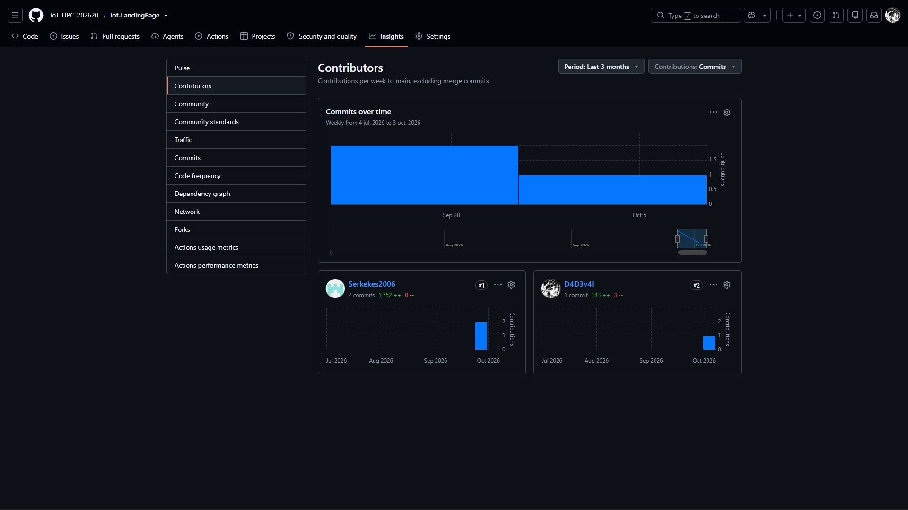
</p>

##### Frontend Web Application (`IoT-UPC-202620/FrontEnd`)

<p align="center">
  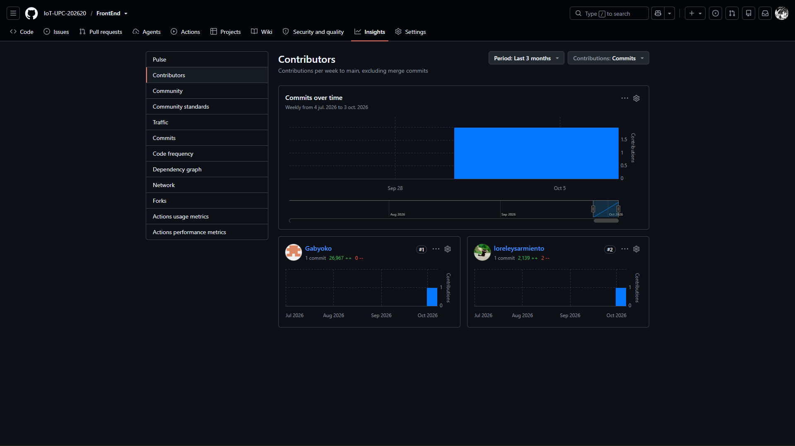
</p>


# Conclusiones
# Conclusiones y Recomendaciones

**Conclusiones**

- El diseño por bounded context aísla reglas de negocio distintas (facturación, reservas, IoT) sin que un cambio en un contexto obligue a tocar otro; la comunicación entre Reservation, Smart Lighting y IoT Access Management ocurre solo por eventos, no por acoplamiento directo.
- Separar PostgreSQL (datos transaccionales) de TimescaleDB (series de tiempo) resuelve el problema de escala de las lecturas de sensores, que crecen de forma continua y degradarían los dashboards de consumo si se consultaran contra un modelo relacional normal.
- La regla de morosidad (`ResidentMarkedDelinquent`) es un acoplamiento intencional bien resuelto: Payment decide quién es moroso y IoT Access Management actúa sobre esa decisión suspendiendo credenciales, sin que ninguno duplique la lógica del otro.

**Recomendaciones**

- Definir un límite explícito de reintentos y de tiempo para `EdgeGatewaySyncClient`: si el Edge API pierde conexión, conviene declarar cuánto tiempo es aceptable operar en modo degradado con la última lista de credenciales sincronizada.
- Formalizar un contrato de eventos versionado (Schema Registry o versión en el payload) para el Message & Event Broker, ya que varios contextos consumen los mismos eventos de Reservation y Payment; un cambio de esquema sin control rompería a todos a la vez.
- Incorporar pruebas de contrato entre publicadores y consumidores de eventos (por ejemplo `ReservationApproved` y sus consumidores) para detectar incompatibilidades antes de desplegar, ya que la comunicación asíncrona no falla en tiempo de compilación.

# Referencias Bibliográficas

  - Aguilar, K. L. B. (2026). Vacíos regulatorios en la Ley de Propiedad en Condominio, análisis de conflictos recurrentes en su modalidad vertical ubicados en el Distrito Central (Tesis doctoral). Centro Universitario Tecnológico CEUTEC. `https://repositorio.unitec.edu/server/api/core/bitstreams/cd97bbd4-204c-49c8-9901-3d0a5a85d7f3/content`
  - Condominos. (2024, 4 de noviembre). Manejo de chats de WhatsApp de vecinos en condominios. `https://www.condominos.app/sitio/detalle/OA/manejo-de-chats-de-whatsapp-de-vecinos-en-condominios`
`https://www2.deloitte.com/us/en/insights/topics/digital-transformation.html`
  - El Comercio. (2026, 3 de abril). Fallas en la gestión de edificios corporativos pueden generar sobrecostos de hasta 30%. `https://elcomercio.pe/economia/fallas-en-la-gestion-de-edificios-corporativos-pueden-generar-sobrecostos-de-hasta-30-noticia/`
  - Gestión. (2023, 12 de septiembre). Advierten que deudas por gastos en condominios llevan a inquilinos a Infocorp. `https://gestion.pe/tu-dinero/inmobiliarias/advierten-que-deudas-por-gastos-en-condominios-llevan-a-inquilinos-a-infocorp-condominios-deudas-por-pagos-de-mantenimiento-noticia/`
  - GitHub. (s.f.). `https://github.com/`
  - Instituto Nacional de Estadística e Informática (INEI). (2023). Perú: Características de las viviendas particulares y hogares. `https://www.gob.pe/institucion/inei/informes-publicaciones/4377979-las-tecnologias-de-informacion-y-comunicacion-en-los-hogares-ene-feb-mar-2023`
  - Lucidchart. (s.f.). `https://www.lucidchart.com`
  - PlantUML. (s.f.). `https://plantuml.com`
  - ProTool. (2026, 11 de marzo). Administrar un condominio por WhatsApp no es gestión, es un riesgo para la comunidad. `https://www.protool.cl/noticia_detalle.php?slug=administrar-condominios-por-whatsapp-no-es-gestion-es-riesgo`
  - Schwaber, P., & Sutherland, S. (2020). The Scrum Guide: The Definitive Guide to Scrum: The Rules of Scrum. `https://scrumguides.org/docs/scrumguide.html`
  - Sociedad Peruana de Bienes Raíces. (2024). Digitalización de edificios y condominios en Perú. `https://bienesraicess.com/blogs/digitalizacion-de-edificios-y-condominios-en-peru`
  - UXPressia. (s.f.). `https://uxpressia.com/`
  - Verastegui Leon, P. A., Mendoza Castañeda, J. L. D. C., Zapata Becerra, M. L., Capristan Leon, K. E., & Ravines Garcia, M. A. (2025). Propuesta de un plan estratégico para mejora de la Gestión en Edificios Multifamiliares en Lima Moderna: Caso De Estudio: MONARCH MANAGERS EIRL. Universidad Peruana de Ciencias Aplicadas. `https://repositorioacademico.upc.edu.pe/handle/10757/686137`

# Anexos